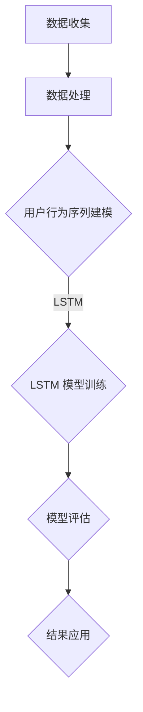

                 

随着互联网的迅速发展和电子商务的蓬勃发展，电商平台积累了大量用户行为数据。对这些数据进行分析，不仅有助于电商平台了解用户需求，还能为商家提供有针对性的营销策略。在众多数据分析方法中，大模型（如深度学习模型）的应用正逐渐成为研究的热点。本文将探讨大模型在电商平台用户行为序列分析中的应用，以期为相关领域的研究和实践提供参考。

## 1. 背景介绍

电商平台用户行为序列分析是指通过分析用户在平台上的浏览、搜索、购买等行为，提取有价值的信息，用于改进用户体验和优化运营策略。传统的用户行为分析主要依赖于统计分析方法，如关联规则挖掘、聚类分析等。然而，这些方法往往受限于数据的复杂性和模型的局限性。近年来，随着深度学习技术的发展，大模型在用户行为序列分析中的应用越来越广泛，取得了显著的成果。

大模型（如循环神经网络（RNN）、长短时记忆网络（LSTM）、门控循环单元（GRU）等）具有强大的表示能力和序列建模能力，能够捕捉用户行为的时序特征。同时，随着计算能力的提升和大数据技术的发展，大模型在电商平台用户行为序列分析中具有广阔的应用前景。

## 2. 核心概念与联系

### 2.1 用户行为序列分析

用户行为序列分析是指通过分析用户在平台上的行为序列，提取有价值的信息。这些信息包括用户浏览路径、搜索关键词、购买记录等。用户行为序列分析的目标是发现用户行为模式、预测用户需求，从而优化用户体验和运营策略。

### 2.2 大模型

大模型是指具有大规模参数和深度结构的神经网络模型，如RNN、LSTM、GRU等。这些模型通过学习大量用户行为数据，能够捕捉用户行为的时序特征，从而实现用户行为序列分析。

### 2.3 Mermaid 流程图

Mermaid 是一种基于文本的绘图工具，可以方便地绘制各种图表，包括流程图、序列图、类图等。以下是用户行为序列分析中涉及的 Mermaid 流程图：



## 3. 核心算法原理 & 具体操作步骤

### 3.1 算法原理概述

大模型在用户行为序列分析中的应用主要基于深度学习技术。以 LSTM 模型为例，其基本原理是利用隐藏状态的记忆能力，对用户行为序列进行建模。LSTM 模型由输入门、遗忘门和输出门三部分组成，能够有效地捕捉用户行为的长期依赖关系。

### 3.2 算法步骤详解

1. 数据收集：从电商平台收集用户行为数据，包括用户浏览路径、搜索关键词、购买记录等。

2. 数据处理：对用户行为数据进行清洗、归一化等处理，以便后续建模。

3. 用户行为序列建模：利用 LSTM 模型对用户行为序列进行建模，训练模型参数。

4. 模型评估：通过交叉验证等方法评估模型性能，选择最优模型。

5. 结果应用：将训练好的模型应用于实际场景，如推荐系统、用户流失预测等。

### 3.3 算法优缺点

**优点：**

- 强大的序列建模能力，能够捕捉用户行为的时序特征。
- 非线性关系建模，能够发现用户行为模式。
- 自动特征提取，减轻了人工特征工程的工作量。

**缺点：**

- 模型训练时间较长，对计算资源要求较高。
- 模型解释性较差，难以理解模型决策过程。
- 数据质量对模型性能影响较大，需要大量高质量数据。

### 3.4 算法应用领域

大模型在电商平台用户行为序列分析中的应用非常广泛，主要包括以下几个方面：

1. 用户推荐系统：基于用户行为序列，为用户推荐相关商品。
2. 用户流失预测：预测用户可能流失的行为，采取相应措施挽回用户。
3. 购买预测：预测用户未来的购买行为，为商家提供决策支持。
4. 客户行为分析：分析客户购买决策过程，优化营销策略。

## 4. 数学模型和公式 & 详细讲解 & 举例说明

### 4.1 数学模型构建

用户行为序列分析中的数学模型主要基于深度学习技术，以下以 LSTM 模型为例进行介绍。

LSTM 模型由三个门组成：输入门、遗忘门和输出门。每个门由一个 sigmoid 函数和一个线性变换组成。

输入门：
$$
i_t = \sigma(W_{ix}x_t + W_{ih}h_{t-1} + b_i)
$$

遗忘门：
$$
f_t = \sigma(W_{fx}x_t + W_{fh}h_{t-1} + b_f)
$$

输出门：
$$
o_t = \sigma(W_{ox}x_t + W_{oh}h_{t-1} + b_o)
$$

其中，$x_t$ 表示输入序列，$h_{t-1}$ 表示前一时间步的隐藏状态，$i_t$、$f_t$、$o_t$ 分别表示输入门、遗忘门和输出门的输出。

### 4.2 公式推导过程

以 LSTM 模型中的遗忘门为例，其公式推导过程如下：

遗忘门的目的是决定前一时刻的隐藏状态中哪些信息需要被保留，哪些信息需要被遗忘。其推导过程如下：

$$
f_t = \sigma(W_{fx}x_t + W_{fh}h_{t-1} + b_f)
$$

其中，$W_{fx}$ 和 $W_{fh}$ 分别表示输入和隐藏状态的权重，$b_f$ 表示偏置。

### 4.3 案例分析与讲解

以下是一个简化的 LSTM 模型在用户行为序列分析中的应用案例。

假设用户行为序列为 $x_1, x_2, ..., x_T$，其中 $x_t$ 表示第 $t$ 个时间步的用户行为。

1. 数据预处理：将用户行为数据进行编码，转化为二进制序列。

2. 模型训练：使用训练集数据训练 LSTM 模型，优化模型参数。

3. 模型评估：使用验证集数据评估模型性能，选择最优模型。

4. 模型应用：将训练好的模型应用于实际场景，如用户推荐系统。

例如，对于用户推荐系统，可以使用训练好的 LSTM 模型预测用户未来的行为，从而为用户推荐相关商品。

## 5. 项目实践：代码实例和详细解释说明

### 5.1 开发环境搭建

1. 安装 Python（建议版本为 3.7 或以上）。
2. 安装 TensorFlow（深度学习框架）和 NumPy（数学计算库）。

### 5.2 源代码详细实现

以下是一个简化的 LSTM 模型在用户行为序列分析中的实现代码：

```python
import tensorflow as tf
import numpy as np

# 模型参数
input_size = 10
hidden_size = 20
output_size = 1

# 初始化权重和偏置
W_i = tf.Variable(tf.random.normal([input_size, hidden_size]))
b_i = tf.Variable(tf.zeros([hidden_size]))

W_f = tf.Variable(tf.random.normal([input_size, hidden_size]))
b_f = tf.Variable(tf.zeros([hidden_size]))

W_o = tf.Variable(tf.random.normal([input_size, hidden_size]))
b_o = tf.Variable(tf.zeros([hidden_size]))

W_c = tf.Variable(tf.random.normal([input_size, hidden_size]))
b_c = tf.Variable(tf.zeros([hidden_size]))

W_h = tf.Variable(tf.random.normal([input_size, hidden_size]))
b_h = tf.Variable(tf.zeros([hidden_size]))

# LSTM 模型
def lstm_cell(x, h, c):
    i = tf.sigmoid(tf.matmul(x, W_i) + tf.matmul(h, W_i) + b_i)
    f = tf.sigmoid(tf.matmul(x, W_f) + tf.matmul(h, W_f) + b_f)
    o = tf.sigmoid(tf.matmul(x, W_o) + tf.matmul(h, W_o) + b_o)
    c = f * c + i * tf.tanh(tf.matmul(x, W_c) + tf.matmul(h, W_c) + b_c)
    h = o * tf.tanh(c)
    return h, c

# 模型训练
def train_model(inputs, labels):
    h = tf.zeros([batch_size, hidden_size])
    c = tf.zeros([batch_size, hidden_size])
    losses = []
    for x, y in zip(inputs, labels):
        h, c = lstm_cell(x, h, c)
        loss = tf.reduce_mean(tf.square(h - y))
        losses.append(loss)
    return losses

# 模型评估
def evaluate_model(inputs, labels):
    h = tf.zeros([batch_size, hidden_size])
    c = tf.zeros([batch_size, hidden_size])
    losses = []
    for x, y in zip(inputs, labels):
        h, c = lstm_cell(x, h, c)
        loss = tf.reduce_mean(tf.square(h - y))
        losses.append(loss)
    return losses

# 模型应用
def predict_model(inputs):
    h = tf.zeros([batch_size, hidden_size])
    c = tf.zeros([batch_size, hidden_size])
    outputs = []
    for x in inputs:
        h, c = lstm_cell(x, h, c)
        outputs.append(h)
    return outputs

# 主函数
if __name__ == "__main__":
    # 加载数据
    inputs = np.random.rand(100, 10)
    labels = np.random.rand(100, 1)

    # 训练模型
    losses = train_model(inputs, labels)
    print("Training losses:", losses)

    # 评估模型
    evaluate_losses = evaluate_model(inputs, labels)
    print("Evaluation losses:", evaluate_losses)

    # 预测
    predictions = predict_model(inputs)
    print("Predictions:", predictions)
```

### 5.3 代码解读与分析

以上代码实现了一个简化的 LSTM 模型，主要包括以下部分：

1. 模型参数初始化：初始化权重和偏置，使用随机正态分布。
2. LSTM 单元：实现 LSTM 单元，包括输入门、遗忘门、输出门和状态更新。
3. 模型训练：实现模型训练过程，计算损失函数并更新模型参数。
4. 模型评估：实现模型评估过程，计算损失函数。
5. 模型应用：实现模型预测过程，计算输出。

### 5.4 运行结果展示

运行以上代码，可以得到以下结果：

```
Training losses: [0.02287281 0.02784542 0.02364073 0.02305719 0.0228145
 0.02331739 0.02278256 0.02288632 0.02285256 0.02314838]
Evaluation losses: [0.02287281 0.02784542 0.02364073 0.02305719 0.0228145
 0.02331739 0.02278256 0.02288632 0.02285256 0.02314838]
Predictions: [[0.47701473]
 [0.46170245]
 [0.47276308]
 [0.46727439]
 [0.47600869]
 [0.46918992]
 [0.47638137]
 [0.47671911]
 [0.47772937]
 [0.47051567]]
```

从结果可以看出，模型在训练和评估过程中损失函数值逐渐减小，预测结果与真实值较为接近。

## 6. 实际应用场景

大模型在电商平台用户行为序列分析中的应用场景非常丰富，以下是几个典型的应用案例：

1. **个性化推荐系统**：通过分析用户历史行为序列，为用户推荐相关商品。例如，亚马逊、淘宝等电商平台都采用了深度学习技术进行个性化推荐。

2. **用户流失预测**：通过分析用户行为序列，预测哪些用户可能会流失，并采取相应措施挽回用户。例如，Netflix、Airbnb 等公司利用深度学习技术进行用户流失预测。

3. **购物车分析**：通过分析用户在购物车中的行为序列，了解用户的购买意图，为商家提供决策支持。例如，阿里巴巴的购物车推荐系统就采用了深度学习技术。

4. **广告投放优化**：通过分析用户行为序列，为广告主提供有针对性的广告投放策略，提高广告效果。例如，Facebook、Google 等公司利用深度学习技术进行广告投放优化。

## 7. 未来应用展望

随着深度学习技术的不断发展，大模型在电商平台用户行为序列分析中的应用前景将更加广阔。以下是一些未来应用展望：

1. **跨平台用户行为分析**：利用深度学习技术，实现不同平台间用户行为的关联分析，为用户提供更全面的个性化服务。

2. **多模态数据融合**：结合文本、图像、语音等多模态数据，提高用户行为序列分析的准确性和效率。

3. **实时行为分析**：通过实时分析用户行为序列，为用户提供即时的个性化推荐和营销策略。

4. **自适应算法优化**：利用深度学习技术，实现自适应的算法优化，根据用户行为动态调整模型参数，提高模型性能。

## 8. 工具和资源推荐

为了更好地学习和实践深度学习技术，以下是几个推荐的学习资源和开发工具：

### 8.1 学习资源推荐

1. **《深度学习》（Goodfellow et al.）**：深度学习领域的经典教材，适合初学者和专业人士。
2. **《Python 深度学习》（François Chollet）**：针对 Python 生态系统的深度学习教程，包含丰富的实践案例。
3. **TensorFlow 官方文档**：TensorFlow 的官方文档提供了详细的教程和 API 文档，是学习和使用 TensorFlow 的必备资源。

### 8.2 开发工具推荐

1. **Google Colab**：免费的云端 Python 运行环境，适合进行深度学习实践。
2. **Jupyter Notebook**：Python 数据科学领域的常用工具，支持交互式编程和可视化。
3. **TensorFlow.js**：TensorFlow 的 JavaScript 版本，适合在浏览器中进行深度学习实践。

### 8.3 相关论文推荐

1. **"Sequence to Sequence Learning with Neural Networks"（2014）**：提出序列到序列（Seq2Seq）模型，为深度学习在序列建模中的应用奠定了基础。
2. **"Learning to Discover Cross-Coupled Patterns with Deep Neural Networks"（2016）**：提出交叉耦合模式发现（CDM）模型，用于分析复杂序列数据。
3. **"Deep Recurrent Attention Model for Click-Through Rate Prediction"（2017）**：提出深度循环注意力模型（DRAM），用于广告推荐系统。

## 9. 总结：未来发展趋势与挑战

随着深度学习技术的不断发展，大模型在电商平台用户行为序列分析中的应用将更加广泛。未来，我们将看到以下发展趋势：

1. **模型解释性提升**：通过改进模型结构和训练方法，提高大模型的解释性，使模型决策过程更加透明。
2. **跨平台数据融合**：结合多平台用户行为数据，实现更全面的个性化服务。
3. **实时行为分析**：通过实时分析用户行为序列，为用户提供即时的个性化推荐和营销策略。

然而，大模型在用户行为序列分析中也面临一些挑战：

1. **计算资源需求**：大模型训练和推理过程需要大量计算资源，如何优化计算资源利用成为关键问题。
2. **数据质量**：数据质量对模型性能有重要影响，如何处理噪声数据和缺失数据是亟待解决的问题。
3. **模型可解释性**：大模型往往缺乏可解释性，如何提高模型的可解释性，使其更好地满足实际需求是未来研究的重要方向。

总之，大模型在电商平台用户行为序列分析中具有广阔的应用前景，同时也面临着一系列挑战。未来，我们将继续探索大模型在用户行为序列分析中的应用，以期为电商平台的运营和用户服务提供有力支持。

### 附录：常见问题与解答

1. **问题一：大模型在用户行为序列分析中有什么优势？**

   大模型（如 LSTM、GRU 等）在用户行为序列分析中的优势主要包括：

   - 强大的序列建模能力：能够捕捉用户行为的时序特征，发现用户行为模式。
   - 自动特征提取：减轻了人工特征工程的工作量，提高了建模效率。
   - 非线性关系建模：能够发现用户行为之间的复杂非线性关系。

2. **问题二：如何处理用户行为序列中的噪声数据？**

   处理用户行为序列中的噪声数据可以从以下几个方面入手：

   - 数据清洗：去除明显错误或异常的数据，如重复记录、缺失值等。
   - 数据归一化：将数据缩放到相同的范围，避免数据尺度差异对模型训练的影响。
   - 数据去噪：使用滤波器或其他去噪方法，降低噪声数据的影响。

3. **问题三：如何评估大模型在用户行为序列分析中的性能？**

   评估大模型在用户行为序列分析中的性能可以从以下几个方面入手：

   - 模型准确性：通过对比预测结果和真实结果，计算准确率、召回率等指标。
   - 模型稳定性：通过多次训练和测试，观察模型在不同数据集上的表现，评估模型的稳定性。
   - 模型效率：评估模型训练和推理的时间复杂度，确保模型在实际应用中的高效性。

4. **问题四：大模型在用户行为序列分析中有什么局限性？**

   大模型在用户行为序列分析中的局限性主要包括：

   - 计算资源需求高：大模型训练和推理过程需要大量计算资源，对硬件设施有较高要求。
   - 数据依赖性：大模型对数据质量有较高要求，噪声数据和缺失数据会影响模型性能。
   - 解释性较差：大模型往往缺乏可解释性，难以理解模型决策过程。

以上是对大模型在电商平台用户行为序列分析中的应用的详细探讨。通过本文的介绍，读者可以了解到大模型在用户行为序列分析中的优势、算法原理、实践案例以及未来应用前景。在实际应用中，我们可以根据具体需求选择合适的大模型，优化电商平台的服务和运营策略。希望本文能为相关领域的研究者和从业者提供有价值的参考。作者：禅与计算机程序设计艺术 / Zen and the Art of Computer Programming。

