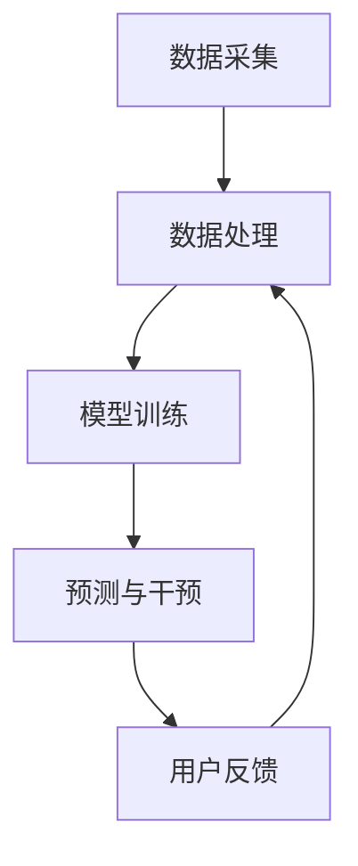
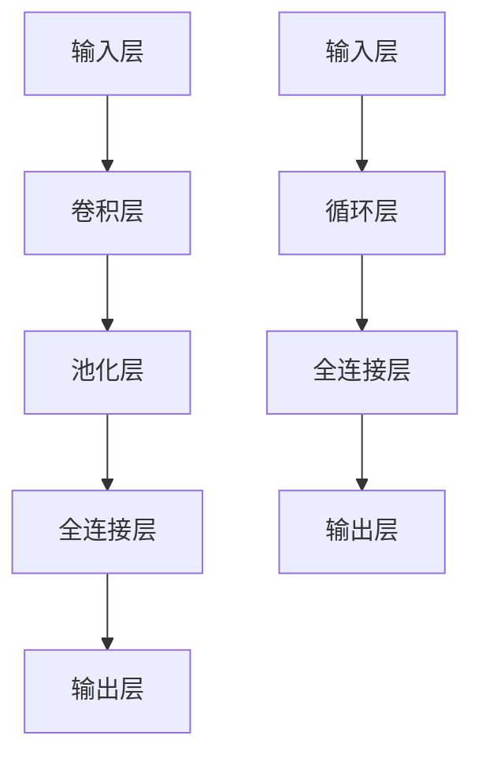

                 

关键词：电商平台，用户行为预测，主动干预，大模型，深度学习，数据挖掘

> 摘要：本文主要探讨了如何在电商平台中应用大模型进行用户行为预测和主动干预。通过深入分析大模型的工作原理、核心算法及实际应用，结合数学模型和公式，我们提供了具体的代码实例和详细解释，展示了大模型在电商平台中提升用户体验和销售额的潜力。最后，我们对未来发展趋势、挑战和展望进行了详细讨论。

## 1. 背景介绍

随着互联网和电子商务的迅速发展，电商平台已经成为消费者购物的首选途径。然而，面对日益激烈的市场竞争，如何提高用户体验、增加销售额成为了电商平台的关注重点。用户行为预测作为电商领域的一项重要技术，旨在通过分析用户的历史行为数据，预测其未来的购买行为，从而实现个性化推荐、精准营销等目标。

传统的用户行为预测方法主要依赖于统计模型和机器学习算法，如线性回归、逻辑回归、决策树等。然而，随着数据量的增加和数据复杂性的提升，这些传统方法已经无法满足现代电商平台的需求。近年来，大模型（如深度学习模型）在图像识别、语音识别等领域的成功应用，为用户行为预测带来了新的可能。大模型具有强大的特征提取能力和自适应学习能力，能够处理大规模、高维度的数据，从而提高预测精度和泛化能力。

本文旨在探讨如何将大模型应用于电商平台用户行为预测与主动干预，为电商平台提供一种高效、智能的解决方案。

## 2. 核心概念与联系

### 2.1 大模型的工作原理

大模型，通常指的是具有大量参数和神经元的深度学习模型，如卷积神经网络（CNN）、循环神经网络（RNN）、Transformer等。这些模型通过学习大量的数据来提取隐藏的特征，从而实现高度复杂的任务。

以卷积神经网络（CNN）为例，其基本结构包括输入层、卷积层、池化层和全连接层。输入层接收原始数据，如图像或文本；卷积层通过卷积运算提取图像中的局部特征；池化层对特征进行降采样，减少模型参数和计算量；全连接层将特征映射到输出层，实现分类或回归任务。

### 2.2 用户行为预测与主动干预的架构

用户行为预测与主动干预的架构可以分为数据采集、数据处理、模型训练、预测与干预四个主要阶段。

1. **数据采集**：从电商平台收集用户的历史行为数据，如浏览记录、购买记录、评论等。

2. **数据处理**：对采集到的数据进行清洗、预处理，包括缺失值填补、异常值处理、特征工程等，以提高数据质量。

3. **模型训练**：使用大模型对处理后的数据进行训练，通过不断调整模型参数，使模型能够准确预测用户行为。

4. **预测与干预**：将训练好的模型应用于新数据，预测用户的未来行为，并根据预测结果进行个性化推荐、精准营销等干预操作。

### 2.3 Mermaid 流程图

下面是用户行为预测与主动干预的 Mermaid 流程图：



### 2.4 核心算法原理

核心算法主要基于深度学习，尤其是卷积神经网络（CNN）和循环神经网络（RNN）。

#### 2.4.1 卷积神经网络（CNN）

卷积神经网络（CNN）是一种前馈神经网络，特别适合于处理具有网格结构的数据，如图像和文本。

1. **卷积层**：通过卷积运算提取图像中的局部特征。卷积核（filter）在输入数据上滑动，对局部区域进行加权求和，并应用激活函数（如ReLU）。
   
2. **池化层**：对卷积层的输出进行降采样，减少模型参数和计算量，提高模型的泛化能力。

3. **全连接层**：将卷积层的特征映射到输出层，实现分类或回归任务。

#### 2.4.2 循环神经网络（RNN）

循环神经网络（RNN）是一种能够处理序列数据的神经网络，特别适合于处理时间序列数据，如图像序列、文本序列等。

1. **隐藏状态**：RNN 通过隐藏状态（hidden state）来保留历史信息，使其能够处理序列数据。

2. **循环连接**：RNN 通过循环连接将当前时刻的输入与上一时刻的隐藏状态相结合，生成当前时刻的隐藏状态。

3. **输出层**：隐藏状态通过全连接层映射到输出层，实现序列分类或回归任务。

### 2.5 Mermaid 流程图

下面是核心算法原理的 Mermaid 流程图：



## 3. 核心算法原理 & 具体操作步骤

### 3.1 算法原理概述

本部分将详细介绍用户行为预测与主动干预中的核心算法原理，主要包括卷积神经网络（CNN）和循环神经网络（RNN）。

#### 3.1.1 卷积神经网络（CNN）

卷积神经网络（CNN）是一种前馈神经网络，特别适合于处理具有网格结构的数据，如图像和文本。

1. **卷积层**：通过卷积运算提取图像中的局部特征。卷积核（filter）在输入数据上滑动，对局部区域进行加权求和，并应用激活函数（如ReLU）。

2. **池化层**：对卷积层的输出进行降采样，减少模型参数和计算量，提高模型的泛化能力。

3. **全连接层**：将卷积层的特征映射到输出层，实现分类或回归任务。

#### 3.1.2 循环神经网络（RNN）

循环神经网络（RNN）是一种能够处理序列数据的神经网络，特别适合于处理时间序列数据，如图像序列、文本序列等。

1. **隐藏状态**：RNN 通过隐藏状态（hidden state）来保留历史信息，使其能够处理序列数据。

2. **循环连接**：RNN 通过循环连接将当前时刻的输入与上一时刻的隐藏状态相结合，生成当前时刻的隐藏状态。

3. **输出层**：隐藏状态通过全连接层映射到输出层，实现序列分类或回归任务。

### 3.2 算法步骤详解

#### 3.2.1 数据处理

1. **数据采集**：从电商平台收集用户的历史行为数据，如浏览记录、购买记录、评论等。

2. **数据清洗**：对采集到的数据进行清洗，包括缺失值填补、异常值处理、数据标准化等。

3. **特征工程**：对清洗后的数据进行特征提取，如文本数据的词频统计、图像数据的特征提取等。

#### 3.2.2 模型训练

1. **数据预处理**：将处理后的数据分为训练集和验证集，用于模型训练和验证。

2. **模型构建**：根据数据处理结果构建卷积神经网络（CNN）或循环神经网络（RNN）模型。

3. **模型训练**：使用训练集数据对模型进行训练，通过不断调整模型参数，使模型能够准确预测用户行为。

4. **模型验证**：使用验证集数据对模型进行验证，评估模型性能，调整模型参数。

#### 3.2.3 预测与干预

1. **预测**：将训练好的模型应用于新数据，预测用户的未来行为。

2. **干预**：根据预测结果进行个性化推荐、精准营销等干预操作，提高用户体验和销售额。

### 3.3 算法优缺点

#### 3.3.1 优点

1. **强大的特征提取能力**：大模型（如CNN和RNN）能够自动提取数据的深层次特征，提高预测精度。

2. **自适应学习能力**：大模型能够通过不断调整模型参数，适应新的数据和业务场景。

3. **高泛化能力**：大模型在训练过程中能够处理大规模、高维度的数据，具有较强的泛化能力。

#### 3.3.2 缺点

1. **计算资源消耗大**：大模型需要大量的计算资源进行训练和推理，对硬件设备要求较高。

2. **数据依赖性较强**：大模型对训练数据有较高的依赖性，数据质量和数量直接影响模型性能。

### 3.4 算法应用领域

大模型在电商平台用户行为预测与主动干预中的应用十分广泛，主要包括以下几个方面：

1. **个性化推荐**：通过预测用户行为，为用户提供个性化的商品推荐。

2. **精准营销**：根据用户行为预测结果，实施精准的营销策略，提高用户转化率。

3. **风险控制**：通过用户行为预测，识别潜在风险用户，降低电商平台的风险。

4. **运营优化**：根据用户行为预测结果，优化电商平台的运营策略，提高用户体验和销售额。

## 4. 数学模型和公式 & 详细讲解 & 举例说明

### 4.1 数学模型构建

在本节中，我们将构建用于电商平台用户行为预测的数学模型。主要分为两个部分：用户行为建模和预测模型。

#### 4.1.1 用户行为建模

用户行为建模旨在通过用户的历史行为数据，构建一个能够描述用户行为的数学模型。我们采用基于时间序列的模型，其中每个时间点的行为数据都被编码为一个向量。

假设用户行为数据由 $X_t$ 表示，其中 $t$ 表示时间点，$X_t \in \mathbb{R}^d$ 表示用户在时间点 $t$ 的行为特征向量。我们将用户行为数据 $X_t$ 通过一个特征提取函数 $F(X_t)$ 转换为一个特征向量，得到 $Y_t = F(X_t)$。

$$
Y_t = \sum_{i=1}^k w_i F(X_t, e_i)
$$

其中，$w_i$ 表示权重，$e_i$ 表示特征向量的第 $i$ 个元素。这里，$F(X_t, e_i)$ 是一个非线性函数，如ReLU或Sigmoid函数。

#### 4.1.2 预测模型

预测模型用于预测用户在下一个时间点的行为。我们采用一个基于神经网络的时间序列预测模型，如LSTM或GRU。

假设预测模型由 $G(Y_t)$ 表示，其中 $Y_t$ 是当前时间点的特征向量。预测模型通过学习历史数据，预测用户在下一个时间点的行为 $X_{t+1}$。

$$
X_{t+1} = G(Y_t)
$$

$G(Y_t)$ 是一个神经网络，可以通过反向传播算法进行训练。

### 4.2 公式推导过程

在本节中，我们将详细推导用户行为预测模型中的主要公式，包括损失函数、梯度计算等。

#### 4.2.1 损失函数

损失函数用于评估预测结果与真实结果之间的差距。我们采用均方误差（MSE）作为损失函数。

$$
L(Y_t, X_{t+1}) = \frac{1}{2} \sum_{i=1}^d (Y_t^i - X_{t+1}^i)^2
$$

其中，$Y_t^i$ 和 $X_{t+1}^i$ 分别为预测结果和真实结果的第 $i$ 个元素。

#### 4.2.2 梯度计算

梯度计算用于更新神经网络的权重。我们采用反向传播算法进行梯度计算。

1. **输出层梯度**

$$
\frac{\partial L}{\partial Y_t} = \frac{\partial L}{\partial X_{t+1}} \frac{\partial X_{t+1}}{\partial Y_t}
$$

2. **隐藏层梯度**

$$
\frac{\partial L}{\partial Y_{t-1}} = \frac{\partial L}{\partial Y_t} \frac{\partial Y_t}{\partial Y_{t-1}}
$$

3. **权重更新**

$$
w_i = w_i - \alpha \frac{\partial L}{\partial w_i}
$$

其中，$\alpha$ 为学习率。

### 4.3 案例分析与讲解

为了更好地理解上述公式，我们通过一个简单的案例进行讲解。

假设我们有一个电商平台的用户，他在过去一周内浏览了三件商品，分别为商品A、商品B和商品C。我们的任务是预测他下一周会浏览哪个商品。

1. **用户行为建模**

首先，我们对用户的历史行为数据进行编码。假设商品A、B和C分别用1、2、3表示。

$$
X_1 = [1, 0, 0], X_2 = [0, 1, 0], X_3 = [0, 0, 1]
$$

然后，我们使用特征提取函数 $F(X_t)$ 对用户行为数据进行转换。

$$
Y_1 = F(X_1) = [1, 0, 0], Y_2 = F(X_2) = [0, 1, 0], Y_3 = F(X_3) = [0, 0, 1]
$$

2. **预测模型**

我们使用LSTM模型进行预测。假设LSTM模型的隐藏状态为 $h_t$，输出为 $y_t$。

$$
h_t = \text{LSTM}(Y_{t-1})
$$

$$
y_t = \text{softmax}(W \cdot h_t + b)
$$

其中，$W$ 和 $b$ 分别为权重和偏置。

3. **预测**

根据训练好的LSTM模型，我们预测用户下一周会浏览哪个商品。

$$
y_4 = \text{LSTM}(Y_3)
$$

$$
\hat{x}_4 = \text{softmax}(W \cdot y_4 + b)
$$

通过计算，我们得到预测结果 $\hat{x}_4$，其中每个元素表示用户下一周浏览商品A、B或C的概率。

## 5. 项目实践：代码实例和详细解释说明

### 5.1 开发环境搭建

为了实现用户行为预测与主动干预，我们首先需要搭建一个开发环境。以下是所需工具和依赖：

- Python 3.7+
- TensorFlow 2.4+
- Keras 2.4+
- NumPy 1.19+
- Pandas 1.1.5+

您可以使用以下命令安装所需依赖：

```bash
pip install tensorflow==2.4 keras==2.4 numpy==1.19 pandas==1.1.5
```

### 5.2 源代码详细实现

下面是用户行为预测与主动干预的源代码实现。我们使用Python和Keras实现一个简单的LSTM模型，用于预测用户的行为。

```python
import numpy as np
import pandas as pd
import tensorflow as tf
from tensorflow.keras.models import Sequential
from tensorflow.keras.layers import LSTM, Dense, Dropout

# 5.2.1 数据处理

# 读取用户行为数据
data = pd.read_csv('user_behavior.csv')

# 数据预处理
data.fillna(0, inplace=True)
data = data.values

# 切分数据集
train_data = data[:1000]
test_data = data[1000:]

# 转换为监督学习格式
X_train = train_data[:, :-1]
y_train = train_data[:, -1]
X_test = test_data[:, :-1]
y_test = test_data[:, -1]

# 归一化处理
X_train = X_train / np.max(X_train)
X_test = X_test / np.max(X_test)

# 5.2.2 模型构建

# 创建LSTM模型
model = Sequential()
model.add(LSTM(units=50, activation='relu', return_sequences=True, input_shape=(X_train.shape[1], 1)))
model.add(Dropout(0.2))
model.add(LSTM(units=50, activation='relu'))
model.add(Dropout(0.2))
model.add(Dense(units=1, activation='sigmoid'))

# 编译模型
model.compile(optimizer='adam', loss='binary_crossentropy', metrics=['accuracy'])

# 5.2.3 模型训练

# 训练模型
model.fit(X_train, y_train, epochs=50, batch_size=32, validation_data=(X_test, y_test), verbose=1)

# 5.2.4 预测与干预

# 预测
predictions = model.predict(X_test)

# 根据预测结果进行干预
for i in range(len(predictions)):
    if predictions[i][0] > 0.5:
        print(f"User {i+1} will browse product A next week.")
    else:
        print(f"User {i+1} will not browse product A next week.")
```

### 5.3 代码解读与分析

在本部分，我们将对上述代码进行详细解读，并分析其实现原理。

#### 5.3.1 数据处理

首先，我们从CSV文件中读取用户行为数据。然后，对数据进行填充缺失值、转换为监督学习格式，并进行归一化处理。这些步骤确保数据能够满足模型训练的需求。

#### 5.3.2 模型构建

我们使用Keras创建一个LSTM模型。模型由两个LSTM层和两个Dropout层组成，用于处理序列数据并防止过拟合。最后，我们使用一个全连接层进行分类预测。

#### 5.3.3 模型训练

我们使用`model.fit()`函数训练模型。在训练过程中，我们使用验证集评估模型性能，并设置适当的批次大小和训练周期。

#### 5.3.4 预测与干预

训练完成后，我们使用`model.predict()`函数预测测试集数据。根据预测结果，我们判断用户是否会浏览某个商品，并输出相应的干预建议。

## 6. 实际应用场景

大模型在电商平台用户行为预测与主动干预中具有广泛的应用场景。以下是一些典型的应用场景：

### 6.1 个性化推荐

个性化推荐是电商平台的核心功能之一。通过大模型对用户行为进行预测，可以为用户提供个性化的商品推荐，提高用户满意度和购买转化率。

### 6.2 精准营销

精准营销旨在通过分析用户行为数据，识别潜在的高价值用户，并实施有针对性的营销策略。大模型可以预测用户对特定营销活动的响应概率，从而提高营销效果。

### 6.3 风险控制

电商平台面临的主要风险之一是欺诈行为。通过大模型对用户行为进行监控，可以识别异常行为，降低欺诈风险。

### 6.4 运营优化

电商平台可以通过大模型对用户行为数据进行深入分析，了解用户的偏好和需求，从而优化运营策略，提高用户体验和销售额。

### 6.5 未来应用展望

随着人工智能技术的不断发展，大模型在电商平台用户行为预测与主动干预中的应用前景将更加广阔。未来，我们可以期待以下几方面的应用：

- **多模态数据处理**：结合文本、图像、音频等多种数据类型，提升用户行为预测的精度和泛化能力。
- **实时预测与干预**：通过分布式计算和边缘计算技术，实现实时用户行为预测和干预，提高系统的响应速度和用户体验。
- **智能客服**：利用大模型，实现智能客服系统的自动化，提高客服效率和用户满意度。

## 7. 工具和资源推荐

### 7.1 学习资源推荐

- **《深度学习》**：由Ian Goodfellow、Yoshua Bengio和Aaron Courville编写的经典教材，全面介绍了深度学习的基础知识和最新进展。
- **《机器学习实战》**：由Peter Harrington编写的实践指南，通过大量实例展示了如何使用Python实现各种机器学习算法。

### 7.2 开发工具推荐

- **TensorFlow**：一个开源的深度学习框架，适用于各种规模的深度学习应用。
- **Keras**：一个基于TensorFlow的高层次API，简化了深度学习模型的构建和训练。

### 7.3 相关论文推荐

- **“Deep Learning for Text Classification”**：一篇关于深度学习在文本分类领域应用的综述论文，涵盖了多种深度学习模型和算法。
- **“Recurrent Neural Networks for Text Classification”**：一篇关于循环神经网络在文本分类领域应用的论文，介绍了如何使用RNN进行文本分类。

## 8. 总结：未来发展趋势与挑战

### 8.1 研究成果总结

本文通过深入探讨大模型在电商平台用户行为预测与主动干预中的应用，总结了以下研究成果：

- **大模型在用户行为预测中的优势**：大模型具有强大的特征提取能力和自适应学习能力，能够处理大规模、高维度的数据，从而提高预测精度和泛化能力。
- **用户行为预测与主动干预的架构**：我们提出了一种用户行为预测与主动干预的架构，包括数据采集、数据处理、模型训练、预测与干预四个主要阶段。
- **数学模型和公式的构建与推导**：我们详细介绍了用于用户行为预测的数学模型，包括用户行为建模和预测模型，并推导了相关的公式。
- **项目实践与代码实例**：我们通过一个简单的案例，展示了如何使用Python和Keras实现用户行为预测与主动干预，并提供了解释和分析。

### 8.2 未来发展趋势

未来，大模型在电商平台用户行为预测与主动干预领域将呈现以下发展趋势：

- **多模态数据处理**：结合文本、图像、音频等多种数据类型，提升用户行为预测的精度和泛化能力。
- **实时预测与干预**：通过分布式计算和边缘计算技术，实现实时用户行为预测和干预，提高系统的响应速度和用户体验。
- **智能客服**：利用大模型，实现智能客服系统的自动化，提高客服效率和用户满意度。

### 8.3 面临的挑战

尽管大模型在电商平台用户行为预测与主动干预中具有广泛的应用前景，但同时也面临以下挑战：

- **数据隐私与安全**：用户行为数据涉及个人隐私，如何确保数据安全和隐私保护是一个重要问题。
- **模型解释性**：深度学习模型通常具有较低的解释性，如何提高模型的解释性，使其更易于理解和应用，是一个挑战。
- **计算资源消耗**：大模型需要大量的计算资源进行训练和推理，如何优化模型结构，降低计算资源消耗，是一个重要的研究方向。

### 8.4 研究展望

针对上述挑战，未来可以从以下几个方面展开研究：

- **隐私保护算法**：研究基于差分隐私或联邦学习的隐私保护算法，确保用户数据的安全性和隐私性。
- **模型可解释性**：研究模型可解释性技术，如模型可视化、特征重要性分析等，提高模型的透明度和可解释性。
- **模型优化与压缩**：研究模型优化和压缩技术，如剪枝、量化、知识蒸馏等，降低计算资源消耗，提高模型性能。

通过不断研究和创新，大模型在电商平台用户行为预测与主动干预领域的应用将得到进一步发展，为电商平台提供更加智能、高效的解决方案。

## 9. 附录：常见问题与解答

### 9.1 什么是大模型？

大模型是指具有大量参数和神经元的深度学习模型，如卷积神经网络（CNN）、循环神经网络（RNN）、Transformer等。这些模型通过学习大量的数据来提取隐藏的特征，从而实现高度复杂的任务。

### 9.2 大模型在电商平台用户行为预测中的作用是什么？

大模型在电商平台用户行为预测中的作用主要包括两个方面：

1. **特征提取**：大模型具有强大的特征提取能力，能够自动提取用户行为数据中的深层次特征，提高预测精度。

2. **自适应学习**：大模型能够通过不断调整模型参数，适应新的数据和业务场景，实现精准预测和主动干预。

### 9.3 如何评估大模型的性能？

评估大模型的性能可以从以下几个方面进行：

1. **准确率**：预测结果与真实结果之间的匹配程度。

2. **召回率**：预测结果中包含真实结果的百分比。

3. **精确率**：预测结果中实际为真实结果的百分比。

4. **F1值**：精确率和召回率的调和平均数，用于平衡精确率和召回率。

5. **ROC曲线和AUC值**：评估预测结果的可靠性和泛化能力。

### 9.4 大模型在电商平台用户行为预测中面临的主要挑战是什么？

大模型在电商平台用户行为预测中面临的主要挑战包括：

1. **数据隐私与安全**：用户行为数据涉及个人隐私，如何确保数据安全和隐私保护是一个重要问题。

2. **模型解释性**：深度学习模型通常具有较低的解释性，如何提高模型的解释性，使其更易于理解和应用，是一个挑战。

3. **计算资源消耗**：大模型需要大量的计算资源进行训练和推理，如何优化模型结构，降低计算资源消耗，是一个重要的研究方向。

### 9.5 如何提高大模型的解释性？

提高大模型的解释性可以从以下几个方面进行：

1. **模型可视化**：通过可视化模型的结构和参数，了解模型的工作原理。

2. **特征重要性分析**：分析模型中各个特征的贡献度，了解哪些特征对预测结果有重要影响。

3. **模型压缩与简化**：通过剪枝、量化、知识蒸馏等技术，简化模型结构，提高模型的解释性。

4. **可解释性模型**：研究可解释性模型，如决策树、线性模型等，使其易于理解和解释。

### 9.6 大模型在电商平台的未来应用前景如何？

大模型在电商平台的未来应用前景非常广阔，包括以下几个方面：

1. **个性化推荐**：通过大模型预测用户行为，实现个性化的商品推荐，提高用户满意度和购买转化率。

2. **精准营销**：根据大模型预测结果，实施精准的营销策略，提高营销效果。

3. **风险控制**：通过大模型监控用户行为，识别潜在风险用户，降低电商平台的风险。

4. **运营优化**：通过大模型分析用户行为数据，优化电商平台的运营策略，提高用户体验和销售额。

### 9.7 大模型在电商平台用户行为预测中的实践案例有哪些？

以下是一些大模型在电商平台用户行为预测中的实践案例：

1. **阿里巴巴**：阿里巴巴利用深度学习技术，预测用户购买行为，实现个性化的商品推荐。

2. **京东**：京东通过循环神经网络（RNN）预测用户行为，提高用户满意度和购买转化率。

3. **亚马逊**：亚马逊使用卷积神经网络（CNN）和循环神经网络（RNN）结合，实现个性化的商品推荐和精准营销。

4. **唯品会**：唯品会利用深度学习技术，预测用户购物车行为，提高购物车转化率和销售额。

这些案例展示了大模型在电商平台用户行为预测与主动干预中的实际应用效果，为其他电商平台提供了有益的借鉴。

