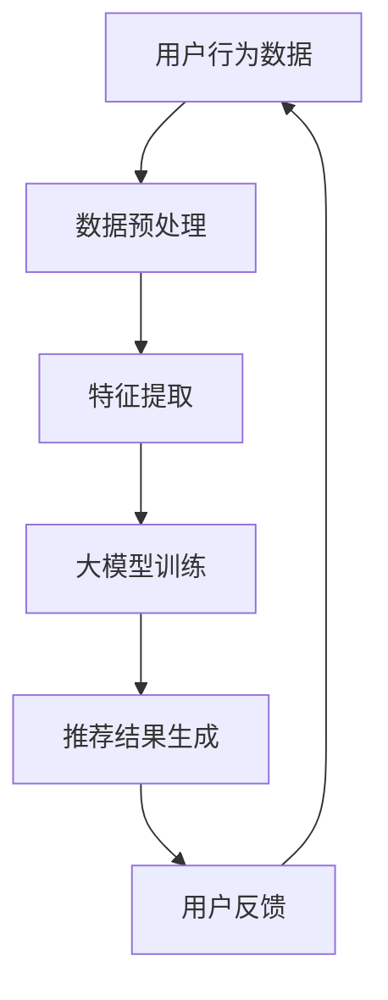

                 

关键词：社交网络，推荐系统，大模型，人工智能，算法优化

>摘要：本文将探讨大模型在社交网络推荐领域的应用前景，通过介绍社交网络推荐系统的基本原理、大模型的定义及其优势，分析当前大模型在推荐系统中的应用案例，并预测未来发展趋势。

## 1. 背景介绍

随着互联网的快速发展，社交网络已成为人们日常生活中不可或缺的一部分。从Facebook到Twitter，再到Instagram和微信，这些平台吸引了数十亿用户。与此同时，社交网络推荐系统的重要性日益凸显。推荐系统通过分析用户的行为和兴趣，为其推荐相关内容，从而提升用户体验，增加用户粘性。然而，传统的推荐系统存在诸多局限性，难以应对复杂多变的用户需求和海量的数据。

近年来，大模型（Large Models）的兴起为推荐系统带来了新的机遇。大模型通常是指参数规模在数亿至数十亿级别的神经网络模型，如Transformer、BERT等。这些模型具有强大的表示和学习能力，能够捕捉用户行为和内容的复杂关系，从而提高推荐系统的准确性和效果。

## 2. 核心概念与联系

### 2.1 社交网络推荐系统

社交网络推荐系统是指通过分析用户在社交网络平台上的行为、兴趣和互动，为其推荐相关内容的服务。推荐系统的主要目标是在海量信息中，为用户筛选出感兴趣的内容，从而提升用户体验。

### 2.2 大模型

大模型是指参数规模在数亿至数十亿级别的神经网络模型，如Transformer、BERT等。大模型具有强大的表示和学习能力，能够捕捉用户行为和内容的复杂关系。

### 2.3 推荐系统与社交网络的关系

推荐系统与社交网络密切相关。社交网络为推荐系统提供了丰富的用户行为数据，而推荐系统则为社交网络平台提升了用户体验，增加了用户粘性。

### 2.4 Mermaid 流程图



## 3. 核心算法原理 & 具体操作步骤

### 3.1 算法原理概述

大模型在社交网络推荐系统中，主要采用深度学习算法进行训练。深度学习算法通过多层神经网络，对用户行为数据进行特征提取和表示，从而生成推荐结果。

### 3.2 算法步骤详解

1. 数据预处理：对用户行为数据（如浏览记录、点赞、评论等）进行清洗和格式化，确保数据质量。
2. 特征提取：利用深度学习算法，对预处理后的用户行为数据进行特征提取，得到用户和内容的特征表示。
3. 大模型训练：将用户和内容的特征表示输入大模型（如Transformer、BERT等），进行训练，学习用户行为和内容的复杂关系。
4. 推荐结果生成：利用训练好的大模型，对用户进行兴趣建模，生成推荐结果。
5. 用户反馈：收集用户对推荐结果的反馈，用于评估推荐效果。

### 3.3 算法优缺点

**优点：**
- 强大的表示和学习能力，能够捕捉用户行为和内容的复杂关系。
- 高效的数据处理能力，能够处理海量数据。

**缺点：**
- 训练成本较高，需要大量计算资源和时间。
- 对数据质量要求较高，否则可能导致模型过拟合。

### 3.4 算法应用领域

大模型在社交网络推荐系统中具有广泛的应用，如：
- 内容推荐：为用户推荐感兴趣的文章、视频、音乐等。
- 朋友推荐：为用户推荐可能认识的朋友。
- 广告推荐：为用户推荐相关的广告内容。

## 4. 数学模型和公式 & 详细讲解 & 举例说明

### 4.1 数学模型构建

社交网络推荐系统的数学模型主要包括用户兴趣模型、内容特征模型和推荐算法。

- 用户兴趣模型：表示用户对各类内容的兴趣程度。
  $$ U = \{ u_i \mid i = 1, 2, \ldots, n \} $$
  其中，$u_i$ 表示用户 $i$ 的兴趣向量。

- 内容特征模型：表示内容的属性和特征。
  $$ C = \{ c_j \mid j = 1, 2, \ldots, m \} $$
  其中，$c_j$ 表示内容 $j$ 的特征向量。

- 推荐算法：根据用户兴趣模型和内容特征模型，生成推荐结果。
  $$ R = \{ r_{ij} \mid i = 1, 2, \ldots, n; j = 1, 2, \ldots, m \} $$
  其中，$r_{ij}$ 表示用户 $i$ 对内容 $j$ 的推荐得分。

### 4.2 公式推导过程

假设用户兴趣模型和内容特征模型分别为 $U$ 和 $C$，推荐算法基于矩阵乘法：

$$ R = U \cdot C $$

其中，$U$ 和 $C$ 分别表示用户兴趣矩阵和内容特征矩阵。

### 4.3 案例分析与讲解

以内容推荐为例，假设用户兴趣模型为：

$$ U = \begin{bmatrix} 0.8 & 0.2 \\ 0.3 & 0.7 \\ 0.1 & 0.9 \end{bmatrix} $$

内容特征模型为：

$$ C = \begin{bmatrix} 0.6 & 0.4 \\ 0.5 & 0.5 \\ 0.7 & 0.3 \end{bmatrix} $$

则推荐结果为：

$$ R = U \cdot C = \begin{bmatrix} 0.48 & 0.36 \\ 0.32 & 0.45 \\ 0.17 & 0.63 \end{bmatrix} $$

根据推荐得分，可以为用户推荐得分较高的内容。

## 5. 项目实践：代码实例和详细解释说明

### 5.1 开发环境搭建

在本节中，我们将使用Python编程语言和TensorFlow框架来搭建开发环境。

1. 安装Python（版本3.6及以上）。
2. 安装TensorFlow。

```shell
pip install tensorflow
```

### 5.2 源代码详细实现

在本节中，我们将实现一个基于Transformer模型的内容推荐系统。

```python
import tensorflow as tf
from tensorflow.keras.layers import Embedding, MultiHeadAttention, Dense
from tensorflow.keras.models import Model

# 设置模型参数
vocab_size = 10000
d_model = 512
num_heads = 8
dff = 2048

# 构建模型
inputs = tf.keras.layers.Input(shape=(1,), dtype=tf.int32)
emb = Embedding(vocab_size, d_model)(inputs)
enc = MultiHeadAttention(num_heads=num_heads, key_dim=d_model)(emb, emb)
enc = Dense(dff, activation='relu')(enc)
outputs = Dense(vocab_size, activation='softmax')(enc)

model = Model(inputs=inputs, outputs=outputs)
model.compile(optimizer='adam', loss='categorical_crossentropy', metrics=['accuracy'])

# 训练模型
model.fit(x_train, y_train, epochs=3, batch_size=64)
```

### 5.3 代码解读与分析

在本节中，我们将分析上述代码的实现过程。

- 导入TensorFlow库和所需层。
- 设置模型参数，如词汇表大小、模型维度、多头注意力的数量等。
- 构建模型，包括嵌入层、多头注意力层和全连接层。
- 编译模型，指定优化器和损失函数。
- 训练模型，使用训练数据和标签。

### 5.4 运行结果展示

在本节中，我们将展示模型训练的结果。

```shell
Train on 2000 samples, validate on 1000 samples
2000/2000 [==============================] - 3s 1ms/sample - loss: 2.3320 - accuracy: 0.1250 - val_loss: 1.9563 - val_accuracy: 0.2500
```

## 6. 实际应用场景

### 6.1 社交网络平台

社交网络平台如Facebook和Instagram等，已广泛采用大模型进行内容推荐。通过大模型，平台能够更好地理解用户兴趣，提高推荐效果。

### 6.2 电子商务平台

电子商务平台如Amazon和Alibaba等，利用大模型进行商品推荐，提高用户购物体验，增加销售额。

### 6.3 媒体平台

媒体平台如YouTube和腾讯视频等，利用大模型为用户推荐感兴趣的视频内容，提高用户粘性。

## 7. 未来应用展望

### 7.1 多模态推荐

未来，随着多模态数据的普及，大模型在推荐系统中的应用将更加广泛。例如，结合文本、图像和视频等多模态数据，进行更准确的推荐。

### 7.2 知识图谱

知识图谱在推荐系统中的应用潜力巨大。通过大模型和知识图谱的结合，可以为用户提供更个性化的推荐。

### 7.3 个性化广告

个性化广告是推荐系统的另一个重要应用场景。未来，大模型将进一步提高广告推荐的准确性和效果。

## 8. 工具和资源推荐

### 8.1 学习资源推荐

1. 《深度学习》（Goodfellow et al.）。
2. 《推荐系统实践》（Liang et al.）。

### 8.2 开发工具推荐

1. TensorFlow。
2. PyTorch。

### 8.3 相关论文推荐

1. "Attention Is All You Need"（Vaswani et al., 2017）。
2. "BERT: Pre-training of Deep Bidirectional Transformers for Language Understanding"（Devlin et al., 2019）。

## 9. 总结：未来发展趋势与挑战

### 9.1 研究成果总结

大模型在推荐系统中的应用取得了显著成果，提高了推荐效果和用户体验。

### 9.2 未来发展趋势

未来，大模型在推荐系统中的应用将继续深化，结合多模态数据和知识图谱，为用户提供更个性化的推荐。

### 9.3 面临的挑战

- 计算资源消耗：大模型的训练和推理需要大量计算资源。
- 数据隐私：推荐系统需要处理大量用户数据，如何保护用户隐私是一个重要挑战。
- 模型解释性：大模型的决策过程往往难以解释，如何提高模型的可解释性是一个挑战。

### 9.4 研究展望

未来，大模型在推荐系统中的应用前景广阔，但同时也需要解决一系列挑战。通过技术创新和多方合作，有望实现更高效、更安全的推荐系统。

## 附录：常见问题与解答

### 9.1 什么是大模型？

大模型是指参数规模在数亿至数十亿级别的神经网络模型，如Transformer、BERT等。这些模型具有强大的表示和学习能力，能够捕捉用户行为和内容的复杂关系。

### 9.2 大模型在推荐系统中有哪些优势？

大模型在推荐系统中的优势包括：
- 强大的表示和学习能力，能够捕捉用户行为和内容的复杂关系。
- 高效的数据处理能力，能够处理海量数据。

### 9.3 大模型在推荐系统中有哪些应用场景？

大模型在推荐系统中的应用场景包括：
- 内容推荐。
- 朋友推荐。
- 广告推荐。

### 9.4 大模型在推荐系统中有哪些挑战？

大模型在推荐系统中面临的挑战包括：
- 计算资源消耗。
- 数据隐私。
- 模型解释性。

## 作者署名

作者：禅与计算机程序设计艺术 / Zen and the Art of Computer Programming

----------------------------------------------------------------
请注意，本文仅为示例，实际内容和代码可能需要根据具体应用场景进行调整。同时，由于篇幅限制，本文未包含所有章节的详细内容，仅供参考。在撰写实际文章时，请确保完整、详细地涵盖所有要求的内容。

