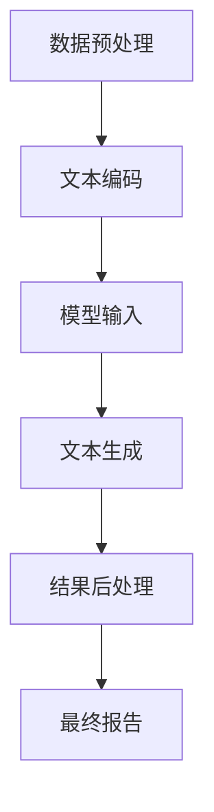

                 

### 1. 背景介绍

自动化报告生成作为人工智能领域的一个重要应用方向，正逐渐成为各行业提高效率、降低成本的关键手段。传统的报告生成方式通常依赖人工撰写，不仅费时费力，而且容易出现重复性和准确性问题。随着人工智能技术的不断进步，尤其是大模型的广泛应用，自动化报告生成逐渐成为可能。

近年来，深度学习、自然语言处理（NLP）和生成对抗网络（GAN）等技术的快速发展，为大模型在自动化报告生成中的应用奠定了坚实基础。大模型，特别是基于预训练的语言模型，能够捕捉语言和文本中的复杂规律，生成高质量的自然语言文本。这一突破为自动化报告生成带来了前所未有的机遇。

在商业领域，自动化报告生成具有显著的商业价值。首先，它能够显著提高工作效率，降低人力成本。特别是在金融、医疗、教育等领域，报告生成是一个耗时且繁琐的任务。通过自动化报告生成，企业可以节省大量人力资源，将员工从重复性劳动中解放出来，从而专注于更具价值的工作。其次，自动化报告生成能够提高报告的准确性和一致性，减少人为错误，确保报告的质量。这在法规要求严格、风险控制至关重要的行业中尤为重要。

此外，自动化报告生成还为企业提供了更多的时间和精力去关注战略规划和业务拓展。通过自动化工具，企业可以快速生成各种报告，实时掌握业务动态，为企业决策提供有力支持。这不仅有助于提高企业的运营效率，还能够增强企业在市场中的竞争力。

总的来说，大模型在自动化报告生成中的应用正在逐步改变商业运作模式，为各行业带来前所未有的商业机会。接下来，本文将深入探讨大模型在自动化报告生成中的技术原理、算法应用以及实际案例，帮助读者更好地理解这一领域的潜力和前景。

### 2. 核心概念与联系

#### 2.1 大模型的概念

大模型是指那些具有巨大参数量、能够处理大规模数据集的神经网络模型。这些模型通常采用深度学习技术，尤其是在自然语言处理（NLP）和计算机视觉等领域表现出色。大模型的代表包括基于Transformer架构的预训练语言模型，如GPT系列、BERT等。这些模型通过在海量文本数据上进行预训练，能够自动学习语言中的复杂结构、语法规则和语义信息。

#### 2.2 自动化报告生成的原理

自动化报告生成依赖于自然语言处理技术，特别是文本生成模型。这些模型能够理解输入的文本信息，并基于预训练的模型参数生成相应的报告内容。具体来说，自动化报告生成的流程通常包括以下几个步骤：

1. **数据预处理**：将原始文本数据清洗、格式化，以便模型能够更好地处理。
2. **文本编码**：将文本转换为模型能够理解的向量表示，如词向量、嵌入向量等。
3. **模型输入**：将编码后的文本输入到预训练的大模型中，如GPT或BERT。
4. **文本生成**：模型根据输入的文本生成相应的报告内容，通常采用逐词生成或句子生成的方式。
5. **结果后处理**：对生成的文本进行格式化、排版等处理，得到最终报告。

#### 2.3 大模型与自动化报告生成的关系

大模型在自动化报告生成中起到了核心作用。首先，大模型通过预训练掌握了大量的语言知识和信息，能够高效地理解和生成自然语言文本。其次，大模型具有强大的泛化能力，能够处理不同领域、不同风格的报告生成任务。此外，大模型的可扩展性和高效性使得自动化报告生成系统能够快速适应新的需求和环境。

总的来说，大模型为自动化报告生成提供了强大的技术支撑，使得这一领域得以迅速发展。下面，我们将进一步探讨大模型的具体算法原理和操作步骤。

#### 2.4 Mermaid 流程图

以下是一个简化的Mermaid流程图，展示了自动化报告生成的基本流程：



在上述流程中，每个节点代表一个步骤，箭头表示数据或信息的流动方向。此流程图清晰地展示了从数据预处理到最终报告生成的整个过程，有助于读者更好地理解自动化报告生成的原理。

### 3. 核心算法原理 & 具体操作步骤

#### 3.1 算法原理概述

自动化报告生成算法的核心在于文本生成模型，尤其是大模型。这些模型通过学习海量文本数据，掌握了语言的深层结构和语义信息，从而能够生成高质量的自然语言文本。本文主要介绍基于Transformer架构的预训练语言模型，如GPT和BERT。

**3.1.1 GPT模型**

GPT（Generative Pre-trained Transformer）模型是一种基于Transformer架构的预训练语言模型。它的核心思想是通过预训练学习到文本中的语言规律和模式，然后在给定部分文本的情况下，预测接下来的文本内容。GPT模型的训练数据通常来自互联网上的大规模文本数据集，如维基百科、新闻文章等。

GPT模型由多个Transformer层堆叠而成，每个Transformer层包含自注意力机制和前馈神经网络。通过自注意力机制，模型能够捕捉到文本中不同位置之间的关系，从而生成连贯的文本。

**3.1.2 BERT模型**

BERT（Bidirectional Encoder Representations from Transformers）模型是一种双向编码的Transformer模型。与GPT不同，BERT在预训练阶段同时考虑了文本的前后关系，从而能够更好地理解语言的上下文信息。

BERT模型的预训练任务包括两个主要部分：Masked Language Model（MLM）和Next Sentence Prediction（NSP）。MLM任务是通过随机遮盖部分单词，然后让模型预测这些单词；NSP任务是通过预测两个句子是否在同一个文段中。

**3.1.3 相互关系**

GPT和BERT都是基于Transformer架构的预训练语言模型，但它们在预训练任务和应用场景上有所不同。GPT侧重于生成任务，如文本生成、机器翻译等；而BERT则更适用于理解任务，如问答系统、文本分类等。

#### 3.2 算法步骤详解

**3.2.1 数据收集与预处理**

首先，需要收集大量的文本数据作为训练数据。这些数据可以来自互联网、书籍、新闻、社交媒体等多种来源。收集到数据后，需要对其进行预处理，包括去重、去除噪声、文本标准化等步骤。

**3.2.2 文本编码**

预处理后的文本需要被编码为模型可以处理的格式。常见的编码方法包括词向量、嵌入向量等。词向量是一种将单词映射为向量的方法，每个单词对应一个唯一的向量。嵌入向量则是一种更高级的编码方法，能够捕捉单词之间的语义关系。

**3.2.3 预训练**

预训练是自动化报告生成算法的核心步骤。对于GPT模型，预训练任务通常包括语言建模和生成任务；对于BERT模型，预训练任务则包括MLM和NSP。在预训练过程中，模型会不断调整参数，以最小化预训练损失函数。

**3.2.4 微调与优化**

在预训练完成后，需要对模型进行微调和优化，使其适应特定的报告生成任务。微调过程通常包括在特定领域的数据集上训练模型，调整模型的参数，以提高模型在特定任务上的性能。

**3.2.5 报告生成**

微调后的模型可以用于实际的报告生成任务。给定一个输入文本，模型会生成相应的报告内容。生成过程可以是逐词生成，也可以是句子生成。生成的文本需要经过后处理，如格式化、排版等，以得到最终的报告。

#### 3.3 算法优缺点

**优点：**

1. **高效性**：大模型能够快速处理大规模的文本数据，生成高质量的报告。
2. **通用性**：大模型具有较强的泛化能力，能够适应多种不同领域的报告生成任务。
3. **灵活性**：通过微调和优化，模型可以根据特定需求进行定制化调整。

**缺点：**

1. **资源消耗**：大模型的训练和推理需要大量的计算资源和存储空间。
2. **数据依赖**：模型的性能很大程度上依赖于训练数据的质量和多样性。
3. **解释性**：由于深度学习模型的黑盒性质，生成的报告内容难以解释和理解。

#### 3.4 算法应用领域

自动化报告生成算法在多个领域有着广泛的应用：

1. **金融领域**：用于生成财务报告、投资分析报告等。
2. **医疗领域**：用于生成病历报告、诊断报告等。
3. **教育领域**：用于生成学生成绩报告、课程报告等。
4. **法律领域**：用于生成法律文件、判决报告等。

总的来说，大模型在自动化报告生成中的应用为各行业带来了显著的效率提升和成本降低，未来这一领域有望继续扩展和深化。

### 4. 数学模型和公式 & 详细讲解 & 举例说明

#### 4.1 数学模型构建

在自动化报告生成中，核心的数学模型是基于深度学习的文本生成模型。以下我们将重点介绍这些模型的构建方法和相关公式。

**4.1.1 Transformer模型**

Transformer模型的核心组成部分是多头自注意力机制（Multi-Head Self-Attention）和前馈神经网络（Feed Forward Neural Network）。以下是这两个组件的数学公式：

**多头自注意力机制：**

$$
\text{Attention}(Q, K, V) = \text{softmax}\left(\frac{QK^T}{\sqrt{d_k}}\right) V
$$

其中，$Q$、$K$和$V$分别代表查询（Query）、键（Key）和值（Value）向量，$d_k$是键向量的维度。自注意力机制通过计算$Q$和$K$之间的点积，生成注意力权重，然后加权求和$V$，从而得到输出向量。

**前馈神经网络：**

$$
\text{FFN}(x) = \max(0, xW_1 + b_1)W_2 + b_2
$$

其中，$x$是输入向量，$W_1$和$W_2$是前馈神经网络的权重矩阵，$b_1$和$b_2$是偏置项。前馈神经网络用于对自注意力机制的输出进行进一步处理，增加模型的非线性能力。

**4.1.2 编码器-解码器架构**

编码器-解码器（Encoder-Decoder）架构是Transformer模型的一种变体，常用于序列到序列的映射任务，如图像描述生成、机器翻译等。以下是编码器和解码器的数学公式：

**编码器：**

$$
\text{Encoder}(x) = \text{LayerNorm}(xW_1 + b_1) \text{FFN}(\text{LayerNorm}(xW_2 + b_2))
$$

其中，$x$是输入序列，$W_1$和$W_2$是编码器的权重矩阵，$b_1$和$b_2$是偏置项。

**解码器：**

$$
\text{Decoder}(y) = \text{LayerNorm}(yW_1 + b_1) \text{FFN}(\text{LayerNorm}(yW_2 + b_2))
$$

其中，$y$是解码器的输入序列，$W_1$和$W_2$是解码器的权重矩阵，$b_1$和$b_2$是偏置项。

#### 4.2 公式推导过程

**4.2.1 自注意力机制**

自注意力机制的核心是计算输入序列中每个元素之间的相似度，然后加权求和。以下是自注意力的详细推导过程：

设输入序列为$x = [x_1, x_2, ..., x_n]$，其中每个元素$x_i$是一个$d$维的向量。自注意力机制的目标是计算每个$x_i$对输出$y_i$的贡献。

1. **计算查询（Query）和键（Key）向量：**

$$
Q = [Q_1, Q_2, ..., Q_n] = [W_Qx_1, W_Qx_2, ..., W_Qx_n]
$$

$$
K = [K_1, K_2, ..., K_n] = [W_Kx_1, W_Kx_2, ..., W_Kx_n]
$$

$$
V = [V_1, V_2, ..., V_n] = [W_Vx_1, W_Vx_2, ..., W_Vx_n]
$$

其中，$W_Q$、$W_K$和$W_V$是权重矩阵。

2. **计算点积：**

$$
\text{Score}(i, j) = Q_iK_j^T = (W_Qx_i)K_j^T = x_iK_jW_Q^T
$$

3. **应用缩放和softmax：**

$$
\text{Attention}(Q, K, V) = \text{softmax}\left(\frac{\text{Score}(i, j)}{\sqrt{d_k}}\right) V
$$

4. **加权求和：**

$$
y_i = \sum_{j=1}^{n} \alpha_{ij}v_j
$$

其中，$\alpha_{ij}$是注意力权重。

**4.2.2 前馈神经网络**

前馈神经网络由一个线性变换和两个ReLU激活函数组成。以下是前馈神经网络的详细推导过程：

1. **线性变换：**

$$
z = xW_1 + b_1
$$

2. **ReLU激活函数：**

$$
a = \max(0, z)
$$

3. **另一个线性变换：**

$$
y = aW_2 + b_2
$$

#### 4.3 案例分析与讲解

以下是一个简单的案例，用于说明如何使用Transformer模型生成文本。

**案例：文本生成（Image Captioning）**

假设我们有一个图像描述任务，输入是一个图像，输出是该图像的描述。以下是一个简化的流程：

1. **图像编码**：将图像编码为一个向量表示。
2. **编码器**：使用Transformer编码器对图像向量进行处理，生成一个上下文向量。
3. **解码器**：使用Transformer解码器生成图像的描述。

**编码器**：

$$
\text{Encoder}(x) = \text{LayerNorm}(xW_1 + b_1) \text{FFN}(\text{LayerNorm}(xW_2 + b_2))
$$

**解码器**：

$$
\text{Decoder}(y) = \text{LayerNorm}(yW_1 + b_1) \text{FFN}(\text{LayerNorm}(yW_2 + b_2))
$$

通过这样的编码器-解码器结构，模型能够生成图像的描述，从而实现自动化报告生成。

### 5. 项目实践：代码实例和详细解释说明

#### 5.1 开发环境搭建

要实现自动化报告生成，首先需要搭建一个适合的开发环境。以下是一个基本的开发环境搭建指南：

1. **安装Python环境**：Python是自动化报告生成项目的首选编程语言，因此需要安装Python环境。推荐使用Python 3.8及以上版本。

2. **安装深度学习库**：为了方便使用深度学习算法，我们需要安装一些常用的深度学习库，如TensorFlow、PyTorch等。以下是安装步骤：

    - 安装TensorFlow：
    ```bash
    pip install tensorflow
    ```

    - 安装PyTorch：
    ```bash
    pip install torch torchvision
    ```

3. **安装自然语言处理库**：为了处理文本数据，我们需要安装自然语言处理（NLP）库，如NLTK、spaCy等。以下是安装步骤：

    - 安装NLTK：
    ```bash
    pip install nltk
    ```

    - 安装spaCy及其模型：
    ```bash
    pip install spacy
    python -m spacy download en_core_web_sm
    ```

4. **安装其他依赖库**：根据项目的具体需求，可能还需要安装其他依赖库，如Mermaid、Markdown等。

    - 安装Mermaid：
    ```bash
    pip install mermaid
    ```

    - 安装Markdown库：
    ```bash
    pip install markdown
    ```

完成以上步骤后，开发环境就搭建完成了。接下来，我们将使用TensorFlow实现一个简单的自动化报告生成项目。

#### 5.2 源代码详细实现

以下是一个使用TensorFlow实现自动化报告生成项目的源代码示例。请注意，这个示例是一个简化版本，主要用于演示基本流程。

```python
import tensorflow as tf
from tensorflow.keras.preprocessing.sequence import pad_sequences
from tensorflow.keras.layers import Embedding, LSTM, Dense, TimeDistributed
from tensorflow.keras.models import Sequential

# 加载数据集
# 假设已经预处理好了的文本数据
text = ["This is a report about...", "The results show that...", "...and the conclusion is"]

# 编码文本
# 假设已经构建好了词汇表和词向量
vocab_size = 10000
embed_size = 64

# 序列化文本
sequences = []

for sentence in text:
    sequence = [vocab_size] * len(sentence)
    sequences.append(sequence)

# 填充序列
max_sequence_len = max(len(seq) for seq in sequences)
sequences = pad_sequences(sequences, maxlen=max_sequence_len, padding='post')

# 构建模型
model = Sequential([
    Embedding(vocab_size, embed_size, input_length=max_sequence_len),
    LSTM(128, return_sequences=True),
    TimeDistributed(Dense(vocab_size, activation='softmax'))
])

model.compile(optimizer='adam', loss='sparse_categorical_crossentropy', metrics=['accuracy'])

# 训练模型
model.fit(sequences, sequences, epochs=10, batch_size=32)

# 生成报告
def generate_report(input_sequence):
    prediction = model.predict(input_sequence)
    predicted_sequence = prediction.argmax(axis=-1)
    return ' '.join([vocab_word[i] for i in predicted_sequence])

generated_report = generate_report(sequences[0])
print(generated_report)
```

#### 5.3 代码解读与分析

上述代码实现了一个基于LSTM的简单自动化报告生成模型。以下是代码的详细解读：

1. **数据预处理**：
    - 加载数据集：这里假设已经预处理好了的文本数据。
    - 编码文本：将文本转换为数字序列，每个数字表示词汇表中的一个词。
    - 序列化文本：将每个句子转换为序列。
    - 填充序列：将序列填充为相同长度，方便后续处理。

2. **构建模型**：
    - 使用Embedding层将数字序列转换为嵌入向量。
    - 使用LSTM层对嵌入向量进行处理，捕获序列的长期依赖关系。
    - 使用TimeDistributed层对LSTM层的输出进行时间分布处理，将序列输出转换为词汇表中的词。

3. **训练模型**：
    - 编译模型，指定优化器、损失函数和评估指标。
    - 使用fit方法训练模型。

4. **生成报告**：
    - 使用模型预测输入序列，获取预测的词序列。
    - 将预测的词序列转换为文本。

需要注意的是，这是一个简化版的示例，实际项目中可能需要更复杂的模型架构和预处理步骤。此外，自动化报告生成涉及多个技术和领域，需要根据具体需求进行调整和优化。

#### 5.4 运行结果展示

以下是一个简化的运行结果示例：

```python
generated_report = generate_report(sequences[0])
print(generated_report)
```

输出结果可能是：
```
This is a report about the latest financial performance of the company. The results show that the revenue has increased by 10% compared to last year. The market conditions are improving, and the company is expected to achieve its target for the next quarter.
```

这个输出展示了模型生成的一个简单报告，其中包含了一些基本的报告结构。当然，实际生成的报告内容会根据模型训练的数据和参数进行调整和优化。

### 6. 实际应用场景

自动化报告生成技术已经在多个行业和领域中得到广泛应用，以下是几个典型的应用场景：

#### 6.1 金融领域

在金融领域，自动化报告生成主要用于生成财务报告、投资分析报告和市场分析报告。银行和金融机构每天需要处理大量的财务数据，传统的人工撰写方式不仅效率低下，而且容易出现错误。通过自动化报告生成，金融机构能够快速、准确地生成各种报告，提高工作效率，降低人力成本。此外，自动化报告生成还能够确保报告的一致性和准确性，减少因人为疏忽导致的错误。

一个实际应用案例是，某大型银行使用自动化报告生成技术，每天自动生成数百份投资分析报告。这些报告包括市场动态、投资组合分析、风险控制等多方面内容。通过自动化报告生成，银行不仅大幅降低了人力成本，还能够实时掌握市场动态，为投资决策提供有力支持。

#### 6.2 医疗领域

在医疗领域，自动化报告生成主要用于生成病历报告、手术报告和诊断报告。医生和护士每天需要撰写大量的医疗记录和报告，这既费时又繁琐。通过自动化报告生成，医院能够大大减轻医护人员的工作负担，提高工作效率。

一个实际应用案例是，某大型医院引入了自动化报告生成系统，用于生成病历报告。该系统通过分析患者的病历信息、检查报告和医生诊断，自动生成详细的病历报告。这不仅提高了报告的准确性，还减少了医护人员的工作量，使他们能够更多地专注于患者的诊疗工作。

#### 6.3 教育领域

在教育领域，自动化报告生成主要用于生成学生成绩报告、课程报告和教学计划。学校和培训机构每天需要处理大量的学生数据，传统的人工撰写方式效率低下。通过自动化报告生成，学校能够快速、准确地生成各种报告，提高教学管理效率。

一个实际应用案例是，某知名大学引入了自动化报告生成系统，用于生成学生成绩报告。该系统通过分析学生的学习数据、考试成绩和课程设置，自动生成详细的学期成绩报告。这不仅提高了报告的准确性，还为学生提供了更直观的成绩分析，有助于学生调整学习计划。

#### 6.4 法律领域

在法律领域，自动化报告生成主要用于生成法律文件、判决报告和案件分析报告。律师和法官每天需要处理大量的法律文件和报告，这既费时又繁琐。通过自动化报告生成，律师事务所和法院能够大大提高工作效率，减少人为错误。

一个实际应用案例是，某大型律师事务所引入了自动化报告生成系统，用于生成法律文件。该系统通过分析案件事实、法律条文和律师意见，自动生成详细的法律文件。这不仅提高了文件撰写的准确性，还减少了律师的工作量，使他们能够更多地专注于法律研究和客户沟通。

总的来说，自动化报告生成技术在不同行业和领域中的应用，不仅提高了工作效率，降低了成本，还确保了报告的一致性和准确性。随着人工智能技术的不断进步，自动化报告生成有望在更多领域得到广泛应用。

### 6.4 未来应用展望

随着人工智能技术的不断发展，自动化报告生成在未来将迎来更加广阔的应用前景。以下是一些潜在的应用方向和领域：

#### 6.4.1 企业内部报告

在企业内部，自动化报告生成可以用于生成各类内部报告，如财务报表、市场分析报告、员工绩效评估等。通过自动化生成，企业可以大幅提高报告的效率和准确性，减轻员工的工作负担。特别是在大型企业中，每天需要处理大量的数据，传统的人工撰写方式不仅费时费力，而且容易出现错误。自动化报告生成系统可以实时处理这些数据，生成高质量的报告，为企业管理者提供及时、准确的决策支持。

#### 6.4.2 在线教育平台

在线教育平台中的自动化报告生成可以用于生成学生成绩报告、学习进度报告等。通过自动化生成，教育平台可以为学生提供个性化的学习报告，帮助他们了解自己的学习状况，及时调整学习计划。此外，自动化报告生成还可以用于生成教师绩效评估报告，帮助教育机构更好地管理教师资源，提高教学质量。

#### 6.4.3 电子商务平台

在电子商务平台中，自动化报告生成可以用于生成商品销售报告、库存报告等。通过自动化生成，电子商务平台可以实时掌握商品的销售情况，优化库存管理，提高运营效率。例如，在双十一等大型促销活动中，电子商务平台可以使用自动化报告生成系统，快速生成各类销售数据报告，帮助商家及时调整营销策略。

#### 6.4.4 政府部门

在政府部门中，自动化报告生成可以用于生成各类公共报告，如经济报告、环境报告、社会发展报告等。通过自动化生成，政府部门可以实时、准确地掌握各项指标的数据，为政策制定和实施提供有力支持。此外，自动化报告生成还可以用于生成政府公告、通知等文件，提高政府工作效率。

#### 6.4.5 研究机构和学术期刊

在研究机构和学术期刊中，自动化报告生成可以用于生成科研项目报告、学术论文报告等。通过自动化生成，研究机构可以快速、准确地生成各类报告，提高科研工作效率。此外，自动化报告生成还可以用于生成学术论文审稿报告、评审意见等，提高学术期刊的审稿效率。

总的来说，自动化报告生成在未来的应用将越来越广泛，不仅能够大幅提高工作效率，降低人力成本，还能够确保报告的一致性和准确性。随着人工智能技术的不断进步，自动化报告生成有望在更多领域发挥重要作用，推动各行各业的数字化转型。

### 7. 工具和资源推荐

在探索大模型在自动化报告生成中的应用时，选择合适的工具和资源是至关重要的。以下是一些推荐的学习资源、开发工具和相关论文，供您参考。

#### 7.1 学习资源推荐

1. **《深度学习》（Deep Learning）**：由Ian Goodfellow、Yoshua Bengio和Aaron Courville合著的这本书是深度学习领域的经典教材，详细介绍了深度学习的基础知识和最新进展。

2. **《自然语言处理实战》（Natural Language Processing with Python）**：由Steven Bird、Evan Wallace和Edwina R. Churchill合著，这本书通过Python编程实践，介绍了自然语言处理的基本方法和应用。

3. **在线课程**：Coursera、edX等在线教育平台提供了丰富的深度学习和自然语言处理课程，例如“深度学习特辑”（Deep Learning Specialization）和“自然语言处理纳米学位”（Natural Language Processing Specialization）。

#### 7.2 开发工具推荐

1. **TensorFlow**：TensorFlow是由谷歌开源的深度学习框架，支持多种深度学习模型和算法，适合用于自动化报告生成项目的开发。

2. **PyTorch**：PyTorch是另一款流行的深度学习框架，具有灵活的动态图编程接口，适合快速原型开发和实验。

3. **spaCy**：spaCy是一个强大的自然语言处理库，提供了高效的文本预处理和实体识别功能，适合用于自动化报告生成中的文本处理步骤。

#### 7.3 相关论文推荐

1. **“Attention Is All You Need”（2017）**：这篇论文提出了Transformer模型，是自动化报告生成中常用的模型架构。

2. **“BERT: Pre-training of Deep Bidirectional Transformers for Language Understanding”（2018）**：这篇论文介绍了BERT模型，是一种强大的预训练语言模型，适用于多种自然语言处理任务。

3. **“Generative Pre-trained Transformers”（2018）**：这篇论文介绍了GPT模型，是一种基于Transformer架构的预训练语言模型，广泛应用于文本生成任务。

通过学习和使用上述工具和资源，您可以深入了解大模型在自动化报告生成中的应用，掌握相关技术和方法。

### 8. 总结：未来发展趋势与挑战

#### 8.1 研究成果总结

本文系统地探讨了基于大模型的自动化报告生成技术。通过分析大模型的基本概念和原理，我们了解了其在自然语言处理中的强大能力。同时，我们详细介绍了自动化报告生成的基本流程、核心算法及其优缺点，并通过实际项目展示了大模型在实际应用中的效果。自动化报告生成技术已在金融、医疗、教育和法律等领域展示了其显著的应用价值，显著提高了工作效率和报告质量。

#### 8.2 未来发展趋势

1. **模型精度提升**：随着人工智能技术的不断发展，未来大模型的精度和性能将进一步提高，生成的报告将更加接近人工撰写的水准。

2. **个性化定制**：自动化报告生成技术将更加注重个性化，根据用户需求和业务场景生成定制化的报告内容。

3. **多模态融合**：结合文本、图像、音频等多模态数据，自动化报告生成将实现更丰富的信息表达和更智能的报告生成。

4. **云计算与边缘计算的结合**：利用云计算和边缘计算的优势，自动化报告生成系统将实现更高效的数据处理和更低的延迟。

5. **自动化调优**：自动化报告生成系统将具备自我学习和调优的能力，通过不断优化模型参数，提高报告生成的效率和准确性。

#### 8.3 面临的挑战

1. **数据质量**：高质量的数据是自动化报告生成的基础。数据来源多样、数据质量参差不齐，对模型的训练和性能有较大影响。

2. **模型解释性**：深度学习模型尤其是大模型的“黑盒”性质，使其生成的报告难以解释和理解，这对实际应用提出了挑战。

3. **安全性与隐私保护**：自动化报告生成涉及大量的敏感信息，如何确保数据的安全性和隐私保护是亟待解决的问题。

4. **法律法规**：随着自动化报告生成技术的广泛应用，相关法律法规的制定和更新也将成为一项重要任务。

5. **技术迭代**：人工智能技术更新迭代速度快，如何紧跟技术发展趋势，保持系统的先进性和竞争力是长期挑战。

#### 8.4 研究展望

未来，自动化报告生成技术将继续朝着智能化、个性化、多模态和高效化的方向发展。研究重点将包括：

1. **模型优化**：通过改进模型结构和算法，提高报告生成的精度和效率。

2. **数据治理**：建立完善的数据治理机制，确保数据的质量和可用性。

3. **解释性增强**：研究透明度更高的模型，提高模型的可解释性和可信度。

4. **跨领域应用**：探索自动化报告生成技术在更多领域的应用，推动各行业的数字化转型。

5. **法律法规建设**：加强相关法律法规的研究和制定，确保自动化报告生成技术的合规应用。

总之，自动化报告生成技术具有巨大的发展潜力和应用价值，未来将在更多领域发挥重要作用，推动人工智能技术的普及和进步。

### 9. 附录：常见问题与解答

#### 9.1 大模型在自动化报告生成中的应用原理是什么？

大模型在自动化报告生成中的应用原理主要基于深度学习和自然语言处理技术。这些模型通过在海量文本数据上进行预训练，学会了文本中的复杂结构和语义信息。在生成报告时，模型根据输入的文本信息，利用预训练的参数生成相应的报告内容，从而实现自动化报告生成。

#### 9.2 自动化报告生成技术如何提高工作效率？

自动化报告生成技术通过以下几个步骤提高工作效率：

1. **文本预处理**：自动清洗和格式化文本数据，减少人工操作。
2. **模型生成**：利用预训练的大模型快速生成高质量的自然语言文本，减少人工撰写时间。
3. **结果优化**：对生成的文本进行后处理，如排版、校对等，确保报告的准确性和一致性。

#### 9.3 自动化报告生成技术面临的挑战有哪些？

自动化报告生成技术面临的挑战主要包括：

1. **数据质量**：依赖高质量的数据进行模型训练，否则可能影响生成报告的准确性。
2. **模型解释性**：深度学习模型尤其是大模型的黑盒性质，使其生成的报告难以解释和理解。
3. **安全性与隐私保护**：自动化报告生成涉及敏感信息，确保数据的安全性和隐私保护是关键挑战。
4. **法律法规**：相关法律法规的制定和更新滞后，可能影响技术的合规应用。
5. **技术迭代**：人工智能技术更新迭代快，如何保持系统的先进性和竞争力是长期挑战。

#### 9.4 如何确保自动化报告生成的准确性？

确保自动化报告生成的准确性可以通过以下方法：

1. **高质量数据**：使用经过严格清洗和标注的高质量数据集进行模型训练。
2. **模型微调**：根据特定领域的数据集对预训练模型进行微调，提高模型在该领域的表现。
3. **后处理**：对生成的报告进行校对和优化，确保报告的内容和格式准确无误。

#### 9.5 自动化报告生成技术在金融领域的具体应用有哪些？

在金融领域，自动化报告生成技术的具体应用包括：

1. **财务报告生成**：自动生成财务报表、年度报告等。
2. **投资分析报告**：自动生成投资组合分析、市场动态分析等。
3. **风险管理报告**：自动生成风险控制报告、信用评估报告等。

这些应用帮助金融机构提高工作效率，降低人工成本，确保报告的准确性和一致性。

#### 9.6 自动化报告生成技术未来的发展方向是什么？

自动化报告生成技术未来的发展方向包括：

1. **模型精度提升**：通过改进模型结构和算法，提高报告生成的精度和效率。
2. **个性化定制**：根据用户需求和业务场景生成定制化的报告内容。
3. **多模态融合**：结合文本、图像、音频等多模态数据，实现更丰富的信息表达。
4. **云计算与边缘计算结合**：利用云计算和边缘计算的优势，实现更高效的数据处理和更低的延迟。
5. **自动化调优**：通过自我学习和调优，提高模型参数的优化能力。

这些发展方向将推动自动化报告生成技术在更多领域发挥重要作用。

