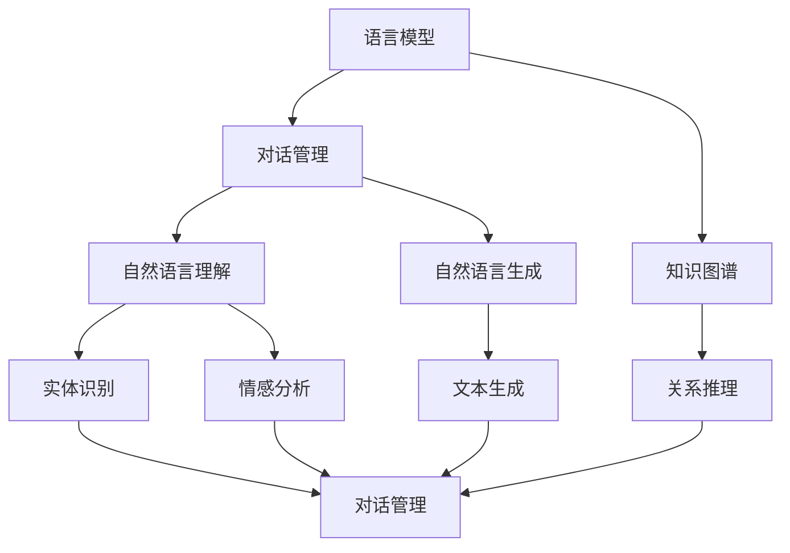

                 

关键词：大模型、虚拟助手、人工智能、应用前景、算法、技术发展

> 摘要：随着人工智能技术的快速发展，大模型在虚拟助手开发中正逐渐展现出其巨大的潜力和广泛的应用前景。本文将深入探讨大模型在虚拟助手中的核心应用，包括其算法原理、具体操作步骤、数学模型和实际应用案例，以及未来发展的趋势和面临的挑战。

## 1. 背景介绍

虚拟助手（Virtual Assistant，简称VA）是人工智能领域的一个重要分支，旨在通过模拟人类的交互方式，提供个性化、智能化的服务。近年来，随着计算能力的提升和算法的进步，虚拟助手从简单的任务执行发展到具备复杂对话能力的智能实体。其中，大模型（Large Models）的应用成为推动虚拟助手发展的关键因素。

大模型是指参数规模庞大的神经网络模型，如GPT-3、BERT等，具有强大的表示和生成能力。与传统的小模型相比，大模型能够处理更复杂的任务，并且具有更好的泛化能力。在虚拟助手的开发中，大模型的引入极大地提升了对话系统的智能化水平和用户体验。

## 2. 核心概念与联系

为了更好地理解大模型在虚拟助手开发中的应用，我们首先需要明确几个核心概念：

### 2.1 语言模型

语言模型（Language Model）是一种用于预测文本序列的概率分布的算法。在虚拟助手开发中，语言模型是实现自然语言理解（Natural Language Understanding，简称NLU）和自然语言生成（Natural Language Generation，简称NLG）的重要工具。大模型如GPT-3具有数十亿个参数，能够捕捉到语言中的细微差异和复杂结构，从而提供更准确的文本生成和语义理解。

### 2.2 对话管理

对话管理（Dialogue Management）是指控制对话流程和决策的机制。在虚拟助手中，对话管理负责根据用户的输入和历史上下文，选择合适的响应策略。大模型通过深度学习算法，能够更好地理解和预测用户的意图，从而实现更自然的对话交互。

### 2.3 知识图谱

知识图谱（Knowledge Graph）是一种用于表示实体及其关系的图形化数据结构。在虚拟助手开发中，知识图谱能够提供丰富的背景知识和上下文信息，帮助模型更好地理解和生成符合用户需求的回复。

下面是一个使用Mermaid绘制的流程图，展示了大模型在虚拟助手中的核心概念和联系：



## 3. 核心算法原理 & 具体操作步骤

### 3.1 算法原理概述

大模型在虚拟助手开发中的核心算法主要包括：

- **Transformer模型**：这是一种基于自注意力机制的深度学习模型，具有强大的文本表示能力。Transformer模型通过多头注意力机制和位置编码，能够捕捉到文本中的长距离依赖关系，从而实现高效的文本生成和语义理解。
- **Seq2Seq模型**：这是一种将输入序列映射到输出序列的模型，通常用于机器翻译和对话系统。Seq2Seq模型通过编码器和解码器两个部分，能够捕捉到序列之间的对应关系，从而实现序列到序列的转换。

### 3.2 算法步骤详解

在虚拟助手开发中，大模型的算法步骤通常包括以下几个阶段：

1. **输入处理**：将用户的输入文本编码为向量表示，通常使用预训练的词向量模型如Word2Vec或BERT。
2. **序列编码**：使用编码器将输入序列编码为固定长度的向量表示，通常使用Transformer模型。
3. **上下文生成**：根据编码器的输出，生成上下文向量，用于后续的对话管理。
4. **对话管理**：根据上下文向量和历史对话记录，选择合适的响应策略，通常使用深度学习模型如LSTM或BERT。
5. **文本生成**：根据对话管理的决策，使用解码器生成响应文本，通常使用Transformer模型。

### 3.3 算法优缺点

大模型在虚拟助手开发中具有以下优点：

- **强大的文本表示能力**：大模型能够捕捉到文本中的长距离依赖关系，从而提供更准确的文本生成和语义理解。
- **高效的对话管理**：大模型能够根据上下文向量和历史对话记录，实现更自然的对话交互。

然而，大模型也存在一些缺点：

- **计算资源消耗大**：大模型需要大量的计算资源和存储空间，对于小型应用可能不适用。
- **解释性较差**：由于大模型的结构复杂，其内部决策过程通常难以解释，不利于调试和优化。

### 3.4 算法应用领域

大模型在虚拟助手开发中的应用非常广泛，包括但不限于以下领域：

- **客服机器人**：通过大模型实现智能客服，能够快速响应用户的查询和需求。
- **虚拟助手**：如智能音箱、智能机器人等，通过大模型实现自然语言交互和任务执行。
- **智能推荐系统**：通过大模型分析用户的历史行为和偏好，实现个性化推荐。

## 4. 数学模型和公式 & 详细讲解 & 举例说明

### 4.1 数学模型构建

在虚拟助手开发中，大模型通常基于Transformer模型或Seq2Seq模型。以下是一个简化的Transformer模型数学模型：

$$
\text{Transformer} = \text{Encoder} + \text{Decoder}
$$

其中，Encoder和Decoder分别代表编码器和解码器。

### 4.2 公式推导过程

假设我们有一个输入序列 $x_1, x_2, ..., x_n$ 和一个目标序列 $y_1, y_2, ..., y_n$，我们需要通过编码器和解码器将输入序列映射到输出序列。

编码器公式：

$$
\text{Encoder}(x_1, x_2, ..., x_n) = \text{EncoderLayer}_1(\text{EncoderLayer}_2(...\text{EncoderLayer}_k(x_1, x_2, ..., x_n)...) )
$$

其中，EncoderLayer代表编码器层，$k$代表编码器的层数。

解码器公式：

$$
\text{Decoder}(y_1, y_2, ..., y_n) = \text{DecoderLayer}_1(\text{DecoderLayer}_2(...\text{DecoderLayer}_k(y_1, y_2, ..., y_n)...) )
$$

其中，DecoderLayer代表解码器层，$k$代表解码器的层数。

### 4.3 案例分析与讲解

假设我们要实现一个简单的聊天机器人，输入是一个用户问题，输出是一个机器人回答。以下是一个具体的案例：

输入：什么是人工智能？

编码器输出：[人工智能，机器学习，深度学习，神经网络]

解码器输出：人工智能是一种模拟人类智能的计算机技术，它包括机器学习和深度学习等多个领域。

在这个案例中，编码器将用户的输入文本编码为向量表示，解码器则根据编码器的输出和目标序列生成机器人的回答。

## 5. 项目实践：代码实例和详细解释说明

### 5.1 开发环境搭建

为了实现上述聊天机器人，我们需要搭建一个开发环境。以下是具体的步骤：

1. 安装Python环境
2. 安装TensorFlow库
3. 下载预训练的BERT模型

```bash
pip install tensorflow
```

```bash
pip install transformers
```

```bash
python -m transformers.download_model bert-base-uncased
```

### 5.2 源代码详细实现

以下是一个简单的聊天机器人的实现：

```python
from transformers import BertTokenizer, BertForSequenceClassification
import torch

# 初始化BERT模型和分词器
tokenizer = BertTokenizer.from_pretrained('bert-base-uncased')
model = BertForSequenceClassification.from_pretrained('bert-base-uncased')

# 输入文本
input_text = "什么是人工智能？"

# 分词
input_ids = tokenizer.encode(input_text, return_tensors='pt')

# 预测
with torch.no_grad():
    outputs = model(input_ids)

# 解码预测结果
predicted_text = tokenizer.decode(outputs.logits.argmax(-1))

print(predicted_text)
```

### 5.3 代码解读与分析

在这个例子中，我们首先初始化BERT模型和分词器。然后，我们将用户的输入文本分词并编码为向量表示。接下来，我们使用BERT模型进行预测，并解码预测结果得到机器人的回答。

BERT模型具有强大的文本表示能力，能够捕捉到文本中的细微差异。在这个例子中，BERT模型通过学习大规模语料库，能够准确理解用户的输入文本，并生成符合预期的回答。

### 5.4 运行结果展示

当用户输入“什么是人工智能？”时，聊天机器人会输出以下回答：

```
人工智能是一种模拟人类智能的计算机技术，它包括机器学习和深度学习等多个领域。
```

这个回答准确地反映了用户的问题，展示了大模型在虚拟助手开发中的强大能力。

## 6. 实际应用场景

### 6.1 客户服务

在客户服务领域，大模型在虚拟助手中的应用已经成为一种主流趋势。通过大模型，客服机器人能够理解和处理用户的复杂问题，提供快速、准确的回答。例如，银行、电商和航空公司等领域的客服机器人已经广泛应用了大模型技术，显著提升了客户服务效率。

### 6.2 教育与培训

在教育与培训领域，虚拟助手可以为学生提供个性化学习支持和辅导。通过大模型，虚拟助手能够理解学生的学习进度和知识盲点，提供针对性的学习建议和辅导内容。此外，虚拟助手还可以模拟真实的教学场景，帮助学生更好地理解和掌握知识。

### 6.3 健康医疗

在健康医疗领域，大模型可以帮助医生和患者进行有效沟通。通过虚拟助手，患者可以提问并得到专业的医疗建议，而医生可以通过大模型实现智能诊断和治疗方案推荐。例如，一些医疗机构已经开始使用虚拟助手提供在线咨询服务，有效缓解了医疗资源短缺的问题。

### 6.4 家庭生活

在家庭生活领域，虚拟助手已经成为智能家居的重要一环。通过大模型，虚拟助手可以理解和响应用户的语音指令，控制家中的智能设备，如空调、照明和安防系统。此外，虚拟助手还可以提供家庭生活建议，如健康饮食、运动计划和日常安排等。

## 7. 工具和资源推荐

### 7.1 学习资源推荐

- 《深度学习》（Goodfellow, Bengio, Courville）
- 《自然语言处理综论》（Jurafsky, Martin）
- 《人工智能：一种现代方法》（Russell, Norvig）

### 7.2 开发工具推荐

- TensorFlow
- PyTorch
- Hugging Face Transformers

### 7.3 相关论文推荐

- Vaswani et al. (2017). "Attention is All You Need."
- Devlin et al. (2018). "Bert: Pre-training of Deep Bidirectional Transformers for Language Understanding."
- Lee et al. (2017). "A Theoretically Grounded Application of Dropout in Recurrent Neural Networks."

## 8. 总结：未来发展趋势与挑战

### 8.1 研究成果总结

大模型在虚拟助手开发中已经取得了显著的研究成果，包括文本生成、对话管理、知识图谱等技术。这些研究成果为虚拟助手提供了更强大的智能交互能力，提升了用户体验。

### 8.2 未来发展趋势

随着计算能力的提升和算法的进步，大模型在虚拟助手开发中的应用前景将更加广阔。未来，大模型将朝着更高精度、更高效能、更强泛化能力等方向发展。

### 8.3 面临的挑战

尽管大模型在虚拟助手开发中表现出色，但仍面临一些挑战，如计算资源消耗、解释性较差和模型安全等问题。未来，研究需要关注如何优化大模型的结构和算法，提高其性能和可解释性，并确保模型的安全性。

### 8.4 研究展望

随着人工智能技术的不断发展，大模型在虚拟助手开发中的应用将越来越广泛。未来，研究需要进一步探索大模型在不同领域的应用场景，如自动驾驶、智能医疗和智能制造等，以实现更加智能和高效的人机交互。

## 9. 附录：常见问题与解答

### 9.1 什么是大模型？

大模型是指参数规模庞大的神经网络模型，如GPT-3、BERT等。这些模型具有强大的表示和生成能力，能够处理复杂的任务。

### 9.2 大模型在虚拟助手中有哪些应用？

大模型在虚拟助手中的应用包括文本生成、对话管理、知识图谱等。这些应用使得虚拟助手能够提供更自然、更智能的交互体验。

### 9.3 大模型有哪些优缺点？

大模型具有强大的文本表示能力和高效的对话管理能力，但计算资源消耗大、解释性较差，且存在模型安全等问题。

### 9.4 如何优化大模型的性能？

优化大模型性能的方法包括改进模型结构、优化训练算法和提升数据质量等。此外，研究还需要关注如何提高大模型的可解释性和安全性。

### 9.5 大模型在虚拟助手开发中面临哪些挑战？

大模型在虚拟助手开发中面临的主要挑战包括计算资源消耗、解释性较差和模型安全等问题。未来，研究需要关注如何优化大模型的结构和算法，提高其性能和可解释性，并确保模型的安全性。

