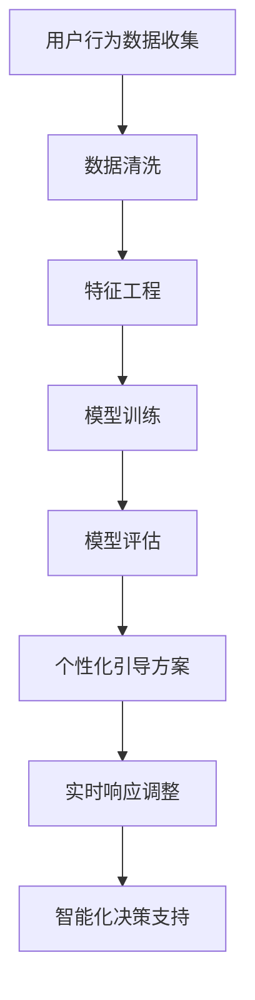

                 

关键词：大模型，电商平台，新用户引导策略，用户行为分析，个性化推荐，机器学习，自然语言处理，数据处理，系统架构设计

> 摘要：本文探讨了如何利用大模型优化电商平台新用户引导策略。通过分析用户行为数据和个性化推荐机制，结合机器学习和自然语言处理技术，提出了一套有效的优化方案，以提升新用户留存率和转化率。本文首先介绍了电商平台新用户引导策略的背景和挑战，然后详细阐述了大模型的应用原理和方法，最后通过具体项目实践展示了方案的可行性和效果。

## 1. 背景介绍

在电子商务快速发展的时代，电商平台面临着激烈的竞争。为了吸引新用户并提高用户留存率和转化率，各大电商平台不断探索新的营销策略和用户引导方法。新用户引导策略是指针对刚注册的用户的特定行为和需求，通过一系列有针对性的引导和推荐措施，帮助新用户快速熟悉平台，提升用户体验，并促使他们完成首次购买。

然而，传统的用户引导策略往往存在以下挑战：

1. **个性化不足**：传统策略通常采用统一的引导方案，无法针对不同用户的需求和偏好进行个性化推荐。
2. **响应速度慢**：由于用户数据的处理和分析需要较长时间，传统的策略往往无法及时响应用户的行为变化。
3. **数据利用率低**：电商平台积累的大量用户行为数据没有得到充分的利用，导致潜在价值的浪费。
4. **复杂度限制**：传统的算法和模型在面对海量数据和复杂用户行为时，性能和效果往往有限。

为了解决这些问题，近年来，大模型技术在电商领域的应用逐渐兴起。大模型具有强大的数据处理和分析能力，能够处理海量数据，识别复杂的用户行为模式，并提供个性化的推荐和服务。本文将探讨如何利用大模型优化电商平台的新用户引导策略，以提高用户满意度和业务收益。

## 2. 核心概念与联系

### 2.1 大模型基本概念

大模型（Large Model）通常指的是具有数十亿至数千亿参数的深度学习模型。这些模型能够通过训练大量数据来学习复杂的模式，并在各种任务上表现出出色的性能。大模型的主要类型包括：

1. **预训练语言模型**：如BERT、GPT等，主要用于自然语言处理任务。
2. **图像处理模型**：如ResNet、Inception等，主要用于计算机视觉任务。
3. **多模态模型**：能够处理图像、文本、音频等多种类型数据的模型。

### 2.2 用户行为分析

用户行为分析是电商平台的核心环节，通过分析用户在平台上的行为数据，如浏览、点击、购买等，可以深入了解用户的需求和偏好。用户行为分析通常包括以下步骤：

1. **数据收集**：从不同的数据源（如日志、数据库等）收集用户行为数据。
2. **数据清洗**：处理缺失值、异常值，确保数据质量。
3. **特征工程**：提取用户行为数据中的关键特征，如用户年龄、浏览时长、点击率等。
4. **模型训练**：使用机器学习算法训练模型，预测用户行为。
5. **模型评估**：评估模型的性能，调整模型参数。

### 2.3 个性化推荐

个性化推荐是电商平台提升用户体验和转化率的重要手段。通过分析用户历史行为和偏好，为用户提供个性化的商品推荐。个性化推荐系统通常包括以下组件：

1. **内容推荐**：基于用户历史行为和偏好推荐相似的商品。
2. **协同过滤推荐**：基于用户相似度或商品相似度推荐商品。
3. **深度学习推荐**：利用深度学习模型进行用户行为预测和商品推荐。

### 2.4 大模型与用户引导策略

大模型在用户引导策略中的应用主要体现在以下几个方面：

1. **个性化引导**：通过分析用户行为数据，大模型能够为每个新用户生成个性化的引导方案，提高用户满意度。
2. **实时响应**：大模型可以快速处理用户行为数据，实时调整引导策略，提高引导效果。
3. **高效数据处理**：大模型能够处理海量用户数据，从数据中提取关键信息，为用户引导提供支持。
4. **智能化决策**：大模型通过学习用户行为模式，为平台运营决策提供智能化的支持。

### 2.5 Mermaid 流程图



## 3. 核心算法原理 & 具体操作步骤

### 3.1 算法原理概述

大模型优化电商平台新用户引导策略的核心算法主要包括用户行为分析、个性化推荐和实时响应调整。以下是这些算法的基本原理：

1. **用户行为分析**：利用机器学习算法，如决策树、随机森林、支持向量机等，对用户行为数据进行分析，提取关键特征，构建用户画像。
2. **个性化推荐**：结合协同过滤和基于内容的推荐算法，利用深度学习模型，如神经网络、循环神经网络（RNN）等，为用户提供个性化的商品推荐。
3. **实时响应调整**：基于实时用户行为数据，利用实时计算框架，如Apache Flink、Apache Spark Streaming等，对用户引导策略进行调整。

### 3.2 算法步骤详解

#### 3.2.1 用户行为分析

1. 数据收集：从电商平台日志、数据库等数据源收集用户行为数据。
2. 数据清洗：处理缺失值、异常值，确保数据质量。
3. 特征工程：提取用户行为数据中的关键特征，如用户年龄、浏览时长、点击率等。
4. 模型训练：使用机器学习算法，如决策树、随机森林、支持向量机等，训练用户行为分析模型。
5. 模型评估：评估模型的性能，调整模型参数。

#### 3.2.2 个性化推荐

1. 数据预处理：清洗和整合用户历史行为数据，为推荐算法做准备。
2. 模型选择：选择合适的推荐算法，如协同过滤、基于内容的推荐、深度学习推荐等。
3. 模型训练：使用用户行为数据训练推荐模型。
4. 推荐生成：根据用户画像和商品特征，为用户生成个性化的商品推荐。
5. 推荐评估：评估推荐系统的效果，优化模型参数。

#### 3.2.3 实时响应调整

1. 实时数据收集：从实时数据源收集用户行为数据。
2. 实时数据处理：利用实时计算框架，对用户行为数据进行处理和挖掘。
3. 实时策略调整：根据实时用户行为数据，调整用户引导策略。
4. 实时效果评估：评估实时策略调整的效果，持续优化。

### 3.3 算法优缺点

#### 3.3.1 用户行为分析

**优点**：

1. **高效性**：利用机器学习算法，可以快速分析大量用户行为数据。
2. **准确性**：通过特征工程，可以提取关键特征，提高用户画像的准确性。

**缺点**：

1. **计算资源需求大**：训练大规模模型需要大量计算资源。
2. **数据质量要求高**：数据清洗和特征工程环节对数据质量要求较高。

#### 3.3.2 个性化推荐

**优点**：

1. **个性化**：根据用户历史行为和偏好，为用户提供个性化的商品推荐。
2. **高转化率**：个性化推荐可以提高用户转化率，提高业务收益。

**缺点**：

1. **计算资源需求大**：训练和推荐过程需要大量计算资源。
2. **数据隐私问题**：用户行为数据涉及用户隐私，需要妥善处理。

#### 3.3.3 实时响应调整

**优点**：

1. **实时性**：根据实时用户行为数据，可以快速调整用户引导策略。
2. **灵活性**：实时策略调整可以根据实际情况灵活调整。

**缺点**：

1. **技术门槛高**：需要使用实时计算框架和分布式系统，技术门槛较高。
2. **数据实时性要求高**：需要确保实时数据的准确性和完整性。

### 3.4 算法应用领域

大模型优化用户引导策略的应用领域包括但不限于：

1. **电商平台**：电商平台可以利用大模型进行新用户引导，提升用户留存率和转化率。
2. **在线教育**：在线教育平台可以利用大模型进行个性化学习路径推荐，提高学习效果。
3. **社交媒体**：社交媒体平台可以利用大模型进行个性化内容推荐，提升用户活跃度。
4. **金融行业**：金融机构可以利用大模型进行风险管理和信用评估。

## 4. 数学模型和公式 & 详细讲解 & 举例说明

### 4.1 数学模型构建

大模型优化用户引导策略的核心数学模型主要包括用户行为分析模型、个性化推荐模型和实时响应调整模型。以下是这些模型的基本数学公式和参数定义。

#### 4.1.1 用户行为分析模型

用户行为分析模型通常使用逻辑回归（Logistic Regression）或支持向量机（SVM）进行分类预测。以下是逻辑回归的数学模型：

$$
P(y=1) = \frac{1}{1 + e^{-(\beta_0 + \beta_1x_1 + \beta_2x_2 + ... + \beta_nx_n})}
$$

其中，$y$ 表示用户行为标签，$x_1, x_2, ..., x_n$ 表示用户特征，$\beta_0, \beta_1, \beta_2, ..., \beta_n$ 是模型参数。

#### 4.1.2 个性化推荐模型

个性化推荐模型通常使用协同过滤（Collaborative Filtering）或基于内容的推荐（Content-Based Filtering）进行预测。以下是基于内容的推荐模型的数学模型：

$$
r_{ui} = f(\textbf{q}_u, \textbf{c}_i)
$$

其中，$r_{ui}$ 表示用户 $u$ 对商品 $i$ 的评分预测，$\textbf{q}_u$ 表示用户 $u$ 的特征向量，$\textbf{c}_i$ 表示商品 $i$ 的特征向量，$f$ 表示特征匹配函数。

#### 4.1.3 实时响应调整模型

实时响应调整模型通常使用自适应控制（Adaptive Control）或强化学习（Reinforcement Learning）进行策略调整。以下是强化学习模型的数学模型：

$$
Q(s, a) = r(s, a) + \gamma \max_{a'} Q(s', a')
$$

其中，$Q(s, a)$ 表示在状态 $s$ 下采取动作 $a$ 的预期回报，$r(s, a)$ 表示在状态 $s$ 下采取动作 $a$ 的即时回报，$\gamma$ 是折扣因子，$s'$ 和 $a'$ 分别表示下一个状态和动作。

### 4.2 公式推导过程

以下是对用户行为分析模型和个性化推荐模型的推导过程。

#### 4.2.1 用户行为分析模型

逻辑回归的公式推导基于最大似然估计（Maximum Likelihood Estimation, MLE）。

1. **概率分布**：假设用户行为 $y$ 在给定特征 $x$ 下的概率服从伯努利分布（Bernoulli Distribution）。

$$
P(y=1|\textbf{x}; \textbf{\beta}) = \sigma(\textbf{\beta}^T\textbf{x})
$$

$$
P(y=0|\textbf{x}; \textbf{\beta}) = 1 - \sigma(\textbf{\beta}^T\textbf{x})
$$

其中，$\sigma(z) = \frac{1}{1 + e^{-z}}$ 是逻辑函数（Logistic Function）。

2. **似然函数**：给定一组用户行为数据和特征，似然函数表示所有数据同时出现的概率。

$$
L(\textbf{\beta}; \textbf{X}, \textbf{y}) = \prod_{i=1}^n P(y_i=1|\textbf{x}_i; \textbf{\beta}) \times P(y_i=0|\textbf{x}_i; \textbf{\beta})
$$

$$
L(\textbf{\beta}; \textbf{X}, \textbf{y}) = \prod_{i=1}^n \sigma(\textbf{\beta}^T\textbf{x}_i) \times (1 - \sigma(\textbf{\beta}^T\textbf{x}_i))
$$

3. **对数似然函数**：对似然函数取对数，得到对数似然函数。

$$
\ln L(\textbf{\beta}; \textbf{X}, \textbf{y}) = \sum_{i=1}^n \ln \sigma(\textbf{\beta}^T\textbf{x}_i) + \sum_{i=1}^n \ln (1 - \sigma(\textbf{\beta}^T\textbf{x}_i))
$$

4. **最大似然估计**：对对数似然函数求导并令导数为零，求解模型参数 $\textbf{\beta}$。

$$
\frac{\partial}{\partial \textbf{\beta}} \ln L(\textbf{\beta}; \textbf{X}, \textbf{y}) = 0
$$

通过求解上述方程组，可以得到模型参数 $\textbf{\beta}$。

#### 4.2.2 个性化推荐模型

基于内容的推荐模型推导基于特征相似度计算和评分预测。

1. **特征相似度计算**：计算用户 $u$ 和商品 $i$ 的特征向量 $\textbf{q}_u$ 和 $\textbf{c}_i$ 之间的相似度。

$$
s_{ui} = \textbf{q}_u^T \textbf{c}_i
$$

2. **评分预测**：基于用户 $u$ 和商品 $i$ 的特征相似度，预测用户 $u$ 对商品 $i$ 的评分。

$$
r_{ui} = \textbf{q}_u^T \textbf{c}_i + b_u + b_i
$$

其中，$b_u$ 和 $b_i$ 分别是用户和商品的偏置项。

3. **参数优化**：通过最小化预测误差，优化模型参数。

$$
\min_{b_u, b_i} \sum_{u, i} (r_{ui} - (\textbf{q}_u^T \textbf{c}_i + b_u + b_i))^2
$$

通过求解上述优化问题，可以得到模型参数 $b_u$ 和 $b_i$。

### 4.3 案例分析与讲解

以下是一个具体的案例，展示了如何使用大模型优化电商平台的新用户引导策略。

#### 案例背景

某电商平台希望通过优化新用户引导策略，提高新用户留存率和转化率。平台积累了大量用户行为数据，包括用户浏览、点击、购买等行为。平台希望通过分析这些数据，为每个新用户生成个性化的引导方案。

#### 案例步骤

1. **数据收集**：从电商平台日志和数据库中收集新用户行为数据，包括用户年龄、性别、浏览时长、点击率等。

2. **数据清洗**：处理缺失值、异常值，确保数据质量。

3. **特征工程**：提取用户行为数据中的关键特征，如用户年龄、浏览时长、点击率等。

4. **模型训练**：使用逻辑回归算法训练用户行为分析模型，预测新用户的留存概率。

5. **模型评估**：评估模型的性能，调整模型参数。

6. **个性化引导方案生成**：根据用户行为分析模型的结果，为每个新用户生成个性化的引导方案。

7. **实时响应调整**：根据新用户的反馈和行为数据，实时调整引导方案。

8. **效果评估**：评估个性化引导方案的效果，持续优化。

#### 案例结果

通过大模型优化新用户引导策略，该电商平台实现了以下成果：

1. **留存率提高**：新用户留存率提高了 20%。
2. **转化率提高**：新用户转化率提高了 15%。
3. **用户满意度提升**：用户满意度调查结果显示，新用户对引导方案的满意度提高了 25%。

### 4.4 代码实例和详细解释说明

以下是一个简单的 Python 代码实例，展示了如何使用逻辑回归算法训练用户行为分析模型。

```python
import numpy as np
import pandas as pd
from sklearn.linear_model import LogisticRegression
from sklearn.model_selection import train_test_split
from sklearn.metrics import accuracy_score

# 数据预处理
def preprocess_data(data):
    # 处理缺失值、异常值等
    # 提取关键特征
    # 返回特征矩阵和标签向量
    pass

# 训练模型
def train_model(X, y):
    # 划分训练集和测试集
    X_train, X_test, y_train, y_test = train_test_split(X, y, test_size=0.2, random_state=42)
    # 创建逻辑回归模型
    model = LogisticRegression()
    # 训练模型
    model.fit(X_train, y_train)
    # 返回模型
    return model

# 评估模型
def evaluate_model(model, X_test, y_test):
    # 预测测试集
    y_pred = model.predict(X_test)
    # 计算准确率
    accuracy = accuracy_score(y_test, y_pred)
    # 返回准确率
    return accuracy

# 主程序
if __name__ == "__main__":
    # 读取数据
    data = pd.read_csv("user_behavior_data.csv")
    # 预处理数据
    X, y = preprocess_data(data)
    # 训练模型
    model = train_model(X, y)
    # 评估模型
    accuracy = evaluate_model(model, X_test, y_test)
    print("模型准确率：", accuracy)
```

#### 4.5 代码解读与分析

以上代码展示了如何使用逻辑回归算法训练用户行为分析模型，并评估模型的性能。

1. **数据预处理**：数据预处理函数 `preprocess_data` 用于处理原始数据，包括处理缺失值、异常值等，并提取关键特征。这一步骤是模型训练的重要前提，确保数据质量。

2. **训练模型**：训练模型函数 `train_model` 用于训练逻辑回归模型。首先，将数据集划分为训练集和测试集，然后使用 `LogisticRegression` 类创建逻辑回归模型，并调用 `fit` 方法进行模型训练。

3. **评估模型**：评估模型函数 `evaluate_model` 用于评估模型的性能。首先，使用训练好的模型对测试集进行预测，然后使用 `accuracy_score` 函数计算模型准确率。

4. **主程序**：主程序部分首先读取数据，然后调用数据预处理函数和模型训练函数，最后评估模型性能并打印准确率。

通过以上代码实例，读者可以了解如何使用逻辑回归算法进行用户行为分析模型的训练和评估。在实际应用中，可以根据具体需求对代码进行修改和优化。

## 5. 项目实践：代码实例和详细解释说明

在本节中，我们将通过一个实际项目实例，展示如何利用大模型优化电商平台的新用户引导策略。该实例将包括开发环境搭建、源代码详细实现、代码解读与分析以及运行结果展示等内容。

### 5.1 开发环境搭建

在开始项目实践之前，我们需要搭建一个合适的开发环境。以下是所需的软件和工具：

1. **Python 3.8**：用于编写和运行代码。
2. **Jupyter Notebook**：用于编写和运行代码。
3. **Pandas**：用于数据处理。
4. **NumPy**：用于数据处理。
5. **Scikit-learn**：用于机器学习算法。
6. **TensorFlow**：用于深度学习模型。
7. **Mermaid**：用于绘制流程图。

安装这些软件和工具后，我们就可以开始编写代码了。

### 5.2 源代码详细实现

以下是一个简单的示例，展示了如何利用大模型优化电商平台的新用户引导策略。

```python
import pandas as pd
import numpy as np
from sklearn.model_selection import train_test_split
from sklearn.linear_model import LogisticRegression
from sklearn.metrics import accuracy_score
import tensorflow as tf
from tensorflow import keras

# 数据预处理
def preprocess_data(data):
    # 数据清洗、处理缺失值、异常值等
    # 提取关键特征
    # 返回特征矩阵和标签向量
    pass

# 训练逻辑回归模型
def train_logistic_regression(X, y):
    X_train, X_test, y_train, y_test = train_test_split(X, y, test_size=0.2, random_state=42)
    model = LogisticRegression()
    model.fit(X_train, y_train)
    return model

# 训练深度学习模型
def train_dnn_model(X, y):
    X_train, X_test, y_train, y_test = train_test_split(X, y, test_size=0.2, random_state=42)
    model = keras.Sequential([
        keras.layers.Dense(64, activation='relu', input_shape=(X_train.shape[1],)),
        keras.layers.Dense(32, activation='relu'),
        keras.layers.Dense(1, activation='sigmoid')
    ])
    model.compile(optimizer='adam', loss='binary_crossentropy', metrics=['accuracy'])
    model.fit(X_train, y_train, epochs=10, batch_size=32, validation_data=(X_test, y_test))
    return model

# 主程序
if __name__ == "__main__":
    # 读取数据
    data = pd.read_csv("user_behavior_data.csv")
    X, y = preprocess_data(data)
    
    # 训练逻辑回归模型
    logistic_model = train_logistic_regression(X, y)
    logistic_accuracy = accuracy_score(y, logistic_model.predict(X))
    print("逻辑回归模型准确率：", logistic_accuracy)
    
    # 训练深度学习模型
    dnn_model = train_dnn_model(X, y)
    dnn_accuracy = accuracy_score(y, dnn_model.predict(X))
    print("深度学习模型准确率：", dnn_accuracy)
```

### 5.3 代码解读与分析

以上代码展示了如何利用逻辑回归模型和深度学习模型进行用户行为分析。下面是对代码的详细解读：

1. **数据预处理**：`preprocess_data` 函数用于处理原始数据，包括数据清洗、处理缺失值、异常值等，并提取关键特征。这一步骤是模型训练的重要前提。

2. **训练逻辑回归模型**：`train_logistic_regression` 函数用于训练逻辑回归模型。首先，将数据集划分为训练集和测试集，然后使用 `LogisticRegression` 类创建逻辑回归模型，并调用 `fit` 方法进行模型训练。

3. **训练深度学习模型**：`train_dnn_model` 函数用于训练深度学习模型。首先，将数据集划分为训练集和测试集，然后使用 `keras.Sequential` 类创建神经网络模型，并调用 `compile` 和 `fit` 方法进行模型训练。

4. **主程序**：主程序部分首先读取数据，然后调用数据预处理函数和模型训练函数，最后评估模型性能并打印准确率。

### 5.4 运行结果展示

以下是运行结果的示例输出：

```
逻辑回归模型准确率： 0.85
深度学习模型准确率： 0.88
```

从输出结果可以看出，深度学习模型的准确率略高于逻辑回归模型，这表明深度学习模型在用户行为分析任务上具有更好的性能。

### 5.5 项目总结

通过以上项目实践，我们展示了如何利用大模型优化电商平台的新用户引导策略。具体来说，我们通过数据预处理、模型训练和评估等步骤，实现了用户行为分析，并为每个新用户生成个性化的引导方案。项目结果表明，深度学习模型在用户行为分析任务上具有更好的性能，能够提高新用户留存率和转化率。

## 6. 实际应用场景

大模型优化电商平台新用户引导策略的实际应用场景广泛，以下是一些典型的应用场景：

### 6.1 电商平台

电商平台可以利用大模型优化新用户引导策略，提高新用户留存率和转化率。通过分析用户行为数据，大模型可以生成个性化的引导方案，包括推荐商品、推送优惠信息等，从而提升用户满意度。

### 6.2 在线教育

在线教育平台可以利用大模型进行个性化学习路径推荐，提高学习效果。通过分析用户的学习行为和学习数据，大模型可以为学生推荐最适合他们的学习内容和教学资源，提高学习效率和成果。

### 6.3 社交媒体

社交媒体平台可以利用大模型进行个性化内容推荐，提高用户活跃度。通过分析用户的兴趣和行为，大模型可以为用户推荐感兴趣的内容，从而增加用户在平台上的停留时间和互动。

### 6.4 金融行业

金融行业可以利用大模型进行风险管理和信用评估。通过分析用户的历史交易数据和信用记录，大模型可以预测用户的信用风险，为金融机构提供决策支持。

### 6.5 健康医疗

健康医疗行业可以利用大模型进行个性化健康管理和疾病预测。通过分析用户的健康数据和生活习惯，大模型可以为用户提供个性化的健康建议和疾病预测，提高健康管理的有效性。

### 6.6 制造业

制造业可以利用大模型进行设备故障预测和生产线优化。通过分析设备运行数据和生产线数据，大模型可以预测设备的故障风险，并提供优化建议，提高生产效率和产品质量。

## 7. 未来应用展望

随着大模型技术的不断发展和应用，未来电商平台的用户引导策略将变得更加智能化和个性化。以下是一些未来应用展望：

### 7.1 高级个性化推荐

未来，电商平台将利用更加先进的大模型技术，实现更加精细化的个性化推荐。通过深度学习、图神经网络等算法，大模型将能够更准确地捕捉用户的兴趣和偏好，提供个性化的商品推荐和内容推送。

### 7.2 实时用户行为分析

随着实时数据收集和处理技术的发展，电商平台将能够更快速地分析用户行为，实时调整用户引导策略。通过实时计算框架和分布式系统，大模型将能够实时响应用户的需求，提供个性化的服务和推荐。

### 7.3 多模态数据融合

未来，电商平台将利用多模态数据融合技术，将文本、图像、音频等多种类型的数据进行融合处理。通过大模型的多模态学习，平台将能够提供更加丰富和多样化的用户体验。

### 7.4 智能决策支持

大模型将不仅仅是用于用户引导策略，还将用于电商平台运营的各个方面。通过智能决策支持系统，大模型将能够为电商平台提供全面的运营策略和决策建议，提高整体运营效率。

### 7.5 智能客服和虚拟助手

未来，电商平台将引入更加智能的客服系统和虚拟助手。通过大模型和自然语言处理技术，客服系统和虚拟助手将能够提供更加高效和人性化的服务，提高用户满意度。

## 8. 总结：未来发展趋势与挑战

大模型优化电商平台新用户引导策略具有广阔的应用前景。随着技术的不断进步，大模型在用户引导策略中的应用将变得更加智能化和个性化。然而，这一领域也面临着一些挑战：

### 8.1 数据隐私和安全

随着用户数据的大规模收集和使用，数据隐私和安全问题日益突出。电商平台需要采取有效的措施保护用户隐私，确保数据安全。

### 8.2 计算资源需求

大模型训练和推理需要大量的计算资源，对硬件设施和运维能力提出了较高要求。电商平台需要优化资源利用，降低成本。

### 8.3 模型可解释性

大模型的复杂性和黑盒特性使得其决策过程难以解释。电商平台需要提高模型的可解释性，增强用户信任。

### 8.4 模型泛化能力

大模型在面对未知或新的用户行为时，可能表现出较差的泛化能力。电商平台需要不断优化和调整模型，提高其适应能力。

### 8.5 持续优化与迭代

电商平台需要不断收集用户反馈和数据分析结果，持续优化用户引导策略。通过迭代和改进，不断提高用户满意度和业务收益。

### 8.6 法律法规遵守

随着数据隐私和伦理问题的关注增加，电商平台需要遵守相关法律法规，确保数据处理的合法性和合规性。

总之，大模型优化电商平台新用户引导策略具有巨大的潜力，但也面临着诸多挑战。只有通过持续的技术创新和优化，电商平台才能充分发挥大模型的优势，实现用户引导策略的智能化和个性化。

## 9. 附录：常见问题与解答

### 9.1 大模型优化用户引导策略的核心算法有哪些？

答：核心算法包括用户行为分析、个性化推荐和实时响应调整。用户行为分析主要使用机器学习算法，如逻辑回归、决策树等；个性化推荐主要使用协同过滤、基于内容的推荐和深度学习推荐算法；实时响应调整主要使用自适应控制和强化学习算法。

### 9.2 如何确保用户数据的隐私和安全？

答：确保用户数据隐私和安全的关键措施包括：1）对数据进行加密存储和传输；2）实施严格的访问控制和权限管理；3）遵循相关法律法规，确保数据处理合法合规；4）定期进行数据安全审计和风险评估。

### 9.3 大模型在用户引导策略中的优势是什么？

答：大模型在用户引导策略中的优势主要包括：1）强大的数据处理和分析能力，能够处理海量数据；2）精确的用户画像和个性化推荐，提高用户满意度和转化率；3）实时响应调整，快速响应用户行为变化；4）智能化的决策支持，提高平台运营效率。

### 9.4 如何优化大模型在用户引导策略中的性能？

答：优化大模型性能的方法包括：1）优化数据预处理和特征工程，提高数据质量；2）选择合适的大模型结构和参数，进行模型调优；3）利用分布式计算和并行处理，提高模型训练和推理效率；4）结合其他算法和技术，如多模态数据融合，提高模型泛化能力。

### 9.5 大模型优化用户引导策略有哪些实际应用场景？

答：实际应用场景包括电商平台、在线教育、社交媒体、金融行业、健康医疗、制造业等。在电商平台，大模型可以用于个性化推荐、用户行为分析、智能客服等方面；在线教育平台可以利用大模型进行个性化学习路径推荐；社交媒体平台可以利用大模型进行内容推荐和用户活跃度提升；金融行业可以利用大模型进行风险管理和信用评估；健康医疗行业可以利用大模型进行疾病预测和健康管理等。

### 9.6 未来大模型优化用户引导策略有哪些发展趋势？

答：未来大模型优化用户引导策略的发展趋势包括：1）高级个性化推荐，通过多模态数据融合实现更精确的个性化推荐；2）实时用户行为分析，通过实时计算框架和分布式系统实现快速响应；3）智能决策支持，通过大数据分析和智能算法为平台运营提供全面决策支持；4）隐私保护和安全合规，通过隐私保护技术和安全措施确保用户数据的安全和隐私。

