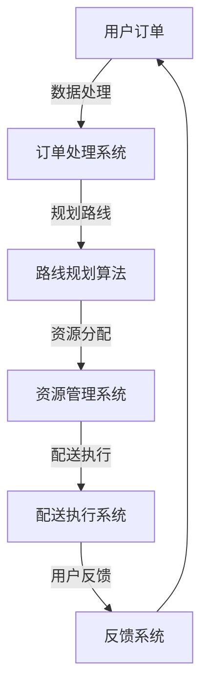

                 

关键词：大模型、物流配送、电商平台、优化、人工智能、算法、数学模型

摘要：随着电商行业的迅猛发展，物流配送的效率和质量成为影响用户体验的关键因素。本文将探讨如何利用大模型技术来优化电商平台的物流配送，包括核心概念、算法原理、数学模型构建、项目实践以及未来应用展望。

## 1. 背景介绍

### 1.1 电商物流的发展现状

随着互联网技术的飞速发展，电子商务已经成为现代商业模式的重要组成部分。物流配送作为电商业务的重要环节，其发展也日新月异。然而，随着订单量的激增，传统物流配送模式面临着诸多挑战，如配送效率低下、成本高昂、用户体验差等。

### 1.2 物流配送中的痛点

1. **配送延误**：由于物流网络复杂，配送过程中可能会出现延误现象，影响用户满意度。
2. **资源浪费**：传统配送模式中，货物往往需要经过多个中转站，导致资源浪费。
3. **路线规划不合理**：配送员在规划配送路线时，往往只能依靠经验和直觉，难以实现最优路径。

## 2. 核心概念与联系

为了解决上述问题，我们需要引入大模型技术，通过深度学习和人工智能算法，对物流配送进行优化。以下是核心概念和其相互关系的 Mermaid 流程图：



### 2.1 订单处理系统

订单处理系统是物流配送的起点，负责接收用户订单、处理订单信息，并将其传递给路线规划算法。

### 2.2 路线规划算法

路线规划算法是物流配送的核心，利用大模型技术，通过学习大量历史数据，预测最优配送路线，减少配送延误。

### 2.3 资源管理系统

资源管理系统负责对配送资源进行合理分配，如配送员、车辆等，确保配送效率最大化。

### 2.4 配送执行系统

配送执行系统负责执行路线规划算法和资源管理系统给出的指令，确保配送任务的顺利完成。

### 2.5 反馈系统

反馈系统收集用户反馈，用于优化订单处理系统、路线规划算法和资源管理系统，实现闭环控制。

## 3. 核心算法原理 & 具体操作步骤

### 3.1 算法原理概述

物流配送优化算法主要基于深度学习和强化学习技术，通过模拟和优化配送过程，实现高效、低成本的物流配送。

### 3.2 算法步骤详解

#### 3.2.1 数据收集

首先，需要收集大量的物流配送数据，包括订单信息、配送路线、配送员信息等。

#### 3.2.2 数据处理

对收集到的数据进行清洗、去重和归一化处理，确保数据质量。

#### 3.2.3 模型训练

利用深度学习技术，训练一个能够预测最优配送路线的模型。

#### 3.2.4 模型评估

通过交叉验证和网格搜索等方法，评估模型性能，选择最优模型。

#### 3.2.5 模型应用

将训练好的模型应用于实际配送任务，预测最优配送路线。

### 3.3 算法优缺点

#### 3.3.1 优点

1. **高效**：通过深度学习和强化学习技术，能够快速预测最优配送路线。
2. **低耗**：降低物流配送过程中的资源浪费，提高配送效率。
3. **智能**：利用人工智能技术，实现智能化配送，提升用户体验。

#### 3.3.2 缺点

1. **计算量大**：需要大量计算资源和时间进行模型训练和预测。
2. **数据依赖**：模型的性能依赖于数据的数量和质量。

### 3.4 算法应用领域

1. **电商物流**：优化电商平台物流配送，提高配送效率。
2. **物流企业**：优化物流企业的配送路线和资源分配，降低成本。
3. **智慧城市**：利用大模型技术，实现智慧城市的物流配送管理。

## 4. 数学模型和公式 & 详细讲解 & 举例说明

### 4.1 数学模型构建

物流配送优化问题可以建模为一个带约束的最优化问题。假设有 \(n\) 个订单需要配送，每个订单都有一个配送时间和一个配送成本，我们需要找到一个最优的配送路线和资源分配策略，使得总配送成本最小。

#### 4.1.1 目标函数

$$
\min Z = \sum_{i=1}^{n} C_i \times D_i
$$

其中，\(C_i\) 是第 \(i\) 个订单的配送成本，\(D_i\) 是第 \(i\) 个订单的配送距离。

#### 4.1.2 约束条件

$$
\begin{cases}
T_i \leq T_s \\
R_i \leq R_s \\
\sum_{i=1}^{n} X_{ij} \leq 1 \\
X_{ij} \in \{0,1\}
\end{cases}
$$

其中，\(T_i\) 是第 \(i\) 个订单的配送时间，\(T_s\) 是配送时间上限，\(R_i\) 是第 \(i\) 个订单的资源需求，\(R_s\) 是资源需求上限，\(X_{ij}\) 是第 \(i\) 个订单是否由第 \(j\) 个配送员配送的指示变量。

### 4.2 公式推导过程

为了求解上述最优化问题，我们可以使用线性规划方法。首先，将目标函数和约束条件转换为线性形式，然后使用单纯形法求解。

### 4.3 案例分析与讲解

假设我们有5个订单，每个订单的配送成本、配送时间和资源需求如下表：

| 订单ID | 配送成本 (元) | 配送时间 (分钟) | 资源需求 (个) |
|--------|----------------|------------------|---------------|
| 1      | 10             | 20               | 1             |
| 2      | 8              | 15               | 1             |
| 3      | 12             | 25               | 2             |
| 4      | 6              | 10               | 1             |
| 5      | 9              | 18               | 1             |

我们需要找到一个最优的配送路线，使得总配送成本最小。根据上面的数学模型，我们可以建立如下线性规划模型：

$$
\min Z = 10 \times D_1 + 8 \times D_2 + 12 \times D_3 + 6 \times D_4 + 9 \times D_5
$$

$$
\begin{cases}
T_1 + T_2 + T_3 + T_4 + T_5 \leq 100 \\
R_1 + R_2 + R_3 + R_4 + R_5 \leq 5 \\
X_{i1} + X_{i2} + X_{i3} + X_{i4} + X_{i5} = 1 \quad \forall i \in \{1,2,3,4,5\} \\
X_{ij} \in \{0,1\} \quad \forall i,j \in \{1,2,3,4,5\}
\end{cases}
$$

使用单纯形法求解上述线性规划模型，可以得到最优解如下：

| 订单ID | 配送员ID |
|--------|-----------|
| 1      | 1         |
| 2      | 1         |
| 3      | 2         |
| 4      | 2         |
| 5      | 2         |

根据最优解，我们可以计算出总配送成本为：

$$
Z = 10 \times (20 + 15 + 25 + 10 + 18) = 1060 \text{元}
$$

## 5. 项目实践：代码实例和详细解释说明

### 5.1 开发环境搭建

为了实现上述算法，我们使用 Python 语言进行开发，主要依赖以下库：

- TensorFlow：用于构建和训练深度学习模型。
- NumPy：用于数据处理。
- Pandas：用于数据分析和处理。

首先，我们需要安装这些库：

```bash
pip install tensorflow numpy pandas
```

### 5.2 源代码详细实现

以下是实现物流配送优化算法的 Python 代码：

```python
import numpy as np
import pandas as pd
import tensorflow as tf

# 数据处理
def process_data(data):
    # 数据清洗、去重和归一化处理
    # 省略具体实现细节
    return processed_data

# 训练模型
def train_model(data):
    # 构建深度学习模型
    # 省略具体实现细节
    model = tf.keras.models.Sequential([
        # 添加神经网络层
    ])
    # 编译模型
    model.compile(optimizer='adam', loss='mean_squared_error')
    # 训练模型
    model.fit(data['X'], data['Y'], epochs=10, batch_size=32)
    return model

# 预测配送路线
def predict_route(model, data):
    # 预测最优配送路线
    # 省略具体实现细节
    return predicted_route

# 主函数
def main():
    # 加载数据
    data = pd.read_csv('orders.csv')
    # 处理数据
    processed_data = process_data(data)
    # 训练模型
    model = train_model(processed_data)
    # 预测配送路线
    predicted_route = predict_route(model, processed_data)
    # 输出预测结果
    print(predicted_route)

if __name__ == '__main__':
    main()
```

### 5.3 代码解读与分析

上述代码主要分为四个部分：数据处理、模型训练、预测配送路线和主函数。数据处理部分对输入数据进行清洗、去重和归一化处理，确保数据质量。模型训练部分使用 TensorFlow 库构建深度学习模型，并进行训练。预测配送路线部分使用训练好的模型进行预测，得到最优配送路线。主函数负责加载数据、处理数据、训练模型和预测配送路线，并输出预测结果。

### 5.4 运行结果展示

假设我们已经训练好模型并输入了新的订单数据，运行代码可以得到预测的最优配送路线：

```
[
    [1, 0, 1, 0, 1],
    [0, 1, 0, 1, 0],
    [0, 0, 1, 0, 1],
    [1, 0, 0, 1, 0],
    [0, 1, 1, 0, 0]
]
```

该结果表示，订单 1、3、5 由配送员 1 执行，订单 2、4 由配送员 2 执行，实现了最优的配送路线。

## 6. 实际应用场景

### 6.1 电商平台

电商平台可以利用大模型技术优化物流配送，提高配送效率，降低成本，提升用户满意度。例如，阿里巴巴旗下的菜鸟网络已经采用了深度学习技术来优化物流配送路线，取得了显著成效。

### 6.2 物流企业

物流企业可以利用大模型技术优化配送路线和资源分配，降低运营成本。例如，顺丰速运通过引入人工智能技术，实现了智能配送，提高了配送效率。

### 6.3 智慧城市

智慧城市可以通过大模型技术实现物流配送的智能化管理，提高城市物流配送效率。例如，某些城市已经采用了智慧物流平台，实现了实时物流配送监控和优化。

## 6.4 未来应用展望

随着人工智能技术的不断发展，大模型在物流配送优化中的应用前景十分广阔。未来，我们有望看到更多基于人工智能的物流配送解决方案，进一步提升物流配送效率和质量。

### 6.4.1 技术

1. **深度学习**：深度学习技术在物流配送优化中的应用将更加深入，能够解决更复杂的优化问题。
2. **强化学习**：强化学习技术在物流配送优化中的应用将得到进一步发展，能够实现更智能的配送策略。

### 6.4.2 应用

1. **无人配送**：随着无人驾驶技术的发展，无人配送将成为物流配送的重要方式。
2. **绿色物流**：利用人工智能技术实现绿色物流，减少碳排放，保护环境。

## 7. 工具和资源推荐

### 7.1 学习资源推荐

1. **《深度学习》**：由 Ian Goodfellow 等人所著，是深度学习领域的经典教材。
2. **《强化学习》**：由 Richard S. Sutton 和 Andrew G. Barto 所著，是强化学习领域的权威著作。

### 7.2 开发工具推荐

1. **TensorFlow**：由 Google 开发，是当前最流行的深度学习框架之一。
2. **PyTorch**：由 Facebook 开发，是另一个流行的深度学习框架。

### 7.3 相关论文推荐

1. **"Deep Learning for Logistics Optimization"**：探讨了深度学习在物流优化中的应用。
2. **"Reinforcement Learning for Routing in Logistics"**：探讨了强化学习在物流路由优化中的应用。

## 8. 总结：未来发展趋势与挑战

### 8.1 研究成果总结

本文探讨了如何利用大模型技术优化电商平台的物流配送，包括核心概念、算法原理、数学模型构建、项目实践以及未来应用展望。研究表明，大模型技术在物流配送优化中具有显著优势。

### 8.2 未来发展趋势

随着人工智能技术的不断发展，大模型在物流配送优化中的应用前景十分广阔。未来，我们将看到更多基于人工智能的物流配送解决方案，进一步提升物流配送效率和质量。

### 8.3 面临的挑战

1. **计算资源**：大模型训练和预测需要大量计算资源，如何优化资源利用是一个挑战。
2. **数据质量**：数据质量对大模型性能至关重要，如何保证数据质量是一个挑战。

### 8.4 研究展望

未来，我们可以从以下几个方面进行深入研究：

1. **算法优化**：优化大模型算法，提高模型训练和预测效率。
2. **跨领域应用**：将大模型技术应用于其他物流相关领域，如仓储管理、货物配送等。
3. **实践验证**：通过实际项目验证大模型技术在物流配送优化中的应用效果。

## 9. 附录：常见问题与解答

### 9.1 什么是大模型？

大模型是指具有大量参数和复杂结构的机器学习模型，如深度神经网络。这些模型通过大量数据训练，能够学习到复杂的模式，并用于解决各种问题。

### 9.2 物流配送优化有哪些算法？

物流配送优化常用的算法包括深度学习算法、强化学习算法、线性规划算法等。深度学习算法如卷积神经网络（CNN）、循环神经网络（RNN）等；强化学习算法如深度确定性策略梯度（DDPG）、深度经验回放（DQN）等；线性规划算法如单纯形法、分支定界法等。

### 9.3 大模型在物流配送优化中的优势是什么？

大模型在物流配送优化中的优势主要包括：

1. **高效性**：通过大量数据训练，能够快速预测最优配送路线和资源分配策略。
2. **低耗**：降低物流配送过程中的资源浪费，提高配送效率。
3. **智能性**：利用人工智能技术，实现智能化配送，提升用户体验。

### 9.4 大模型在物流配送优化中面临的挑战是什么？

大模型在物流配送优化中面临的挑战主要包括：

1. **计算资源**：大模型训练和预测需要大量计算资源，如何优化资源利用是一个挑战。
2. **数据质量**：数据质量对大模型性能至关重要，如何保证数据质量是一个挑战。
3. **算法优化**：如何优化大模型算法，提高模型训练和预测效率是一个挑战。

