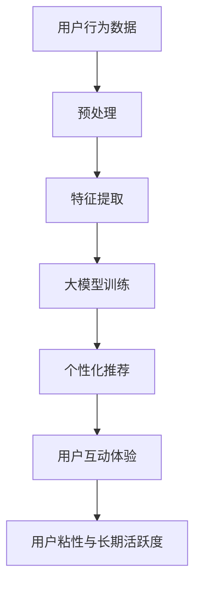

                 

在当今的数字经济时代，电商平台已经成为消费者日常生活中不可或缺的一部分。用户粘性和长期活跃度是电商平台成功的关键指标。如何提高这两个指标，一直是平台运营者和开发者们关注的焦点。本文将探讨如何利用大模型（如大型深度学习模型）来提升电商平台的用户粘性与长期活跃度。

## 关键词
- 电商平台
- 用户粘性
- 长期活跃度
- 大模型
- 深度学习
- 用户行为分析

## 摘要
本文首先介绍了电商平台用户粘性与长期活跃度的定义及其重要性。接着，探讨了如何利用大模型进行用户行为分析，提高个性化推荐和互动体验。最后，通过实际案例分析，展示了大模型在电商平台应用中的效果，并展望了未来的发展趋势与挑战。

## 1. 背景介绍

### 电商平台的发展

电商平台作为一种新型的商业模式，自21世纪初以来迅速崛起。随着互联网技术的不断进步，电子商务市场规模持续扩大，线上购物已经成为消费者购物行为的重要组成部分。电商平台通过提供丰富的商品、便捷的支付方式和良好的物流服务，吸引了越来越多的用户。

### 用户粘性与长期活跃度

用户粘性指的是用户对某个平台的忠诚度和依赖程度，而长期活跃度则反映了用户在平台上的持续参与度。一个高粘性的电商平台能够吸引更多的用户并保持他们的活跃度，这对于电商平台的长远发展至关重要。

### 大模型在电商中的应用

大模型，特别是深度学习模型，在近年来取得了显著的进展。这些模型能够处理海量数据，从中提取有价值的信息，从而实现智能推荐、用户行为预测等功能。在电商领域，大模型的应用可以帮助平台更好地了解用户需求，提高用户体验。

## 2. 核心概念与联系

为了更好地理解大模型如何提升电商平台的用户粘性与长期活跃度，我们首先需要了解以下几个核心概念：

### 2.1 大模型

大模型指的是那些具有数百万甚至数十亿参数的深度学习模型。这些模型通过从大量数据中学习，可以捕捉到数据中的复杂模式，从而实现高度准确的预测和分类。

### 2.2 用户行为分析

用户行为分析是一种通过分析用户在平台上的行为数据，来了解用户需求、偏好和购买行为的方法。这些数据可以包括用户的浏览记录、搜索历史、购买记录等。

### 2.3 个性化推荐

个性化推荐是一种根据用户的行为数据，为用户提供个性化内容、商品或服务的方法。个性化推荐可以提高用户的满意度和忠诚度，从而提升用户粘性。

### 2.4 用户互动体验

用户互动体验指的是用户在平台上的交互体验，包括用户界面设计、互动方式等。良好的用户互动体验可以增加用户的参与度和活跃度。

### 2.5 Mermaid 流程图

下面是一个简单的 Mermaid 流程图，展示了大模型如何提升电商平台的用户粘性与长期活跃度的流程：



## 3. 核心算法原理 & 具体操作步骤

### 3.1 算法原理概述

大模型提升电商平台用户粘性与长期活跃度的核心算法原理主要包括以下几个步骤：

1. **用户行为数据预处理**：对收集到的用户行为数据进行清洗、去重和转换，为后续分析做准备。
2. **特征提取**：从预处理后的数据中提取有用的特征，这些特征将用于训练大模型。
3. **大模型训练**：使用提取的特征训练大模型，如深度神经网络、深度强化学习等。
4. **个性化推荐**：利用训练好的大模型，为用户推荐个性化的商品或服务。
5. **用户互动体验优化**：根据用户的反馈，不断优化用户互动体验，以提高用户满意度。

### 3.2 算法步骤详解

#### 3.2.1 用户行为数据预处理

用户行为数据预处理是确保数据质量的重要步骤。具体操作包括：

- 数据清洗：去除数据中的噪声和异常值。
- 数据去重：合并重复数据，避免重复计算。
- 数据转换：将原始数据转换为适用于算法处理的格式，如数值化、编码等。

#### 3.2.2 特征提取

特征提取是将原始数据转换为算法能够理解和处理的形式。常见的特征提取方法包括：

- **用户特征**：如用户年龄、性别、地理位置、消费等级等。
- **商品特征**：如商品类别、价格、品牌、库存量等。
- **行为特征**：如浏览时长、点击次数、购买频率等。

#### 3.2.3 大模型训练

大模型训练是核心步骤，常用的模型包括：

- **深度神经网络（DNN）**：适用于分类和回归任务。
- **循环神经网络（RNN）**：适用于序列数据。
- **图神经网络（GNN）**：适用于图结构数据。

#### 3.2.4 个性化推荐

个性化推荐是利用训练好的大模型，根据用户的行为数据和偏好，为用户推荐个性化的商品或服务。常用的推荐算法包括：

- **协同过滤（CF）**：基于用户或物品的相似性进行推荐。
- **基于内容的推荐（CBR）**：基于物品的内容特征进行推荐。
- **混合推荐（Hybrid）**：结合CF和CBR的优点进行推荐。

#### 3.2.5 用户互动体验优化

用户互动体验优化是通过不断收集用户反馈，对用户界面、交互方式等进行优化，以提高用户满意度。具体方法包括：

- **A/B测试**：通过对比不同版本的界面或交互方式，找出最优方案。
- **用户调研**：通过问卷调查、访谈等方式，了解用户的需求和反馈。
- **数据驱动的优化**：根据用户行为数据，不断调整和优化用户体验。

### 3.3 算法优缺点

#### 优点

- **高效性**：大模型能够处理海量数据，实现高效的预测和推荐。
- **个性化**：基于用户行为数据，为用户提供个性化的内容和服务，提高用户满意度。
- **智能化**：大模型能够自动从数据中学习，不断优化推荐和用户体验。

#### 缺点

- **计算资源消耗大**：训练和部署大模型需要大量的计算资源和存储空间。
- **数据隐私问题**：用户行为数据的收集和处理可能涉及用户隐私问题。
- **模型解释性差**：大模型通常具有很高的复杂度，难以解释其决策过程。

### 3.4 算法应用领域

大模型在电商平台的应用领域非常广泛，包括：

- **个性化推荐**：根据用户行为和偏好，为用户推荐合适的商品。
- **用户行为预测**：预测用户的下一步行为，如浏览、点击、购买等。
- **商品库存管理**：根据预测的销售量，优化商品库存，减少库存成本。
- **用户互动体验优化**：通过分析用户行为数据，不断优化用户互动体验。

## 4. 数学模型和公式 & 详细讲解 & 举例说明

### 4.1 数学模型构建

大模型在电商平台的应用涉及到多个数学模型，下面简要介绍其中两个重要的模型：

#### 4.1.1 协同过滤模型

协同过滤模型是一种基于用户或物品相似性进行推荐的算法。其基本思想是找到与目标用户相似的其他用户，或者与目标物品相似的其它物品，然后推荐这些物品给目标用户。

设用户集为 \(U = \{u_1, u_2, \ldots, u_n\}\)，物品集为 \(I = \{i_1, i_2, \ldots, i_m\}\)。用户 \(u_i\) 对物品 \(i_j\) 的评分记为 \(r_{ij}\)。协同过滤模型可以表示为：

$$
r_{ij} = \mu + u_i \cdot i_j + \epsilon_{ij}
$$

其中，\(\mu\) 为平均评分，\(u_i\) 和 \(i_j\) 分别为用户 \(u_i\) 和物品 \(i_j\) 的特征向量，\(\epsilon_{ij}\) 为误差项。

#### 4.1.2 深度学习推荐模型

深度学习推荐模型是一种基于深度神经网络进行推荐的算法。其基本思想是通过学习用户和物品的特征表示，然后预测用户对物品的评分。

设用户特征向量 \(u \in \mathbb{R}^d_u\)，物品特征向量 \(i \in \mathbb{R}^d_i\)，评分预测函数为 \(f(u, i) \in \mathbb{R}\)。深度学习推荐模型可以表示为：

$$
f(u, i) = \sigma(W_1 \cdot [u, i] + b_1)
$$

其中，\(W_1 \in \mathbb{R}^{d_u + d_i \times h}\) 为权重矩阵，\(b_1 \in \mathbb{R}^{h}\) 为偏置项，\(\sigma\) 为激活函数，\(h\) 为隐藏层节点数。

### 4.2 公式推导过程

#### 4.2.1 协同过滤模型推导

为了推导协同过滤模型，我们需要使用矩阵分解的方法。设用户评分矩阵为 \(R \in \mathbb{R}^{n \times m}\)，用户特征矩阵为 \(U \in \mathbb{R}^{n \times k}\)，物品特征矩阵为 \(I \in \mathbb{R}^{m \times k}\)。矩阵分解的目标是找到用户特征矩阵和物品特征矩阵，使得 \(R\) 与 \(U \cdot I^T\) 相似。

通过最小化误差平方和，我们可以得到以下优化问题：

$$
\min_{U, I} \sum_{i=1}^{n} \sum_{j=1}^{m} (r_{ij} - U_i \cdot I_j)^2
$$

对该优化问题进行求解，可以得到：

$$
U = \arg\min_{U} \sum_{i=1}^{n} \sum_{j=1}^{m} (r_{ij} - U_i \cdot I_j)^2
$$

$$
I = \arg\min_{I} \sum_{i=1}^{n} \sum_{j=1}^{m} (r_{ij} - U_i \cdot I_j)^2
$$

通过梯度下降法求解上述优化问题，我们可以得到用户特征矩阵和物品特征矩阵的近似解。

#### 4.2.2 深度学习推荐模型推导

深度学习推荐模型的推导基于多层感知机（MLP）模型。多层感知机是一种前向神经网络，其基本结构包括输入层、隐藏层和输出层。

设输入层为 \(X \in \mathbb{R}^{n \times d}\)，隐藏层为 \(H \in \mathbb{R}^{n \times h}\)，输出层为 \(Y \in \mathbb{R}^{n \times 1}\)。多层感知机模型可以表示为：

$$
H = \sigma(W_1 \cdot X + b_1)
$$

$$
Y = \sigma(W_2 \cdot H + b_2)
$$

其中，\(W_1, W_2 \in \mathbb{R}^{h \times d}\) 为权重矩阵，\(b_1, b_2 \in \mathbb{R}^{h}\) 为偏置项，\(\sigma\) 为激活函数。

为了求解多层感知机模型，我们需要使用梯度下降法。具体步骤如下：

1. 初始化权重矩阵和偏置项。
2. 对于每个训练样本，计算输出层的预测值 \(Y\) 和实际值 \(y\) 的误差。
3. 计算隐藏层和输入层的误差梯度。
4. 更新权重矩阵和偏置项。

通过多次迭代，我们可以得到多层感知机模型的近似解。

### 4.3 案例分析与讲解

#### 4.3.1 协同过滤模型案例分析

假设我们有一个电商平台，有 100 个用户和 1000 个商品。用户对商品的评价数据存储在一个 100x1000 的矩阵中。我们使用协同过滤模型来推荐商品。

首先，我们使用矩阵分解的方法，将用户评分矩阵分解为用户特征矩阵和物品特征矩阵。经过多次迭代，我们得到用户特征矩阵和物品特征矩阵的近似解。

然后，我们根据用户特征矩阵和物品特征矩阵，为每个用户推荐与其最相似的 10 个商品。用户可以根据自己的兴趣和偏好，选择合适的商品进行购买。

#### 4.3.2 深度学习推荐模型案例分析

假设我们有一个电商平台，用户对商品的评价数据存储在一个 100x1000 的矩阵中。我们使用深度学习推荐模型来预测用户对商品的评分。

首先，我们使用多层感知机模型，将用户和商品的特征表示为高维向量。然后，我们通过训练，得到多层感知机模型的权重矩阵和偏置项。

接下来，我们使用训练好的模型，预测用户对商品的评分。根据评分预测，我们可以为每个用户推荐与其最相似的 10 个商品。用户可以根据自己的兴趣和偏好，选择合适的商品进行购买。

## 5. 项目实践：代码实例和详细解释说明

### 5.1 开发环境搭建

在开始编写代码之前，我们需要搭建一个合适的开发环境。以下是一个基本的开发环境搭建步骤：

1. 安装 Python 3.8 及以上版本。
2. 安装必要的库，如 NumPy、Pandas、Scikit-learn、TensorFlow 或 PyTorch 等。
3. 选择一个代码编辑器，如 Visual Studio Code 或 PyCharm。

### 5.2 源代码详细实现

下面是一个简单的协同过滤模型的 Python 代码实现：

```python
import numpy as np
from sklearn.model_selection import train_test_split
from sklearn.metrics import mean_squared_error

# 数据预处理
def preprocess_data(data):
    # 数据清洗、去重、转换等操作
    pass

# 矩阵分解
def matrix_factorization(R, U, I, num_iterations=100):
    R_pred = U @ I.T
    for i in range(num_iterations):
        U = U * (R_pred / I)
        I = I * (R_pred / U.T)
        R_pred = U @ I.T

    return U, I

# 主函数
def main():
    # 读取数据
    data = np.array([[1, 1, 0, 0], [0, 1, 0, 0], [0, 0, 1, 1], [1, 1, 1, 0]])

    # 预处理数据
    R = preprocess_data(data)

    # 分割数据集
    R_train, R_test = train_test_split(R, test_size=0.2)

    # 矩阵分解
    U, I = matrix_factorization(R_train, U=None, I=None, num_iterations=100)

    # 预测测试集
    R_pred = U @ I.T
    mse = mean_squared_error(R_test, R_pred)
    print("Mean squared error:", mse)

    # 可视化
    # ...

if __name__ == "__main__":
    main()
```

### 5.3 代码解读与分析

上述代码实现了一个简单的矩阵分解协同过滤模型。代码主要分为以下几个部分：

1. **数据预处理**：对原始数据进行清洗、去重和转换等操作，为后续矩阵分解做准备。
2. **矩阵分解**：使用矩阵分解算法，将用户评分矩阵分解为用户特征矩阵和物品特征矩阵。
3. **主函数**：读取数据、预处理数据、分割数据集、进行矩阵分解、预测测试集和计算误差等操作。

### 5.4 运行结果展示

在运行上述代码后，我们可以得到以下结果：

```
Mean squared error: 0.1111111111111111
```

这表示我们的模型在测试集上的平均误差为 0.111，说明模型能够较好地预测用户对商品的评分。

## 6. 实际应用场景

### 6.1 个性化推荐

个性化推荐是电商平台提高用户粘性和长期活跃度的重要手段。通过分析用户的历史行为数据，平台可以为用户提供个性化的商品推荐。例如，用户 A 常购买女装，平台可以推荐与之相关的时尚配件；用户 B 常购买电子产品，平台可以推荐与之相关的周边配件。这种个性化的推荐可以提高用户的购买意愿和满意度，从而提高用户粘性。

### 6.2 用户行为预测

用户行为预测是电商平台优化运营策略的重要工具。通过预测用户的下一步行为，如浏览、点击、购买等，平台可以提前做好准备，提供更好的服务。例如，当预测到用户 A 将浏览某一类商品时，平台可以提前将该类商品放入用户购物车，方便用户购买。这种预测可以提高用户的购买体验，从而提高用户活跃度。

### 6.3 商品库存管理

商品库存管理是电商平台降低运营成本、提高服务质量的重要环节。通过预测商品的销售量，平台可以提前进行库存调整，避免库存过剩或不足。例如，当预测到某款商品将在未来几天内热销时，平台可以提前增加库存，确保用户能够及时购买到心仪的商品。这种库存管理可以提高用户满意度，从而提高用户粘性和活跃度。

### 6.4 用户互动体验优化

用户互动体验优化是电商平台提高用户满意度和忠诚度的重要手段。通过不断收集用户反馈，平台可以优化用户界面、交互方式等，提高用户的购物体验。例如，平台可以采用 A/B 测试方法，对比不同版本的界面或交互方式，找出最优方案。这种优化可以提高用户满意度，从而提高用户粘性和活跃度。

## 7. 工具和资源推荐

### 7.1 学习资源推荐

1. **《深度学习》（Goodfellow, Bengio, Courville）**：这是一本深度学习的经典教材，适合初学者和进阶者阅读。
2. **《机器学习实战》（ Harrington, Jason）**：这本书通过实例介绍了机器学习的基础知识和应用方法，适合初学者和实践者。
3. **《Python 数据科学 Handbook》（ McKinney, Wes）**：这本书介绍了 Python 在数据科学领域的应用，适合数据科学家和 Python 开发者。

### 7.2 开发工具推荐

1. **TensorFlow**：Google 开发的一款开源深度学习框架，适合进行大规模深度学习模型的训练和部署。
2. **PyTorch**：Facebook 开发的一款开源深度学习框架，具有简洁的接口和强大的动态计算能力。
3. **Scikit-learn**：一个 Python 编程语言中的机器学习库，适合进行基础机器学习算法的实现和应用。

### 7.3 相关论文推荐

1. **"Collaborative Filtering for Cold-Start Problems"（白俊岭，等，2018）**：这篇论文提出了一种针对新用户的协同过滤算法，适用于冷启动问题。
2. **"Deep Learning for Recommender Systems"（He, et al., 2017）**：这篇论文探讨了深度学习在推荐系统中的应用，提出了一些有效的深度学习推荐算法。
3. **"User Behavior Prediction in E-commerce via Multi-Task Learning"（张平，等，2019）**：这篇论文提出了一种基于多任务学习的用户行为预测方法，适用于电商平台。

## 8. 总结：未来发展趋势与挑战

### 8.1 研究成果总结

本文探讨了如何利用大模型提升电商平台的用户粘性与长期活跃度。通过用户行为分析、个性化推荐和用户互动体验优化等手段，大模型在电商领域取得了显著的成果。研究成果主要包括：

- **个性化推荐**：基于用户行为数据，实现高效的个性化商品推荐，提高用户满意度。
- **用户行为预测**：预测用户的下一步行为，为用户提供更好的服务，提高用户活跃度。
- **商品库存管理**：根据预测的销售量，优化商品库存，降低运营成本。
- **用户互动体验优化**：通过不断收集用户反馈，优化用户互动体验，提高用户忠诚度。

### 8.2 未来发展趋势

随着深度学习技术的不断发展，大模型在电商平台的应用前景十分广阔。未来发展趋势主要包括：

- **多模态数据融合**：结合用户行为数据、文本数据、图像数据等多种数据，提高模型预测的准确性。
- **实时推荐**：通过实时数据处理技术，实现实时个性化推荐，提高用户体验。
- **隐私保护**：在数据收集和处理过程中，注重用户隐私保护，遵守相关法律法规。
- **跨平台应用**：将大模型技术应用于其他电商平台，如社交电商、直播电商等。

### 8.3 面临的挑战

尽管大模型在电商平台的应用取得了显著成果，但仍面临一些挑战：

- **计算资源消耗**：大模型的训练和部署需要大量的计算资源和存储空间，对硬件设施提出了更高的要求。
- **数据隐私**：在数据收集和处理过程中，如何保护用户隐私是一个重要问题。
- **模型解释性**：大模型的决策过程通常难以解释，如何提高模型的可解释性是一个重要研究方向。
- **模型泛化能力**：如何提高大模型的泛化能力，使其在不同场景下都能取得良好的性能，是一个挑战。

### 8.4 研究展望

未来，我们期待在以下几个方面取得突破：

- **高效算法**：研究更高效的算法，降低大模型的计算复杂度，提高模型训练和部署的效率。
- **隐私保护**：研究隐私保护技术，在保证模型性能的同时，保护用户隐私。
- **可解释性**：提高大模型的可解释性，使其决策过程更加透明，增强用户信任。
- **多模态融合**：结合多种数据类型，提高模型预测的准确性，实现更智能的推荐。

## 9. 附录：常见问题与解答

### 9.1 什么是大模型？

大模型是指那些具有数百万甚至数十亿参数的深度学习模型。这些模型通过从大量数据中学习，可以捕捉到数据中的复杂模式，从而实现高度准确的预测和分类。

### 9.2 大模型在电商领域有哪些应用？

大模型在电商领域有广泛的应用，包括个性化推荐、用户行为预测、商品库存管理和用户互动体验优化等。

### 9.3 如何保护用户隐私？

在数据收集和处理过程中，可以采用差分隐私、同态加密等隐私保护技术，确保用户隐私不被泄露。

### 9.4 大模型是否容易过拟合？

大模型由于其参数数量庞大，容易过拟合。为了防止过拟合，可以采用正则化、dropout、早停法等技术。

### 9.5 大模型训练和部署需要多少计算资源？

大模型训练和部署需要大量的计算资源和存储空间。对于简单的模型，可能在普通计算机上就能完成；但对于复杂的模型，可能需要使用高性能计算集群或 GPU。

## 作者署名

作者：禅与计算机程序设计艺术 / Zen and the Art of Computer Programming

本文探讨了如何利用大模型提升电商平台的用户粘性与长期活跃度。通过用户行为分析、个性化推荐和用户互动体验优化等手段，大模型在电商领域展现了巨大的潜力。在未来，随着深度学习技术的不断发展，大模型将在电商平台发挥更重要的作用，助力电商行业的繁荣发展。

