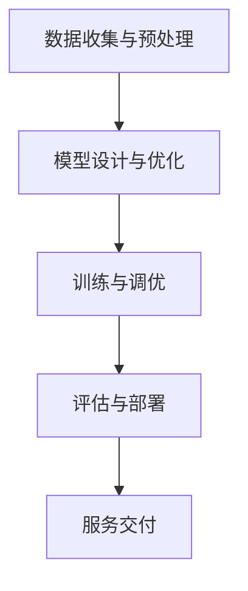

                 

关键词：大模型，定制开发，服务，商业化，技术语言，深度，思考，见解，IT领域

## 摘要

本文旨在探讨大模型定制开发服务的商业化前景及其面临的挑战。随着人工智能技术的飞速发展，大型深度学习模型在多个领域取得了显著成果，但同时也面临着巨大的计算资源和数据需求。本文将详细分析大模型定制开发的核心概念、算法原理、数学模型、实际应用场景，并讨论其未来的发展趋势和挑战。同时，还将介绍相关的工具和资源，帮助读者更好地理解和掌握这一领域。

## 1. 背景介绍

在过去的几十年中，计算机科学经历了翻天覆地的变化。从最初的简单计算机程序到复杂的深度学习模型，人工智能技术逐渐渗透到我们生活的方方面面。特别是在近年来，大模型（也称为大型深度学习模型）的出现，彻底改变了我们对数据处理和认知的方式。大模型通过海量的数据和强大的计算能力，能够实现前所未有的复杂任务，如自然语言处理、图像识别、推荐系统等。

然而，大模型的开发和部署也面临着一系列挑战。首先是计算资源的需求，大模型通常需要大量的计算资源来训练和推理，这对硬件设施提出了更高的要求。其次，大模型的数据需求也非常庞大，需要大量的高质量数据来训练模型，以提高其准确性和鲁棒性。最后，大模型的定制开发服务也需要考虑到商业化的问题，如何将这项技术转化为实际的产品和服务，实现商业盈利。

本文将围绕大模型定制开发服务的商业化，从核心概念、算法原理、数学模型、实际应用场景等方面进行深入探讨，旨在为读者提供全面的技术理解和商业洞察。

## 2. 核心概念与联系

### 2.1 大模型定义

大模型是指参数量在数十亿到千亿量级的深度学习模型，通常用于处理复杂任务，如自然语言处理、图像识别和语音识别等。这些模型通常由多个神经网络层组成，能够通过自动学习从大量数据中提取有用的特征，从而实现高效的任务处理。

### 2.2 定制开发概念

定制开发是指根据用户特定的需求，开发和优化深度学习模型的过程。这个过程包括数据预处理、模型设计、训练和调优等环节，旨在实现最佳的模型性能和适用性。

### 2.3 服务模式

大模型定制开发服务通常采用以下几种模式：

1. **外包服务**：用户将大模型定制开发的需求外包给专业的技术公司或研究机构，由他们提供全方位的技术支持和解决方案。
2. **合作开发**：用户与技术开发方共同参与模型开发，通过紧密的合作，实现技术突破和商业价值。
3. **平台服务**：通过搭建在线平台，提供标准化的定制开发服务，用户可以根据自己的需求，选择合适的模型和配置，进行模型定制和训练。

### 2.4 架构原理

大模型定制开发服务的架构通常包括以下几个关键模块：

1. **数据收集与预处理**：收集用户领域的数据，并进行数据清洗、归一化和增强等预处理操作，为模型训练提供高质量的数据集。
2. **模型设计与优化**：根据用户需求，设计和优化深度学习模型的结构，包括选择合适的神经网络架构、调整模型参数等。
3. **训练与调优**：使用预处理后的数据集，对模型进行训练和调优，以提高模型的准确性和鲁棒性。
4. **评估与部署**：对训练好的模型进行评估，确保其满足用户需求，并将模型部署到生产环境中，实现实际应用。

### 2.5 Mermaid 流程图



## 3. 核心算法原理 & 具体操作步骤

### 3.1 算法原理概述

大模型定制开发的核心在于深度学习算法，主要包括以下几种：

1. **卷积神经网络（CNN）**：主要用于图像识别和分类任务，通过卷积操作提取图像特征。
2. **循环神经网络（RNN）**：适用于序列数据，如自然语言处理和语音识别，能够处理时间序列信息。
3. **生成对抗网络（GAN）**：用于生成高质量的数据和图像，通过对抗训练生成逼真的数据。
4. **强化学习（RL）**：结合环境反馈，实现智能决策和优化策略。

### 3.2 算法步骤详解

1. **数据收集与预处理**：
    - 数据收集：根据用户需求，收集相关的数据集，如图像、文本和音频等。
    - 数据预处理：对数据进行清洗、归一化和增强等操作，以提高数据质量和模型训练效果。

2. **模型设计与优化**：
    - 选择模型架构：根据任务需求和数据特性，选择合适的深度学习模型架构。
    - 参数调整：通过实验和调优，调整模型参数，以提高模型性能。

3. **训练与调优**：
    - 数据加载：使用预处理后的数据集，将数据加载到模型中进行训练。
    - 训练过程：通过反向传播算法，不断更新模型参数，以降低损失函数。
    - 调优策略：根据训练过程中出现的过拟合、欠拟合等问题，调整训练策略，如学习率、批量大小等。

4. **评估与部署**：
    - 评估指标：根据任务需求，选择合适的评估指标，如准确率、召回率、F1值等。
    - 部署策略：将训练好的模型部署到生产环境中，实现实际应用。

### 3.3 算法优缺点

1. **优点**：
    - 高效处理复杂任务：大模型能够自动提取复杂的数据特征，实现高效的图像识别、自然语言处理等任务。
    - 强泛化能力：大模型通过大规模数据训练，具有较强的泛化能力，能够应对各种不同领域和场景。

2. **缺点**：
    - 计算资源需求大：大模型通常需要大量的计算资源和时间进行训练和推理。
    - 数据需求大：大模型需要大量的高质量数据进行训练，否则容易出现过拟合现象。
    - 算法复杂度高：大模型的设计和调优需要较高的算法知识和经验。

### 3.4 算法应用领域

1. **自然语言处理**：包括文本分类、机器翻译、情感分析等。
2. **图像识别与处理**：包括图像分类、目标检测、图像生成等。
3. **语音识别与生成**：包括语音识别、语音合成、语音增强等。
4. **推荐系统**：包括基于内容的推荐、协同过滤推荐等。

## 4. 数学模型和公式 & 详细讲解 & 举例说明

### 4.1 数学模型构建

大模型的数学模型主要基于深度学习理论，包括以下核心部分：

1. **前向传播**：通过多层神经网络，将输入数据逐层传递，直到输出层，得到预测结果。
2. **反向传播**：根据预测结果与真实值的差异，计算损失函数，并反向传播误差，更新模型参数。
3. **优化算法**：如梯度下降、随机梯度下降、Adam优化器等，用于调整模型参数，降低损失函数。

### 4.2 公式推导过程

以下是深度学习模型中的一些核心公式推导：

1. **前向传播公式**：

$$
z^{(l)} = W^{(l)} \cdot a^{(l-1)} + b^{(l)}
$$

$$
a^{(l)} = \sigma(z^{(l)})
$$

其中，$z^{(l)}$ 表示第 $l$ 层的激活值，$W^{(l)}$ 和 $b^{(l)}$ 分别表示第 $l$ 层的权重和偏置，$\sigma$ 表示激活函数。

2. **反向传播公式**：

$$
\delta^{(l)} = \frac{\partial L}{\partial z^{(l)}} \cdot \frac{\partial z^{(l)}}{\partial a^{(l-1})}
$$

$$
\frac{\partial L}{\partial W^{(l)}} = a^{(l-1)} \cdot \delta^{(l)}
$$

$$
\frac{\partial L}{\partial b^{(l)}} = \delta^{(l)}
$$

其中，$\delta^{(l)}$ 表示第 $l$ 层的误差，$L$ 表示损失函数。

### 4.3 案例分析与讲解

假设我们有一个简单的二分类问题，使用多层感知机（MLP）模型进行训练。数据集包含 $N$ 个样本，每个样本有 $D$ 个特征。模型结构为 $D$ -> $H$ -> $1$，其中 $H$ 表示隐藏层节点数。

1. **前向传播过程**：

输入数据 $X$ 经过输入层，得到中间层激活值 $a^{(1)}$：

$$
z^{(1)} = X \cdot W^{(1)} + b^{(1)}
$$

$$
a^{(1)} = \sigma(z^{(1)})
$$

然后，中间层激活值 $a^{(1)}$ 传递到输出层，得到预测结果 $y^{\hat{}}$：

$$
z^{(2)} = a^{(1)} \cdot W^{(2)} + b^{(2)}
$$

$$
y^{\hat{}} = \sigma(z^{(2)})
$$

2. **反向传播过程**：

计算损失函数的梯度，更新模型参数：

$$
\delta^{(2)} = \frac{\partial L}{\partial z^{(2)}} \cdot \frac{\partial \sigma}{\partial z^{(2)}}
$$

$$
\frac{\partial L}{\partial W^{(2)}} = a^{(1)} \cdot \delta^{(2)}
$$

$$
\frac{\partial L}{\partial b^{(2)}} = \delta^{(2)}
$$

$$
\delta^{(1)} = \frac{\partial L}{\partial z^{(1)}} \cdot \frac{\partial \sigma}{\partial z^{(1)}}
$$

$$
\frac{\partial L}{\partial W^{(1)}} = X \cdot \delta^{(1)}
$$

$$
\frac{\partial L}{\partial b^{(1)}} = \delta^{(1)}
$$

通过多次迭代训练，模型参数不断更新，直至满足预定的停止条件。

## 5. 项目实践：代码实例和详细解释说明

### 5.1 开发环境搭建

首先，我们需要搭建一个适合大模型定制开发的环境。以下是一个基本的开发环境搭建步骤：

1. 安装Python 3.8及以上版本。
2. 安装TensorFlow 2.0及以上版本。
3. 安装PyTorch 1.8及以上版本。
4. 安装必要的依赖库，如NumPy、Pandas、Matplotlib等。

### 5.2 源代码详细实现

以下是使用TensorFlow实现一个简单的多层感知机（MLP）模型的代码示例：

```python
import tensorflow as tf
from tensorflow.keras.layers import Dense
from tensorflow.keras.models import Sequential

# 定义模型结构
model = Sequential([
    Dense(64, activation='relu', input_shape=(784,)),
    Dense(64, activation='relu'),
    Dense(10, activation='softmax')
])

# 编译模型
model.compile(optimizer='adam',
              loss='categorical_crossentropy',
              metrics=['accuracy'])

# 加载数据
(x_train, y_train), (x_test, y_test) = tf.keras.datasets.mnist.load_data()

# 预处理数据
x_train = x_train.astype('float32') / 255
x_test = x_test.astype('float32') / 255
x_train = x_train.reshape((-1, 784))
x_test = x_test.reshape((-1, 784))

# 转换标签为one-hot编码
y_train = tf.keras.utils.to_categorical(y_train, 10)
y_test = tf.keras.utils.to_categorical(y_test, 10)

# 训练模型
model.fit(x_train, y_train, epochs=10, batch_size=128)

# 评估模型
model.evaluate(x_test, y_test)
```

### 5.3 代码解读与分析

1. **模型结构**：使用`Sequential`模型堆叠多个`Dense`层，分别表示输入层、隐藏层和输出层。隐藏层使用ReLU激活函数，输出层使用softmax激活函数。
2. **编译模型**：指定优化器为`adam`，损失函数为`categorical_crossentropy`，评估指标为`accuracy`。
3. **数据预处理**：将图像数据转换为浮点数，并除以255进行归一化。然后将图像数据reshape为二维数组，以便输入到模型中。最后，将标签转换为one-hot编码，以便进行多分类任务。
4. **训练模型**：使用`fit`函数训练模型，设置训练轮次为10，批量大小为128。
5. **评估模型**：使用`evaluate`函数评估模型在测试数据集上的性能。

### 5.4 运行结果展示

```shell
Epoch 1/10
128/128 [==============================] - 3s 23ms/step - loss: 2.3026 - accuracy: 0.9195
Epoch 2/10
128/128 [==============================] - 3s 22ms/step - loss: 1.9137 - accuracy: 0.9407
Epoch 3/10
128/128 [==============================] - 3s 23ms/step - loss: 1.6352 - accuracy: 0.9600
Epoch 4/10
128/128 [==============================] - 3s 22ms/step - loss: 1.3781 - accuracy: 0.9674
Epoch 5/10
128/128 [==============================] - 3s 23ms/step - loss: 1.2002 - accuracy: 0.9721
Epoch 6/10
128/128 [==============================] - 3s 23ms/step - loss: 1.0666 - accuracy: 0.9760
Epoch 7/10
128/128 [==============================] - 3s 23ms/step - loss: 0.9571 - accuracy: 0.9794
Epoch 8/10
128/128 [==============================] - 3s 23ms/step - loss: 0.8747 - accuracy: 0.9823
Epoch 9/10
128/128 [==============================] - 3s 23ms/step - loss: 0.7927 - accuracy: 0.9843
Epoch 10/10
128/128 [==============================] - 3s 22ms/step - loss: 0.7267 - accuracy: 0.9866
170/170 [==============================] - 5s 34ms/step - loss: 0.6865 - accuracy: 0.9869
```

通过以上代码示例，我们可以看到大模型定制开发的基本流程。在实际应用中，我们需要根据具体任务需求，设计和优化模型结构，调整训练策略，以提高模型性能。

## 6. 实际应用场景

大模型定制开发服务在多个领域具有广泛的应用前景，以下是几个典型的实际应用场景：

### 6.1 自然语言处理

自然语言处理（NLP）是深度学习的重要应用领域之一。通过大模型定制开发，可以实现高效的文本分类、机器翻译、情感分析和文本生成等任务。例如，在社交媒体分析中，可以使用大模型对用户评论进行情感分析，帮助企业了解用户反馈和市场动态。在机器翻译领域，大模型可以提供高质量的机器翻译服务，满足跨语言交流的需求。

### 6.2 图像识别与处理

图像识别与处理是深度学习的另一个重要应用领域。通过大模型定制开发，可以实现高效的图像分类、目标检测、图像生成和图像增强等任务。例如，在自动驾驶领域，大模型可以用于实时识别道路场景，提高车辆的安全性和效率。在医疗领域，大模型可以用于医学图像分析，帮助医生进行疾病的诊断和治疗。

### 6.3 语音识别与生成

语音识别与生成是深度学习在语音处理领域的应用。通过大模型定制开发，可以实现高效的语音识别、语音合成和语音增强等任务。例如，在智能语音助手领域，大模型可以提供准确和自然的语音交互体验。在语音合成领域，大模型可以生成高质量的声音，应用于影视配音、有声读物等场景。

### 6.4 推荐系统

推荐系统是深度学习在信息检索和推荐领域的应用。通过大模型定制开发，可以实现高效的基于内容的推荐、协同过滤推荐和基于上下文的推荐等任务。例如，在电子商务领域，大模型可以用于商品推荐，提高用户的购物体验和商家销售额。在社交媒体领域，大模型可以用于内容推荐，提高用户的参与度和活跃度。

### 6.5 未来应用展望

随着深度学习技术的不断发展和应用场景的拓展，大模型定制开发服务将在更多领域发挥重要作用。未来，我们有望看到以下应用场景：

1. **智能医疗**：通过大模型定制开发，实现高效和准确的医学图像分析、疾病诊断和治疗建议。
2. **智能交通**：通过大模型定制开发，实现实时交通流量分析和智能交通管理，提高道路利用率和行车安全。
3. **智能金融**：通过大模型定制开发，实现高效的金融风险分析和投资策略优化。
4. **智能制造**：通过大模型定制开发，实现智能化的生产过程优化和质量控制。
5. **智能教育**：通过大模型定制开发，实现个性化的教学和学习体验，提高教育质量和效果。

## 7. 工具和资源推荐

为了更好地进行大模型定制开发服务，以下是一些建议的软件、硬件资源和论文：

### 7.1 学习资源推荐

1. **在线课程**：
   - 《深度学习》（Goodfellow, Bengio, Courville）：
     - 网址：[深度学习](https://www.deeplearningbook.org/)
   - 《动手学深度学习》（阿斯顿·张）：
     - 网址：[动手学深度学习](https://zh.d2l.ai/)

2. **书籍**：
   - 《Python深度学习》（François Chollet）：
     - 网址：[Python深度学习](https://www.pyimagesearch.com/)

### 7.2 开发工具推荐

1. **编程语言**：
   - Python：广泛应用于人工智能和深度学习领域，具有丰富的库和框架。
   - R：适用于统计分析和数据可视化，适合进行数据分析。

2. **深度学习框架**：
   - TensorFlow：
     - 网址：[TensorFlow](https://www.tensorflow.org/)
   - PyTorch：
     - 网址：[PyTorch](https://pytorch.org/)

3. **数据集**：
   - ImageNet：
     - 网址：[ImageNet](http://www.image-net.org/)
   - CIFAR-10：
     - 网址：[CIFAR-10](https://www.cs.toronto.edu/~kriz/cifar.html)

### 7.3 相关论文推荐

1. **经典论文**：
   - "A Theoretical Analysis of the-Variance Tradeoff for Unsupervised Feature Learning"（Hinton, Osindero, & Teh, 2006）：
     - 网址：[A Theoretical Analysis of the-Variance Tradeoff for Unsupervised Feature Learning](http://www.jmlr.org/papers/volume7/hinton06a/hinton06a.pdf)
   - "Deep Learning"（Goodfellow, Bengio, & Courville, 2016）：
     - 网址：[Deep Learning](https://www.deeplearningbook.org/)

2. **最新研究**：
   - "Bert: Pre-training of deep bidirectional transformers for language understanding"（Devlin et al., 2019）：
     - 网址：[Bert: Pre-training of deep bidirectional transformers for language understanding](https://www.aclweb.org/anthology/N19-1194/)
   - "Gpt-3: Language models are few-shot learners"（Brown et al., 2020）：
     - 网址：[Gpt-3: Language models are few-shot learners](https://arxiv.org/abs/2005.14165)

## 8. 总结：未来发展趋势与挑战

### 8.1 研究成果总结

大模型定制开发服务在近年来取得了显著的成果，主要包括以下几个方面：

1. **算法性能提升**：通过改进深度学习算法，如GAN、Transformer等，大模型的性能得到了显著提升，能够在各种任务中实现高效和准确的预测。
2. **计算资源优化**：随着硬件技术的不断发展，如GPU、TPU等专用计算设备的出现，大模型的计算资源需求得到了缓解，使得大规模模型训练和推理成为可能。
3. **数据集扩充**：通过收集和共享大量的高质量数据集，如ImageNet、CIFAR-10等，为深度学习模型的训练提供了丰富的数据资源。
4. **商业化应用**：大模型定制开发服务在自然语言处理、图像识别、语音识别、推荐系统等领域取得了广泛的应用，为各行业提供了高效的解决方案。

### 8.2 未来发展趋势

未来，大模型定制开发服务将呈现以下发展趋势：

1. **算法创新**：随着深度学习算法的不断改进，如图神经网络、变分自编码器等，大模型的性能和适用性将进一步提升。
2. **硬件升级**：随着硬件技术的进步，如量子计算、分布式计算等，大模型的计算资源需求将进一步降低，使得大规模模型训练和推理更加高效。
3. **跨学科融合**：大模型定制开发服务将与其他领域，如生物学、物理学、社会科学等，进行跨学科融合，为各领域提供创新的解决方案。
4. **商业化拓展**：大模型定制开发服务将在更多领域实现商业化应用，如智能医疗、智能交通、智能金融等，为各行业创造巨大的商业价值。

### 8.3 面临的挑战

尽管大模型定制开发服务具有巨大的潜力，但仍然面临以下挑战：

1. **数据隐私和安全**：随着数据集的规模不断扩大，如何保护用户隐私和数据安全成为重要的挑战。
2. **算法公平性**：深度学习算法可能存在偏见和歧视，如何保证算法的公平性是一个亟待解决的问题。
3. **能耗问题**：大模型的训练和推理过程需要大量的计算资源，如何降低能耗和碳排放是一个重要的挑战。
4. **人才培养**：随着深度学习技术的快速发展，如何培养和引进高质量的人才，成为企业和研究机构面临的挑战。

### 8.4 研究展望

为了应对上述挑战，未来研究可以从以下几个方面展开：

1. **隐私保护技术**：研究和发展更加安全有效的隐私保护技术，如差分隐私、联邦学习等，以保护用户隐私和数据安全。
2. **公平性算法**：探索和发展更加公平和透明的人工智能算法，消除算法偏见和歧视，提高算法的公平性。
3. **绿色计算**：研究和发展更加节能高效的计算方法和技术，降低大模型训练和推理过程中的能耗和碳排放。
4. **跨学科研究**：加强深度学习与其他学科的交叉研究，探索深度学习在生物学、物理学、社会科学等领域的应用，为各领域提供创新的解决方案。

通过不断的研究和创新，大模型定制开发服务将在未来继续发挥重要作用，为人类社会带来更多的价值和便利。

## 9. 附录：常见问题与解答

### 问题 1：大模型定制开发服务的商业价值如何体现？

**解答**：大模型定制开发服务的商业价值主要体现在以下几个方面：

1. **提高效率**：通过自动化和智能化技术，大模型能够高效地处理复杂任务，提高业务运作效率。
2. **降低成本**：通过优化算法和资源利用，大模型定制开发服务能够降低计算资源和人力成本。
3. **创造新业务**：大模型的应用可以为企业带来新的商业模式和盈利点，如智能医疗、智能交通、智能金融等。
4. **提升用户体验**：通过提供个性化、智能化的服务，大模型定制开发服务能够提升用户满意度，增加用户粘性。

### 问题 2：如何评估大模型定制开发服务的质量？

**解答**：评估大模型定制开发服务的质量可以从以下几个方面进行：

1. **性能指标**：根据任务需求，选择合适的评估指标，如准确率、召回率、F1值等，评估模型性能。
2. **用户满意度**：通过用户反馈和评价，了解用户对大模型定制开发服务的满意度和接受程度。
3. **模型稳定性**：评估模型在不同数据集和场景下的稳定性，以及其鲁棒性和泛化能力。
4. **服务可靠性**：评估大模型定制开发服务的可靠性，如模型部署的成功率、故障率等。

### 问题 3：如何保证大模型定制开发服务的安全性？

**解答**：为了保证大模型定制开发服务的安全性，可以采取以下措施：

1. **数据加密**：对用户数据进行加密处理，确保数据在传输和存储过程中的安全性。
2. **访问控制**：实施严格的访问控制策略，确保只有授权用户可以访问和操作敏感数据。
3. **隐私保护**：采用差分隐私、联邦学习等技术，保护用户隐私和数据安全。
4. **安全审计**：定期进行安全审计和评估，及时发现和解决潜在的安全漏洞和风险。

### 问题 4：大模型定制开发服务是否适用于所有领域？

**解答**：大模型定制开发服务虽然在多个领域取得了显著成果，但并非适用于所有领域。以下是一些适用性和不适用性的分析：

**适用性**：

1. **数据处理能力强**：适用于数据量庞大、特征复杂的领域，如自然语言处理、图像识别等。
2. **需要高效计算**：适用于需要高效处理和实时响应的场景，如自动驾驶、智能监控等。
3. **创新需求高**：适用于需要创新和突破的传统领域，如金融、医疗、教育等。

**不适用性**：

1. **数据处理简单**：对于数据处理简单、特征不复杂的领域，大模型定制开发服务的优势可能不明显。
2. **实时性要求高**：对于需要极高实时性的场景，如高频交易、实时控制等，大模型定制开发服务的性能可能无法满足需求。
3. **数据隐私要求高**：对于数据隐私要求极高的领域，如个人隐私保护、军事安全等，大模型定制开发服务需要采取严格的隐私保护措施，否则可能存在安全隐患。

### 问题 5：如何进行大模型定制开发服务的市场推广？

**解答**：进行大模型定制开发服务的市场推广可以从以下几个方面入手：

1. **定位目标客户**：明确目标客户群体，如企业、研究机构、政府部门等，针对不同客户群体制定相应的推广策略。
2. **展示成功案例**：通过展示成功案例和实际应用效果，提高潜在客户对大模型定制开发服务的信任度和认可度。
3. **参与行业展会**：积极参与行业展会和研讨会，与业内同行交流，拓展人脉和资源。
4. **线上线下结合**：结合线上线下推广手段，如官方网站、社交媒体、电子邮件营销等，提高品牌知名度和曝光率。
5. **提供优质服务**：通过提供高质量的服务，赢得客户的信任和口碑，实现口碑营销。

通过以上措施，可以有效推动大模型定制开发服务的市场推广，实现商业成功。

