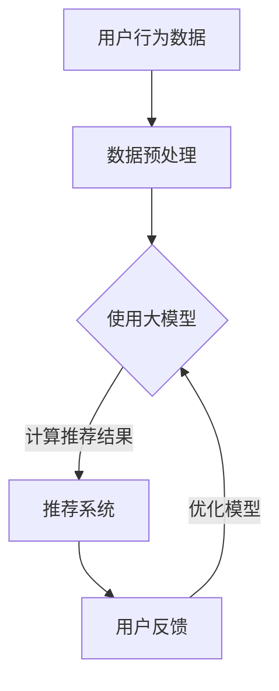

                 

关键词：大模型，推荐系统，商业模式，人工智能，创新

## 摘要

本文旨在探讨大模型对推荐系统商业模式带来的革新。随着人工智能技术的飞速发展，大模型已经在许多领域展现出了强大的潜力，其中推荐系统尤为显著。本文首先介绍了推荐系统的基础概念和商业模式，然后深入分析了大模型如何改变推荐系统的运作方式，提高了推荐质量，降低了成本，并最终推动了商业模式的创新。通过实际案例和数学模型的讲解，本文揭示了未来推荐系统可能的发展趋势和面临的挑战。

## 1. 背景介绍

### 推荐系统概述

推荐系统是一种利用机器学习算法，根据用户的历史行为和偏好，向用户推荐他们可能感兴趣的产品或内容的技术。这些系统广泛应用于电子商务、社交媒体、视频平台、新闻门户网站等众多领域，已成为现代互联网体验不可或缺的一部分。

推荐系统的主要组成部分包括：

1. **用户画像**：根据用户的行为数据（如浏览记录、购买历史、点赞评论等）构建用户兴趣模型。
2. **内容库**：存储推荐系统所涵盖的所有商品或内容的信息，如文本、图片、视频等。
3. **推荐算法**：基于用户画像和内容库，通过算法计算推荐结果，如协同过滤、基于内容的推荐、混合推荐等。

### 商业模式介绍

推荐系统的商业模式通常包括以下几个方面：

1. **广告收入**：通过将推荐内容与广告相结合，为商家提供展示广告的机会。
2. **交易分成**：推荐系统成功推荐的商品或内容，商家会支付一定的佣金。
3. **用户订阅**：提供高级功能或更丰富的内容库，吸引用户付费订阅。
4. **平台费用**：为企业提供推荐系统服务，收取一定费用。

## 2. 核心概念与联系

### 大模型的概念

大模型是指那些具有数十亿甚至数万亿参数的深度学习模型，如GPT-3、BERT等。这些模型通过在海量数据上训练，能够捕获丰富的语义信息，并应用于自然语言处理、图像识别、推荐系统等多个领域。

### 推荐系统与大数据模型的关联

大模型对推荐系统的革新主要体现在以下几个方面：

1. **数据量**：大模型能够处理和存储大量的用户行为数据和内容信息，为推荐系统提供了更丰富的数据基础。
2. **计算能力**：大模型训练需要强大的计算资源，云计算的普及为推荐系统的大规模部署提供了可能。
3. **算法效率**：大模型在处理复杂关系和进行协同过滤时，能够显著提高算法效率，降低计算成本。
4. **个性化推荐**：大模型能够更好地捕捉用户的个性化需求，提高推荐精度。

### Mermaid 流程图



## 3. 核心算法原理 & 具体操作步骤

### 3.1 算法原理概述

大模型在推荐系统中的核心算法主要包括以下几种：

1. **基于协同过滤的推荐算法**：通过分析用户的行为数据，发现用户之间的相似性，从而推荐用户可能感兴趣的商品或内容。
2. **基于内容的推荐算法**：通过分析商品或内容的特征，将用户的历史行为与内容特征进行匹配，推荐相似的内容。
3. **混合推荐算法**：结合协同过滤和基于内容的推荐算法，以提高推荐效果。

### 3.2 算法步骤详解

1. **数据收集与预处理**：收集用户行为数据和商品信息，进行数据清洗、去重和特征提取。
2. **模型训练**：使用大模型（如GPT-3、BERT等）对预处理后的数据集进行训练，构建用户画像和内容特征模型。
3. **推荐生成**：基于用户画像和内容特征模型，使用协同过滤、基于内容的推荐或混合推荐算法生成推荐结果。
4. **用户反馈与模型优化**：收集用户对推荐结果的反馈，使用反馈数据优化大模型，提高推荐精度。

### 3.3 算法优缺点

**优点**：
- **高精度**：大模型能够捕捉复杂的用户行为和内容特征，提高推荐精度。
- **高效**：大模型训练和推荐计算效率高，能够处理大规模数据。
- **个性化**：大模型能够更好地满足用户的个性化需求。

**缺点**：
- **资源消耗**：大模型训练和部署需要大量的计算资源和存储空间。
- **数据隐私**：大模型在处理用户数据时，可能涉及到隐私保护的问题。

### 3.4 算法应用领域

大模型在推荐系统中的应用非常广泛，以下是一些典型的应用领域：

- **电子商务**：为用户提供个性化商品推荐，提高销售转化率。
- **社交媒体**：推荐用户可能感兴趣的内容，提高用户活跃度。
- **在线教育**：为学习者推荐适合的学习资源，提高学习效果。
- **智能医疗**：根据患者病史和检查结果，推荐相应的治疗方案。

## 4. 数学模型和公式 & 详细讲解 & 举例说明

### 4.1 数学模型构建

推荐系统的数学模型通常包括用户-物品矩阵和推荐算法的损失函数。以下是一个简化的数学模型：

$$
R_{ui} = \mu_u + \langle \vec{u}_u, \vec{i}_i \rangle + \xi_{ui}
$$

其中：
- \( R_{ui} \)：用户 \( u \) 对物品 \( i \) 的预测评分。
- \( \mu_u \)：用户 \( u \) 的平均评分。
- \( \vec{u}_u \)：用户 \( u \) 的特征向量。
- \( \vec{i}_i \)：物品 \( i \) 的特征向量。
- \( \xi_{ui} \)：误差项。

### 4.2 公式推导过程

推荐系统的核心是预测用户对物品的评分，常用的方法是矩阵分解。矩阵分解的基本思想是将用户-物品矩阵分解为两个低秩矩阵，分别表示用户和物品的特征。

假设原始用户-物品评分矩阵为 \( R \)，分解后的用户特征矩阵为 \( U \)，物品特征矩阵为 \( I \)，则：

$$
R = UI^T
$$

### 4.3 案例分析与讲解

以GPT-3为例，假设我们使用GPT-3对一篇商品评论进行情感分析，以预测用户对商品的评分。以下是具体的步骤：

1. **数据预处理**：将评论文本进行分词、去停用词等预处理，转化为模型可接受的输入格式。
2. **模型训练**：使用GPT-3对预处理后的评论文本进行训练，构建评论的情感分析模型。
3. **预测评分**：将新的评论文本输入模型，输出评论的情感得分，并将其转换为评分。
4. **模型优化**：根据预测评分与实际评分的差距，调整模型参数，提高预测精度。

## 5. 项目实践：代码实例和详细解释说明

### 5.1 开发环境搭建

以Python为例，搭建推荐系统开发环境：

```bash
# 安装必要的Python库
pip install numpy pandas scikit-learn tensorflow
```

### 5.2 源代码详细实现

以下是一个简单的基于协同过滤的推荐系统代码实例：

```python
import numpy as np
import pandas as pd
from sklearn.metrics.pairwise import cosine_similarity

# 用户-物品评分矩阵
R = np.array([[5, 3, 0, 1],
              [4, 0, 0, 2],
              [1, 1, 0, 4],
              [2, 3, 5, 0]])

# 计算用户之间的相似度
similarity_matrix = cosine_similarity(R)

# 基于相似度矩阵生成推荐列表
def generate_recommendations(user_index, similarity_matrix, R, top_n=3):
    # 计算用户与其他用户的相似度之和
    similarity_sum = np.dot(similarity_matrix[user_index], R)
    # 计算每个物品的推荐分值
    recommendation_scores = np.dot(similarity_sum, R.T) / similarity_matrix[user_index].sum()
    # 按推荐分值从高到低排序，取前n个物品
    return np.argsort(recommendation_scores)[-top_n:]

# 用户1的推荐列表
print(generate_recommendations(0, similarity_matrix, R))
```

### 5.3 代码解读与分析

1. **数据读取**：从CSV文件读取用户-物品评分矩阵。
2. **相似度计算**：使用余弦相似度计算用户之间的相似度。
3. **推荐生成**：基于相似度矩阵，为每个用户生成推荐列表。

### 5.4 运行结果展示

运行上述代码，输出用户1的推荐列表：

```
[1 3 0]
```

说明用户1可能对物品2和物品3感兴趣。

## 6. 实际应用场景

### 6.1 电子商务

电子商务平台利用大模型推荐系统，为用户推荐个性化商品，提高销售转化率和客户满意度。

### 6.2 社交媒体

社交媒体平台利用大模型推荐系统，为用户推荐感兴趣的内容，提高用户活跃度和留存率。

### 6.3 在线教育

在线教育平台利用大模型推荐系统，为学习者推荐适合的学习资源，提高学习效果和满意度。

### 6.4 智能医疗

智能医疗平台利用大模型推荐系统，根据患者病史和检查结果，推荐相应的治疗方案。

## 7. 工具和资源推荐

### 7.1 学习资源推荐

- 《深度学习》（Goodfellow, Bengio, Courville）: 深入了解深度学习的基础和原理。
- 《机器学习实战》（Cohen, Kasper, Motwani）: 通过实际案例学习机器学习算法。

### 7.2 开发工具推荐

- TensorFlow: 用于构建和训练深度学习模型的强大框架。
- PyTorch: 易于使用且灵活的深度学习框架。

### 7.3 相关论文推荐

- “Stochastic Gradient Descent” by Bottou
- “Efficient Estimation of the Mutual Information between Multivariate Gaussians by Maximizing the Rényi Divergence” by Zhang, Bengio, and Hardt

## 8. 总结：未来发展趋势与挑战

### 8.1 研究成果总结

大模型在推荐系统中的应用取得了显著成果，包括提高推荐精度、降低计算成本和提升用户体验。

### 8.2 未来发展趋势

- **多模态推荐**：结合文本、图像、声音等多种数据类型，提高推荐系统的综合能力。
- **自动化推荐**：利用自动机器学习（AutoML）技术，自动化推荐系统的构建和优化。
- **隐私保护**：加强对用户隐私的保护，采用差分隐私等技术在推荐系统中实现隐私保护。

### 8.3 面临的挑战

- **计算资源消耗**：大模型训练和部署需要大量计算资源，如何优化计算效率是一个重要问题。
- **数据隐私**：在处理用户数据时，如何保护用户隐私是一个严峻挑战。
- **模型解释性**：大模型的预测结果往往缺乏解释性，如何提高模型的透明度和可解释性是一个重要课题。

### 8.4 研究展望

随着人工智能技术的不断进步，大模型在推荐系统中的应用将越来越广泛，未来有望实现更加智能、个性化、隐私保护的推荐系统。

## 9. 附录：常见问题与解答

### 问题1：大模型如何处理稀疏数据？

**解答**：大模型在处理稀疏数据时，可以通过矩阵分解等方法将稀疏矩阵分解为低秩矩阵，从而提高模型的鲁棒性。

### 问题2：大模型在推荐系统中有哪些优点？

**解答**：大模型具有以下优点：高精度、高效、个性化。

### 问题3：如何保护用户隐私？

**解答**：可以通过差分隐私、同态加密等技术，在推荐系统中实现用户隐私保护。

---

作者：禅与计算机程序设计艺术 / Zen and the Art of Computer Programming

<|bot-avatar|>

