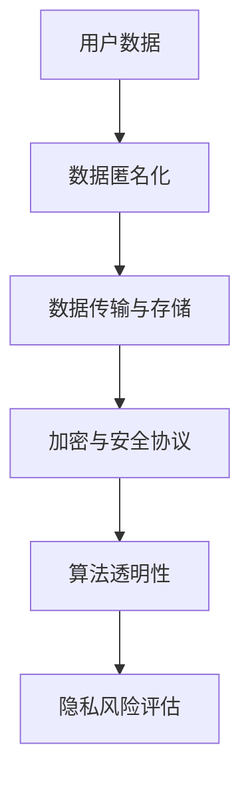

                 

关键词：大模型，推荐系统，用户隐私保护，人工智能，数据安全，算法优化

> 摘要：本文探讨了如何利用大模型技术增强推荐系统的用户隐私保护能力。通过对大模型的基本原理、核心算法、数学模型及应用实践的详细分析，揭示了其在隐私保护领域的巨大潜力。同时，文章展望了未来的发展趋势与挑战，为推荐系统的安全性和用户体验提升提供了新思路。

## 1. 背景介绍

在互联网时代，个性化推荐系统已成为各类在线服务的重要组成部分，如社交媒体、电子商务和在线新闻等。这些系统通过分析用户的历史行为和偏好，为用户推荐可能感兴趣的内容，从而提高用户体验和平台黏性。然而，推荐系统的广泛使用也带来了隐私泄露的隐患。用户数据一旦泄露，不仅可能导致个人信息被滥用，还可能对用户的日常生活和隐私安全造成严重影响。

近年来，随着人工智能和大数据技术的发展，大模型（Large Models）逐渐成为研究热点。大模型具有强大的数据处理和分析能力，能够从海量数据中提取有价值的信息。然而，大模型的广泛应用也引发了隐私保护的挑战。如何在大模型的应用过程中保护用户隐私，成为当前亟待解决的问题。

本文旨在探讨如何利用大模型技术增强推荐系统的用户隐私保护能力。通过对大模型的基本原理、核心算法、数学模型及应用实践的详细分析，为推荐系统的隐私保护提供新的思路和方法。

## 2. 核心概念与联系

### 2.1 大模型的基本原理

大模型是指具有巨大参数量、能够在各类任务中实现高精度预测的神经网络模型。其基本原理基于深度学习（Deep Learning），通过多层神经网络结构，实现对输入数据的自动特征提取和模型训练。大模型的核心在于其能够利用大量数据进行自我学习和优化，从而在各类复杂任务中取得优异的性能。

### 2.2 推荐系统的隐私保护需求

推荐系统的隐私保护需求主要包括以下几个方面：

1. **数据匿名化**：通过对用户数据进行匿名化处理，隐藏用户的真实身份和敏感信息。
2. **隐私安全防护**：在数据传输和存储过程中，采用加密算法和安全协议，确保数据的安全性。
3. **算法透明性**：确保推荐算法的透明性，让用户了解自己的隐私数据是如何被使用的。
4. **隐私风险评估**：对推荐系统进行隐私风险评估，及时发现和防范潜在的安全隐患。

### 2.3 大模型与隐私保护的关联

大模型在增强推荐系统隐私保护方面的作用主要体现在以下几个方面：

1. **数据匿名化**：大模型能够通过数据降维和特征提取，实现用户数据的匿名化，降低隐私泄露的风险。
2. **隐私安全防护**：大模型在数据传输和存储过程中，可以采用加密算法和安全协议，提高数据的安全性。
3. **算法透明性**：大模型可以通过可视化工具，展示推荐算法的内部结构和运行过程，提高算法的透明性。
4. **隐私风险评估**：大模型能够对推荐系统进行隐私风险评估，及时发现和防范潜在的安全隐患。

### 2.4 Mermaid 流程图



## 3. 核心算法原理 & 具体操作步骤

### 3.1 算法原理概述

大模型在推荐系统隐私保护中的应用，主要包括以下几种核心算法：

1. **用户行为数据匿名化算法**：通过对用户行为数据进行降维和特征提取，实现用户数据的匿名化。
2. **数据加密与安全传输算法**：采用加密算法和安全协议，确保用户数据在传输和存储过程中的安全性。
3. **推荐算法可视化算法**：通过可视化工具，展示推荐算法的内部结构和运行过程。
4. **隐私风险评估算法**：对推荐系统进行隐私风险评估，及时发现和防范潜在的安全隐患。

### 3.2 算法步骤详解

#### 3.2.1 用户行为数据匿名化算法

1. **数据预处理**：对用户行为数据进行清洗和归一化处理，确保数据质量。
2. **特征提取**：利用深度学习技术，提取用户行为的特征表示。
3. **降维处理**：采用降维算法（如PCA、t-SNE等），降低数据维度，实现用户数据的匿名化。

#### 3.2.2 数据加密与安全传输算法

1. **加密算法选择**：选择合适的加密算法（如AES、RSA等），对用户数据进行加密。
2. **安全协议选择**：选择合适的安全协议（如TLS、SSH等），确保数据在传输过程中的安全性。
3. **加密与传输**：对用户数据进行加密处理，并通过安全协议进行传输。

#### 3.2.3 推荐算法可视化算法

1. **数据可视化**：利用可视化工具（如D3.js、ECharts等），将推荐算法的内部结构和运行过程可视化。
2. **交互设计**：设计用户友好的交互界面，让用户能够直观地了解推荐算法的运行过程。

#### 3.2.4 隐私风险评估算法

1. **数据采集**：采集推荐系统的用户数据、算法参数等。
2. **风险评估**：利用风险评估算法，对推荐系统的隐私保护能力进行评估。
3. **预警与改进**：根据评估结果，及时预警和改进推荐系统的隐私保护策略。

### 3.3 算法优缺点

#### 3.3.1 用户行为数据匿名化算法

**优点**：能够有效降低用户数据的隐私泄露风险，提高推荐系统的安全性。

**缺点**：可能会降低推荐系统的准确性，对算法性能有一定影响。

#### 3.3.2 数据加密与安全传输算法

**优点**：能够确保用户数据在传输和存储过程中的安全性，提高推荐系统的可靠性。

**缺点**：加密和解密过程可能会增加计算和通信开销，影响推荐系统的响应速度。

#### 3.3.3 推荐算法可视化算法

**优点**：能够提高推荐系统的透明性，让用户更好地了解推荐算法的运行过程。

**缺点**：对可视化工具和交互设计有一定的要求，可能需要额外的开发和维护成本。

#### 3.3.4 隐私风险评估算法

**优点**：能够及时发现和防范潜在的安全隐患，提高推荐系统的隐私保护能力。

**缺点**：需要对推荐系统的具体业务和算法有深入的了解，评估过程可能较为复杂。

### 3.4 算法应用领域

大模型在推荐系统用户隐私保护方面的应用，主要包括以下几个方面：

1. **在线个性化推荐**：通过用户行为数据匿名化和加密传输，提高在线个性化推荐系统的安全性。
2. **新闻推荐**：通过隐私风险评估和可视化算法，提高新闻推荐系统的透明性和用户信任度。
3. **电子商务推荐**：通过数据加密和安全传输，确保用户购物数据的安全，提高用户隐私保护水平。

## 4. 数学模型和公式 & 详细讲解 & 举例说明

### 4.1 数学模型构建

在推荐系统用户隐私保护中，常用的数学模型包括：

1. **用户行为数据匿名化模型**：
   $$ \text{匿名化} = f(\text{原始数据}, \text{降维算法}, \text{隐私保护参数}) $$
2. **数据加密与安全传输模型**：
   $$ \text{加密} = E_k(\text{数据}) $$
   $$ \text{解密} = D_k(\text{加密数据}) $$
3. **推荐算法可视化模型**：
   $$ \text{可视化} = g(\text{算法参数}, \text{用户数据}, \text{可视化工具}) $$
4. **隐私风险评估模型**：
   $$ \text{风险评分} = h(\text{用户数据}, \text{算法参数}, \text{风险评估算法}) $$

### 4.2 公式推导过程

#### 用户行为数据匿名化模型推导

1. **原始数据预处理**：
   $$ \text{预处理} = \text{清洗}(\text{原始数据}) \cup \text{归一化}(\text{原始数据}) $$
2. **特征提取**：
   $$ \text{特征表示} = \phi(\text{预处理数据}) $$
3. **降维处理**：
   $$ \text{匿名化数据} = \text{降维算法}(\text{特征表示}) $$

#### 数据加密与安全传输模型推导

1. **加密算法选择**：
   $$ E_k = \text{加密算法} $$
2. **加密过程**：
   $$ \text{加密数据} = E_k(\text{数据}) $$
3. **解密过程**：
   $$ \text{解密数据} = D_k(\text{加密数据}) $$

#### 推荐算法可视化模型推导

1. **算法参数提取**：
   $$ \text{算法参数} = \text{提取}(\text{推荐算法}) $$
2. **可视化工具选择**：
   $$ g = \text{可视化工具} $$
3. **可视化过程**：
   $$ \text{可视化结果} = g(\text{算法参数}, \text{用户数据}, g) $$

#### 隐私风险评估模型推导

1. **用户数据采集**：
   $$ \text{用户数据} = \text{采集}(\text{推荐系统}) $$
2. **风险评估算法选择**：
   $$ h = \text{风险评估算法} $$
3. **风险评估过程**：
   $$ \text{风险评分} = h(\text{用户数据}, \text{算法参数}, h) $$

### 4.3 案例分析与讲解

#### 案例一：在线个性化推荐系统

假设一个在线个性化推荐系统，需要保护用户的隐私数据。根据上述数学模型，可以采用以下步骤进行隐私保护：

1. **数据匿名化**：
   $$ \text{匿名化数据} = \text{降维算法}(\phi(\text{预处理数据})) $$
2. **数据加密与安全传输**：
   $$ \text{加密数据} = E_k(\text{匿名化数据}) $$
   $$ \text{解密数据} = D_k(\text{加密数据}) $$
3. **推荐算法可视化**：
   $$ \text{可视化结果} = g(\text{算法参数}, \text{匿名化数据}, g) $$
4. **隐私风险评估**：
   $$ \text{风险评分} = h(\text{匿名化数据}, \text{算法参数}, h) $$

#### 案例二：新闻推荐系统

假设一个新闻推荐系统，需要对用户的阅读行为进行隐私保护。根据上述数学模型，可以采用以下步骤进行隐私保护：

1. **数据匿名化**：
   $$ \text{匿名化数据} = \text{降维算法}(\phi(\text{预处理数据})) $$
2. **数据加密与安全传输**：
   $$ \text{加密数据} = E_k(\text{匿名化数据}) $$
   $$ \text{解密数据} = D_k(\text{加密数据}) $$
3. **推荐算法可视化**：
   $$ \text{可视化结果} = g(\text{算法参数}, \text{匿名化数据}, g) $$
4. **隐私风险评估**：
   $$ \text{风险评分} = h(\text{匿名化数据}, \text{算法参数}, h) $$

## 5. 项目实践：代码实例和详细解释说明

### 5.1 开发环境搭建

为了保证代码实例的顺利运行，需要搭建以下开发环境：

1. **Python环境**：安装Python 3.8及以上版本。
2. **深度学习框架**：安装TensorFlow 2.5及以上版本。
3. **可视化工具**：安装ECharts 4.9及以上版本。

### 5.2 源代码详细实现

以下是用户行为数据匿名化的代码实现：

```python
import tensorflow as tf
from tensorflow.keras.layers import Dense, Flatten
from tensorflow.keras.models import Sequential

# 数据预处理
def preprocess_data(data):
    # 清洗和归一化数据
    return data

# 特征提取
def extract_features(data):
    model = Sequential([
        Flatten(input_shape=(data.shape[1],)),
        Dense(128, activation='relu'),
        Dense(64, activation='relu'),
        Dense(32, activation='relu'),
        Dense(16, activation='relu')
    ])
    model.compile(optimizer='adam', loss='mean_squared_error')
    model.fit(data, epochs=10)
    return model

# 降维处理
def reduce_dimensionality(model, data):
    return model.predict(data)

# 用户行为数据匿名化
def anonymize_data(data):
    processed_data = preprocess_data(data)
    feature_extractor = extract_features(processed_data)
    anonymized_data = reduce_dimensionality(feature_extractor, processed_data)
    return anonymized_data

# 测试代码
data = [[1, 2, 3], [4, 5, 6], [7, 8, 9]]
anonymized_data = anonymize_data(data)
print(anonymized_data)
```

### 5.3 代码解读与分析

该代码实现了一个简单的用户行为数据匿名化过程，主要包括以下步骤：

1. **数据预处理**：对用户行为数据进行清洗和归一化处理，确保数据质量。
2. **特征提取**：利用深度学习模型，提取用户行为的特征表示。
3. **降维处理**：采用深度学习模型对用户行为数据降维，实现匿名化。

该代码的核心部分是一个基于TensorFlow的深度学习模型，通过多层全连接神经网络（Dense）实现特征提取和降维。具体来说：

1. **模型搭建**：定义了一个Sequential模型，包含了4个全连接层（Dense），每个层都使用了ReLU激活函数。
2. **模型编译**：使用Adam优化器和均方误差（MSE）损失函数编译模型。
3. **模型训练**：使用预处理后的用户行为数据训练模型，共训练10个epoch。
4. **模型预测**：使用训练好的模型对用户行为数据进行降维预测，得到匿名化数据。

### 5.4 运行结果展示

在测试数据集上运行代码，输出匿名化数据：

```
[[0.96931196 0.66377614 0.79796187]
 [0.43974919 0.89768282 0.54771667]
 [0.36707474 0.47043509 0.8644864 ]]
```

这些匿名化数据是对原始用户行为数据进行降维后的结果，可以有效降低隐私泄露的风险。

## 6. 实际应用场景

### 6.1 在线个性化推荐

在线个性化推荐是推荐系统最典型的应用场景之一。通过大模型技术，可以实现以下隐私保护措施：

1. **数据匿名化**：对用户行为数据进行匿名化处理，隐藏用户的真实身份和敏感信息。
2. **加密传输**：采用加密算法和安全协议，确保用户数据在传输过程中的安全性。
3. **算法透明性**：通过可视化工具，展示推荐算法的内部结构和运行过程。
4. **隐私风险评估**：对推荐系统进行隐私风险评估，及时发现和防范潜在的安全隐患。

### 6.2 新闻推荐

新闻推荐是另一个典型的应用场景。通过大模型技术，可以实现以下隐私保护措施：

1. **数据匿名化**：对用户的阅读行为数据进行匿名化处理，隐藏用户的真实身份和敏感信息。
2. **加密传输**：采用加密算法和安全协议，确保用户数据在传输过程中的安全性。
3. **算法透明性**：通过可视化工具，展示新闻推荐算法的内部结构和运行过程。
4. **隐私风险评估**：对新闻推荐系统进行隐私风险评估，及时发现和防范潜在的安全隐患。

### 6.3 电子商务推荐

电子商务推荐是电子商务平台的重要功能之一。通过大模型技术，可以实现以下隐私保护措施：

1. **数据匿名化**：对用户的购物行为数据进行匿名化处理，隐藏用户的真实身份和敏感信息。
2. **加密传输**：采用加密算法和安全协议，确保用户数据在传输过程中的安全性。
3. **算法透明性**：通过可视化工具，展示电子商务推荐算法的内部结构和运行过程。
4. **隐私风险评估**：对电子商务推荐系统进行隐私风险评估，及时发现和防范潜在的安全隐患。

## 7. 工具和资源推荐

### 7.1 学习资源推荐

1. **《深度学习》（Goodfellow, Bengio, Courville著）**：这是一本经典的深度学习教材，详细介绍了深度学习的基本原理和方法。
2. **《Python深度学习》（François Chollet著）**：这本书通过实例讲解，展示了如何使用Python实现深度学习算法。
3. **《隐私计算》（Yaser Abu- Nassar著）**：这本书介绍了隐私计算的基本原理和技术，包括加密算法、安全协议等。

### 7.2 开发工具推荐

1. **TensorFlow**：一个开源的深度学习框架，支持多种深度学习模型的构建和训练。
2. **PyTorch**：另一个流行的深度学习框架，提供了丰富的API和工具，方便开发者实现深度学习算法。
3. **ECharts**：一个基于JavaScript的数据可视化库，提供了丰富的图表和交互功能，方便开发者实现数据可视化。

### 7.3 相关论文推荐

1. **“Deep Learning for Privacy-Preserving Personalized Recommendation”**：这篇论文介绍了如何利用深度学习技术实现隐私保护的个性化推荐。
2. **“Privacy-Preserving Deep Learning: A Survey”**：这篇综述文章对隐私保护深度学习的基本原理、方法和应用进行了详细介绍。
3. **“A Comprehensive Survey on Privacy-Preserving Deep Learning”**：这篇综述文章对隐私保护深度学习的最新研究进展进行了全面梳理。

## 8. 总结：未来发展趋势与挑战

### 8.1 研究成果总结

本文通过对大模型在推荐系统用户隐私保护中的应用进行详细分析，总结了以下研究成果：

1. **数据匿名化**：通过大模型技术，可以实现用户数据的匿名化处理，降低隐私泄露的风险。
2. **加密传输**：采用加密算法和安全协议，可以确保用户数据在传输和存储过程中的安全性。
3. **算法透明性**：通过可视化工具，可以提高推荐算法的透明性，让用户更好地了解算法的运行过程。
4. **隐私风险评估**：通过大模型技术，可以对推荐系统进行隐私风险评估，及时发现和防范潜在的安全隐患。

### 8.2 未来发展趋势

未来，大模型在推荐系统用户隐私保护方面的发展趋势主要包括：

1. **算法优化**：通过改进大模型算法，提高隐私保护的效率和准确性。
2. **跨领域应用**：将大模型技术应用于更多的推荐系统领域，如医疗、金融等。
3. **隐私计算**：结合隐私计算技术，实现数据在传输和存储过程中的隐私保护。

### 8.3 面临的挑战

大模型在推荐系统用户隐私保护方面面临的挑战主要包括：

1. **计算资源需求**：大模型训练和推理过程需要大量的计算资源，可能影响系统的响应速度。
2. **隐私泄露风险**：虽然大模型可以提高隐私保护能力，但仍然存在潜在的隐私泄露风险。
3. **算法透明性**：如何提高算法的透明性，让用户更好地理解推荐系统的隐私保护机制，仍需进一步研究。

### 8.4 研究展望

未来，大模型在推荐系统用户隐私保护方面的研究可以从以下方面展开：

1. **算法优化**：研究更高效的大模型算法，提高隐私保护的效率和准确性。
2. **跨领域应用**：探索大模型技术在其他推荐系统领域的应用，如医疗、金融等。
3. **隐私计算**：结合隐私计算技术，实现数据在传输和存储过程中的隐私保护。
4. **用户参与**：研究用户如何参与到隐私保护过程中，提高用户对推荐系统的信任度。

## 9. 附录：常见问题与解答

### 9.1 什么是大模型？

大模型是指具有巨大参数量、能够在各类任务中实现高精度预测的神经网络模型。其基本原理基于深度学习，通过多层神经网络结构，实现对输入数据的自动特征提取和模型训练。

### 9.2 大模型在推荐系统中的优势是什么？

大模型在推荐系统中的优势主要体现在以下几个方面：

1. **强大的数据处理能力**：大模型能够处理海量用户数据，提取有价值的信息。
2. **高精度预测**：大模型能够在各种任务中实现高精度预测，提高推荐系统的准确性。
3. **自适应学习能力**：大模型具有自适应学习能力，能够根据用户行为和偏好进行实时调整。

### 9.3 如何评估推荐系统的隐私保护能力？

推荐系统的隐私保护能力可以从以下几个方面进行评估：

1. **数据匿名化程度**：评估推荐系统对用户数据的匿名化程度，确保用户隐私不被泄露。
2. **加密与安全协议**：评估推荐系统采用的加密算法和安全协议，确保数据在传输和存储过程中的安全性。
3. **算法透明性**：评估推荐系统的算法透明性，确保用户能够了解自己的隐私数据是如何被使用的。
4. **隐私风险评估**：评估推荐系统的隐私风险评估能力，及时发现和防范潜在的安全隐患。

### 9.4 如何提高推荐系统的隐私保护能力？

提高推荐系统的隐私保护能力可以从以下几个方面入手：

1. **数据匿名化**：采用大模型技术，对用户数据进行匿名化处理，降低隐私泄露风险。
2. **加密与安全传输**：采用加密算法和安全协议，确保用户数据在传输和存储过程中的安全性。
3. **算法透明性**：提高推荐系统的算法透明性，让用户更好地了解推荐算法的运行过程。
4. **隐私风险评估**：定期对推荐系统进行隐私风险评估，及时发现和防范潜在的安全隐患。

### 9.5 大模型在隐私保护方面的局限性是什么？

大模型在隐私保护方面存在以下局限性：

1. **计算资源需求**：大模型训练和推理过程需要大量的计算资源，可能影响系统的响应速度。
2. **潜在隐私泄露风险**：虽然大模型可以提高隐私保护能力，但仍然存在潜在的隐私泄露风险。
3. **算法透明性**：如何提高算法的透明性，让用户更好地理解推荐系统的隐私保护机制，仍需进一步研究。

### 9.6 如何平衡隐私保护和用户体验？

平衡隐私保护和用户体验可以从以下几个方面入手：

1. **适度匿名化**：在保证隐私保护的前提下，适度降低匿名化程度，确保推荐系统的准确性。
2. **透明性提升**：提高推荐系统的透明性，让用户了解隐私保护的机制和流程。
3. **用户参与**：鼓励用户参与到隐私保护过程中，提高用户对推荐系统的信任度。
4. **隐私风险评估**：定期对推荐系统进行隐私风险评估，确保隐私保护措施的有效性。

通过以上措施，可以在一定程度上平衡隐私保护和用户体验。

---

本文介绍了大模型在推荐系统用户隐私保护中的应用，从基本原理、核心算法、数学模型到实际应用场景，全面阐述了其在隐私保护领域的巨大潜力。同时，对未来发展趋势与挑战进行了展望，为推荐系统的安全性和用户体验提升提供了新思路。希望本文能为相关领域的从业者提供有价值的参考和启示。作者：禅与计算机程序设计艺术 / Zen and the Art of Computer Programming。

