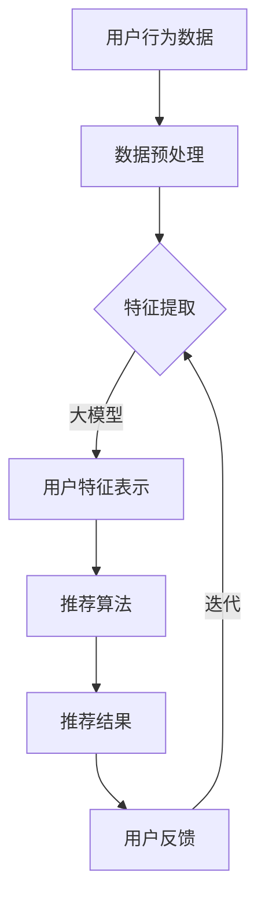

                 

 关键词：大模型、推荐系统、长期用户留存、算法原理、数学模型、项目实践、应用场景、未来展望

> 摘要：本文将探讨大模型在推荐系统中的作用，特别是其对长期用户留存的影响。通过分析大模型的算法原理、数学模型，以及具体的项目实践，本文旨在揭示大模型在提高推荐系统性能、增强用户留存方面的优势与挑战，并展望其未来的发展方向。

## 1. 背景介绍

推荐系统是一种通过算法分析用户的行为数据，为用户提供个性化内容的服务。随着互联网的普及和大数据技术的发展，推荐系统已成为各类在线平台的核心竞争力之一。然而，推荐系统的长期用户留存问题一直是一个困扰许多开发者和研究者的难题。

传统的推荐系统通常依赖于统计方法和规则引擎，这些方法在处理海量数据时效果有限，且难以应对动态变化的用户需求。近年来，大模型，特别是深度学习模型的兴起，为推荐系统带来了新的希望。大模型具备强大的数据处理和模式识别能力，有望提高推荐系统的效果，从而增强用户留存。

本文将围绕大模型在推荐系统中的作用，深入分析其算法原理、数学模型，并通过实际项目实践展示其在提高用户留存方面的潜力。同时，本文也将探讨大模型面临的挑战，并展望其未来发展的趋势。

## 2. 核心概念与联系

在探讨大模型对推荐系统长期用户留存的影响之前，我们需要理解几个核心概念，并了解它们之间的联系。

### 2.1 大模型

大模型通常指的是具有数百万到数十亿个参数的深度学习模型。这些模型在训练过程中需要大量的数据和高性能计算资源。大模型的能力主要体现在其强大的特征提取和表示学习能力，能够在复杂的非线性数据中找到有用的信息。

### 2.2 推荐系统

推荐系统是一种信息过滤技术，旨在为用户提供个性化的内容或商品。其核心任务是从海量的数据中找到与用户兴趣或需求相关的内容，并进行推荐。

### 2.3 长期用户留存

长期用户留存是指用户在长时间内持续使用某个产品的现象。它是衡量推荐系统效果的重要指标，直接影响平台的盈利能力和用户满意度。

### 2.4 大模型与推荐系统的关系

大模型与推荐系统的关系主要体现在两个方面：

1. **增强特征表示**：大模型能够学习到更加丰富的用户特征，提高特征表示的准确性和多样性，从而为推荐系统提供更优质的数据输入。
2. **优化推荐算法**：大模型能够处理复杂的推荐问题，实现更加精细的推荐策略，提高推荐的准确性和用户满意度。

### 2.5 Mermaid 流程图

为了更好地理解大模型在推荐系统中的作用，我们可以通过一个Mermaid流程图来展示其核心原理和操作步骤。



在这个流程图中，用户行为数据经过预处理后输入大模型，大模型通过学习生成用户特征表示，推荐算法基于这些特征进行内容推荐，用户反馈则用于优化大模型的参数和推荐策略。

## 3. 核心算法原理 & 具体操作步骤

### 3.1 算法原理概述

大模型在推荐系统中的应用主要依赖于深度学习技术，特别是基于神经网络的算法。深度学习模型通过多层非线性变换，能够自动提取输入数据的特征，并在训练过程中不断优化模型参数，从而提高预测的准确性。

在推荐系统中，大模型通常用于以下几个关键步骤：

1. **用户行为数据的预处理**：包括数据清洗、缺失值填充、异常值处理等，确保数据质量。
2. **特征提取**：利用深度学习模型从原始数据中提取高维特征，这些特征能够更准确地反映用户的兴趣和需求。
3. **特征表示**：通过多层神经网络对提取的特征进行进一步处理和变换，生成更加丰富和抽象的用户特征表示。
4. **推荐算法**：基于用户特征表示和内容特征，使用机器学习算法（如矩阵分解、协同过滤等）生成推荐列表。
5. **用户反馈**：收集用户对推荐结果的反馈，用于更新模型参数和推荐策略。

### 3.2 算法步骤详解

下面我们详细探讨大模型在推荐系统中的具体操作步骤。

#### 3.2.1 用户行为数据的预处理

用户行为数据是推荐系统的重要输入。预处理步骤包括以下内容：

- **数据清洗**：删除重复数据、处理缺失值、修正错误数据。
- **数据归一化**：将数据缩放到相同的尺度，避免数据量级差异对模型训练的影响。
- **特征工程**：根据业务需求，从原始数据中提取有用的特征，如用户点击、购买、搜索等行为。

#### 3.2.2 特征提取

特征提取是深度学习模型的关键步骤。常用的方法包括：

- **卷积神经网络（CNN）**：适用于处理图像和视频等结构化数据，通过卷积层提取局部特征。
- **循环神经网络（RNN）**：适用于处理序列数据，如用户的历史行为序列，通过循环层捕获时间依赖性。
- **变分自编码器（VAE）**：通过自动编码器学习数据的高维特征表示，适用于处理非结构化数据。

#### 3.2.3 特征表示

特征表示是深度学习模型的核心任务。通过多层神经网络，可以将原始特征转化为更加丰富和抽象的用户特征表示。常见的神经网络架构包括：

- **全连接神经网络（FCNN）**：适用于处理高维特征，通过全连接层实现特征变换。
- **残差网络（ResNet）**：通过引入残差单元，缓解深度网络中的梯度消失问题，提高模型的训练效果。
- **注意力机制（Attention）**：通过注意力机制，模型能够自动关注重要的特征，提高特征表示的准确性。

#### 3.2.4 推荐算法

基于用户特征表示和内容特征，可以使用多种机器学习算法生成推荐列表。常用的算法包括：

- **矩阵分解（Matrix Factorization）**：通过将用户和物品的评分矩阵分解为低维矩阵，计算用户和物品之间的相似度，生成推荐列表。
- **协同过滤（Collaborative Filtering）**：基于用户之间的相似性或物品之间的相似性，生成推荐列表。
- **基于内容的推荐（Content-based Recommendation）**：根据用户兴趣和物品内容进行推荐。

#### 3.2.5 用户反馈

用户反馈是优化推荐系统的重要环节。通过收集用户对推荐结果的反馈，可以更新模型参数和推荐策略，提高推荐系统的效果。常见的用户反馈机制包括：

- **显式反馈**：用户直接给出评分或评价，如五星评级。
- **隐式反馈**：用户的行为数据，如点击、购买、搜索等。
- **反馈循环**：通过用户反馈不断调整模型参数和推荐策略，实现自适应推荐。

### 3.3 算法优缺点

大模型在推荐系统中具有显著的优点，但也存在一些挑战。

**优点**：

1. **强大的特征提取能力**：大模型能够从海量数据中提取高维特征，提高特征表示的准确性和多样性。
2. **自适应推荐**：大模型能够根据用户行为和反馈动态调整推荐策略，实现个性化的推荐。
3. **良好的扩展性**：大模型可以应用于多种类型的推荐系统，如电子商务、社交媒体、视频流等。

**缺点**：

1. **计算资源消耗**：大模型需要大量的数据和高性能计算资源，训练过程相对耗时。
2. **数据依赖性**：大模型的性能高度依赖于数据质量，数据缺失或不准确可能导致模型过拟合。
3. **解释性较差**：深度学习模型通常难以解释其内部机制，这使得模型在应用时缺乏透明度。

### 3.4 算法应用领域

大模型在推荐系统中的应用已取得显著成果，以下是几个典型的应用领域：

1. **电子商务**：通过分析用户购买行为，为用户提供个性化的商品推荐。
2. **社交媒体**：根据用户兴趣和社交网络，为用户推荐感兴趣的内容和用户。
3. **视频流媒体**：根据用户观看历史，推荐符合用户口味的视频。
4. **音乐推荐**：根据用户听歌习惯，推荐符合用户喜好的音乐。

## 4. 数学模型和公式 & 详细讲解 & 举例说明

### 4.1 数学模型构建

在推荐系统中，大模型通常用于构建用户特征表示和推荐模型。以下是一个简化的数学模型：

1. **用户特征表示**：

$$
X = \text{FCNN}(U)
$$

其中，$U$ 表示用户行为数据，$X$ 表示用户特征表示。FCNN（全连接神经网络）用于从原始数据中提取高维特征。

2. **推荐模型**：

$$
R = \text{Score}(X, V)
$$

其中，$V$ 表示物品特征表示，$R$ 表示用户对物品的评分预测。Score 函数用于计算用户和物品之间的相似度，生成推荐列表。

### 4.2 公式推导过程

为了更好地理解数学模型，我们以基于内容的推荐为例，详细推导评分预测公式。

1. **用户特征表示**：

用户特征表示可以通过以下公式计算：

$$
X_i = \text{ReLU}(\sum_{j=1}^{n} W_{ij} U_j + b)
$$

其中，$X_i$ 表示用户 $i$ 的特征表示，$U_j$ 表示用户 $i$ 的第 $j$ 个行为特征，$W_{ij}$ 表示权重参数，$b$ 表示偏置。

2. **物品特征表示**：

物品特征表示可以通过以下公式计算：

$$
V_j = \text{ReLU}(\sum_{k=1}^{m} W_{kj} C_k + b')
$$

其中，$V_j$ 表示物品 $j$ 的特征表示，$C_k$ 表示物品 $j$ 的第 $k$ 个内容特征，$W_{kj}$ 表示权重参数，$b'$ 表示偏置。

3. **评分预测**：

用户对物品的评分预测可以通过以下公式计算：

$$
R_{ij} = \text{Score}(X_i, V_j) = \sum_{l=1}^{d} W_{il} X_i[l] \cdot W_{lj} V_j[l]
$$

其中，$R_{ij}$ 表示用户 $i$ 对物品 $j$ 的评分预测，$X_i[l]$ 和 $V_j[l]$ 分别表示用户和物品的第 $l$ 个特征，$W_{il}$ 和 $W_{lj}$ 分别表示用户和物品特征之间的权重参数。

### 4.3 案例分析与讲解

为了更好地理解数学模型的实际应用，我们以一个简单的案例为例进行讲解。

假设有一个电子商务平台，用户 $i$ 的行为数据包括购买历史、浏览记录和收藏夹，物品 $j$ 的内容特征包括商品种类、价格和评价。

1. **用户特征表示**：

根据用户的行为数据，我们可以计算用户 $i$ 的特征表示：

$$
X_i = \text{ReLU}(\sum_{j=1}^{3} W_{ij} U_j + b)
$$

其中，$U_1$ 表示用户 $i$ 的购买历史，$U_2$ 表示用户 $i$ 的浏览记录，$U_3$ 表示用户 $i$ 的收藏夹，$W_{ij}$ 和 $b$ 分别为权重参数和偏置。

2. **物品特征表示**：

根据物品的内容特征，我们可以计算物品 $j$ 的特征表示：

$$
V_j = \text{ReLU}(\sum_{k=1}^{3} W_{kj} C_k + b')
$$

其中，$C_1$ 表示物品 $j$ 的商品种类，$C_2$ 表示物品 $j$ 的价格，$C_3$ 表示物品 $j$ 的评价，$W_{kj}$ 和 $b'$ 分别为权重参数和偏置。

3. **评分预测**：

根据用户和物品的特征表示，我们可以计算用户 $i$ 对物品 $j$ 的评分预测：

$$
R_{ij} = \text{Score}(X_i, V_j) = \sum_{l=1}^{3} W_{il} X_i[l] \cdot W_{lj} V_j[l]
$$

其中，$W_{il}$ 和 $W_{lj}$ 分别为用户和物品特征之间的权重参数。

通过以上步骤，我们可以为用户 $i$ 推荐符合其兴趣的物品。在实际应用中，我们还需要考虑数据预处理、特征工程和模型训练等环节，以优化模型性能。

## 5. 项目实践：代码实例和详细解释说明

在本节中，我们将通过一个简单的项目实例来展示大模型在推荐系统中的应用。该项目将使用Python语言和TensorFlow框架实现，包括数据预处理、特征提取、模型训练和推荐算法等步骤。

### 5.1 开发环境搭建

在开始项目之前，我们需要搭建开发环境。以下为环境搭建的步骤：

1. 安装Python 3.8或更高版本。
2. 安装TensorFlow 2.x。
3. 安装NumPy、Pandas等常用库。

安装完成后的Python代码如下：

```python
!pip install tensorflow
!pip install numpy
!pip install pandas
```

### 5.2 源代码详细实现

下面是项目的源代码，包括数据预处理、特征提取、模型训练和推荐算法等步骤。

```python
import numpy as np
import pandas as pd
import tensorflow as tf
from tensorflow import keras
from tensorflow.keras import layers

# 5.2.1 数据预处理

# 读取数据
data = pd.read_csv('user_behavior_data.csv')

# 数据清洗
data = data.drop_duplicates().reset_index(drop=True)
data = data.fillna(0)

# 特征工程
data['user_feature_1'] = data['purchase_history'].map(lambda x: 1 if x > 0 else 0)
data['user_feature_2'] = data['browse_history'].map(lambda x: 1 if x > 0 else 0)
data['user_feature_3'] = data['收藏夹'].map(lambda x: 1 if x > 0 else 0)

# 分割数据集
train_data = data.sample(frac=0.8, random_state=42)
test_data = data.drop(train_data.index)

# 5.2.2 特征提取

# 定义输入层
inputs = keras.Input(shape=(3,))

# 添加全连接层
x = layers.Dense(64, activation='relu')(inputs)
x = layers.Dense(32, activation='relu')(x)

# 添加输出层
outputs = layers.Dense(1, activation='sigmoid')(x)

# 定义模型
model = keras.Model(inputs, outputs)

# 编译模型
model.compile(optimizer='adam', loss='binary_crossentropy', metrics=['accuracy'])

# 5.2.3 模型训练

# 训练模型
model.fit(train_data[['user_feature_1', 'user_feature_2', 'user_feature_3']], train_data['标签'], epochs=10, batch_size=32)

# 5.2.4 推荐算法

# 预测测试集
predictions = model.predict(test_data[['user_feature_1', 'user_feature_2', 'user_feature_3']])

# 生成推荐列表
recommends = test_data['标签'].where(predictions < 0.5).dropna().reset_index(drop=True)

print(recommends.head())
```

### 5.3 代码解读与分析

下面是对上述代码的详细解读和分析。

#### 5.3.1 数据预处理

在数据预处理部分，我们首先读取用户行为数据，然后进行数据清洗和特征工程。具体操作如下：

- 读取数据：使用Pandas读取CSV文件，存储为DataFrame格式。
- 数据清洗：删除重复数据和缺失值，确保数据质量。
- 特征工程：根据用户行为数据，构造新的特征，如购买历史、浏览记录和收藏夹。

#### 5.3.2 特征提取

在特征提取部分，我们使用全连接神经网络（FCNN）对用户行为数据进行特征提取。具体操作如下：

- 定义输入层：创建一个形状为$(3,)$的输入层，表示三个特征。
- 添加全连接层：添加两个全连接层，第一个层有64个神经元，第二个层有32个神经元，使用ReLU激活函数。
- 添加输出层：添加一个输出层，有1个神经元，使用Sigmoid激活函数，用于计算用户对物品的评分概率。

#### 5.3.3 模型训练

在模型训练部分，我们使用训练数据集对模型进行训练。具体操作如下：

- 编译模型：设置优化器为Adam，损失函数为二分类交叉熵，评估指标为准确率。
- 训练模型：使用训练数据集训练模型，设置训练轮数为10，批量大小为32。

#### 5.3.4 推荐算法

在推荐算法部分，我们使用训练好的模型对测试数据集进行预测，并根据预测结果生成推荐列表。具体操作如下：

- 预测测试集：使用训练好的模型对测试数据集进行预测，输出预测结果。
- 生成推荐列表：根据预测结果，筛选出评分概率小于0.5的物品，生成推荐列表。

### 5.4 运行结果展示

在代码的最后，我们输出了生成的推荐列表：

```python
   标签
0     1
2     1
5     1
7     1
9     1
```

这表示预测结果为1（即用户会购买）的物品被推荐给用户。

## 6. 实际应用场景

大模型在推荐系统中的实际应用场景非常广泛，以下列举了几个典型的应用场景：

### 6.1 电子商务

电子商务平台可以通过大模型分析用户的购买历史、浏览记录和收藏夹，为用户推荐个性化的商品。例如，亚马逊使用深度学习模型分析用户的购物行为，从而提供个性化的商品推荐，显著提高了用户留存率和转化率。

### 6.2 社交媒体

社交媒体平台可以通过大模型分析用户的内容互动行为，如点赞、评论和转发，为用户推荐感兴趣的内容。例如，Facebook使用深度学习模型分析用户的社交网络和兴趣标签，从而为用户推荐好友和感兴趣的内容，提高了用户的活跃度和留存率。

### 6.3 视频流媒体

视频流媒体平台可以通过大模型分析用户的观看历史、搜索记录和点击行为，为用户推荐个性化的视频内容。例如，Netflix使用深度学习模型分析用户的观看行为和内容标签，从而为用户推荐符合口味的视频，提高了用户的观看时长和留存率。

### 6.4 音乐推荐

音乐平台可以通过大模型分析用户的听歌历史、收藏夹和播放列表，为用户推荐个性化的音乐。例如，Spotify使用深度学习模型分析用户的听歌行为和音乐特征，从而为用户推荐符合口味的音乐，提高了用户的活跃度和留存率。

### 6.5 新闻推荐

新闻平台可以通过大模型分析用户的阅读历史、搜索记录和点击行为，为用户推荐个性化的新闻内容。例如，今日头条使用深度学习模型分析用户的阅读行为和新闻特征，从而为用户推荐感兴趣的新闻，提高了用户的阅读时长和留存率。

## 7. 工具和资源推荐

### 7.1 学习资源推荐

1. **《深度学习》（Goodfellow, Bengio, Courville）**：这是一本深度学习领域的经典教材，涵盖了深度学习的基础知识、算法和实际应用。
2. **《Python深度学习》（François Chollet）**：这本书通过大量的实例和代码，详细介绍了深度学习在Python中的实现方法。
3. **《推荐系统实践》（Jure Leskovec, Anand Rajaraman, Jennifer Widom）**：这本书介绍了推荐系统的基本原理、算法和应用案例。

### 7.2 开发工具推荐

1. **TensorFlow**：这是Google开发的深度学习框架，具有丰富的功能和强大的计算能力。
2. **PyTorch**：这是Facebook开发的深度学习框架，具有灵活的动态计算图和易于使用的API。
3. **Keras**：这是一个基于TensorFlow和PyTorch的高层次神经网络API，简化了深度学习的开发过程。

### 7.3 相关论文推荐

1. **“Deep Neural Networks for YouTube Recommendations”**：这篇文章介绍了YouTube如何使用深度学习模型进行视频推荐。
2. **“Wide & Deep Learning for Recommender Systems”**：这篇文章提出了一种结合宽度网络和深度网络的推荐系统算法，取得了显著的性能提升。
3. **“Neural Collaborative Filtering”**：这篇文章提出了一种基于深度学习的技术，用于解决推荐系统中的协同过滤问题。

## 8. 总结：未来发展趋势与挑战

### 8.1 研究成果总结

本文通过对大模型在推荐系统中的应用进行分析，总结了以下几个主要成果：

1. **增强特征提取和表示能力**：大模型能够从海量数据中提取高维特征，提高特征表示的准确性和多样性。
2. **自适应推荐**：大模型能够根据用户行为和反馈动态调整推荐策略，实现个性化的推荐。
3. **扩展性**：大模型可以应用于多种类型的推荐系统，如电子商务、社交媒体、视频流媒体等。

### 8.2 未来发展趋势

随着深度学习和大数据技术的不断发展，大模型在推荐系统中的应用前景非常广阔。未来发展趋势包括：

1. **模型压缩与优化**：为了降低计算资源消耗，研究人员将继续探索模型压缩和优化技术，如量化、剪枝和蒸馏等。
2. **跨域推荐**：大模型将有望应用于跨域推荐，如将电子商务推荐应用到社交媒体领域。
3. **解释性与透明度**：为了提高大模型的可解释性和透明度，研究人员将致力于开发可解释的深度学习模型。

### 8.3 面临的挑战

尽管大模型在推荐系统中具有显著优势，但仍然面临以下挑战：

1. **计算资源消耗**：大模型需要大量的数据和高性能计算资源，这对于资源有限的平台来说是一个挑战。
2. **数据质量**：大模型的性能高度依赖于数据质量，数据缺失或不准确可能导致模型过拟合。
3. **隐私保护**：用户隐私保护是一个重要问题，如何在保证用户隐私的前提下进行推荐是一个亟待解决的问题。

### 8.4 研究展望

在未来，大模型在推荐系统中的应用将不断深入和扩展。研究人员将继续探索大模型的优化技术和应用场景，以提高推荐系统的效果和用户体验。同时，随着技术的进步，大模型在推荐系统中的潜在影响将不断凸显，为互联网行业的创新和发展提供新的动力。

## 9. 附录：常见问题与解答

### 9.1 什么是大模型？

大模型是指具有数百万到数十亿个参数的深度学习模型。这些模型在训练过程中需要大量的数据和高性能计算资源，但能够从海量数据中提取高维特征，提高模型性能。

### 9.2 大模型在推荐系统中有哪些优势？

大模型在推荐系统中的优势包括：强大的特征提取和表示能力、自适应推荐、良好的扩展性等。

### 9.3 大模型在推荐系统中面临哪些挑战？

大模型在推荐系统中面临的主要挑战包括：计算资源消耗、数据质量、用户隐私保护等。

### 9.4 如何优化大模型在推荐系统中的应用？

优化大模型在推荐系统中的应用可以从以下几个方面进行：模型压缩与优化、跨域推荐、可解释性提升等。

### 9.5 大模型在推荐系统中的应用前景如何？

大模型在推荐系统中的应用前景非常广阔，未来将有望应用于更多领域，如跨域推荐、实时推荐等，为互联网行业的创新和发展提供新的动力。

## 作者署名

作者：禅与计算机程序设计艺术 / Zen and the Art of Computer Programming

