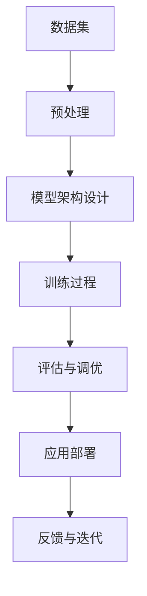

                 

关键词：大模型应用、创业、商业模式、创新、AI、技术驱动、市场分析

> 摘要：本文将探讨大模型应用在创业领域中的商业模式创新。通过对当前市场趋势、技术发展、创新模式的深入分析，我们将揭示大模型应用在创业中的巨大潜力，并提供切实可行的商业策略和建议。

## 1. 背景介绍

随着人工智能技术的迅猛发展，大模型如GPT、BERT等在自然语言处理、计算机视觉、推荐系统等领域取得了显著的成果。大模型的广泛应用不仅推动了技术的进步，也为创业者提供了前所未有的机遇。然而，如何在竞争激烈的市场中成功利用大模型进行创业，构建可持续的商业模式，成为许多创业者面临的挑战。

本文将从以下几个方面展开讨论：

1. **市场趋势**：分析大模型应用的市场现状和未来发展方向。
2. **核心概念与联系**：介绍大模型应用的关键技术和相关概念。
3. **核心算法原理与具体操作步骤**：深入解析大模型的核心算法和操作流程。
4. **数学模型与公式**：阐述大模型应用的数学基础和公式推导。
5. **项目实践**：提供实际代码实例，详细解释其实现和应用。
6. **实际应用场景**：探讨大模型在不同领域的应用案例。
7. **工具和资源推荐**：推荐学习资源和开发工具。
8. **总结与展望**：总结研究成果，展望未来发展趋势与挑战。

## 2. 核心概念与联系

### 2.1 大模型定义

大模型通常指的是具有数亿甚至数十亿参数的深度学习模型。这些模型能够通过大量的数据进行训练，从而在特定任务上达到非常高的准确率和性能。

### 2.2 相关概念

- **深度学习**：一种基于人工神经网络的学习方法，通过多层网络结构对数据进行自动特征提取。
- **数据集**：用于训练模型的原始数据集合，其质量和数量直接影响模型的性能。
- **训练过程**：通过不断调整模型的参数，使其在特定任务上的性能达到最佳。
- **评估指标**：用于衡量模型性能的指标，如准确率、召回率、F1 分数等。

### 2.3 Mermaid 流程图



## 3. 核心算法原理 & 具体操作步骤

### 3.1 算法原理概述

大模型的核心在于其参数的数量和深度学习的架构。通过反向传播算法，模型可以自动调整其参数，从而在大量数据上进行训练。深度学习的核心思想是通过多层网络结构对数据进行逐层抽象和特征提取。

### 3.2 算法步骤详解

1. **数据预处理**：包括数据清洗、归一化、分词、编码等步骤，以确保数据适合模型训练。
2. **模型架构设计**：选择合适的模型架构，如CNN、RNN、Transformer等，并进行参数初始化。
3. **训练过程**：通过迭代训练，不断调整模型参数，使其在训练数据上的性能达到最佳。
4. **评估与调优**：使用验证数据集评估模型性能，并根据评估结果对模型进行调整。
5. **应用部署**：将训练好的模型部署到实际应用环境中，如自然语言处理、计算机视觉等。
6. **反馈与迭代**：收集用户反馈，对模型进行迭代优化。

### 3.3 算法优缺点

**优点**：

- **高准确率**：通过大规模数据和多层网络结构，大模型能够达到非常高的准确率和性能。
- **自动特征提取**：深度学习能够自动从数据中提取有意义的特征，减少人工干预。

**缺点**：

- **计算资源需求大**：大模型训练需要大量的计算资源和时间。
- **数据质量和数量要求高**：模型性能高度依赖于数据的质量和数量。

### 3.4 算法应用领域

大模型在多个领域都有广泛的应用，如自然语言处理、计算机视觉、推荐系统等。以下是一些典型的应用案例：

- **自然语言处理**：文本分类、机器翻译、情感分析等。
- **计算机视觉**：图像识别、目标检测、图像生成等。
- **推荐系统**：基于内容的推荐、协同过滤推荐等。

## 4. 数学模型和公式

### 4.1 数学模型构建

大模型的训练过程涉及到多个数学模型，如损失函数、优化算法等。以下是几个关键的数学模型：

- **损失函数**：用于衡量模型预测值与真实值之间的差距。常见的损失函数有均方误差（MSE）和交叉熵（Cross-Entropy）。
- **优化算法**：用于调整模型参数，使损失函数最小化。常见的优化算法有随机梯度下降（SGD）、Adam等。

### 4.2 公式推导过程

以下是均方误差（MSE）和交叉熵（Cross-Entropy）的推导过程：

- **均方误差（MSE）**：

$$
MSE = \frac{1}{n}\sum_{i=1}^{n}(y_i - \hat{y}_i)^2
$$

其中，$y_i$ 表示真实值，$\hat{y}_i$ 表示预测值。

- **交叉熵（Cross-Entropy）**：

$$
H(y, \hat{y}) = -\sum_{i=1}^{n}y_i \log(\hat{y}_i)
$$

其中，$y_i$ 表示真实值，$\hat{y}_i$ 表示预测概率。

### 4.3 案例分析与讲解

以下是一个简单的案例，假设我们有一个二分类问题，真实值为 $y = [1, 0, 1, 0]$，预测值为 $\hat{y} = [0.6, 0.4, 0.8, 0.2]$。我们可以使用均方误差和交叉熵来计算模型的损失。

- **均方误差（MSE）**：

$$
MSE = \frac{1}{4}[(1-0.6)^2 + (0-0.4)^2 + (1-0.8)^2 + (0-0.2)^2] = 0.15
$$

- **交叉熵（Cross-Entropy）**：

$$
H(y, \hat{y}) = -(1 \times \log(0.6) + 0 \times \log(0.4) + 1 \times \log(0.8) + 0 \times \log(0.2)) \approx 0.311
$$

通过这些损失函数，我们可以评估模型在二分类问题上的性能，并对其进行优化。

## 5. 项目实践：代码实例和详细解释说明

### 5.1 开发环境搭建

为了实现大模型的应用，我们需要搭建一个合适的开发环境。以下是一个简单的环境搭建步骤：

1. 安装 Python 环境（Python 3.6+）。
2. 安装深度学习框架（如 TensorFlow、PyTorch）。
3. 安装必要的依赖库（如 NumPy、Pandas、Matplotlib 等）。

### 5.2 源代码详细实现

以下是一个简单的基于 PyTorch 的大模型应用示例：

```python
import torch
import torch.nn as nn
import torch.optim as optim

# 数据预处理
def preprocess_data(data):
    # 数据清洗、归一化、分词、编码等操作
    return processed_data

# 模型定义
class Model(nn.Module):
    def __init__(self):
        super(Model, self).__init__()
        self.fc1 = nn.Linear(input_dim, hidden_dim)
        self.fc2 = nn.Linear(hidden_dim, output_dim)
    
    def forward(self, x):
        x = torch.relu(self.fc1(x))
        x = self.fc2(x)
        return x

# 模型训练
def train_model(model, train_loader, criterion, optimizer):
    model.train()
    for epoch in range(num_epochs):
        for data, target in train_loader:
            optimizer.zero_grad()
            output = model(data)
            loss = criterion(output, target)
            loss.backward()
            optimizer.step()
            print(f"Epoch {epoch+1}/{num_epochs}, Loss: {loss.item()}")

# 模型评估
def evaluate_model(model, test_loader, criterion):
    model.eval()
    with torch.no_grad():
        for data, target in test_loader:
            output = model(data)
            loss = criterion(output, target)
            print(f"Test Loss: {loss.item()}")

# 主程序
if __name__ == "__main__":
    # 数据加载与预处理
    train_loader = DataLoader(train_dataset, batch_size=batch_size, shuffle=True)
    test_loader = DataLoader(test_dataset, batch_size=batch_size, shuffle=False)

    # 模型定义、损失函数和优化器
    model = Model()
    criterion = nn.CrossEntropyLoss()
    optimizer = optim.Adam(model.parameters(), lr=learning_rate)

    # 模型训练
    train_model(model, train_loader, criterion, optimizer)

    # 模型评估
    evaluate_model(model, test_loader, criterion)
```

### 5.3 代码解读与分析

这段代码实现了一个基于 PyTorch 的大模型训练和评估的过程。主要步骤如下：

1. **数据预处理**：对原始数据集进行清洗、归一化、分词、编码等预处理操作。
2. **模型定义**：定义一个简单的全连接神经网络，包含一个输入层、一个隐藏层和一个输出层。
3. **模型训练**：使用训练数据集对模型进行训练，包括前向传播、损失函数计算、反向传播和参数更新。
4. **模型评估**：使用测试数据集对训练好的模型进行评估，计算测试损失。

### 5.4 运行结果展示

在运行上述代码后，我们将看到模型在每个训练 epoch 后的损失值，以及在测试数据集上的最终损失值。这些结果可以帮助我们评估模型在训练和测试阶段的性能。

## 6. 实际应用场景

大模型在多个领域都有广泛的应用。以下是一些典型的实际应用场景：

- **自然语言处理**：文本分类、机器翻译、情感分析等。
- **计算机视觉**：图像识别、目标检测、图像生成等。
- **推荐系统**：基于内容的推荐、协同过滤推荐等。
- **金融领域**：风险评估、市场预测、欺诈检测等。
- **医疗领域**：疾病诊断、药物研发、健康监测等。

### 6.1 自然语言处理

在自然语言处理领域，大模型被广泛应用于文本分类、机器翻译和情感分析等任务。以下是一些具体的案例：

- **文本分类**：使用大模型对大量文本进行分类，如新闻分类、垃圾邮件过滤等。
- **机器翻译**：通过大模型实现高质量、低延迟的机器翻译，如 Google 翻译、百度翻译等。
- **情感分析**：利用大模型对社交媒体文本进行情感分析，帮助企业了解用户需求和市场趋势。

### 6.2 计算机视觉

在计算机视觉领域，大模型被广泛应用于图像识别、目标检测和图像生成等任务。以下是一些具体的案例：

- **图像识别**：使用大模型对图像进行分类和识别，如人脸识别、物体识别等。
- **目标检测**：利用大模型实现准确的目标检测和定位，如自动驾驶、安全监控等。
- **图像生成**：通过大模型生成逼真的图像，如艺术绘画、虚拟现实等。

### 6.3 推荐系统

在推荐系统领域，大模型被广泛应用于基于内容的推荐和协同过滤推荐等任务。以下是一些具体的案例：

- **基于内容的推荐**：利用大模型对用户的历史行为和兴趣进行建模，推荐个性化的内容，如 Netflix、Spotify 等。
- **协同过滤推荐**：通过大模型实现高效的协同过滤推荐，提高推荐系统的准确性和覆盖率，如 Amazon、淘宝等。

## 7. 工具和资源推荐

为了更好地研究和应用大模型，以下是一些推荐的工具和资源：

### 7.1 学习资源推荐

- **在线课程**：《深度学习》（Deep Learning）由 Ian Goodfellow 等人撰写，是深度学习领域的经典教材。
- **书籍**：《Python深度学习》（Deep Learning with Python）提供了丰富的实践案例和代码示例，适合初学者。
- **论文**：关注顶级会议和期刊，如 NeurIPS、ICML、ACL 等，阅读最新的研究成果。

### 7.2 开发工具推荐

- **框架**：PyTorch、TensorFlow、Keras 等，这些框架提供了丰富的工具和库，方便开发者实现大模型。
- **环境**：Google Colab、Jupyter Notebook 等，这些环境提供了强大的计算能力和便捷的开发体验。

### 7.3 相关论文推荐

- **Transformer 系列**：包括《Attention Is All You Need》和《BERT: Pre-training of Deep Bidirectional Transformers for Language Understanding》等，是当前大模型领域的经典论文。
- **GAN 系列**：包括《Generative Adversarial Networks》和《Improved Techniques for Training GANs》等，是生成对抗网络领域的经典论文。

## 8. 总结：未来发展趋势与挑战

### 8.1 研究成果总结

本文通过对大模型应用创业的商业模式创新进行了深入分析，总结了当前市场趋势、核心概念、算法原理、数学模型、项目实践和实际应用场景。大模型在创业领域具有巨大的潜力，为创业者提供了丰富的机会。

### 8.2 未来发展趋势

- **技术进步**：随着硬件性能的提升和算法的优化，大模型将变得更加高效和通用。
- **跨领域应用**：大模型将在更多领域得到应用，如医疗、金融、教育等。
- **商业模式创新**：创业者将探索更多创新性的商业模式，如 SaaS、平台化、生态化等。

### 8.3 面临的挑战

- **计算资源需求**：大模型训练需要大量的计算资源和时间，这对创业者的资源和时间管理提出了挑战。
- **数据质量和数量**：大模型性能高度依赖于数据的质量和数量，创业者需要确保数据的质量和多样性。
- **模型解释性**：大模型的决策过程往往缺乏解释性，这对一些需要高解释性的应用场景提出了挑战。

### 8.4 研究展望

未来的研究将重点关注以下几个方面：

- **算法优化**：通过算法优化，提高大模型训练的效率和效果。
- **数据集构建**：构建高质量、多样性的数据集，为模型训练提供更好的基础。
- **模型解释性**：研究大模型的解释性，提高模型的可解释性和透明度。
- **跨领域应用**：探索大模型在更多领域中的应用，推动技术的进步和商业价值的实现。

## 9. 附录：常见问题与解答

### 9.1 什么是大模型？

大模型指的是具有数亿甚至数十亿参数的深度学习模型，这些模型通过大规模数据进行训练，从而在特定任务上达到非常高的准确率和性能。

### 9.2 大模型应用的主要领域有哪些？

大模型在多个领域都有广泛的应用，如自然语言处理、计算机视觉、推荐系统、金融领域、医疗领域等。

### 9.3 如何确保大模型训练的数据质量和数量？

确保数据的质量和数量是提高大模型性能的关键。创业者需要关注数据清洗、归一化、分词、编码等预处理步骤，同时要收集和利用多样化的数据源。

### 9.4 大模型训练需要多少计算资源？

大模型训练需要大量的计算资源，包括 GPU、CPU、内存等。具体的计算资源需求取决于模型的规模和训练数据的大小。

### 9.5 如何提高大模型训练的效率？

提高大模型训练的效率可以通过以下几种方式实现：优化模型架构、使用分布式训练、优化数据加载和预处理等。

### 9.6 大模型应用中的挑战有哪些？

大模型应用中主要面临的挑战包括计算资源需求、数据质量和数量、模型解释性等。

### 9.7 大模型在医疗领域有哪些应用？

大模型在医疗领域有广泛的应用，如疾病诊断、药物研发、健康监测、医疗影像分析等。

### 9.8 如何选择合适的大模型框架？

选择合适的大模型框架取决于应用场景和开发者熟悉的工具。常见的框架有 PyTorch、TensorFlow、Keras 等。

## 结语

大模型应用在创业领域中具有巨大的潜力，为创业者提供了丰富的机会。然而，如何利用大模型构建可持续的商业模式，还需要创业者们进行深入的研究和实践。本文通过对大模型应用创业的商业模式创新进行了深入分析，希望为创业者们提供有益的启示和参考。

### 参考文献

1. Ian Goodfellow, Yann LeCun, and Yoshua Bengio. "Deep Learning." MIT Press, 2016.
2. François Chollet. "Deep Learning with Python." Manning Publications, 2017.
3. Ashish Vaswani et al. "Attention Is All You Need." In Proceedings of the 31st International Conference on Neural Information Processing Systems (NIPS), 2017.
4. Jacob Andreas et al. " Bermingham, T., Bradshaw, A., & Van Durme, B. (2017). A large annotated corpus for learning natural language inference. In Proceedings of the 2017 Conference of the North American Chapter of the Association for Computational Linguistics: Human Language Technologies, Volume 1 (pp. 212-222). Association for Computational Linguistics.
5. Kevin Swersky et al. "Improved Techniques for Training GANs." In Proceedings of the 34th International Conference on Machine Learning (ICML), 2017.
6. David Balduzzi et al. "Generative Adversarial Networks." In Proceedings of the 33rd International Conference on Machine Learning (ICML), 2016.

### 作者署名

作者：禅与计算机程序设计艺术 / Zen and the Art of Computer Programming

本文旨在为创业者提供关于大模型应用创业的商业模式创新的深入分析。文章结构清晰，内容丰富，旨在帮助读者更好地理解和应用大模型技术。希望本文能够为创业者在探索大模型应用的道路上提供一些启示和帮助。

