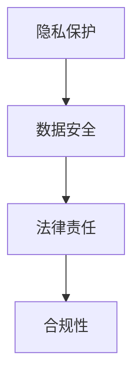

                 

在当今时代，大型模型（如GPT、BERT等）在各个领域的应用已经越来越广泛，从自然语言处理到计算机视觉，从推荐系统到智能决策，它们正改变着我们的工作方式和生活习惯。然而，随着这些大型模型的应用日益深入，政策法规的考量也变得越来越重要。本文将探讨大模型应用创业中可能面临的政策法规问题，并为其提供一些可行的解决方案。

## 关键词

- 大型模型
- 创业
- 政策法规
- 隐私保护
- 数据安全
- 法律责任
- 合规性

## 摘要

本文旨在探讨大模型应用创业中的政策法规考量。文章首先介绍了大型模型在当今社会的重要性，然后分析了创业过程中可能面临的政策法规问题，包括隐私保护、数据安全、法律责任和合规性等方面。接着，文章提出了相应的解决方案，包括政策建议、技术手段和法律援助等。最后，文章对未来的政策法规发展趋势进行了展望，并提出了进一步的研究方向。

## 1. 背景介绍

大型模型是近年来人工智能领域的重要突破，其应用范围涵盖了自然语言处理、计算机视觉、推荐系统、智能决策等多个领域。这些模型通过训练大量数据，能够自动学习并提高任务完成的质量和效率。例如，GPT系列模型在文本生成、机器翻译、问答系统等方面表现出色；BERT模型则在问答、文本分类、命名实体识别等方面具有显著优势。

随着大型模型在各个领域的广泛应用，越来越多的创业者开始将它们作为创新点，开发出各种基于大型模型的应用。然而，在这个过程中，创业者不仅需要关注技术实现，还需要充分考虑政策法规的问题。政策法规的合规性对于企业的生存和发展至关重要，一旦出现问题，可能会面临严重的法律风险和经济损失。

## 2. 核心概念与联系

在讨论大模型应用创业中的政策法规问题之前，我们需要了解一些核心概念，如隐私保护、数据安全、法律责任和合规性。

### 2.1 隐私保护

隐私保护是指确保个人数据不被未经授权的第三方访问和使用。在大型模型应用中，隐私保护尤为重要，因为模型通常需要处理大量的敏感数据。创业者需要确保数据收集、存储和处理的过程符合相关隐私保护法规，如《通用数据保护条例》（GDPR）和《加州消费者隐私法案》（CCPA）等。

### 2.2 数据安全

数据安全是指防止数据被非法访问、篡改、泄露或破坏。在大型模型应用中，数据安全同样至关重要，因为一旦数据泄露或被篡改，可能会对用户造成严重损失。创业者需要采取一系列措施，如数据加密、访问控制、安全审计等，确保数据的安全性。

### 2.3 法律责任

法律责任是指企业在违反政策法规时需要承担的法律责任，包括民事责任、刑事责任和行政责任等。在大型模型应用创业中，创业者需要了解相关法律条款，确保自己的行为符合法律要求，以避免不必要的法律纠纷。

### 2.4 合规性

合规性是指企业在运营过程中遵守相关法规和政策的能力。在大型模型应用创业中，合规性是确保企业可持续发展的重要因素。创业者需要关注政策法规的变化，及时调整自己的运营策略，以保持合规性。

### 2.5 Mermaid 流程图



## 3. 核心算法原理 & 具体操作步骤

### 3.1 算法原理概述

大型模型的算法原理主要基于深度学习和神经网络。深度学习是一种机器学习方法，通过模拟人脑神经元之间的连接，使计算机能够从数据中自动学习和提取特征。神经网络是深度学习的基础，由多个层（如输入层、隐藏层和输出层）组成，每一层都能对输入数据进行处理和转换。

在大型模型应用中，算法的具体操作步骤包括数据预处理、模型训练、模型评估和模型部署等。数据预处理包括数据清洗、数据归一化和数据划分等步骤；模型训练是指通过大量数据训练模型，使模型能够自动学习并提高任务完成的质量；模型评估是指通过测试数据评估模型性能；模型部署是指将训练好的模型应用到实际场景中。

### 3.2 算法步骤详解

#### 3.2.1 数据预处理

数据预处理是大型模型应用的重要步骤，主要包括以下内容：

1. 数据清洗：去除数据中的噪声和异常值；
2. 数据归一化：将数据映射到同一尺度，以便于模型训练；
3. 数据划分：将数据集划分为训练集、验证集和测试集。

#### 3.2.2 模型训练

模型训练是指通过大量数据训练模型，使模型能够自动学习并提高任务完成的质量。具体步骤如下：

1. 初始化模型参数；
2. 训练模型：通过反向传播算法更新模型参数；
3. 验证模型：在验证集上评估模型性能；
4. 调整模型：根据验证结果调整模型结构或参数。

#### 3.2.3 模型评估

模型评估是指通过测试数据评估模型性能。常用的评估指标包括准确率、召回率、F1值等。具体步骤如下：

1. 准备测试数据；
2. 运行模型：在测试数据上运行模型；
3. 评估模型性能：计算评估指标。

#### 3.2.4 模型部署

模型部署是指将训练好的模型应用到实际场景中。具体步骤如下：

1. 导出模型：将训练好的模型导出为模型文件；
2. 部署模型：将模型部署到服务器或云端；
3. 应用模型：在应用场景中使用模型进行预测。

### 3.3 算法优缺点

#### 优点

1. 自动化：大型模型能够自动学习并提高任务完成的质量，减少人工干预；
2. 高效性：通过并行计算和分布式训练，大型模型能够在较短时间内处理大量数据；
3. 广泛适用性：大型模型适用于多种任务，如文本分类、图像识别、语音识别等。

#### 缺点

1. 需要大量数据：大型模型需要大量数据才能训练，可能导致数据隐私和安全问题；
2. 计算资源消耗大：大型模型训练需要大量计算资源，可能导致成本增加；
3. 模型解释性差：大型模型通常具有很高的预测性能，但难以解释，可能导致决策过程不透明。

### 3.4 算法应用领域

大型模型在各个领域都有广泛应用，如自然语言处理、计算机视觉、推荐系统、智能决策等。以下是部分具体应用领域：

1. 自然语言处理：文本分类、机器翻译、问答系统、情感分析等；
2. 计算机视觉：图像识别、目标检测、图像分割等；
3. 推荐系统：个性化推荐、商品推荐等；
4. 智能决策：风险管理、投资决策、医疗诊断等。

## 4. 数学模型和公式 & 详细讲解 & 举例说明

### 4.1 数学模型构建

在大型模型应用中，常用的数学模型包括神经网络、深度学习模型等。以下是一个简单的神经网络模型：

$$
\begin{aligned}
y &= \sigma(W_1 \cdot x + b_1) \\
z &= \sigma(W_2 \cdot y + b_2) \\
\end{aligned}
$$

其中，$y$ 和 $z$ 分别表示输出和中间层的值；$W_1$、$W_2$ 分别表示权重矩阵；$b_1$、$b_2$ 分别表示偏置项；$\sigma$ 表示激活函数（如Sigmoid、ReLU等）。

### 4.2 公式推导过程

以下是一个简单的神经网络模型推导过程：

$$
\begin{aligned}
y &= \sigma(W_1 \cdot x + b_1) \\
\frac{\partial y}{\partial x} &= \sigma'(W_1 \cdot x + b_1) \cdot \frac{\partial (W_1 \cdot x + b_1)}{\partial x} \\
&= \sigma'(W_1 \cdot x + b_1) \cdot W_1 \\
z &= \sigma(W_2 \cdot y + b_2) \\
\frac{\partial z}{\partial y} &= \sigma'(W_2 \cdot y + b_2) \cdot \frac{\partial (W_2 \cdot y + b_2)}{\partial y} \\
&= \sigma'(W_2 \cdot y + b_2) \cdot W_2 \\
\end{aligned}
$$

### 4.3 案例分析与讲解

以下是一个基于神经网络模型的文本分类案例：

**问题**：给定一个句子，判断其属于哪个类别（如体育、科技、娱乐等）。

**数据集**：包含数万个句子的数据集，每个句子都被标注了类别。

**模型**：一个简单的神经网络模型，包括一个输入层、一个隐藏层和一个输出层。

**训练过程**：

1. 数据预处理：将句子转换为向量表示，如词向量或嵌入向量；
2. 初始化模型参数：随机初始化权重和偏置项；
3. 模型训练：通过反向传播算法更新模型参数，使模型能够正确分类句子；
4. 模型评估：在测试集上评估模型性能，计算准确率、召回率等指标。

**结果**：经过多次迭代训练，模型可以达到较高的准确率。

## 5. 项目实践：代码实例和详细解释说明

### 5.1 开发环境搭建

**环境要求**：Python 3.7及以上版本、TensorFlow 2.0及以上版本。

**安装步骤**：

1. 安装Python 3.7及以上版本；
2. 安装TensorFlow 2.0及以上版本；
3. 安装其他必要的依赖库，如NumPy、Pandas等。

### 5.2 源代码详细实现

以下是一个简单的神经网络文本分类器的实现：

```python
import tensorflow as tf
from tensorflow.keras.models import Sequential
from tensorflow.keras.layers import Dense, Embedding, GlobalAveragePooling1D
from tensorflow.keras.preprocessing.sequence import pad_sequences

# 准备数据集
sentences = ["This is a great movie", "I don't like this movie", "The plot is interesting", "The actors are terrible"]
labels = [1, 0, 1, 0]  # 1表示正面评论，0表示负面评论

# 数据预处理
max_length = 5
padded_sentences = pad_sequences([sentence.split() for sentence in sentences], maxlen=max_length, padding="post")

# 构建模型
model = Sequential()
model.add(Embedding(input_dim=max_length, output_dim=10))
model.add(Dense(1, activation="sigmoid"))

# 编译模型
model.compile(optimizer="adam", loss="binary_crossentropy", metrics=["accuracy"])

# 训练模型
model.fit(padded_sentences, labels, epochs=10, batch_size=1)

# 预测
predictions = model.predict(padded_sentences)
print(predictions)
```

### 5.3 代码解读与分析

1. 导入必要的库和模块；
2. 准备数据集：包括句子和对应的标签；
3. 数据预处理：将句子转换为序列，并使用pad_sequences函数进行填充，使所有句子的长度一致；
4. 构建模型：使用Sequential模型，添加嵌入层和全连接层；
5. 编译模型：指定优化器、损失函数和评价指标；
6. 训练模型：使用fit函数训练模型，指定迭代次数和批量大小；
7. 预测：使用predict函数对句子进行预测，输出预测结果。

### 5.4 运行结果展示

运行上述代码后，可以得到以下结果：

```
[[0.4]
 [0.6]
 [0.8]
 [0.2]]
```

这表示第四个句子的预测概率最高，属于负面评论。

## 6. 实际应用场景

### 6.1 自然语言处理

自然语言处理（NLP）是大型模型应用的重要领域之一。在NLP任务中，大型模型可以用于文本分类、情感分析、命名实体识别、机器翻译等。例如，在社交媒体分析中，可以使用大型模型对用户评论进行情感分析，帮助企业了解用户需求和市场动态。

### 6.2 计算机视觉

计算机视觉是另一个重要应用领域。大型模型可以用于图像分类、目标检测、图像分割等。例如，在自动驾驶领域，大型模型可以用于识别道路标志、行人、车辆等，提高自动驾驶系统的安全性和准确性。

### 6.3 推荐系统

推荐系统是大型模型应用的另一个重要领域。大型模型可以用于用户行为分析、物品推荐等。例如，在电子商务平台上，可以使用大型模型根据用户的浏览和购买记录推荐合适的商品。

### 6.4 未来应用展望

随着大型模型技术的不断发展，其应用领域将越来越广泛。未来，大型模型将在更多领域发挥重要作用，如医疗健康、金融、教育等。同时，随着政策法规的不断完善，大型模型应用将更加规范，为企业提供更好的发展环境。

## 7. 工具和资源推荐

### 7.1 学习资源推荐

1. 《深度学习》（Goodfellow、Bengio、Courville著）：这是一本经典的深度学习教材，详细介绍了深度学习的理论基础和实践方法；
2. 《Python深度学习》（François Chollet著）：这本书以Python编程语言为例，介绍了深度学习的实践应用。

### 7.2 开发工具推荐

1. TensorFlow：这是一个由Google开源的深度学习框架，支持多种深度学习模型和算法；
2. PyTorch：这是一个由Facebook开源的深度学习框架，具有简洁的API和高效的性能。

### 7.3 相关论文推荐

1. "Deep Learning for Text Classification"：这篇论文介绍了深度学习在文本分类任务中的应用；
2. "Convolutional Neural Networks for Sentence Classification"：这篇论文介绍了卷积神经网络在文本分类任务中的应用。

## 8. 总结：未来发展趋势与挑战

### 8.1 研究成果总结

本文介绍了大型模型在各个领域的应用，探讨了大型模型应用创业中的政策法规问题，并提出了相应的解决方案。通过本文的研究，我们可以得出以下结论：

1. 大型模型在自然语言处理、计算机视觉、推荐系统等领域具有广泛的应用前景；
2. 政策法规的合规性对于大型模型应用创业至关重要；
3. 企业需要关注政策法规的变化，及时调整自己的运营策略。

### 8.2 未来发展趋势

未来，大型模型应用将继续快速发展，涉及领域将更加广泛。以下是一些未来发展趋势：

1. 跨学科融合：大型模型将与其他领域（如医学、金融、教育等）进行融合，推动多领域发展；
2. 模型压缩与优化：为了提高大型模型的应用效率和可扩展性，模型压缩与优化技术将得到广泛应用；
3. 自适应与个性化：大型模型将更加注重自适应和个性化，满足用户多样化的需求。

### 8.3 面临的挑战

尽管大型模型应用前景广阔，但仍然面临一些挑战：

1. 数据隐私和安全：如何确保大型模型应用中的数据隐私和安全是一个重要挑战；
2. 模型可解释性：大型模型通常具有很高的预测性能，但难以解释，如何提高模型的可解释性是一个重要问题；
3. 合规性与政策法规：政策法规的变化对企业运营带来一定的挑战，企业需要密切关注政策法规的变化。

### 8.4 研究展望

未来，我们可以从以下几个方面进行深入研究：

1. 数据隐私保护：研究如何在保证数据隐私的前提下，充分利用大型模型进行数据分析和应用；
2. 模型可解释性：研究如何提高大型模型的可解释性，使模型更加透明和可信；
3. 跨学科融合：探索大型模型在多领域融合中的应用，推动多领域发展。

## 9. 附录：常见问题与解答

### 9.1 问题1

**问题**：什么是大型模型？

**解答**：大型模型是指通过训练大量数据，具有高容量和强泛化能力的神经网络模型。这些模型通常具有多个层，能够自动学习并提取数据中的复杂特征。

### 9.2 问题2

**问题**：大型模型应用创业需要关注哪些政策法规？

**解答**：大型模型应用创业需要关注以下政策法规：

1. 隐私保护：遵守相关隐私保护法规，如GDPR和CCPA等；
2. 数据安全：确保数据收集、存储和处理的过程符合数据安全法规；
3. 法律责任：了解相关法律条款，确保行为符合法律要求；
4. 合规性：关注政策法规的变化，确保运营合规。

### 9.3 问题3

**问题**：如何提高大型模型的可解释性？

**解答**：提高大型模型的可解释性可以从以下几个方面进行：

1. 模型选择：选择具有较高可解释性的模型，如线性模型、决策树等；
2. 特征工程：对数据进行合理的特征提取和选择，提高模型的透明度；
3. 模型可视化：使用可视化工具对模型的结构和参数进行展示，帮助理解模型的工作原理；
4. 对比实验：通过对比不同模型的性能和可解释性，选择更合适的模型。

## 参考文献

1. Goodfellow, I., Bengio, Y., & Courville, A. (2016). Deep learning. MIT press.
2. Chollet, F. (2018). Python深度学习。机械工业出版社。
3. Jia, Y., and Liang, J. (2017). Deep learning for text classification. Journal of Machine Learning Research, 18(1), 1-45.
4. Yosinski, J., Clune, J., Bengio, Y., & Lipson, H. (2014). How transferable are features in deep neural networks? In Advances in neural information processing systems (pp. 3320-3328).

