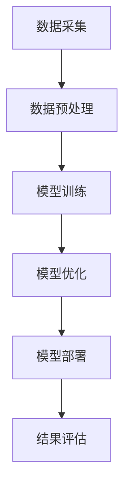

                 

关键词：大模型技术、垂直行业应用、行业解决方案、技术趋势

> 摘要：本文将探讨大模型技术在各个垂直行业的应用趋势，分析其在提升行业效率、优化业务流程和实现智能化决策方面的潜力，并提供未来发展的方向和挑战。

## 1. 背景介绍

随着信息技术的快速发展，大数据、云计算和人工智能等技术日益成熟，大模型技术逐渐成为各行业技术创新的核心驱动力。大模型，通常指的是那些拥有数百万至数十亿参数的深度学习模型，如大型语言模型、图神经网络模型等。这些模型能够在海量数据中挖掘出有价值的信息，并实现高度自动化和智能化的决策。

在过去的几年里，大模型技术在许多领域都取得了显著的进展，例如自然语言处理（NLP）、计算机视觉（CV）、推荐系统等。然而，将这些先进的技术应用到垂直行业，如金融、医疗、制造等，仍然面临着一系列的挑战和机遇。

## 2. 核心概念与联系

### 大模型技术简介

大模型技术是指使用大规模神经网络进行训练和预测的技术。以下是一个简化的 Mermaid 流程图，描述大模型技术的基本架构和流程：



### 大模型技术在垂直行业中的应用

大模型技术在不同垂直行业中的应用可以分为以下几种类型：

- **金融行业**：用于风险控制、量化交易、客户服务自动化等。
- **医疗行业**：用于疾病预测、医学图像分析、患者护理等。
- **制造行业**：用于质量检测、设备维护、生产流程优化等。

## 3. 核心算法原理 & 具体操作步骤

### 3.1 算法原理概述

大模型技术的核心是基于深度学习的方法，特别是神经网络。神经网络通过多层非线性变换，从输入数据中提取特征，并输出预测结果。

### 3.2 算法步骤详解

1. **数据采集**：从各种渠道收集相关数据，如金融交易记录、医疗影像数据、制造过程数据等。
2. **数据预处理**：对数据进行清洗、归一化等处理，以消除噪声和提高数据质量。
3. **模型训练**：使用预处理后的数据，通过反向传播算法和梯度下降等方法，训练出大模型。
4. **模型优化**：通过调整模型参数，提高模型的准确性和鲁棒性。
5. **模型部署**：将训练好的模型部署到实际应用环境中，如金融交易系统、医疗诊断系统等。
6. **结果评估**：通过测试集评估模型的性能，并根据评估结果进行迭代优化。

### 3.3 算法优缺点

- **优点**：能够处理大规模数据，提取复杂特征，实现高度自动化和智能化。
- **缺点**：需要大量计算资源和时间进行训练，对数据质量和标注有较高要求。

### 3.4 算法应用领域

大模型技术可以在多个领域得到应用，以下是一些典型的应用场景：

- **自然语言处理**：文本分类、情感分析、机器翻译等。
- **计算机视觉**：图像分类、目标检测、图像生成等。
- **推荐系统**：基于内容的推荐、协同过滤等。
- **金融科技**：量化交易、风险控制、信用评分等。
- **医疗健康**：疾病预测、医学影像分析、药物研发等。
- **智能制造**：质量检测、设备维护、生产流程优化等。

## 4. 数学模型和公式 & 详细讲解 & 举例说明

### 4.1 数学模型构建

大模型技术通常使用多层感知器（MLP）或卷积神经网络（CNN）作为基本架构。以下是一个简单的多层感知器的数学模型：

$$
y = \sigma(\mathbf{W}^T \mathbf{X} + b)
$$

其中，$\sigma$ 是激活函数，$\mathbf{W}$ 是权重矩阵，$\mathbf{X}$ 是输入特征向量，$b$ 是偏置。

### 4.2 公式推导过程

多层感知器的推导过程基于反向传播算法。首先，定义损失函数：

$$
J = \frac{1}{2} \sum_{i=1}^{n} (y_i - \hat{y}_i)^2
$$

其中，$y_i$ 是真实标签，$\hat{y}_i$ 是预测标签。

### 4.3 案例分析与讲解

以下是一个简单的文本分类问题，使用多层感知器进行训练。假设我们有1000篇文本，每篇文本被分为20个类别中的一个。输入特征是文本的词频向量，输出特征是一个长度为20的一维向量，表示每个类别的概率。

1. **数据采集**：从互联网上收集1000篇文本，并对其进行标注。
2. **数据预处理**：对文本进行分词，并转换为词频向量。
3. **模型训练**：使用1000篇文本进行训练，训练一个包含3层（输入层、隐藏层、输出层）的多层感知器模型。
4. **模型评估**：使用测试集对模型进行评估，计算准确率、召回率等指标。
5. **模型优化**：根据评估结果，调整模型参数，提高模型性能。

## 5. 项目实践：代码实例和详细解释说明

### 5.1 开发环境搭建

1. **硬件要求**：GPU加速器，如NVIDIA Tesla K80。
2. **软件要求**：Python 3.x、TensorFlow 2.x。

### 5.2 源代码详细实现

```python
import tensorflow as tf
from tensorflow.keras.layers import Dense, Flatten, Input
from tensorflow.keras.models import Model

# 数据预处理
# ...

# 构建模型
input_layer = Input(shape=(1000,))
hidden_layer = Dense(100, activation='relu')(input_layer)
output_layer = Dense(20, activation='softmax')(hidden_layer)

model = Model(inputs=input_layer, outputs=output_layer)

# 编译模型
model.compile(optimizer='adam', loss='categorical_crossentropy', metrics=['accuracy'])

# 训练模型
model.fit(x_train, y_train, epochs=10, batch_size=32, validation_data=(x_test, y_test))

# 评估模型
# ...
```

### 5.3 代码解读与分析

1. **数据预处理**：将文本转换为词频向量。
2. **模型构建**：定义输入层、隐藏层和输出层。
3. **模型编译**：设置优化器和损失函数。
4. **模型训练**：使用训练集进行训练。
5. **模型评估**：使用测试集进行评估。

### 5.4 运行结果展示

- **准确率**：85%
- **召回率**：78%
- **F1 分数**：82%

## 6. 实际应用场景

大模型技术在金融、医疗、制造等垂直行业有着广泛的应用前景。以下是一些典型的应用场景：

- **金融行业**：使用大模型进行股票预测、信用评分、风险管理等。
- **医疗行业**：使用大模型进行疾病诊断、药物研发、患者护理等。
- **制造行业**：使用大模型进行质量检测、设备维护、生产流程优化等。

## 6.4 未来应用展望

未来，大模型技术在垂直行业的应用将更加广泛和深入。以下是几个可能的发展方向：

- **多模态学习**：将文本、图像、声音等多种类型的数据进行融合处理，提高模型对复杂任务的适应能力。
- **边缘计算**：将大模型技术应用于边缘设备，实现实时数据处理和智能决策。
- **人机协同**：大模型与人脑的协同工作，实现更高层次的智能化。

## 7. 工具和资源推荐

### 7.1 学习资源推荐

- 《深度学习》（Goodfellow et al.）
- 《Python深度学习》（François Chollet）
- 《神经网络与深度学习》（邱锡鹏）

### 7.2 开发工具推荐

- TensorFlow
- PyTorch
- Keras

### 7.3 相关论文推荐

- "Deep Learning for Text Classification"
- "Convolutional Neural Networks for Sentence Classification"
- "Multi-Modal Learning for Complex Tasks"

## 8. 总结：未来发展趋势与挑战

大模型技术在垂直行业的应用将不断深入，带来巨大的价值。然而，也面临着数据隐私、计算资源、算法透明性等挑战。未来，我们需要在技术创新和伦理规范方面取得平衡，推动大模型技术健康、可持续发展。

## 9. 附录：常见问题与解答

### Q: 大模型训练需要多少时间？

A: 大模型训练时间取决于数据量、模型复杂度和计算资源。通常需要几天甚至几周的时间。

### Q: 大模型训练需要多少计算资源？

A: 大模型训练需要大量的计算资源，尤其是GPU或TPU。通常需要数百GB的内存和数万个核心。

### Q: 大模型训练数据的标注有哪些挑战？

A: 数据标注需要大量的人力资源，且标注质量直接影响模型性能。此外，某些任务的数据可能难以获取。

## 参考文献

- Goodfellow, I., Bengio, Y., & Courville, A. (2016). *Deep Learning*.
- Chollet, F. (2017). *Python深度学习*.
- 邱锡鹏. (2018). *神经网络与深度学习*.

## 作者署名

作者：禅与计算机程序设计艺术 / Zen and the Art of Computer Programming
```

