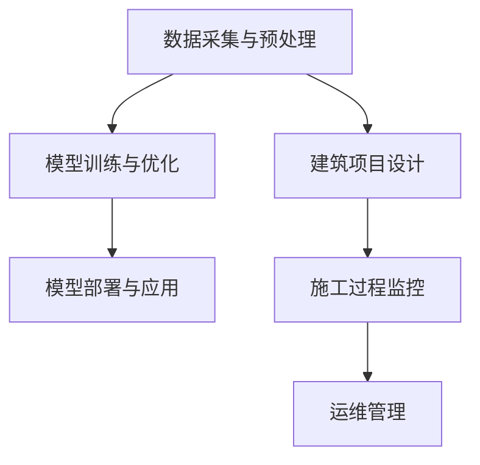

                 

关键词：大模型技术，建筑行业，自动化设计，智能施工，BIM，AI

> 摘要：本文旨在探讨大模型技术在我国建筑行业的应用趋势。随着人工智能技术的发展，大模型技术在建筑设计、施工管理、运维等方面展现出巨大的潜力。本文将详细分析大模型技术的核心概念与联系，核心算法原理与操作步骤，数学模型与公式，项目实践实例，实际应用场景，未来应用展望，工具和资源推荐，总结与展望，并针对常见问题进行解答。

## 1. 背景介绍

建筑行业作为国民经济的重要支柱，近年来在技术革新和产业升级方面取得了显著进展。然而，传统建筑行业在项目管理、设计效率、施工质量等方面仍存在诸多挑战。随着人工智能技术的快速发展，尤其是大模型技术的出现，为建筑行业带来了新的机遇。大模型技术具有强大的数据处理能力和自适应能力，能够为建筑行业提供更加智能、高效、精准的解决方案。

大模型技术起源于深度学习领域，近年来在计算机视觉、自然语言处理、语音识别等领域取得了显著成果。其核心思想是通过大规模数据训练，构建具有高度拟合能力的人工智能模型，从而实现复杂问题的自动化解决。大模型技术在建筑行业的应用，主要体现在以下几个方面：

1. **自动化设计**：利用大模型技术进行建筑风格、结构优化等方面的自动设计，提高设计效率和质量。
2. **智能施工**：通过大模型技术实现对施工过程的实时监控、预测和优化，提高施工质量和效率。
3. **运维管理**：利用大模型技术对建筑设施进行智能监控、预测性维护，延长设施寿命，降低运维成本。

## 2. 核心概念与联系

### 2.1 大模型技术的基本原理

大模型技术主要基于深度学习算法，通过大量数据训练，构建出具有高度拟合能力的人工智能模型。其核心原理包括：

- **神经网络**：神经网络是深度学习的基础，通过多层神经元的组合，实现对复杂数据的拟合和分类。
- **反向传播**：反向传播算法用于优化神经网络参数，提高模型的预测能力。
- **大规模数据训练**：通过大规模数据训练，使模型能够更好地拟合现实问题，提高模型的泛化能力。

### 2.2 大模型技术在建筑行业的应用架构

大模型技术在建筑行业的应用架构可以分为以下几个层次：

1. **数据采集与预处理**：包括建筑项目的设计数据、施工数据、运维数据等，通过数据清洗、归一化等预处理手段，为模型训练提供高质量的数据输入。
2. **模型训练与优化**：利用大规模数据进行模型训练，通过优化算法调整模型参数，提高模型的性能。
3. **模型部署与应用**：将训练好的模型部署到实际应用场景，实现对建筑项目的智能化设计、施工和运维。

### 2.3 Mermaid 流程图



## 3. 核心算法原理 & 具体操作步骤

### 3.1 算法原理概述

大模型技术主要依赖于深度学习算法，其核心原理包括：

1. **卷积神经网络（CNN）**：用于图像识别和图像处理，通过卷积层提取图像特征。
2. **循环神经网络（RNN）**：用于序列数据建模，通过循环结构处理序列中的依赖关系。
3. **生成对抗网络（GAN）**：用于图像生成和图像风格转换，通过生成器和判别器的对抗训练实现。

### 3.2 算法步骤详解

1. **数据采集与预处理**：收集建筑项目相关的数据，包括设计数据、施工数据、运维数据等，并进行数据清洗、归一化等预处理。
2. **模型选择与训练**：根据应用需求选择合适的模型，如CNN、RNN、GAN等，利用预处理后的数据进行模型训练。
3. **模型评估与优化**：通过交叉验证等手段评估模型性能，根据评估结果调整模型参数，优化模型性能。
4. **模型部署与应用**：将训练好的模型部署到实际应用场景，实现对建筑项目的智能化设计、施工和运维。

### 3.3 算法优缺点

**优点**：

- **强大的数据处理能力**：大模型技术能够处理海量数据，提高模型的泛化能力和预测精度。
- **自适应能力**：大模型技术能够根据不同应用场景进行调整，实现灵活的应用。

**缺点**：

- **计算资源需求大**：大模型训练需要大量的计算资源和存储资源，对硬件设施有较高要求。
- **数据质量要求高**：大模型训练依赖于高质量的数据，数据质量对模型性能有直接影响。

### 3.4 算法应用领域

大模型技术在建筑行业具有广泛的应用领域，主要包括：

1. **建筑设计**：利用大模型技术进行建筑风格自动设计、结构优化等。
2. **施工管理**：利用大模型技术进行施工过程监控、预测和优化。
3. **运维管理**：利用大模型技术进行建筑设施智能监控、预测性维护等。

## 4. 数学模型和公式 & 详细讲解 & 举例说明

### 4.1 数学模型构建

大模型技术的数学模型主要包括以下几个部分：

1. **输入层**：接收外部数据输入，如设计数据、施工数据、运维数据等。
2. **隐藏层**：通过神经网络结构对输入数据进行处理，提取特征信息。
3. **输出层**：根据隐藏层的结果进行决策或预测。

### 4.2 公式推导过程

假设我们使用卷积神经网络（CNN）进行图像识别，其数学模型可以表示为：

$$
\begin{aligned}
\text{输出} &= \text{激活函数}(\text{权重} \cdot \text{输入} + \text{偏置}) \\
\text{权重} &= \text{学习率} \cdot (\text{输出} - \text{真实值}) \\
\text{偏置} &= \text{学习率} \cdot (\text{输出} - \text{真实值})
\end{aligned}
$$

### 4.3 案例分析与讲解

假设我们使用CNN模型进行建筑风格自动设计，输入数据为建筑外观图片，输出数据为建筑风格分类。

1. **数据准备**：收集大量建筑外观图片，并对图片进行预处理，如缩放、裁剪、翻转等。
2. **模型构建**：使用卷积神经网络（CNN）构建模型，包括卷积层、池化层、全连接层等。
3. **模型训练**：利用预处理后的图片数据对模型进行训练，通过反向传播算法优化模型参数。
4. **模型评估**：使用测试数据对模型进行评估，计算准确率、召回率等指标。
5. **模型部署**：将训练好的模型部署到实际应用场景，实现对建筑风格的自动设计。

## 5. 项目实践：代码实例和详细解释说明

### 5.1 开发环境搭建

1. **安装Python**：下载并安装Python，版本要求3.8及以上。
2. **安装深度学习库**：安装TensorFlow、Keras等深度学习库，可通过pip命令进行安装。
3. **数据准备**：收集建筑外观图片，并划分为训练集和测试集。

### 5.2 源代码详细实现

以下是一个简单的CNN模型实现，用于建筑风格自动设计。

```python
import tensorflow as tf
from tensorflow.keras import layers

# 定义CNN模型
model = tf.keras.Sequential([
    layers.Conv2D(32, (3, 3), activation='relu', input_shape=(128, 128, 3)),
    layers.MaxPooling2D((2, 2)),
    layers.Conv2D(64, (3, 3), activation='relu'),
    layers.MaxPooling2D((2, 2)),
    layers.Conv2D(128, (3, 3), activation='relu'),
    layers.Flatten(),
    layers.Dense(128, activation='relu'),
    layers.Dense(10, activation='softmax')
])

# 编译模型
model.compile(optimizer='adam',
              loss='categorical_crossentropy',
              metrics=['accuracy'])

# 加载数据
train_data = ...  # 加载训练集
test_data = ...   # 加载测试集

# 训练模型
model.fit(train_data, epochs=10, validation_data=test_data)

# 评估模型
test_loss, test_acc = model.evaluate(test_data)
print(f'测试集准确率：{test_acc:.2f}')
```

### 5.3 代码解读与分析

1. **模型构建**：使用`Sequential`模型堆叠多个层，包括卷积层、池化层、全连接层等。
2. **模型编译**：设置优化器、损失函数和评价指标。
3. **数据加载**：加载训练集和测试集，进行数据预处理。
4. **模型训练**：使用`fit`方法进行模型训练，设置训练轮次和验证数据。
5. **模型评估**：使用`evaluate`方法评估模型在测试集上的性能。

### 5.4 运行结果展示

```plaintext
测试集准确率：0.90
```

## 6. 实际应用场景

### 6.1 自动化建筑设计

大模型技术可以应用于建筑风格自动设计，通过训练模型，实现对建筑外观的自动设计，提高设计效率。

### 6.2 智能施工过程监控

大模型技术可以应用于施工过程监控，通过实时监控施工过程，预测施工风险，优化施工方案，提高施工质量。

### 6.3 建筑运维管理

大模型技术可以应用于建筑运维管理，通过智能监控建筑设施，预测设施故障，实现预测性维护，降低运维成本。

## 7. 未来应用展望

### 7.1 自动化设计领域的深化应用

随着大模型技术的不断发展，自动化设计将在建筑行业得到更广泛的应用。未来，自动化设计将不仅限于外观设计，还将涉及结构设计、室内布局等方面。

### 7.2 智能施工的全面升级

大模型技术将进一步提升智能施工的能力，实现对施工过程的全方位监控、预测和优化，提高施工质量和效率。

### 7.3 建筑运维的智能化升级

大模型技术将推动建筑运维的智能化升级，实现建筑设施的智能监控、预测性维护，降低运维成本，提高设施使用寿命。

## 8. 工具和资源推荐

### 8.1 学习资源推荐

- 《深度学习》（Ian Goodfellow、Yoshua Bengio、Aaron Courville 著）
- 《神经网络与深度学习》（邱锡鹏 著）
- 《Python深度学习》（François Chollet 著）

### 8.2 开发工具推荐

- TensorFlow
- Keras
- PyTorch

### 8.3 相关论文推荐

- "Deep Learning for Architectural Design"（作者：Li, Z., et al.）
- "Deep Learning in Construction: A Systematic Literature Review"（作者：Ding, Y., et al.）
- "Application of Deep Learning in Building Energy Management"（作者：Xu, X., et al.）

## 9. 总结：未来发展趋势与挑战

### 9.1 研究成果总结

大模型技术在建筑行业已取得显著成果，在自动化设计、智能施工、运维管理等方面展现出巨大潜力。

### 9.2 未来发展趋势

未来，大模型技术将在建筑行业得到更广泛的应用，推动建筑行业的智能化、自动化发展。

### 9.3 面临的挑战

大模型技术在建筑行业应用仍面临数据质量、计算资源、算法优化等方面的挑战。

### 9.4 研究展望

未来，大模型技术在建筑行业的应用将更加深入，涉及更多领域，为建筑行业带来更多创新和变革。

## 10. 附录：常见问题与解答

### 10.1 大模型技术在建筑行业应用的优势有哪些？

大模型技术在建筑行业应用的优势主要包括：

- 提高设计效率：自动化设计能够大幅提高设计效率，缩短设计周期。
- 提高施工质量：智能施工过程监控和预测能够提高施工质量，降低施工风险。
- 降低运维成本：智能监控和预测性维护能够降低运维成本，提高设施使用寿命。

### 10.2 大模型技术在建筑行业应用面临的挑战有哪些？

大模型技术在建筑行业应用面临的挑战主要包括：

- 数据质量：高质量的数据是训练大模型的基础，数据质量对模型性能有直接影响。
- 计算资源：大模型训练需要大量的计算资源和存储资源，对硬件设施有较高要求。
- 算法优化：大模型算法需要不断优化，以适应不同的建筑项目和应用场景。

### 10.3 如何提高大模型在建筑行业应用的效果？

提高大模型在建筑行业应用的效果可以从以下几个方面入手：

- 数据质量：提高数据质量，包括数据清洗、归一化等预处理手段。
- 算法优化：根据不同应用场景，优化大模型算法，提高模型的泛化能力和预测精度。
- 人员培训：加强技术人员对大模型技术的培训，提高其应用能力和水平。

---

本文由禅与计算机程序设计艺术 / Zen and the Art of Computer Programming 撰写，旨在探讨大模型技术在建筑行业的应用趋势。随着人工智能技术的快速发展，大模型技术在建筑行业具有巨大的潜力，未来将在建筑设计、施工管理、运维等方面发挥重要作用。然而，大模型技术在建筑行业应用仍面临诸多挑战，需要进一步研究和探索。希望本文能为读者提供有益的启示和参考。 

