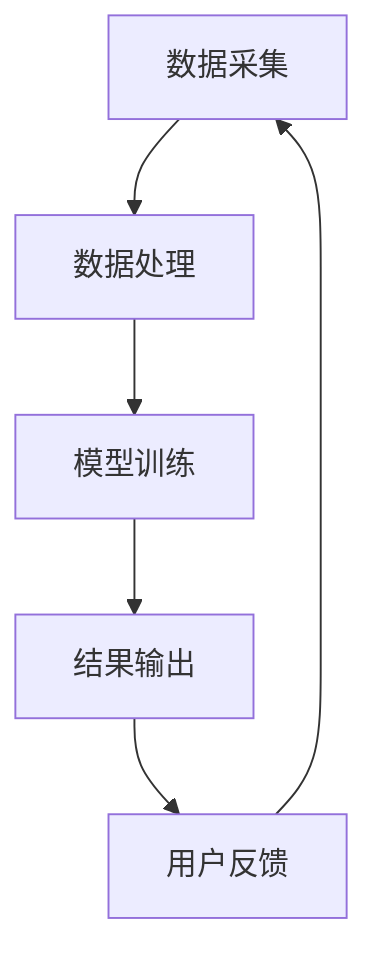

                 

关键词：大模型、智能财务分析、机器学习、深度学习、神经网络、自然语言处理、数据处理、自动化财务审计

## 摘要

本文将探讨大模型技术在智能财务分析中的应用。随着大数据和人工智能技术的不断发展，大模型在处理复杂财务数据和分析财务信息方面展现出巨大的潜力。本文首先介绍了大模型技术的基本概念和原理，然后详细阐述了其在智能财务分析中的关键作用，包括数据处理、财务预测、风险管理和自动化审计等方面。最后，本文对大模型技术在智能财务分析领域的前景进行了展望，并提出了未来可能面临的挑战。

## 1. 背景介绍

### 大模型技术的发展

大模型技术是指利用深度学习和神经网络等机器学习算法，训练出具有大规模参数和强大表达能力的人工智能模型。这些模型通常基于大量的数据集进行训练，可以自动学习并提取数据中的复杂模式和规律。大模型技术的发展可以追溯到上世纪80年代的神经网络研究，但真正引起广泛关注是在2012年，当时谷歌的AlexNet在ImageNet图像识别竞赛中取得了突破性的成绩，开启了深度学习的新时代。

### 智能财务分析的需求

随着企业规模的扩大和市场环境的复杂化，财务数据分析变得日益重要。传统的财务分析方法往往依赖于人工处理和分析大量的财务数据，效率低下且容易出现错误。为了满足日益增长的需求，智能财务分析逐渐成为财务领域的研究热点。智能财务分析的目标是利用先进的技术手段，自动化处理和分析财务数据，提高财务管理的效率和准确性。

## 2. 核心概念与联系

### 大模型技术的基本原理

大模型技术主要基于深度学习和神经网络。深度学习是一种多层神经网络模型，通过多个隐藏层的学习和训练，可以自动提取数据中的高级特征。神经网络则是一种模拟人脑神经元之间连接的计算模型，通过不断调整连接权重，实现输入到输出的映射。

### 智能财务分析的架构

智能财务分析系统通常包括数据采集、数据处理、模型训练和结果输出等模块。数据采集模块负责从各种数据源获取财务数据；数据处理模块对数据进行清洗、整合和预处理，以便后续分析；模型训练模块利用深度学习算法训练大模型，以实现财务数据的自动分析和预测；结果输出模块将分析结果以可视化或报表的形式呈现给用户。

### Mermaid 流程图



## 3. 核心算法原理 & 具体操作步骤

### 3.1 算法原理概述

大模型技术主要利用深度学习和神经网络实现。深度学习通过多层神经网络学习数据中的复杂模式，神经网络则通过不断调整连接权重实现输入到输出的映射。

### 3.2 算法步骤详解

1. 数据采集：从各种数据源获取财务数据，包括企业财务报表、交易记录、市场数据等。
2. 数据处理：对采集到的财务数据清洗、整合和预处理，以便后续分析。
3. 模型训练：利用深度学习算法训练大模型，提取数据中的高级特征。
4. 模型评估：通过交叉验证和测试集对模型进行评估，选择最优模型。
5. 结果输出：将分析结果以可视化或报表的形式呈现给用户。

### 3.3 算法优缺点

优点：
1. 高效性：大模型可以自动提取数据中的复杂模式，提高分析效率。
2. 准确性：通过大量数据的训练，大模型可以准确预测财务趋势和风险。

缺点：
1. 计算成本高：大模型训练需要大量的计算资源和时间。
2. 数据依赖性强：大模型的性能依赖于数据质量和数据量。

### 3.4 算法应用领域

大模型技术在智能财务分析中的应用广泛，包括财务预测、风险管理和自动化审计等方面。例如，利用大模型技术可以预测企业的财务状况，为企业提供决策支持；通过分析财务数据，识别潜在的风险，帮助企业在风险控制方面做出更好的决策；利用大模型技术实现自动化财务审计，提高审计效率和准确性。

## 4. 数学模型和公式 & 详细讲解 & 举例说明

### 4.1 数学模型构建

大模型技术主要基于深度学习和神经网络，其数学模型可以表示为：

$$
f(x) = \sigma(W_{output} \cdot \sigma(...\sigma(W_{1} \cdot x + b_{1})...+ b_{output})
$$

其中，$x$ 表示输入数据，$W$ 和 $b$ 分别表示权重和偏置，$\sigma$ 表示激活函数，$f(x)$ 表示输出结果。

### 4.2 公式推导过程

大模型技术中的神经网络通过多层全连接层实现，每一层的输出可以作为下一层的输入。在训练过程中，通过反向传播算法不断调整权重和偏置，使得模型输出逐渐逼近真实值。具体推导过程如下：

1. 前向传播：计算输入到每一层的输出值。
2. 计算损失函数：使用损失函数衡量模型输出和真实值之间的差距。
3. 反向传播：计算每一层的梯度，并更新权重和偏置。
4. 重复迭代：不断重复前向传播和反向传播，直到模型收敛。

### 4.3 案例分析与讲解

以财务预测为例，假设我们要预测一家企业的净利润。首先，从企业的历史财务数据中提取相关特征，包括营业收入、成本、毛利率等。然后，利用深度学习算法训练大模型，输入特征并预测净利润。具体步骤如下：

1. 数据采集：收集企业的历史财务数据。
2. 数据处理：对数据进行清洗和预处理，提取相关特征。
3. 模型训练：使用深度学习算法训练大模型，输入特征并预测净利润。
4. 模型评估：通过交叉验证和测试集对模型进行评估。
5. 结果输出：将预测结果以可视化或报表的形式呈现给用户。

## 5. 项目实践：代码实例和详细解释说明

### 5.1 开发环境搭建

1. 安装 Python 解释器和相关库（如 TensorFlow、Keras 等）。
2. 准备财务数据集，并进行预处理。

### 5.2 源代码详细实现

以下是一个简单的财务预测示例代码：

```python
import tensorflow as tf
from tensorflow.keras.models import Sequential
from tensorflow.keras.layers import Dense, LSTM

# 数据预处理
# ...

# 构建模型
model = Sequential()
model.add(LSTM(50, activation='relu', input_shape=(time_steps, features)))
model.add(Dense(1))
model.compile(optimizer='adam', loss='mse')

# 训练模型
model.fit(x_train, y_train, epochs=100, batch_size=32, validation_split=0.2)

# 预测结果
predictions = model.predict(x_test)

# 结果可视化
# ...
```

### 5.3 代码解读与分析

1. 数据预处理：对财务数据进行清洗和预处理，提取相关特征。
2. 构建模型：使用 LSTM 层实现时间序列预测，并添加全连接层。
3. 训练模型：使用训练数据集训练模型，并设置优化器和损失函数。
4. 预测结果：使用测试数据集预测净利润，并可视化结果。

## 6. 实际应用场景

### 6.1 财务预测

大模型技术可以用于财务预测，帮助企业提前了解未来的财务状况，为决策提供支持。例如，预测企业的营收、利润、现金流等关键指标。

### 6.2 风险管理

通过分析财务数据，大模型技术可以识别潜在的风险，为企业提供风险预警。例如，预测违约风险、市场风险等。

### 6.3 自动化审计

大模型技术可以实现自动化财务审计，提高审计效率和准确性。例如，通过分析企业财务报表，自动识别异常交易和违规行为。

## 7. 工具和资源推荐

### 7.1 学习资源推荐

1. 《深度学习》（Ian Goodfellow、Yoshua Bengio、Aaron Courville 著）
2. 《Python 数据科学手册》（Jake VanderPlas 著）

### 7.2 开发工具推荐

1. TensorFlow
2. Keras
3. PyTorch

### 7.3 相关论文推荐

1. "Deep Learning for Financial Time Series Prediction: A Survey"
2. "A Theoretical Framework for Financial Risk Prediction Based on Deep Learning"

## 8. 总结：未来发展趋势与挑战

### 8.1 研究成果总结

大模型技术在智能财务分析领域取得了显著成果，为财务预测、风险管理和自动化审计等方面提供了有力支持。

### 8.2 未来发展趋势

随着大数据和人工智能技术的不断发展，大模型技术将在智能财务分析领域发挥更大的作用，推动财务管理向智能化、自动化方向发展。

### 8.3 面临的挑战

1. 数据质量和数据隐私：财务数据的质量和隐私保护是未来研究的重点。
2. 计算资源和算法优化：大模型训练需要大量的计算资源和时间，如何提高算法效率是一个挑战。

### 8.4 研究展望

未来，大模型技术在智能财务分析领域的应用将更加广泛，有望在财务预测、风险管理和自动化审计等方面取得突破性进展。

## 9. 附录：常见问题与解答

### 9.1 什么是大模型？

大模型是指具有大规模参数和强大表达能力的人工智能模型，通常基于深度学习和神经网络。

### 9.2 大模型技术在财务分析中有哪些应用？

大模型技术在财务分析中的应用包括财务预测、风险管理和自动化审计等方面。

### 9.3 大模型技术有哪些优缺点？

大模型技术的优点是高效性和准确性，缺点是计算成本高和数据依赖性强。

## 作者署名

作者：禅与计算机程序设计艺术 / Zen and the Art of Computer Programming
```

