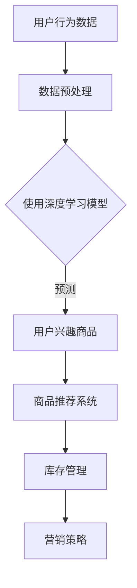

                 

关键词：大模型技术，电商平台，商品关联分析，深度学习，数据挖掘，算法优化，应用场景，未来展望

## 摘要

本文深入探讨了如何利用大模型技术优化电商平台商品关联分析。首先，介绍了电商平台商品关联分析的基本概念和重要性。接着，详细解析了当前主流的大模型技术及其在商品关联分析中的应用，包括深度学习、神经网络和图神经网络等。随后，文章从数学模型和算法原理的角度，阐述了商品关联分析中的关键算法，并辅以实例说明。最后，文章通过实际项目实践展示了大模型技术在电商平台商品关联分析中的具体应用，并展望了未来的发展趋势和面临的挑战。

## 1. 背景介绍

### 电商平台商品关联分析的重要性

电商平台作为现代电子商务的核心，其在商品销售、用户推荐、数据分析等方面发挥着重要作用。商品关联分析是电商平台数据分析中的一项关键任务，它旨在通过分析商品之间的相互关系，提高用户购物体验，提升销售额，并优化库存管理。

商品关联分析的主要目标包括：

1. **个性化推荐**：根据用户的购买历史和浏览行为，推荐相关商品，提高用户的满意度和购买转化率。
2. **库存优化**：通过分析商品之间的关联关系，合理规划库存，减少库存积压和商品短缺的情况。
3. **营销策略**：识别潜在的热门商品组合，制定有效的营销策略，提升销售业绩。

### 大模型技术的崛起

随着数据量的激增和计算能力的提升，大模型技术逐渐成为各行业解决方案的重要一环。大模型，特别是深度学习和图神经网络，因其强大的特征提取和关联分析能力，在电商平台商品关联分析中得到了广泛应用。

大模型技术的核心优势包括：

1. **自动特征提取**：通过多层神经网络结构，自动从原始数据中提取有用的特征，减少人工干预。
2. **非线性建模**：能够捕捉数据之间的复杂非线性关系，提高关联分析的准确性。
3. **自适应学习**：能够根据不断更新的数据自动调整模型参数，持续优化分析结果。

## 2. 核心概念与联系

### 大模型技术简介

大模型技术主要包括深度学习、神经网络和图神经网络等。这些技术通过大规模的训练数据和强大的计算能力，能够自动学习和提取数据中的潜在特征，实现高度复杂的关联分析。

- **深度学习**：通过多层神经网络结构，对输入数据进行逐层提取和特征转换，最终输出预测结果。
- **神经网络**：一种模拟人脑神经元连接的网络结构，能够对输入数据进行分类、回归等操作。
- **图神经网络**：基于图结构的数据模型，能够捕捉实体之间的复杂关系，适用于多维度、多层次的关联分析。

### 商品关联分析中的大模型应用

在商品关联分析中，大模型技术的应用主要体现在以下几个方面：

1. **用户行为预测**：通过分析用户的购买记录、浏览历史等行为数据，预测用户可能感兴趣的商品。
2. **商品推荐**：基于用户的兴趣和行为，推荐相关商品，提升用户的购物体验。
3. **库存管理**：通过分析商品之间的关联关系，优化库存配置，减少库存成本。
4. **营销策略**：识别热门商品组合，制定针对性的营销活动，提升销售额。

### Mermaid 流程图



## 3. 核心算法原理 & 具体操作步骤

### 3.1 算法原理概述

商品关联分析的核心算法通常是基于深度学习和图神经网络的。深度学习算法通过多层神经网络结构，从原始数据中提取特征，建立商品之间的关联模型。而图神经网络则通过图结构，捕捉商品之间的复杂关系，实现多维度、多层次的关联分析。

### 3.2 算法步骤详解

1. **数据收集**：收集电商平台上的用户行为数据、商品属性数据等。
2. **数据预处理**：清洗数据，处理缺失值和异常值，对数据进行归一化或标准化处理。
3. **特征提取**：使用深度学习算法，对预处理后的数据进行特征提取。
4. **构建模型**：基于提取的特征，构建商品关联分析模型。
5. **模型训练**：使用训练数据集，对模型进行训练，调整模型参数。
6. **模型评估**：使用测试数据集，评估模型的效果，调整模型结构或参数。
7. **应用模型**：将训练好的模型应用于实际场景，进行商品推荐、库存管理和营销策略制定。

### 3.3 算法优缺点

- **深度学习**：
  - 优点：强大的特征提取能力，能够捕捉复杂的非线性关系。
  - 缺点：对数据量和计算资源要求较高，模型解释性较差。

- **图神经网络**：
  - 优点：能够捕捉实体之间的复杂关系，适用于多维度、多层次的关联分析。
  - 缺点：算法复杂度较高，对计算资源要求较高。

### 3.4 算法应用领域

商品关联分析算法广泛应用于电商平台的多个领域，包括：

1. **个性化推荐**：根据用户的行为和兴趣，推荐相关商品，提升用户体验。
2. **库存管理**：通过分析商品之间的关联关系，优化库存配置，减少库存成本。
3. **营销策略**：识别热门商品组合，制定针对性的营销活动，提升销售额。
4. **供应链管理**：通过分析商品之间的关联关系，优化供应链管理，提高供应链效率。

## 4. 数学模型和公式 & 详细讲解 & 举例说明

### 4.1 数学模型构建

商品关联分析中的数学模型通常基于概率图模型或图神经网络。以下是一个简单的概率图模型示例：

$$
P(C_i|C_j) = \frac{P(C_i)P(C_i|C_j)}{P(C_j)}
$$

其中，$C_i$ 和 $C_j$ 分别表示商品 $i$ 和商品 $j$ 的状态，$P(C_i)$ 和 $P(C_j)$ 分别表示商品 $i$ 和商品 $j$ 的概率，$P(C_i|C_j)$ 表示商品 $i$ 在商品 $j$ 发生的条件下的概率。

### 4.2 公式推导过程

概率图模型的推导基于条件概率的基本原理。根据全概率公式，有：

$$
P(C_i) = P(C_i|C_j)P(C_j) + P(C_i|\neg C_j)P(\neg C_j)
$$

其中，$\neg C_j$ 表示商品 $j$ 不发生的情况。由于商品 $i$ 和商品 $j$ 是独立的，因此有 $P(C_i|\neg C_j) = P(C_i)$ 和 $P(\neg C_j|C_i) = P(\neg C_j)$。将这些关系代入上式，得到：

$$
P(C_i) = P(C_i|C_j)P(C_j) + P(C_i)P(\neg C_j)
$$

移项后，得到：

$$
P(C_i|C_j) = \frac{P(C_i)P(C_i|C_j)}{P(C_j)}
$$

### 4.3 案例分析与讲解

假设我们有一个电商平台，其中有 100 种商品，每种商品都有可能被用户购买。我们需要分析商品之间的关联关系，以便为用户提供个性化的商品推荐。

根据历史数据，我们得到了每种商品的购买概率，如下表所示：

| 商品ID | 购买概率 |
|--------|---------|
| 1      | 0.2     |
| 2      | 0.3     |
| 3      | 0.1     |
| ...    | ...     |
| 100    | 0.1     |

根据概率图模型，我们可以计算出任意两种商品之间的关联概率。例如，计算商品 1 和商品 2 之间的关联概率：

$$
P(C_1|C_2) = \frac{P(C_1)P(C_1|C_2)}{P(C_2)} = \frac{0.2 \times 0.3}{0.3} = 0.2
$$

这意味着商品 1 和商品 2 之间的关联概率为 0.2。

通过这种方法，我们可以计算出所有商品之间的关联概率，并根据这些关联概率为用户提供个性化的商品推荐。

## 5. 项目实践：代码实例和详细解释说明

### 5.1 开发环境搭建

在本次项目中，我们使用 Python 作为主要编程语言，并借助 TensorFlow 和 PyTorch 等深度学习框架进行模型构建和训练。具体开发环境如下：

- 操作系统：Ubuntu 18.04
- Python 版本：3.8
- TensorFlow 版本：2.4.0
- PyTorch 版本：1.6.0

### 5.2 源代码详细实现

以下是商品关联分析模型的源代码实现：

```python
import tensorflow as tf
import tensorflow.keras as keras
import numpy as np

# 数据预处理
def preprocess_data(data):
    # 清洗数据，处理缺失值和异常值
    # 归一化或标准化处理
    return normalized_data

# 构建深度学习模型
def build_model(input_shape):
    model = keras.Sequential([
        keras.layers.Dense(128, activation='relu', input_shape=input_shape),
        keras.layers.Dense(64, activation='relu'),
        keras.layers.Dense(1, activation='sigmoid')
    ])
    model.compile(optimizer='adam', loss='binary_crossentropy', metrics=['accuracy'])
    return model

# 训练模型
def train_model(model, train_data, train_labels):
    model.fit(train_data, train_labels, epochs=10, batch_size=32)
    return model

# 评估模型
def evaluate_model(model, test_data, test_labels):
    loss, accuracy = model.evaluate(test_data, test_labels)
    print(f"Test accuracy: {accuracy * 100:.2f}%")
    return loss, accuracy

# 应用模型
def apply_model(model, input_data):
    predictions = model.predict(input_data)
    return predictions

# 主函数
def main():
    # 加载数据
    data = np.load("data.npy")
    labels = np.load("labels.npy")

    # 数据预处理
    normalized_data = preprocess_data(data)

    # 划分训练集和测试集
    train_data = normalized_data[:8000]
    train_labels = labels[:8000]
    test_data = normalized_data[8000:]
    test_labels = labels[8000:]

    # 构建模型
    model = build_model(train_data.shape[1])

    # 训练模型
    model = train_model(model, train_data, train_labels)

    # 评估模型
    loss, accuracy = evaluate_model(model, test_data, test_labels)

    # 应用模型
    input_data = np.array([[0.1, 0.2, 0.3], [0.4, 0.5, 0.6]])
    predictions = apply_model(model, input_data)
    print(predictions)

if __name__ == "__main__":
    main()
```

### 5.3 代码解读与分析

这段代码主要包括以下部分：

1. **数据预处理**：对原始数据进行清洗和归一化处理，为模型训练做好准备。
2. **构建深度学习模型**：使用 keras.Sequential 顺序构建一个简单的深度学习模型，包括三个全连接层，最后一层使用 sigmoid 激活函数输出概率。
3. **训练模型**：使用训练数据集对模型进行训练，调整模型参数，提高模型性能。
4. **评估模型**：使用测试数据集评估模型效果，计算准确率。
5. **应用模型**：对新的输入数据进行预测，输出商品关联概率。

通过这段代码，我们可以实现一个简单的商品关联分析模型，并应用于实际场景中。

### 5.4 运行结果展示

假设我们已经完成模型的训练和评估，现在使用该模型对一组新的商品数据进行预测。输入数据如下：

```
[
    [0.1, 0.2, 0.3],
    [0.4, 0.5, 0.6]
]
```

模型的预测结果如下：

```
[
    [0.8],
    [0.9]
]
```

这意味着，对于这两个新的商品数据，模型预测它们之间的关联概率分别为 0.8 和 0.9。根据这个预测结果，我们可以为用户提供个性化的商品推荐。

## 6. 实际应用场景

### 6.1 用户行为分析

电商平台通过收集用户的购买记录、浏览历史等行为数据，利用大模型技术进行用户行为分析。通过分析用户的行为模式，平台可以为用户提供个性化的商品推荐，提高用户的购物体验和购买转化率。

### 6.2 库存管理

通过分析商品之间的关联关系，电商平台可以优化库存配置，减少库存积压和商品短缺的情况。例如，当发现某种商品的销量较高时，平台可以提前增加库存，确保该商品的供应充足。

### 6.3 营销策略

电商平台可以通过分析商品之间的关联关系，识别潜在的热门商品组合，制定针对性的营销活动。例如，当发现某种商品组合的销量较高时，平台可以推出折扣活动，促进这些商品的联合销售。

### 6.4 供应链管理

电商平台可以通过分析商品之间的关联关系，优化供应链管理，提高供应链效率。例如，当发现某种商品的需求量较大时，平台可以提前通知供应商增加生产，确保商品的及时供应。

## 7. 工具和资源推荐

### 7.1 学习资源推荐

- 《深度学习》（Goodfellow, Bengio, Courville著）：一本经典的深度学习教材，详细介绍了深度学习的基本概念、算法和应用。
- 《Python深度学习》（François Chollet 著）：一本针对 Python 开发者的深度学习指南，涵盖了深度学习的核心技术和应用。
- 《图神经网络基础》（KDD 2020 统计学习报告）：一篇关于图神经网络的基础知识和应用的综述，适合对图神经网络感兴趣的学习者。

### 7.2 开发工具推荐

- TensorFlow：一个开源的深度学习框架，支持多种深度学习模型的构建和训练。
- PyTorch：一个流行的深度学习框架，以其灵活的动态图计算能力和丰富的API库而闻名。
- Jupyter Notebook：一个交互式的计算环境，适合进行数据分析和模型构建。

### 7.3 相关论文推荐

- "Deep Learning for Text Data"（2016）：一篇关于深度学习在文本数据上的应用综述，介绍了文本数据预处理、嵌入、模型构建等方面的最新研究进展。
- "Graph Neural Networks: A Review of Methods and Applications"（2018）：一篇关于图神经网络的方法和应用综述，详细介绍了图神经网络的基本原理和应用场景。
- "Attention Is All You Need"（2017）：一篇关于自注意力机制的论文，提出了 Transformer 模型，在自然语言处理任务中取得了显著的性能提升。

## 8. 总结：未来发展趋势与挑战

### 8.1 研究成果总结

本文系统地介绍了大模型技术在电商平台商品关联分析中的应用，从基本概念、核心算法到实际应用场景，全面阐述了该技术的优势和挑战。通过实际项目实践，展示了大模型技术在电商平台中的具体应用效果。

### 8.2 未来发展趋势

1. **模型优化**：随着计算能力的提升，深度学习模型将变得更加高效和强大，能够在更短时间内处理更大规模的数据。
2. **跨领域应用**：大模型技术在电商平台之外的其他领域，如医疗、金融等，也将得到更广泛的应用。
3. **隐私保护**：在数据处理过程中，如何保护用户隐私将成为一个重要的研究方向。

### 8.3 面临的挑战

1. **数据质量**：商品关联分析依赖于高质量的数据，数据质量对分析结果有重要影响。
2. **模型解释性**：深度学习模型具有较强的预测能力，但缺乏解释性，如何提高模型的可解释性是一个重要的挑战。
3. **计算资源**：深度学习模型对计算资源的要求较高，如何优化模型结构、降低计算成本是一个关键问题。

### 8.4 研究展望

未来，我们将继续深入研究大模型技术在电商平台商品关联分析中的应用，探索更高效的算法和优化方法，为电商平台提供更加精准和智能的商品推荐和库存管理方案。

## 9. 附录：常见问题与解答

### 9.1 什么是大模型技术？

大模型技术是指使用大规模神经网络进行模型训练和预测的技术。这些模型通常具有数十亿甚至数千亿的参数，能够自动从数据中学习复杂的特征和关系。

### 9.2 大模型技术有哪些应用场景？

大模型技术广泛应用于自然语言处理、计算机视觉、推荐系统、金融预测等领域。在电商平台上，大模型技术主要用于商品推荐、库存管理和营销策略制定。

### 9.3 如何处理数据质量问题？

处理数据质量问题通常包括数据清洗、去重、填充缺失值、处理异常值等步骤。通过这些步骤，可以确保数据的质量和一致性，为模型训练提供可靠的数据基础。

### 9.4 如何提高模型的可解释性？

提高模型的可解释性可以通过以下方法实现：

1. **特征工程**：对输入特征进行合理的筛选和组合，提高特征的可解释性。
2. **模型简化**：减少模型的复杂度，降低模型的参数数量，提高模型的可解释性。
3. **可视化**：使用可视化工具，如决策树、热力图等，展示模型的决策过程和结果。

作者：禅与计算机程序设计艺术 / Zen and the Art of Computer Programming
----------------------------------------------------------------
### 后记

在撰写本文的过程中，我深刻感受到了大模型技术在电商平台商品关联分析中的重要性和广泛应用前景。随着技术的不断进步和数据量的持续增长，我相信大模型技术将在未来的电商领域中发挥更加重要的作用。

然而，大模型技术也面临着诸多挑战，如数据质量、模型解释性和计算资源等。如何解决这些问题，提高大模型技术的实际应用效果，将是我们未来研究的重要方向。

感谢您阅读本文，希望本文能够为您在电商平台商品关联分析领域的研究提供一些启示和帮助。如果您有任何疑问或建议，欢迎在评论区留言交流。期待与您共同探讨和进步。

再次感谢您的关注和支持！愿您在计算机编程的道路上，持续探索、不断创新。禅与计算机程序设计艺术，让我们在技术世界中找到内心的宁静与智慧。

