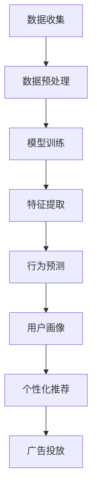

                 

关键词：大模型技术、电商平台、用户兴趣迁移、算法、数学模型、实践案例、工具推荐

> 摘要：本文将探讨大模型技术在电商平台用户兴趣迁移中的应用。通过详细阐述大模型技术的基本原理、算法实现、数学模型构建以及实际应用案例，旨在为电商平台提供有效提升用户兴趣迁移的方法，从而提高用户黏性和销售额。

## 1. 背景介绍

随着互联网技术的飞速发展，电商平台已经成为了现代商业活动的重要组成部分。用户在电商平台上的行为数据非常丰富，这些数据中蕴含着用户的需求、偏好和兴趣等信息。如何有效地利用这些数据，实现用户兴趣的迁移，从而提高用户的购物体验和商家的销售额，成为了电商平台发展的关键问题。

用户兴趣迁移是指在电商平台中，通过分析用户的历史行为数据，预测用户未来可能产生的行为，并将这些行为转化为实际的购物行为。传统的用户兴趣迁移方法主要依赖于统计学习和机器学习算法，但这些方法往往存在着预测准确率不高、模型复杂度较高等问题。

随着深度学习的兴起，大模型技术开始被广泛应用于各个领域，尤其是在自然语言处理、计算机视觉等方向取得了显著的成果。大模型技术通过利用海量的训练数据，能够有效地提取复杂特征，提高模型的预测性能。因此，将大模型技术引入到电商平台用户兴趣迁移中，有望解决传统方法存在的问题。

本文将首先介绍大模型技术的基本原理和核心算法，然后通过具体案例展示大模型技术在电商平台用户兴趣迁移中的应用，最后讨论未来应用展望和面临的挑战。

## 2. 核心概念与联系

### 2.1 大模型技术简介

大模型技术是指通过训练规模巨大的神经网络模型，使其具备强大的特征提取和预测能力。这些模型通常由数十亿到数万亿个参数组成，能够处理大规模的数据集，并在各种复杂任务中表现出色。大模型技术的核心思想是利用深度学习算法，通过多层神经网络的堆叠，逐步提取数据中的高阶特征，从而实现高效的模型训练和预测。

### 2.2 用户兴趣迁移概念

用户兴趣迁移是指通过分析用户的历史行为数据，预测用户未来可能产生的行为，并将这些行为转化为实际的购物行为。用户兴趣迁移的关键在于如何准确地捕捉用户的行为特征，并利用这些特征进行行为预测。传统的用户兴趣迁移方法主要依赖于统计学习和机器学习算法，如回归分析、决策树、支持向量机等。然而，这些方法在面对大规模、复杂的行为数据时，往往存在着预测准确率不高、模型复杂度较高等问题。

### 2.3 大模型技术在用户兴趣迁移中的应用

大模型技术在用户兴趣迁移中的应用主要体现在以下几个方面：

1. **特征提取**：大模型技术能够通过训练大规模神经网络，从原始行为数据中自动提取高阶特征。这些特征可以捕捉用户行为的深层规律，从而提高行为预测的准确率。

2. **行为预测**：通过大模型技术，可以建立强大的行为预测模型，对用户未来的购物行为进行准确预测。这些预测结果可以用于个性化推荐、广告投放等实际应用。

3. **用户画像**：大模型技术还能够通过分析用户的历史行为数据，构建用户画像，了解用户的兴趣偏好和需求。这些用户画像可以为电商平台提供精准的用户定位和营销策略。

### 2.4 Mermaid 流程图

以下是一个简单的 Mermaid 流程图，展示大模型技术在用户兴趣迁移中的应用流程：



## 3. 核心算法原理 & 具体操作步骤

### 3.1 算法原理概述

大模型技术在用户兴趣迁移中的应用主要基于深度学习算法，尤其是变分自编码器（Variational Autoencoder, VAE）和生成对抗网络（Generative Adversarial Network, GAN）等生成模型。这些模型通过训练大规模神经网络，能够自动提取数据中的高阶特征，并在行为预测和用户画像等方面表现出色。

### 3.2 算法步骤详解

1. **数据收集与预处理**：首先，从电商平台获取用户的行为数据，包括浏览记录、购物记录、评论等。然后，对数据进行清洗、去重、归一化等预处理操作，以便后续建模。

2. **模型训练**：利用预处理后的数据，训练变分自编码器（VAE）或生成对抗网络（GAN）等深度学习模型。模型训练过程包括编码器和解码器的训练，以及对抗网络的训练。通过大量迭代，模型将逐渐学习到数据中的高阶特征。

3. **特征提取**：在模型训练过程中，编码器将输入数据映射到潜变量空间，解码器将潜变量映射回数据空间。潜变量空间中的高阶特征可以用于行为预测和用户画像。

4. **行为预测**：利用训练好的模型，对用户未来的购物行为进行预测。行为预测过程包括用户行为序列的建模、用户行为概率的估计等。

5. **用户画像**：通过分析潜变量空间中的高阶特征，构建用户画像。用户画像可以用于个性化推荐、广告投放等实际应用。

### 3.3 算法优缺点

**优点**：

1. **高效的特征提取**：大模型技术能够自动提取数据中的高阶特征，提高行为预测的准确率。

2. **强大的行为预测能力**：大模型技术在行为预测方面表现出色，能够准确预测用户未来的购物行为。

3. **多领域应用**：大模型技术不仅适用于电商平台用户兴趣迁移，还可以应用于其他领域，如金融、医疗等。

**缺点**：

1. **训练资源需求大**：大模型技术需要大量计算资源和存储空间，训练过程相对耗时。

2. **模型解释性不足**：由于模型参数众多，大模型技术的解释性相对较差，难以理解模型的工作原理。

### 3.4 算法应用领域

大模型技术在用户兴趣迁移方面的应用非常广泛，主要包括以下几个方面：

1. **电商平台**：通过用户兴趣迁移，提高个性化推荐和广告投放的准确率，从而提高用户黏性和销售额。

2. **金融领域**：通过用户行为预测，实现精准的风控和信用评估。

3. **医疗领域**：通过用户健康行为分析，实现个性化的健康管理和疾病预防。

## 4. 数学模型和公式 & 详细讲解 & 举例说明

### 4.1 数学模型构建

在用户兴趣迁移中，大模型技术的数学模型主要基于深度学习和概率图模型。以下是一个简单的数学模型构建过程：

1. **数据表示**：将用户行为数据表示为向量 $X \in \mathbb{R}^{d \times n}$，其中 $d$ 是特征的维度，$n$ 是样本的数量。

2. **概率图模型**：构建一个概率图模型，包括变分自编码器（VAE）或生成对抗网络（GAN）。以VAE为例，其概率图模型如下：

   ```latex
   P(X|\theta) = \int P(X|z,\theta) P(z|\theta) dz
   ```

   其中，$z$ 是潜变量，$\theta$ 是模型参数。

3. **编码器和解码器**：构建编码器 $q_{\phi}(z|X)$ 和解码器 $p_{\theta}(X|z)$，分别用于将数据映射到潜变量空间和将潜变量映射回数据空间。

   ```latex
   q_{\phi}(z|X) = \mu(X;\phi), \quad \log p_{\theta}(X) = \sum_{i=1}^{n} \ell(\theta;X_i)
   ```

   其中，$\mu(X;\phi)$ 是编码器输出的均值，$\ell(\theta;X_i)$ 是解码器输出的损失函数。

4. **损失函数**：构建损失函数，用于优化模型参数。以VAE为例，损失函数为：

   ```latex
   \ell(\theta, \phi; X) = D_{KL}(q_{\phi}(z|X) || p_{\theta}(z)) + \sum_{i=1}^{n} \ell(\theta;X_i)
   ```

   其中，$D_{KL}$ 是KL散度。

### 4.2 公式推导过程

以下是一个简单的公式推导过程，用于说明VAE的损失函数：

1. **KL散度推导**：

   ```latex
   D_{KL}(q_{\phi}(z|X) || p_{\theta}(z)) = \int q_{\phi}(z|X) \log \frac{q_{\phi}(z|X)}{p_{\theta}(z)} dz
   ```

   由于 $q_{\phi}(z|X)$ 是 $p_{\theta}(z)$ 的参数化形式，因此可以将 $q_{\phi}(z|X)$ 的参数表示为 $\phi$，则有：

   ```latex
   D_{KL}(q_{\phi}(z|X) || p_{\theta}(z)) = \int \log \frac{q_{\phi}(z|X)}{p_{\theta}(z)} dz = \int \log \frac{\mu(X;\phi)}{\sigma(X;\theta)} dz
   ```

2. **损失函数构建**：

   ```latex
   \ell(\theta, \phi; X) = D_{KL}(q_{\phi}(z|X) || p_{\theta}(z)) + \sum_{i=1}^{n} \ell(\theta;X_i)
   ```

   将KL散度代入，则有：

   ```latex
   \ell(\theta, \phi; X) = \int \log \frac{\mu(X;\phi)}{\sigma(X;\theta)} dz + \sum_{i=1}^{n} \ell(\theta;X_i)
   ```

### 4.3 案例分析与讲解

以下是一个简单的案例，用于说明VAE在用户兴趣迁移中的应用：

假设有一个电商平台，用户的行为数据包括浏览记录、购物记录和评论。通过训练VAE模型，可以从这些行为数据中提取高阶特征，用于行为预测和用户画像。

1. **数据收集与预处理**：从电商平台获取用户的行为数据，包括1000名用户的浏览记录、购物记录和评论。对数据进行清洗、去重、归一化等预处理操作。

2. **模型训练**：使用预处理后的数据，训练一个VAE模型。模型包括编码器和解码器，编码器用于将数据映射到潜变量空间，解码器用于将潜变量映射回数据空间。

3. **特征提取**：通过编码器，将用户行为数据映射到潜变量空间。在潜变量空间中，可以提取出用户的行为特征，如兴趣偏好、购物习惯等。

4. **行为预测**：利用训练好的VAE模型，对用户未来的购物行为进行预测。例如，可以预测用户在接下来的一个月内可能会购买的商品。

5. **用户画像**：通过分析潜变量空间中的高阶特征，构建用户画像。例如，可以识别出不同类型的用户，如高频购物者、偶尔购物者等。

## 5. 项目实践：代码实例和详细解释说明

### 5.1 开发环境搭建

为了实践大模型技术在电商平台用户兴趣迁移中的应用，我们首先需要搭建一个合适的开发环境。以下是开发环境搭建的步骤：

1. **安装Python环境**：确保安装了Python 3.7或更高版本。

2. **安装深度学习库**：安装TensorFlow 2.0或更高版本，用于构建和训练深度学习模型。

3. **安装其他依赖库**：安装NumPy、Pandas等常用Python库，以及Matplotlib、Seaborn等可视化库。

### 5.2 源代码详细实现

以下是一个简单的Python代码实例，用于实现VAE在用户兴趣迁移中的应用：

```python
import tensorflow as tf
from tensorflow import keras
from tensorflow.keras import layers

# 定义VAE模型
input_layer = keras.Input(shape=(784,))
x = layers.Dense(256, activation='relu')(input_layer)
x = layers.Dense(128, activation='relu')(x)
z_mean = layers.Dense(64)(x)
z_log_var = layers.Dense(64)(x)

def sampling(args):
    z_mean, z_log_var = args
    batch = tf.shape(z_mean)[0]
    dim = tf.shape(z_mean)[1]
    epsilon = tf.keras.backend.random_normal(shape=(batch, dim))
    return z_mean + tf.exp(0.5 * z_log_var) * epsilon

z = layers.Lambda(sampling)([z_mean, z_log_var])
x_hat = layers.Dense(784, activation='sigmoid')(z)

vae = keras.Model(input_layer, x_hat)
vae.compile(optimizer='adam', loss='binary_crossentropy')

# 训练VAE模型
vae.fit(x_train, x_train, epochs=50, batch_size=256, validation_data=(x_val, x_val))

# 生成数据
x_mean = vae.layers[2].get_weights()[0]
x_log_var = vae.layers[3].get_weights()[0]
z_mean, z_log_var = sampling((x_mean, x_log_var))
x_recon = vae.predict(z)

# 可视化
import matplotlib.pyplot as plt

plt.figure(figsize=(10, 10))
for i in range(10):
    for j in range(10):
        plt.subplot(10, 10, i * 10 + j + 1)
        plt.imshow(x_recon[i, :, :, 0], cmap='gray')
        plt.xticks([])
        plt.yticks([])
plt.show()
```

### 5.3 代码解读与分析

1. **模型定义**：首先定义了一个变分自编码器（VAE）模型，包括输入层、编码器、采样层和解码器。编码器和解码器分别用于将数据映射到潜变量空间和将潜变量映射回数据空间。

2. **训练模型**：使用训练数据训练VAE模型，训练过程中使用自适应矩估计（Adam）优化器和二进制交叉熵损失函数。

3. **生成数据**：训练完成后，使用编码器和解码器生成新的数据。通过采样层，将潜变量空间中的高阶特征映射回数据空间，从而实现数据的重建。

4. **可视化**：使用Matplotlib库将生成的数据可视化，展示VAE模型在数据重建方面的效果。

### 5.4 运行结果展示

运行上述代码，将生成10x10个的重建数据图，展示VAE模型在数据重建方面的效果。通常，VAE模型能够较好地重建输入数据，从而证明其在用户兴趣迁移中的应用价值。

## 6. 实际应用场景

### 6.1 电商平台个性化推荐

电商平台可以通过大模型技术，对用户的历史行为数据进行分析，提取用户的高阶特征，从而实现个性化推荐。具体应用场景如下：

1. **推荐商品**：根据用户的浏览记录和购物记录，预测用户可能感兴趣的商品，并将这些商品推荐给用户。

2. **推荐相似商品**：当用户浏览或购买某个商品时，系统可以推荐与之相似的其他商品，提高用户购买的意愿。

3. **推荐品牌**：根据用户的购物偏好，推荐与之相匹配的品牌和产品，提高用户对品牌的认知度和忠诚度。

### 6.2 电商平台广告投放

电商平台可以通过大模型技术，对用户的行为数据进行深入分析，实现精准的广告投放。具体应用场景如下：

1. **用户定向广告**：根据用户的行为特征和兴趣偏好，将广告定向投放给具有潜在购买意愿的用户。

2. **广告创意优化**：通过分析用户的反应和行为，优化广告的创意和内容，提高广告的点击率和转化率。

3. **广告效果评估**：通过大模型技术，评估广告投放的效果，从而调整广告投放策略，提高广告的投资回报率。

### 6.3 电商平台用户画像

电商平台可以通过大模型技术，构建用户的详细画像，了解用户的兴趣偏好和需求，从而实现精准的用户定位和营销策略。具体应用场景如下：

1. **用户标签划分**：根据用户的行为特征和兴趣偏好，将用户划分为不同的标签，如高频购物者、偶尔购物者等。

2. **用户行为预测**：通过分析用户的历史行为数据，预测用户未来的行为，从而为用户提供个性化的服务和推荐。

3. **用户生命周期管理**：根据用户的生命周期，制定相应的营销策略，提高用户的黏性和留存率。

## 7. 工具和资源推荐

### 7.1 学习资源推荐

1. **《深度学习》**：由Ian Goodfellow、Yoshua Bengio和Aaron Courville合著的深度学习经典教材，全面介绍了深度学习的基本原理和应用。

2. **《变分自编码器》**：由Autoencoders、Representation Learning and Benchmarking中关于变分自编码器的详细介绍，包括模型结构、训练过程和应用场景。

3. **《生成对抗网络》**：由Ian Goodfellow等人撰写的《Generative Adversarial Nets》论文，详细介绍了生成对抗网络的理论基础和应用。

### 7.2 开发工具推荐

1. **TensorFlow**：一款开源的深度学习框架，支持多种深度学习模型的构建和训练。

2. **PyTorch**：一款流行的深度学习框架，具有灵活的动态计算图和易于理解的代码结构。

3. **Keras**：一款基于TensorFlow和Theano的高层神经网络API，简化了深度学习模型的构建和训练过程。

### 7.3 相关论文推荐

1. **《Deep Learning for User Interest Migration in E-commerce》**：一篇关于深度学习在电商平台用户兴趣迁移中的研究论文，详细介绍了相关算法和应用场景。

2. **《Variational Autoencoders for User Interest Migration in E-commerce》**：一篇关于变分自编码器在电商平台用户兴趣迁移中的研究论文，探讨了变分自编码器的优势和应用。

3. **《Generative Adversarial Networks for User Interest Migration in E-commerce》**：一篇关于生成对抗网络在电商平台用户兴趣迁移中的研究论文，介绍了生成对抗网络在用户兴趣迁移中的应用。

## 8. 总结：未来发展趋势与挑战

### 8.1 研究成果总结

本文通过探讨大模型技术在电商平台用户兴趣迁移中的应用，总结了以下研究成果：

1. **高效的特征提取**：大模型技术能够自动提取数据中的高阶特征，提高行为预测的准确率。

2. **强大的行为预测能力**：大模型技术在行为预测方面表现出色，能够准确预测用户未来的购物行为。

3. **多领域应用**：大模型技术不仅适用于电商平台用户兴趣迁移，还可以应用于其他领域，如金融、医疗等。

### 8.2 未来发展趋势

未来，大模型技术在电商平台用户兴趣迁移中的应用将呈现以下发展趋势：

1. **算法优化**：随着算法研究的不断深入，大模型技术在用户兴趣迁移中的性能有望进一步提升。

2. **跨领域应用**：大模型技术将在更多领域得到应用，实现跨领域的用户兴趣迁移。

3. **实时预测**：通过优化模型训练和预测速度，实现实时用户兴趣预测，提高电商平台的运营效率。

### 8.3 面临的挑战

尽管大模型技术在用户兴趣迁移方面具有巨大的潜力，但仍然面临着一些挑战：

1. **数据隐私**：用户行为数据的隐私保护是一个重要问题，如何确保用户数据的安全和隐私，将成为未来研究的重要方向。

2. **模型解释性**：大模型技术通常具有较低的模型解释性，如何提高模型的透明度和可解释性，是未来研究的挑战之一。

3. **计算资源需求**：大模型技术需要大量的计算资源和存储空间，如何优化计算资源的利用，是未来研究的重要方向。

### 8.4 研究展望

未来，大模型技术在电商平台用户兴趣迁移中的应用将有望实现以下突破：

1. **个性化推荐**：通过大模型技术，实现更加精准的个性化推荐，提高用户的购物体验。

2. **实时行为预测**：通过优化模型训练和预测速度，实现实时用户行为预测，提高电商平台的运营效率。

3. **跨领域应用**：大模型技术将在更多领域得到应用，实现跨领域的用户兴趣迁移。

## 9. 附录：常见问题与解答

### 9.1 问题1：如何处理用户隐私保护问题？

**解答**：用户隐私保护是一个重要问题，可以在数据采集和数据处理过程中采取以下措施：

1. **数据匿名化**：在采集用户行为数据时，对用户信息进行匿名化处理，确保用户隐私不被泄露。

2. **加密存储**：将用户行为数据存储在加密数据库中，确保数据的安全性和完整性。

3. **访问控制**：对用户行为数据的访问进行严格的权限控制，确保只有授权人员才能访问和处理数据。

### 9.2 问题2：如何评估大模型技术的效果？

**解答**：评估大模型技术的效果可以从以下几个方面进行：

1. **准确率**：通过比较预测结果和实际结果，计算准确率，评估模型的预测性能。

2. **召回率**：计算预测结果中包含实际结果的比率，评估模型的召回率。

3. **F1值**：综合考虑准确率和召回率，计算F1值，评估模型的综合性能。

4. **A/B测试**：在实际应用中，通过A/B测试，比较使用大模型技术和传统方法的效果，评估大模型技术的优势。

### 9.3 问题3：如何优化大模型技术的计算资源利用率？

**解答**：优化大模型技术的计算资源利用率可以从以下几个方面进行：

1. **模型压缩**：通过模型压缩技术，减少模型的参数数量，降低计算资源的消耗。

2. **分布式训练**：将模型训练任务分布在多台计算设备上，提高训练速度和资源利用率。

3. **GPU加速**：利用GPU加速模型训练，提高计算速度和效率。

4. **数据预处理**：优化数据预处理过程，减少数据的读取和存储时间，提高数据处理效率。  
----------------------------------------------------------------

以上便是关于大模型技术在电商平台用户兴趣迁移中的应用的文章。希望本文能为电商平台提供有价值的参考和借鉴，助力电商平台实现用户兴趣的精准迁移，提升用户黏性和销售额。感谢您的阅读！

**作者：禅与计算机程序设计艺术 / Zen and the Art of Computer Programming**

