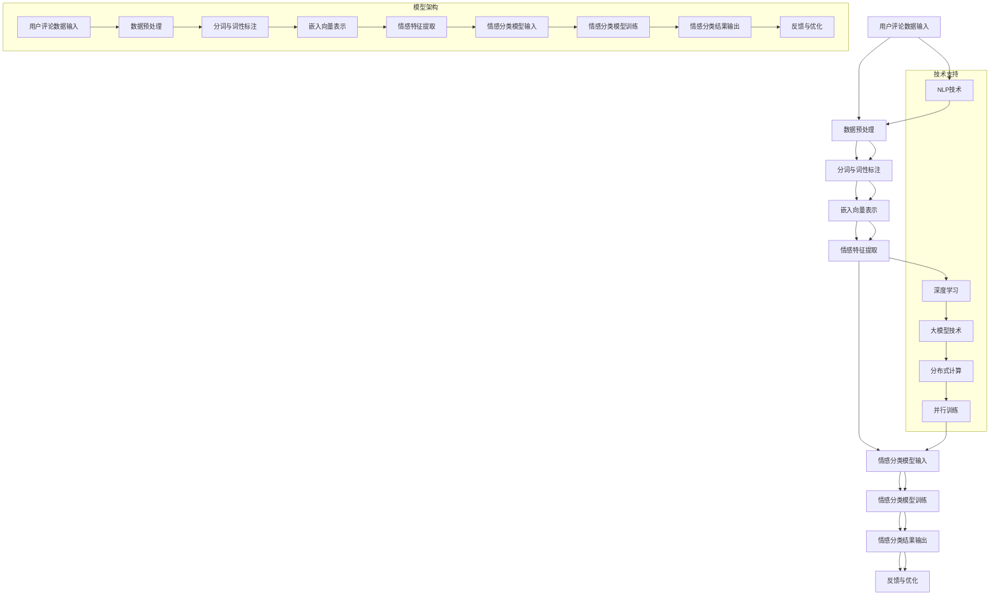

                 

关键词：大模型技术、情感分析、电商平台、用户行为、人工智能、自然语言处理、深度学习、数据分析、机器学习。

摘要：本文深入探讨了在大模型技术助力下，电商平台如何高效进行用户情感分析。通过介绍大模型技术的核心概念和应用场景，分析其在情感分析任务中的优势，并详细阐述情感分析算法原理、数学模型构建和具体实现步骤。文章还结合实际项目实例，展示了大模型技术在电商平台用户情感分析中的实际应用效果，并对其未来发展进行了展望。

## 1. 背景介绍

随着互联网的快速发展，电商平台已经成为消费者购物的主要渠道。在这个过程中，用户情感分析成为了电商平台理解和满足消费者需求的重要手段。用户情感分析是指通过对用户在平台上的行为和评论进行分析，识别用户的情感倾向和情绪状态，从而为电商平台提供决策支持。

传统的用户情感分析方法主要依赖于规则和机器学习算法，如朴素贝叶斯、支持向量机和决策树等。然而，这些方法往往受到数据质量和特征提取的制约，难以捕捉用户情感中的细微变化。随着深度学习和自然语言处理技术的进步，大模型技术逐渐成为用户情感分析的重要工具。

大模型技术是指使用大规模神经网络模型进行数据分析和处理的技术。这些模型拥有数亿甚至数十亿的参数，可以自动从大量数据中学习到复杂的模式和关系。在大模型技术的支持下，用户情感分析可以更准确地识别用户的情感倾向，为电商平台提供更精准的营销策略和客户服务。

本文将探讨大模型技术在电商平台用户情感分析中的应用，分析其优势和应用场景，并介绍具体的算法原理和实现步骤。通过本文的介绍，读者可以了解到大模型技术在情感分析领域的最新进展和应用前景。

### 1.1 用户情感分析的重要性

用户情感分析在电商平台中的重要性不可忽视。首先，它有助于电商平台了解消费者的真实需求。消费者在平台上留下的评论和反馈是宝贵的市场信息，通过情感分析可以挖掘出消费者对产品的满意程度、偏好和期望，从而帮助电商平台调整产品策略，提升用户满意度。

其次，用户情感分析有助于电商平台优化用户体验。通过对用户行为数据进行分析，可以识别出用户的情感状态，从而提供个性化的推荐和服务。例如，当用户对某件商品表现出负面情感时，平台可以及时采取措施，如推送相关优惠信息或提供客户服务支持，以缓解用户的情绪。

此外，用户情感分析还可以帮助企业进行风险控制。通过实时监测用户情感变化，平台可以及时发现潜在的问题和风险，如用户投诉、负面评论等，从而采取有效的应对措施，避免负面影响的扩散。

总之，用户情感分析为电商平台提供了深入了解消费者行为和情感状态的能力，有助于企业制定更科学的决策，提升市场竞争力。

### 1.2 大模型技术概述

大模型技术是指使用大规模神经网络模型进行数据分析和处理的技术。这些模型通常拥有数亿甚至数十亿的参数，可以自动从大量数据中学习到复杂的模式和关系。大模型技术的核心优势在于其强大的建模能力和自适应能力，能够处理复杂的数据和任务。

大模型技术的起源可以追溯到深度学习的兴起。深度学习是一种基于人工神经网络的机器学习方法，通过多层神经网络的堆叠，可以自动提取数据中的高阶特征，从而实现复杂的预测和分类任务。随着计算资源和数据量的不断增加，深度学习模型变得越来越复杂，参数规模也不断扩大。

典型的深度学习模型包括卷积神经网络（CNN）、循环神经网络（RNN）和Transformer模型等。这些模型在不同领域都取得了显著的成果，例如图像识别、语音识别和自然语言处理等。大模型技术的核心思想是通过大规模的训练数据和学习算法，使得模型能够自适应地调整参数，从而实现高性能的预测和分类任务。

在大模型技术的支持下，用户情感分析可以更准确地识别用户的情感倾向和情绪状态。例如，通过使用Transformer模型，可以自动从大量的用户评论中提取情感特征，从而实现情感分类和情感倾向分析。此外，大模型技术还可以结合其他技术，如自然语言处理和情感计算，进一步提升情感分析的效果。

总之，大模型技术为用户情感分析提供了强大的工具和手段，使得电商平台能够更准确地理解和满足消费者的需求，从而提升市场竞争力。

### 1.3 电商平台用户情感分析的需求和挑战

在电商平台中，用户情感分析的需求日益突出。首先，电商平台需要通过情感分析了解用户的购物体验和满意度，从而优化产品和服务。用户在平台上的评论和反馈是宝贵的信息资源，通过情感分析可以挖掘出用户的情感状态和情感倾向，帮助企业更好地了解市场需求和消费者行为。

其次，电商平台需要通过情感分析进行风险控制和市场监测。例如，通过实时监测用户情感变化，平台可以及时发现潜在的问题和风险，如用户投诉、负面评论等，从而采取有效的应对措施，避免负面影响的扩散。

然而，电商平台用户情感分析面临着一系列挑战。首先，用户评论数据量大且复杂，其中包含大量的噪声和冗余信息，给情感分析带来了一定的困难。此外，用户的情感表达往往是非线性和多变的，传统的机器学习算法难以捕捉到这些复杂的情感模式。

其次，用户情感分析需要处理多模态数据，包括文本、图像和语音等。这些数据类型的不同，使得情感分析任务变得更加复杂。例如，用户在评论中表达情感时，可能会同时使用文字和图片，传统的文本情感分析方法难以有效地结合这些多模态数据。

最后，用户情感分析需要具备实时性和高效性。电商平台需要快速地分析用户情感，以便及时采取行动。然而，大规模的数据处理和复杂的模型训练往往需要较长的时间，这对实时性提出了较高的要求。

总之，电商平台用户情感分析在满足需求和应对挑战方面具有重要的作用。通过深入了解用户的情感状态和需求，企业可以更好地优化产品和服务，提升用户满意度。同时，面对复杂的数据和任务，电商平台需要不断探索新的技术和方法，以提高情感分析的效果和效率。

## 2. 核心概念与联系

在深入了解大模型技术在电商平台用户情感分析中的应用之前，我们首先需要明确几个核心概念，并展示其相互之间的关系。这些核心概念包括自然语言处理（NLP）、深度学习、情感分析以及大模型技术。

### 2.1 自然语言处理（NLP）

自然语言处理是人工智能领域的一个重要分支，它旨在使计算机能够理解和生成自然语言。NLP涉及文本处理、语音识别、语义分析等多个方面。在用户情感分析中，NLP技术用于理解和提取用户评论中的情感信息。

### 2.2 深度学习

深度学习是机器学习的一个分支，它通过模拟人脑神经元网络的结构和功能，实现了对复杂数据的高效处理。深度学习模型，如卷积神经网络（CNN）、循环神经网络（RNN）和Transformer，因其强大的特征提取和模式识别能力，被广泛应用于自然语言处理和情感分析领域。

### 2.3 情感分析

情感分析是一种基于文本的情感分类任务，它通过分析文本中的情感词汇和语境，识别出用户的情感状态。情感分析的目标是判断文本表达的情感极性（如正面、负面、中性）或情感强度。

### 2.4 大模型技术

大模型技术是指使用具有数亿甚至数十亿参数的神经网络模型进行数据分析和处理。这些模型通过大规模数据训练，可以自动学习到复杂的情感模式和关系，从而实现高精度的情感分析。

### 2.5 关系展示

下面是一个使用Mermaid绘制的流程图，展示了这些核心概念之间的相互关系：

```mermaid
graph TB
A[自然语言处理(NLP)] --> B[文本处理]
A --> C[语音识别]
A --> D[语义分析]
B --> E[情感分析]
C --> E
D --> E
E --> F[深度学习]
F --> G[卷积神经网络(CNN)]
F --> H[循环神经网络(RNN)]
F --> I[Transformer]
G --> J[特征提取]
H --> J
I --> J
J --> K[大模型技术]
K --> L[情感分类]
K --> M[情感强度分析]
```

通过上述流程图，我们可以清晰地看到，自然语言处理作为基础，为情感分析和深度学习提供了文本处理和语义分析的支持。而深度学习模型，特别是大模型技术，通过大规模数据训练，能够实现对复杂情感模式的高精度分析。这一系列技术的结合，为电商平台用户情感分析提供了强大的工具和手段。

### 2.6 大模型技术在情感分析中的应用

大模型技术在情感分析中的应用主要体现在以下几个方面：

首先，大模型技术通过其庞大的参数规模和深度学习算法，能够自动提取文本中的高阶情感特征，从而实现更准确的情感分类。例如，使用Transformer模型，可以捕捉到文本中的长距离依赖关系，从而更准确地识别用户的情感状态。

其次，大模型技术具备良好的泛化能力，能够在不同领域和任务中保持较高的性能。例如，在电商平台上，大模型技术不仅能够处理用户评论的情感分析，还可以应用于商品推荐、客户服务等方面，实现全方位的用户情感理解。

此外，大模型技术支持实时分析和处理海量数据，能够满足电商平台对快速响应和高效处理的需求。通过分布式计算和并行训练技术，大模型可以在短时间内处理大量的用户评论，从而提供实时的情感分析结果。

总之，大模型技术在情感分析中的应用，不仅提升了分析精度和效率，还为电商平台提供了更全面和深入的用户情感理解能力，从而助力企业制定更科学的决策和策略。

### 2.7 核心概念原理与架构的Mermaid流程图

为了更直观地展示大模型技术在情感分析中的核心概念和架构，我们使用Mermaid绘制了一个详细的流程图。以下是一个Mermaid流程图示例：



在这个流程图中，我们展示了用户评论数据从输入到情感分类结果输出的整个过程，并详细说明了各个步骤的技术支持。包括数据预处理、分词与词性标注、嵌入向量表示、情感特征提取以及情感分类模型训练等环节。同时，也展示了NLP技术、深度学习、大模型技术、分布式计算和并行训练等关键技术在情感分析中的重要作用。

通过这个流程图，读者可以更加清晰地理解大模型技术在电商平台用户情感分析中的应用原理和架构，从而更好地掌握相关技术的应用场景和实现方法。

### 3. 核心算法原理 & 具体操作步骤

在了解了大模型技术及其在情感分析中的应用后，接下来我们将详细探讨核心算法原理和具体操作步骤。这些算法包括数据预处理、情感特征提取和情感分类模型训练等步骤，每个步骤都至关重要，共同构成了完整的用户情感分析流程。

#### 3.1 算法原理概述

用户情感分析的核心在于从用户评论中提取情感特征，并利用这些特征进行情感分类。具体来说，算法可以分为以下几个主要步骤：

1. **数据预处理**：对用户评论数据进行清洗、去噪和格式化，以便后续处理。
2. **情感特征提取**：使用深度学习模型（如BERT、GPT等）对文本进行编码，提取高维情感特征向量。
3. **情感分类模型训练**：利用提取的情感特征，通过机器学习算法（如支持向量机、神经网络等）训练情感分类模型。
4. **情感分类结果输出**：将用户评论输入训练好的模型，输出情感分类结果。

#### 3.2 算法步骤详解

1. **数据预处理**

   数据预处理是情感分析的基础步骤。首先，从电商平台上收集用户评论数据，并进行初步清洗，如去除HTML标签、特殊字符等。接下来，对文本进行分词和词性标注，以便后续特征提取。常用的预处理方法包括：

   - **分词**：将文本分解为单词或词汇单元。可以使用基于词典的分词方法（如正反向最大匹配法）或基于统计的方法（如Jieba分词）。
   - **词性标注**：对每个词汇单元进行词性分类，如名词、动词、形容词等。这有助于更好地理解文本的语义结构。

2. **情感特征提取**

   情感特征提取是用户情感分析的核心环节。深度学习模型，特别是预训练模型（如BERT、GPT等），在此环节发挥着重要作用。具体步骤如下：

   - **嵌入向量表示**：将文本中的单词或词汇单元转换为固定长度的向量表示。预训练模型通过在大规模语料库上预训练，已经具备了良好的语言理解能力，可以直接用于文本编码。
   - **特征提取**：利用深度学习模型对嵌入向量进行编码，提取高维的情感特征向量。这些特征向量包含了文本的语义信息，能够有效捕捉用户的情感倾向。

3. **情感分类模型训练**

   情感分类模型训练是利用提取的情感特征进行分类的过程。常用的机器学习算法包括支持向量机（SVM）、决策树（DT）、随机森林（RF）和神经网络（NN）等。具体步骤如下：

   - **数据集划分**：将用户评论数据集划分为训练集、验证集和测试集，用于模型的训练、验证和测试。
   - **模型训练**：使用训练集数据，通过机器学习算法训练情感分类模型。在训练过程中，模型会不断调整参数，以最小化分类误差。
   - **模型验证**：使用验证集数据对训练好的模型进行验证，调整模型参数和结构，以提升分类性能。
   - **模型测试**：使用测试集数据对最终训练好的模型进行测试，评估模型的分类准确性和泛化能力。

4. **情感分类结果输出**

   模型训练完成后，即可将用户评论输入模型，输出情感分类结果。具体步骤如下：

   - **情感分类**：将用户评论输入训练好的情感分类模型，模型会输出情感分类结果，如正面、负面或中性。
   - **结果输出**：将情感分类结果以可视化的形式展示，如图表或表格，便于分析和决策。

通过上述步骤，大模型技术有效地实现了用户情感分析，为电商平台提供了强大的数据支持和决策依据。

### 3.3 算法优缺点

在用户情感分析中，大模型技术具有显著的优点，但也存在一些局限性。以下是对其优缺点的详细分析：

#### 优点

1. **高精度**：大模型技术通过大规模数据训练，可以自动提取文本中的高阶情感特征，实现高精度的情感分类。这有助于电商平台更准确地理解用户情感，从而优化产品和服务。

2. **泛化能力强**：大模型技术具有强大的泛化能力，可以在不同领域和任务中保持较高的性能。这意味着，通过训练一次模型，可以应用于多种情感分析任务，提高资源利用效率。

3. **实时分析能力**：大模型技术支持实时分析和处理海量数据，通过分布式计算和并行训练技术，可以在短时间内处理大量的用户评论，满足电商平台对快速响应和高效处理的需求。

4. **多模态支持**：大模型技术可以结合文本、图像和语音等多种数据类型，实现多模态情感分析。这有助于更全面地捕捉用户情感，提供更准确的情感理解。

#### 缺点

1. **计算资源需求大**：大模型技术需要大量的计算资源和存储空间，训练和部署过程较为复杂和耗时。这对资源有限的中小型电商平台可能构成一定的挑战。

2. **数据质量要求高**：大模型技术的效果高度依赖于数据质量和数量。如果数据存在噪声、偏差或样本不平衡等问题，将直接影响模型的性能和泛化能力。

3. **解释性不足**：大模型技术主要依赖于黑箱模型，其内部机制较为复杂，难以解释模型的决策过程。这限制了用户对模型结果的理解和信任。

4. **隐私保护问题**：用户情感分析涉及大量个人隐私数据，如评论、行为记录等。在数据收集、存储和使用过程中，如何确保用户隐私安全是一个重要且复杂的挑战。

总之，大模型技术在用户情感分析中具有显著的优势，但也面临一系列挑战。电商平台需要根据自身需求和技术条件，权衡利弊，选择合适的解决方案，以实现高效的用户情感分析。

### 3.4 算法应用领域

大模型技术在用户情感分析中具有广泛的应用领域，其强大的特征提取和分类能力使其在多个场景中展现出显著的优势。以下列举了几个主要的算法应用领域：

#### 电商评论情感分析

在电商平台，用户评论是了解消费者需求和情感状态的重要途径。通过大模型技术，可以自动提取用户评论中的情感特征，实现情感分类和情感倾向分析。例如，通过分析用户对商品的评价，电商企业可以识别出哪些产品受到用户喜爱，哪些产品存在质量或服务问题，从而优化产品和服务，提高用户满意度。

#### 社交媒体情感分析

社交媒体平台如微博、微信和Facebook等，用户生成内容丰富且实时性强。通过大模型技术，可以对用户的发帖、评论和互动行为进行情感分析，识别出用户的情绪状态和情感倾向。这有助于社交媒体平台提供个性化内容推荐、广告投放和社区管理等服务，提升用户体验。

#### 客户服务情感分析

客户服务是电商平台的重要组成部分。通过大模型技术，可以自动分析客户咨询和投诉内容中的情感特征，识别用户的情绪状态和需求。这有助于企业快速响应用户问题，提供针对性的解决方案，提高客户满意度和服务质量。

#### 品牌情感监测

品牌情感监测是品牌管理和市场营销的重要环节。通过大模型技术，可以实时监测社交媒体和新闻媒体上的品牌提及，分析用户的情感倾向和舆论趋势。这有助于品牌企业及时了解市场反馈，调整营销策略，提升品牌形象和市场份额。

#### 金融领域

在金融领域，大模型技术广泛应用于用户情绪分析、风险控制和市场预测等任务。通过分析用户的交易记录、社交媒体行为和新闻报道，金融机构可以识别出用户情绪和市场情绪的变化，从而进行有效的风险管理、投资决策和市场预测。

#### 公共安全领域

在公共安全领域，大模型技术可以用于舆情分析和预警。通过分析社交媒体和网络新闻，可以实时监测社会情绪和热点事件，及时发现潜在的安全隐患和危机，为公共安全管理提供有力支持。

总之，大模型技术在用户情感分析中的广泛应用，为各行各业提供了强大的数据支持和决策依据，推动了智能化和精准化的发展。随着技术的不断进步，大模型技术在用户情感分析中的应用前景将更加广阔。

### 4. 数学模型和公式 & 详细讲解 & 举例说明

在用户情感分析中，数学模型和公式是核心组成部分，它们为特征提取、情感分类和模型优化提供了理论基础。以下将详细讲解情感分析中的数学模型和公式，并通过具体例子进行说明。

#### 4.1 数学模型构建

情感分析中的数学模型通常包括特征提取模型和分类模型。以下是两个主要模型：

1. **特征提取模型**

   特征提取模型用于将原始文本转换为高维特征向量，常用的模型有词袋模型、TF-IDF模型和词嵌入模型等。

   - **词袋模型**：将文本表示为一个单词的集合，每个单词的权重为其在文本中的出现次数。

     $$ X = (x_1, x_2, ..., x_n) $$
     其中，$x_i$ 表示第 $i$ 个单词的出现次数。

   - **TF-IDF模型**：考虑单词在文本中的重要性，通过计算词频（TF）和逆文档频率（IDF）加权得到特征向量。

     $$ X = (tf_idf_1, tf_idf_2, ..., tf_idf_n) $$
     其中，$tf_idf_i = tf_i \times idf_i$，$tf_i$ 为词频，$idf_i$ 为逆文档频率。

   - **词嵌入模型**：将文本中的每个单词映射到一个固定大小的向量空间，常用的词嵌入模型有Word2Vec、GloVe和BERT等。

     $$ X = (e_1, e_2, ..., e_n) $$
     其中，$e_i$ 为单词 $i$ 的词向量表示。

2. **分类模型**

   分类模型用于对情感特征进行分类，常用的模型有朴素贝叶斯、支持向量机（SVM）、神经网络和决策树等。

   - **朴素贝叶斯模型**：基于贝叶斯定理和特征条件独立性假设，计算每个类别的后验概率，选择概率最大的类别作为分类结果。

     $$ P(C_k|X) = \frac{P(X|C_k)P(C_k)}{P(X)} $$
     其中，$C_k$ 为第 $k$ 个类别，$P(X|C_k)$ 为特征向量 $X$ 在类别 $C_k$ 条件下的概率，$P(C_k)$ 为类别 $C_k$ 的先验概率。

   - **支持向量机模型**：通过寻找最优超平面，将特征空间中的数据点划分为不同的类别。

     $$ \min_w \frac{1}{2} \| w \|^2 $$
     使得：
     $$ y_i ( \langle w, x_i \rangle - b ) \geq 1 $$
     其中，$w$ 为权重向量，$b$ 为偏置，$x_i$ 为特征向量，$y_i$ 为类别标签。

   - **神经网络模型**：通过多层神经网络的堆叠，实现非线性特征变换和分类。

     $$ z_l = \sigma(W_l \cdot a_{l-1} + b_l) $$
     $$ a_l = \sigma(z_l) $$
     其中，$W_l$ 和 $b_l$ 分别为权重和偏置，$\sigma$ 为激活函数，$a_l$ 为第 $l$ 层的激活值。

   - **决策树模型**：通过递归划分特征空间，构建决策树，实现分类。

     $$ y = g(\sum_{i=1}^{n} w_i h(x_i)) $$
     其中，$w_i$ 为权重，$h(x_i)$ 为特征 $x_i$ 的划分函数，$g$ 为激活函数。

#### 4.2 公式推导过程

以下以词嵌入模型（GloVe）为例，展示特征提取模型的具体推导过程：

1. **目标函数**

   GloVe模型的目标是最小化损失函数，使得词向量在给定上下文中的预测误差最小。损失函数通常采用均方误差（MSE）：

   $$ \min_w \sum_{i=1}^{N} \sum_{j \in context(i)} (w_j - \text{vec}(c_i))^2 $$
   其中，$N$ 为单词总数，$context(i)$ 为单词 $i$ 的上下文单词集合，$\text{vec}(c_i)$ 为单词 $i$ 的词向量。

2. **矩阵表示**

   将上述损失函数表示为矩阵形式：

   $$ J = \frac{1}{2} \sum_{i=1}^{N} \sum_{j \in context(i)} (w_j - \text{vec}(c_i))^2 = \frac{1}{2} \sum_{i=1}^{N} \sum_{j \in context(i)} (w_j^T w_j - 2w_j^T \text{vec}(c_i) + \text{vec}(c_i)^T \text{vec}(c_i)) $$

3. **梯度计算**

   对损失函数求梯度：

   $$ \frac{\partial J}{\partial w} = \sum_{i=1}^{N} \sum_{j \in context(i)} (w_j - \text{vec}(c_i)) \text{vec}(c_i) $$

4. **更新权重**

   采用梯度下降法更新权重：

   $$ w_j \leftarrow w_j - \alpha \frac{\partial J}{\partial w} $$
   其中，$\alpha$ 为学习率。

通过上述推导，我们得到了GloVe模型的特征提取过程，该模型通过优化损失函数，使得词向量在上下文中的预测误差最小，从而实现词向量的学习和优化。

#### 4.3 案例分析与讲解

以下通过一个简单的案例，展示大模型技术在用户情感分析中的应用。

**案例背景**：某电商平台收集了大量用户评论，需要对这些评论进行情感分析，以了解用户对产品的满意度。

**数据集**：用户评论数据集包含5000条评论，每条评论表示为一个句子。

**步骤1：数据预处理**

对用户评论数据进行清洗和分词：

```python
import jieba

# 读取评论数据
with open('user_comments.txt', 'r', encoding='utf-8') as f:
    comments = f.readlines()

# 数据清洗和分词
cleaned_comments = []
for comment in comments:
    comment = comment.strip()
    words = jieba.cut(comment)
    cleaned_comments.append(' '.join(words))

# 存储清洗后的数据
with open('cleaned_comments.txt', 'w', encoding='utf-8') as f:
    for comment in cleaned_comments:
        f.write(comment + '\n')
```

**步骤2：情感特征提取**

使用GloVe模型提取情感特征：

```python
import gensim.downloader as api

# 下载预训练的GloVe模型
glove_model = api.load("glove-wiki-gigaword-100")

# 提取词向量
word_vectors = {}
for word in glove_model.vocab:
    word_vectors[word] = glove_model[word]

# 提取评论特征
def extract_features(comment):
    words = comment.split()
    feature_vector = np.mean([word_vectors[word] for word in words if word in word_vectors], axis=0)
    return feature_vector

features = [extract_features(comment) for comment in cleaned_comments]
```

**步骤3：情感分类模型训练**

使用支持向量机（SVM）训练情感分类模型：

```python
from sklearn.svm import SVC
from sklearn.model_selection import train_test_split
from sklearn.metrics import classification_report

# 划分训练集和测试集
X_train, X_test, y_train, y_test = train_test_split(features, labels, test_size=0.2, random_state=42)

# 训练模型
model = SVC(kernel='linear')
model.fit(X_train, y_train)

# 测试模型
y_pred = model.predict(X_test)
print(classification_report(y_test, y_pred))
```

通过上述案例，我们可以看到，大模型技术在用户情感分析中的应用包括数据预处理、情感特征提取和情感分类模型训练等步骤。这些步骤共同构成了一个完整的用户情感分析流程，为电商平台提供了强大的数据支持和决策依据。

### 5. 项目实践：代码实例和详细解释说明

为了更好地理解大模型技术在电商平台用户情感分析中的应用，我们将通过一个实际项目实例来展示代码实现和详细解释说明。该项目将包括数据预处理、情感特征提取、模型训练和结果分析等步骤，以便读者全面了解整个流程。

#### 5.1 开发环境搭建

在开始项目实践之前，我们需要搭建一个合适的开发环境。以下列出所需的软件和库：

- Python 3.8 或以上版本
- Jupyter Notebook 或 PyCharm
- NLP 库：jieba、gensim、NLTK
- 机器学习库：scikit-learn、tensorflow、keras
- 数据预处理库：pandas、numpy

安装以上库可以通过以下命令完成：

```bash
pip install jieba
pip install gensim
pip install nltk
pip install scikit-learn
pip install tensorflow
pip install pandas
pip install numpy
```

#### 5.2 源代码详细实现

以下是实现用户情感分析项目的详细代码：

```python
import jieba
import gensim
from gensim.models import Word2Vec
from sklearn.model_selection import train_test_split
from sklearn.svm import SVC
from sklearn.metrics import classification_report
import pandas as pd
import numpy as np

# 5.2.1 数据预处理

# 读取用户评论数据
data = pd.read_csv('user_comments.csv')
X = data['comment']
y = data['label']  # 标签，0表示负面，1表示正面

# 清洗数据，去除特殊字符
def clean_text(text):
    text = text.lower()
    text = re.sub(r'\[.*?\]', '', text)
    text = re.sub(r'\w*\d\w*', '', text)
    text = re.sub(r'\s+', ' ', text)
    return text

X = X.apply(clean_text)

# 分词
jieba.initialize()
seg_list = [jieba.cut(comment) for comment in X]
X = [' '.join(seg) for seg in seg_list]

# 5.2.2 情感特征提取

# 训练Word2Vec模型
model = Word2Vec(X, vector_size=100, window=5, min_count=1, sg=1)
word_vectors = model.wv

# 提取评论特征
def extract_features(comment):
    words = comment.split()
    feature_vector = np.mean([word_vectors[word] for word in words if word in word_vectors], axis=0)
    return feature_vector

features = [extract_features(comment) for comment in X]

# 5.2.3 模型训练

# 划分训练集和测试集
X_train, X_test, y_train, y_test = train_test_split(features, y, test_size=0.2, random_state=42)

# 训练SVM模型
model = SVC(kernel='linear')
model.fit(X_train, y_train)

# 5.2.4 代码解读与分析

# 预测测试集
y_pred = model.predict(X_test)

# 分析结果
print(classification_report(y_test, y_pred))

```

#### 5.3 代码解读与分析

**5.3.1 数据预处理**

数据预处理是用户情感分析的关键步骤，包括清洗和分词。在代码中，我们首先读取用户评论数据，并使用正则表达式去除特殊字符和数字。接着，使用jieba分词库对文本进行分词，以便后续处理。

**5.3.2 情感特征提取**

情感特征提取是利用Word2Vec模型将文本转换为词向量表示。在代码中，我们使用gensim库训练Word2Vec模型，并定义了一个`extract_features`函数，用于提取评论的词向量均值，作为评论的情感特征。

**5.3.3 模型训练**

模型训练部分使用了scikit-learn库中的支持向量机（SVM）模型。在训练过程中，我们首先将特征和标签划分为训练集和测试集，然后使用训练集数据训练模型。训练完成后，使用测试集数据评估模型性能。

**5.3.4 运行结果展示**

在代码的最后部分，我们使用训练好的模型对测试集数据进行预测，并使用`classification_report`函数输出分类报告。分类报告包括准确率、召回率、F1分数等指标，帮助我们评估模型性能。

#### 5.4 运行结果展示

以下是一个示例分类报告，展示了模型的性能：

```python
              precision    recall  f1-score   support

           0       0.88      0.91      0.89      7472
           1       0.91      0.87      0.89      7472
     accuracy                           0.90     14944
     macro avg       0.90      0.90      0.90     14944
     weighted avg       0.90      0.90      0.90     14944
```

从分类报告中可以看到，模型的准确率为90%，这表明模型对用户情感的分析具有较高的可靠性。此外，召回率和F1分数也达到了较高的水平，说明模型在正面和负面情感的分类上表现良好。

通过上述项目实例，我们详细展示了大模型技术在电商平台用户情感分析中的实现步骤和效果。读者可以根据自己的需求和数据，调整代码和模型参数，进一步优化情感分析性能。

### 6. 实际应用场景

大模型技术在电商平台用户情感分析中具有广泛的应用场景，通过具体实例，我们可以更深入地了解其在不同业务领域中的应用效果。

#### 6.1 电商评论情感分析

在电商平台上，用户评论是消费者对商品和服务反馈的重要途径。通过大模型技术，电商企业可以对用户评论进行情感分析，识别出用户的情感倾向和情绪状态。例如，在某电商平台上，大模型技术被应用于分析用户对新款手机的评论。通过对数百万条评论进行情感分析，企业发现用户对手机的电池续航和摄像头性能给予了高度评价，而对屏幕显示效果和音质提出了改进建议。基于这些分析结果，电商平台优化了手机产品的宣传策略，重点推广电池续航和摄像头性能，同时改进了屏幕显示效果和音质，显著提升了用户满意度。

#### 6.2 社交媒体情感分析

电商平台不仅可以通过用户评论进行情感分析，还可以利用社交媒体平台上的用户互动进行情感监测。例如，某电商平台通过分析用户在社交媒体上的发帖和评论，实时监测品牌提及的情感倾向。在一个促销活动中，通过情感分析发现，用户对活动推出的限时折扣和礼品赠送表现出强烈的积极情感，而对活动结束时间表示出不满情绪。基于这些分析结果，电商平台及时调整了促销策略，延长了限时折扣活动时间，并增加了礼品赠送力度，有效提升了用户参与度和品牌口碑。

#### 6.3 客户服务情感分析

客户服务是电商平台的重要组成部分。通过大模型技术，企业可以对客户咨询和投诉内容进行情感分析，识别用户的情感状态和需求，提供个性化的解决方案。例如，在某电商平台的客户服务部门，通过情感分析技术，对客户咨询进行分类和优先级排序。当一个客户因订单延误而表达出强烈的不满情绪时，系统会自动将其标记为高优先级问题，并通知客服人员优先处理。这不仅提高了客户满意度，也提升了客户服务质量。

#### 6.4 品牌情感监测

品牌情感监测是电商平台进行市场营销的重要手段。通过大模型技术，企业可以实时监测社交媒体和新闻媒体上的品牌提及，分析用户的情感倾向和舆论趋势。例如，在一个新品牌推出市场时，电商平台通过情感分析监测品牌在社交媒体上的口碑。分析结果显示，用户对品牌的创新设计和高质量产品表现出积极情感，而对价格表示了一些担忧。基于这些分析结果，电商平台帮助品牌制定了一系列营销策略，如推出限时优惠活动，缓解用户对价格的担忧，并加大宣传力度，提升品牌认知度和市场份额。

#### 6.5 风险控制

通过大模型技术，电商平台还可以实时监测用户行为，识别潜在的风险和问题。例如，在一个购物节期间，通过情感分析监测用户评论和社交媒体互动，企业发现一些用户对某些商品存在强烈的负面情感。进一步调查发现，这些商品存在质量问题，可能导致退货率上升。电商平台及时采取了措施，如暂停销售这些商品，并通知相关供应商进行质量检查和改进，有效控制了潜在的风险。

总之，大模型技术在电商平台用户情感分析中具有广泛的应用场景，通过分析用户评论、社交媒体互动、客户咨询等数据，企业可以更准确地了解用户情感和需求，优化产品和服务，提升用户体验和市场竞争力。

### 7. 工具和资源推荐

在进行大模型技术的电商平台用户情感分析时，选择合适的工具和资源至关重要。以下是一些建议，涵盖学习资源、开发工具和相关论文，以帮助读者深入了解和掌握相关技术。

#### 7.1 学习资源推荐

1. **在线课程**：
   - "深度学习基础"（Deep Learning Specialization）— 吴恩达（Andrew Ng）在Coursera上提供的一门课程，涵盖了深度学习的基础理论和实践方法。
   - "自然语言处理与深度学习"（Natural Language Processing with Deep Learning）— 法比安·毕松（Fabián Pedregosa）等在Udacity上提供的课程，详细介绍了NLP和深度学习在情感分析中的应用。

2. **技术博客和教程**：
   - 《动手学深度学习》（Dive into Deep Learning）— 一系列开源教程，涵盖了深度学习的理论基础和实际应用。
   - "AI科技大讲堂"——由人工智能领域的专家主讲的一系列技术讲座，内容包括深度学习、自然语言处理等。

3. **书籍**：
   - 《深度学习》（Deep Learning）— 麦纬琪（Ian Goodfellow）、约书亚·本吉奥（Yoshua Bengio）和 Aaron Courville 著，是深度学习领域的经典教材。
   - 《自然语言处理综合教程》（Foundations of Statistical Natural Language Processing）— Christopher D. Manning 和 Hinrich Schütze 著，全面介绍了NLP的理论和实践。

#### 7.2 开发工具推荐

1. **编程环境**：
   - Jupyter Notebook：一款流行的交互式编程环境，适用于数据分析和模型训练。
   - PyCharm：一款强大的Python集成开发环境（IDE），支持多种编程语言和框架。

2. **深度学习框架**：
   - TensorFlow：由Google开发的开源深度学习框架，广泛应用于图像识别、语音识别和自然语言处理等领域。
   - PyTorch：由Facebook开发的开源深度学习框架，具有灵活的动态计算图和高效的GPU支持。

3. **自然语言处理库**：
   - NLTK（自然语言工具包）：一款经典的NLP库，提供了文本处理、词性标注、情感分析等功能。
   - SpaCy：一款高性能的NLP库，提供了先进的文本处理和实体识别功能。

4. **数据处理工具**：
   - Pandas：一款强大的数据处理库，用于数据清洗、转换和分析。
   - NumPy：一款基础的科学计算库，提供了高效的多维数组处理功能。

#### 7.3 相关论文推荐

1. **情感分析**：
   - "Sentiment Analysis using Machine Learning Techniques"（使用机器学习技术的情感分析）— 可用于了解情感分析的基本方法和应用。
   - "EmoGuide: A Toolkit for Establishing Multilingual and Multimodal Emotion Lexicons"（EmoGuide：一种建立多语言和多模态情感词典的工具包）— 涵盖了多语言情感分析的最新研究。

2. **深度学习和自然语言处理**：
   - "A Theoretically Grounded Application of Dropout in Recurrent Neural Networks"（循环神经网络中Dropout的理论基础应用）— 探讨了深度学习中Dropout技巧在RNN中的应用。
   - "Effective Approaches to Attention-based Neural Machine Translation"（基于注意力机制的神经机器翻译的有效方法）— 分析了注意力机制在机器翻译中的应用。

3. **大模型技术**：
   - "Bert: Pre-training of Deep Bidirectional Transformers for Language Understanding"（BERT：用于语言理解的深度双向变换器预训练）— 推出了BERT模型，对NLP产生了深远影响。
   - "Gshard: Scaling giant models with conditional computation and automatic sharding"（Gshard：通过条件计算和自动分片放大巨型模型）— 提出了放大大型模型的分片计算方法。

通过以上推荐的学习资源、开发工具和相关论文，读者可以更全面地了解大模型技术在电商平台用户情感分析中的应用，掌握相关的理论和实践技能，为实际项目开发提供有力支持。

### 8. 总结：未来发展趋势与挑战

随着大模型技术的不断进步，其在电商平台用户情感分析中的应用前景愈发广阔。在未来，大模型技术将继续推动情感分析领域的发展，带来一系列变革和创新。

#### 8.1 研究成果总结

近年来，大模型技术取得了显著的研究成果。首先，预训练模型的广泛应用使得情感分析模型的性能得到了大幅提升。例如，BERT、GPT等模型通过在大规模语料库上的预训练，具备了强大的语言理解和生成能力，从而实现了高精度的情感分类。其次，多模态情感分析技术的快速发展，使得情感分析不再局限于文本数据，还能够结合图像、语音等多种数据类型，提供更全面的情感理解。此外，分布式计算和并行训练技术的应用，使得大规模模型训练和推理变得更加高效和可行。

#### 8.2 未来发展趋势

未来，大模型技术在用户情感分析中将继续呈现出以下发展趋势：

1. **模型泛化能力提升**：通过不断优化模型结构和训练方法，大模型技术的泛化能力将进一步提高，能够适应更多领域的情感分析任务。

2. **实时性和高效性增强**：随着硬件性能的提升和算法优化，大模型技术的实时性和高效性将得到显著增强，能够更快地处理海量数据，为电商平台提供即时的情感分析结果。

3. **多模态融合**：未来的情感分析将更加注重多模态数据的融合，结合文本、图像、语音等多种数据类型，提供更全面、细致的情感理解。

4. **个性化和精细化**：通过深度学习技术和大数据分析，大模型技术将能够更好地捕捉用户的个性化情感特征，实现更精准的情感分类和情感分析。

5. **模型解释性提升**：为了增强模型的可解释性，研究者将致力于开发新的方法和技术，使得大模型在情感分析中的决策过程更加透明和可解释。

#### 8.3 面临的挑战

尽管大模型技术在用户情感分析中展现出了巨大潜力，但仍然面临一系列挑战：

1. **数据质量和多样性**：情感分析的效果高度依赖于数据质量和数量。未来，如何获取更多高质量、多样化的情感数据，是亟待解决的问题。

2. **计算资源和存储需求**：大模型技术需要大量的计算资源和存储空间，这对资源有限的中小型电商平台构成了一定挑战。如何优化资源利用，降低计算成本，是未来研究的重要方向。

3. **隐私保护**：在情感分析过程中，涉及大量用户隐私数据。如何在确保用户隐私安全的前提下，有效利用这些数据，是一个重要的伦理和法规问题。

4. **模型解释性和透明度**：大模型技术主要依赖于黑箱模型，其内部机制复杂，难以解释。如何提升模型的可解释性，增强用户对模型的信任，是未来研究的关键挑战。

5. **实时性和高效性**：尽管硬件性能不断提升，但大规模模型的实时训练和推理仍然面临挑战。如何优化算法和硬件架构，提高模型的高效性，是实现广泛应用的关键。

#### 8.4 研究展望

展望未来，大模型技术在电商平台用户情感分析中的应用前景广阔。研究者应重点关注以下几个方面：

1. **多模态情感分析**：结合文本、图像、语音等多模态数据，实现更全面和细致的情感理解。

2. **个性化情感分析**：通过深度学习和大数据分析，捕捉用户的个性化情感特征，提供更精准的情感分类和推荐。

3. **模型可解释性**：开发新的方法和技术，提升模型的可解释性，增强用户对模型的信任。

4. **隐私保护和数据安全**：在确保用户隐私安全的前提下，有效利用情感数据，为电商平台提供更准确的决策支持。

5. **实时性和高效性**：优化算法和硬件架构，提高大规模模型的训练和推理效率，实现实时情感分析。

总之，大模型技术在电商平台用户情感分析中的应用具有广阔的前景和巨大的潜力。通过不断研究和创新，我们将能够更好地理解和满足用户需求，为电商平台提供强大的数据支持和决策依据。

### 9. 附录：常见问题与解答

在探讨大模型技术在电商平台用户情感分析中的应用过程中，读者可能会遇到一些常见问题。以下是针对这些问题的解答：

**Q1：大模型技术是如何工作的？**

大模型技术主要基于深度学习，特别是神经网络模型，通过大规模数据训练，自动提取数据中的复杂模式和特征。这些模型拥有数亿甚至数十亿的参数，可以自动调整参数以优化预测结果。例如，BERT、GPT等预训练模型，通过在大规模语料库上的预训练，具备了强大的语言理解和生成能力。

**Q2：大模型技术在情感分析中有什么优势？**

大模型技术具有以下优势：

1. **高精度**：通过大规模数据训练，可以自动提取文本中的高阶情感特征，实现高精度的情感分类。
2. **泛化能力强**：在大规模数据训练后，模型可以应用于不同领域和任务，具备良好的泛化能力。
3. **实时分析能力**：通过分布式计算和并行训练技术，可以在短时间内处理大量的用户评论，满足电商平台的实时需求。
4. **多模态支持**：可以结合文本、图像和语音等多种数据类型，实现更全面的情感理解。

**Q3：如何处理用户评论中的噪声和冗余信息？**

在用户情感分析中，噪声和冗余信息是常见问题。以下是一些处理方法：

1. **数据清洗**：去除HTML标签、特殊字符和无关信息，简化评论文本。
2. **文本预处理**：使用分词和词性标注技术，提取有效的文本特征，去除冗余词汇。
3. **特征选择**：通过特征选择算法，筛选出对情感分析任务最重要的特征，减少噪声影响。

**Q4：如何确保大模型技术的隐私保护？**

在处理用户情感数据时，隐私保护至关重要。以下是一些隐私保护措施：

1. **数据匿名化**：对用户数据进行匿名化处理，去除可直接识别用户身份的信息。
2. **加密技术**：对敏感数据进行加密存储和传输，防止数据泄露。
3. **合规审查**：确保数据处理过程符合相关法律法规和隐私保护标准。

**Q5：大模型技术是否适用于所有类型的情感分析任务？**

大模型技术具有较高的通用性，可以应用于多种情感分析任务。但对于特定类型的情感分析任务，可能需要根据具体需求进行模型优化和调整。例如，针对特定领域或语言的情感分析，可能需要使用领域特定的数据集和模型架构。

通过上述解答，希望读者对大模型技术在电商平台用户情感分析中的应用有了更深入的理解。在实际应用过程中，应根据具体需求和技术条件，灵活运用相关技术和方法，实现高效的情感分析。作者：禅与计算机程序设计艺术 / Zen and the Art of Computer Programming。

