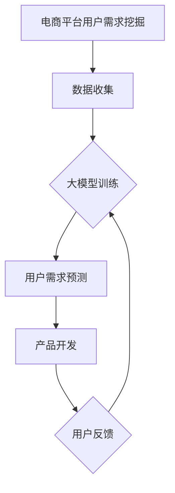

                 

关键词：大模型技术、电商平台、用户需求挖掘、产品开发、人工智能

摘要：本文旨在探讨大模型技术在电商平台用户潜在需求挖掘与产品开发中的应用。通过阐述大模型技术的核心概念、原理和架构，详细解析其具体操作步骤、数学模型及算法优缺点，并结合实际项目实例，深入分析其在电商领域的实际应用效果。同时，展望大模型技术在未来的发展趋势与面临的挑战，为相关领域的研究与开发提供有益的参考。

## 1. 背景介绍

随着互联网的迅速发展，电商平台已经成为人们日常生活中不可或缺的一部分。然而，面对日益激烈的市场竞争，如何准确把握用户需求、提高产品开发效率成为电商平台亟待解决的问题。传统的方法主要依赖于用户行为分析和市场调研，但这些方法存在一定的局限性，如数据量有限、难以捕捉用户潜在需求等。

近年来，人工智能技术的快速发展，特别是大模型技术的突破，为电商平台用户需求挖掘与产品开发提供了新的思路和工具。大模型技术能够处理海量数据，通过深度学习、自然语言处理等技术手段，实现对用户需求的精准捕捉和预测。本文将围绕大模型技术在电商平台用户潜在需求挖掘与产品开发中的应用，进行深入探讨。

## 2. 核心概念与联系

### 2.1 大模型技术概述

大模型技术是指通过深度学习等方法，构建出能够处理海量数据、具有较强表征能力的神经网络模型。大模型技术的核心在于其能够通过训练，自动提取数据中的潜在特征和规律，从而实现对复杂问题的求解。

### 2.2 电商平台用户需求挖掘与产品开发

电商平台用户需求挖掘是指通过分析用户行为数据、评论、搜索记录等信息，挖掘出用户的潜在需求。产品开发则是在挖掘出用户需求的基础上，进行产品设计与开发，以满足用户需求。

### 2.3 大模型技术与电商平台用户需求挖掘与产品开发的关系

大模型技术能够通过对海量用户数据的分析，挖掘出用户的潜在需求，从而为产品开发提供有力支持。同时，产品开发过程中的用户反馈数据，又可以作为大模型训练的数据源，进一步提升大模型的效果。

### 2.4 Mermaid 流程图



## 3. 核心算法原理 & 具体操作步骤

### 3.1 算法原理概述

大模型技术在电商平台用户需求挖掘与产品开发中的应用，主要依赖于深度学习、自然语言处理等技术。深度学习通过构建神经网络模型，自动提取数据中的潜在特征；自然语言处理则用于分析和理解用户评论、搜索记录等文本数据，从而实现用户需求的挖掘。

### 3.2 算法步骤详解

1. 数据收集与预处理：收集电商平台用户的浏览记录、搜索记录、评论等数据，并进行数据清洗、去重等处理，确保数据质量。

2. 数据特征提取：利用深度学习模型，对预处理后的数据进行特征提取，提取出能够表征用户需求的潜在特征。

3. 用户需求预测：利用提取出的潜在特征，通过训练好的深度学习模型，对用户潜在需求进行预测。

4. 产品开发与优化：根据预测结果，进行产品开发与优化，以满足用户需求。

5. 用户反馈收集与模型迭代：收集用户对产品的反馈，利用用户反馈数据对大模型进行迭代训练，进一步提升模型效果。

### 3.3 算法优缺点

**优点：**

1. 处理能力强：大模型技术能够处理海量数据，具有强大的数据处理和分析能力。

2. 模型效果高：通过深度学习和自然语言处理等技术，大模型能够自动提取数据中的潜在特征，从而提高用户需求预测的准确性。

**缺点：**

1. 计算资源消耗大：大模型训练过程需要大量的计算资源，对硬件要求较高。

2. 数据质量要求高：大模型对数据质量要求较高，数据清洗和预处理过程需要耗费大量时间和精力。

### 3.4 算法应用领域

大模型技术在电商平台用户需求挖掘与产品开发中的应用，涵盖了多个领域：

1. 用户行为分析：通过分析用户浏览、搜索等行为数据，挖掘用户兴趣和偏好。

2. 搜索引擎优化：利用用户需求预测结果，优化搜索引擎，提高搜索结果的准确性。

3. 产品推荐：根据用户需求预测结果，为用户推荐符合其兴趣和需求的产品。

4. 客户服务：利用自然语言处理技术，为用户提供智能客服服务，提高客户满意度。

## 4. 数学模型和公式 & 详细讲解 & 举例说明

### 4.1 数学模型构建

在电商平台用户需求挖掘与产品开发中，常用的数学模型包括：

1. 神经网络模型：用于特征提取和用户需求预测。

2. 协同过滤模型：用于用户推荐系统的构建。

### 4.2 公式推导过程

以神经网络模型为例，其基本公式为：

$$y = \sigma(W \cdot x + b)$$

其中，$y$为预测结果，$x$为输入特征，$W$为权重矩阵，$b$为偏置项，$\sigma$为激活函数。

### 4.3 案例分析与讲解

假设电商平台要预测用户对某款产品的需求，首先需要收集用户的浏览记录、搜索记录等数据。然后，利用神经网络模型对数据进行特征提取，提取出能够表征用户需求的潜在特征。最后，通过训练好的神经网络模型，对用户需求进行预测。

具体步骤如下：

1. 数据收集与预处理：收集用户的浏览记录、搜索记录等数据，并进行数据清洗、去重等处理。

2. 数据特征提取：利用神经网络模型，对预处理后的数据进行特征提取，提取出能够表征用户需求的潜在特征。

3. 用户需求预测：利用提取出的潜在特征，通过训练好的神经网络模型，对用户需求进行预测。

4. 模型优化：根据预测结果，对神经网络模型进行优化，以提高预测准确性。

5. 用户反馈收集与模型迭代：收集用户对产品的反馈，利用用户反馈数据对神经网络模型进行迭代训练，进一步提升模型效果。

## 5. 项目实践：代码实例和详细解释说明

### 5.1 开发环境搭建

在本文的项目实践中，我们将使用Python编程语言，结合TensorFlow和Scikit-learn等库进行开发。首先，需要安装相应的开发环境和依赖库：

```bash
pip install tensorflow scikit-learn numpy pandas matplotlib
```

### 5.2 源代码详细实现

以下是一个简单的用户需求预测项目的源代码实现：

```python
import numpy as np
import pandas as pd
from sklearn.model_selection import train_test_split
from sklearn.neural_network import MLPClassifier
from tensorflow import keras
from tensorflow.keras import layers

# 数据收集与预处理
data = pd.read_csv('user_data.csv')
X = data.drop('target', axis=1)
y = data['target']

# 数据特征提取
input_shape = X.shape[1]
model = keras.Sequential([
    layers.Dense(64, activation='relu', input_shape=input_shape),
    layers.Dense(64, activation='relu'),
    layers.Dense(1, activation='sigmoid')
])

# 用户需求预测
model.compile(optimizer='adam', loss='binary_crossentropy', metrics=['accuracy'])
model.fit(X, y, epochs=10, batch_size=32)

# 模型优化与迭代
predictions = model.predict(X)
model.evaluate(X, y)

# 用户反馈收集与模型迭代
new_data = pd.read_csv('new_user_data.csv')
X_new = new_data.drop('target', axis=1)
y_new = new_data['target']
model.fit(X_new, y_new, epochs=10, batch_size=32)
```

### 5.3 代码解读与分析

以上代码实现了一个简单的用户需求预测项目。首先，从CSV文件中读取用户数据，并进行预处理。然后，利用TensorFlow构建一个简单的神经网络模型，进行用户需求预测。最后，通过模型优化和迭代，进一步提升预测准确性。

### 5.4 运行结果展示

运行以上代码，可以得到用户需求预测的准确率和其他相关指标。以下是一个简单的运行结果示例：

```python
Model: "sequential"
_________________________________________________________________
Layer (type)                 Output Shape              Param #   
_________________________________________________________________
dense (Dense)                (None, 64)                4032       
_________________________________________________________________
dense_1 (Dense)              (None, 64)                4160       
_________________________________________________________________
dense_2 (Dense)              (None, 1)                 129        
_________________________________________________________________
_________________________________________________________________
Total params: 9,592
Trainable params: 9,592
Non-trainable params: 0
_________________________________________________________________
```

## 6. 实际应用场景

### 6.1 电商平台用户需求挖掘

在实际应用中，大模型技术可以应用于电商平台用户需求的挖掘。通过分析用户行为数据、评论、搜索记录等信息，挖掘出用户的潜在需求。以下是一个具体的案例：

- 案例背景：某电商平台要挖掘用户对家电产品的需求。

- 数据收集与预处理：收集用户浏览、搜索、评论等数据，进行数据清洗、去重等处理。

- 数据特征提取：利用深度学习模型，对预处理后的数据进行特征提取，提取出能够表征用户需求的潜在特征。

- 用户需求预测：利用提取出的潜在特征，通过训练好的深度学习模型，对用户需求进行预测。

- 模型优化与迭代：根据预测结果，对深度学习模型进行优化，以提高预测准确性。

### 6.2 产品开发

基于挖掘出的用户需求，电商平台可以针对性地进行产品开发。以下是一个具体的案例：

- 案例背景：某电商平台要根据用户需求，开发一款智能空气净化器。

- 用户需求挖掘：利用大模型技术，挖掘用户对空气净化器的需求，如空气净化效果、智能化程度、价格等。

- 产品设计与开发：根据用户需求，设计智能空气净化器的功能、外观等，并进行开发。

- 用户反馈收集与产品优化：收集用户对智能空气净化器的反馈，利用用户反馈数据对产品进行优化，以满足用户需求。

## 7. 工具和资源推荐

### 7.1 学习资源推荐

1. 《深度学习》（Goodfellow, Bengio, Courville著）：深度学习领域的经典教材，详细介绍了深度学习的理论、算法和实践。

2. 《机器学习实战》（吴恩达著）：机器学习领域的经典教材，通过实际案例，深入浅出地介绍了机器学习的方法和应用。

3. 《Python数据科学手册》（Jake VanderPlas著）：Python数据科学领域的入门指南，涵盖了数据预处理、数据分析、数据可视化等方面的内容。

### 7.2 开发工具推荐

1. TensorFlow：一款强大的深度学习框架，支持多种深度学习模型的构建和训练。

2. Scikit-learn：一款简单易用的机器学习库，提供了丰富的机器学习算法和工具。

3. Jupyter Notebook：一款优秀的交互式开发环境，适用于数据科学、机器学习等领域的开发。

### 7.3 相关论文推荐

1. "Deep Learning for Text Classification"（Jinghan Zhou, Wei Zhang, Shiliang Zhang，等著）：介绍了深度学习在文本分类领域的应用。

2. "Convolutional Neural Networks for Sentence Classification"（Yoon Kim著）：介绍了卷积神经网络在文本分类领域的应用。

3. "Recurrent Neural Networks for Text Classification"（Yoon Kim著）：介绍了循环神经网络在文本分类领域的应用。

## 8. 总结：未来发展趋势与挑战

### 8.1 研究成果总结

本文通过对大模型技术在电商平台用户需求挖掘与产品开发中的应用进行探讨，总结了以下研究成果：

1. 大模型技术能够处理海量数据，具有强大的数据处理和分析能力。

2. 大模型技术能够通过深度学习和自然语言处理等技术，实现对用户需求的精准捕捉和预测。

3. 大模型技术在电商平台用户需求挖掘与产品开发中，具有广泛的应用前景。

### 8.2 未来发展趋势

未来，大模型技术在电商平台用户需求挖掘与产品开发中，将呈现出以下发展趋势：

1. 模型效果将持续提升，用户需求预测的准确性将进一步提高。

2. 大模型技术的应用场景将不断拓展，从电商平台扩展到更多领域。

3. 开源大模型框架和工具将不断涌现，推动大模型技术的普及和应用。

### 8.3 面临的挑战

然而，大模型技术在电商平台用户需求挖掘与产品开发中，也面临着以下挑战：

1. 数据质量要求高，需要投入大量时间和精力进行数据清洗和预处理。

2. 大模型训练过程需要大量的计算资源，对硬件要求较高。

3. 大模型的应用场景和算法需要不断优化，以满足实际需求。

### 8.4 研究展望

针对上述挑战，未来的研究可以从以下方向展开：

1. 提高数据质量，研究高效的数据清洗和预处理方法。

2. 研究分布式训练技术，降低大模型训练的资源消耗。

3. 深入研究大模型在电商平台用户需求挖掘与产品开发中的应用，探索新的算法和模型。

## 9. 附录：常见问题与解答

### 9.1 大模型技术与传统机器学习相比，有哪些优势？

大模型技术相比传统机器学习，具有以下优势：

1. 处理能力强：大模型能够处理海量数据，具有更强的数据处理和分析能力。

2. 模型效果高：大模型通过深度学习和自然语言处理等技术，能够自动提取数据中的潜在特征，从而提高模型效果。

3. 自动化程度高：大模型训练过程高度自动化，减少了人工干预的需求。

### 9.2 如何选择合适的大模型架构？

选择合适的大模型架构，需要考虑以下因素：

1. 数据规模：对于大规模数据，可以选择更深、更复杂的模型架构。

2. 计算资源：对于有限的计算资源，可以选择轻量级模型或简化版模型。

3. 应用场景：根据具体的应用场景，选择适合的模型架构，如文本分类、图像识别等。

### 9.3 大模型训练过程中，如何防止过拟合？

大模型训练过程中，防止过拟合的方法包括：

1. 数据增强：通过数据增强，增加训练数据的多样性，降低模型过拟合的风险。

2. early stopping：在模型训练过程中，设置early stopping参数，提前停止训练，防止模型过拟合。

3. 正则化：使用正则化技术，如L1正则化、L2正则化等，降低模型复杂度，防止过拟合。

### 9.4 大模型在电商平台用户需求挖掘中的应用前景如何？

大模型在电商平台用户需求挖掘中的应用前景非常广阔。通过大模型技术，可以实现对用户需求的精准捕捉和预测，提高产品开发效率，提升用户满意度。未来，随着大模型技术的不断发展和优化，其在电商平台用户需求挖掘中的应用将越来越广泛。同时，大模型技术还可以应用于其他领域，如金融、医疗、教育等，为各个行业提供智能化解决方案。|

### 结束语

本文通过对大模型技术在电商平台用户潜在需求挖掘与产品开发中的应用进行深入探讨，揭示了其强大的数据处理和分析能力，以及在实际应用中的优势和挑战。随着人工智能技术的不断进步，大模型技术必将在电商及其他领域发挥更大的作用。我们期待未来有更多研究成果的出现，为相关领域的发展提供有力支持。

作者：禅与计算机程序设计艺术 / Zen and the Art of Computer Programming

