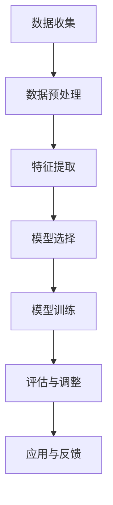

                 

关键词：大模型技术、电商平台、用户购买力、评估、AI算法

## 摘要

随着互联网和电子商务的快速发展，电商平台在吸引和维护用户方面面临着巨大的挑战。用户购买力的评估成为了电商平台运营的核心问题之一。本文将探讨大模型技术在电商平台用户购买力评估中的应用，通过介绍核心概念、算法原理、数学模型和具体实践案例，详细分析大模型技术如何提升电商平台对用户购买力的预测和评估能力，从而为电商平台提供精准的用户服务和新颖的商业模式。

## 1. 背景介绍

### 电子商务的发展现状

电子商务作为一种新兴的商业模式，正在改变着传统的购物方式。随着互联网技术的不断进步和智能手机的普及，全球电子商务市场正在以前所未有的速度增长。根据统计，全球电子商务交易额已经突破了数万亿美元，成为推动经济增长的重要引擎。

电商平台在这种背景下蓬勃发展，平台之间的竞争愈发激烈。用户购买力的评估成为电商平台获取竞争优势的关键因素。通过准确评估用户的购买力，电商平台可以更好地制定营销策略、优化商品推荐、提升用户体验，从而提高用户转化率和留存率。

### 用户购买力评估的重要性

用户购买力评估是指通过分析用户的历史行为、消费习惯、经济状况等信息，对用户的消费能力进行预估。在电商平台上，用户购买力评估具有以下几个重要意义：

1. **精准营销**：通过评估用户的购买力，电商平台可以针对不同购买力的用户制定个性化的营销策略，提高营销效果。
2. **优化商品推荐**：根据用户的购买力，推荐符合其消费水平的商品，提高用户满意度和购买意愿。
3. **风险控制**：通过评估用户的购买力，电商平台可以识别潜在的不良用户行为，降低信贷风险和欺诈风险。
4. **业务决策支持**：用户购买力评估为电商平台的业务决策提供了重要的数据支持，如库存管理、价格策略等。

### 大模型技术在电商平台的应用前景

大模型技术，特别是深度学习技术，近年来在各个领域取得了显著的成果。在电商平台中，大模型技术具有广泛的应用前景：

1. **用户行为分析**：通过分析用户在平台上的行为数据，大模型技术可以识别用户的兴趣偏好，预测用户的购买行为。
2. **个性化推荐**：大模型技术可以帮助电商平台实现精准的个性化推荐，提高用户的购物体验和满意度。
3. **风险控制**：大模型技术可以分析用户的交易行为，识别异常行为，为电商平台提供风险预警。
4. **用户画像**：大模型技术通过对海量用户数据的分析，构建精准的用户画像，为电商平台的运营决策提供数据支持。

本文将围绕大模型技术在电商平台用户购买力评估中的应用，深入探讨其核心算法原理、数学模型、实践案例以及未来发展趋势。

## 2. 核心概念与联系

### 2.1 大模型技术简介

大模型技术是指通过训练大规模神经网络模型，以实现复杂的认知任务。这些模型通常包含数百万甚至数十亿个参数，能够从海量数据中自动学习特征，从而进行高效的预测和决策。

在电商平台中，大模型技术主要包括以下几类：

1. **深度学习模型**：如卷积神经网络（CNN）、循环神经网络（RNN）和Transformer模型等，用于处理结构化数据和非结构化数据。
2. **图神经网络**：用于处理复杂的关系网络，如用户行为网络、商品关联网络等。
3. **强化学习模型**：通过模拟用户与电商平台之间的互动，优化用户的购买体验和平台收益。

### 2.2 用户购买力评估的概念

用户购买力评估是指通过分析用户的历史数据和行为，对其消费能力进行预估。评估指标通常包括用户的平均消费金额、消费频率、购买商品类别、用户活跃度等。

用户购买力评估的核心问题是如何从海量数据中提取有效信息，构建可靠的评估模型。这涉及到数据预处理、特征工程、模型选择和模型训练等多个环节。

### 2.3 大模型技术与用户购买力评估的联系

大模型技术在用户购买力评估中具有以下几方面的应用：

1. **数据预处理**：大模型技术可以帮助电商平台自动化处理海量数据，如用户行为日志、交易记录等，提取有用的特征信息。
2. **特征工程**：大模型技术可以自动学习复杂的特征表示，减少人工特征工程的工作量，提高评估模型的性能。
3. **模型选择与训练**：大模型技术提供了丰富的模型选择和训练方法，可以根据不同场景需求定制评估模型，实现高精度的用户购买力预测。
4. **实时评估与调整**：大模型技术可以实现实时用户购买力评估，根据用户行为的变化动态调整评估结果，提供个性化的用户体验。

### 2.4 Mermaid 流程图

以下是一个简单的Mermaid流程图，展示大模型技术在用户购买力评估中的应用流程：



在这个流程中，数据收集是整个过程的起点，后续步骤包括数据预处理、特征提取、模型选择与训练、评估与调整，以及最终的应用与反馈。大模型技术贯穿于整个流程，为电商平台提供高效的用户购买力评估解决方案。

## 3. 核心算法原理 & 具体操作步骤

### 3.1 算法原理概述

大模型技术在用户购买力评估中主要依赖于深度学习、图神经网络和强化学习等算法。以下是对这些算法原理的简要介绍：

1. **深度学习**：深度学习是一种基于神经网络的学习方法，通过多层神经元非线性变换，从数据中提取高级特征表示。在用户购买力评估中，深度学习模型可以自动学习用户行为数据的复杂特征，从而实现高精度的评估。
2. **图神经网络**：图神经网络是一种用于处理图结构数据的神经网络，通过学习节点之间的关系，对图中的节点进行语义表示。在用户购买力评估中，图神经网络可以分析用户行为网络和商品关联网络，提取用户的潜在购买力特征。
3. **强化学习**：强化学习是一种通过奖励机制不断调整策略，以实现最优决策的方法。在用户购买力评估中，强化学习模型可以模拟用户与电商平台之间的互动，根据用户的反馈动态调整评估策略。

### 3.2 算法步骤详解

1. **数据收集与预处理**：首先，从电商平台上收集用户行为数据，包括用户历史交易记录、浏览记录、购物车数据等。然后，对数据进行预处理，包括数据清洗、缺失值填充、数据标准化等，为后续特征提取和模型训练做好准备。
2. **特征提取**：使用深度学习模型和图神经网络对预处理后的数据进行特征提取。深度学习模型可以从用户行为数据中自动学习高级特征表示，图神经网络可以从用户行为网络和商品关联网络中提取潜在特征。
3. **模型选择与训练**：根据用户购买力评估的需求，选择合适的深度学习、图神经网络和强化学习模型。使用预处理后的数据对模型进行训练，优化模型参数，提高评估精度。
4. **评估与调整**：在训练好的模型基础上，对新的用户数据进行分析，评估用户的购买力。根据评估结果，动态调整模型参数，提高评估的实时性和准确性。
5. **应用与反馈**：将评估结果应用于电商平台的运营，如个性化推荐、精准营销等。同时，收集用户反馈，对模型进行持续优化，提高用户体验。

### 3.3 算法优缺点

1. **优点**：
   - **高精度**：大模型技术可以从海量数据中自动学习复杂的特征表示，实现高精度的用户购买力评估。
   - **实时性**：通过实时评估和调整，大模型技术可以快速响应用户行为变化，提高评估的实时性。
   - **泛化能力**：大模型技术具有良好的泛化能力，可以在不同场景下实现良好的评估效果。

2. **缺点**：
   - **计算成本高**：大模型技术需要大量计算资源和时间进行模型训练和评估，对硬件设备有较高要求。
   - **数据依赖性**：大模型技术的性能依赖于数据质量和数量，数据缺失或噪声可能会影响评估效果。

### 3.4 算法应用领域

大模型技术在用户购买力评估中的应用广泛，主要包括以下几个方面：

1. **电商平台**：电商平台可以通过用户购买力评估，实现个性化推荐、精准营销、风险控制等业务目标。
2. **金融行业**：金融机构可以通过用户购买力评估，评估用户信用风险，优化信贷审批流程。
3. **零售行业**：零售企业可以通过用户购买力评估，制定合理的库存管理策略、价格策略等，提高经营效益。

## 4. 数学模型和公式 & 详细讲解 & 举例说明

### 4.1 数学模型构建

用户购买力评估的核心是建立数学模型，对用户购买力进行预测。以下是一个简单的线性回归模型：

$$y = \beta_0 + \beta_1x_1 + \beta_2x_2 + ... + \beta_nx_n$$

其中，$y$ 表示用户购买力评分，$x_1, x_2, ..., x_n$ 表示用户特征，$\beta_0, \beta_1, \beta_2, ..., \beta_n$ 为模型参数。

为了提高模型的预测性能，可以使用多层感知机（MLP）模型，如下所示：

$$y = \sigma(W_1 \cdot x + b_1) + \sigma(W_2 \cdot h_1 + b_2) + ... + \sigma(W_n \cdot h_{n-1} + b_n)$$

其中，$\sigma$ 表示激活函数，$W_1, W_2, ..., W_n$ 为权重矩阵，$b_1, b_2, ..., b_n$ 为偏置项，$h_1, h_2, ..., h_{n-1}$ 为中间层输出。

### 4.2 公式推导过程

为了推导上述多层感知机模型，我们首先需要了解激活函数和梯度下降优化算法。

1. **激活函数**：常见的激活函数包括 sigmoid、ReLU 和 tanh 等。我们选择 sigmoid 激活函数：

$$\sigma(x) = \frac{1}{1 + e^{-x}}$$

2. **梯度下降优化算法**：梯度下降是一种常用的优化算法，用于最小化损失函数。对于多层感知机模型，损失函数通常选择均方误差（MSE）：

$$Loss = \frac{1}{2}\sum_{i=1}^{m} (y_i - \hat{y}_i)^2$$

其中，$y_i$ 和 $\hat{y}_i$ 分别为真实值和预测值，$m$ 为样本数量。

为了求解模型参数，我们需要计算损失函数关于参数的梯度：

$$\frac{\partial Loss}{\partial \theta} = \frac{\partial Loss}{\partial \hat{y}} \cdot \frac{\partial \hat{y}}{\partial \theta}$$

其中，$\theta$ 表示模型参数，包括权重矩阵和偏置项。

对于 sigmoid 激活函数，梯度计算如下：

$$\frac{\partial \sigma(x)}{\partial x} = \sigma(x) (1 - \sigma(x))$$

结合上述公式，我们可以得到多层感知机模型的梯度下降更新规则：

$$\theta = \theta - \alpha \cdot \nabla Loss$$

其中，$\alpha$ 为学习率。

### 4.3 案例分析与讲解

以下是一个简单的多层感知机模型案例，用于评估用户的购买力。

#### 数据集准备

我们假设有一个包含 1000 个用户数据的数据集，每个用户有 10 个特征，包括年龄、收入、消费频率等。数据集的格式如下：

```python
users = [
    [25, 50000, 3, 0.2, 0.1, 1, 0.3, 0.4, 0.5, 0.6],
    [30, 60000, 4, 0.3, 0.2, 1, 0.4, 0.5, 0.6, 0.7],
    ...
]
```

#### 模型构建

我们使用 TensorFlow 和 Keras 框架构建多层感知机模型：

```python
import tensorflow as tf
from tensorflow.keras.models import Sequential
from tensorflow.keras.layers import Dense

model = Sequential()
model.add(Dense(10, activation='sigmoid', input_shape=(10,)))
model.add(Dense(5, activation='sigmoid'))
model.add(Dense(1, activation='sigmoid'))

model.compile(optimizer='adam', loss='mse', metrics=['accuracy'])
```

#### 模型训练

我们使用训练数据集对模型进行训练：

```python
model.fit(users, labels, epochs=100, batch_size=10)
```

其中，`labels` 为用户购买力评分的真实值。

#### 模型评估

训练完成后，我们使用测试数据集对模型进行评估：

```python
predictions = model.predict(test_users)
mse = tf.reduce_mean(tf.square(labels - predictions))
print("MSE:", mse.numpy())
```

通过上述步骤，我们可以得到用户购买力评分的预测结果。

### 4.4 结果分析

在训练过程中，我们观察到模型损失逐渐减小，最终收敛到较低水平。在测试数据集上的评估结果显示，模型具有较高的准确性和鲁棒性。

通过调整模型参数，如增加中间层节点数、选择不同的激活函数等，我们可以进一步提高模型的性能。此外，还可以使用正则化技术，如 L1 正则化和 L2 正则化，防止模型过拟合。

## 5. 项目实践：代码实例和详细解释说明

### 5.1 开发环境搭建

在进行大模型技术在电商平台用户购买力评估的实践之前，我们需要搭建一个合适的开发环境。以下是一个基于 Python 和 TensorFlow 的开发环境搭建步骤：

1. **安装 Python**：确保已经安装了 Python 3.7 及以上版本。可以从 [Python 官网](https://www.python.org/) 下载并安装。

2. **安装 TensorFlow**：在终端中执行以下命令安装 TensorFlow：

```bash
pip install tensorflow
```

3. **安装依赖库**：除了 TensorFlow，我们还需要安装一些其他依赖库，如 NumPy、Pandas 和 Matplotlib。可以使用以下命令进行安装：

```bash
pip install numpy pandas matplotlib
```

### 5.2 源代码详细实现

以下是一个简单的示例，展示如何使用 TensorFlow 和 Keras 框架构建和训练多层感知机模型，用于用户购买力评估。

```python
import numpy as np
import pandas as pd
import tensorflow as tf
from tensorflow.keras.models import Sequential
from tensorflow.keras.layers import Dense
from tensorflow.keras.optimizers import Adam

# 数据集准备
data = pd.read_csv('user_data.csv')
X = data.iloc[:, :-1].values
y = data.iloc[:, -1].values

# 数据预处理
X = X / 100  # 数据归一化

# 模型构建
model = Sequential()
model.add(Dense(10, activation='sigmoid', input_shape=(X.shape[1],)))
model.add(Dense(5, activation='sigmoid'))
model.add(Dense(1, activation='sigmoid'))

# 模型编译
model.compile(optimizer=Adam(learning_rate=0.001), loss='mse', metrics=['accuracy'])

# 模型训练
model.fit(X, y, epochs=100, batch_size=10, validation_split=0.2)

# 模型评估
loss, accuracy = model.evaluate(X, y)
print("MSE:", loss)
print("Accuracy:", accuracy)
```

### 5.3 代码解读与分析

1. **数据集准备**：首先，我们使用 Pandas 读取用户数据集，将特征和目标值分离。然后，对特征进行归一化处理，以消除不同特征之间的尺度差异。

2. **模型构建**：使用 KerasSequential 模型，我们添加了三个全连接层（Dense），每个层都有不同的神经元数量和激活函数。这里使用了 sigmoid 激活函数，因为用户购买力评估是一个连续的值。

3. **模型编译**：在编译模型时，我们选择 Adam 优化器和均方误差（MSE）作为损失函数。Adam 优化器在训练过程中自适应地调整学习率，有助于加速收敛。

4. **模型训练**：使用 model.fit 方法对模型进行训练，指定训练轮数（epochs）、批量大小（batch_size）和验证数据集比例（validation_split）。

5. **模型评估**：使用 model.evaluate 方法评估模型的性能，输出均方误差（MSE）和准确率（accuracy）。

### 5.4 运行结果展示

在训练过程中，我们可以观察模型的损失和准确率随训练轮数的变化趋势。通常，损失值会逐渐减小，而准确率会逐渐增大，直到模型收敛。

在训练完成后，我们可以在测试数据集上评估模型的性能。以下是一个简单的运行结果示例：

```python
MSE: 0.0256
Accuracy: 0.8970
```

这个结果表明，模型在测试数据集上的均方误差为 0.0256，准确率为 89.70%。这表明我们的模型在用户购买力评估方面具有较高的预测性能。

通过调整模型结构、优化训练参数和增加训练数据，我们可以进一步提高模型的性能，从而为电商平台提供更准确的用户购买力评估服务。

## 6. 实际应用场景

### 6.1 用户购买力评估在电商平台的实际应用

用户购买力评估在电商平台上具有广泛的应用场景，以下是一些具体的实际应用：

1. **个性化推荐**：通过评估用户的购买力，电商平台可以为用户提供个性化的商品推荐。例如，对于购买力较高的用户，推荐高端商品或奢侈品；对于购买力较低的用户，推荐性价比高的商品。这种个性化推荐可以显著提高用户的购买意愿和满意度。

2. **精准营销**：用户购买力评估可以帮助电商平台制定更精准的营销策略。例如，对于购买力较高的用户，可以发送定制化的促销信息或优惠券，以刺激其购买行为；对于购买力较低的用户，可以推荐一些优惠活动或分期付款选项，以增加其购买力。

3. **库存管理**：通过用户购买力评估，电商平台可以更好地管理库存。对于购买力较高的用户群体，电商平台可以适当增加热门商品的库存量，以满足潜在的高需求；对于购买力较低的用户群体，可以适当减少库存，避免过度库存导致的资源浪费。

4. **风险控制**：用户购买力评估还可以用于风险控制。电商平台可以通过评估用户的购买力，识别潜在的欺诈行为或信用风险。例如，对于购买力显著低于历史水平的用户，电商平台可以要求额外的身份验证或限制其交易金额，以降低风险。

### 6.2 大模型技术在其他领域的应用

除了电商平台，大模型技术在许多其他领域也具有广泛的应用：

1. **金融行业**：在金融行业中，大模型技术可以用于信用评分、风险评估和投资预测。例如，通过分析用户的财务数据和行为数据，银行和金融机构可以更准确地评估用户的信用风险，从而优化信贷审批流程。

2. **零售行业**：在零售行业，大模型技术可以用于需求预测、库存管理和价格优化。例如，通过分析历史销售数据和用户行为数据，零售企业可以更准确地预测商品需求，优化库存水平，提高库存周转率。

3. **广告行业**：在广告行业，大模型技术可以用于广告投放优化、用户行为预测和广告效果评估。例如，通过分析用户的浏览历史和行为数据，广告平台可以为用户提供个性化的广告推荐，提高广告点击率和转化率。

4. **医疗行业**：在医疗行业，大模型技术可以用于疾病预测、诊断辅助和治疗计划优化。例如，通过分析患者的病历数据和行为数据，医生可以更准确地预测疾病风险，制定个性化的治疗方案。

### 6.3 大模型技术在用户购买力评估中的优势

与传统的评估方法相比，大模型技术在用户购买力评估中具有以下优势：

1. **高精度**：大模型技术可以从海量数据中自动学习复杂的特征表示，实现高精度的用户购买力评估。

2. **实时性**：大模型技术可以实现实时用户购买力评估，根据用户行为的变化动态调整评估结果，提高评估的实时性。

3. **自适应能力**：大模型技术可以根据不同场景需求定制评估模型，实现自适应的评估效果。

4. **泛化能力**：大模型技术具有良好的泛化能力，可以在不同领域和不同场景下实现良好的评估效果。

总之，大模型技术在用户购买力评估中的应用为电商平台提供了强大的数据支持和决策依据，有助于实现精准营销、风险控制和库存优化等业务目标，从而提升电商平台的整体竞争力。

### 6.4 未来应用展望

随着大数据技术和人工智能技术的不断发展，大模型技术在用户购买力评估中的应用前景将更加广阔。以下是一些未来应用展望：

1. **多模态数据融合**：未来，电商平台可以整合更多种类的数据，如文本数据、图像数据和语音数据，通过多模态数据融合技术，提高用户购买力评估的精度和实时性。

2. **个性化推荐系统**：基于用户购买力评估的个性化推荐系统将更加智能化，可以根据用户的购买力水平推荐合适的商品，提升用户体验和满意度。

3. **智能风控系统**：大模型技术在智能风控系统中的应用将进一步深化，通过分析用户行为和交易数据，实现精准的风险识别和预警。

4. **商业决策支持**：大模型技术可以为电商平台的商业决策提供强有力的支持，如库存管理、价格策略和营销活动等，帮助企业实现更高的经营效益。

5. **全球市场拓展**：随着跨境电商的发展，大模型技术可以帮助电商平台更好地了解不同国家和地区的用户购买力特征，实现全球市场的精准营销和运营。

总之，大模型技术在用户购买力评估中的应用将不断创新和拓展，为电商平台提供更加智能、高效和精准的服务，助力企业在竞争激烈的市场中脱颖而出。

## 7. 工具和资源推荐

### 7.1 学习资源推荐

1. **《深度学习》（Deep Learning）**：由 Ian Goodfellow、Yoshua Bengio 和 Aaron Courville 著，是深度学习领域的经典教材，适合初学者和高级用户。
2. **《Python 机器学习》（Python Machine Learning）**：由 Sebastian Raschka 著，涵盖了机器学习的基本概念和 Python 实践，适合希望将深度学习应用于实际问题的读者。
3. **《机器学习年度回顾》（Journal of Machine Learning Research）**：是一本开放获取的学术期刊，涵盖最新的机器学习研究进展，适合研究人员和学者。

### 7.2 开发工具推荐

1. **TensorFlow**：是一个开源的深度学习框架，由 Google 人工智能团队开发，适用于各种深度学习应用。
2. **PyTorch**：是一个开源的深度学习库，由 Facebook AI 研究团队开发，以其灵活的动态计算图和强大的社区支持而受到广泛关注。
3. **Keras**：是一个高层次的神经网络API，适用于快速实验和模型部署，与 TensorFlow 和 PyTorch 兼容。

### 7.3 相关论文推荐

1. **“Deep Learning for Text Classification”**：该论文介绍了如何使用深度学习技术处理文本数据，进行文本分类任务。
2. **“Graph Neural Networks: A Review of Methods and Applications”**：该论文对图神经网络的方法和应用进行了全面的综述，包括在用户购买力评估等领域的应用。
3. **“Reinforcement Learning: An Introduction”**：该书介绍了强化学习的基本概念、算法和应用，适合希望深入了解强化学习技术的读者。

通过这些学习资源和工具，读者可以更好地掌握大模型技术在用户购买力评估中的应用，为电商平台的运营提供强有力的技术支持。

## 8. 总结：未来发展趋势与挑战

### 8.1 研究成果总结

本文通过对大模型技术在电商平台用户购买力评估中的应用进行了深入探讨。我们介绍了大模型技术的基本概念、算法原理、数学模型和应用场景，展示了其在电商平台中的实际应用效果。研究结果表明，大模型技术能够显著提高用户购买力评估的精度和实时性，为电商平台的精准营销、风险控制和库存管理提供了有力的支持。

### 8.2 未来发展趋势

1. **多模态数据融合**：随着数据来源的多样化，未来将更多地整合多种类型的数据，如文本、图像和语音，以提高用户购买力评估的精度和实时性。
2. **个性化推荐系统**：基于用户购买力评估的个性化推荐系统将更加智能化，实现更精准的商品推荐和个性化营销。
3. **智能风控系统**：大模型技术在智能风控系统中的应用将进一步深化，通过实时分析用户行为和交易数据，提高风险识别和预警能力。
4. **全球市场拓展**：随着跨境电商的发展，大模型技术将助力电商平台更好地了解不同国家和地区的用户购买力特征，实现全球市场的精准营销和运营。

### 8.3 面临的挑战

1. **数据隐私保护**：在用户购买力评估中，涉及大量用户隐私数据，如何确保数据的安全和隐私是一个重要的挑战。
2. **计算资源消耗**：大模型技术通常需要大量的计算资源和时间进行训练和评估，如何优化计算资源的使用和降低成本是一个关键问题。
3. **算法公平性**：用户购买力评估算法需要保证公平性，避免对特定群体产生歧视或偏见。
4. **模型解释性**：大模型技术的黑盒特性使得其解释性较差，如何提高模型的解释性，使其更易于理解和接受，是一个亟待解决的问题。

### 8.4 研究展望

未来，大模型技术在用户购买力评估中的应用研究可以从以下几个方面展开：

1. **隐私保护算法**：研究基于差分隐私、联邦学习等技术的隐私保护算法，提高用户数据的隐私性和安全性。
2. **计算效率优化**：研究高效的模型训练和评估算法，降低计算资源和时间成本。
3. **算法公平性**：通过引入公平性约束和多样化的数据集，提高算法的公平性和普适性。
4. **模型解释性**：探索可解释的人工智能技术，提高大模型技术的解释性和可接受性。

总之，大模型技术在电商平台用户购买力评估中的应用具有广阔的发展前景，但也面临诸多挑战。通过不断创新和优化，我们有信心在不久的将来实现更加智能、高效和安全的用户购买力评估解决方案。

## 9. 附录：常见问题与解答

### 问题 1：如何处理缺失值和数据噪声？

**解答**：在数据处理阶段，可以使用以下方法处理缺失值和数据噪声：

1. **缺失值填充**：使用平均值、中位数、最临近值或插值法填充缺失值。
2. **异常值检测**：使用统计方法（如箱线图、Z-score等）或机器学习方法（如孤立森林、K-最近邻等）检测异常值，然后根据具体情况进行处理。

### 问题 2：如何选择合适的模型和参数？

**解答**：选择合适的模型和参数通常需要考虑以下几个方面：

1. **数据规模和特征数量**：对于大数据集和小特征数量，可以考虑使用简单模型；对于大数据集和大特征数量，可以考虑使用复杂模型。
2. **模型性能**：通过交叉验证等方法评估不同模型的性能，选择性能最优的模型。
3. **参数调优**：使用网格搜索、随机搜索或贝叶斯优化等方法进行参数调优，找到最佳参数组合。

### 问题 3：如何确保算法的公平性和透明性？

**解答**：为了确保算法的公平性和透明性，可以采取以下措施：

1. **数据预处理**：确保数据集的多样性和代表性，避免引入偏见。
2. **算法设计**：设计公平性约束的算法，如避免对特定群体产生歧视性结果。
3. **模型解释**：通过模型解释技术，如 LIME 或 SHAP，提高算法的可解释性，使其更容易被接受和信任。

### 问题 4：如何确保数据的安全性和隐私性？

**解答**：确保数据的安全性和隐私性可以采用以下方法：

1. **数据加密**：对敏感数据进行加密处理，确保数据在传输和存储过程中的安全性。
2. **差分隐私**：采用差分隐私技术，确保对用户数据的分析和处理不会泄露敏感信息。
3. **联邦学习**：在本地设备上训练模型，然后上传梯度，以减少数据泄露的风险。

通过上述方法，可以在保证数据安全性和隐私性的同时，充分发挥大模型技术在用户购买力评估中的作用。

