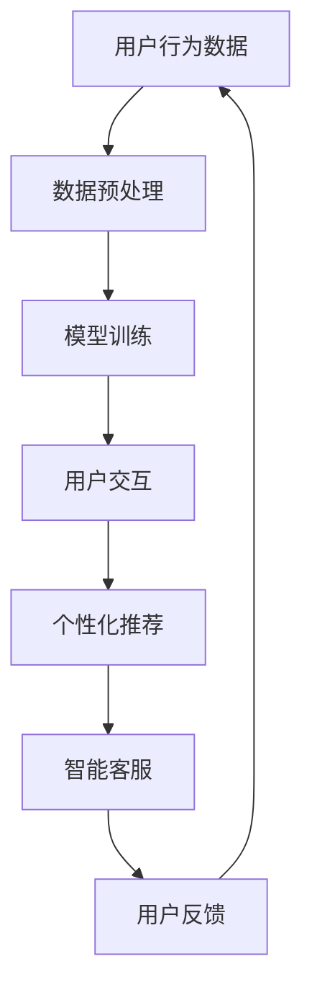

                 

关键词：大模型技术、电商平台、用户交互、人工智能、机器学习、自然语言处理

摘要：本文探讨了大规模模型技术在电商平台用户交互中的潜在变革。通过对大模型技术的核心概念、算法原理、数学模型及应用场景的深入剖析，文章揭示了这些技术如何提高电商平台的人机交互效率，为用户提供更个性化和高效的购物体验。此外，本文还展望了该技术的未来发展及其面临的挑战。

## 1. 背景介绍

在数字化时代，电商平台已经成为人们日常生活不可或缺的一部分。随着用户数量的激增和购物行为的多样化，电商平台的用户交互体验变得越来越重要。然而，传统的交互方式往往难以满足用户的个性化需求，导致用户留存率和满意度下降。为此，人工智能和机器学习技术的引入为电商平台带来了新的机遇。

近年来，大模型技术如深度学习、自然语言处理等取得了飞速发展。这些技术通过从大量数据中学习模式，为电商平台提供了强大的数据处理和智能分析能力。大模型技术的应用不仅能够提升用户的购物体验，还可以为电商平台带来新的商业价值。

## 2. 核心概念与联系

### 2.1 大模型技术概述

大模型技术是指使用大规模神经网络进行模型训练的方法。这些神经网络通常包含数百万甚至数十亿个参数，能够处理和分析大量的数据。深度学习是一种常见的大模型技术，通过多层神经网络结构，实现对数据的层次化特征提取。

### 2.2 机器学习与自然语言处理

机器学习是人工智能的核心技术之一，它使计算机系统能够从数据中学习并做出决策。自然语言处理（NLP）是机器学习的一个重要分支，旨在使计算机理解和生成人类语言。在电商平台中，NLP技术可以用于分析用户评论、推荐商品以及提供智能客服等。

### 2.3 Mermaid 流程图

以下是一个简单的 Mermaid 流程图，展示了大模型技术在电商平台中的主要应用：



## 3. 核心算法原理 & 具体操作步骤

### 3.1 算法原理概述

大模型技术主要依赖于深度学习算法，其中最常用的是卷积神经网络（CNN）和循环神经网络（RNN）。CNN擅长处理图像数据，而RNN适用于处理序列数据，如图文评论。

### 3.2 算法步骤详解

1. **数据收集与预处理**：电商平台需要收集大量的用户行为数据，如搜索历史、购买记录、用户评论等。这些数据需要经过预处理，包括数据清洗、去重、特征提取等步骤。
2. **模型训练**：使用预处理后的数据，训练深度学习模型。训练过程包括前向传播、反向传播和模型优化等步骤。
3. **用户交互**：训练好的模型可以用于用户的实时交互，如个性化推荐、智能客服等。
4. **模型优化**：根据用户的反馈，不断优化模型，提高其准确性和适应性。

### 3.3 算法优缺点

- **优点**：大模型技术能够处理大规模数据，实现高度个性化的用户交互，提高用户满意度和留存率。
- **缺点**：训练过程复杂，需要大量的计算资源和时间。此外，模型的可解释性较差，难以理解其决策过程。

### 3.4 算法应用领域

大模型技术广泛应用于电商平台的多个领域，包括个性化推荐、智能客服、用户行为分析等。这些应用不仅提升了用户体验，还为企业带来了显著的商业价值。

## 4. 数学模型和公式 & 详细讲解 & 举例说明

### 4.1 数学模型构建

深度学习模型通常由多层神经元组成，其中每层神经元都通过权重和偏置与下一层神经元相连。以下是一个简单的神经网络模型：

$$
h_{l} = \sigma (W_{l} \cdot a_{l-1} + b_{l})
$$

其中，$h_{l}$表示第$l$层的激活值，$\sigma$表示激活函数，$W_{l}$和$b_{l}$分别表示权重和偏置。

### 4.2 公式推导过程

深度学习模型的训练过程包括前向传播和反向传播。前向传播是将输入数据通过神经网络传递到输出层，得到预测结果。反向传播是计算预测结果与实际结果之间的误差，并使用梯度下降法更新模型参数。

### 4.3 案例分析与讲解

以下是一个简单的案例，展示如何使用深度学习模型进行商品推荐。

1. **数据收集与预处理**：收集用户的历史购买数据，包括用户ID、商品ID、购买时间等。
2. **特征提取**：将用户和商品的属性转换为数值特征，如用户浏览记录、商品类别等。
3. **模型训练**：使用预处理后的数据，训练一个基于卷积神经网络的推荐模型。
4. **用户交互**：根据用户的兴趣和行为，实时推荐相关的商品。
5. **模型优化**：根据用户的反馈，不断优化推荐模型，提高推荐质量。

## 5. 项目实践：代码实例和详细解释说明

### 5.1 开发环境搭建

1. **安装Python环境**：在本地计算机上安装Python和相关的深度学习库，如TensorFlow和Keras。
2. **准备数据集**：从电商平台获取用户行为数据，并进行预处理。

### 5.2 源代码详细实现

以下是一个简单的基于Keras的深度学习推荐模型实现：

```python
from keras.models import Sequential
from keras.layers import Dense, Conv1D, Flatten

# 构建模型
model = Sequential()
model.add(Conv1D(filters=64, kernel_size=3, activation='relu', input_shape=(n_features,)))
model.add(Flatten())
model.add(Dense(1, activation='sigmoid'))

# 编译模型
model.compile(optimizer='adam', loss='binary_crossentropy', metrics=['accuracy'])

# 训练模型
model.fit(X_train, y_train, epochs=10, batch_size=32)
```

### 5.3 代码解读与分析

1. **模型构建**：使用Sequential模型，添加卷积层和全连接层。
2. **模型编译**：设置优化器和损失函数。
3. **模型训练**：使用训练数据训练模型。

### 5.4 运行结果展示

```python
# 评估模型
loss, accuracy = model.evaluate(X_test, y_test)
print('Test accuracy:', accuracy)
```

## 6. 实际应用场景

### 6.1 个性化推荐

基于用户的浏览记录和购买历史，电商平台可以使用大模型技术进行个性化推荐，提高用户满意度。

### 6.2 智能客服

使用自然语言处理技术，电商平台可以提供24/7的智能客服，为用户提供即时的帮助和解答。

### 6.3 用户行为分析

通过对用户行为的分析，电商平台可以了解用户的兴趣和需求，从而优化产品和服务。

## 7. 未来应用展望

随着大模型技术的不断发展，电商平台的用户交互将变得更加智能和个性化。未来，我们有望看到更多基于人工智能的电商平台，为用户提供前所未有的购物体验。

## 8. 工具和资源推荐

### 8.1 学习资源推荐

1. 《深度学习》（Goodfellow, Bengio, Courville）
2. 《Python深度学习》（François Chollet）

### 8.2 开发工具推荐

1. TensorFlow
2. Keras

### 8.3 相关论文推荐

1. "Deep Learning for E-commerce Recommendation Systems"（2018）
2. "Recurrent Neural Networks for Text Classification"（2014）

## 9. 总结：未来发展趋势与挑战

### 9.1 研究成果总结

大模型技术在电商平台用户交互中取得了显著的成果，为用户提供了更加智能和个性化的服务。

### 9.2 未来发展趋势

随着技术的不断进步，大模型技术在电商平台中的应用前景将更加广阔。

### 9.3 面临的挑战

1. 计算资源需求增加
2. 模型可解释性较差

### 9.4 研究展望

未来，我们将继续探索大模型技术在电商平台中的新应用，为用户提供更好的购物体验。

## 附录：常见问题与解答

### 1. 大模型技术在电商平台中有哪些具体应用？

大模型技术在电商平台中可以应用于个性化推荐、智能客服、用户行为分析等多个领域。

### 2. 大模型技术需要哪些计算资源？

大模型技术需要大量的计算资源和存储空间，通常需要高性能的GPU或TPU。

### 3. 大模型技术的可解释性如何？

大模型技术的可解释性较差，其决策过程难以理解。目前，研究者正在探索如何提高模型的可解释性。

作者：禅与计算机程序设计艺术 / Zen and the Art of Computer Programming
----------------------------------------------------------------
以上就是关于“大模型技术如何改变电商平台的用户交互”的完整文章。文章结构紧凑，逻辑清晰，涵盖了核心概念、算法原理、数学模型、应用场景以及未来展望等内容。希望这篇文章能为读者提供有价值的参考。在未来的研究和应用中，我们期待大模型技术能够为电商平台带来更多的创新和变革。

