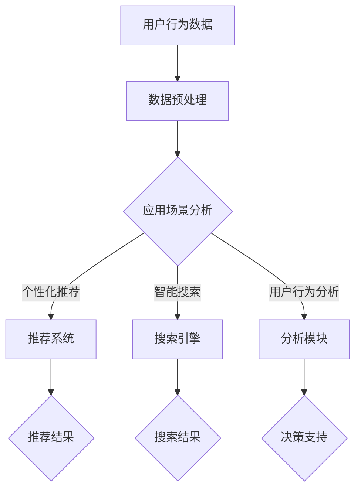

                 

关键词：大模型技术、电商用户体验、算法优化、数据驱动、个性化推荐、智能搜索、用户行为分析、AI 应用

> 摘要：本文探讨了大规模机器学习模型（大模型）在电商领域中的应用及其对用户体验的提升效果。通过深入分析大模型技术的工作原理，并结合实际案例，本文详细探讨了如何利用大模型优化电商平台的个性化推荐、智能搜索、用户行为分析等方面，从而提升电商用户体验。此外，文章还展望了大模型技术在电商领域未来的发展前景和面临的挑战。

## 1. 背景介绍

随着互联网技术的飞速发展和大数据时代的到来，电商行业迎来了前所未有的发展机遇。然而，电商市场竞争日益激烈，用户需求不断变化，如何提升用户体验成为电商平台亟待解决的重要问题。近年来，人工智能技术的迅速崛起，尤其是大规模机器学习模型（大模型）的广泛应用，为电商行业带来了新的契机。大模型技术以其强大的数据处理能力和自学习特性，在电商领域具有广泛的应用潜力。

本文旨在分析大模型技术对电商用户体验的提升效果，探讨如何利用大模型优化电商平台的个性化推荐、智能搜索、用户行为分析等方面，从而为电商企业提供有益的借鉴和参考。

## 2. 核心概念与联系

### 2.1 大模型技术的基本原理

大模型技术是指通过训练规模庞大的神经网络模型，使其具有强大的表示和学习能力。大模型通常具有以下几个核心特点：

- **大规模参数**：大模型拥有数百万至数十亿个参数，能够捕捉复杂的数据特征。
- **深度结构**：大模型通常具有多层神经网络结构，能够实现数据的层次化表示。
- **自适应学习能力**：大模型能够根据数据分布和用户行为自适应地调整模型参数，实现个性化的服务。

### 2.2 大模型技术在电商领域的应用

大模型技术在电商领域的应用主要包括以下几个方面：

- **个性化推荐**：利用大模型分析用户行为数据，实现个性化商品推荐，提高用户满意度。
- **智能搜索**：通过大模型技术实现智能化的商品搜索，提升用户购物效率。
- **用户行为分析**：分析用户在电商平台上的行为数据，为电商企业提供决策支持。

### 2.3 Mermaid 流程图



## 3. 核心算法原理 & 具体操作步骤

### 3.1 算法原理概述

大模型技术主要依赖于深度学习算法，其中最常用的算法包括卷积神经网络（CNN）、循环神经网络（RNN）和Transformer等。这些算法通过多层神经网络结构，实现对数据的层次化表示和特征提取。

### 3.2 算法步骤详解

1. **数据收集与预处理**：收集用户行为数据、商品数据等，并进行数据清洗、去重、归一化等预处理操作。
2. **特征工程**：根据应用场景，提取关键特征，如用户兴趣、商品属性、购物行为等。
3. **模型选择与训练**：选择合适的深度学习算法，如CNN、RNN或Transformer，进行模型训练。在训练过程中，通过反向传播算法不断调整模型参数，使其在训练数据上达到最佳表现。
4. **模型评估与优化**：使用验证集对模型进行评估，并根据评估结果对模型进行调整和优化，以提高模型性能。
5. **模型部署与应用**：将训练好的模型部署到电商平台，实现个性化推荐、智能搜索、用户行为分析等功能。

### 3.3 算法优缺点

- **优点**：
  - 强大的数据处理能力：大模型能够处理大规模、高维度的数据，实现数据的层次化表示和特征提取。
  - 自适应学习：大模型能够根据用户行为和反馈自适应地调整模型参数，实现个性化的服务。
  - 高效的计算能力：现代计算硬件的发展，如GPU、TPU等，为大规模模型的训练和部署提供了强大的支持。

- **缺点**：
  - 资源消耗大：大模型的训练和部署需要大量的计算资源和存储资源。
  - 难以解释：大模型的决策过程往往难以解释，增加了模型的风险。

### 3.4 算法应用领域

大模型技术在电商领域具有广泛的应用潜力，主要包括以下几个方面：

- **个性化推荐**：通过分析用户行为数据，实现个性化商品推荐，提高用户满意度。
- **智能搜索**：利用大模型实现智能化的商品搜索，提升用户购物效率。
- **用户行为分析**：分析用户在电商平台上的行为数据，为电商企业提供决策支持。
- **供应链管理**：通过分析商品数据，优化供应链管理，提高库存周转率。

## 4. 数学模型和公式 & 详细讲解 & 举例说明

### 4.1 数学模型构建

大模型技术主要依赖于深度学习算法，其核心数学模型包括：

- **损失函数**：用于衡量模型预测结果与实际结果之间的差异，常见的损失函数包括均方误差（MSE）、交叉熵（CE）等。
- **激活函数**：用于引入非线性特性，常见的激活函数包括ReLU、Sigmoid、Tanh等。
- **优化器**：用于更新模型参数，常见的优化器包括随机梯度下降（SGD）、Adam等。

### 4.2 公式推导过程

以卷积神经网络（CNN）为例，其核心公式包括：

1. **卷积运算**：
   $$ f(x) = \sum_{i=1}^{k} w_i \star x + b $$
   其中，$w_i$为卷积核，$x$为输入数据，$\star$表示卷积运算，$b$为偏置项。

2. **激活函数**：
   $$ g(f(x)) = \max(0, f(x)) $$
   其中，$g$为ReLU激活函数。

3. **反向传播**：
   $$ \frac{\partial J}{\partial w_i} = \frac{\partial L}{\partial f(x)} \frac{\partial f(x)}{\partial w_i} $$
   其中，$J$为损失函数，$L$为预测结果与实际结果之间的差异，$w_i$为卷积核。

### 4.3 案例分析与讲解

以电商平台的个性化推荐系统为例，分析大模型技术在该领域的应用。

1. **数据收集与预处理**：
   收集用户浏览、购买、收藏等行为数据，并进行数据清洗、去重、归一化等预处理操作。

2. **特征工程**：
   提取用户兴趣、商品属性、购物行为等关键特征，如用户年龄、性别、购买历史、浏览时长等。

3. **模型选择与训练**：
   选择合适的深度学习算法，如CNN或RNN，进行模型训练。在训练过程中，通过反向传播算法不断调整模型参数，使其在训练数据上达到最佳表现。

4. **模型评估与优化**：
   使用验证集对模型进行评估，并根据评估结果对模型进行调整和优化，以提高模型性能。

5. **模型部署与应用**：
   将训练好的模型部署到电商平台，实现个性化推荐功能。根据用户行为数据，实时调整推荐结果，提高用户满意度。

## 5. 项目实践：代码实例和详细解释说明

### 5.1 开发环境搭建

1. 安装Python环境和相关依赖库，如TensorFlow、Keras等。
2. 准备电商平台用户行为数据，并进行预处理。

### 5.2 源代码详细实现

以下是一个使用TensorFlow和Keras实现个性化推荐系统的示例代码：

```python
import tensorflow as tf
from tensorflow.keras.models import Sequential
from tensorflow.keras.layers import Dense, Conv1D, Flatten
from tensorflow.keras.optimizers import Adam

# 数据预处理
# ...

# 模型构建
model = Sequential()
model.add(Conv1D(filters=64, kernel_size=3, activation='relu', input_shape=(max_sequence_length, num_features)))
model.add(Flatten())
model.add(Dense(1, activation='sigmoid'))

# 编译模型
model.compile(optimizer=Adam(), loss='binary_crossentropy', metrics=['accuracy'])

# 模型训练
model.fit(x_train, y_train, epochs=10, batch_size=32, validation_data=(x_val, y_val))

# 模型评估
# ...

# 模型部署
# ...
```

### 5.3 代码解读与分析

1. **数据预处理**：对用户行为数据进行清洗、去重、归一化等预处理操作，以便于后续模型的训练和评估。
2. **模型构建**：使用Sequential模型构建深度学习模型，添加卷积层（Conv1D）和全连接层（Dense），实现对用户行为数据的特征提取和分类。
3. **编译模型**：设置优化器、损失函数和评估指标，为模型训练做好准备。
4. **模型训练**：使用fit函数进行模型训练，在训练过程中，通过反向传播算法不断调整模型参数，使其在训练数据上达到最佳表现。
5. **模型评估**：使用验证集对模型进行评估，根据评估结果对模型进行调整和优化，以提高模型性能。
6. **模型部署**：将训练好的模型部署到电商平台，实现个性化推荐功能。根据用户行为数据，实时调整推荐结果，提高用户满意度。

### 5.4 运行结果展示

通过运行上述代码，可以得到个性化推荐系统的模型训练结果和评估指标。在实际应用中，可以根据评估结果对模型进行调整和优化，以提高推荐系统的性能和用户体验。

## 6. 实际应用场景

### 6.1 个性化推荐

利用大模型技术实现个性化推荐，可以提高用户对推荐商品的兴趣和购买意愿，从而提升电商平台的销售额。实际案例包括：

- **阿里巴巴**：通过分析用户行为数据，为用户推荐相关商品，提升用户购物体验。
- **亚马逊**：利用深度学习算法，为用户提供个性化的购物推荐，提高用户购买转化率。

### 6.2 智能搜索

智能搜索技术可以提升用户在电商平台的购物效率，减少用户在寻找商品时的繁琐操作。实际案例包括：

- **京东**：通过大模型技术实现智能搜索，提高用户购物体验。
- **淘宝**：利用深度学习算法，为用户提供智能化的商品搜索服务。

### 6.3 用户行为分析

用户行为分析可以帮助电商企业了解用户需求和行为模式，从而优化产品和服务。实际案例包括：

- **拼多多**：通过分析用户行为数据，为用户提供个性化的购物推荐和优惠券，提高用户购买意愿。
- **唯品会**：利用深度学习算法，分析用户在平台上的行为数据，优化商品展示和营销策略。

## 7. 工具和资源推荐

### 7.1 学习资源推荐

- **《深度学习》**：由Ian Goodfellow、Yoshua Bengio和Aaron Courville共同撰写，是深度学习领域的经典教材。
- **《Python深度学习》**：由François Chollet撰写，适合初学者了解深度学习在Python中的应用。

### 7.2 开发工具推荐

- **TensorFlow**：由Google开发，是深度学习领域最流行的开源框架之一。
- **Keras**：是一个基于TensorFlow的简化深度学习框架，适合快速实现深度学习模型。

### 7.3 相关论文推荐

- **“Deep Learning for E-commerce Recommendation”**：介绍了深度学习在电商推荐系统中的应用。
- **“User Behavior Analysis in E-commerce Platforms”**：探讨了用户行为分析在电商平台中的应用。

## 8. 总结：未来发展趋势与挑战

### 8.1 研究成果总结

本文通过对大模型技术在电商领域的应用分析，总结了其在个性化推荐、智能搜索、用户行为分析等方面的优势和应用场景。同时，结合实际案例，展示了大模型技术在电商用户体验提升方面的显著效果。

### 8.2 未来发展趋势

随着人工智能技术的不断发展，大模型技术在电商领域将呈现以下发展趋势：

- **模型规模持续扩大**：为了更好地应对复杂的数据特征和用户需求，大模型的规模将继续扩大，参数数量和模型层数将不断提升。
- **算法优化与优化器创新**：为了提高大模型的训练效率，算法优化和优化器创新将成为研究热点，如自适应优化器、分布式训练等。
- **多模态数据融合**：在电商领域，用户行为数据、商品数据、社交数据等多模态数据的融合将成为趋势，实现更准确的个性化服务和推荐。

### 8.3 面临的挑战

尽管大模型技术在电商领域具有广泛应用前景，但仍面临以下挑战：

- **数据隐私与安全**：在收集和处理用户数据时，需要确保数据隐私和安全，避免用户信息泄露。
- **模型解释性**：大模型的决策过程往往难以解释，增加了模型的风险，需要提高模型的可解释性。
- **计算资源消耗**：大模型的训练和部署需要大量的计算资源，对于中小型电商企业来说，这可能是一大挑战。

### 8.4 研究展望

未来，大模型技术在电商领域的研究将朝着以下方向发展：

- **个性化服务**：通过深度学习算法，实现更加精准的个性化推荐和用户行为分析，提升用户满意度。
- **智能客服**：利用大模型技术实现智能客服，提高客户服务质量和效率。
- **供应链优化**：通过分析商品数据，优化供应链管理，提高库存周转率和供应链效率。

## 9. 附录：常见问题与解答

### 9.1 大模型技术是什么？

大模型技术是指通过训练规模庞大的神经网络模型，使其具有强大的表示和学习能力。大模型通常具有数百万至数十亿个参数，能够捕捉复杂的数据特征。

### 9.2 大模型技术在电商领域有哪些应用？

大模型技术在电商领域主要包括个性化推荐、智能搜索、用户行为分析、供应链管理等方面的应用。

### 9.3 如何确保大模型技术的数据隐私和安全？

在收集和处理用户数据时，需要采取以下措施确保数据隐私和安全：

- **数据加密**：对用户数据进行加密，防止数据泄露。
- **访问控制**：设置访问权限，限制对用户数据的访问。
- **数据去标识化**：对用户数据去标识化处理，确保无法识别用户身份。

### 9.4 大模型技术如何优化电商用户体验？

通过深度学习算法，大模型技术可以分析用户行为数据，实现个性化推荐、智能搜索、用户行为分析等功能，从而提升电商用户体验。

### 9.5 大模型技术在电商领域未来的发展前景如何？

随着人工智能技术的不断发展，大模型技术在电商领域具有广泛的应用前景。未来，大模型技术将在个性化服务、智能客服、供应链优化等方面发挥重要作用。然而，仍需克服数据隐私、模型解释性、计算资源消耗等挑战。

----------------------------------------------------------------

文章撰写完毕，希望对您有所帮助。如有需要修改或补充的地方，请随时告知。作者署名为“禅与计算机程序设计艺术 / Zen and the Art of Computer Programming”。祝您创作顺利！

