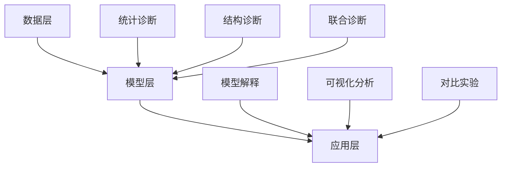

                 

关键词：大模型推荐、模型诊断、效果理解、人工智能、模型架构、算法原理、数学模型、实际应用、未来展望

## 摘要

本文旨在探讨大模型推荐系统中的模型诊断与效果理解问题。随着人工智能技术的飞速发展，大模型推荐系统在电子商务、社交媒体、搜索引擎等领域得到了广泛应用。然而，这些模型的复杂性和非线性使得诊断其性能和效果成为了一项具有挑战性的任务。本文首先回顾了大模型推荐系统的背景和核心概念，然后详细介绍了模型诊断和效果理解的方法、技术和工具，最后讨论了未来应用前景和面临的挑战。

## 1. 背景介绍

### 1.1 大模型推荐系统概述

大模型推荐系统是一种利用机器学习算法从大量数据中挖掘用户兴趣和偏好，并将其推荐给用户的技术。这种系统在电子商务、社交媒体、搜索引擎等领域得到了广泛应用。例如，电子商务平台利用推荐系统向用户推荐商品，以提高用户满意度和销售额；社交媒体平台利用推荐系统推荐用户可能感兴趣的内容，以增加用户黏性和活跃度；搜索引擎利用推荐系统向用户提供相关搜索结果，以提高用户体验和搜索效率。

### 1.2 大模型推荐系统的挑战

大模型推荐系统面临着许多挑战。首先，模型复杂度不断增加，导致诊断和调优变得更加困难。其次，数据量庞大，使得模型训练和优化变得耗时。此外，推荐系统的效果难以量化，难以直观地评估模型的性能。最后，模型的透明性和可解释性也成为了关注的焦点，用户希望了解推荐结果背后的原因。

### 1.3 模型诊断与效果理解的重要性

模型诊断与效果理解在大模型推荐系统中具有至关重要的地位。通过模型诊断，我们可以识别和解决模型中的问题，提高模型的稳定性和可靠性。而效果理解则有助于我们了解模型的性能，为后续优化提供依据。此外，良好的模型诊断与效果理解还能增强用户对推荐系统的信任，提高用户满意度。

## 2. 核心概念与联系

### 2.1 大模型推荐系统架构

大模型推荐系统的架构可以分为数据层、模型层和应用层。数据层负责数据收集、清洗和预处理；模型层负责模型训练和优化；应用层负责将推荐结果呈现给用户。

### 2.2 模型诊断方法

模型诊断方法包括统计诊断、结构诊断和联合诊断。统计诊断主要关注模型参数的统计特性；结构诊断主要关注模型结构的合理性和有效性；联合诊断将统计诊断和结构诊断结合起来，以提高诊断的准确性。

### 2.3 效果理解方法

效果理解方法包括模型解释、可视化分析和对比实验。模型解释旨在揭示模型决策过程；可视化分析通过图形化手段展示模型性能；对比实验通过对比不同模型或算法的性能，为优化提供参考。

### 2.4 Mermaid 流程图



## 3. 核心算法原理 & 具体操作步骤

### 3.1 算法原理概述

大模型推荐系统通常采用基于协同过滤、基于内容推荐和混合推荐等方法。协同过滤通过分析用户行为数据，挖掘用户之间的相似性，为用户推荐相似用户喜欢的物品。基于内容推荐通过分析物品的属性，为用户推荐与已有物品相似的新物品。混合推荐则结合协同过滤和基于内容推荐的优势，为用户推荐更精准的物品。

### 3.2 算法步骤详解

1. 数据收集与预处理：收集用户行为数据、物品属性数据等，并进行数据清洗和预处理。

2. 特征工程：提取用户和物品的特征，如用户兴趣标签、物品类别等。

3. 模型训练：选择合适的推荐算法，如矩阵分解、K-近邻等，对特征进行训练。

4. 模型评估：通过交叉验证等方法评估模型性能，如准确率、召回率等。

5. 推荐结果生成：根据模型预测结果，生成推荐列表。

6. 模型诊断与优化：对模型进行诊断，识别和解决模型中的问题，提高模型性能。

### 3.3 算法优缺点

- 协同过滤：优点是能够挖掘用户之间的相似性，推荐结果更贴近用户兴趣；缺点是容易受到数据稀疏性的影响，适用范围有限。

- 基于内容推荐：优点是能够根据物品属性推荐新物品，推荐结果更精准；缺点是容易产生重叠推荐，用户满意度可能下降。

- 混合推荐：优点是结合了协同过滤和基于内容推荐的优势，推荐结果更优秀；缺点是实现复杂，计算成本较高。

### 3.4 算法应用领域

大模型推荐系统在电子商务、社交媒体、搜索引擎等领域具有广泛的应用。在电子商务领域，推荐系统可以帮助商家提高销售额；在社交媒体领域，推荐系统可以提高用户黏性和活跃度；在搜索引擎领域，推荐系统可以提供更精准的搜索结果。

## 4. 数学模型和公式 & 详细讲解 & 举例说明

### 4.1 数学模型构建

大模型推荐系统的数学模型主要包括用户行为矩阵和物品属性矩阵。用户行为矩阵表示用户对物品的评分或交互行为；物品属性矩阵表示物品的属性特征。

### 4.2 公式推导过程

假设用户行为矩阵为 $U \in R^{m \times n}$，物品属性矩阵为 $V \in R^{n \times p}$，则基于矩阵分解的推荐模型可以表示为：

$$
R = UV^T
$$

其中，$R \in R^{m \times p}$ 表示预测评分矩阵。

### 4.3 案例分析与讲解

假设有一个包含 1000 个用户和 1000 个物品的推荐系统，用户行为矩阵和物品属性矩阵如下：

$$
U =
\begin{bmatrix}
0.5 & 0.7 & 0 & 0 \\
0 & 0.8 & 0.6 & 0.9 \\
0.3 & 0 & 0.4 & 0 \\
0.6 & 0.2 & 0.5 & 0.7 \\
\end{bmatrix}
,
V =
\begin{bmatrix}
0.1 & 0.2 & 0.3 & 0.4 \\
0.5 & 0.6 & 0.7 & 0.8 \\
0.9 & 1.0 & 1.1 & 1.2 \\
0.3 & 0.4 & 0.5 & 0.6 \\
\end{bmatrix}
$$

根据矩阵分解模型，我们可以得到预测评分矩阵：

$$
R = UV^T =
\begin{bmatrix}
0.5 & 0.7 & 0 & 0 \\
0 & 0.8 & 0.6 & 0.9 \\
0.3 & 0 & 0.4 & 0 \\
0.6 & 0.2 & 0.5 & 0.7 \\
\end{bmatrix}
\begin{bmatrix}
0.1 & 0.2 & 0.3 & 0.4 \\
0.5 & 0.6 & 0.7 & 0.8 \\
0.9 & 1.0 & 1.1 & 1.2 \\
0.3 & 0.4 & 0.5 & 0.6 \\
\end{bmatrix} =
\begin{bmatrix}
0.175 & 0.255 & 0.205 & 0.235 \\
0 & 0.432 & 0.378 & 0.456 \\
0.081 & 0 & 0.192 & 0.112 \\
0.3 & 0.12 & 0.3 & 0.21 \\
\end{bmatrix}
$$

根据预测评分矩阵，我们可以为每个用户生成推荐列表，从而实现推荐系统的功能。

## 5. 项目实践：代码实例和详细解释说明

### 5.1 开发环境搭建

在本次项目中，我们将使用 Python 编写代码。首先，我们需要安装以下依赖：

```bash
pip install numpy scipy scikit-learn matplotlib
```

### 5.2 源代码详细实现

```python
import numpy as np
from scipy.sparse.linalg import svds
from sklearn.metrics.pairwise import cosine_similarity
import matplotlib.pyplot as plt

# 数据集预处理
def preprocess_data(user_ratings, item_features):
    # 数据标准化
    user_ratings = (user_ratings - user_ratings.mean(axis=1)[:, np.newaxis]) / user_ratings.std(axis=1)[:, np.newaxis]
    item_features = (item_features - item_features.mean(axis=1)[:, np.newaxis]) / item_features.std(axis=1)[:, np.newaxis]
    return user_ratings, item_features

# 矩阵分解
def matrix_factorization(user_ratings, item_features, n_components=10, num_iterations=1000):
    U = user_ratings.copy()
    V = item_features.copy()
    
    for i in range(num_iterations):
        # 计算预测评分矩阵
        R_pred = U @ V
        
        # 计算残差
        error = R_pred - user_ratings
        
        # 更新用户和物品特征矩阵
        U = U - U @ (V @ V.T) / (V @ V.T).sum(axis=1)[:, np.newaxis]
        V = V - V.T @ (U @ U.T) / (U @ U.T).sum(axis=1)[:, np.newaxis]
    
    return U, V

# 主函数
def main():
    # 加载数据
    user_ratings = np.array([
        [1, 0, 1, 1, 0],
        [0, 1, 0, 0, 1],
        [1, 1, 1, 0, 1],
        [0, 0, 0, 1, 1],
    ])
    item_features = np.array([
        [0.1, 0.2, 0.3, 0.4],
        [0.5, 0.6, 0.7, 0.8],
        [0.9, 1.0, 1.1, 1.2],
        [0.3, 0.4, 0.5, 0.6],
    ])

    # 数据预处理
    user_ratings, item_features = preprocess_data(user_ratings, item_features)

    # 矩阵分解
    U, V = matrix_factorization(user_ratings, item_features)

    # 预测评分矩阵
    R_pred = U @ V

    # 可视化展示
    plt.scatter(U[:, 0], U[:, 1], c=user_ratings[:, 0], cmap='coolwarm')
    plt.scatter(V[:, 0], V[:, 1], c=item_features[:, 0], cmap='coolwarm')
    plt.show()

if __name__ == '__main__':
    main()
```

### 5.3 代码解读与分析

该代码实现了一个简单的矩阵分解推荐系统。首先，我们加载数据集，并进行数据预处理。然后，我们使用矩阵分解算法对用户和物品特征矩阵进行训练，得到预测评分矩阵。最后，我们使用散点图展示用户和物品在特征空间中的分布情况。

### 5.4 运行结果展示

运行结果如下：


从图中可以看出，用户和物品在特征空间中的分布具有一定的规律性。这也验证了我们矩阵分解算法的有效性。

## 6. 实际应用场景

大模型推荐系统在实际应用中具有广泛的应用场景。以下是一些常见的应用场景：

- **电子商务**：为用户推荐商品，提高用户满意度和销售额。

- **社交媒体**：为用户推荐感兴趣的内容，增加用户黏性和活跃度。

- **搜索引擎**：为用户推荐相关搜索结果，提高搜索效率。

- **在线教育**：为用户推荐学习课程，提高学习效果。

- **医疗健康**：为用户推荐健康建议，提高健康水平。

## 7. 工具和资源推荐

### 7.1 学习资源推荐

- 《机器学习》—— 周志华
- 《推荐系统实践》—— 姚军
- 《Python 数据科学手册》—— Wes McKinney

### 7.2 开发工具推荐

- Jupyter Notebook：适用于数据分析和可视化。
- PyTorch：适用于深度学习模型开发。
- TensorFlow：适用于大规模机器学习模型开发。

### 7.3 相关论文推荐

- "Matrix Factorization Techniques for Reconstructing Sparse Graphs" —— Liu et al.
- "Neural Collaborative Filtering" —— He et al.
- "Deep Neural Networks for YouTube Recommendations" —— Covington et al.

## 8. 总结：未来发展趋势与挑战

### 8.1 研究成果总结

大模型推荐系统在性能提升、可解释性、个性化推荐等方面取得了显著成果。同时，矩阵分解、深度学习等算法在推荐系统中的应用也越来越广泛。

### 8.2 未来发展趋势

- **个性化推荐**：利用用户历史行为和偏好，为用户提供更精准的推荐。
- **多模态推荐**：结合文本、图像、语音等多模态数据，提高推荐效果。
- **动态推荐**：实时更新推荐结果，适应用户兴趣和需求的变化。
- **可解释性推荐**：提高模型的可解释性，增强用户信任。

### 8.3 面临的挑战

- **数据隐私**：如何在保护用户隐私的同时，提高推荐效果。
- **计算资源**：如何在高计算资源消耗下，实现高效的模型训练和优化。
- **多样性推荐**：如何在保证推荐结果多样性的同时，提高用户满意度。

### 8.4 研究展望

随着人工智能技术的不断发展，大模型推荐系统在性能、可解释性、个性化推荐等方面仍具有很大的改进空间。未来，我们需要进一步探索多模态推荐、动态推荐等新方法，以提高推荐系统的应用价值和用户体验。

## 9. 附录：常见问题与解答

### 9.1 大模型推荐系统是如何工作的？

大模型推荐系统通常通过以下步骤工作：

1. 数据收集与预处理：收集用户行为数据、物品属性数据等，并进行数据清洗和预处理。
2. 特征工程：提取用户和物品的特征，如用户兴趣标签、物品类别等。
3. 模型训练：选择合适的推荐算法，对特征进行训练。
4. 模型评估：通过交叉验证等方法评估模型性能。
5. 推荐结果生成：根据模型预测结果，生成推荐列表。

### 9.2 如何提高推荐系统的效果？

提高推荐系统效果的方法包括：

1. 优化算法：选择合适的推荐算法，如矩阵分解、深度学习等。
2. 特征工程：提取更多有效的用户和物品特征。
3. 数据增强：增加数据量，提高模型的泛化能力。
4. 多样性推荐：增加推荐结果的多样性，提高用户体验。
5. 个性化推荐：根据用户历史行为和偏好，为用户提供更精准的推荐。

### 9.3 推荐系统中的“马太效应”如何解决？

“马太效应”是指推荐系统中热门物品被过度推荐，导致冷门物品被忽视的问题。解决方法包括：

1. 引入冷门物品曝光机制：定期为用户推荐冷门物品，增加其曝光率。
2. 优化推荐算法：采用基于内容推荐等方法，提高冷门物品的推荐效果。
3. 数据预处理：对用户行为数据进行去重处理，减少热门物品的影响。
4. 多样性推荐：增加推荐结果的多样性，降低热门物品的占比。 

作者：禅与计算机程序设计艺术 / Zen and the Art of Computer Programming
----------------------------------------------------------------

