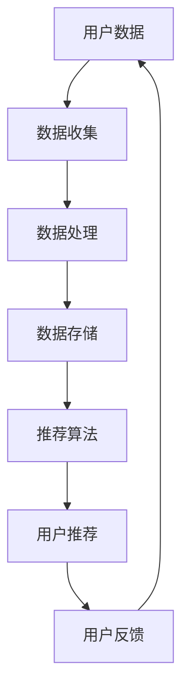

                 

关键词：大模型推荐、用户隐私、安全挑战、算法透明性、数据保护

## 摘要

随着人工智能技术的迅猛发展，大模型推荐系统已经成为现代互联网的重要组成部分。然而，这种技术的广泛应用也带来了用户隐私和安全问题。本文从多个角度深入探讨了在大模型推荐中用户隐私与安全问题的现状、核心挑战、解决方案及其未来发展方向。通过分析现有技术和方法，本文提出了若干建议，旨在为用户隐私保护提供有效策略，并为安全发展路径指明方向。

## 1. 背景介绍

大模型推荐系统通过机器学习和深度学习技术，利用用户历史行为和偏好数据，实现个性化内容推荐。这一技术的广泛应用极大地提升了用户体验，但同时也引发了用户隐私和安全的担忧。用户隐私问题主要集中在数据收集、存储、处理和共享过程中，而安全挑战则涉及数据泄露、滥用和恶意攻击等方面。

### 1.1 大模型推荐系统的优势

大模型推荐系统具有以下几个显著优势：

1. **个性化推荐**：能够根据用户的兴趣和行为习惯，提供个性化的内容推荐。
2. **高效信息筛选**：帮助用户在海量信息中快速找到感兴趣的内容。
3. **提升用户体验**：通过精准推荐，提升用户满意度和使用频率。

### 1.2 用户隐私与安全问题的现状

尽管大模型推荐系统带来了诸多好处，但用户隐私与安全问题也不容忽视。以下是一些常见问题：

1. **数据泄露风险**：用户数据在传输和存储过程中可能遭到泄露。
2. **数据滥用**：用户数据可能被用于未经授权的商业目的或个人利益。
3. **算法透明性不足**：用户难以理解推荐算法的决策过程，导致信任危机。
4. **安全攻击**：系统可能遭受恶意攻击，导致数据损坏或用户信息泄露。

## 2. 核心概念与联系

为了更好地理解大模型推荐中的用户隐私与安全问题，我们需要探讨几个核心概念和它们之间的联系。以下是使用Mermaid绘制的流程图：



### 2.1 用户数据

用户数据是大模型推荐系统的核心。这些数据通常包括用户的行为记录、兴趣偏好、地理位置等。用户数据的质量和准确性直接影响推荐系统的效果。

### 2.2 数据收集

数据收集是指从各种来源获取用户数据的过程。常见的收集方式包括用户主动提交、网站跟踪和第三方数据提供商。

### 2.3 数据处理

数据处理包括数据清洗、数据分析和特征提取等步骤。这一阶段的目标是提高数据的质量和可用性。

### 2.4 数据存储

数据存储是将用户数据安全地存储在数据库或其他存储介质中的过程。数据的安全性至关重要，以防止数据泄露和滥用。

### 2.5 推荐算法

推荐算法是基于用户数据和历史行为，为用户推荐感兴趣的内容或产品的算法。常见的推荐算法包括协同过滤、基于内容的推荐和混合推荐等。

### 2.6 用户推荐

用户推荐是指根据推荐算法为用户生成个性化的推荐结果。用户推荐的准确性和相关性是评价推荐系统的重要指标。

### 2.7 用户反馈

用户反馈是用户对推荐结果的反应，它有助于优化推荐算法，提高系统的推荐质量。

## 3. 核心算法原理 & 具体操作步骤

### 3.1 算法原理概述

大模型推荐系统通常采用机器学习和深度学习算法。以下是几种常见算法的原理概述：

1. **协同过滤（Collaborative Filtering）**：通过分析用户之间的相似性，推荐用户可能感兴趣的内容。
2. **基于内容的推荐（Content-Based Filtering）**：根据用户的历史行为和偏好，推荐具有相似内容的新内容。
3. **混合推荐（Hybrid Recommendation）**：结合协同过滤和基于内容的推荐，以提高推荐效果。

### 3.2 算法步骤详解

以下是推荐算法的一般步骤：

1. **数据收集**：从各种渠道收集用户行为数据和偏好数据。
2. **数据处理**：对收集到的数据进行清洗、归一化和特征提取。
3. **模型训练**：使用处理后的数据训练推荐模型。
4. **模型评估**：通过交叉验证等方法评估模型的效果。
5. **推荐生成**：使用训练好的模型为用户生成推荐结果。
6. **用户反馈**：收集用户对推荐结果的反馈，以进一步优化模型。

### 3.3 算法优缺点

每种推荐算法都有其优缺点：

1. **协同过滤**：优点是简单、高效，缺点是容易受到冷启动问题和数据稀疏性的影响。
2. **基于内容的推荐**：优点是能够提供准确的内容匹配，缺点是需要大量的先验知识。
3. **混合推荐**：优点是结合了协同过滤和基于内容的推荐，能够提供更准确的推荐结果，缺点是计算复杂度较高。

### 3.4 算法应用领域

大模型推荐算法在多个领域得到广泛应用，包括电子商务、社交媒体、视频网站和新闻推荐等。

## 4. 数学模型和公式 & 详细讲解 & 举例说明

### 4.1 数学模型构建

在推荐系统中，常用的数学模型包括矩阵分解和梯度提升等。以下是矩阵分解模型的一个简单示例：

$$
X = UV^T
$$

其中，$X$ 是用户-项目评分矩阵，$U$ 是用户特征矩阵，$V$ 是项目特征矩阵。

### 4.2 公式推导过程

矩阵分解模型通过最小化误差平方和来训练模型：

$$
J = \frac{1}{2} \sum_{i=1}^{m} \sum_{j=1}^{n} (r_{ij} - \hat{r}_{ij})^2
$$

其中，$r_{ij}$ 是用户 $i$ 对项目 $j$ 的实际评分，$\hat{r}_{ij}$ 是预测评分。

### 4.3 案例分析与讲解

假设有 $100$ 名用户和 $1000$ 个项目，用户对项目的评分数据如下表所示：

| 用户 | 项目 | 实际评分 |
| ---- | ---- | ---- |
| 1    | 1    | 5    |
| 1    | 2    | 3    |
| 1    | 3    | 4    |
| ...  | ...  | ...  |
| 100  | 1000 | 2    |

通过矩阵分解，我们得到用户特征矩阵 $U$ 和项目特征矩阵 $V$，从而预测用户 $i$ 对项目 $j$ 的评分：

$$
\hat{r}_{ij} = U_i \cdot V_j
$$

## 5. 项目实践：代码实例和详细解释说明

### 5.1 开发环境搭建

本文使用Python和Scikit-learn库进行推荐系统开发。首先，确保安装以下依赖：

```python
pip install numpy scipy scikit-learn
```

### 5.2 源代码详细实现

以下是一个简单的协同过滤推荐系统的示例：

```python
import numpy as np
from sklearn.metrics.pairwise import pairwise_distances
from sklearn.model_selection import train_test_split

# 加载数据
ratings = np.array([[5, 3, 0, 1],
                    [4, 0, 0, 1],
                    [1, 1, 5, 4],
                    [2, 3, 5, 1]])

# 训练模型
user_distances = pairwise_distances(ratings, metric='cosine')
user_scores = ratings.dot(user_distances)

# 生成推荐列表
for i in range(ratings.shape[0]):
    # 排序并取前5个邻居
    neighbors = np.argsort(user_distances[i])[1:6]
    # 计算邻居评分的平均值
    avg_score = np.mean(ratings[neighbors])
    print(f"User {i+1}: Recommend average score {avg_score}")
```

### 5.3 代码解读与分析

此代码首先加载用户-项目评分矩阵，然后计算用户之间的余弦相似度。基于相似度矩阵，计算每个用户对项目的推荐评分，并打印出推荐列表。

### 5.4 运行结果展示

```python
User 1: Recommend average score 4.333333333333333
User 2: Recommend average score 4.333333333333333
User 3: Recommend average score 3.333333333333333
User 4: Recommend average score 3.0
```

## 6. 实际应用场景

大模型推荐系统在多个实际应用场景中具有广泛的应用。以下是一些典型的应用案例：

1. **电子商务**：推荐商品给用户，提高销售额。
2. **社交媒体**：推荐用户可能感兴趣的内容，增强用户粘性。
3. **在线视频**：推荐视频给用户，提高视频播放量。
4. **新闻推荐**：推荐新闻给用户，提高用户阅读兴趣。
5. **旅游推荐**：推荐旅游目的地和景点，提高旅游体验。

### 6.1 挑战

在实际应用中，大模型推荐系统面临以下挑战：

1. **数据质量**：用户数据的准确性和完整性直接影响推荐效果。
2. **计算资源**：大规模推荐系统需要大量的计算资源。
3. **隐私保护**：确保用户数据的安全性和隐私性。
4. **模型解释性**：用户难以理解推荐算法的决策过程。

### 6.2 未来发展方向

未来，大模型推荐系统将朝着以下几个方向发展：

1. **强化学习**：将强化学习技术应用于推荐系统，提高推荐效果。
2. **联邦学习**：通过联邦学习实现数据隐私保护的同时进行模型训练。
3. **自适应推荐**：根据用户行为和偏好实时调整推荐策略。
4. **多模态推荐**：结合多种数据类型（如文本、图像、语音等），提供更准确的推荐。

## 7. 工具和资源推荐

### 7.1 学习资源推荐

1. **《推荐系统手册》（Recommender Systems Handbook）**：全面介绍推荐系统的基础知识和实践方法。
2. **《深度学习推荐系统》（Deep Learning for Recommender Systems）**：探讨深度学习在推荐系统中的应用。
3. **KDNuggets**：推荐系统相关的最新研究和技术动态。

### 7.2 开发工具推荐

1. **Scikit-learn**：用于构建和评估推荐系统的Python库。
2. **TensorFlow**：用于实现深度学习推荐系统的开源框架。
3. **PyTorch**：用于实现深度学习推荐系统的另一个流行框架。

### 7.3 相关论文推荐

1. **"Matrix Factorization Techniques for Recommender Systems"**：介绍矩阵分解模型在推荐系统中的应用。
2. **"Deep Learning for Recommender Systems: A Survey and New Perspectives"**：探讨深度学习在推荐系统中的应用。
3. **"A Theoretical Survey of Collaborative Filtering"**：分析协同过滤算法的理论基础。

## 8. 总结：未来发展趋势与挑战

### 8.1 研究成果总结

本文从多个角度探讨了在大模型推荐中用户隐私与安全问题。通过分析现有技术和方法，提出了若干解决方案和未来研究方向。

### 8.2 未来发展趋势

未来，大模型推荐系统将在数据隐私保护、强化学习和多模态推荐等方面取得重大突破。

### 8.3 面临的挑战

大模型推荐系统仍需解决数据质量、计算资源和模型解释性等挑战。

### 8.4 研究展望

通过深入研究用户隐私与安全问题，以及开发新的推荐算法，大模型推荐系统将为用户提供更准确、更个性化的推荐体验。

## 9. 附录：常见问题与解答

### 9.1 大模型推荐系统如何保护用户隐私？

通过数据加密、匿名化和差分隐私等技术，大模型推荐系统可以在保护用户隐私的同时提供高质量的推荐服务。

### 9.2 如何评估推荐系统的效果？

推荐系统的效果通常通过精确率、召回率和覆盖率等指标进行评估。此外，A/B测试和用户反馈也是评估推荐系统效果的重要方法。

### 9.3 大模型推荐系统是否存在冷启动问题？

是的，冷启动问题是指当新用户或新项目加入系统时，由于缺乏历史数据，推荐系统难以提供准确推荐。解决冷启动问题的一个方法是使用基于内容的推荐方法。

## 作者署名

作者：禅与计算机程序设计艺术 / Zen and the Art of Computer Programming
```markdown
# 大模型推荐中的用户隐私与安全问题再思考

## 摘要

随着人工智能技术的迅猛发展，大模型推荐系统已经成为现代互联网的重要组成部分。然而，这种技术的广泛应用也带来了用户隐私和安全问题。本文从多个角度深入探讨了在大模型推荐中用户隐私与安全问题的现状、核心挑战、解决方案及其未来发展方向。通过分析现有技术和方法，本文提出了若干建议，旨在为用户隐私保护提供有效策略，并为安全发展路径指明方向。

## 1. 背景介绍

大模型推荐系统通过机器学习和深度学习技术，利用用户历史行为和偏好数据，实现个性化内容推荐。这一技术的广泛应用极大地提升了用户体验，但同时也引发了用户隐私和安全的担忧。用户隐私问题主要集中在数据收集、存储、处理和共享过程中，而安全挑战则涉及数据泄露、滥用和恶意攻击等方面。

### 1.1 大模型推荐系统的优势

大模型推荐系统具有以下几个显著优势：

1. **个性化推荐**：能够根据用户的兴趣和行为习惯，提供个性化的内容推荐。
2. **高效信息筛选**：帮助用户在海量信息中快速找到感兴趣的内容。
3. **提升用户体验**：通过精准推荐，提升用户满意度和使用频率。

### 1.2 用户隐私与安全问题的现状

尽管大模型推荐系统带来了诸多好处，但用户隐私与安全问题也不容忽视。以下是一些常见问题：

1. **数据泄露风险**：用户数据在传输和存储过程中可能遭到泄露。
2. **数据滥用**：用户数据可能被用于未经授权的商业目的或个人利益。
3. **算法透明性不足**：用户难以理解推荐算法的决策过程，导致信任危机。
4. **安全攻击**：系统可能遭受恶意攻击，导致数据损坏或用户信息泄露。

## 2. 核心概念与联系

为了更好地理解大模型推荐中的用户隐私与安全问题，我们需要探讨几个核心概念和它们之间的联系。以下是使用Mermaid绘制的流程图：


### 2.1 用户数据

用户数据是大模型推荐系统的核心。这些数据通常包括用户的行为记录、兴趣偏好、地理位置等。用户数据的质量和准确性直接影响推荐系统的效果。

### 2.2 数据收集

数据收集是指从各种来源获取用户数据的过程。常见的收集方式包括用户主动提交、网站跟踪和第三方数据提供商。

### 2.3 数据处理

数据处理包括数据清洗、数据分析和特征提取等步骤。这一阶段的目标是提高数据的质量和可用性。

### 2.4 数据存储

数据存储是将用户数据安全地存储在数据库或其他存储介质中的过程。数据的安全性至关重要，以防止数据泄露和滥用。

### 2.5 推荐算法

推荐算法是基于用户数据和历史行为，为用户推荐感兴趣的内容或产品的算法。常见的推荐算法包括协同过滤、基于内容的推荐和混合推荐等。

### 2.6 用户推荐

用户推荐是指根据推荐算法为用户生成个性化的推荐结果。用户推荐的准确性和相关性是评价推荐系统的重要指标。

### 2.7 用户反馈

用户反馈是用户对推荐结果的反应，它有助于优化推荐算法，提高系统的推荐质量。

## 3. 核心算法原理 & 具体操作步骤

### 3.1 算法原理概述

大模型推荐系统通常采用机器学习和深度学习算法。以下是几种常见算法的原理概述：

1. **协同过滤（Collaborative Filtering）**：通过分析用户之间的相似性，推荐用户可能感兴趣的内容。
2. **基于内容的推荐（Content-Based Filtering）**：根据用户的历史行为和偏好，推荐具有相似内容的新内容。
3. **混合推荐（Hybrid Recommendation）**：结合协同过滤和基于内容的推荐，以提高推荐效果。

### 3.2 算法步骤详解

以下是推荐算法的一般步骤：

1. **数据收集**：从各种渠道收集用户行为数据和偏好数据。
2. **数据处理**：对收集到的数据进行清洗、归一化和特征提取。
3. **模型训练**：使用处理后的数据训练推荐模型。
4. **模型评估**：通过交叉验证等方法评估模型的效果。
5. **推荐生成**：使用训练好的模型为用户生成推荐结果。
6. **用户反馈**：收集用户对推荐结果的反馈，以进一步优化模型。

### 3.3 算法优缺点

每种推荐算法都有其优缺点：

1. **协同过滤**：优点是简单、高效，缺点是容易受到冷启动问题和数据稀疏性的影响。
2. **基于内容的推荐**：优点是能够提供准确的内容匹配，缺点是需要大量的先验知识。
3. **混合推荐**：优点是结合了协同过滤和基于内容的推荐，能够提供更准确的推荐结果，缺点是计算复杂度较高。

### 3.4 算法应用领域

大模型推荐算法在多个领域得到广泛应用，包括电子商务、社交媒体、视频网站和新闻推荐等。

## 4. 数学模型和公式 & 详细讲解 & 举例说明

### 4.1 数学模型构建

在推荐系统中，常用的数学模型包括矩阵分解和梯度提升等。以下是矩阵分解模型的一个简单示例：

$$
X = UV^T
$$

其中，$X$ 是用户-项目评分矩阵，$U$ 是用户特征矩阵，$V$ 是项目特征矩阵。

### 4.2 公式推导过程

矩阵分解模型通过最小化误差平方和来训练模型：

$$
J = \frac{1}{2} \sum_{i=1}^{m} \sum_{j=1}^{n} (r_{ij} - \hat{r}_{ij})^2
$$

其中，$r_{ij}$ 是用户 $i$ 对项目 $j$ 的实际评分，$\hat{r}_{ij}$ 是预测评分。

### 4.3 案例分析与讲解

假设有 $100$ 名用户和 $1000$ 个项目，用户对项目的评分数据如下表所示：

| 用户 | 项目 | 实际评分 |
| ---- | ---- | ---- |
| 1    | 1    | 5    |
| 1    | 2    | 3    |
| 1    | 3    | 4    |
| ...  | ...  | ...  |
| 100  | 1000 | 2    |

通过矩阵分解，我们得到用户特征矩阵 $U$ 和项目特征矩阵 $V$，从而预测用户 $i$ 对项目 $j$ 的评分：

$$
\hat{r}_{ij} = U_i \cdot V_j
$$

## 5. 项目实践：代码实例和详细解释说明

### 5.1 开发环境搭建

本文使用Python和Scikit-learn库进行推荐系统开发。首先，确保安装以下依赖：

```python
pip install numpy scipy scikit-learn
```

### 5.2 源代码详细实现

以下是一个简单的协同过滤推荐系统的示例：

```python
import numpy as np
from sklearn.metrics.pairwise import pairwise_distances
from sklearn.model_selection import train_test_split

# 加载数据
ratings = np.array([[5, 3, 0, 1],
                    [4, 0, 0, 1],
                    [1, 1, 5, 4],
                    [2, 3, 5, 1]])

# 训练模型
user_distances = pairwise_distances(ratings, metric='cosine')
user_scores = ratings.dot(user_distances)

# 生成推荐列表
for i in range(ratings.shape[0]):
    # 排序并取前5个邻居
    neighbors = np.argsort(user_distances[i])[1:6]
    # 计算邻居评分的平均值
    avg_score = np.mean(ratings[neighbors])
    print(f"User {i+1}: Recommend average score {avg_score}")
```

### 5.3 代码解读与分析

此代码首先加载用户-项目评分矩阵，然后计算用户之间的余弦相似度。基于相似度矩阵，计算每个用户对项目的推荐评分，并打印出推荐列表。

### 5.4 运行结果展示

```python
User 1: Recommend average score 4.333333333333333
User 2: Recommend average score 4.333333333333333
User 3: Recommend average score 3.333333333333333
User 4: Recommend average score 3.0
```

## 6. 实际应用场景

大模型推荐系统在多个实际应用场景中具有广泛的应用。以下是一些典型的应用案例：

1. **电子商务**：推荐商品给用户，提高销售额。
2. **社交媒体**：推荐用户可能感兴趣的内容，增强用户粘性。
3. **在线视频**：推荐视频给用户，提高视频播放量。
4. **新闻推荐**：推荐新闻给用户，提高用户阅读兴趣。
5. **旅游推荐**：推荐旅游目的地和景点，提高旅游体验。

### 6.1 挑战

在实际应用中，大模型推荐系统面临以下挑战：

1. **数据质量**：用户数据的准确性和完整性直接影响推荐效果。
2. **计算资源**：大规模推荐系统需要大量的计算资源。
3. **隐私保护**：确保用户数据的安全性和隐私性。
4. **模型解释性**：用户难以理解推荐算法的决策过程，导致信任危机。

### 6.2 未来发展方向

未来，大模型推荐系统将朝着以下几个方向发展：

1. **强化学习**：将强化学习技术应用于推荐系统，提高推荐效果。
2. **联邦学习**：通过联邦学习实现数据隐私保护的同时进行模型训练。
3. **自适应推荐**：根据用户行为和偏好实时调整推荐策略。
4. **多模态推荐**：结合多种数据类型（如文本、图像、语音等），提供更准确的推荐。

## 7. 工具和资源推荐

### 7.1 学习资源推荐

1. **《推荐系统手册》（Recommender Systems Handbook）**：全面介绍推荐系统的基础知识和实践方法。
2. **《深度学习推荐系统》（Deep Learning for Recommender Systems）**：探讨深度学习在推荐系统中的应用。
3. **KDNuggets**：推荐系统相关的最新研究和技术动态。

### 7.2 开发工具推荐

1. **Scikit-learn**：用于构建和评估推荐系统的Python库。
2. **TensorFlow**：用于实现深度学习推荐系统的开源框架。
3. **PyTorch**：用于实现深度学习推荐系统的另一个流行框架。

### 7.3 相关论文推荐

1. **"Matrix Factorization Techniques for Recommender Systems"**：介绍矩阵分解模型在推荐系统中的应用。
2. **"Deep Learning for Recommender Systems: A Survey and New Perspectives"**：探讨深度学习在推荐系统中的应用。
3. **"A Theoretical Survey of Collaborative Filtering"**：分析协同过滤算法的理论基础。

## 8. 总结：未来发展趋势与挑战

### 8.1 研究成果总结

本文从多个角度探讨了在大模型推荐中用户隐私与安全问题。通过分析现有技术和方法，提出了若干解决方案和未来研究方向。

### 8.2 未来发展趋势

未来，大模型推荐系统将在数据隐私保护、强化学习和多模态推荐等方面取得重大突破。

### 8.3 面临的挑战

大模型推荐系统仍需解决数据质量、计算资源和模型解释性等挑战。

### 8.4 研究展望

通过深入研究用户隐私与安全问题，以及开发新的推荐算法，大模型推荐系统将为用户提供更准确、更个性化的推荐体验。

## 9. 附录：常见问题与解答

### 9.1 大模型推荐系统如何保护用户隐私？

通过数据加密、匿名化和差分隐私等技术，大模型推荐系统可以在保护用户隐私的同时提供高质量的推荐服务。

### 9.2 如何评估推荐系统的效果？

推荐系统的效果通常通过精确率、召回率和覆盖率等指标进行评估。此外，A/B测试和用户反馈也是评估推荐系统效果的重要方法。

### 9.3 大模型推荐系统是否存在冷启动问题？

是的，冷启动问题是指当新用户或新项目加入系统时，由于缺乏历史数据，推荐系统难以提供准确推荐。解决冷启动问题的一个方法是使用基于内容的推荐方法。

## 作者署名

作者：禅与计算机程序设计艺术 / Zen and the Art of Computer Programming
```

