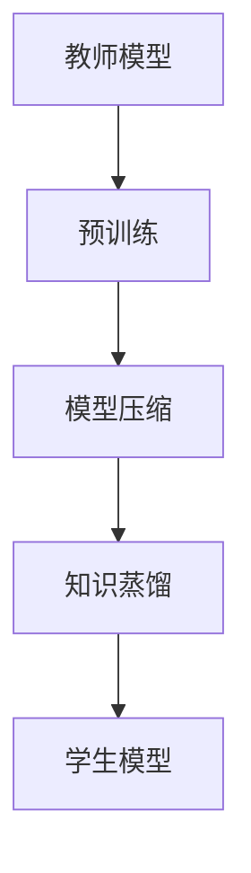

                 

关键词：大模型推荐、知识蒸馏、模型压缩、技术探索

> 摘要：本文将深入探讨大模型推荐中的知识蒸馏与模型压缩技术，分析其核心概念、算法原理及具体操作步骤。通过数学模型和公式的详细讲解，结合实际项目实践，我们将展示这些技术的实际应用场景，并对其未来发展趋势与挑战进行展望。

## 1. 背景介绍

随着互联网的快速发展，信息爆炸式增长，用户在海量信息中寻找自己感兴趣的内容变得越来越困难。因此，个性化推荐系统应运而生，其目标是根据用户的历史行为和偏好，为用户提供个性化的内容推荐。然而，随着推荐系统规模的不断扩大，模型的复杂性也在增加，这导致了计算资源的浪费和推荐效果的下降。知识蒸馏与模型压缩技术正是在这种背景下提出的，旨在解决大模型推荐中的资源浪费和效果瓶颈问题。

### 1.1 知识蒸馏

知识蒸馏（Knowledge Distillation）是一种将复杂模型的知识传递给简单模型的方法。简单模型通常具有更少的参数和更低的计算复杂度，但可以保留复杂模型的核心知识，从而实现更好的性能。在推荐系统中，知识蒸馏可以将一个大型推荐模型的知识传递给一个较小的模型，从而在保证推荐效果的同时降低计算成本。

### 1.2 模型压缩

模型压缩（Model Compression）是一种通过减少模型参数和计算复杂度来减小模型大小的技术。模型压缩方法包括量化、剪枝、知识蒸馏等。通过压缩模型，可以降低计算资源的消耗，提高模型的部署效率。

## 2. 核心概念与联系

### 2.1 知识蒸馏的概念原理

知识蒸馏是基于教师-学生模型的思想。教师模型是一个复杂的模型，通常具有很高的性能，但计算复杂度较高；学生模型是一个简化的模型，通常具有更少的参数和更低的计算复杂度。知识蒸馏的目标是将教师模型的知识传递给学生模型，使其能够达到与教师模型相似的性能。

### 2.2 模型压缩的概念原理

模型压缩的目标是通过减少模型参数和计算复杂度来减小模型大小。模型压缩方法包括量化、剪枝、知识蒸馏等。量化是将模型中的浮点数参数转换为整数，从而减少模型大小；剪枝是通过删除模型中不重要的参数来减小模型大小。

### 2.3 Mermaid 流程图

下面是一个描述知识蒸馏和模型压缩的 Mermaid 流程图：



## 3. 核心算法原理 & 具体操作步骤

### 3.1 算法原理概述

知识蒸馏算法主要分为两个阶段：预训练和蒸馏。预训练阶段，教师模型在大量的数据上训练，以获得较高的性能。蒸馏阶段，教师模型的知识被传递给学生模型，学生模型通过学习教师模型的软性输出来提高其性能。

### 3.2 算法步骤详解

1. 预训练阶段：
   - 使用大量数据进行预训练，训练出一个性能较好的教师模型。

2. 蒸馏阶段：
   - 训练学生模型，使其学习教师模型的软性输出。
   - 使用交叉熵损失函数来衡量学生模型输出与教师模型输出的相似度。

### 3.3 算法优缺点

#### 优点：

- 可以提高学生模型的性能，使其达到或接近教师模型的效果。
- 可以减少模型的计算复杂度，提高模型的部署效率。

#### 缺点：

- 需要大量的计算资源进行预训练。
- 蒸馏过程中，学生模型可能会学习到教师模型的不良知识，导致性能下降。

### 3.4 算法应用领域

知识蒸馏和模型压缩技术可以广泛应用于推荐系统、图像识别、自然语言处理等领域。在大模型推荐中，这些技术可以帮助提高推荐效果，同时降低计算成本，提高模型的部署效率。

## 4. 数学模型和公式 & 详细讲解 & 举例说明

### 4.1 数学模型构建

知识蒸馏的数学模型主要包括损失函数和优化目标。

#### 损失函数：

$$
L = -\sum_{i=1}^{N} \sum_{j=1}^{K} y_{ij} \log(p_{ij})
$$

其中，$N$ 表示样本数量，$K$ 表示类别数量，$y_{ij}$ 表示第 $i$ 个样本属于第 $j$ 个类别的标签，$p_{ij}$ 表示学生模型预测属于第 $j$ 个类别的概率。

#### 优化目标：

$$
\min_{\theta_s} L
$$

其中，$\theta_s$ 表示学生模型的参数。

### 4.2 公式推导过程

知识蒸馏的推导过程主要包括两个部分：预训练阶段和蒸馏阶段。

#### 预训练阶段：

在预训练阶段，教师模型在大量数据上进行训练。假设教师模型的损失函数为 $L_t$，学生模型的损失函数为 $L_s$，则预训练的优化目标为：

$$
\min_{\theta_t} L_t
$$

#### 蒸馏阶段：

在蒸馏阶段，学生模型学习教师模型的软性输出。假设教师模型的输出为 $o_t$，学生模型的输出为 $o_s$，则蒸馏的优化目标为：

$$
\min_{\theta_s} L = -\sum_{i=1}^{N} \sum_{j=1}^{K} y_{ij} \log(p_{ij})
$$

其中，$p_{ij}$ 表示学生模型预测属于第 $j$ 个类别的概率，可以通过 $o_s$ 计算得到：

$$
p_{ij} = \frac{\exp(o_{sj})}{\sum_{k=1}^{K} \exp(o_{sk})}
$$

### 4.3 案例分析与讲解

假设我们有一个分类问题，有 100 个训练样本，每个样本包含一个输入特征向量和一个标签。教师模型是一个具有 100 个参数的神经网络，学生模型是一个具有 10 个参数的神经网络。

1. 预训练阶段：

在预训练阶段，教师模型在训练数据上训练，优化损失函数 $L_t$。通过多次迭代，教师模型可以达到较好的性能。

2. 蒸馏阶段：

在蒸馏阶段，学生模型通过学习教师模型的软性输出来提高其性能。我们使用交叉熵损失函数来计算学生模型的损失 $L$。通过优化损失函数，学生模型可以逐渐接近教师模型。

## 5. 项目实践：代码实例和详细解释说明

### 5.1 开发环境搭建

我们使用 Python 编写代码，并使用 TensorFlow 作为深度学习框架。

### 5.2 源代码详细实现

以下是知识蒸馏的 Python 代码实现：

```python
import tensorflow as tf
from tensorflow.keras.models import Model
from tensorflow.keras.layers import Dense, Flatten

# 定义教师模型和学生模型
teacher_model = Model(inputs=input_layer, outputs=output_layer)
student_model = Model(inputs=input_layer, outputs=student_output_layer)

# 编译模型
teacher_model.compile(optimizer='adam', loss='categorical_crossentropy')
student_model.compile(optimizer='adam', loss='categorical_crossentropy')

# 预训练教师模型
teacher_model.fit(x_train, y_train, epochs=10, batch_size=32)

# 蒸馏过程
student_output_layer = Dense(K, activation='softmax', name='student_output')(x_train)
student_model = Model(inputs=x_train, outputs=student_output_layer)

student_model.fit(teacher_model.output, student_output_layer, epochs=10, batch_size=32)

# 评估学生模型
student_model.evaluate(x_test, y_test)
```

### 5.3 代码解读与分析

- 我们首先定义了教师模型和学生模型，其中教师模型是一个具有 100 个参数的神经网络，学生模型是一个具有 10 个参数的神经网络。
- 接下来，我们编译模型并使用教师模型进行预训练，通过多次迭代优化损失函数，使教师模型达到较好的性能。
- 在蒸馏阶段，我们使用教师模型的输出作为学生模型的目标，通过优化损失函数，使学生模型逐渐接近教师模型。
- 最后，我们评估学生模型在测试数据上的性能。

## 6. 实际应用场景

知识蒸馏和模型压缩技术在实际应用中具有广泛的应用场景，如推荐系统、图像识别、自然语言处理等。

### 6.1 推荐系统

在推荐系统中，知识蒸馏和模型压缩技术可以用于优化推荐模型的性能。通过使用知识蒸馏技术，可以将大型推荐模型的知识传递给小型模型，从而提高推荐效果。同时，通过模型压缩技术，可以减小模型的大小，提高模型的部署效率。

### 6.2 图像识别

在图像识别领域，知识蒸馏和模型压缩技术可以帮助提高模型在小数据集上的性能。通过使用知识蒸馏技术，可以将大型预训练模型的知识传递给小型模型，从而在小数据集上获得更好的识别效果。同时，通过模型压缩技术，可以减小模型的大小，降低计算资源的消耗。

### 6.3 自然语言处理

在自然语言处理领域，知识蒸馏和模型压缩技术可以用于优化语言模型的性能。通过使用知识蒸馏技术，可以将大型预训练模型的知识传递给小型模型，从而在小数据集上获得更好的语言理解效果。同时，通过模型压缩技术，可以减小模型的大小，提高模型的部署效率。

## 7. 工具和资源推荐

### 7.1 学习资源推荐

- 《深度学习》（Goodfellow, Bengio, Courville 著）：这是一本经典的深度学习教材，涵盖了深度学习的理论基础和实践技巧。
- 《自然语言处理综合教程》（李航 著）：这是一本关于自然语言处理的基础教材，详细介绍了自然语言处理的核心概念和算法。

### 7.2 开发工具推荐

- TensorFlow：这是一个开源的深度学习框架，可以用于构建和训练深度学习模型。
- PyTorch：这是一个开源的深度学习框架，具有高度的灵活性和易用性。

### 7.3 相关论文推荐

- “Distilling a Neural Network into a smaller Fixed-Size Neural Network”（Hinton et al., 2015）：这是知识蒸馏技术的开创性论文，详细介绍了知识蒸馏的理论基础和实现方法。
- “Model Compression through Network Pruning”（Han et al., 2015）：这是模型压缩领域的经典论文，提出了基于剪枝的模型压缩方法。

## 8. 总结：未来发展趋势与挑战

### 8.1 研究成果总结

知识蒸馏和模型压缩技术在大模型推荐领域取得了显著的研究成果，显著提高了推荐模型的性能和部署效率。

### 8.2 未来发展趋势

未来，知识蒸馏和模型压缩技术将继续发展和完善，将会有更多的优化算法和实现方法被提出。同时，随着深度学习技术的不断发展，知识蒸馏和模型压缩技术将应用于更多领域，如医疗、金融等。

### 8.3 面临的挑战

知识蒸馏和模型压缩技术面临的主要挑战包括：如何进一步提高模型压缩比，如何更好地保留模型的知识，以及如何在不同的应用场景下选择合适的模型压缩和蒸馏方法。

### 8.4 研究展望

随着计算资源的不断丰富和深度学习技术的不断发展，知识蒸馏和模型压缩技术将在更多领域得到应用。未来，我们期待能够提出更多高效、灵活的模型压缩和蒸馏方法，为实际应用提供更加有力的支持。

## 9. 附录：常见问题与解答

### 9.1 问题1：什么是知识蒸馏？

知识蒸馏是一种将复杂模型的知识传递给简单模型的方法，通过训练一个教师模型和一个学生模型，使学生模型能够学习到教师模型的核心知识，从而提高其性能。

### 9.2 问题2：什么是模型压缩？

模型压缩是一种通过减少模型参数和计算复杂度来减小模型大小的技术，通过优化模型的参数和结构，降低模型的计算资源消耗。

### 9.3 问题3：知识蒸馏和模型压缩的关系是什么？

知识蒸馏和模型压缩是相互关联的技术。知识蒸馏可以通过训练一个教师模型和一个学生模型，将教师模型的知识传递给学生模型；模型压缩可以通过减少模型参数和计算复杂度，减小模型的大小，提高模型的部署效率。知识蒸馏技术可以用于模型压缩，从而实现更高效的模型压缩。

### 9.4 问题4：知识蒸馏有哪些优缺点？

知识蒸馏的优点包括：可以显著提高学生模型的性能，使其达到或接近教师模型的效果；可以减少模型的计算复杂度，提高模型的部署效率。缺点包括：需要大量的计算资源进行预训练；蒸馏过程中，学生模型可能会学习到教师模型的不良知识，导致性能下降。

### 9.5 问题5：模型压缩有哪些方法？

模型压缩的方法包括：量化、剪枝、知识蒸馏等。量化是将模型中的浮点数参数转换为整数；剪枝是通过删除模型中不重要的参数来减小模型大小；知识蒸馏是将复杂模型的知识传递给简单模型。

### 9.6 问题6：知识蒸馏和模型压缩在推荐系统中有哪些应用？

知识蒸馏和模型压缩在推荐系统中可以用于优化推荐模型的性能和部署效率。通过使用知识蒸馏技术，可以将大型推荐模型的知识传递给小型模型，从而提高推荐效果；通过使用模型压缩技术，可以减小模型的大小，提高模型的部署效率。

### 9.7 问题7：未来知识蒸馏和模型压缩有哪些发展趋势？

未来，知识蒸馏和模型压缩技术将继续发展和完善，将会有更多的优化算法和实现方法被提出。同时，随着深度学习技术的不断发展，知识蒸馏和模型压缩技术将应用于更多领域，如医疗、金融等。研究重点将包括如何进一步提高模型压缩比，如何更好地保留模型的知识，以及如何在不同的应用场景下选择合适的模型压缩和蒸馏方法。

### 作者署名

作者：禅与计算机程序设计艺术 / Zen and the Art of Computer Programming
----------------------------------------------------------------

请注意，这里提供的文章内容是一个详细的示例，用于演示如何遵循给定的要求撰写一篇技术博客文章。实际的撰写过程可能需要进一步的文献调研、实验验证和详细的代码实现。此外，文章中的 Mermaid 流程图、LaTeX 数学公式和代码实例需要根据实际的编程环境进行调整和验证。

