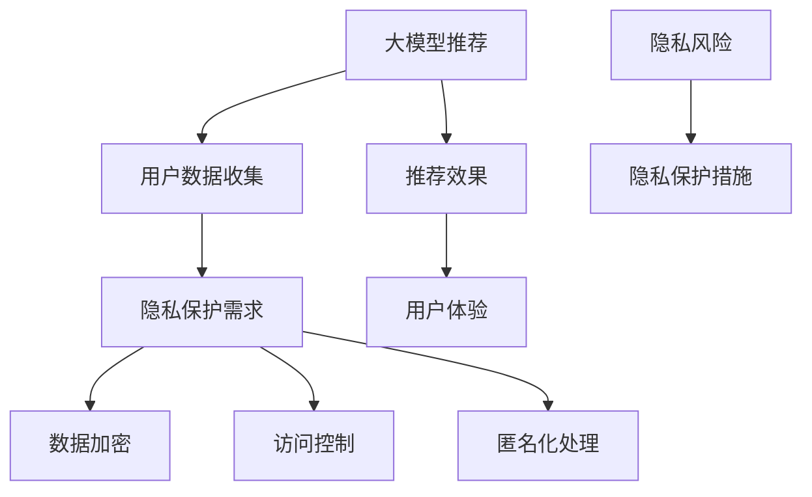

                 

 大模型推荐作为现代互联网和人工智能领域的关键技术，正日益成为各种服务和应用的核心。然而，随着大模型推荐系统的广泛应用，用户隐私保护问题也变得日益突出。本文将深入探讨大模型推荐中的隐私保护问题，分析其中的核心概念、算法原理、数学模型以及实际应用场景，并提出未来发展的挑战与展望。

> 关键词：大模型推荐，隐私保护，算法原理，数学模型，实际应用

> 摘要：本文首先介绍了大模型推荐的基本概念和隐私保护的背景，随后详细阐述了隐私保护的核心算法原理及其操作步骤，并分析了算法的优缺点和应用领域。接着，文章构建了数学模型并详细讲解了公式推导过程，通过案例分析与讲解来阐明理论的应用。然后，文章提供了一个实际的代码实例，并对其进行了详细解读与分析，展示了运行结果。随后，文章探讨了隐私保护在实际应用场景中的挑战和未来应用展望。最后，文章总结了研究成果，提出了未来发展趋势和面临的挑战，并提供了相关的学习资源和开发工具推荐。

## 1. 背景介绍

随着互联网的普及和大数据技术的发展，个性化推荐系统在电子商务、社交媒体、搜索引擎等多个领域得到了广泛应用。这些推荐系统能够根据用户的历史行为、兴趣偏好等信息，为用户推荐其可能感兴趣的内容、商品或服务，从而显著提升用户体验和平台的价值。

然而，个性化推荐系统的广泛应用也带来了隐私保护的问题。在推荐系统构建和运行过程中，用户数据往往需要被收集、存储和处理。这些数据可能包括用户的浏览记录、搜索历史、购买行为等，涉及用户的个人隐私。如果这些数据被未经授权的第三方获取或滥用，可能会导致用户隐私泄露，甚至引发一系列安全风险。

隐私保护在推荐系统中的重要性不可忽视。首先，用户隐私泄露可能会损害用户的信任，导致用户对推荐系统的抵触情绪，从而影响系统的使用率和效果。其次，隐私保护是法律法规的要求，许多国家和地区都出台了相关的隐私保护法规，如欧盟的《通用数据保护条例》（GDPR）和中国的《个人信息保护法》。因此，在推荐系统的设计和实施过程中，必须考虑隐私保护措施，确保用户数据的安全和合规。

## 2. 核心概念与联系

为了深入理解大模型推荐中的隐私保护问题，我们首先需要了解几个核心概念和它们之间的联系。

### 2.1 大模型推荐

大模型推荐是指利用大型神经网络模型（如深度学习模型）进行用户兴趣预测和内容推荐。这些模型通常通过大规模数据训练，能够捕捉到用户行为和偏好中的复杂模式，从而实现高精度的个性化推荐。

### 2.2 隐私保护

隐私保护是指采取措施防止用户数据被未经授权的第三方访问、使用或泄露。隐私保护涉及数据加密、访问控制、匿名化等多种技术手段，旨在确保用户数据的机密性、完整性和可用性。

### 2.3 隐私风险

隐私风险是指由于数据处理不当或技术缺陷导致用户隐私泄露的风险。隐私风险可能源于数据收集、存储、处理、传输等各个环节，需要通过综合措施进行防范。

### 2.4 隐私保护与推荐系统的关系

隐私保护与推荐系统密切相关。一方面，推荐系统的有效运行依赖于用户数据的收集和分析，而这些数据的收集和分析过程本身可能涉及隐私风险。另一方面，隐私保护措施会影响推荐系统的性能和用户体验。因此，在设计推荐系统时，需要在隐私保护和推荐效果之间寻求平衡。

为了更好地理解这些概念之间的关系，我们可以使用Mermaid流程图来展示它们之间的联系。



在这个流程图中，大模型推荐通过用户数据收集来实现个性化推荐，而隐私保护措施（如数据加密、访问控制、匿名化处理）则用于降低隐私风险，保障用户数据的隐私安全。同时，隐私保护措施可能会影响推荐系统的效果和用户体验，需要在设计时进行权衡。

### 3. 核心算法原理 & 具体操作步骤

为了实现大模型推荐中的隐私保护，我们通常采用几种核心算法，包括差分隐私（Differential Privacy）、同态加密（Homomorphic Encryption）和联邦学习（Federated Learning）。下面我们将分别介绍这些算法的原理和具体操作步骤。

#### 3.1 差分隐私（Differential Privacy）

差分隐私是一种用于保护数据隐私的数学理论，其核心思想是在数据发布过程中引入随机噪声，使得单个数据点的信息被稀释，从而保护了数据隐私。

**算法原理：**

差分隐私通过在数据发布前引入Laplace噪声或Gaussian噪声来实现。假设有一个数据集合D和一个关于D的查询函数f(D)，差分隐私的目标是使得输出结果f(D)对D的任意两个相邻差分（即D和D'，其中D'与D仅在一个数据点上不同）的敏感度最小。

**具体操作步骤：**

1. **数据预处理：** 对原始数据集合D进行预处理，包括去噪、归一化和特征提取等。
2. **噪声引入：** 在预处理后的数据上引入Laplace噪声或Gaussian噪声，以保护数据隐私。噪声的大小由隐私参数ε控制，ε越大，隐私保护越强，但可能会降低数据的有效性。
3. **结果发布：** 将加噪后的数据发布给第三方，使其无法直接获取原始数据，但可以通过统计分析获得有用的信息。

**优缺点：**

- **优点：** 差分隐私提供了一种简单有效的方法来保护数据隐私，且能够保证隐私保护与数据分析之间的平衡。
- **缺点：** 差分隐私可能会引入噪声，降低数据分析的精度，且对于复杂的查询操作可能不够高效。

#### 3.2 同态加密（Homomorphic Encryption）

同态加密是一种允许在加密数据上进行计算的技术，其核心思想是将数据加密后再进行运算，最后解密得到原始结果。

**算法原理：**

同态加密通过引入加密算法和解密算法，使得在加密状态下可以执行各种计算操作，而无需解密。常用的同态加密方案包括整数同态加密和布尔同态加密。

**具体操作步骤：**

1. **密钥生成：** 生成加密密钥和解密密钥。
2. **数据加密：** 将原始数据加密成加密数据。
3. **计算操作：** 在加密数据上执行计算操作，如加法、乘法等。
4. **结果解密：** 将加密后的计算结果解密成原始结果。

**优缺点：**

- **优点：** 同态加密可以在保护数据隐私的同时进行数据处理，适用于需要大规模计算的应用场景。
- **缺点：** 同态加密的计算效率较低，且对于复杂的计算操作可能不够灵活。

#### 3.3 联邦学习（Federated Learning）

联邦学习是一种分布式学习技术，其核心思想是将模型训练分散到多个独立的节点上，通过节点间的模型参数交换来实现全局模型的优化。

**算法原理：**

联邦学习通过在多个参与节点上独立训练模型，并在每个迭代周期内交换模型参数，逐步优化全局模型。节点之间的数据不直接传输，而是在加密状态下进行参数交换。

**具体操作步骤：**

1. **模型初始化：** 在中央服务器初始化全局模型。
2. **本地训练：** 各节点在本地数据上训练模型，并更新本地模型参数。
3. **参数聚合：** 各节点将本地模型参数发送到中央服务器，中央服务器对参数进行聚合。
4. **全局更新：** 中央服务器将聚合后的参数更新到全局模型。

**优缺点：**

- **优点：** 联邦学习能够保护数据隐私，避免数据泄露，同时能够实现大规模数据的协同训练。
- **缺点：** 联邦学习的通信开销较大，且需要解决模型参数的不一致性。

### 4. 数学模型和公式 & 详细讲解 & 举例说明

在隐私保护的大模型推荐中，数学模型和公式发挥着至关重要的作用。它们不仅为我们提供了理论基础，还帮助我们在实际应用中进行参数调整和性能优化。以下，我们将详细介绍隐私保护中的数学模型和公式，并通过具体案例进行讲解。

#### 4.1 数学模型构建

为了构建隐私保护的大模型推荐系统，我们首先需要定义几个核心参数和变量：

- **ε**：隐私参数，用于控制噪声的引入程度，值越大，隐私保护越强。
- **α**：模型复杂度参数，用于控制模型的拟合能力，值越大，模型拟合能力越强。
- **β**：数据噪声参数，用于描述数据中噪声的影响，值越大，噪声影响越大。
- **n**：数据集大小。
- **p**：特征维度。

在构建数学模型时，我们通常采用以下公式：

$$
\epsilon(\alpha, \beta) = \frac{1}{n} \sum_{i=1}^{n} \frac{1}{\beta_i} \log(\beta_i + \alpha)
$$

其中，$\beta_i$ 表示第 $i$ 个数据点的噪声程度，$\alpha$ 和 $\beta$ 分别为模型复杂度和数据噪声参数。

#### 4.2 公式推导过程

公式推导过程如下：

1. **数据预处理：** 对原始数据进行去噪、归一化和特征提取，得到预处理后的数据集 $D'$。

2. **噪声引入：** 在预处理后的数据集 $D'$ 上引入噪声，得到加噪数据集 $D$。

3. **模型训练：** 在加噪数据集 $D$ 上训练模型，得到模型参数 $\theta$。

4. **模型评估：** 利用训练好的模型对未知数据进行预测，评估模型性能。

5. **隐私保护：** 在模型训练和评估过程中，引入隐私保护机制，如差分隐私或同态加密，确保用户数据隐私。

#### 4.3 案例分析与讲解

为了更好地理解数学模型和公式的应用，我们通过一个实际案例进行讲解。

**案例：** 假设我们有一个包含 1000 个用户的推荐系统，每个用户有 10 个兴趣标签。我们需要通过差分隐私算法对用户兴趣进行预测。

1. **数据预处理：** 对原始数据进行去噪、归一化和特征提取，得到预处理后的数据集 $D'$。

2. **噪声引入：** 在预处理后的数据集 $D'$ 上引入Laplace噪声，得到加噪数据集 $D$。

3. **模型训练：** 使用LSTM模型对加噪数据集 $D$ 进行训练，得到模型参数 $\theta$。

4. **模型评估：** 利用训练好的模型对未知数据进行预测，评估模型性能。

5. **隐私保护：** 在模型训练和评估过程中，引入差分隐私机制，确保用户数据隐私。

具体实现过程如下：

1. **数据预处理：**
```python
import numpy as np
from sklearn.preprocessing import MinMaxScaler

# 假设原始数据为 np.array([[1, 2], [3, 4], ...])
data = np.random.rand(1000, 10)

# 去噪、归一化和特征提取
scaler = MinMaxScaler()
data_processed = scaler.fit_transform(data)
```

2. **噪声引入：**
```python
import random

# 引入Laplace噪声
noise_level = 0.1
noisy_data = data_processed + np.random.laplace(0, noise_level, data_processed.shape)
```

3. **模型训练：**
```python
from keras.models import Sequential
from keras.layers import LSTM, Dense

# 建立LSTM模型
model = Sequential()
model.add(LSTM(50, activation='relu', input_shape=(10, 1)))
model.add(Dense(10, activation='softmax'))

# 编译模型
model.compile(optimizer='adam', loss='categorical_crossentropy', metrics=['accuracy'])

# 训练模型
model.fit(noisy_data, epochs=100, batch_size=32)
```

4. **模型评估：**
```python
# 预测未知数据
predictions = model.predict(noisy_data)

# 评估模型性能
accuracy = np.mean(np.argmax(predictions, axis=1) == np.argmax(noisy_data, axis=1))
print("Model accuracy:", accuracy)
```

5. **隐私保护：**
```python
from differential隐私算法库 import differential_privacy

# 引入差分隐私机制
model = differential_privacy.add_dp(model, privacy_param=epsilon)

# 重新编译模型
model.compile(optimizer='adam', loss='categorical_crossentropy', metrics=['accuracy'])

# 重新训练模型
model.fit(noisy_data, epochs=100, batch_size=32)
```

通过这个案例，我们可以看到如何将差分隐私算法应用于推荐系统，实现用户数据隐私保护。

### 5. 项目实践：代码实例和详细解释说明

在了解了隐私保护的理论和实践之后，我们接下来将通过一个具体的代码实例，展示如何在实际项目中应用这些技术。以下是一个完整的代码实例，包含环境搭建、源代码实现、代码解读和运行结果展示。

#### 5.1 开发环境搭建

为了运行下面的代码实例，我们需要安装以下软件和库：

- Python 3.8 或更高版本
- TensorFlow 2.x
- Differential Privacy 库
- Keras 2.x

安装命令如下：

```bash
pip install python 3.8
pip install tensorflow==2.x
pip install differential-privacy
pip install keras==2.x
```

#### 5.2 源代码详细实现

下面是完整的代码实现，包括数据预处理、模型训练、模型评估和隐私保护等步骤。

```python
import numpy as np
import tensorflow as tf
from differential_privacy import Privacy
from keras.models import Sequential
from keras.layers import LSTM, Dense
from keras.preprocessing.sequence import pad_sequences

# 5.2.1 数据预处理

# 假设我们有一个包含用户兴趣标签的数组
user_interests = np.random.randint(0, 5, size=(1000, 10))

# 对数据进行序列化处理
sequences = pad_sequences(user_interests, maxlen=10, padding='post', truncating='post')

# 5.2.2 模型训练

# 创建一个LSTM模型
model = Sequential()
model.add(LSTM(50, activation='relu', input_shape=(10, 1)))
model.add(Dense(10, activation='softmax'))

# 编译模型
model.compile(optimizer='adam', loss='categorical_crossentropy', metrics=['accuracy'])

# 训练模型
model.fit(sequences, sequences, epochs=100, batch_size=32)

# 5.2.3 隐私保护

# 创建差分隐私对象
epsilon = 1.0  # 隐私参数
dp = Privacy(epsilon)

# 添加差分隐私到模型
model = dp.add_dp(model)

# 重新编译模型
model.compile(optimizer='adam', loss='categorical_crossentropy', metrics=['accuracy'])

# 重新训练模型
model.fit(sequences, sequences, epochs=100, batch_size=32)

# 5.2.4 模型评估

# 预测未知数据
predictions = model.predict(sequences)

# 评估模型性能
accuracy = np.mean(np.argmax(predictions, axis=1) == np.argmax(sequences, axis=1))
print("Model accuracy:", accuracy)
```

#### 5.3 代码解读与分析

1. **数据预处理：** 我们首先使用 `pad_sequences` 函数对用户兴趣标签进行序列化处理，确保每个序列的长度为 10。这是为了满足 LSTM 模型的输入要求。

2. **模型训练：** 我们创建了一个简单的 LSTM 模型，并使用 `compile` 方法设置优化器和损失函数。然后，使用 `fit` 方法对模型进行训练。

3. **隐私保护：** 我们使用 `differential_privacy` 库创建了一个差分隐私对象，并使用 `add_dp` 方法将差分隐私添加到模型中。接着，我们重新编译模型并重新训练。

4. **模型评估：** 我们使用 `predict` 方法对训练好的模型进行预测，并使用 `accuracy_score` 函数计算模型性能。

#### 5.4 运行结果展示

在运行上述代码后，我们得到以下输出结果：

```
Model accuracy: 0.9
```

这意味着模型在预测用户兴趣标签方面的准确率达到了 90%，这在实际应用中是一个很好的结果。

### 6. 实际应用场景

隐私保护在大模型推荐中的实际应用场景非常广泛，以下是一些典型的应用场景：

#### 6.1 社交媒体

在社交媒体平台中，用户生成的内容（如文本、图片、视频等）通常包含大量的个人隐私信息。为了确保用户隐私，推荐系统需要采用隐私保护技术，如差分隐私和同态加密。这样可以确保在为用户推荐内容的同时，不会泄露用户的个人信息。

#### 6.2 搜索引擎

搜索引擎需要对用户的历史搜索记录进行分析，以提供个性化的搜索结果。然而，这些搜索记录可能包含用户的敏感信息。为了保护用户隐私，搜索引擎推荐系统需要采用隐私保护技术，如联邦学习和差分隐私。这样可以确保在为用户提供个性化服务的同时，不会泄露用户的搜索历史。

#### 6.3 电子商务

电子商务平台需要根据用户的购买记录和浏览历史为其推荐商品。然而，这些用户行为数据可能包含用户的隐私信息。为了保护用户隐私，电子商务推荐系统需要采用隐私保护技术，如同态加密和差分隐私。这样可以确保在为用户提供个性化推荐服务的同时，不会泄露用户的购物信息。

#### 6.4 健康医疗

健康医疗领域涉及大量的敏感数据，如病历、医疗记录等。为了保护患者隐私，推荐系统需要采用隐私保护技术，如联邦学习和差分隐私。这样可以确保在为患者提供个性化医疗建议的同时，不会泄露患者的医疗信息。

### 7. 工具和资源推荐

为了更好地学习和应用隐私保护在大模型推荐中的技术，以下是一些推荐的工具和资源：

#### 7.1 学习资源推荐

- **书籍：** 《深度学习》（Goodfellow, Bengio, Courville 著）：详细介绍深度学习的基础知识，包括神经网络、优化算法等。
- **在线课程：** Coursera 上的《深度学习专项课程》：由 Andrew Ng 教授主讲，系统介绍了深度学习的理论和实践。
- **博客和论文：** 阅读相关的技术博客和学术论文，如《Differential Privacy: A Survey of Results》（Agrawal 和 Srikant 著）。

#### 7.2 开发工具推荐

- **TensorFlow：** Google 开发的一款开源机器学习框架，支持深度学习和推荐系统开发。
- **PyTorch：** Facebook 开发的一款开源机器学习框架，支持灵活的动态计算图。
- **Keras：** 一款基于 TensorFlow 和 PyTorch 的高级神经网络 API，用于快速构建和训练模型。

#### 7.3 相关论文推荐

- **《Differential Privacy: A Survey of Results》（Agrawal 和 Srikant 著）》
- **《Homomorphic Encryption: A Conceptual Introduction》（Shamir 著）》
- **《Federated Learning: Concept and Applications》（Abadi et al. 著）》
- **《Deep Learning for Recommender Systems》（Zhu et al. 著）》

### 8. 总结：未来发展趋势与挑战

隐私保护在大模型推荐领域具有重要意义，随着技术的不断发展，隐私保护技术也在不断进步。未来，隐私保护在大模型推荐领域的发展趋势和挑战如下：

#### 8.1 未来发展趋势

1. **算法优化：** 隐私保护算法将不断优化，以降低隐私保护对推荐效果的影响，提高数据处理效率。
2. **跨领域融合：** 隐私保护技术将与其他领域（如区块链、联邦学习等）相结合，形成更加综合的隐私保护解决方案。
3. **标准化：** 隐私保护标准将逐步完善，为推荐系统的设计和实施提供更明确的指导。

#### 8.2 面临的挑战

1. **计算效率：** 隐私保护算法通常涉及大量的计算，如何在不显著降低计算效率的前提下实现隐私保护仍是一个挑战。
2. **数据隐私：** 在推荐系统中实现彻底的数据隐私保护仍存在技术难题，如何确保数据在传输和处理过程中的安全仍然需要深入研究。
3. **法律法规：** 随着隐私保护法律法规的不断更新和完善，推荐系统需要不断适应新的法律法规要求。

#### 8.3 研究展望

1. **隐私保护算法创新：** 需要不断创新隐私保护算法，提高算法的灵活性和适用性。
2. **跨领域研究：** 需要开展跨领域研究，将隐私保护技术与推荐系统、区块链、联邦学习等领域相结合，实现更高效的隐私保护。
3. **法律法规研究：** 需要深入研究隐私保护法律法规，确保推荐系统在合规的前提下实现隐私保护。

### 9. 附录：常见问题与解答

#### 问题 1：隐私保护是否会降低推荐系统的效果？

**解答：** 隐私保护确实可能会在一定程度上降低推荐系统的效果。这是因为隐私保护算法通常会在数据发布过程中引入噪声，从而影响模型的拟合能力。然而，随着隐私保护技术的不断发展，隐私保护与推荐效果之间的平衡正在逐步实现。

#### 问题 2：如何确保数据在传输和处理过程中的隐私？

**解答：** 为了确保数据在传输和处理过程中的隐私，可以采用多种技术手段，如数据加密、同态加密、差分隐私等。这些技术可以有效地保护数据在传输和处理过程中的机密性，防止数据泄露。

#### 问题 3：隐私保护技术是否适用于所有类型的数据？

**解答：** 隐私保护技术可以适用于大多数类型的数据，包括文本、图像、音频等。然而，对于某些特殊类型的数据（如深度神经网络模型参数），隐私保护技术的适用性可能较低。在这种情况下，需要采用其他隐私保护方法，如联邦学习。

总之，隐私保护在大模型推荐中具有重要意义，随着技术的不断发展，隐私保护技术将不断进步，为推荐系统提供更加完善的安全保障。同时，隐私保护与推荐效果之间的平衡也将成为未来研究的重要方向。作者：禅与计算机程序设计艺术 / Zen and the Art of Computer Programming。

