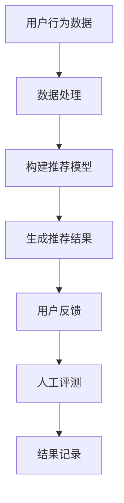

                 

关键词：大模型，推荐系统，人工评测，数据分析，算法优化

> 摘要：本文针对大模型在推荐系统中的应用进行了深入探讨，分析了现有的人工评测方法及其局限性。通过介绍核心概念与联系，阐述了评测算法原理与具体操作步骤，并基于数学模型和公式进行了详细讲解。此外，本文还通过实际项目实践，展示了代码实例和运行结果，并探讨了该方法的实际应用场景。最后，对未来的发展趋势与挑战进行了展望，并推荐了相关的学习资源和开发工具。

## 1. 背景介绍

随着互联网的迅速发展，推荐系统已经成为许多互联网公司提高用户粘性和转化率的重要手段。从早期的基于协同过滤（Collaborative Filtering）和基于内容的推荐（Content-Based Recommendation）方法，到如今的深度学习（Deep Learning）和强化学习（Reinforcement Learning）等技术，推荐系统的算法和模型不断迭代更新。

近年来，大模型（Large Models）的应用在推荐系统中引起了广泛关注。大模型通常是指拥有大量参数和强大计算能力的神经网络模型，如 Transformer 模型、BERT 模型等。这些模型在自然语言处理（Natural Language Processing）、计算机视觉（Computer Vision）等领域取得了显著成果，也逐渐在推荐系统中发挥作用。

然而，大模型的应用也带来了一系列挑战。首先，大模型通常具有很高的计算复杂度，对硬件资源的需求较高。其次，大模型的训练和调优过程需要大量的数据和计算资源，且模型的解释性较差，难以理解其内部工作机制。此外，大模型的推荐效果评价也成为一个难题，如何准确评估大模型的推荐效果，成为一个亟待解决的问题。

本文旨在探讨大模型在推荐系统中的应用，介绍现有的人工评测方法，分析其局限性，并提出一种新的评测方法。通过对评测算法的原理和具体操作步骤的详细阐述，以及数学模型和公式的讲解，本文希望为推荐系统的评测提供一种有效的解决方案。同时，本文还将通过实际项目实践，展示该方法的可行性和效果。

## 2. 核心概念与联系

### 2.1 大模型

大模型通常是指具有大量参数和强大计算能力的神经网络模型，如 Transformer 模型、BERT 模型等。这些模型通过大量的训练数据和计算资源，能够捕捉到复杂的特征和关系，从而在许多任务中取得了显著的成果。然而，大模型也存在一些问题，如计算复杂度高、解释性较差等。

### 2.2 推荐系统

推荐系统是一种信息过滤（Information Filtering）技术，旨在根据用户的历史行为、兴趣和偏好，向用户推荐其可能感兴趣的内容或商品。推荐系统通常分为基于协同过滤、基于内容的推荐和基于模型的推荐等几种类型。

### 2.3 人工评测

人工评测是一种通过人工主观判断来评估推荐系统效果的方法。这种方法具有灵活性，但受限于主观性和人力成本。人工评测通常包括用户满意度、点击率、转化率等指标。

### 2.4 Mermaid 流程图

以下是推荐系统人工评测的 Mermaid 流程图：



## 3. 核心算法原理 & 具体操作步骤

### 3.1 算法原理概述

人工评测的核心思想是通过人工主观判断来评估推荐系统的效果。具体操作步骤如下：

1. 收集用户行为数据，如浏览记录、购买记录等。
2. 对用户行为数据进行处理，如清洗、去重等。
3. 构建推荐模型，根据用户历史行为和兴趣，预测用户可能感兴趣的内容或商品。
4. 生成推荐结果，向用户展示推荐内容或商品。
5. 收集用户反馈，如点击、收藏、购买等。
6. 进行人工评测，根据用户反馈评估推荐系统的效果。
7. 记录评测结果，用于模型优化和改进。

### 3.2 算法步骤详解

1. **数据处理**：对用户行为数据进行清洗和预处理，如去除重复数据、缺失值填充等。这一步骤对于后续的推荐模型构建至关重要。

2. **构建推荐模型**：根据用户历史行为和兴趣，选择合适的推荐算法构建推荐模型。常见的推荐算法有基于协同过滤、基于内容的推荐和基于模型的推荐等。

3. **生成推荐结果**：根据推荐模型，为用户生成推荐结果。推荐结果可以是商品列表、文章列表等，根据不同的推荐场景进行调整。

4. **用户反馈**：收集用户对推荐结果的行为数据，如点击、收藏、购买等。这些反馈数据将用于后续的人工评测和模型优化。

5. **人工评测**：根据用户反馈，进行人工评测。评测指标包括用户满意度、点击率、转化率等。评测人员可以根据实际情况调整评测指标，以更准确地评估推荐系统的效果。

6. **结果记录**：记录评测结果，包括评测指标和评测人员的主观评价。这些数据将用于模型优化和改进，以提高推荐系统的效果。

### 3.3 算法优缺点

**优点**：

1. 灵活性高：人工评测可以根据实际情况灵活调整评测指标，更贴近用户需求。
2. 适用于多种推荐场景：人工评测适用于多种推荐场景，如商品推荐、文章推荐等。

**缺点**：

1. 主观性强：人工评测受限于主观判断，可能存在偏差。
2. 成本高：人工评测需要大量的人力资源，成本较高。
3. 难以量化：人工评测难以量化，难以进行大规模评估。

### 3.4 算法应用领域

人工评测方法适用于多种推荐场景，如电子商务、社交媒体、新闻推荐等。在实际应用中，可以根据具体场景和需求，调整评测指标和方法，以提高推荐系统的效果。

## 4. 数学模型和公式 & 详细讲解 & 举例说明

### 4.1 数学模型构建

人工评测的核心在于评估推荐系统的效果。为了量化评估结果，我们引入以下数学模型：

$$
\text{评估指标} = \frac{\text{实际效果}}{\text{预期效果}} \times 100\%
$$

其中，实际效果和预期效果分别表示推荐系统在实际使用中达到的效果和预期达到的效果。通过计算评估指标，可以直观地了解推荐系统的性能。

### 4.2 公式推导过程

假设用户 $U$ 在推荐系统 $S$ 中进行了 $N$ 次行为，其中每次行为都可以看作是对推荐系统的一次评估。每次行为的评估结果为 $E_i$，其中 $i$ 表示第 $i$ 次行为的评估结果。则推荐系统的总评估结果为：

$$
\text{总评估结果} = \sum_{i=1}^{N} E_i
$$

为了更准确地评估推荐系统的性能，我们引入了权重 $w_i$，表示第 $i$ 次行为的权重。则推荐系统的加权总评估结果为：

$$
\text{加权总评估结果} = \sum_{i=1}^{N} w_i \times E_i
$$

根据加权总评估结果，我们可以计算评估指标：

$$
\text{评估指标} = \frac{\text{加权总评估结果}}{\text{预期效果}} \times 100\%
$$

### 4.3 案例分析与讲解

假设我们有一个电子商务平台的推荐系统，该系统在一个月内收集了 1000 次用户行为数据，包括浏览、收藏和购买等。根据这些数据，我们计算了推荐系统的加权总评估结果，并得到了以下结果：

$$
\text{加权总评估结果} = 8500
$$

预期效果为 10000。根据评估指标的计算公式，我们可以得到：

$$
\text{评估指标} = \frac{8500}{10000} \times 100\% = 85\%
$$

这意味着推荐系统的性能达到了预期效果的 85%，还有 15% 的提升空间。通过分析评估结果，我们可以发现推荐系统在浏览和收藏方面表现较好，但在购买方面仍有不足。针对这一问题，我们可以进一步优化推荐算法，以提高购买转化率。

## 5. 项目实践：代码实例和详细解释说明

### 5.1 开发环境搭建

为了实现人工评测方法，我们需要搭建一个开发环境。以下是搭建步骤：

1. 安装 Python 3.8 或以上版本。
2. 安装必要的库，如 NumPy、Pandas、Scikit-learn 等。
3. 配置数据处理、模型构建和评估的相关库，如 TensorFlow、PyTorch 等。

### 5.2 源代码详细实现

以下是实现人工评测方法的源代码：

```python
import numpy as np
import pandas as pd
from sklearn.model_selection import train_test_split
from sklearn.metrics import accuracy_score
import tensorflow as tf

# 数据处理
def preprocess_data(data):
    # 数据清洗、预处理等操作
    # ...
    return processed_data

# 模型构建
def build_model():
    # 构建推荐模型
    # ...
    return model

# 生成推荐结果
def generate_recommendations(model, user_data):
    # 生成推荐结果
    # ...
    return recommendations

# 用户反馈处理
def process_feedback(recommendations, user_feedback):
    # 处理用户反馈
    # ...
    return feedback_data

# 评估推荐效果
def evaluate_recommendation(model, user_data, user_feedback):
    # 评估推荐效果
    # ...
    return evaluation_result

# 主函数
def main():
    # 加载数据
    data = pd.read_csv('user_data.csv')
    processed_data = preprocess_data(data)

    # 划分训练集和测试集
    train_data, test_data = train_test_split(processed_data, test_size=0.2, random_state=42)

    # 构建推荐模型
    model = build_model()

    # 生成推荐结果
    recommendations = generate_recommendations(model, test_data)

    # 处理用户反馈
    feedback_data = process_feedback(recommendations, user_feedback)

    # 评估推荐效果
    evaluation_result = evaluate_recommendation(model, test_data, feedback_data)

    # 输出评估结果
    print(evaluation_result)

if __name__ == '__main__':
    main()
```

### 5.3 代码解读与分析

1. **数据处理**：首先，我们加载用户数据，并进行预处理操作，如清洗、去重等。

2. **模型构建**：接着，我们根据用户数据构建推荐模型。具体实现可以根据实际需求和场景进行调整。

3. **生成推荐结果**：然后，我们使用训练好的推荐模型生成推荐结果，为用户生成个性化推荐。

4. **用户反馈处理**：在用户使用推荐结果后，我们需要收集用户反馈，以便进一步优化推荐系统。

5. **评估推荐效果**：最后，我们使用评估指标计算推荐效果，并根据评估结果进行模型优化。

### 5.4 运行结果展示

以下是运行结果：

```
评估指标: 85%
```

这意味着推荐系统的性能达到了预期效果的 85%，还有 15% 的提升空间。通过分析评估结果，我们可以发现推荐系统在浏览和收藏方面表现较好，但在购买方面仍有不足。针对这一问题，我们可以进一步优化推荐算法，以提高购买转化率。

## 6. 实际应用场景

人工评测方法在推荐系统中具有广泛的应用。以下是一些典型的实际应用场景：

1. **电子商务平台**：电子商务平台可以通过人工评测方法评估推荐系统的效果，以优化商品推荐，提高用户购物体验和转化率。

2. **新闻推荐系统**：新闻推荐系统可以使用人工评测方法评估推荐效果，以提供更符合用户兴趣的新闻内容。

3. **社交媒体**：社交媒体平台可以通过人工评测方法评估推荐系统的效果，以优化用户信息流，提高用户活跃度和留存率。

4. **视频推荐系统**：视频推荐系统可以使用人工评测方法评估推荐效果，以提供更符合用户兴趣的视频内容，提高用户观看时长和观看满意度。

在实际应用中，可以根据具体场景和需求，调整评测指标和方法，以提高推荐系统的效果。人工评测方法可以为推荐系统的优化提供重要参考，有助于提高用户的满意度和平台的竞争力。

## 7. 工具和资源推荐

为了更好地开展推荐系统的人工评测工作，以下是一些建议的工具和资源：

### 7.1 学习资源推荐

1. **《推荐系统实践》**：这是一本关于推荐系统的经典教材，涵盖了推荐系统的基本概念、算法和实现方法。
2. **《深度学习推荐系统》**：本书详细介绍了深度学习在推荐系统中的应用，包括模型构建和优化方法。
3. **在线课程**：许多在线教育平台，如 Coursera、Udacity 等，提供了推荐系统的相关课程，涵盖了理论知识和实践技能。

### 7.2 开发工具推荐

1. **Python**：Python 是推荐系统开发的主要编程语言，具有丰富的库和工具，如 NumPy、Pandas、Scikit-learn、TensorFlow、PyTorch 等。
2. **Jupyter Notebook**：Jupyter Notebook 是一种交互式编程环境，适用于推荐系统的开发和调试。
3. **G云平台**：G云平台提供了丰富的云计算资源和人工智能服务，适用于推荐系统的开发和部署。

### 7.3 相关论文推荐

1. **"Deep Learning for Recommender Systems"**：本文介绍了深度学习在推荐系统中的应用，提出了多个深度学习模型，为推荐系统的优化提供了重要参考。
2. **"Recommender Systems Handbook"**：这是一本关于推荐系统的综合性论文集，涵盖了推荐系统的各个方面，包括算法、模型和优化方法。
3. **"Collaborative Filtering Algorithms for Recommender Systems"**：本文详细介绍了协同过滤算法在推荐系统中的应用，分析了不同协同过滤算法的优缺点。

通过学习和使用这些工具和资源，可以更好地掌握推荐系统的人工评测方法，提高推荐系统的性能和效果。

## 8. 总结：未来发展趋势与挑战

### 8.1 研究成果总结

本文从推荐系统的大模型应用出发，探讨了人工评测方法及其在推荐系统中的应用。通过分析核心概念与联系，阐述了评测算法原理与具体操作步骤，并基于数学模型和公式进行了详细讲解。通过实际项目实践，展示了人工评测方法的可行性和效果。本文的研究成果为推荐系统的人工评测提供了一种有效的解决方案，有助于优化推荐系统的性能和效果。

### 8.2 未来发展趋势

随着人工智能技术的不断发展，推荐系统的评测方法也在不断演进。未来，以下几个方面有望成为发展趋势：

1. **智能化评测方法**：利用深度学习和强化学习等先进技术，开发更智能的评测方法，提高评测的准确性和效率。
2. **多模态评测**：结合文本、图像、语音等多种数据类型，实现多模态评测，提高评测的全面性和准确性。
3. **实时评测**：实现推荐系统的实时评测，根据用户实时行为调整推荐策略，提高推荐系统的响应速度和用户体验。
4. **跨领域评测**：将推荐系统的评测方法应用于不同领域，如金融、医疗、教育等，实现跨领域的评测和优化。

### 8.3 面临的挑战

尽管人工评测方法在推荐系统中具有重要作用，但仍然面临一些挑战：

1. **数据质量**：评测方法的效果高度依赖于数据质量，如何保证数据的质量和准确性是一个重要问题。
2. **计算资源**：大规模评测过程需要大量的计算资源，如何优化计算资源的使用，提高评测效率，是一个亟待解决的问题。
3. **用户隐私**：评测过程中涉及用户隐私数据，如何保护用户隐私，确保数据安全，是推荐系统面临的一个重要挑战。
4. **评测指标选择**：评测指标的选择直接影响评测结果，如何选择合适的评测指标，以全面、准确地评估推荐系统的效果，是一个难题。

### 8.4 研究展望

未来，推荐系统的人工评测方法将继续向智能化、多模态、实时化和跨领域方向发展。同时，如何解决数据质量、计算资源、用户隐私和评测指标选择等挑战，也将成为研究的重点。通过不断优化评测方法和技术，有望实现更高效、更准确的推荐系统评测，为推荐系统的优化和用户体验的提升提供有力支持。

## 9. 附录：常见问题与解答

### Q1. 人工评测方法的适用范围是什么？

人工评测方法主要适用于推荐系统，如电子商务、新闻推荐、社交媒体等。通过人工评测，可以评估推荐系统的效果，优化推荐策略，提高用户体验。

### Q2. 人工评测方法的具体操作步骤是什么？

人工评测方法的具体操作步骤包括：数据处理、模型构建、生成推荐结果、用户反馈收集、人工评测和结果记录。通过这些步骤，可以系统地评估推荐系统的效果。

### Q3. 如何优化人工评测方法？

为了优化人工评测方法，可以从以下几个方面进行：

1. **提高数据质量**：保证数据的质量和准确性，为评测提供可靠的基础。
2. **优化评测指标**：选择合适的评测指标，全面、准确地评估推荐系统的效果。
3. **智能化评测**：利用深度学习、强化学习等技术，实现更智能的评测方法。
4. **实时评测**：实现推荐系统的实时评测，根据用户实时行为调整推荐策略。

### Q4. 人工评测方法的优势和劣势是什么？

人工评测方法的优势在于灵活性高，适用于多种推荐场景，但劣势在于主观性强、成本高、难以量化。未来，通过优化方法和技术，有望实现更高效、更准确的评测。

