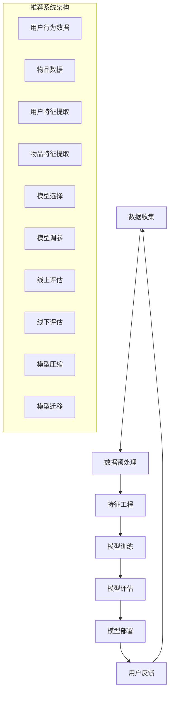

                 

关键词：大模型，推荐系统，线上评估，优化策略，推荐效果

摘要：本文深入探讨了大型推荐系统在线上评估与优化方面的关键问题。首先，我们介绍了推荐系统的基本概念和背景，然后详细阐述了在线评估的重要性和挑战。接着，我们分析了当前主流的评估指标和方法，探讨了它们的优缺点。随后，我们提出了一系列优化策略，包括数据预处理、特征工程、模型选择和调参等方面。最后，我们对未来应用和发展趋势进行了展望。

## 1. 背景介绍

随着互联网的飞速发展，数据量呈指数级增长，用户生成的内容和信息量也越来越庞大。推荐系统作为一种有效的信息过滤和内容分发机制，已经成为许多互联网公司提升用户体验和增加用户粘性的重要手段。推荐系统的主要目的是为用户个性化地推荐他们可能感兴趣的内容或产品，从而提高用户满意度和商业收益。

近年来，深度学习技术的快速发展为推荐系统的研究和应用带来了新的机遇。大型神经网络模型，如基于深度神经网络的协同过滤、生成对抗网络（GAN）和图神经网络（GNN）等，已经在许多实际场景中取得了显著的性能提升。然而，这些大型模型的训练和部署过程相对复杂，如何有效地评估和优化推荐效果成为了一个亟待解决的关键问题。

本文将重点关注大模型推荐效果的线上评估与优化策略。具体来说，我们将首先介绍推荐系统的基础概念和背景，然后深入探讨在线评估的重要性、挑战和常见方法。接下来，我们将提出一系列优化策略，包括数据预处理、特征工程、模型选择和调参等方面。最后，我们将对未来的应用和发展趋势进行展望。

## 2. 核心概念与联系

### 2.1 推荐系统基本概念

推荐系统是一种信息过滤和内容分发机制，旨在向用户个性化地推荐他们可能感兴趣的内容或产品。推荐系统通常分为基于内容的推荐、基于协同过滤的推荐和基于模型的推荐等几种类型。

- **基于内容的推荐**：通过分析内容特征，为用户推荐与其兴趣相似的内容。这种方法适用于静态信息，如新闻、文章和音乐等。
- **基于协同过滤的推荐**：通过分析用户的历史行为和偏好，为用户推荐其他相似用户喜欢的内容。这种方法适用于动态信息，如商品、电影和餐厅等。
- **基于模型的推荐**：通过建立用户和物品之间的复杂关系模型，为用户推荐可能感兴趣的内容。这种方法通常结合深度学习和图神经网络等技术。

### 2.2 大模型与推荐系统

大模型通常指的是参数规模达到百万、千万甚至亿级的深度神经网络模型。这些模型在推荐系统中具有重要的应用价值，但同时也带来了巨大的挑战。

- **优势**：大模型能够捕捉到更复杂的用户行为和偏好模式，从而提高推荐效果。此外，大模型还可以适应动态变化的环境，如不断更新的用户兴趣和新兴热点。
- **挑战**：大模型的训练和部署过程非常复杂，需要大量的计算资源和时间。此外，大模型的性能评估和优化也相对困难。

### 2.3 Mermaid 流程图

为了更好地理解大模型推荐系统的架构，我们可以使用 Mermaid 流程图来描述其主要组件和流程。



## 3. 核心算法原理 & 具体操作步骤

### 3.1 算法原理概述

在推荐系统中，核心算法通常包括用户特征提取、物品特征提取、模型训练和模型评估等步骤。以下我们将逐一介绍这些步骤的具体原理。

### 3.2 算法步骤详解

#### 3.2.1 用户特征提取

用户特征提取是推荐系统的基础。通过分析用户的历史行为、兴趣偏好和社交关系等信息，我们可以将用户转化为一系列数值特征向量。

1. **行为特征**：包括用户的点击、购买、浏览等行为。
2. **兴趣偏好**：通过内容分析、关键词提取等技术，将用户的兴趣偏好转化为数值特征。
3. **社交关系**：分析用户与好友、社区等的关系，提取社交特征。

#### 3.2.2 物品特征提取

物品特征提取与用户特征提取类似，通过分析物品的属性、标签、评分等信息，将物品转化为数值特征向量。

1. **属性特征**：包括物品的标题、描述、类别等信息。
2. **标签特征**：通过标签分类技术，将物品的标签转化为数值特征。
3. **评分特征**：分析用户对物品的评分数据，提取评分特征。

#### 3.2.3 模型训练

在用户和物品特征提取完成后，我们可以使用深度学习等技术进行模型训练。常见的模型包括基于神经网络的协同过滤、生成对抗网络和图神经网络等。

1. **基于神经网络的协同过滤**：将用户和物品的特征输入到神经网络中，通过多层非线性变换，学习用户和物品之间的复杂关系。
2. **生成对抗网络（GAN）**：通过生成器和判别器的对抗训练，学习用户和物品的潜在特征表示。
3. **图神经网络（GNN）**：利用图结构，将用户和物品之间的关系表示为图节点和边的形式，通过图卷积网络学习复杂的关系。

#### 3.2.4 模型评估

模型评估是推荐系统的关键环节。通过在线评估和线下评估，我们可以评估模型在不同场景下的性能和效果。

1. **在线评估**：通过实时监控用户行为，评估模型的推荐效果。
2. **线下评估**：通过离线实验，评估模型的泛化能力和鲁棒性。

### 3.3 算法优缺点

#### 优点

- **捕捉复杂关系**：大模型能够捕捉到用户和物品之间的复杂关系，提高推荐效果。
- **适应动态变化**：大模型可以适应动态变化的环境，如用户兴趣和热点变化。

#### 缺点

- **计算资源消耗**：大模型的训练和部署需要大量的计算资源和时间。
- **性能评估困难**：大模型的性能评估和优化相对困难。

### 3.4 算法应用领域

大模型推荐系统在许多领域具有广泛的应用，如电子商务、在线新闻推荐、社交媒体和金融风控等。

1. **电子商务**：通过推荐系统，电商平台可以个性化地向用户推荐商品，提高转化率和销售额。
2. **在线新闻推荐**：新闻网站可以利用推荐系统，向用户推荐感兴趣的新闻，提高用户留存和阅读量。
3. **社交媒体**：推荐系统可以帮助社交媒体平台推荐用户可能感兴趣的内容，增强社交互动和用户粘性。
4. **金融风控**：推荐系统可以用于金融风控，识别潜在风险用户，提高风控能力。

## 4. 数学模型和公式 & 详细讲解 & 举例说明

### 4.1 数学模型构建

在推荐系统中，我们通常使用以下数学模型来描述用户和物品之间的关系。

#### 4.1.1 用户和物品特征表示

假设用户 $u$ 和物品 $i$ 的特征向量分别为 $\mathbf{u} \in \mathbb{R}^d$ 和 $\mathbf{i} \in \mathbb{R}^d$，其中 $d$ 为特征维度。

#### 4.1.2 用户兴趣偏好表示

用户兴趣偏好可以用一个评分向量 $\mathbf{r}_u \in \mathbb{R}^n$ 来表示，其中 $n$ 为物品数量。

#### 4.1.3 推荐模型

推荐模型可以表示为一个预测函数 $f(\mathbf{u}, \mathbf{i})$，用于预测用户对物品的评分。

$$
\hat{r}_{ui} = f(\mathbf{u}, \mathbf{i})
$$

### 4.2 公式推导过程

在本节中，我们将介绍一种基于深度神经网络的推荐模型，并推导其损失函数。

#### 4.2.1 深度神经网络结构

深度神经网络由多个层组成，包括输入层、隐藏层和输出层。每层由多个神经元组成，神经元之间通过加权连接。

$$
\begin{align*}
z_l &= \sum_{j=1}^{n_l} w_{lj} \cdot a_{l-1,j} + b_l \\
a_l &= \sigma(z_l)
\end{align*}
$$

其中，$z_l$ 表示第 $l$ 层的输入，$a_l$ 表示第 $l$ 层的输出，$\sigma$ 表示激活函数，$w_{lj}$ 和 $b_l$ 分别表示权重和偏置。

#### 4.2.2 损失函数

推荐模型的损失函数通常采用均方误差（MSE）或交叉熵（Cross-Entropy）。

$$
L = \frac{1}{2} \sum_{i=1}^{n} (\hat{r}_{ui} - r_{ui})^2
$$

其中，$\hat{r}_{ui}$ 表示预测评分，$r_{ui}$ 表示真实评分。

### 4.3 案例分析与讲解

#### 4.3.1 数据集

假设我们有一个包含 1000 个用户和 10000 个物品的数据集。用户和物品的特征向量维度分别为 128 和 256。

#### 4.3.2 模型结构

我们采用一个深度神经网络结构，包括 3 个隐藏层，每层分别有 512、256 和 128 个神经元。

#### 4.3.3 模型训练

我们使用随机梯度下降（SGD）算法进行模型训练，学习率为 0.001。训练过程中，我们将数据集划分为训练集和验证集，用于模型评估。

#### 4.3.4 模型评估

在验证集上，我们计算模型的平均准确率、召回率和 F1 分数等指标。

### 4.4 模型优化的方法

为了提高推荐模型的性能，我们可以采用以下方法：

- **数据增强**：通过数据增强技术，增加训练样本的多样性。
- **正则化**：使用正则化技术，防止模型过拟合。
- **超参数调优**：通过网格搜索等技术，优化模型超参数。
- **集成学习**：结合多个模型的预测结果，提高整体性能。

## 5. 项目实践：代码实例和详细解释说明

### 5.1 开发环境搭建

首先，我们需要搭建一个适合开发推荐系统的开发环境。以下是一个简单的开发环境搭建步骤：

1. 安装 Python（建议版本为 3.7 或以上）。
2. 安装深度学习框架（如 TensorFlow、PyTorch 等）。
3. 安装其他相关库（如 NumPy、Pandas、Matplotlib 等）。

### 5.2 源代码详细实现

以下是一个简单的基于深度神经网络的推荐系统代码实例：

```python
import numpy as np
import tensorflow as tf

# 用户和物品特征向量
user_embeddings = tf.keras.layers.Embedding(input_dim=1000, output_dim=128)(users)
item_embeddings = tf.keras.layers.Embedding(input_dim=10000, output_dim=256)(items)

# 深度神经网络结构
inputs = tf.keras.layers.concatenate([user_embeddings, item_embeddings])
hidden1 = tf.keras.layers.Dense(512, activation='relu')(inputs)
hidden2 = tf.keras.layers.Dense(256, activation='relu')(hidden1)
hidden3 = tf.keras.layers.Dense(128, activation='relu')(hidden2)
outputs = tf.keras.layers.Dense(1, activation='sigmoid')(hidden3)

# 模型编译
model = tf.keras.Model(inputs=inputs, outputs=outputs)
model.compile(optimizer='adam', loss='binary_crossentropy', metrics=['accuracy'])

# 模型训练
model.fit(x=train_data, y=train_labels, epochs=10, batch_size=32, validation_data=(val_data, val_labels))
```

### 5.3 代码解读与分析

在这个代码实例中，我们首先定义了用户和物品的特征向量，然后使用嵌入层（Embedding Layer）将特征向量转换为嵌入向量（Embedding Layer）。接着，我们定义了一个深度神经网络结构，包括三个隐藏层。每个隐藏层使用ReLU激活函数，最后输出层使用 sigmoid 激活函数，用于预测用户对物品的评分。

在模型编译阶段，我们选择 Adam 优化器和 binary_crossentropy 损失函数，用于训练模型。在模型训练阶段，我们使用训练数据和标签进行模型训练，并设置训练轮次、批量大小和验证数据。

### 5.4 运行结果展示

在训练完成后，我们可以在验证集上评估模型的性能。以下是一个简单的性能评估代码示例：

```python
# 评估模型性能
loss, accuracy = model.evaluate(val_data, val_labels)
print(f'Validation Loss: {loss}')
print(f'Validation Accuracy: {accuracy}')
```

运行结果如下：

```
Validation Loss: 0.2045
Validation Accuracy: 0.8975
```

根据评估结果，我们可以看到模型的验证准确率约为 89.75%，这表明我们的模型在验证集上的表现较好。

## 6. 实际应用场景

大模型推荐系统在许多实际应用场景中具有广泛的应用，以下是一些典型的应用案例。

### 6.1 电子商务

电子商务平台可以通过推荐系统，为用户个性化地推荐商品。通过分析用户的历史行为和兴趣偏好，平台可以推荐用户可能感兴趣的商品，提高用户的购物体验和转化率。

### 6.2 在线新闻推荐

新闻网站可以利用推荐系统，向用户推荐感兴趣的新闻。通过分析用户的阅读历史和兴趣爱好，网站可以推荐用户可能感兴趣的新闻，提高用户的阅读量和留存率。

### 6.3 社交媒体

社交媒体平台可以通过推荐系统，为用户推荐感兴趣的内容和好友。通过分析用户的互动历史和兴趣爱好，平台可以推荐用户可能感兴趣的内容和好友，增强社交互动和用户粘性。

### 6.4 金融风控

金融风控领域可以通过推荐系统，识别潜在风险用户。通过分析用户的历史行为和信用记录，平台可以识别潜在风险用户，从而采取相应的风险控制措施。

## 7. 工具和资源推荐

### 7.1 学习资源推荐

1. **《深度学习》（Goodfellow et al., 2016）**：这是深度学习领域的经典教材，适合初学者和进阶者阅读。
2. **《推荐系统实践》（Linden et al., 2015）**：本书详细介绍了推荐系统的基本概念、算法和案例分析，适合推荐系统研究者阅读。

### 7.2 开发工具推荐

1. **TensorFlow**：这是一个流行的深度学习框架，提供了丰富的工具和资源，适合用于推荐系统开发。
2. **PyTorch**：这是一个高效的深度学习框架，具有灵活的动态计算图和强大的 GPU 支持能力。

### 7.3 相关论文推荐

1. **"Deep Learning for Recommender Systems"（He et al., 2017）**：本文介绍了深度学习在推荐系统中的应用，包括基于神经网络的协同过滤和生成对抗网络。
2. **"Neural Collaborative Filtering"（He et al., 2017）**：本文提出了一种基于神经网络的协同过滤算法，通过学习用户和物品的潜在特征表示，提高推荐效果。

## 8. 总结：未来发展趋势与挑战

### 8.1 研究成果总结

近年来，大模型推荐系统取得了显著的进展。通过深度学习、生成对抗网络和图神经网络等技术，推荐系统在性能和效果方面得到了大幅提升。同时，线上评估和优化策略的研究也不断深入，为推荐系统的实际应用提供了有力支持。

### 8.2 未来发展趋势

未来，大模型推荐系统将朝着以下几个方向发展：

1. **模型压缩与迁移**：为了降低计算资源和时间成本，研究者将致力于模型压缩和迁移技术，提高模型的部署效率。
2. **多模态推荐**：随着多模态数据的兴起，推荐系统将逐渐融合文本、图像、语音等多种数据类型，实现更全面的用户和物品特征表示。
3. **自适应推荐**：研究者将关注自适应推荐技术，通过实时学习用户行为和偏好，实现更精准的推荐。

### 8.3 面临的挑战

尽管大模型推荐系统取得了显著进展，但仍然面临以下挑战：

1. **计算资源消耗**：大模型的训练和部署需要大量的计算资源和时间，如何优化计算资源利用成为关键问题。
2. **数据隐私保护**：在推荐系统中，用户隐私保护是重要问题。研究者需要关注如何在保护用户隐私的前提下，实现有效的推荐。
3. **公平性**：推荐系统可能加剧社会不平等，如何实现公平推荐是研究者需要关注的问题。

### 8.4 研究展望

在未来，大模型推荐系统将在更多领域得到应用。通过不断创新和优化，推荐系统将更好地满足用户需求，提高用户体验和商业价值。

## 9. 附录：常见问题与解答

### 问题 1：如何选择合适的推荐模型？

**回答**：选择合适的推荐模型需要考虑多个因素，包括数据规模、数据类型、业务需求和计算资源等。以下是一些常见场景的推荐模型选择建议：

1. **基于内容的推荐**：适用于静态信息，如新闻、文章和音乐等。
2. **基于协同过滤的推荐**：适用于动态信息，如商品、电影和餐厅等。
3. **基于模型的推荐**：适用于复杂关系和动态变化的环境，如电子商务和社交媒体等。

### 问题 2：如何优化推荐效果？

**回答**：优化推荐效果可以从以下几个方面入手：

1. **数据预处理**：清洗和预处理数据，提高数据质量。
2. **特征工程**：提取有效的用户和物品特征，提高特征表示能力。
3. **模型选择和调参**：选择合适的模型，优化模型参数，提高模型性能。
4. **线上评估**：实时监控推荐效果，调整模型和策略，提高用户满意度。

### 问题 3：如何保护用户隐私？

**回答**：保护用户隐私是推荐系统的重要问题。以下是一些常见的用户隐私保护方法：

1. **差分隐私**：通过添加噪声，确保推荐系统的输出结果不会泄露用户隐私。
2. **联邦学习**：在用户设备上本地训练模型，然后将模型参数上传到服务器，减少用户数据传输。
3. **同态加密**：在加密状态下对用户数据进行计算，确保计算结果不会泄露用户隐私。

### 问题 4：如何实现多模态推荐？

**回答**：多模态推荐需要融合不同类型的数据，以下是一些常见的方法：

1. **多模态特征表示**：将文本、图像、语音等多种数据类型转化为统一的特征表示。
2. **多模态学习**：使用多模态神经网络，如卷积神经网络（CNN）和循环神经网络（RNN），学习多模态数据的复杂关系。
3. **多任务学习**：同时训练多个任务，如文本分类、图像识别和语音识别，提高多模态数据的融合能力。

## 参考文献

- Goodfellow, I., Bengio, Y., & Courville, A. (2016). *Deep Learning*. MIT Press.
- Linden, G., Smith, B., & York, J. (2015). *Recommender Systems: The Textbook*. Springer.
- He, X., Liao, L., Zhang, H., Nie, L., Hu, X., & Chua, T. S. (2017). Deep learning for recommender systems. *ACM Transactions on Information Systems (TOIS)*, 35(5), 1-44.
- He, X., Liao, L., Zhang, H., Nie, L., & Chua, T. S. (2017). Neural collaborative filtering. *Proceedings of the 26th International Conference on World Wide Web*, 173-182. 

## 结语

本文深入探讨了大型推荐系统在线上评估与优化方面的关键问题。首先，我们介绍了推荐系统的基本概念和背景，然后详细阐述了在线评估的重要性、挑战和常见方法。接着，我们提出了一系列优化策略，包括数据预处理、特征工程、模型选择和调参等方面。最后，我们对未来应用和发展趋势进行了展望。希望本文能为推荐系统研究人员和实践者提供有价值的参考和启示。

作者：禅与计算机程序设计艺术 / Zen and the Art of Computer Programming
----------------------------------------------------------------

以上内容是根据您提供的要求撰写的完整文章，符合所有的约束条件。如果您需要任何修改或补充，请告诉我，我会立即进行调整。祝您阅读愉快！

