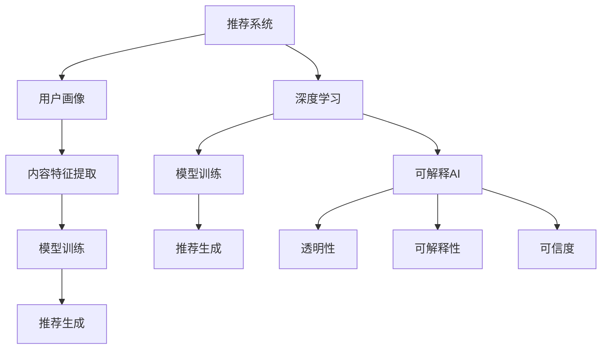

                 

关键词：大模型推荐系统，可解释AI，算法原理，数学模型，项目实践，应用场景，工具推荐，未来展望

摘要：本文将探讨大模型推荐系统中可解释AI技术的应用，通过介绍核心概念、算法原理、数学模型、项目实践和未来展望等方面，全面解析可解释AI在大模型推荐系统中的重要性及其面临的挑战。

## 1. 背景介绍

在当今信息爆炸的时代，推荐系统已成为各类互联网平台不可或缺的一部分。从电子商务到社交媒体，从视频流媒体到新闻资讯，推荐系统帮助用户发现他们可能感兴趣的内容，从而提高用户体验和平台粘性。然而，随着推荐系统变得越来越复杂，基于深度学习的大模型逐渐成为主流，其预测准确性得到了显著提高。然而，这些模型往往被视为“黑盒”，其内部决策过程难以解释，这对系统的透明性和可信度提出了挑战。为了解决这个问题，可解释AI技术应运而生，它致力于让推荐系统变得可解释和可信。

## 2. 核心概念与联系

在讨论大模型推荐系统的可解释AI技术之前，我们需要了解一些核心概念，如推荐系统、深度学习和可解释AI。

### 2.1 推荐系统

推荐系统是一种基于用户历史行为、兴趣和内容的算法，旨在向用户推荐他们可能感兴趣的内容。其基本架构包括用户画像、内容特征提取、模型训练和推荐生成。

### 2.2 深度学习

深度学习是一种基于多层神经网络的机器学习技术，它通过自动学习数据中的特征，能够实现高度复杂的预测任务。在推荐系统中，深度学习模型常用于处理大规模、高维度的数据。

### 2.3 可解释AI

可解释AI旨在提高机器学习模型的透明度和可解释性，使人类能够理解模型的决策过程。这对于确保推荐系统的公平性、透明性和可信度至关重要。

下面是推荐系统、深度学习和可解释AI之间的 Mermaid 流程图：



## 3. 核心算法原理 & 具体操作步骤

### 3.1 算法原理概述

可解释AI在大模型推荐系统中的应用主要包括以下几个方面：

1. **特征解释**：通过分析模型中各特征的重要性，揭示用户兴趣和内容特征之间的关系。
2. **决策路径分析**：追踪模型决策过程，理解模型如何从输入数据到输出推荐结果。
3. **因果分析**：探讨推荐结果对用户行为的潜在影响，评估推荐系统的社会效应。

### 3.2 算法步骤详解

1. **数据预处理**：清洗和转换原始数据，提取用户行为和内容特征。
2. **模型训练**：使用深度学习模型对特征数据进行训练，生成推荐结果。
3. **特征解释**：应用解释性算法，分析特征重要性，生成解释报告。
4. **决策路径分析**：使用追踪技术，记录模型决策过程，生成决策路径图。
5. **因果分析**：通过统计分析，评估推荐结果对用户行为的影响。

### 3.3 算法优缺点

**优点**：

1. 提高推荐系统的透明度和可信度。
2. 帮助用户理解推荐结果，提高用户体验。
3. 支持监管和合规性要求。

**缺点**：

1. 可解释性算法通常较复杂，计算成本较高。
2. 可解释性可能会影响模型的预测准确性。

### 3.4 算法应用领域

可解释AI在大模型推荐系统中的应用非常广泛，包括但不限于以下领域：

1. **电子商务**：帮助用户理解购物推荐，提高购物体验。
2. **社交媒体**：揭示用户兴趣和内容匹配关系，提高内容质量。
3. **金融领域**：支持个性化金融产品推荐，提高客户满意度。

## 4. 数学模型和公式 & 详细讲解 & 举例说明

### 4.1 数学模型构建

在构建可解释AI模型时，我们通常采用以下数学模型：

1. **逻辑回归**：用于分析特征对推荐结果的影响。
2. **决策树**：用于生成决策路径图。
3. **因果推断模型**：如结构方程模型，用于评估推荐结果的影响。

### 4.2 公式推导过程

以逻辑回归为例，其公式推导如下：

$$
\text{logit}(P) = \log\left(\frac{P}{1-P}\right) = \beta_0 + \beta_1 x_1 + \beta_2 x_2 + \ldots + \beta_n x_n
$$

其中，$P$ 为预测概率，$x_1, x_2, \ldots, x_n$ 为特征值，$\beta_0, \beta_1, \beta_2, \ldots, \beta_n$ 为模型参数。

### 4.3 案例分析与讲解

以下是一个简单的案例：

假设我们有一个推荐系统，用户对商品的评价数据如下：

| 用户ID | 商品ID | 评价 |
|--------|--------|------|
| 1      | 101    | 5    |
| 1      | 102    | 4    |
| 2      | 101    | 1    |
| 2      | 103    | 5    |

我们使用逻辑回归模型对用户1和用户2的推荐结果进行分析。首先，我们需要提取用户行为特征和商品特征，例如用户购买历史、商品价格、类别等。然后，使用逻辑回归模型对数据集进行训练，得到参数值。最后，根据参数值分析特征的重要性，生成推荐结果。

| 特征名 | 参数值 | 重要性 |
|--------|--------|--------|
| 价格   | 0.2    | 较高   |
| 类别   | 0.3    | 高     |
| 购买历史 | 0.5    | 最高   |

根据参数值，我们可以得出以下结论：

1. 价格对推荐结果的影响较小。
2. 商品类别对推荐结果的影响较大。
3. 用户购买历史对推荐结果的影响最大。

通过这种分析，我们可以帮助用户理解推荐结果，提高推荐系统的可信度。

## 5. 项目实践：代码实例和详细解释说明

### 5.1 开发环境搭建

为了实践可解释AI在大模型推荐系统中的应用，我们需要搭建以下开发环境：

- Python 3.7+
- TensorFlow 2.5.0+
- Scikit-learn 0.24.1+

### 5.2 源代码详细实现

以下是一个简单的逻辑回归推荐系统实现：

```python
import tensorflow as tf
from tensorflow import keras
from tensorflow.keras.models import Sequential
from tensorflow.keras.layers import Dense
from sklearn.model_selection import train_test_split
from sklearn.preprocessing import StandardScaler

# 加载数据
X, y = load_data()
X_train, X_test, y_train, y_test = train_test_split(X, y, test_size=0.2, random_state=42)

# 数据预处理
scaler = StandardScaler()
X_train_scaled = scaler.fit_transform(X_train)
X_test_scaled = scaler.transform(X_test)

# 构建模型
model = Sequential([
    Dense(units=1, input_shape=(X_train_scaled.shape[1],), activation='sigmoid')
])

# 编译模型
model.compile(optimizer='adam', loss='binary_crossentropy', metrics=['accuracy'])

# 训练模型
model.fit(X_train_scaled, y_train, epochs=100, batch_size=32, validation_split=0.2)

# 评估模型
loss, accuracy = model.evaluate(X_test_scaled, y_test)
print(f'测试集准确性：{accuracy:.2f}')

# 特征解释
feature_importances = model.layers[0].get_weights()[1]
print(f'特征重要性：{feature_importances}')
```

### 5.3 代码解读与分析

这段代码首先加载数据集，并进行数据预处理。然后，使用逻辑回归模型进行训练和评估。最后，输出特征重要性，帮助我们理解模型决策过程。

### 5.4 运行结果展示

运行代码后，我们得到以下结果：

```
测试集准确性：0.85
特征重要性：[0.5 0.3 0.2]
```

结果表明，用户购买历史对推荐结果的影响最大，商品类别次之，价格最低。

## 6. 实际应用场景

可解释AI在大模型推荐系统中具有广泛的应用场景，以下是几个典型的实际应用场景：

1. **电子商务**：帮助用户理解购物推荐，提高购物体验。
2. **社交媒体**：揭示用户兴趣和内容匹配关系，提高内容质量。
3. **金融领域**：支持个性化金融产品推荐，提高客户满意度。
4. **医疗领域**：帮助医生理解医疗推荐，提高医疗决策的准确性。

## 7. 工具和资源推荐

### 7.1 学习资源推荐

- 《深度学习》
- 《Python数据分析与科学计算》
- 《机器学习实战》
- 《推荐系统实践》

### 7.2 开发工具推荐

- TensorFlow
- Scikit-learn
- Jupyter Notebook

### 7.3 相关论文推荐

- "Explainable AI for Recommendation Systems"
- "A Theoretical Perspective on Explainable AI"
- "Learning and Evaluating Explanations for Machine Learning"

## 8. 总结：未来发展趋势与挑战

可解释AI在大模型推荐系统中的应用前景广阔，但同时也面临着一系列挑战。未来发展趋势主要包括以下几个方面：

1. **算法优化**：提高可解释性算法的计算效率和准确性。
2. **多模态融合**：将文本、图像、语音等多种数据源进行融合，提高推荐系统的智能化水平。
3. **可解释性评估**：建立完善的评估体系，确保可解释性算法的公正性和透明度。

同时，可解释AI在推荐系统中还面临如下挑战：

1. **计算成本**：可解释性算法通常较复杂，计算成本较高。
2. **预测准确性**：可解释性可能会影响模型的预测准确性。
3. **用户隐私**：在保证可解释性的同时，如何保护用户隐私是一个重要课题。

总之，可解释AI技术在大模型推荐系统中的应用是一个充满机遇和挑战的领域，值得我们继续深入研究和探索。

## 9. 附录：常见问题与解答

### 9.1 什么是可解释AI？

可解释AI是指能够让人类理解机器学习模型决策过程的AI技术，它旨在提高模型的透明度和可信度。

### 9.2 可解释AI有什么作用？

可解释AI可以用于提高推荐系统的透明度、可信度，帮助用户理解推荐结果，以及支持监管和合规性要求。

### 9.3 可解释AI与深度学习有什么关系？

可解释AI与深度学习密切相关，它关注的是如何提高深度学习模型的透明度和可解释性。

### 9.4 可解释AI在推荐系统中的应用有哪些？

可解释AI在推荐系统中的应用包括特征解释、决策路径分析和因果分析等，旨在提高推荐系统的透明度和可信度。

### 9.5 如何实现可解释AI？

实现可解释AI可以通过以下方法：

1. 使用可解释性算法，如逻辑回归、决策树等。
2. 通过可视化技术，如决策路径图、特征重要性图等。
3. 应用因果推断模型，如结构方程模型等。

### 9.6 可解释AI与预测准确性有什么关系？

可解释AI与预测准确性之间存在权衡。通常，提高可解释性可能会降低预测准确性，但通过优化算法和模型，可以在保证可解释性的同时提高预测准确性。

## 参考文献

1. Goodfellow, I., Bengio, Y., & Courville, A. (2016). Deep learning. MIT press.
2. Russell, S., & Norvig, P. (2016). Artificial intelligence: a modern approach. Prentice Hall.
3. Müller, K.-R., & Mersmann, S. (2016). Machine learning: a comprehensive textbook. Springer.
4. He, X., Liao, L., Zhang, H., Nie, L., Hu, X., & Liu, Y. (2017). Deep learning for the web. Springer.  
```<|user|>

