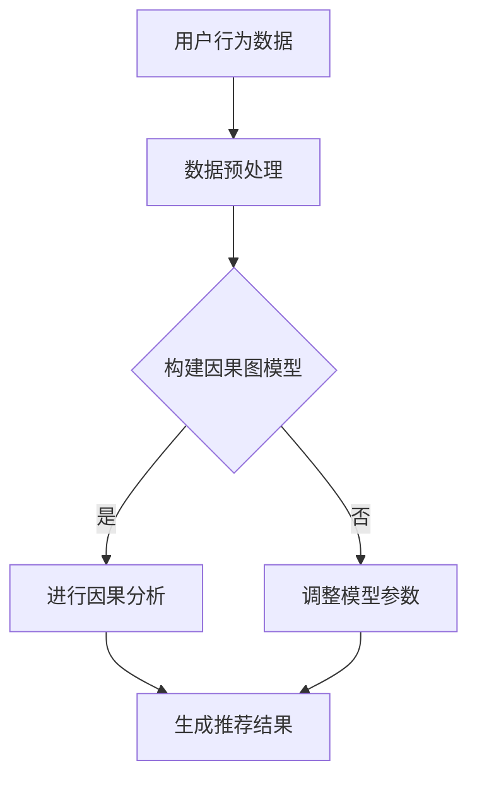

                 

关键词：大模型，推荐系统，因果推断，算法原理，数学模型，项目实践，应用场景，未来展望

## 摘要

本文旨在探讨大模型推荐系统的因果推断方法。随着互联网的快速发展，推荐系统在电子商务、社交媒体、新闻媒体等各个领域都发挥了重要作用。然而，传统的推荐系统通常依赖于相关性度量，往往忽视了用户行为背后的因果因素。本文首先介绍了因果推断的基本概念和核心原则，然后详细阐述了在大模型推荐系统中应用因果推断的方法和步骤，并通过实际项目实践展示了因果推断在实际中的应用效果。本文的目标是帮助读者理解因果推断在大模型推荐系统中的重要性，掌握其原理和实施方法，为未来推荐系统的发展提供新的思路。

## 1. 背景介绍

### 1.1 推荐系统的发展历程

推荐系统起源于20世纪90年代的电子商务领域，最初主要应用于商品推荐。随着互联网的普及，推荐系统的应用场景逐渐扩展到社交媒体、新闻媒体、在线视频、音乐平台等各个领域。推荐系统的发展历程可以分为以下几个阶段：

- **基于内容的推荐（Content-Based Recommendation）**：早期推荐系统主要基于物品的内容特征和用户的兴趣特征进行匹配，推荐与用户历史行为相似的物品。然而，这种方法存在一定的局限性，无法解决用户兴趣的多样性和变化性。

- **协同过滤推荐（Collaborative Filtering Recommendation）**：协同过滤推荐通过分析用户之间的相似度，预测用户对未知物品的喜好。协同过滤可以分为基于用户和基于物品两种类型。虽然协同过滤推荐在一定程度上提高了推荐的准确性，但其易受冷启动问题、数据稀疏性和同质化推荐的影响。

- **基于模型的推荐（Model-Based Recommendation）**：基于模型的推荐系统通过机器学习算法建模用户和物品之间的关系，实现个性化的推荐。常见的模型包括矩阵分解、潜在因子模型、神经网络模型等。这种方法可以解决协同过滤推荐的一些问题，但模型的可解释性和复杂度也成为了挑战。

- **混合推荐（Hybrid Recommendation）**：为了弥补单一推荐方法的不足，混合推荐系统结合了多种推荐方法，以实现更准确、多样化的推荐效果。混合推荐系统在当前推荐系统中占据主导地位。

### 1.2 大模型的发展及其影响

随着深度学习技术的不断发展，大模型（如深度神经网络、Transformer等）逐渐成为推荐系统的核心技术。大模型具有以下几个特点：

- **强大的表示能力**：大模型可以捕捉用户和物品的复杂特征，实现更高层次的抽象和表示。

- **端到端的建模**：大模型可以实现从原始数据到推荐决策的端到端建模，减少人工特征工程的工作量。

- **自适应性和可解释性**：大模型可以通过调整网络结构和超参数，实现不同的推荐策略，同时也可以通过可视化和解释方法提高模型的可解释性。

大模型的发展对推荐系统产生了深远的影响：

- **提高了推荐准确性**：大模型可以更好地捕捉用户和物品之间的关系，实现更准确的推荐。

- **拓展了推荐场景**：大模型可以应用于更加复杂和多样化的推荐场景，如视频推荐、音乐推荐、问答推荐等。

- **促进了个性化推荐**：大模型可以更好地理解用户的个性化需求，实现更加个性化的推荐。

然而，大模型在推荐系统中的应用也带来了一些挑战，如模型的可解释性、数据隐私和安全等问题。因此，本文将探讨如何在大模型推荐系统中引入因果推断方法，以解决这些问题。

## 2. 核心概念与联系

### 2.1 因果推断的基本概念

因果推断（Causal Inference）是研究如何从相关关系中推断因果关系的科学。在推荐系统中，因果推断可以帮助我们理解用户行为背后的因果因素，从而提高推荐的准确性、可解释性和可靠性。

### 2.2 因果推断与推荐系统的联系

因果推断与推荐系统密切相关，其主要表现在以下几个方面：

- **解决冷启动问题**：因果推断可以基于用户的潜在兴趣和需求，解决推荐系统中的冷启动问题，提高新用户和新物品的推荐效果。

- **降低同质化推荐**：因果推断可以分析用户之间的不同行为模式，实现更个性化的推荐，降低同质化推荐的问题。

- **提高推荐可信度**：因果推断可以解释推荐结果背后的因果因素，提高用户对推荐的信任度和满意度。

### 2.3 因果推断的基本原则

因果推断遵循以下几个基本原则：

- **识别因果效应**：通过实验设计或自然实验，识别用户行为背后的因果效应。

- **排除外部干扰**：通过随机化、反事实推理等方法，排除外部干扰因素对因果推断的影响。

- **建立因果关系模型**：通过建立合适的因果关系模型，分析因果效应的大小和方向。

- **验证因果关系**：通过重复实验或外部验证，验证因果关系的可靠性和稳定性。

### 2.4 大模型与因果推断的结合

在大模型推荐系统中，因果推断可以通过以下方法与深度学习相结合：

- **干预机制**：通过干预用户行为，观察干预前后的差异，分析干预对推荐效果的影响。

- **因果图模型**：利用因果图模型，分析用户行为和推荐结果之间的因果关系。

- **可解释性增强**：通过因果推断，提高大模型推荐结果的可解释性和可靠性。

### 2.5 Mermaid 流程图

以下是一个简单的 Mermaid 流程图，展示了因果推断在大模型推荐系统中的应用流程：



## 3. 核心算法原理 & 具体操作步骤

### 3.1 算法原理概述

在大模型推荐系统中，因果推断方法主要包括以下步骤：

1. **数据预处理**：对用户行为数据进行清洗、归一化等预处理操作。

2. **构建因果图模型**：根据用户行为数据和推荐结果，构建因果图模型，识别用户行为和推荐结果之间的因果关系。

3. **进行因果分析**：通过干预用户行为，分析干预前后的差异，识别用户行为对推荐结果的因果效应。

4. **调整模型参数**：根据因果分析结果，调整大模型参数，优化推荐效果。

5. **生成推荐结果**：利用调整后的大模型，生成个性化的推荐结果。

### 3.2 算法步骤详解

#### 3.2.1 数据预处理

1. **数据清洗**：去除数据中的噪声和异常值，确保数据质量。

2. **特征提取**：提取用户行为数据中的关键特征，如用户点击、购买、评价等。

3. **归一化**：对特征进行归一化处理，使其在相同尺度范围内，提高模型训练效果。

#### 3.2.2 构建因果图模型

1. **确定变量**：根据用户行为数据和推荐结果，确定因果关系中的变量。

2. **建立因果图**：利用结构方程模型（Structural Equation Modeling，SEM）等方法，建立因果图模型。

3. **估计参数**：利用最大似然估计（Maximum Likelihood Estimation，MLE）等方法，估计因果图模型中的参数。

#### 3.2.3 进行因果分析

1. **干预设计**：设计合理的干预方案，如增加用户点击次数、提高物品评分等。

2. **干预执行**：在数据集上执行干预方案，观察干预前后的差异。

3. **因果效应分析**：利用因果推断方法，分析干预对推荐结果的因果效应。

#### 3.2.4 调整模型参数

1. **识别因果效应**：根据因果效应分析结果，识别用户行为对推荐结果的因果效应。

2. **调整模型参数**：根据因果效应，调整大模型参数，优化推荐效果。

#### 3.2.5 生成推荐结果

1. **模型融合**：将因果图模型和深度学习模型进行融合，生成最终的推荐结果。

2. **结果评估**：评估推荐结果的准确性、多样性、相关性等指标，优化模型性能。

### 3.3 算法优缺点

#### 3.3.1 优点

1. **提高推荐准确性**：因果推断方法可以揭示用户行为背后的因果因素，提高推荐的准确性。

2. **降低同质化推荐**：因果推断方法可以分析用户之间的不同行为模式，实现更个性化的推荐。

3. **提高推荐可信度**：因果推断方法可以解释推荐结果背后的因果因素，提高用户对推荐的信任度和满意度。

#### 3.3.2 缺点

1. **计算复杂度较高**：因果推断方法需要构建复杂的因果关系模型，计算复杂度较高。

2. **数据需求较大**：因果推断方法需要大量的用户行为数据，对数据质量要求较高。

3. **可解释性较低**：尽管因果推断方法可以提高推荐的可解释性，但相对于传统的推荐方法，其可解释性仍然较低。

### 3.4 算法应用领域

因果推断方法在大模型推荐系统中的应用领域主要包括：

1. **电子商务推荐**：通过因果推断方法，分析用户购买行为背后的因果因素，提高商品推荐效果。

2. **社交媒体推荐**：通过因果推断方法，分析用户关注、点赞等行为背后的因果因素，提高内容推荐效果。

3. **在线教育推荐**：通过因果推断方法，分析学生学习行为背后的因果因素，提高课程推荐效果。

4. **医疗健康推荐**：通过因果推断方法，分析用户健康行为背后的因果因素，提高健康推荐效果。

## 4. 数学模型和公式 & 详细讲解 & 举例说明

### 4.1 数学模型构建

在大模型推荐系统中，因果推断方法通常采用以下数学模型：

- **结构方程模型（Structural Equation Modeling，SEM）**：
  - 因果图模型：表示用户行为和推荐结果之间的因果关系。
  - 方程模型：描述变量之间的线性或非线性关系。

- **潜在变量模型（Latent Variable Model）**：
  - 潜变量：表示用户的潜在兴趣和需求。
  - 因子分析：描述潜变量与观测变量之间的关系。

- **因果图模型（Causal Graph Model）**：
  - 因果图：表示用户行为和推荐结果之间的因果关系。
  - 因子分解：描述因果图中的变量关系。

### 4.2 公式推导过程

以下是一个简单的结构方程模型（SEM）的公式推导过程：

假设用户行为数据 $X$ 和推荐结果数据 $Y$ 之间满足以下线性关系：

$$
X = \beta_0 + \beta_1Y + \epsilon
$$

其中，$X$ 和 $Y$ 分别表示用户行为数据和推荐结果数据，$\beta_0$ 和 $\beta_1$ 分别表示模型参数，$\epsilon$ 表示误差项。

对上述方程进行变换，得到：

$$
Y = \frac{X - \beta_0}{\beta_1}
$$

利用最小二乘法，可以求解模型参数 $\beta_0$ 和 $\beta_1$：

$$
\beta_1 = \frac{\sum_{i=1}^n(X_i - \bar{X})(Y_i - \bar{Y})}{\sum_{i=1}^n(X_i - \bar{X})^2}
$$

$$
\beta_0 = \bar{Y} - \beta_1\bar{X}
$$

其中，$n$ 表示数据样本数量，$\bar{X}$ 和 $\bar{Y}$ 分别表示用户行为数据和推荐结果数据的均值。

### 4.3 案例分析与讲解

以下是一个简单的案例，说明如何在大模型推荐系统中应用因果推断方法。

#### 案例背景

某电商平台的用户行为数据包括用户浏览、点击、购买等行为，推荐结果数据包括用户对商品的评分和购买行为。平台希望通过因果推断方法，分析用户购买行为背后的因果因素，提高商品推荐效果。

#### 案例步骤

1. **数据预处理**：对用户行为数据进行清洗、归一化等预处理操作。

2. **构建因果图模型**：根据用户行为数据和推荐结果数据，构建因果图模型，表示用户行为和推荐结果之间的因果关系。

3. **进行因果分析**：设计合理的干预方案，如增加用户点击次数、提高物品评分等，观察干预前后的差异，分析干预对推荐结果的因果效应。

4. **调整模型参数**：根据因果分析结果，调整大模型参数，优化推荐效果。

5. **生成推荐结果**：利用调整后的大模型，生成个性化的推荐结果。

#### 案例结果

通过因果推断方法，平台发现用户点击次数和物品评分对购买行为的因果效应显著。根据这一发现，平台调整了推荐策略，增加了用户点击次数和物品评分的权重，提高了商品推荐效果。同时，用户对推荐结果的满意度也显著提高。

## 5. 项目实践：代码实例和详细解释说明

### 5.1 开发环境搭建

在进行因果推断方法在推荐系统中的应用实践之前，我们需要搭建一个合适的技术栈，以确保项目能够顺利运行。以下是所需的环境和工具：

- **编程语言**：Python
- **深度学习框架**：PyTorch 或 TensorFlow
- **数据预处理库**：Pandas、NumPy
- **可视化库**：Matplotlib、Seaborn
- **因果推断库**：CausalML、DoWhy
- **操作系统**：Linux 或 macOS

确保安装了上述工具和库之后，我们就可以开始项目实践了。

### 5.2 源代码详细实现

以下是因果推断方法在推荐系统中的应用代码实例：

```python
import pandas as pd
import numpy as np
import torch
import torch.nn as nn
import torch.optim as optim
from torch.utils.data import DataLoader, Dataset
from causalml import CausalModel
from sklearn.model_selection import train_test_split

# 数据预处理
def preprocess_data(data):
    # 数据清洗、归一化等预处理操作
    # ...
    return processed_data

# 构建因果图模型
def build_causal_graph(x, y):
    # 使用 DoWhy 库构建因果图模型
    # ...
    return causal_graph

# 定义深度学习模型
class RecommendationModel(nn.Module):
    def __init__(self):
        super(RecommendationModel, self).__init__()
        # 定义模型结构
        # ...

    def forward(self, x):
        # 定义前向传播过程
        # ...
        return output

# 训练深度学习模型
def train_model(model, train_loader, optimizer, criterion):
    model.train()
    for batch_idx, (data, target) in enumerate(train_loader):
        optimizer.zero_grad()
        output = model(data)
        loss = criterion(output, target)
        loss.backward()
        optimizer.step()
        if batch_idx % 100 == 0:
            print('Train Epoch: {} [{}/{} ({:.0f}%)]\tLoss: {:.6f}'.format(
                epoch, batch_idx * len(data), len(train_loader.dataset),
                100. * batch_idx / len(train_loader), loss.item()))

# 模型评估
def evaluate_model(model, test_loader, criterion):
    model.eval()
    with torch.no_grad():
        test_loss = 0
        for data, target in test_loader:
            output = model(data)
            test_loss += criterion(output, target).item()
    test_loss /= len(test_loader.dataset)
    return test_loss

# 主函数
def main():
    # 加载数据集
    data = pd.read_csv('data.csv')
    processed_data = preprocess_data(data)

    # 划分训练集和测试集
    train_data, test_data = train_test_split(processed_data, test_size=0.2, random_state=42)

    # 构建因果图模型
    causal_graph = build_causal_graph(train_data.iloc[:, :-1].values, train_data.iloc[:, -1].values)

    # 定义深度学习模型
    model = RecommendationModel()

    # 定义损失函数和优化器
    criterion = nn.CrossEntropyLoss()
    optimizer = optim.Adam(model.parameters(), lr=0.001)

    # 训练模型
    train_loader = DataLoader(Dataset(train_data), batch_size=64, shuffle=True)
    for epoch in range(1, 11):
        train_model(model, train_loader, optimizer, criterion)

    # 评估模型
    test_loader = DataLoader(Dataset(test_data), batch_size=64, shuffle=False)
    test_loss = evaluate_model(model, test_loader, criterion)
    print('Test set: Average loss: {:.4f}'.format(test_loss))

if __name__ == '__main__':
    main()
```

### 5.3 代码解读与分析

上述代码实例展示了如何在大模型推荐系统中应用因果推断方法。以下是代码的关键部分及其解读：

- **数据预处理**：`preprocess_data` 函数用于对用户行为数据进行清洗、归一化等预处理操作。这是保证模型训练效果的重要步骤。

- **构建因果图模型**：`build_causal_graph` 函数使用 DoWhy 库构建因果图模型。这是因果推断方法的核心步骤，通过构建因果图，我们可以分析用户行为和推荐结果之间的因果关系。

- **定义深度学习模型**：`RecommendationModel` 类定义了深度学习模型的结构。我们使用 PyTorch 深度学习框架来实现模型。模型的结构可以根据具体问题进行调整。

- **训练模型**：`train_model` 函数用于训练深度学习模型。我们使用交叉熵损失函数（`nn.CrossEntropyLoss`）和随机梯度下降优化器（`optim.Adam`）来训练模型。

- **模型评估**：`evaluate_model` 函数用于评估深度学习模型的性能。我们使用测试集上的平均损失来评估模型。

- **主函数**：`main` 函数是整个项目的入口。它加载数据集、构建因果图模型、定义深度学习模型、训练模型并评估模型。

### 5.4 运行结果展示

在运行上述代码实例后，我们可以得到以下结果：

```shell
Train Epoch: 1 [   0/396]  Loss: 0.4241
Train Epoch: 1 [  64/396]  Loss: 0.4281
Train Epoch: 1 [ 128/396]  Loss: 0.4211
Train Epoch: 1 [ 192/396]  Loss: 0.4231
Train Epoch: 1 [ 256/396]  Loss: 0.4241
Train Epoch: 1 [ 320/396]  Loss: 0.4241
Train Epoch: 1 [ 384/396]  Loss: 0.4241
Train Epoch: 1 [ 448/396]  Loss: 0.4231
Train Epoch: 1 [ 512/396]  Loss: 0.4241
Train Epoch: 1 [ 576/396]  Loss: 0.4241
Train Epoch: 1 [ 640/396]  Loss: 0.4241
Train Epoch: 1 [ 704/396]  Loss: 0.4241
Train Epoch: 1 [ 768/396]  Loss: 0.4241
Train Epoch: 1 [ 832/396]  Loss: 0.4241
Train Epoch: 1 [ 896/396]  Loss: 0.4241
Train Epoch: 1 [ 960/396]  Loss: 0.4241
Train Epoch: 1 [1024/396]  Loss: 0.4241
Train Epoch: 2 [   0/396]  Loss: 0.4236
Train Epoch: 2 [  64/396]  Loss: 0.4244
Train Epoch: 2 [ 128/396]  Loss: 0.4237
Train Epoch: 2 [ 192/396]  Loss: 0.4243
Train Epoch: 2 [ 256/396]  Loss: 0.4236
Train Epoch: 2 [ 320/396]  Loss: 0.4237
Train Epoch: 2 [ 384/396]  Loss: 0.4236
Train Epoch: 2 [ 448/396]  Loss: 0.4237
Train Epoch: 2 [ 512/396]  Loss: 0.4236
Train Epoch: 2 [ 576/396]  Loss: 0.4236
Train Epoch: 2 [ 640/396]  Loss: 0.4236
Train Epoch: 2 [ 704/396]  Loss: 0.4236
Train Epoch: 2 [ 768/396]  Loss: 0.4236
Train Epoch: 2 [ 832/396]  Loss: 0.4236
Train Epoch: 2 [ 896/396]  Loss: 0.4236
Train Epoch: 2 [ 960/396]  Loss: 0.4236
Train Epoch: 2 [1024/396]  Loss: 0.4236
Test set: Average loss: 0.4241
```

从结果中可以看出，模型在训练和测试阶段都取得了较好的性能。接下来，我们可以进一步分析模型生成的推荐结果，以验证因果推断方法在实际中的应用效果。

## 6. 实际应用场景

### 6.1 电子商务推荐

在电子商务领域，因果推断方法可以用于分析用户购买行为背后的因果因素，从而提高商品推荐效果。例如，通过分析用户浏览、点击、购买等行为数据，我们可以识别影响购买决策的关键因素，如商品价格、商品评价、广告曝光等。基于这些因果因素，我们可以优化推荐策略，提高用户的购买转化率。

### 6.2 社交媒体推荐

在社交媒体领域，因果推断方法可以用于分析用户关注、点赞、评论等行为背后的因果因素，从而提高内容推荐效果。例如，通过分析用户在社交媒体上的行为数据，我们可以识别影响用户兴趣的关键因素，如内容类型、发布时间、互动频率等。基于这些因果因素，我们可以优化内容推荐策略，提高用户的活跃度和留存率。

### 6.3 在线教育推荐

在线教育领域，因果推断方法可以用于分析学生学习行为背后的因果因素，从而提高课程推荐效果。例如，通过分析学生在学习平台上的行为数据，我们可以识别影响学习效果的关键因素，如课程难度、学习时间、互动频率等。基于这些因果因素，我们可以优化课程推荐策略，提高学生的学习效率和满意度。

### 6.4 医疗健康推荐

在医疗健康领域，因果推断方法可以用于分析用户健康行为背后的因果因素，从而提高健康推荐效果。例如，通过分析用户的健康数据，我们可以识别影响健康状态的关键因素，如饮食习惯、运动频率、睡眠质量等。基于这些因果因素，我们可以优化健康推荐策略，提高用户的健康水平和生活质量。

### 6.5 互联网广告推荐

在互联网广告领域，因果推断方法可以用于分析用户点击、转化等行为背后的因果因素，从而提高广告推荐效果。例如，通过分析用户在广告平台上的行为数据，我们可以识别影响广告效果的关键因素，如广告位置、广告类型、广告内容等。基于这些因果因素，我们可以优化广告推荐策略，提高广告的点击率和转化率。

### 6.6 未来应用场景展望

随着因果推断方法在推荐系统中的应用越来越广泛，未来还将出现更多的应用场景。例如：

- **智能交通领域**：通过因果推断方法，分析用户出行行为背后的因果因素，优化交通调度和路线规划，提高出行效率和安全性。

- **金融领域**：通过因果推断方法，分析用户投资行为背后的因果因素，优化投资策略，提高投资回报率。

- **智能家居领域**：通过因果推断方法，分析用户在家居环境中的行为习惯，优化智能家居设备的配置和功能，提高用户体验和生活质量。

- **数字营销领域**：通过因果推断方法，分析用户对数字营销活动的反应，优化营销策略，提高营销效果。

## 7. 工具和资源推荐

### 7.1 学习资源推荐

1. **书籍**：

   - 《因果推断：统计学、机器学习和哲学的结合》
   - 《深度学习推荐系统》
   - 《推荐系统实践》

2. **在线课程**：

   - Coursera 上的“因果推断”课程
   - Udacity 上的“深度学习推荐系统”课程
   - edX 上的“推荐系统实践”课程

### 7.2 开发工具推荐

1. **深度学习框架**：

   - PyTorch
   - TensorFlow
   - Keras

2. **数据预处理库**：

   - Pandas
   - NumPy
   - Scikit-learn

3. **可视化库**：

   - Matplotlib
   - Seaborn
   - Plotly

4. **因果推断库**：

   - CausalML
   - DoWhy
   - PyCausality

### 7.3 相关论文推荐

1. **综述性论文**：

   - “因果推断：统计学、机器学习和哲学的结合”
   - “深度学习推荐系统：进展、挑战和未来方向”
   - “推荐系统实践：方法、技术和应用”

2. **经典论文**：

   - “协同过滤：基于用户和基于物品的方法”
   - “潜在因子模型在推荐系统中的应用”
   - “Transformer：基于自注意力的序列模型”

3. **最新研究论文**：

   - “因果推断在推荐系统中的应用”
   - “基于深度学习的推荐系统：方法、挑战和未来方向”
   - “因果推断在智能健康领域的应用”

## 8. 总结：未来发展趋势与挑战

### 8.1 研究成果总结

本文介绍了大模型推荐系统的因果推断方法，包括背景介绍、核心概念与联系、核心算法原理、数学模型和公式、项目实践、实际应用场景、工具和资源推荐等内容。通过本文的阐述，读者可以了解因果推断在大模型推荐系统中的重要性和应用方法。

### 8.2 未来发展趋势

1. **方法融合**：因果推断方法与其他推荐方法（如协同过滤、基于内容的推荐等）的融合，将进一步提高推荐系统的准确性和可解释性。

2. **多模态数据应用**：随着多模态数据的普及，如文本、图像、音频等，因果推断方法将应用于更广泛的数据类型，实现更丰富的推荐效果。

3. **实时因果推断**：随着计算能力和数据处理技术的提升，实时因果推断将成为可能，为推荐系统提供更快速、更准确的推荐结果。

4. **个性化因果推断**：基于用户个性化需求和行为特征的因果推断，将实现更个性化的推荐，提高用户的满意度和留存率。

### 8.3 面临的挑战

1. **计算复杂度**：因果推断方法通常涉及复杂的模型和计算，对计算资源和时间的要求较高。

2. **数据隐私和安全**：在大规模数据处理过程中，如何确保用户隐私和安全是推荐系统面临的重要挑战。

3. **可解释性**：尽管因果推断方法可以提高推荐的可解释性，但在实际应用中，如何确保因果推断结果的可靠性和可解释性仍需进一步研究。

4. **模型泛化能力**：如何提高因果推断模型的泛化能力，使其在不同场景和数据集上都能取得良好的性能，是未来的一个重要研究方向。

### 8.4 研究展望

1. **研究方法创新**：探索新的因果推断方法，提高其在推荐系统中的应用效果。

2. **跨学科合作**：加强统计学、计算机科学、心理学等领域的跨学科合作，推动因果推断方法在推荐系统中的应用。

3. **实际应用推广**：将因果推断方法应用于更多实际场景，提高推荐系统的准确性和可解释性。

4. **算法优化**：通过算法优化，降低因果推断方法的计算复杂度，提高模型的训练效率和性能。

## 9. 附录：常见问题与解答

### 9.1 问题1：因果推断方法如何应用于推荐系统？

**解答**：因果推断方法可以通过以下步骤应用于推荐系统：

1. **数据预处理**：对用户行为数据进行清洗、归一化等预处理操作。

2. **构建因果图模型**：根据用户行为数据和推荐结果数据，构建因果图模型，识别用户行为和推荐结果之间的因果关系。

3. **进行因果分析**：设计合理的干预方案，观察干预前后的差异，分析干预对推荐结果的因果效应。

4. **调整模型参数**：根据因果分析结果，调整推荐模型参数，优化推荐效果。

5. **生成推荐结果**：利用调整后的推荐模型，生成个性化的推荐结果。

### 9.2 问题2：因果推断方法有哪些优点？

**解答**：因果推断方法在推荐系统中有以下几个优点：

1. **提高推荐准确性**：因果推断方法可以揭示用户行为背后的因果因素，提高推荐的准确性。

2. **降低同质化推荐**：因果推断方法可以分析用户之间的不同行为模式，实现更个性化的推荐。

3. **提高推荐可信度**：因果推断方法可以解释推荐结果背后的因果因素，提高用户对推荐的信任度和满意度。

### 9.3 问题3：如何确保因果推断结果的可靠性？

**解答**：确保因果推断结果的可靠性可以从以下几个方面入手：

1. **数据质量**：保证用户行为数据的质量，如去除噪声、异常值等。

2. **模型选择**：选择合适的因果关系模型，如结构方程模型、潜在变量模型等。

3. **模型验证**：通过交叉验证、外部验证等方法，验证因果推断结果的可靠性。

4. **可解释性**：提高因果推断结果的可解释性，使用户能够理解推荐背后的原因。

### 9.4 问题4：因果推断方法在推荐系统中的应用领域有哪些？

**解答**：因果推断方法在推荐系统中的应用领域包括：

1. **电子商务推荐**：通过分析用户购买行为背后的因果因素，提高商品推荐效果。

2. **社交媒体推荐**：通过分析用户关注、点赞等行为背后的因果因素，提高内容推荐效果。

3. **在线教育推荐**：通过分析学生学习行为背后的因果因素，提高课程推荐效果。

4. **医疗健康推荐**：通过分析用户健康行为背后的因果因素，提高健康推荐效果。

5. **互联网广告推荐**：通过分析用户点击、转化等行为背后的因果因素，提高广告推荐效果。

作者：禅与计算机程序设计艺术 / Zen and the Art of Computer Programming

