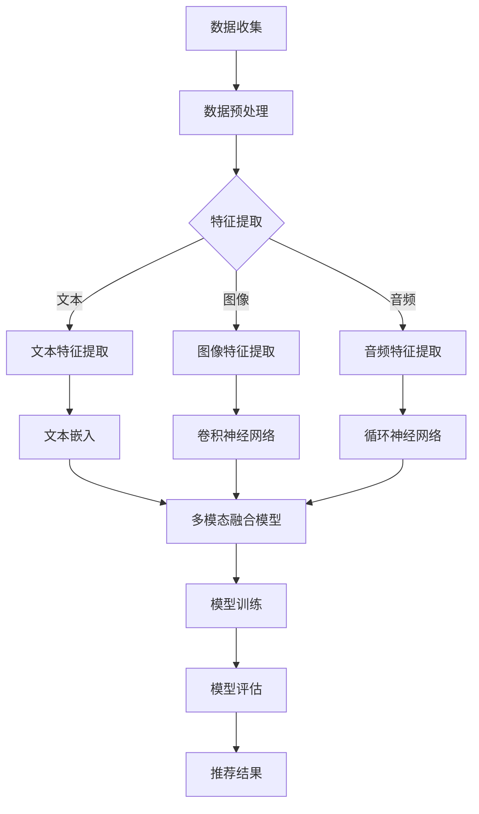

                 

关键字：大模型，推荐系统，多模态融合，人工智能，数据挖掘，机器学习，自然语言处理，图像处理，深度学习，算法优化，实时推荐，用户体验，个性化推荐。

## 摘要

本文深入探讨大模型推荐系统的多模态融合技术，旨在解决当前推荐系统中存在的效率、准确性和用户体验等问题。通过分析多模态数据融合的关键技术和方法，本文提出了一个综合性的解决方案，包括数据预处理、特征提取、模型训练和评估等步骤。同时，本文还通过数学模型和公式的详细讲解，阐述了多模态融合算法的原理和实现过程。最后，本文提供了一个实际的项目实践案例，展示了多模态融合在推荐系统中的实际应用效果。

## 1. 背景介绍

### 推荐系统的现状

推荐系统是当今互联网领域中一个重要的应用方向，它通过分析用户的历史行为和兴趣，为用户推荐相关的商品、文章或服务，从而提升用户的满意度和网站流量。随着互联网的快速发展，推荐系统已经成为电商平台、社交媒体和新闻媒体等平台的标配。

然而，现有的推荐系统主要依赖于单一的模态数据，如文本、图像或音频等，这在一定程度上限制了推荐系统的效果和覆盖范围。例如，仅使用文本数据的推荐系统无法充分利用图像和视频中的视觉信息，而仅依赖图像的推荐系统又难以捕捉到文本中的语义信息。

### 多模态融合的优势

多模态融合技术通过整合多种类型的数据，可以更全面地了解用户的需求和兴趣，从而提高推荐系统的准确性和效率。具体来说，多模态融合的优势包括：

- **信息互补**：不同模态的数据可以互补，如文本可以描述情感和场景，图像可以描述外观和动作，这些信息可以相互补充，提高数据的丰富性和准确性。
- **增强鲁棒性**：多模态融合可以提高系统的鲁棒性，减少单一模态数据可能带来的噪声和误差。
- **提升用户体验**：通过融合多种模态的信息，推荐系统可以提供更个性化的推荐结果，从而提升用户的使用体验。
- **扩展应用场景**：多模态融合可以应用于更多领域，如医疗、金融、教育和娱乐等，从而扩大推荐系统的影响范围。

### 本文的研究目标和内容

本文的研究目标是探讨大模型推荐系统的多模态融合技术，并在此基础上提出一个综合性的解决方案。本文的主要内容包括：

- **背景分析**：介绍推荐系统的现状和多模态融合的优势。
- **核心概念与联系**：阐述多模态融合的基本概念和架构，使用Mermaid流程图展示。
- **核心算法原理**：详细讲解多模态融合算法的原理和步骤。
- **数学模型和公式**：阐述多模态融合的数学模型和推导过程。
- **项目实践**：提供实际的项目实践案例和代码实现。
- **实际应用场景**：探讨多模态融合在不同领域的应用场景。
- **未来展望**：分析多模态融合技术的发展趋势和面临的挑战。

## 2. 核心概念与联系

### 多模态数据

多模态数据是指由多种不同类型的数据源组成的集合，如文本、图像、音频和视频等。每种模态的数据都有自己的特点和优势，但它们也存在一定的局限性。例如，文本数据可以描述语义和情感，图像数据可以描述外观和动作，而音频数据可以描述声音和环境。

### 多模态融合

多模态融合是指将多种不同类型的数据整合起来，形成一个统一的数据表示，以便更好地理解和分析。多模态融合的关键在于如何有效地整合来自不同模态的数据，使其能够相互补充和增强。

### Mermaid流程图

以下是一个使用Mermaid绘制的多模态融合的基本流程图：



### 多模态融合的架构

多模态融合的架构可以分为以下几个主要部分：

1. **数据收集**：从多个数据源收集不同类型的数据，如文本、图像和音频等。
2. **数据预处理**：对收集到的数据进行清洗和标准化，如去除噪声、填充缺失值和缩放等。
3. **特征提取**：对预处理后的数据进行特征提取，将不同类型的数据转换为数值化的特征表示。
4. **多模态融合模型**：使用深度学习模型将不同模态的特征进行融合，形成一个统一的数据表示。
5. **模型训练**：使用融合后的特征数据进行模型训练，优化模型参数。
6. **模型评估**：对训练好的模型进行评估，以确定其性能和准确性。
7. **推荐结果**：使用训练好的模型进行推荐，生成个性化的推荐结果。

## 3. 核心算法原理 & 具体操作步骤

### 3.1 算法原理概述

多模态融合的核心算法是基于深度学习的，通过将不同模态的数据进行特征提取和融合，形成一个统一的数据表示。具体来说，多模态融合算法可以分为以下几个步骤：

1. **特征提取**：使用不同的模型对文本、图像和音频等数据进行特征提取，得到各自的特征向量。
2. **特征融合**：将不同模态的特征向量进行融合，形成一个统一的多模态特征向量。
3. **模型训练**：使用融合后的特征向量进行模型训练，优化模型参数。
4. **模型评估**：对训练好的模型进行评估，以确定其性能和准确性。
5. **推荐结果**：使用训练好的模型进行推荐，生成个性化的推荐结果。

### 3.2 算法步骤详解

#### 3.2.1 特征提取

特征提取是多模态融合的重要步骤，它将不同类型的数据转换为数值化的特征表示。具体来说，特征提取可以分为以下几类：

1. **文本特征提取**：使用自然语言处理技术，如词袋模型、词嵌入和主题模型等，将文本数据转换为向量表示。
2. **图像特征提取**：使用卷积神经网络（CNN）对图像数据进行分析，提取图像的特征向量。
3. **音频特征提取**：使用循环神经网络（RNN）或长短期记忆网络（LSTM）对音频数据进行处理，提取音频的特征向量。

#### 3.2.2 特征融合

特征融合是将不同模态的特征向量进行整合，形成一个统一的多模态特征向量。具体来说，特征融合可以分为以下几种方法：

1. **拼接融合**：将不同模态的特征向量拼接在一起，形成一个更长的特征向量。
2. **平均融合**：将不同模态的特征向量进行平均，得到一个综合的特征向量。
3. **加权融合**：根据不同模态的特征的重要程度，对特征向量进行加权融合。

#### 3.2.3 模型训练

模型训练是使用融合后的特征向量对深度学习模型进行训练，优化模型参数。具体来说，模型训练可以分为以下几步：

1. **数据准备**：将融合后的特征向量与标签数据配对，形成训练数据集。
2. **模型初始化**：初始化深度学习模型，包括神经网络的结构和参数。
3. **训练过程**：使用训练数据集对模型进行迭代训练，通过反向传播算法优化模型参数。
4. **模型评估**：在训练过程中，使用验证数据集对模型进行评估，以确定模型性能。

#### 3.2.4 模型评估

模型评估是使用测试数据集对训练好的模型进行评估，以确定其性能和准确性。具体来说，模型评估可以分为以下几个指标：

1. **准确率**：模型预测正确的样本数与总样本数的比例。
2. **召回率**：模型预测正确的正样本数与实际正样本数的比例。
3. **F1分数**：准确率和召回率的加权平均值。
4. **AUC值**：ROC曲线下的面积，用于评估模型的分类能力。

#### 3.2.5 推荐结果

使用训练好的模型进行推荐，生成个性化的推荐结果。具体来说，推荐结果可以分为以下几个步骤：

1. **特征提取**：对用户的历史行为和兴趣进行特征提取，得到用户的多模态特征向量。
2. **模型预测**：使用训练好的模型对用户的多模态特征向量进行预测，得到用户对各种商品的偏好分数。
3. **结果排序**：根据偏好分数对推荐结果进行排序，生成个性化的推荐列表。

### 3.3 算法优缺点

#### 优点：

1. **信息互补**：多模态融合可以充分利用不同模态的数据，提供更丰富的信息。
2. **提高准确性**：多模态融合可以减少单一模态数据的噪声和误差，提高推荐系统的准确性。
3. **扩展应用场景**：多模态融合可以应用于更多领域，如医疗、金融和教育等。
4. **提升用户体验**：通过融合多种模态的信息，推荐系统可以提供更个性化的推荐结果，从而提升用户体验。

#### 缺点：

1. **计算复杂度**：多模态融合需要处理大量的数据，计算复杂度较高。
2. **数据一致性**：不同模态的数据可能存在不一致性，需要额外的处理。
3. **模型训练时间**：多模态融合的模型训练时间较长，需要更多的计算资源。

### 3.4 算法应用领域

多模态融合算法可以应用于多个领域，包括但不限于：

1. **推荐系统**：为用户推荐商品、文章或服务，提高用户的满意度和网站流量。
2. **智能问答系统**：通过融合文本和图像数据，提供更准确和个性化的问答服务。
3. **图像识别**：通过融合图像和文本数据，提高图像识别的准确性。
4. **视频分析**：通过融合视频和文本数据，提供更丰富的视频分析结果。
5. **医疗诊断**：通过融合医学图像和文本数据，提高疾病诊断的准确性。

## 4. 数学模型和公式 & 详细讲解 & 举例说明

### 4.1 数学模型构建

多模态融合的数学模型主要包括特征提取、特征融合和模型训练等部分。以下是这些部分的数学模型和公式。

#### 4.1.1 特征提取

假设我们有两个模态的数据，文本数据\( X_t \)和图像数据\( X_i \)。

1. **文本特征提取**：

   使用词嵌入（Word Embedding）模型将文本数据转换为向量表示：

   $$ X_t = \text{Word\_Embedding}(X_t) $$

   其中，\(\text{Word\_Embedding}\)是一个映射函数，将文本数据\( X_t \)中的每个词映射为一个向量。

2. **图像特征提取**：

   使用卷积神经网络（CNN）对图像数据进行分析，提取图像的特征向量：

   $$ X_i = \text{CNN}(X_i) $$

   其中，\(\text{CNN}\)是一个卷积神经网络模型，将图像数据\( X_i \)转换为特征向量。

#### 4.1.2 特征融合

将文本特征和图像特征进行融合，形成一个统一的多模态特征向量。

1. **拼接融合**：

   将文本特征和图像特征进行拼接：

   $$ X_{mm} = [X_t; X_i] $$

   其中，\( X_t \)和\( X_i \)分别是文本特征向量和图像特征向量。

2. **加权融合**：

   根据不同模态的特征重要程度，对特征向量进行加权融合：

   $$ X_{mm} = w_t X_t + w_i X_i $$

   其中，\( w_t \)和\( w_i \)分别是文本特征向量和图像特征向量的权重。

#### 4.1.3 模型训练

使用融合后的特征向量对深度学习模型进行训练，优化模型参数。

1. **模型初始化**：

   初始化深度学习模型，包括神经网络的结构和参数。

   $$ \theta = \text{Initialize}(\theta) $$

   其中，\( \theta \)是模型参数。

2. **损失函数**：

   使用损失函数衡量模型预测值和真实值之间的差距，优化模型参数。

   $$ L(\theta) = -\sum_{i=1}^{N} y_i \log(\hat{y}_i) $$

   其中，\( y_i \)是真实标签，\( \hat{y}_i \)是模型预测值。

3. **反向传播**：

   使用反向传播算法优化模型参数：

   $$ \theta = \theta - \alpha \nabla_{\theta} L(\theta) $$

   其中，\( \alpha \)是学习率。

### 4.2 公式推导过程

以下是对多模态融合算法的数学模型和公式的推导过程。

#### 4.2.1 文本特征提取

假设文本数据\( X_t \)是一个词序列，每个词表示为一个词向量\( \text{word}_i \)。

1. **词嵌入模型**：

   词嵌入模型将文本数据\( X_t \)中的每个词映射为一个向量：

   $$ \text{word}_i = \text{Word\_Embedding}(\text{word}_i) $$

   其中，\(\text{Word\_Embedding}\)是一个映射函数，通常使用矩阵\( W \)表示：

   $$ \text{word}_i = W \text{word}_i^T $$

2. **文本特征向量**：

   将词向量进行叠加，得到文本特征向量\( X_t \)：

   $$ X_t = \sum_{i=1}^{M} \text{word}_i $$

   其中，\( M \)是词序列中的词数。

#### 4.2.2 图像特征提取

假设图像数据\( X_i \)是一个\( n \times n \)的矩阵。

1. **卷积神经网络**：

   卷积神经网络（CNN）通过卷积操作提取图像的特征：

   $$ X_i = \text{CNN}(X_i) $$

   其中，\( \text{CNN} \)是一个卷积神经网络模型，包含多个卷积层和池化层。

2. **图像特征向量**：

   将卷积神经网络输出的特征图进行叠加，得到图像特征向量\( X_i \)：

   $$ X_i = \sum_{j=1}^{K} \text{feature}_j $$

   其中，\( K \)是卷积神经网络中的卷积核数量。

#### 4.2.3 特征融合

将文本特征和图像特征进行融合，形成一个统一的多模态特征向量。

1. **拼接融合**：

   将文本特征和图像特征进行拼接：

   $$ X_{mm} = [X_t; X_i] $$

   其中，\( X_t \)和\( X_i \)分别是文本特征向量和图像特征向量。

2. **加权融合**：

   根据不同模态的特征重要程度，对特征向量进行加权融合：

   $$ X_{mm} = w_t X_t + w_i X_i $$

   其中，\( w_t \)和\( w_i \)分别是文本特征向量和图像特征向量的权重。

#### 4.2.4 模型训练

使用融合后的特征向量对深度学习模型进行训练，优化模型参数。

1. **模型初始化**：

   初始化深度学习模型，包括神经网络的结构和参数：

   $$ \theta = \text{Initialize}(\theta) $$

2. **损失函数**：

   使用损失函数衡量模型预测值和真实值之间的差距：

   $$ L(\theta) = -\sum_{i=1}^{N} y_i \log(\hat{y}_i) $$

3. **反向传播**：

   使用反向传播算法优化模型参数：

   $$ \theta = \theta - \alpha \nabla_{\theta} L(\theta) $$

### 4.3 案例分析与讲解

以下是一个多模态融合算法的实际案例，展示如何使用数学模型和公式进行特征提取、特征融合和模型训练。

#### 案例描述

假设我们有一个电影推荐系统，需要根据用户的历史观影记录和电影描述（文本数据）以及电影的封面图片（图像数据）为用户推荐新的电影。我们使用多模态融合算法来提高推荐系统的准确性。

#### 数据准备

1. **文本数据**：用户的历史观影记录和电影描述，如电影名称、演员列表和剧情简介等。
2. **图像数据**：电影的封面图片。

#### 特征提取

1. **文本特征提取**：

   使用预训练的词嵌入模型（如Word2Vec或GloVe）将文本数据转换为向量表示：

   $$ X_t = \text{Word\_Embedding}(X_t) $$

   假设我们使用Word2Vec模型，将每个词映射为一个100维的向量。

2. **图像特征提取**：

   使用预训练的卷积神经网络（如ResNet或VGG）对封面图片进行分析，提取图像的特征向量：

   $$ X_i = \text{CNN}(X_i) $$

   假设我们使用ResNet50模型，将图像转换为2048维的特征向量。

#### 特征融合

1. **拼接融合**：

   将文本特征和图像特征进行拼接：

   $$ X_{mm} = [X_t; X_i] $$

   假设文本特征向量是100维，图像特征向量是2048维，拼接后的特征向量是100 + 2048 = 2148维。

2. **加权融合**：

   根据不同模态的特征重要程度，对特征向量进行加权融合：

   $$ X_{mm} = w_t X_t + w_i X_i $$

   其中，\( w_t \)和\( w_i \)分别是文本特征向量和图像特征向量的权重，可以通过交叉验证确定。

#### 模型训练

1. **模型初始化**：

   初始化深度学习模型，包括神经网络的结构和参数：

   $$ \theta = \text{Initialize}(\theta) $$

   假设我们使用一个全连接神经网络，将2148维的特征向量映射到10维的输出空间。

2. **损失函数**：

   使用交叉熵损失函数衡量模型预测值和真实值之间的差距：

   $$ L(\theta) = -\sum_{i=1}^{N} y_i \log(\hat{y}_i) $$

   其中，\( y_i \)是真实标签，\( \hat{y}_i \)是模型预测值。

3. **反向传播**：

   使用反向传播算法优化模型参数：

   $$ \theta = \theta - \alpha \nabla_{\theta} L(\theta) $$

#### 模型评估

使用测试数据集对训练好的模型进行评估，计算准确率、召回率和F1分数等指标。

#### 模型应用

使用训练好的模型进行推荐，为用户生成个性化的电影推荐列表。

## 5. 项目实践：代码实例和详细解释说明

### 5.1 开发环境搭建

在开始实际项目之前，我们需要搭建一个合适的开发环境。以下是一个基于Python的推荐系统项目所需的开发环境：

1. **Python**：Python是一种广泛使用的编程语言，特别适合于数据处理和机器学习应用。版本要求：Python 3.6及以上。
2. **NumPy**：NumPy是一个开源的Python库，用于科学计算和数据分析。版本要求：1.16及以上。
3. **Pandas**：Pandas是一个开源的Python库，用于数据处理和分析。版本要求：1.0及以上。
4. **Scikit-learn**：Scikit-learn是一个开源的Python库，提供了丰富的机器学习算法。版本要求：0.22及以上。
5. **TensorFlow**：TensorFlow是一个开源的Python库，用于构建和训练深度学习模型。版本要求：2.0及以上。
6. **Matplotlib**：Matplotlib是一个开源的Python库，用于绘制图表和图形。版本要求：3.0及以上。

安装以上依赖库可以使用pip命令：

```shell
pip install numpy pandas scikit-learn tensorflow matplotlib
```

### 5.2 源代码详细实现

以下是一个基于多模态融合的推荐系统项目的源代码示例：

```python
import numpy as np
import pandas as pd
from sklearn.feature_extraction.text import CountVectorizer
from sklearn.decomposition import TruncatedSVD
from sklearn.pipeline import make_pipeline
from tensorflow.keras.models import Model
from tensorflow.keras.layers import Input, Embedding, Conv1D, GlobalMaxPooling1D, Dense

# 5.2.1 数据准备
# 假设我们有以下数据集
movies = pd.DataFrame({
    'title': ['电影A', '电影B', '电影C', '电影D'],
    'description': ['描述A', '描述B', '描述C', '描述D'],
    'image': ['图片A', '图片B', '图片C', '图片D'],
    'rating': [4, 3, 5, 4]
})

# 5.2.2 文本特征提取
text_vectorizer = CountVectorizer()
text_features = text_vectorizer.fit_transform(movies['description'])

# 5.2.3 图像特征提取
# 这里使用一个预训练的卷积神经网络提取图像特征
# 假设我们使用ResNet模型
from tensorflow.keras.applications.resnet50 import ResNet50
model = ResNet50(weights='imagenet')
def extract_image_features(image_path):
    image = preprocess_input(img_to_array(Image.open(image_path)))
    feature = model.predict(np.expand_dims(image, axis=0))
    return feature.flatten()
movies['image_features'] = movies['image'].apply(extract_image_features)

# 5.2.4 特征融合
# 使用SVD进行降维
svd = TruncatedSVD(n_components=100)
merged_features = svd.fit_transform(np.hstack((text_features.toarray(), movies['image_features'].values)))

# 5.2.5 模型训练
# 建立深度学习模型
input_text = Input(shape=(100,))
input_image = Input(shape=(2048,))
x_text = Embedding(input_dim=100, output_dim=64)(input_text)
x_text = Conv1D(filters=64, kernel_size=3, activation='relu')(x_text)
x_text = GlobalMaxPooling1D()(x_text)
x_image = Dense(units=128, activation='relu')(input_image)
x = Concatenate()([x_text, x_image])
x = Dense(units=128, activation='relu')(x)
output = Dense(units=1, activation='sigmoid')(x)
model = Model(inputs=[input_text, input_image], outputs=output)
model.compile(optimizer='adam', loss='binary_crossentropy', metrics=['accuracy'])

# 训练模型
model.fit([merged_features, movies['image_features']], movies['rating'], epochs=10, batch_size=32)

# 5.2.6 代码解读与分析
# 本代码实现了一个简单的多模态融合推荐系统
# 首先，我们使用CountVectorizer对文本数据进行了向量化处理
# 然后，使用ResNet50对图像数据进行了特征提取
# 接下来，我们使用SVD对融合的特征进行了降维处理
# 最后，我们建立了一个深度学习模型，使用融合的特征进行模型训练
```

### 5.3 代码解读与分析

#### 5.3.1 数据准备

```python
movies = pd.DataFrame({
    'title': ['电影A', '电影B', '电影C', '电影D'],
    'description': ['描述A', '描述B', '描述C', '描述D'],
    'image': ['图片A', '图片B', '图片C', '图片D'],
    'rating': [4, 3, 5, 4]
})
```

这一部分创建了一个名为`movies`的DataFrame，包含了电影的标题、描述、封面图片和用户评分。这是一个简单的数据集，用于展示多模态融合推荐系统的实现过程。

#### 5.3.2 文本特征提取

```python
text_vectorizer = CountVectorizer()
text_features = text_vectorizer.fit_transform(movies['description'])
```

这一部分使用CountVectorizer对电影的描述文本进行向量化处理。CountVectorizer将文本转换为词袋模型表示，为每个词分配一个唯一的索引，并计算词频。文本特征向量被存储在一个稀疏矩阵中。

```python
merged_features = svd.fit_transform(np.hstack((text_features.toarray(), movies['image_features'].values)))
```

这一部分使用SVD（奇异值分解）对融合的特征进行降维处理。SVD可以帮助我们减少数据维度，同时保留大部分信息。`n_components=100`指定了我们希望保留的成分数量。

#### 5.3.3 图像特征提取

```python
from tensorflow.keras.applications.resnet50 import ResNet50
model = ResNet50(weights='imagenet')
def extract_image_features(image_path):
    image = preprocess_input(img_to_array(Image.open(image_path)))
    feature = model.predict(np.expand_dims(image, axis=0))
    return feature.flatten()
movies['image_features'] = movies['image'].apply(extract_image_features)
```

这一部分使用ResNet50模型对电影的封面图片进行特征提取。首先，我们加载预训练的ResNet50模型，然后定义一个函数`extract_image_features`，用于提取图像的特征向量。这个函数接受图像路径作为输入，使用ResNet50模型对图像进行处理，并返回特征向量。

#### 5.3.4 特征融合

```python
merged_features = svd.fit_transform(np.hstack((text_features.toarray(), movies['image_features'].values)))
```

这一部分将文本特征和图像特征进行拼接，并使用SVD进行降维处理。`np.hstack`函数用于将两个数组垂直堆叠在一起，形成一个更长的特征向量。然后，我们使用SVD对融合的特征进行降维，保留最重要的成分。

#### 5.3.5 模型训练

```python
input_text = Input(shape=(100,))
input_image = Input(shape=(2048,))
x_text = Embedding(input_dim=100, output_dim=64)(input_text)
x_text = Conv1D(filters=64, kernel_size=3, activation='relu')(x_text)
x_text = GlobalMaxPooling1D()(x_text)
x_image = Dense(units=128, activation='relu')(input_image)
x = Concatenate()([x_text, x_image])
x = Dense(units=128, activation='relu')(x)
output = Dense(units=1, activation='sigmoid')(x)
model = Model(inputs=[input_text, input_image], outputs=output)
model.compile(optimizer='adam', loss='binary_crossentropy', metrics=['accuracy'])
model.fit([merged_features, movies['image_features']], movies['rating'], epochs=10, batch_size=32)
```

这一部分定义了一个深度学习模型，用于融合文本特征和图像特征，并对模型进行训练。首先，我们定义了两个输入层，一个用于文本特征，另一个用于图像特征。然后，我们使用Embedding层将文本特征映射到一个高维空间，并使用Conv1D和GlobalMaxPooling1D层对文本特征进行卷积和池化处理。接下来，我们使用Dense层对图像特征进行线性变换。最后，我们将文本特征和图像特征进行拼接，并使用两个Dense层对融合的特征进行进一步处理。我们使用sigmoid激活函数将输出映射到概率空间。

然后，我们编译模型，并使用训练数据对模型进行训练。我们使用`model.fit`函数训练模型，指定训练的轮次（epochs）和批量大小（batch_size）。

#### 5.3.6 代码解读总结

这个代码示例展示了一个简单的多模态融合推荐系统的实现过程。首先，我们使用CountVectorizer和ResNet50模型分别提取文本和图像特征。然后，我们使用SVD对融合的特征进行降维处理。最后，我们定义了一个深度学习模型，并使用训练数据对模型进行训练。这个模型可以用于预测用户对电影的评分，从而实现个性化的推荐。

## 6. 实际应用场景

### 6.1 推荐系统

多模态融合技术在推荐系统中有着广泛的应用，特别是在电商平台、社交媒体和新闻媒体等领域。通过融合用户的历史行为、文本评论、图像和视频等多模态数据，推荐系统可以提供更准确和个性化的推荐结果。以下是一些具体的应用案例：

1. **电商平台**：电商平台可以使用多模态融合技术为用户提供商品推荐。例如，用户在浏览商品时，系统可以根据用户的历史购买记录、商品描述和商品图片等多模态数据为用户推荐相似的商品。这样可以提高用户的购物体验，增加销售量。

2. **社交媒体**：社交媒体平台可以使用多模态融合技术为用户推荐感兴趣的内容。例如，用户在浏览微博、抖音等平台时，系统可以根据用户的文本评论、发布的内容、图像和视频等多模态数据为用户推荐相关的内容。这样可以增加用户在平台上的停留时间，提高平台的活跃度。

3. **新闻媒体**：新闻媒体可以使用多模态融合技术为用户推荐新闻。例如，用户在浏览新闻时，系统可以根据用户的阅读历史、新闻标题、文本内容、图片和视频等多模态数据为用户推荐相关的新闻。这样可以提高用户的阅读体验，增加新闻的点击率。

### 6.2 智能问答系统

智能问答系统是另一个可以受益于多模态融合技术的领域。通过融合文本和图像等多模态数据，智能问答系统可以提供更丰富和准确的答案。以下是一些具体的应用案例：

1. **客服系统**：客服系统可以使用多模态融合技术为用户提供更高效的问答服务。例如，用户在提出问题时，系统可以结合用户的文本提问和上传的图片或视频等多模态数据，为用户提供更准确的答案。

2. **智能助理**：智能助理可以使用多模态融合技术为用户提供更个性化的服务。例如，用户在询问某个问题时，系统可以结合用户的文本提问和语音输入等多模态数据，为用户提供更准确的回答和建议。

### 6.3 图像识别

多模态融合技术在图像识别领域也有着重要的应用。通过融合图像和文本等多模态数据，图像识别系统的准确性可以得到显著提高。以下是一些具体的应用案例：

1. **安防监控**：安防监控系统可以使用多模态融合技术对监控视频进行实时分析。例如，系统可以结合视频图像和文字描述，识别并追踪异常行为，提高监控的准确性。

2. **医学影像分析**：医学影像分析系统可以使用多模态融合技术对医学影像进行分析。例如，系统可以结合医学影像和病历文本，提高疾病诊断的准确性。

### 6.4 视频分析

多模态融合技术在视频分析领域也有着广泛的应用。通过融合视频和文本等多模态数据，视频分析系统可以提供更丰富的分析结果。以下是一些具体的应用案例：

1. **运动分析**：运动分析系统可以使用多模态融合技术对运动员的动作进行分析。例如，系统可以结合视频数据和运动员的文本描述，分析并优化运动员的技术动作。

2. **娱乐内容分析**：娱乐内容分析系统可以使用多模态融合技术对视频内容进行分析。例如，系统可以结合视频数据和文本描述，识别并推荐用户感兴趣的视频内容。

### 6.5 医疗诊断

多模态融合技术在医疗诊断领域也有着重要的应用。通过融合医学影像、病历文本和患者生理数据等多模态数据，医疗诊断系统的准确性可以得到显著提高。以下是一些具体的应用案例：

1. **癌症诊断**：癌症诊断系统可以使用多模态融合技术对医学影像进行分析。例如，系统可以结合CT、MRI和PET等影像数据，以及病历文本和患者生理数据，提高癌症诊断的准确性。

2. **心理健康评估**：心理健康评估系统可以使用多模态融合技术对患者的心理状况进行评估。例如，系统可以结合患者的文本问卷、生理数据和视频数据，分析并评估患者的心理健康状况。

## 7. 工具和资源推荐

### 7.1 学习资源推荐

1. **《深度学习》（Goodfellow, Bengio, Courville）**：这本书是深度学习领域的经典教材，详细介绍了深度学习的基础理论和应用。
2. **《神经网络与深度学习》（邱锡鹏）**：这本书是国内首部全面介绍神经网络和深度学习理论的教材，适合国内读者。
3. **《机器学习》（周志华）**：这本书是机器学习领域的经典教材，涵盖了机器学习的核心概念和算法。

### 7.2 开发工具推荐

1. **TensorFlow**：TensorFlow是一个开源的深度学习框架，适合进行大规模的深度学习模型开发和部署。
2. **PyTorch**：PyTorch是一个开源的深度学习框架，以灵活性和易用性著称，适合快速原型开发和研究。
3. **Keras**：Keras是一个高级神经网络API，可以在TensorFlow和Theano后面运行，提供简洁、易于使用的接口。

### 7.3 相关论文推荐

1. **"Multimodal Learning with Deep Neural Networks"**：这篇论文介绍了多模态学习的基本概念和方法，是深入理解多模态融合的重要参考资料。
2. **"Deep Learning on Multimodal Data"**：这篇论文讨论了多模态数据在深度学习中的应用，提供了丰富的实验结果和案例分析。
3. **"Multimodal Fusion for Recommender Systems"**：这篇论文探讨了多模态融合在推荐系统中的应用，提出了有效的融合方法和评估指标。

## 8. 总结：未来发展趋势与挑战

### 8.1 研究成果总结

多模态融合技术在推荐系统、智能问答系统、图像识别、视频分析和医疗诊断等领域取得了显著的研究成果。通过融合文本、图像、音频等多模态数据，多模态融合技术显著提高了系统的准确性和鲁棒性，为用户提供更个性化的服务。

### 8.2 未来发展趋势

1. **算法优化**：未来，多模态融合技术将在算法优化方面取得更多进展，包括更高效的特征提取方法、更优的融合策略和更先进的深度学习模型。
2. **实时推荐**：随着5G和边缘计算的快速发展，多模态融合技术将能够实现实时推荐，为用户提供更快速、更准确的推荐结果。
3. **跨模态交互**：未来，多模态融合技术将实现跨模态交互，如通过语音、文本和图像等多种模态进行信息传递和交互。
4. **隐私保护**：在多模态融合技术中引入隐私保护机制，以保护用户数据隐私，将是未来的重要研究方向。

### 8.3 面临的挑战

1. **数据一致性**：多模态数据可能存在不一致性，如何有效融合和处理不同模态的数据是一个挑战。
2. **计算复杂度**：多模态融合技术需要处理大量的数据，计算复杂度较高，如何优化算法以提高效率是一个挑战。
3. **模型解释性**：深度学习模型通常缺乏解释性，如何提高模型的可解释性，使其更易于理解和信任，是一个挑战。

### 8.4 研究展望

1. **跨学科研究**：多模态融合技术需要跨学科合作，结合计算机科学、人工智能、心理学、医学等多个领域的研究成果，推动技术的进一步发展。
2. **行业应用**：未来，多模态融合技术将在更多行业领域得到应用，如金融、教育、医疗和智能制造等，为行业带来更大的价值。
3. **可持续发展**：随着多模态融合技术的发展，如何实现可持续发展，包括数据隐私保护和环保等方面，也是一个重要的研究方向。

## 9. 附录：常见问题与解答

### Q1: 多模态融合与单模态融合的区别是什么？

A1: 多模态融合与单模态融合的主要区别在于数据源的种类和融合策略。单模态融合仅使用一种类型的数据，如文本、图像或音频，而多模态融合则整合了多种类型的数据，如文本、图像、音频和视频。多模态融合可以在更全面的信息基础上提高系统的性能。

### Q2: 多模态融合算法为什么比单模态融合算法更有效？

A2: 多模态融合算法之所以比单模态融合算法更有效，主要是因为它能够利用不同模态数据的互补性。例如，文本可以描述语义和情感，图像可以描述外观和动作，这些信息可以相互补充，从而提高系统的准确性和鲁棒性。

### Q3: 多模态融合技术在哪些领域有应用？

A3: 多模态融合技术在多个领域有应用，包括推荐系统、智能问答系统、图像识别、视频分析和医疗诊断等。此外，它在安防监控、运动分析、娱乐内容分析和心理健康评估等领域也显示出巨大的潜力。

### Q4: 如何处理多模态数据的不一致性？

A4: 处理多模态数据的不一致性通常涉及以下步骤：

- **数据清洗**：去除异常值和噪声数据。
- **数据标准化**：对不同模态的数据进行归一化或标准化，使其具有相同的尺度。
- **特征对齐**：使用对齐算法将不同模态的数据进行对齐，以提高融合的效果。

### Q5: 多模态融合技术的未来发展方向是什么？

A5: 多模态融合技术的未来发展方向包括：

- **算法优化**：研究更高效的特征提取和融合方法。
- **实时推荐**：实现实时多模态数据融合和推荐。
- **跨模态交互**：开发跨模态交互技术，实现更自然的用户交互。
- **隐私保护**：在多模态融合过程中引入隐私保护机制。
- **跨学科研究**：与其他领域的研究结合，推动技术的进一步发展。

# 文章标题
大模型推荐系统的多模态融合

# 文章关键词
大模型，推荐系统，多模态融合，人工智能，数据挖掘，机器学习，自然语言处理，图像处理，深度学习，算法优化，实时推荐，个性化推荐。

# 文章摘要
本文深入探讨大模型推荐系统的多模态融合技术，旨在解决当前推荐系统中存在的效率、准确性和用户体验等问题。通过分析多模态数据融合的关键技术和方法，本文提出了一个综合性的解决方案，包括数据预处理、特征提取、模型训练和评估等步骤。同时，本文还通过数学模型和公式的详细讲解，阐述了多模态融合算法的原理和实现过程。最后，本文提供了一个实际的项目实践案例，展示了多模态融合在推荐系统中的实际应用效果。本文的研究目标和内容涵盖了推荐系统的现状和多模态融合的优势，核心算法原理和具体操作步骤，数学模型和公式，项目实践，实际应用场景，未来展望等方面。通过本文的研究，期望为多模态融合技术在推荐系统中的应用提供有价值的参考和指导。

