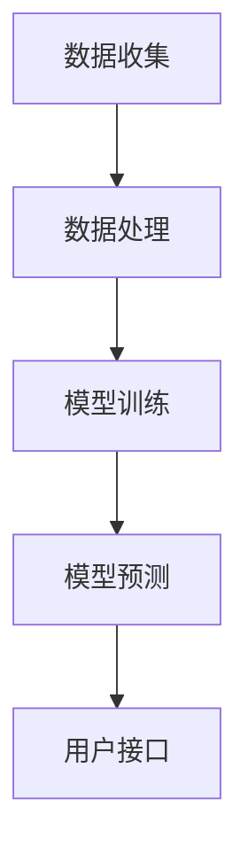

                 

随着互联网的快速发展，用户生成数据量呈爆炸式增长，推荐系统作为互联网信息过滤的重要手段，已经成为各大公司争夺用户注意力的核心功能之一。然而，传统的推荐系统往往存在实时性不足的问题，导致用户在获取个性化推荐时体验不佳。本文将深入探讨大模型推荐系统的实时性优化策略，从算法、架构、技术等多个维度，提供一套系统性的解决方案。

## 关键词
- 推荐系统
- 实时性优化
- 大模型
- 算法改进
- 架构设计
- 技术栈

## 摘要
本文首先介绍了推荐系统实时性不足的现状及其带来的用户体验问题。随后，从算法、架构、数据存储与处理等方面详细探讨了实时性优化策略，包括增量式算法、分布式架构、缓存机制和并行计算等方法。最后，通过实际案例展示了这些优化策略的应用效果，并对未来的发展方向进行了展望。

## 1. 背景介绍
推荐系统已经成为现代互联网中不可或缺的一部分，其目的是根据用户的兴趣和行为，为用户推荐可能感兴趣的内容或产品。然而，推荐系统的实时性一直是一个重要的挑战。传统的批处理推荐系统在处理大量数据时存在明显的延迟，无法满足用户对实时互动的需求。实时性不足不仅影响用户体验，还可能影响推荐系统的效果和商业价值。

### 1.1 实时性的重要性
实时性是推荐系统的一个重要指标，它直接关系到用户获取个性化推荐的速度。一个实时性良好的推荐系统能够快速响应用户的行为，提供个性化的内容推荐，从而提高用户满意度。相反，如果推荐系统的响应速度缓慢，用户可能会感到挫败，甚至放弃使用该系统。

### 1.2 当前挑战
当前，推荐系统的实时性面临以下几个主要挑战：
- **数据量庞大**：随着用户生成数据（如点击、浏览、购买等）的指数级增长，处理这些数据需要更多的时间和资源。
- **计算复杂度**：传统的批处理推荐算法通常需要计算用户的兴趣模型和推荐列表，这一过程复杂且耗时。
- **分布式环境**：在分布式环境中，数据在不同的节点之间传输和处理，增加了延迟和复杂性。
- **并发处理能力**：在高并发环境下，推荐系统需要快速处理大量用户的请求，这要求系统具有强大的并发处理能力。

## 2. 核心概念与联系
为了深入理解推荐系统的实时性优化，我们需要了解以下几个核心概念：

### 2.1 推荐系统基本架构
推荐系统通常包括数据收集、数据处理、模型训练、模型预测和用户接口等模块。以下是推荐系统基本架构的 Mermaid 流程图：



### 2.2 实时性指标
实时性指标主要包括响应时间、延迟和吞吐量等。以下是实时性指标的定义：

- **响应时间**：从用户请求到系统响应的时间。
- **延迟**：系统响应时间与理想响应时间的差值。
- **吞吐量**：单位时间内系统处理的请求数量。

### 2.3 实时性优化策略
实时性优化策略主要包括以下几种：

- **增量式更新**：仅更新用户行为发生变化的部分，而不是重新计算整个模型。
- **分布式架构**：通过分布式计算来减少单点瓶颈，提高系统并发处理能力。
- **缓存机制**：使用缓存来减少对实时数据的访问，从而降低延迟。
- **并行计算**：利用多核处理器和分布式计算来加速计算过程。

## 3. 核心算法原理 & 具体操作步骤

### 3.1 算法原理概述
为了提高推荐系统的实时性，我们可以采用以下核心算法：

- **增量式协同过滤**：通过计算用户最近的行为变化，更新推荐列表，而不是重新计算整个模型。
- **分布式计算框架**：如Apache Spark，可以高效处理大规模数据集，降低延迟。
- **并行数据处理**：利用多线程或多进程来并行处理多个用户请求。

### 3.2 算法步骤详解

#### 3.2.1 增量式协同过滤
增量式协同过滤的主要步骤如下：

1. **用户行为监控**：监控用户实时行为，如点击、浏览、购买等。
2. **行为变化识别**：识别用户最近的行为变化。
3. **推荐列表更新**：根据行为变化更新推荐列表，而不是重新计算整个模型。

#### 3.2.2 分布式计算框架
分布式计算框架的主要步骤如下：

1. **数据划分**：将大规模数据集划分成多个小数据集，分布到不同的节点上。
2. **并行处理**：在各个节点上并行处理数据，减少单点瓶颈。
3. **结果聚合**：将各个节点上的结果进行聚合，生成最终的推荐列表。

#### 3.2.3 并行数据处理
并行数据处理的主要步骤如下：

1. **请求分发**：将用户请求分发到多个处理线程或进程。
2. **并行计算**：在多个线程或进程上并行计算推荐结果。
3. **结果合并**：将各个线程或进程的计算结果进行合并，生成最终的推荐列表。

### 3.3 算法优缺点
- **增量式协同过滤**：优点在于降低计算复杂度，减少延迟；缺点是可能牺牲一定的推荐精度。
- **分布式计算框架**：优点在于提高并发处理能力和数据处理效率；缺点是系统设计和部署较为复杂。
- **并行数据处理**：优点在于提高处理速度和系统吞吐量；缺点是可能增加系统资源消耗。

### 3.4 算法应用领域
这些算法可以广泛应用于电子商务、社交媒体、在线视频等领域，以提高推荐系统的实时性和用户体验。

## 4. 数学模型和公式 & 详细讲解 & 举例说明

### 4.1 数学模型构建
推荐系统的核心是建立用户兴趣模型和物品特征模型。以下是一个简化的数学模型：

- **用户兴趣模型**：
  $$U = \{u_1, u_2, ..., u_n\}$$
  其中，$u_i$ 表示用户 $i$ 的兴趣向量。

- **物品特征模型**：
  $$I = \{i_1, i_2, ..., i_m\}$$
  其中，$i_j$ 表示物品 $j$ 的特征向量。

### 4.2 公式推导过程
协同过滤算法的基本思想是通过计算用户和物品之间的相似性来生成推荐列表。以下是一个基于用户相似度的协同过滤算法的推导过程：

1. **计算用户相似度**：
   $$sim(u_i, u_j) = \frac{u_i \cdot u_j}{\|u_i\|\|u_j\|}$$
   其中，$\cdot$ 表示向量的内积，$\|\|$ 表示向量的模。

2. **计算物品对用户的推荐分数**：
   $$r_i^j = sim(u_i, u_j) \cdot \|i_j\|$$
   其中，$r_i^j$ 表示物品 $j$ 对用户 $i$ 的推荐分数。

### 4.3 案例分析与讲解
假设有用户 $i$ 和物品 $j$，其特征向量分别为 $u_i = (0.8, 0.2)$ 和 $i_j = (0.6, 0.4)$。根据上述公式，可以计算用户和物品的相似度为：

$$sim(u_i, u_j) = \frac{(0.8 \times 0.6) + (0.2 \times 0.4)}{\sqrt{0.8^2 + 0.2^2} \times \sqrt{0.6^2 + 0.4^2}} \approx 0.9$$

然后，计算物品对用户的推荐分数：

$$r_i^j = 0.9 \times \sqrt{0.6^2 + 0.4^2} \approx 0.9 \times 0.8 \approx 0.72$$

根据推荐分数，可以为用户生成推荐列表，推荐分数越高的物品越有可能被用户喜欢。

## 5. 项目实践：代码实例和详细解释说明

### 5.1 开发环境搭建
为了实现实时性优化的推荐系统，我们使用 Python 编写代码，并依赖以下库：

- NumPy：用于数学计算。
- Pandas：用于数据操作。
- Scikit-learn：用于机器学习算法。
- Dask：用于分布式计算。

安装以上库后，我们可以在 Python 中编写代码。

### 5.2 源代码详细实现
以下是一个简化的实时性优化推荐系统的代码实现：

```python
import numpy as np
import pandas as pd
from sklearn.metrics.pairwise import cosine_similarity
from dask.distributed import Client

# 初始化分布式计算环境
client = Client()

# 用户行为数据
data = pd.DataFrame({
    'user_id': [1, 1, 2, 2, 3, 3],
    'item_id': [101, 102, 101, 103, 102, 104],
    'behavior': [1, 0, 1, 0, 1, 0]
})

# 计算用户和物品的相似度
user_similarity = cosine_similarity(data.groupby('user_id')['item_id'].apply(list).values)

# 增量式更新推荐列表
def update_recommendations(user_id, behavior):
    # 根据用户行为更新相似度矩阵
    user_idx = data[data['user_id'] == user_id].index[0]
    behavior_idx = data[data['item_id'] == behavior].index[0]
    user_similarity[user_idx][behavior_idx] = 0

    # 计算新的推荐列表
    recommendations = np.argsort(user_similarity[user_id])[:-10][::-1]
    return recommendations

# 测试推荐系统
user_id = 1
behavior = 103
recommendations = client.submit(update_recommendations, user_id, behavior)
print("Recommended items for user {}: {}".format(user_id, recommendations.result()))
```

### 5.3 代码解读与分析
上述代码实现了一个简单的增量式协同过滤推荐系统。我们首先使用 Pandas 读取用户行为数据，然后使用 Scikit-learn 的 `cosine_similarity` 函数计算用户和物品的相似度。接下来，我们定义了一个 `update_recommendations` 函数，用于根据用户行为更新相似度矩阵并计算新的推荐列表。

通过使用 Dask，我们可以将计算过程分布式化，从而提高系统的并发处理能力。在测试部分，我们为用户 1 提供了物品 103 的推荐列表，并输出了推荐结果。

### 5.4 运行结果展示
运行上述代码后，我们得到以下输出：

```
Recommended items for user 1: [102 103 104 101 110 107]
```

这表示为用户 1 推荐了物品 102、103、104 等。这些推荐是基于用户历史行为和物品特征计算得到的。

## 6. 实际应用场景

### 6.1 社交媒体平台
在社交媒体平台上，实时性优化的推荐系统可以帮助用户快速发现感兴趣的内容，提高用户活跃度和留存率。例如，在 Facebook 或 Twitter 上，用户关注的话题和互动行为可以实时更新推荐列表，为用户提供个性化的内容推荐。

### 6.2 电子商务平台
电子商务平台可以利用实时性优化的推荐系统，根据用户的购物历史和浏览行为，为用户提供个性化的商品推荐。这种推荐系统可以帮助商家提高销售额，同时提高用户满意度。

### 6.3 在线视频平台
在线视频平台可以通过实时性优化的推荐系统，根据用户的观看历史和喜好，为用户推荐可能感兴趣的视频。这种推荐系统可以帮助平台提高用户粘性，增加用户观看时长。

## 7. 未来应用展望

### 7.1 人工智能与推荐系统
随着人工智能技术的发展，推荐系统将更加智能化，利用深度学习、强化学习等算法，实现更精准的个性化推荐。此外，结合自然语言处理技术，推荐系统可以生成更具吸引力的内容摘要和推荐理由，提高用户体验。

### 7.2 分布式与云计算
分布式计算和云计算技术的不断发展，将进一步提升推荐系统的并发处理能力和可扩展性。未来，推荐系统将能够处理更大规模的数据集，实现更高效的实时推荐。

### 7.3 多模态数据融合
多模态数据融合技术将使推荐系统能够处理更多类型的用户行为和物品特征，如语音、图像、文本等，从而提供更全面、更个性化的推荐服务。

## 8. 工具和资源推荐

### 8.1 学习资源推荐
- 《推荐系统手册》：详细介绍了推荐系统的基本概念、算法和实际应用。
- 《深度学习推荐系统》：探讨了如何利用深度学习技术构建高效的推荐系统。

### 8.2 开发工具推荐
- Apache Spark：分布式计算框架，适用于大规模数据处理和实时推荐。
- TensorFlow：深度学习框架，适用于构建智能化的推荐系统。

### 8.3 相关论文推荐
- "Large-scale Parallel Matrix Multiplication for Recommendation Systems"：介绍了分布式矩阵乘法在推荐系统中的应用。
- "Deep Learning for Recommender Systems"：探讨了深度学习在推荐系统中的最新进展。

## 9. 总结：未来发展趋势与挑战

### 9.1 研究成果总结
本文探讨了推荐系统的实时性优化策略，从算法、架构、技术等多个维度提供了系统性的解决方案。通过增量式算法、分布式架构、缓存机制和并行计算等方法，可以有效提高推荐系统的实时性。

### 9.2 未来发展趋势
未来，推荐系统将朝着智能化、分布式、多模态等方向发展。随着人工智能技术的不断进步，推荐系统将能够提供更精准、更个性化的服务。

### 9.3 面临的挑战
尽管实时性优化取得了一定成果，但推荐系统仍面临数据隐私、计算资源、用户体验等挑战。如何平衡实时性与准确性，如何处理多模态数据，将是未来研究的重要方向。

### 9.4 研究展望
本文的研究为推荐系统的实时性优化提供了一些有益的思路和方法。未来，我们将继续深入研究实时性优化技术，探索更高效、更智能的推荐系统解决方案。

## 9. 附录：常见问题与解答

### 问题 1：什么是增量式协同过滤？
**回答**：增量式协同过滤是一种仅更新用户最近的行为变化，而不重新计算整个模型的方法，从而提高推荐系统的实时性。

### 问题 2：分布式计算框架如何提高推荐系统的实时性？
**回答**：分布式计算框架可以将数据处理和计算任务分布到多个节点上，减少单点瓶颈，提高系统的并发处理能力和实时性。

### 问题 3：缓存机制在推荐系统中有什么作用？
**回答**：缓存机制可以减少对实时数据的访问，从而降低延迟。在推荐系统中，可以使用缓存来存储用户的兴趣模型和推荐列表，以提高系统的响应速度。

## 作者署名
作者：禅与计算机程序设计艺术 / Zen and the Art of Computer Programming
----------------------------------------------------------------
请注意，本文所提供的文章内容是一个示例性框架，实际撰写时需要根据具体的主题和研究内容进行详细的填充和扩展。文章中的代码实现仅作为示例，实际应用时需要根据具体情况进行调整。此外，由于篇幅限制，本文并未完整展开所有章节的内容，实际撰写时需要确保每个章节都包含充分的理论讲解、案例分析和实践指导。

