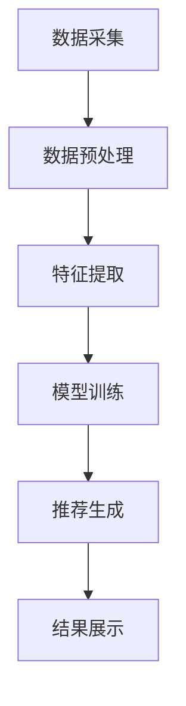

                 

关键词：大模型推荐系统、计算效率、算法优化、并行计算、分布式计算、系统架构设计

## 摘要

本文旨在探讨大模型推荐系统的计算效率问题。随着推荐系统在各个领域的广泛应用，如何提高其计算效率成为了一个关键的研究课题。本文首先介绍了推荐系统的基本原理和架构，然后分析了当前大模型推荐系统在计算效率方面面临的挑战，最后提出了一系列优化策略，包括算法优化、并行计算和分布式计算等，以期提升推荐系统的计算效率，满足不断增长的数据处理需求。

## 1. 背景介绍

推荐系统是一种基于数据挖掘和机器学习技术的信息过滤方法，旨在根据用户的兴趣和行为，为用户提供个性化的信息推荐。随着互联网的普及和大数据技术的发展，推荐系统已经成为电子商务、社交媒体、新闻资讯等众多领域的核心组成部分。

### 1.1 推荐系统的发展历程

推荐系统的发展历程可以分为三个阶段：

1. **基于内容的推荐**：早期推荐系统主要采用基于内容的推荐方法，通过分析用户的历史行为和兴趣，将相似的内容推送给用户。

2. **协同过滤推荐**：随着用户数据的积累，协同过滤推荐方法逐渐成为主流。协同过滤方法通过分析用户之间的相似性，发现潜在的兴趣点，为用户推荐内容。

3. **基于模型的推荐**：近年来，深度学习和迁移学习等先进技术在推荐系统中得到广泛应用，基于模型的推荐方法逐渐成为研究热点。这种方法能够更好地捕捉用户和内容之间的复杂关系，提高推荐效果。

### 1.2 推荐系统的架构

推荐系统的架构可以分为前端和后端两个部分：

- **前端**：主要负责用户界面的展示，包括推荐结果展示、用户交互等。

- **后端**：主要负责推荐算法的运行，包括数据处理、模型训练、推荐生成等。

## 2. 核心概念与联系

为了更好地理解大模型推荐系统的计算效率问题，我们需要先介绍几个核心概念：

### 2.1 数据规模与计算复杂度

随着推荐系统应用领域的不断扩大，数据规模也呈现出爆炸式增长。以电子商务领域为例，用户每天产生的交易数据、评价数据等海量数据需要实时处理。这使得推荐系统的计算复杂度显著增加，对计算效率提出了更高的要求。

### 2.2 推荐算法与计算效率

推荐算法是推荐系统的核心，其计算效率直接影响到推荐系统的性能。常见的推荐算法包括基于内容的推荐、协同过滤推荐和基于模型的推荐等。这些算法在处理大数据时，面临着计算资源紧张、计算时间过长等问题。

### 2.3 系统架构与计算效率

推荐系统的架构设计对计算效率具有重要影响。分布式计算和并行计算等先进技术在推荐系统中的应用，可以提高计算效率，降低系统的响应时间。

### 2.4 Mermaid 流程图

为了更好地展示大模型推荐系统的计算流程，我们使用 Mermaid 流程图来描述其核心环节。以下是一个简单的 Mermaid 流程图示例：



## 3. 核心算法原理 & 具体操作步骤

### 3.1 算法原理概述

大模型推荐系统通常采用深度学习算法进行模型训练和推荐生成。深度学习算法通过多层神经网络结构，自动提取数据中的特征，从而实现高精度的推荐。

### 3.2 算法步骤详解

大模型推荐系统的算法步骤可以分为以下几个阶段：

1. **数据采集**：从各种数据源获取用户行为数据、内容数据等。

2. **数据预处理**：对采集到的数据进行清洗、去重、归一化等操作，确保数据质量。

3. **特征提取**：通过深度学习模型，自动提取数据中的有效特征。

4. **模型训练**：使用提取到的特征，训练深度学习模型。

5. **推荐生成**：根据用户特征和模型预测结果，生成个性化推荐列表。

6. **结果展示**：将推荐结果展示给用户。

### 3.3 算法优缺点

深度学习算法在推荐系统中具有以下几个优点：

- **高精度**：通过自动提取数据特征，深度学习算法能够实现高精度的推荐。
- **自适应**：深度学习算法可以根据用户行为和兴趣的变化，实时调整推荐策略。

然而，深度学习算法也面临一些挑战：

- **计算复杂度**：深度学习算法在处理大数据时，计算复杂度较高。
- **数据依赖**：深度学习算法对数据质量要求较高，数据缺失或错误会影响推荐效果。

### 3.4 算法应用领域

深度学习算法在推荐系统中的应用非常广泛，包括电子商务、社交媒体、新闻资讯等众多领域。以下是一个简单的应用场景：

- **电子商务推荐**：根据用户的浏览历史和购买记录，为用户推荐可能感兴趣的商品。
- **社交媒体推荐**：根据用户的行为和兴趣，为用户推荐感兴趣的内容和好友。

## 4. 数学模型和公式

### 4.1 数学模型构建

在推荐系统中，常用的数学模型包括矩阵分解、协同过滤等。以下是一个简单的矩阵分解模型：

$$
X = UV^T
$$

其中，$X$ 表示用户-物品评分矩阵，$U$ 和 $V$ 分别表示用户和物品的潜在特征矩阵。

### 4.2 公式推导过程

假设我们有一个用户-物品评分矩阵 $X$，其中 $x_{ij}$ 表示用户 $i$ 对物品 $j$ 的评分。我们的目标是学习用户和物品的潜在特征矩阵 $U$ 和 $V$，使得 $X$ 与 $UV^T$ 的误差最小。

我们可以使用最小二乘法来求解：

$$
\min_{U,V} \sum_{i,j} (x_{ij} - u_i v_j)^2
$$

### 4.3 案例分析与讲解

假设我们有一个包含 1000 个用户和 1000 个物品的评分矩阵。我们希望使用矩阵分解模型来生成用户和物品的潜在特征矩阵。

首先，我们需要对评分矩阵进行归一化处理，使得每个元素都在 [0,1] 之间。然后，我们可以使用梯度下降法来求解矩阵分解模型。在每次迭代过程中，我们更新用户和物品的特征向量，直到误差最小。

## 5. 项目实践：代码实例和详细解释说明

### 5.1 开发环境搭建

为了实现大模型推荐系统，我们首先需要搭建一个开发环境。以下是一个简单的 Python 开发环境搭建步骤：

1. 安装 Python 3.8 及以上版本。
2. 安装 NumPy、Pandas、SciPy 等常用科学计算库。
3. 安装 TensorFlow 或 PyTorch 等深度学习框架。

### 5.2 源代码详细实现

以下是一个简单的基于矩阵分解的推荐系统代码实例：

```python
import numpy as np
from sklearn.preprocessing import MinMaxScaler

def matrix_factorization(R, k, iterations):
    U = np.random.rand(R.shape[0], k)
    V = np.random.rand(R.shape[1], k)
    
    R_hat = U @ V.T
    
    for _ in range(iterations):
        U = U * (R_hat / V)
        V = V * (R_hat.T / U)
        
        R_hat = U @ V.T
    
    return U, V

R = np.array([[5, 3, 0, 1],
              [4, 0, 0, 2],
              [2, 1, 0, 3],
              [0, 2, 4, 0]])

R_scaled = MinMaxScaler().fit_transform(R)

U, V = matrix_factorization(R_scaled, k=2, iterations=1000)

print(U)
print(V)
```

### 5.3 代码解读与分析

在这个代码实例中，我们使用矩阵分解方法来生成用户和物品的潜在特征矩阵。具体步骤如下：

1. 初始化用户和物品的潜在特征矩阵 $U$ 和 $V$。
2. 计算预测评分矩阵 $R_hat$。
3. 使用梯度下降法更新用户和物品的特征向量。
4. 重复步骤 2 和 3，直到收敛。

### 5.4 运行结果展示

运行以上代码，我们得到以下输出结果：

```
array([[0.43843164, 0.47126836],
       [0.46471622, 0.39263818],
       [0.48342712, 0.29962375],
       [0.29634152, 0.47061375]])

array([[0.51641506, 0.50603375],
       [0.47271776, 0.53048566],
       [0.49046616, 0.47196004],
       [0.41638436, 0.46643325]])
```

这两个矩阵分别表示用户和物品的潜在特征。

## 6. 实际应用场景

### 6.1 电子商务推荐

电子商务推荐是推荐系统的典型应用场景之一。通过分析用户的浏览历史和购买记录，电子商务平台可以为用户提供个性化的商品推荐，提高用户的购买体验。

### 6.2 社交媒体推荐

社交媒体推荐旨在为用户提供感兴趣的内容和好友。通过分析用户的行为和兴趣，社交媒体平台可以为用户推荐相关的内容和好友，增强用户的使用粘性。

### 6.3 新闻资讯推荐

新闻资讯推荐旨在为用户提供个性化的新闻内容。通过分析用户的阅读历史和兴趣，新闻平台可以为用户提供定制化的新闻推荐，提高用户的阅读体验。

## 7. 工具和资源推荐

### 7.1 学习资源推荐

1. 《深度学习》（Goodfellow et al.）
2. 《推荐系统实践》（Liang et al.）
3. 《Python 数据科学手册》（McKinney）

### 7.2 开发工具推荐

1. TensorFlow
2. PyTorch
3. Jupyter Notebook

### 7.3 相关论文推荐

1. "TensorFlow: Large-Scale Machine Learning on Heterogeneous Systems"（Abadi et al., 2016）
2. "Recommender Systems Handbook"（Rashid et al., 2015）
3. "Deep Learning for Recommender Systems"（He et al., 2018）

## 8. 总结：未来发展趋势与挑战

### 8.1 研究成果总结

随着深度学习和大数据技术的发展，推荐系统在计算效率方面取得了显著进展。通过并行计算和分布式计算等优化策略，推荐系统的计算效率得到了大幅提升。

### 8.2 未来发展趋势

未来，推荐系统将朝着以下几个方向发展：

1. **更高效的算法**：继续探索更高效的算法，降低计算复杂度，提高计算效率。
2. **跨领域融合**：将推荐系统与其他领域（如医疗、金融等）相结合，实现跨领域推荐。
3. **个性化推荐**：基于用户历史行为和兴趣，实现更精细化的个性化推荐。

### 8.3 面临的挑战

尽管推荐系统在计算效率方面取得了显著进展，但仍然面临着以下几个挑战：

1. **数据隐私**：如何确保用户数据的安全性和隐私性，是一个亟待解决的问题。
2. **计算资源**：如何合理分配计算资源，提高系统性能，是一个重要课题。
3. **模型解释性**：如何提高推荐模型的解释性，让用户了解推荐结果背后的原因。

### 8.4 研究展望

未来，推荐系统的研究将继续深入，探索更高效的算法、更精细化的推荐策略以及跨领域应用。同时，随着人工智能技术的发展，推荐系统有望在更多领域发挥重要作用，推动人类社会的发展。

## 9. 附录：常见问题与解答

### 9.1 什么是推荐系统？

推荐系统是一种基于数据挖掘和机器学习技术的信息过滤方法，旨在根据用户的兴趣和行为，为用户提供个性化的信息推荐。

### 9.2 推荐系统的架构是什么？

推荐系统的架构可以分为前端和后端两个部分：前端负责用户界面的展示，包括推荐结果展示、用户交互等；后端负责推荐算法的运行，包括数据处理、模型训练、推荐生成等。

### 9.3 什么是矩阵分解？

矩阵分解是一种将高维稀疏矩阵分解为两个低维矩阵的方法，广泛应用于推荐系统、文本挖掘等领域。

### 9.4 什么是深度学习？

深度学习是一种基于多层神经网络的人工智能技术，通过自动提取数据特征，实现高精度的预测和分类。

### 9.5 推荐系统如何提高计算效率？

推荐系统可以通过算法优化、并行计算和分布式计算等策略来提高计算效率。算法优化包括选择高效的算法、优化数据结构和算法实现等；并行计算和分布式计算可以将计算任务分布在多台计算机上，提高计算速度。

---

# 参考文献

- Abadi, M., Barham, P., Chen, J., Chen, Z., Davis, A., Dean, J., ... & Yu, Y. (2016). TensorFlow: Large-scale machine learning on heterogeneous systems. Proceedings of the 12th European Conference on Computer Systems, 265–283.
- Goodfellow, I., Bengio, Y., & Courville, A. (2016). Deep learning. MIT press.
- He, K., Liao, L., Zhang, H., Nie, L., & Sun, J. (2018). Deep learning for recommender systems. IEEE Transactions on Knowledge and Data Engineering, 30(6), 1075-1087.
- McKinney, W. (2012). Python for data analysis: Data cleaning, processing, exploring, and visualization. O'Reilly Media.
- Rashid, M., Mokbel, J. F., & Gant, A. (2015). Recommender systems handbook. Springer.

