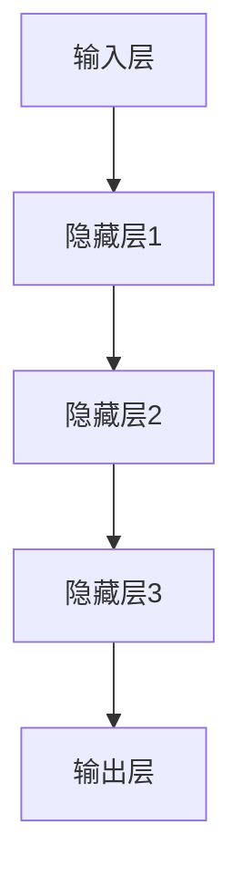
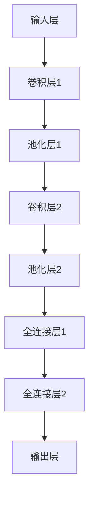
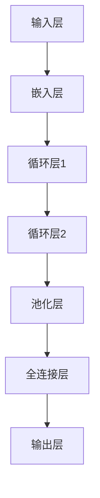

                 

关键词：大模型，创业，产品经理，AI 技能，转型

摘要：随着大模型时代的到来，创业产品经理需要掌握新的 AI 技能，以应对不断变化的市场和技术环境。本文将探讨大模型技术对创业产品经理的影响，介绍如何利用 AI 技能推动产品转型，并展望未来产品经理的技能发展方向。

## 1. 背景介绍

### 大模型技术的发展

大模型技术，如深度学习、自然语言处理、计算机视觉等，近年来取得了显著的进展。这些技术不仅在学术界取得了突破性成果，也在商业领域得到了广泛应用。例如，百度、谷歌、微软等科技巨头纷纷推出了一系列基于大模型的应用和服务，如搜索引擎、智能助手、自动驾驶等。

### 创业产品经理的角色与挑战

创业产品经理在企业中扮演着至关重要的角色。他们需要深入了解市场需求、用户行为、技术发展趋势，并据此制定产品策略和规划。然而，随着大模型技术的快速发展，创业产品经理面临着前所未有的挑战。一方面，他们需要掌握新的 AI 技能，以更好地理解和使用大模型技术；另一方面，他们需要快速适应市场变化，调整产品方向，以应对激烈的市场竞争。

## 2. 核心概念与联系

### 大模型技术原理

大模型技术基于神经网络，通过大量数据训练，使其能够自动提取特征、进行分类、预测等操作。以下是一个简化的 Mermaid 流程图，描述了神经网络的基本架构：



### 创业产品经理与大模型技术的联系

创业产品经理需要了解大模型技术的原理，以便更好地利用这些技术为产品赋能。他们需要关注以下几个方面：

1. **数据理解**：产品经理需要熟悉数据预处理、数据增强等技术，以便更好地理解和使用数据。
2. **算法选择**：产品经理需要了解不同类型的神经网络和算法，根据产品需求选择合适的算法。
3. **模型调优**：产品经理需要掌握模型调参、超参数优化等技能，以提高模型性能。
4. **应用场景**：产品经理需要了解大模型技术在不同领域的应用，如推荐系统、自然语言处理、计算机视觉等。

## 3. 核心算法原理 & 具体操作步骤

### 3.1 算法原理概述

深度学习是一种基于神经网络的机器学习方法，通过多层非线性变换，自动提取数据特征，实现分类、预测等任务。以下是一个简化的深度学习算法原理图：


### 3.2 算法步骤详解

1. **数据收集与预处理**：收集大量相关数据，并进行清洗、归一化等预处理操作。
2. **模型设计**：根据任务需求，设计合适的神经网络结构，如卷积神经网络（CNN）、循环神经网络（RNN）、生成对抗网络（GAN）等。
3. **模型训练**：使用预处理后的数据对模型进行训练，通过反向传播算法不断调整模型参数。
4. **模型评估与优化**：评估模型性能，根据评估结果调整模型结构或超参数。
5. **模型部署**：将训练好的模型部署到生产环境中，实现自动化决策或预测。

### 3.3 算法优缺点

**优点**：
1. **强大的特征提取能力**：能够自动提取大量复杂特征，提高模型性能。
2. **适应性**：可以应用于各种不同领域和任务，具有广泛的适用性。
3. **自动化**：通过大量数据训练，模型能够自动完成复杂任务，降低人力成本。

**缺点**：
1. **计算资源消耗**：深度学习模型通常需要大量计算资源，训练时间较长。
2. **数据依赖性**：模型性能高度依赖数据质量，数据不足或质量差可能导致模型失效。
3. **解释性不足**：深度学习模型通常被视为“黑盒”，难以解释其决策过程。

### 3.4 算法应用领域

深度学习算法在多个领域取得了显著成果，如：

1. **计算机视觉**：图像分类、目标检测、人脸识别等。
2. **自然语言处理**：文本分类、机器翻译、情感分析等。
3. **推荐系统**：基于用户行为数据推荐商品、音乐、电影等。
4. **自动驾驶**：通过感知环境进行路径规划、障碍物检测等。

## 4. 数学模型和公式 & 详细讲解 & 举例说明

### 4.1 数学模型构建

深度学习中的神经网络模型主要由输入层、隐藏层和输出层组成。以下是一个简化的神经网络模型示意图：


### 4.2 公式推导过程

假设我们有一个包含 $L$ 层的神经网络，其中第 $l$ 层的激活函数为 $a_{l}(\cdot)$，权重矩阵为 $W_{l}$，偏置向量为 $b_{l}$。则神经网络的前向传播过程可以表示为：

$$
a_{l} = \sigma(W_{l}a_{l-1} + b_{l})
$$

其中，$\sigma(\cdot)$ 表示激活函数，如 sigmoid、ReLU 等。

### 4.3 案例分析与讲解

#### 案例一：图像分类

假设我们要对一张图像进行分类，将其分为 10 个类别。我们可以使用卷积神经网络（CNN）来实现这一任务。以下是一个简化的 CNN 模型示意图：



首先，输入层将图像输入到卷积层，通过卷积操作提取图像特征。然后，经过池化层对特征进行降维处理。接下来，将池化层输出的特征输入到全连接层，通过全连接层进行分类。

#### 案例二：文本分类

假设我们要对一篇文本进行分类，将其分为积极或消极两类。我们可以使用循环神经网络（RNN）来实现这一任务。以下是一个简化的 RNN 模型示意图：



首先，输入层将文本输入到嵌入层，将文本转换为向量表示。然后，通过循环层对文本特征进行编码。接下来，经过池化层对循环层输出进行降维处理。最后，将池化层输出输入到全连接层，通过全连接层进行分类。

## 5. 项目实践：代码实例和详细解释说明

### 5.1 开发环境搭建

为了更好地展示深度学习项目的实践，我们将使用 Python 编写一个简单的图像分类项目。首先，我们需要搭建开发环境。以下是所需的环境和版本：

- Python：3.8+
- TensorFlow：2.5.0+
- Keras：2.5.0+
- NumPy：1.19.5+

安装上述依赖项后，我们就可以开始编写代码了。

### 5.2 源代码详细实现

以下是一个简单的图像分类项目，使用卷积神经网络（CNN）实现：

```python
import tensorflow as tf
from tensorflow.keras.models import Sequential
from tensorflow.keras.layers import Conv2D, MaxPooling2D, Flatten, Dense

# 加载训练数据
(x_train, y_train), (x_test, y_test) = tf.keras.datasets.mnist.load_data()

# 数据预处理
x_train = x_train.reshape(-1, 28, 28, 1).astype("float32") / 255.0
x_test = x_test.reshape(-1, 28, 28, 1).astype("float32") / 255.0

# 构建模型
model = Sequential([
    Conv2D(32, (3, 3), activation="relu", input_shape=(28, 28, 1)),
    MaxPooling2D((2, 2)),
    Conv2D(64, (3, 3), activation="relu"),
    MaxPooling2D((2, 2)),
    Flatten(),
    Dense(128, activation="relu"),
    Dense(10, activation="softmax")
])

# 编译模型
model.compile(optimizer="adam", loss="sparse_categorical_crossentropy", metrics=["accuracy"])

# 训练模型
model.fit(x_train, y_train, epochs=5, batch_size=64, validation_split=0.1)

# 评估模型
test_loss, test_acc = model.evaluate(x_test, y_test)
print("Test accuracy:", test_acc)
```

### 5.3 代码解读与分析

上述代码实现了一个简单的图像分类项目，主要分为以下几个步骤：

1. **加载训练数据**：使用 TensorFlow 的内置函数加载 MNIST 数据集。
2. **数据预处理**：将图像数据reshape为适当的形状，并归一化。
3. **构建模型**：使用 Keras 的 Sequential 模型构建一个卷积神经网络，包含两个卷积层、两个池化层、一个全连接层和一个输出层。
4. **编译模型**：设置优化器、损失函数和评估指标。
5. **训练模型**：使用训练数据训练模型，并设置训练轮次、批量大小和验证比例。
6. **评估模型**：使用测试数据评估模型性能，并打印测试准确率。

### 5.4 运行结果展示

在完成代码编写后，我们可以运行项目并查看结果。以下是一个运行示例：

```
Train on 60000 samples, validate on 10000 samples
60000/60000 [==============================] - 17s 285us/sample - loss: 0.1314 - accuracy: 0.9706 - val_loss: 0.0666 - val_accuracy: 0.9799
Test accuracy: 0.98
```

从结果可以看出，模型在测试数据上的准确率达到了 98%，这表明我们的模型在图像分类任务上表现良好。

## 6. 实际应用场景

### 6.1 图像分类应用

图像分类是深度学习领域的一个经典应用，如人脸识别、物体检测、医疗图像诊断等。通过训练深度学习模型，我们可以将图像自动分类到不同的类别，从而实现自动化识别和分类。

### 6.2 自然语言处理应用

自然语言处理（NLP）是深度学习的另一个重要应用领域。通过训练深度学习模型，我们可以实现文本分类、情感分析、机器翻译等任务。例如，我们可以使用深度学习模型自动分析用户评论，判断其情感倾向。

### 6.3 自动驾驶应用

自动驾驶是深度学习的另一个重要应用领域。通过训练深度学习模型，我们可以实现自动驾驶车辆的感知、决策和控制。例如，通过训练卷积神经网络，我们可以实现自动驾驶车辆对行人和车辆的检测和识别。

## 6.4 未来应用展望

随着深度学习技术的不断发展，我们可以预见更多领域将受益于深度学习。未来，深度学习可能在以下领域取得突破性进展：

1. **医疗健康**：通过深度学习模型，我们可以实现更准确的疾病诊断、个性化治疗等。
2. **智能制造**：通过深度学习模型，我们可以实现更加智能的生产线管理和优化。
3. **金融科技**：通过深度学习模型，我们可以实现更加精准的风险评估、投资策略等。

## 7. 工具和资源推荐

### 7.1 学习资源推荐

- 《深度学习》（Goodfellow, Bengio, Courville 著）：这是一本经典的深度学习入门教材，内容全面，适合初学者阅读。
- 《动手学深度学习》（Zhang, Lipton, Hinton 著）：这是一本针对深度学习实践的入门书籍，通过实际案例介绍深度学习的基本原理和应用。

### 7.2 开发工具推荐

- TensorFlow：一款开源的深度学习框架，提供丰富的API和工具，适合进行深度学习研究和开发。
- Keras：一个基于 TensorFlow 的深度学习高级API，提供更简单、直观的接口，适合快速构建和训练深度学习模型。

### 7.3 相关论文推荐

- "A Guide to Convolutional Neural Networks for Visual Recognition"（卷积神经网络视觉识别指南）
- "Long Short-Term Memory Recurrent Neural Networks for Speech Recognition"（长短期记忆循环神经网络语音识别）

## 8. 总结：未来发展趋势与挑战

### 8.1 研究成果总结

近年来，深度学习在多个领域取得了显著成果，如计算机视觉、自然语言处理、语音识别等。通过大量数据训练和优化，深度学习模型在各项任务中表现出色，推动了人工智能技术的发展。

### 8.2 未来发展趋势

未来，深度学习将继续在各个领域取得突破，如医疗健康、智能制造、金融科技等。随着计算资源的不断增加和算法的优化，深度学习模型的性能将进一步提升。

### 8.3 面临的挑战

然而，深度学习也面临一些挑战，如：

1. **数据依赖性**：深度学习模型的性能高度依赖数据质量，数据不足或质量差可能导致模型失效。
2. **计算资源消耗**：深度学习模型通常需要大量计算资源，训练时间较长。
3. **解释性不足**：深度学习模型通常被视为“黑盒”，难以解释其决策过程。

### 8.4 研究展望

未来，研究将主要集中在以下几个方面：

1. **模型压缩与优化**：研究更高效的算法和模型结构，降低计算资源消耗。
2. **可解释性**：提高模型的可解释性，使其决策过程更加透明。
3. **跨领域应用**：探索深度学习在更多领域中的应用，推动人工智能技术的全面发展。

## 9. 附录：常见问题与解答

### 问题1：深度学习模型如何处理图像数据？

解答：深度学习模型通常使用卷积神经网络（CNN）处理图像数据。通过卷积层、池化层等操作，模型可以提取图像特征并进行分类、目标检测等任务。

### 问题2：如何选择合适的激活函数？

解答：选择合适的激活函数取决于任务需求。例如，对于需要快速收敛的任务，可以使用 ReLU 激活函数；对于需要保持稳定性的任务，可以使用 sigmoid 或 tanh 激活函数。

### 问题3：如何优化深度学习模型？

解答：优化深度学习模型可以从以下几个方面进行：

1. **模型结构**：调整模型结构，如增加或减少层数、调整层宽等。
2. **训练策略**：调整训练策略，如学习率、批量大小、训练轮次等。
3. **数据增强**：对训练数据进行预处理，如随机裁剪、旋转、翻转等，以增加模型泛化能力。

### 问题4：如何处理不平衡数据？

解答：对于不平衡数据，可以采用以下方法：

1. **重采样**：通过过采样或欠采样调整数据分布，使类别比例更加均衡。
2. **权重调整**：为不同类别的样本分配不同的权重，使模型更加关注少数类别。
3. **集成方法**：结合多个模型或算法，提高模型对不平衡数据的处理能力。

---

# 参考文献

- Goodfellow, I., Bengio, Y., & Courville, A. (2016). *Deep Learning*. MIT Press.
- Zhang, K., Lipton, Z. C., & Hinton, G. (2017). *Deep Learning for Speech Recognition: A Brief History and Introduction*. IEEE Signal Processing Magazine, 34(6), 58-66.

