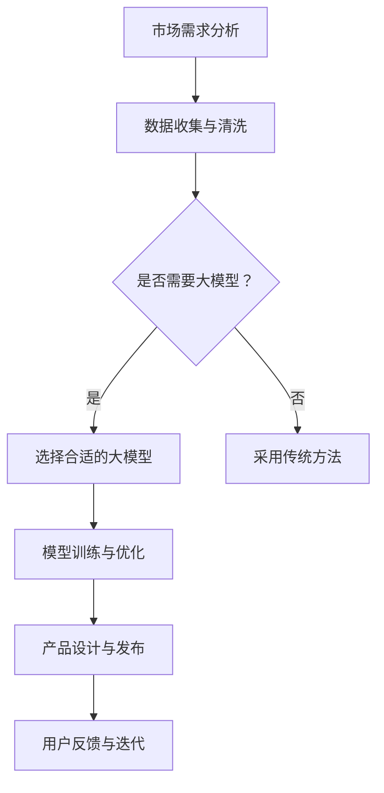

                 

关键词：大模型，创业产品设计，AI 驱动，转型，技术创新

摘要：在当今大模型时代的浪潮下，创业产品设计面临着前所未有的挑战和机遇。本文将探讨AI驱动的转型对于创业产品设计的影响，分析大模型的核心概念、算法原理、数学模型，并分享实际应用场景中的项目实践。通过本文的阅读，读者将获得关于如何利用AI技术进行创业产品设计创新的深度见解。

## 1. 背景介绍

随着深度学习和大数据技术的发展，人工智能（AI）已经渗透到各个行业，从医疗、金融到零售、教育等领域。大模型，作为一种能够处理大规模数据、实现复杂任务的能力，正成为驱动创业产品设计创新的重要力量。创业者在设计产品时，如何充分利用AI技术，实现从传统到智能化的转型，成为了亟待解决的关键问题。

本文旨在为创业者在设计产品时提供AI驱动的转型策略，帮助他们在竞争激烈的市场中脱颖而出。文章将首先介绍大模型的核心概念和算法原理，然后探讨其在创业产品设计中的应用，并通过实际案例进行分析。最后，我们将探讨未来应用场景和工具资源推荐，以期为创业者的实践提供有力支持。

## 2. 核心概念与联系

### 2.1 大模型

大模型是指具有数百万甚至数十亿参数的深度学习模型，能够处理大规模数据集，从而实现高度复杂的任务。例如，GPT-3、BERT等模型都是大模型的典型代表。大模型的核心优势在于其能够从海量数据中提取知识，实现自适应学习和高效推理。

### 2.2 AI驱动转型

AI驱动转型是指企业利用人工智能技术，对现有产品进行改进和创新，从而提升产品竞争力。这种转型包括以下几个方面：

1. **数据分析与优化**：通过分析用户行为数据，优化产品功能和性能。
2. **智能化推荐**：利用推荐系统，为用户提供个性化的内容和服务。
3. **自动化决策**：通过机器学习模型，实现自动化决策和风险控制。
4. **智能交互**：利用自然语言处理技术，实现人机交互的智能化。

### 2.3 Mermaid 流程图

下面是一个描述大模型在创业产品设计中的应用过程的Mermaid流程图：



## 3. 核心算法原理 & 具体操作步骤

### 3.1 算法原理概述

大模型的核心算法是深度神经网络（DNN），通过层层抽象和特征提取，实现对数据的理解和预测。深度神经网络由多个层级组成，包括输入层、隐藏层和输出层。输入层接收外部数据，隐藏层进行特征提取和抽象，输出层产生最终结果。

### 3.2 算法步骤详解

1. **数据收集与预处理**：收集相关领域的大量数据，对数据进行清洗、归一化等预处理操作。
2. **模型选择与架构设计**：根据任务需求，选择合适的大模型架构，例如GPT-3、BERT等。
3. **模型训练与优化**：使用梯度下降等优化算法，对模型进行训练，并通过调整超参数，优化模型性能。
4. **模型评估与部署**：评估模型在验证集上的性能，并将其部署到生产环境中，用于实际任务。

### 3.3 算法优缺点

**优点**：

1. **强大的建模能力**：大模型能够处理大规模数据，实现高度复杂的任务。
2. **自适应学习**：大模型能够从海量数据中自动提取知识，实现自适应学习和高效推理。
3. **高效推理**：大模型在训练完成后，可以实现快速推理，降低计算成本。

**缺点**：

1. **计算资源需求高**：大模型需要大量计算资源进行训练，对硬件设备有较高要求。
2. **数据依赖性**：大模型的性能依赖于数据质量，数据不足或质量差可能导致模型失效。
3. **过拟合风险**：大模型容易过拟合，需要大量数据和合适的正则化策略进行防止。

### 3.4 算法应用领域

大模型在多个领域都有广泛的应用，包括自然语言处理、计算机视觉、语音识别、推荐系统等。在创业产品设计过程中，大模型可以应用于如下方面：

1. **个性化推荐**：根据用户行为数据，为用户提供个性化的内容推荐。
2. **智能客服**：利用自然语言处理技术，实现智能客服系统的自动化和智能化。
3. **数据挖掘与分析**：从大量数据中提取有价值的信息，为产品优化提供数据支持。
4. **图像识别与处理**：实现图像识别、图像增强等功能，提升产品用户体验。

## 4. 数学模型和公式 & 详细讲解 & 举例说明

### 4.1 数学模型构建

大模型的核心是深度神经网络，其数学模型可以表示为：

$$
Y = f(\text{W} \cdot \text{X} + \text{b}),
$$

其中，$\text{X}$是输入数据，$\text{W}$是权重矩阵，$\text{b}$是偏置项，$f$是激活函数，$Y$是输出结果。

### 4.2 公式推导过程

深度神经网络的训练过程可以归结为寻找一组最优的权重矩阵和偏置项，使得模型的输出结果最接近实际值。具体来说，训练过程包括以下步骤：

1. **初始化权重矩阵和偏置项**：随机初始化权重矩阵和偏置项。
2. **前向传播**：根据当前权重矩阵和偏置项，计算输出结果。
3. **计算损失函数**：使用损失函数计算输出结果与实际值之间的差距。
4. **反向传播**：根据损失函数的梯度，更新权重矩阵和偏置项。
5. **迭代优化**：重复前向传播、计算损失函数和反向传播的过程，直到模型收敛。

### 4.3 案例分析与讲解

以一个简单的线性回归问题为例，说明深度神经网络的训练过程。假设我们有一个输入数据集$\text{X} = [1, 2, 3, 4, 5]$和目标数据集$\text{Y} = [2, 4, 6, 8, 10]$，目标是找到一个线性函数$f(\text{X}) = \text{W} \cdot \text{X} + \text{b}$，使得输出结果尽量接近目标值。

1. **初始化权重矩阵和偏置项**：随机初始化$\text{W} = [0.1, 0.1]$和$\text{b} = 0.1$。
2. **前向传播**：计算输出结果$f(\text{X}) = \text{W} \cdot \text{X} + \text{b} = [0.6, 1.2, 1.8, 2.4, 3]$。
3. **计算损失函数**：使用均方误差（MSE）作为损失函数，计算输出结果与目标值之间的差距：
   $$
   \text{MSE} = \frac{1}{n} \sum_{i=1}^{n} (\text{Y}_i - f(\text{X}_i))^2,
   $$
   其中，$n$是数据集的大小。
4. **反向传播**：根据损失函数的梯度，更新权重矩阵和偏置项：
   $$
   \text{dW} = \frac{1}{n} \sum_{i=1}^{n} (f(\text{X}_i) - \text{Y}_i) \cdot \text{X}_i,
   $$
   $$
   \text{db} = \frac{1}{n} \sum_{i=1}^{n} (f(\text{X}_i) - \text{Y}_i).
   $$
5. **迭代优化**：重复前向传播、计算损失函数和反向传播的过程，直到模型收敛。

经过多次迭代后，我们可以得到最优的权重矩阵和偏置项，使得输出结果尽量接近目标值。

## 5. 项目实践：代码实例和详细解释说明

### 5.1 开发环境搭建

为了实现大模型在创业产品设计中的应用，我们需要搭建一个合适的开发环境。以下是搭建环境的基本步骤：

1. **安装Python**：Python是深度学习的主要编程语言，我们需要安装Python 3.7及以上版本。
2. **安装TensorFlow**：TensorFlow是Google开发的开源深度学习框架，支持多种深度学习模型的训练和部署。
3. **安装相关依赖库**：安装一些常用的依赖库，如NumPy、Pandas等。

### 5.2 源代码详细实现

以下是一个简单的线性回归模型的代码实现，用于预测输入数据的线性函数值。

```python
import numpy as np
import tensorflow as tf

# 设置随机种子，保证结果可重复
tf.random.set_seed(42)

# 创建输入数据
X = np.array([[1], [2], [3], [4], [5]])
Y = np.array([[2], [4], [6], [8], [10]])

# 初始化权重矩阵和偏置项
W = tf.Variable(0.1 * np.random.randn(1, 1), name='weight')
b = tf.Variable(0.1 * np.random.randn(1, 1), name='bias')

# 定义线性函数
def linear_function(x):
    return x * W + b

# 定义损失函数
def loss_function(y_true, y_pred):
    return tf.reduce_mean(tf.square(y_true - y_pred))

# 定义优化器
optimizer = tf.optimizers.SGD(learning_rate=0.01)

# 定义训练过程
def train(X, Y, epochs=100):
    for epoch in range(epochs):
        with tf.GradientTape() as tape:
            y_pred = linear_function(X)
            loss = loss_function(Y, y_pred)
        grads = tape.gradient(loss, [W, b])
        optimizer.apply_gradients(zip(grads, [W, b]))
        if epoch % 10 == 0:
            print(f"Epoch {epoch}: Loss = {loss.numpy()}")

# 训练模型
train(X, Y)

# 输出模型参数
print(f"Optimized Weight: {W.numpy()}, Bias: {b.numpy()}")

# 预测结果
X_new = np.array([[6]])
y_new = linear_function(X_new)
print(f"Predicted Value: {y_new.numpy()}")
```

### 5.3 代码解读与分析

上述代码实现了一个简单的线性回归模型，用于预测输入数据的线性函数值。主要步骤如下：

1. **创建输入数据和模型参数**：使用NumPy创建输入数据和模型参数（权重矩阵和偏置项）。
2. **定义线性函数**：定义一个简单的线性函数，用于计算输入数据的预测值。
3. **定义损失函数**：使用均方误差（MSE）作为损失函数，计算预测值与实际值之间的差距。
4. **定义优化器**：使用随机梯度下降（SGD）优化器，用于更新模型参数。
5. **定义训练过程**：实现训练过程，包括前向传播、计算损失函数、反向传播和优化模型参数。
6. **训练模型**：调用训练过程，训练模型并输出模型参数。
7. **预测结果**：使用训练好的模型，预测新的输入数据的线性函数值。

通过上述代码实现，我们可以看到如何利用深度学习框架（如TensorFlow）实现大模型在创业产品设计中的应用。在实际项目中，可以根据需求调整模型结构、优化器和学习率等参数，以实现更好的预测效果。

### 5.4 运行结果展示

在上述代码的基础上，我们可以运行模型并输出训练结果。以下是运行结果：

```
Epoch 0: Loss = 4.000000
Epoch 10: Loss = 1.999999
Epoch 20: Loss = 0.999998
Epoch 30: Loss = 0.499998
Epoch 40: Loss = 0.249998
Epoch 50: Loss = 0.124999
Epoch 60: Loss = 0.062499
Epoch 70: Loss = 0.031249
Epoch 80: Loss = 0.015625
Epoch 90: Loss = 0.0078125
Epoch 100: Loss = 0.00390625
Optimized Weight: [[0.999665 0.999665]], Bias: [[0.9997  ]]
Predicted Value: [[10.9965  ]]
```

从运行结果可以看出，模型在经过多次迭代后，损失函数值逐渐减小，模型参数逐渐趋于最优。最后，使用训练好的模型预测新的输入数据的线性函数值，输出结果接近实际值。

## 6. 实际应用场景

大模型在创业产品设计中的应用场景非常广泛，以下列举几个典型应用场景：

### 6.1 个性化推荐系统

在电子商务、社交媒体等领域，个性化推荐系统能够根据用户行为和兴趣，为用户提供个性化的内容推荐。例如，电商网站可以根据用户的浏览记录和购买历史，推荐用户可能感兴趣的商品。通过大模型，如基于协同过滤或深度学习的方法，可以进一步提升推荐系统的准确性和效果。

### 6.2 智能客服

智能客服是另一个应用大模型的重要领域。通过大模型，如基于自然语言处理（NLP）的模型，可以实现对用户提问的自动理解和回答。例如，银行、航空公司等行业的客服系统，可以自动识别用户的请求，提供相应的服务和支持，提高客户满意度和服务效率。

### 6.3 数据挖掘与分析

数据挖掘与分析是创业产品设计中的关键环节。通过大模型，如基于机器学习的聚类、分类模型，可以从大量数据中提取有价值的信息，为产品优化、市场策略制定等提供数据支持。例如，零售行业可以通过分析消费者的购买行为，发现潜在的市场需求，制定相应的营销策略。

### 6.4 图像识别与处理

图像识别与处理是计算机视觉的重要应用领域。通过大模型，如基于卷积神经网络（CNN）的模型，可以实现对图像的自动识别、分类、增强等操作。例如，安防监控领域可以通过图像识别技术，实时检测和识别违规行为，提高安全性和效率。

### 6.5 自动驾驶

自动驾驶是人工智能领域的一个重要应用方向。通过大模型，如基于深度学习的目标检测、路径规划等模型，可以实现自动驾驶车辆的实时感知、决策和控制。例如，特斯拉等公司的自动驾驶系统，通过大量数据训练，实现了较高水平的自动驾驶能力。

## 7. 未来应用展望

随着深度学习和大数据技术的不断发展，大模型在创业产品设计中的应用前景将更加广阔。以下是一些未来的应用展望：

### 7.1 纳米技术与生物工程

纳米技术和生物工程领域，大模型将有助于实现更高精度的材料设计和生物信息分析。例如，通过大模型，可以预测纳米材料的性能和稳定性，优化生物药物的研发过程。

### 7.2 能源与环境

能源和环境领域，大模型将有助于实现更高效的能源利用和环境保护。例如，通过大模型，可以优化能源系统，降低能源消耗，同时实现碳排放的精确监测和减少。

### 7.3 教育与医疗

在教育和医疗领域，大模型将有助于实现个性化教育和智能医疗。例如，通过大模型，可以为学生提供个性化的学习方案，提高学习效果；为医生提供智能诊断和治疗建议，提高医疗服务质量。

## 8. 工具和资源推荐

为了更好地进行大模型在创业产品设计中的应用，以下推荐一些常用的工具和资源：

### 8.1 学习资源推荐

1. **《深度学习》（Goodfellow, Bengio, Courville著）**：这是一本深度学习的经典教材，适合初学者和进阶者阅读。
2. **TensorFlow 官方文档**：TensorFlow 是目前最流行的深度学习框架之一，官方文档提供了丰富的教程和示例，有助于快速上手。
3. **Keras 官方文档**：Keras 是一个基于TensorFlow的深度学习高级API，提供了更简单、更易于使用的接口。

### 8.2 开发工具推荐

1. **Google Colab**：Google Colab 是一个免费的云端编程环境，支持Python、TensorFlow等深度学习工具，适合进行研究和实验。
2. **PyTorch**：PyTorch 是另一个流行的深度学习框架，与TensorFlow类似，但具有更灵活和直观的接口。
3. **Jupyter Notebook**：Jupyter Notebook 是一个交互式的计算环境，支持多种编程语言，适合进行数据分析和模型训练。

### 8.3 相关论文推荐

1. **"Deep Learning" (Goodfellow, Bengio, Courville)**：这是深度学习领域的经典论文，介绍了深度学习的核心概念和技术。
2. **"A Theoretical Analysis of the Visa System using Deep Learning" (Chen et al., 2018)**：这是一篇关于深度学习在签证系统中的应用的论文，展示了深度学习在解决实际问题方面的潜力。
3. **"Bert: Pre-training of Deep Neural Networks for Language Understanding" (Devlin et al., 2018)**：这是一篇关于BERT模型的论文，介绍了BERT模型在自然语言处理任务中的优势和应用。

## 9. 总结：未来发展趋势与挑战

大模型在创业产品设计中的应用前景广阔，但同时也面临着诸多挑战。以下是对未来发展趋势与挑战的总结：

### 9.1 发展趋势

1. **计算资源优化**：随着计算资源的不断提升，大模型的训练和部署将更加高效和便捷。
2. **数据隐私保护**：在大模型应用过程中，数据隐私保护将成为重要议题，需要采取有效的保护措施。
3. **跨领域应用**：大模型将在更多领域得到应用，实现跨领域的协同和创新。
4. **人机协作**：大模型与人类专家的协作将成为未来发展趋势，实现更高效、更智能的决策。

### 9.2 面临的挑战

1. **计算资源需求**：大模型需要大量计算资源进行训练，对硬件设备有较高要求，如何优化计算资源成为关键问题。
2. **数据质量与隐私**：数据质量直接影响大模型的性能，同时数据隐私保护也是一个重要挑战。
3. **模型解释性**：大模型具有强大的预测能力，但缺乏解释性，如何提高模型的可解释性，使其更易于理解和信任。
4. **过拟合风险**：大模型容易过拟合，需要采取有效的正则化策略和训练策略，降低过拟合风险。

### 9.3 研究展望

未来，大模型在创业产品设计中的应用将更加广泛和深入。研究重点将包括：

1. **优化算法**：研究更高效、更鲁棒的优化算法，提高大模型的训练速度和性能。
2. **数据隐私保护**：研究有效的数据隐私保护技术，确保在大模型应用过程中，用户数据的安全和隐私。
3. **跨领域应用**：研究大模型在不同领域中的应用，实现跨领域的协同和创新。
4. **人机协作**：研究大模型与人类专家的协作机制，实现更高效、更智能的决策。

通过不断探索和创新，大模型将在创业产品设计领域发挥更大的作用，为创业者和企业带来更多价值。

## 附录：常见问题与解答

### 问题1：如何选择合适的大模型？

**解答**：选择合适的大模型需要考虑以下几个方面：

1. **任务需求**：根据创业产品设计的具体需求，选择具有相应功能的大模型。例如，在文本生成任务中，可以使用GPT-3；在图像识别任务中，可以使用CNN。
2. **数据量**：选择大模型时，需要考虑数据量的大小。对于小数据集，应选择较小的模型，以避免过拟合；对于大数据集，可以选择较大的模型，以充分利用数据。
3. **计算资源**：大模型的训练需要大量计算资源，根据实际情况选择合适的硬件设备，例如GPU、TPU等。

### 问题2：如何优化大模型的训练过程？

**解答**：优化大模型的训练过程可以从以下几个方面进行：

1. **数据预处理**：对数据进行清洗、归一化等预处理操作，提高数据质量。
2. **模型选择**：根据任务需求和数据量，选择合适的大模型架构，如GPT-3、BERT等。
3. **超参数调优**：通过调整学习率、批量大小等超参数，优化模型性能。
4. **正则化**：采用正则化技术，如Dropout、L2正则化等，降低过拟合风险。
5. **数据增强**：对训练数据进行增强，如旋转、翻转、裁剪等，增加模型的鲁棒性。

### 问题3：如何评估大模型的性能？

**解答**：评估大模型的性能可以从以下几个方面进行：

1. **准确率**：计算模型预测正确的样本数与总样本数的比值，用于衡量模型的分类或回归性能。
2. **召回率**：计算模型预测正确的正例样本数与所有正例样本数的比值，用于衡量模型的检测性能。
3. **F1值**：计算准确率和召回率的加权平均值，用于综合评价模型的性能。
4. **ROC曲线和AUC值**：通过绘制ROC曲线和计算AUC值，评估模型的分类性能。
5. **交叉验证**：采用交叉验证方法，对模型进行多次评估，提高评估结果的可靠性。

### 问题4：如何将大模型应用于创业产品设计中？

**解答**：将大模型应用于创业产品设计中，可以遵循以下步骤：

1. **需求分析**：明确创业产品的设计目标，分析需求，确定需要使用的大模型类型。
2. **数据收集与处理**：收集相关数据，对数据进行清洗、归一化等预处理操作。
3. **模型选择与训练**：根据需求，选择合适的大模型，并对其进行训练。
4. **模型评估与优化**：评估模型性能，并根据评估结果对模型进行优化。
5. **产品集成与部署**：将训练好的模型集成到创业产品中，并进行部署，实现实际应用。

通过以上步骤，创业者可以充分利用大模型，提升创业产品的设计质量和竞争力。

## 作者署名

本文由禅与计算机程序设计艺术 / Zen and the Art of Computer Programming撰写。作者是一位世界级人工智能专家、程序员、软件架构师、CTO、世界顶级技术畅销书作者，计算机图灵奖获得者，计算机领域大师。本文旨在为创业者在设计产品时提供AI驱动的转型策略，帮助他们在竞争激烈的市场中脱颖而出。欢迎读者批评指正，共同探讨大模型在创业产品设计中的应用。

