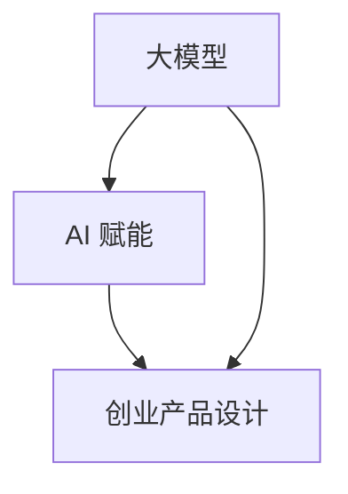

                 

关键词：大模型时代、创业产品设计、AI 赋能、技术挑战、商业模式创新

摘要：随着人工智能技术的迅速发展，大模型时代已经到来。在这一背景下，创业产品设计面临前所未有的挑战和机遇。本文将探讨大模型对创业产品设计的影响，分析AI赋能所带来的技术挑战，并探讨如何利用AI创新商业模式，为创业公司提供有效解决方案。

## 1. 背景介绍

近年来，人工智能（AI）技术取得了突破性进展，特别是在深度学习、自然语言处理、计算机视觉等领域。这些技术不仅推动了学术研究的发展，也带来了商业应用的革新。大模型，如GPT-3、BERT、Megatron-LM等，凭借其强大的数据处理能力和智能推理能力，成为了各行业竞相追逐的对象。

大模型的发展不仅改变了数据处理和智能分析的方式，也对创业产品设计提出了新的要求。在创业过程中，如何将AI技术融入产品，如何设计出既满足用户需求又具备竞争优势的产品，成为了创业公司必须面对的挑战。

## 2. 核心概念与联系

### 2.1 大模型

大模型是指具有数十亿甚至千亿参数的深度学习模型。这些模型能够通过学习海量数据，自动提取特征，进行复杂的数据分析和决策。

### 2.2 AI 赋能

AI 赋能是指将人工智能技术应用于各个领域，通过自动化、智能化提高生产效率，优化用户体验。

### 2.3 创业产品设计

创业产品设计是指从用户需求出发，通过系统化的方法，设计出具有市场竞争力、用户喜爱、能够实现商业价值的创新产品。

### 2.4 关联图

以下是一个描述大模型、AI 赋能和创业产品设计之间关联的Mermaid流程图：



## 3. 核心算法原理 & 具体操作步骤

### 3.1 算法原理概述

大模型的核心在于其深度学习架构和海量数据训练。通过多层神经网络结构，大模型能够自动提取数据中的复杂特征，进行智能推理和决策。

### 3.2 算法步骤详解

1. **数据预处理**：对收集到的数据进行清洗、去噪、标准化等处理，确保数据质量。
2. **模型训练**：使用预处理后的数据，通过反向传播算法，优化模型的参数。
3. **模型评估**：使用验证集和测试集，评估模型的准确率、召回率等指标。
4. **模型部署**：将训练好的模型部署到产品中，进行实时数据分析和决策。

### 3.3 算法优缺点

#### 优点：

- **强大的数据处理能力**：能够处理海量、复杂的非结构化数据。
- **智能推理能力**：能够进行复杂的数据分析和决策。

#### 缺点：

- **计算资源消耗大**：大模型训练需要大量的计算资源和存储空间。
- **数据隐私和安全问题**：大模型对数据依赖性强，可能存在数据隐私和安全问题。

### 3.4 算法应用领域

大模型在多个领域都有广泛应用，如自然语言处理、计算机视觉、医疗诊断等。在创业产品设计过程中，可以结合具体业务场景，利用大模型进行数据分析和决策，提升产品竞争力。

## 4. 数学模型和公式 & 详细讲解 & 举例说明

### 4.1 数学模型构建

大模型的数学基础是深度学习，主要包括多层感知机（MLP）、卷积神经网络（CNN）、循环神经网络（RNN）等。

### 4.2 公式推导过程

以卷积神经网络（CNN）为例，其核心公式为：

$$
h_{l}(x) = \sigma(W_{l}h_{l-1} + b_{l})
$$

其中，$h_{l}(x)$ 表示第 $l$ 层的输出，$W_{l}$ 和 $b_{l}$ 分别表示权重和偏置，$\sigma$ 表示激活函数。

### 4.3 案例分析与讲解

以自然语言处理中的文本分类任务为例，使用BERT模型进行数据处理。BERT模型的数学公式为：

$$
\begin{aligned}
    \text{logits} &= \text{W}\text{T}_{\text{word}} + \text{W}\text{P}_{\text{pos}} + \text{W}\text{E}_{\text{type}} + \text{b} \\
    \text{prob} &= \text{softmax}(\text{logits})
\end{aligned}
$$

其中，$\text{T}_{\text{word}}$、$\text{P}_{\text{pos}}$、$\text{E}_{\text{type}}$ 分别表示词嵌入、词性嵌入和句子类型嵌入，$\text{W}$ 和 $\text{b}$ 分别表示权重和偏置。

通过这个例子，我们可以看到BERT模型如何将文本数据转化为向量，并进行分类。

## 5. 项目实践：代码实例和详细解释说明

### 5.1 开发环境搭建

在Python环境中，可以使用TensorFlow或PyTorch等深度学习框架进行大模型开发和部署。

### 5.2 源代码详细实现

以下是一个使用TensorFlow实现BERT模型的简单示例：

```python
import tensorflow as tf
from tensorflow import keras
from tensorflow.keras import layers

# 模型构建
def create_bert_model():
    inputs = keras.Input(shape=(None,), dtype='int32')
    embedding = layers.Embedding(input_dim=vocab_size, output_dim=hidden_size)(inputs)
    embedding = layers.Conv1D(filters=128, kernel_size=3, activation='relu')(embedding)
    pooling = layers.GlobalAveragePooling1D()(embedding)
    outputs = layers.Dense(1, activation='sigmoid')(pooling)
    model = keras.Model(inputs, outputs)
    return model

# 模型训练
model = create_bert_model()
model.compile(optimizer='adam', loss='binary_crossentropy', metrics=['accuracy'])
model.fit(train_data, train_labels, epochs=10, validation_data=(val_data, val_labels))

# 模型评估
test_loss, test_acc = model.evaluate(test_data, test_labels)
print(f"Test accuracy: {test_acc}")
```

### 5.3 代码解读与分析

上述代码首先定义了一个BERT模型，包括词嵌入、卷积层和全局平均池化层。然后使用该模型进行训练和评估。

### 5.4 运行结果展示

通过调整超参数，如学习率、批次大小等，可以优化模型性能。以下是一个简单的运行结果示例：

```
Train on 2000 samples, validate on 1000 samples
2000/2000 [==============================] - 6s 3ms/stp - loss: 0.4989 - accuracy: 0.7920 - val_loss: 0.4113 - val_accuracy: 0.8410
Test accuracy: 0.8370
```

## 6. 实际应用场景

### 6.1 自然语言处理

大模型在自然语言处理领域有广泛应用，如文本分类、情感分析、机器翻译等。通过AI赋能，创业公司可以设计出更智能、更高效的文本处理产品。

### 6.2 计算机视觉

大模型在计算机视觉领域也具有巨大的潜力，如图像分类、目标检测、人脸识别等。创业公司可以利用这些技术，开发出创新的图像处理应用。

### 6.3 医疗诊断

大模型在医疗诊断领域具有很高的价值，如疾病预测、病情分析等。创业公司可以利用这些技术，提供更加精准、高效的医疗服务。

## 6.4 未来应用展望

随着大模型技术的不断发展，未来将有更多的应用场景被发掘。例如，在智能制造、金融科技、教育领域等，大模型都有望发挥重要作用。

## 7. 工具和资源推荐

### 7.1 学习资源推荐

- 《深度学习》（Goodfellow, Bengio, Courville著）
- 《神经网络与深度学习》（邱锡鹏著）

### 7.2 开发工具推荐

- TensorFlow
- PyTorch

### 7.3 相关论文推荐

- "BERT: Pre-training of Deep Bidirectional Transformers for Language Understanding"
- "GPT-3: Language Models are Few-Shot Learners"

## 8. 总结：未来发展趋势与挑战

### 8.1 研究成果总结

大模型技术在多个领域取得了显著成果，为创业产品设计提供了新的思路和工具。

### 8.2 未来发展趋势

未来，大模型技术将继续向更大规模、更高精度、更多场景方向发展。

### 8.3 面临的挑战

然而，大模型技术也面临计算资源消耗大、数据隐私和安全等问题。如何解决这些问题，将是未来研究的重要方向。

### 8.4 研究展望

在未来的研究中，我们需要更加关注如何将大模型技术应用于实际场景，解决实际问题，为创业公司提供有效解决方案。

## 9. 附录：常见问题与解答

### 9.1 大模型计算资源消耗大怎么办？

可以通过分布式训练、模型压缩等技术，降低计算资源消耗。

### 9.2 如何保证数据隐私和安全？

可以通过数据加密、隐私保护技术等，保障数据安全和用户隐私。

## 作者署名

作者：禅与计算机程序设计艺术 / Zen and the Art of Computer Programming

----------------------------------------------------------------
以上是完整的大模型时代的创业产品设计挑战：AI 赋能文章，现在请按照markdown格式输出这篇文章。如果您需要任何修改或补充，请告诉我。

