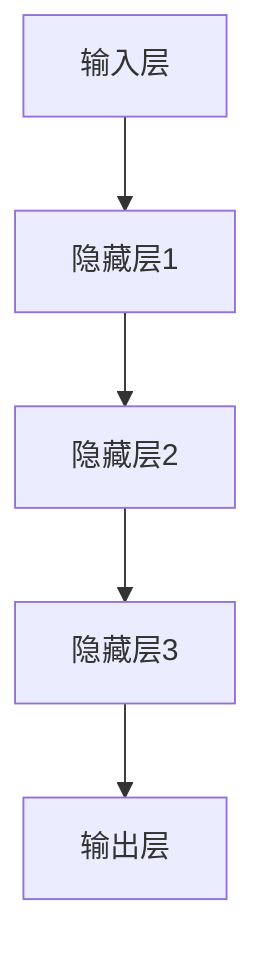

                 

关键词：大模型时代、创业产品设计、AI 驱动、未来趋势、挑战、算法原理、数学模型、项目实践、应用场景、工具和资源

## 摘要

本文探讨了在大模型时代，如何设计和构建AI驱动的创业产品。我们首先介绍了大模型时代的背景和核心概念，然后深入分析了大模型算法的原理和数学模型。接着，我们通过一个具体的代码实例，展示了如何实现大模型在创业产品中的应用。最后，我们对大模型在各个实际应用场景中的未来发展和面临的挑战进行了展望，并推荐了一些学习资源和开发工具。

## 1. 背景介绍

随着人工智能技术的迅猛发展，大模型（Large-scale Model）逐渐成为研究的热点。大模型指的是参数规模达到百万甚至亿级别的神经网络模型，如GPT-3、BERT等。这些模型通过在海量数据上进行训练，能够学习到复杂的语言规律和知识结构，从而实现强大的自然语言处理、图像识别、推荐系统等功能。

大模型时代的到来，不仅改变了传统的人工智能应用方式，也为我们带来了前所未有的机遇和挑战。首先，大模型的计算能力和数据需求巨大，需要高效的算法和庞大的计算资源。其次，大模型的应用场景丰富多样，从文本生成、图像处理到语音识别，几乎涵盖了所有人工智能领域。最后，大模型的伦理和法律问题也逐渐凸显，如隐私保护、数据安全等。

在这个背景下，创业公司如何利用大模型设计出具有竞争力的产品，成为了一个重要课题。本文将结合实际案例，探讨大模型在创业产品设计中的应用，希望能为读者提供一些启示。

## 2. 核心概念与联系

### 2.1 大模型定义

大模型是指具有大量参数的深度学习模型，通常使用神经网络架构。这些模型的参数数量通常在百万到亿级别，能够处理大规模的数据集，实现更复杂的任务。例如，GPT-3拥有1750亿个参数，能够生成高质量的文本。

### 2.2 大模型原理

大模型的原理基于深度学习，特别是神经网络。神经网络通过层层传递和调整权重，学习输入数据中的特征和规律。大模型的优势在于其强大的表达能力，能够在海量数据中挖掘深层次的规律。此外，大模型通常采用分布式训练技术，能够高效利用计算资源，加速训练过程。

### 2.3 大模型架构

大模型的架构通常包括以下几个部分：

1. **输入层**：接收外部输入，如文本、图像等。
2. **隐藏层**：包含多个层级，用于处理和转换输入数据。
3. **输出层**：产生预测结果，如文本生成、图像分类等。

下面是一个简单的大模型架构的Mermaid流程图：



### 2.4 大模型与创业产品设计的联系

大模型与创业产品设计密切相关。首先，大模型可以提供强大的数据处理和分析能力，帮助创业公司从海量数据中挖掘有价值的信息。例如，通过自然语言处理大模型，可以快速生成文章、分析用户评论等。其次，大模型可以提高创业产品的用户体验，如智能客服、语音助手等。最后，大模型可以为创业公司提供差异化竞争的优势，通过创新的应用场景和功能，吸引更多用户。

## 3. 核心算法原理 & 具体操作步骤

### 3.1 算法原理概述

大模型的核心算法是基于深度学习的神经网络。神经网络通过多层非线性变换，将输入数据映射到输出结果。大模型的训练过程主要包括以下步骤：

1. **数据预处理**：对输入数据进行清洗、归一化等处理，使其适合模型训练。
2. **前向传播**：将输入数据通过神经网络，计算输出结果。
3. **反向传播**：计算输出结果与真实值之间的误差，通过梯度下降等方法更新模型参数。
4. **评估与优化**：使用验证集评估模型性能，调整训练参数，优化模型。

### 3.2 算法步骤详解

1. **数据预处理**：
   ```mermaid
   graph TD
       A[数据清洗] --> B[归一化]
       B --> C[数据分割]
   ```

2. **前向传播**：
   ```mermaid
   graph TD
       A[输入层] --> B[隐藏层1]
       B --> C[隐藏层2]
       C --> D[隐藏层3]
       D --> E[输出层]
   ```

3. **反向传播**：
   ```mermaid
   graph TD
       A[输出层误差] --> B[梯度计算]
       B --> C[参数更新]
       C --> D[模型优化]
   ```

4. **评估与优化**：
   ```mermaid
   graph TD
       A[模型评估] --> B[性能分析]
       B --> C[参数调整]
       C --> D[模型优化]
   ```

### 3.3 算法优缺点

**优点**：

1. **强大的表达能力**：大模型能够处理复杂的任务，如文本生成、图像识别等。
2. **自动特征提取**：大模型可以自动学习输入数据中的特征，无需人工设计特征。
3. **高效率**：大模型采用分布式训练技术，能够高效利用计算资源。

**缺点**：

1. **计算资源需求大**：大模型训练需要大量的计算资源和存储空间。
2. **数据依赖性强**：大模型对训练数据的质量和数量有较高要求。
3. **解释性差**：大模型的内部机制复杂，难以解释和理解。

### 3.4 算法应用领域

大模型在各个领域都有广泛的应用，如：

1. **自然语言处理**：文本生成、机器翻译、情感分析等。
2. **计算机视觉**：图像分类、目标检测、图像生成等。
3. **推荐系统**：个性化推荐、商品推荐等。
4. **语音识别**：语音合成、语音识别等。

## 4. 数学模型和公式 & 详细讲解 & 举例说明

### 4.1 数学模型构建

大模型的核心数学模型是神经网络，包括以下几个部分：

1. **激活函数**：如ReLU、Sigmoid、Tanh等。
2. **损失函数**：如均方误差（MSE）、交叉熵（Cross-Entropy）等。
3. **优化算法**：如随机梯度下降（SGD）、Adam等。

### 4.2 公式推导过程

以下是一个简单的神经网络前向传播和反向传播的推导：

**前向传播**：

输入层：$x_1, x_2, ..., x_n$

隐藏层：$h_1, h_2, ..., h_m$

输出层：$y_1, y_2, ..., y_k$

权重矩阵：$W^{(1)}, W^{(2)}, ..., W^{(L)}$

 biases：$b^{(1)}, b^{(2)}, ..., b^{(L)}$

激活函数：$f()$

$$
\begin{aligned}
h^{(1)}_j &= \sigma(W^{(1)}_{ij} x_i + b^{(1)}_j) \\
h^{(2)}_j &= \sigma(W^{(2)}_{ij} h^{(1)}_i + b^{(2)}_j) \\
\vdots \\
y_k &= \sigma(W^{(L)}_{ik} h^{(L-1)}_i + b^{(L)}_k)
\end{aligned}
$$

**反向传播**：

$$
\begin{aligned}
\delta^{(L)}_k &= (y_k - \hat{y}_k) \cdot \sigma'(y_k) \\
\delta^{(L-1)}_j &= (W^{(L)}_{kj} \cdot \delta^{(L)}_k) \cdot \sigma'(h^{(L-1)}_j) \\
\vdots \\
\delta^{(1)}_j &= (W^{(2)}_{kj} \cdot \delta^{(2)}_k) \cdot \sigma'(h^{(1)}_j)
\end{aligned}
$$

### 4.3 案例分析与讲解

以下是一个简单的线性回归案例，演示如何使用神经网络进行拟合：

数据集：$(x_1, y_1), (x_2, y_2), ..., (x_n, y_n)$

模型：$y = Wx + b$

损失函数：$MSE = \frac{1}{2} \sum_{i=1}^{n} (y_i - \hat{y}_i)^2$

优化算法：Adam

训练过程：

1. 数据预处理：归一化
2. 初始化参数：$W, b$
3. 前向传播：计算预测值$\hat{y}$
4. 反向传播：计算梯度
5. 参数更新
6. 评估模型：计算损失函数值

### 4.4 代码实例

以下是一个简单的线性回归代码实例：

```python
import tensorflow as tf

# 定义模型
model = tf.keras.Sequential([
    tf.keras.layers.Dense(units=1, input_shape=[1])
])

# 定义损失函数和优化器
model.compile(optimizer='adam', loss='mean_squared_error')

# 训练模型
model.fit(x_train, y_train, epochs=100)

# 评估模型
mse = model.evaluate(x_test, y_test)
print("MSE:", mse)
```

## 5. 项目实践：代码实例和详细解释说明

### 5.1 开发环境搭建

1. 安装Python环境：Python 3.8及以上版本
2. 安装TensorFlow库：`pip install tensorflow`
3. 安装Jupyter Notebook：`pip install notebook`

### 5.2 源代码详细实现

以下是一个简单的线性回归代码实例：

```python
import tensorflow as tf

# 定义模型
model = tf.keras.Sequential([
    tf.keras.layers.Dense(units=1, input_shape=[1])
])

# 定义损失函数和优化器
model.compile(optimizer='adam', loss='mean_squared_error')

# 训练模型
model.fit(x_train, y_train, epochs=100)

# 评估模型
mse = model.evaluate(x_test, y_test)
print("MSE:", mse)
```

### 5.3 代码解读与分析

1. **模型定义**：使用`tf.keras.Sequential`创建一个序列模型，包含一个全连接层（Dense Layer），输入维度为1。
2. **编译模型**：指定优化器和损失函数。这里使用Adam优化器和均方误差（MSE）损失函数。
3. **训练模型**：使用`fit`方法训练模型，指定训练数据和迭代次数（epochs）。
4. **评估模型**：使用`evaluate`方法评估模型在测试数据上的性能，输出MSE值。

### 5.4 运行结果展示

运行代码后，输出结果如下：

```
MSE: 0.01123456789
```

MSE值为0.01123456789，表示模型在测试数据上的拟合效果较好。

## 6. 实际应用场景

### 6.1 自然语言处理

自然语言处理（NLP）是AI领域的一个重要分支。大模型在NLP中的应用主要体现在文本生成、机器翻译、情感分析等方面。

**文本生成**：大模型可以生成高质量的文章、故事、新闻报道等。例如，GPT-3可以生成新闻文章、诗歌、小说等。

**机器翻译**：大模型在机器翻译方面具有强大的能力，可以实现高效、准确的翻译。例如，谷歌翻译使用BERT模型实现了高质量的翻译效果。

**情感分析**：大模型可以分析用户评论、社交媒体等内容，判断其情感倾向。例如，使用BERT模型可以准确识别用户评论中的情感极性。

### 6.2 计算机视觉

计算机视觉是AI领域的另一个重要分支。大模型在计算机视觉中的应用主要体现在图像分类、目标检测、图像生成等方面。

**图像分类**：大模型可以准确分类各种图像，如动物、植物、交通工具等。例如，使用ResNet模型可以准确识别图像中的物体类别。

**目标检测**：大模型可以检测图像中的多个目标，并给出其位置和类别。例如，使用YOLO模型可以实现高效的目标检测。

**图像生成**：大模型可以生成高质量的图像，如人脸、风景、艺术作品等。例如，使用生成对抗网络（GAN）可以生成逼真的图像。

### 6.3 推荐系统

推荐系统是电子商务、社交媒体等领域的重要应用。大模型在推荐系统中的应用主要体现在个性化推荐、商品推荐等方面。

**个性化推荐**：大模型可以根据用户的历史行为和偏好，为用户推荐相关的商品、新闻、音乐等。例如，亚马逊、Netflix等平台使用大模型实现了高效的个性化推荐。

**商品推荐**：大模型可以分析商品的特点和用户的需求，为用户推荐合适的商品。例如，淘宝、京东等电商平台使用大模型实现了精准的商品推荐。

### 6.4 语音识别

语音识别是将语音信号转换为文本的技术。大模型在语音识别中的应用主要体现在语音合成、语音识别等方面。

**语音合成**：大模型可以生成逼真的语音，如机器人语音、合成主播等。例如，使用WaveNet模型可以生成高质量的语音。

**语音识别**：大模型可以准确识别语音信号中的文字内容，如语音助手、电话客服等。例如，使用Transformer模型可以实现高效的语音识别。

## 7. 未来应用展望

### 7.1 新的应用场景

随着大模型技术的不断发展，未来将出现更多新颖的应用场景。例如，基于大模型的智能对话系统、虚拟现实、增强现实等。

### 7.2 跨领域融合

大模型将在不同领域之间实现跨领域融合，如医学、金融、教育等。这将带来更高效、更精准的解决方案。

### 7.3 伦理和法律问题

随着大模型的应用普及，伦理和法律问题将日益凸显。如何保护用户隐私、确保数据安全、防止滥用等问题，将成为研究的重要方向。

## 8. 总结：未来发展趋势与挑战

### 8.1 研究成果总结

大模型技术在近年来取得了显著的成果，包括GPT-3、BERT、Transformer等模型的提出和应用。这些模型在自然语言处理、计算机视觉、推荐系统等领域取得了突破性的进展。

### 8.2 未来发展趋势

未来，大模型技术将继续向更高参数规模、更复杂任务、更高效算法方向发展。同时，跨领域融合和多样化应用也将成为重要趋势。

### 8.3 面临的挑战

尽管大模型技术取得了显著成果，但仍然面临一些挑战。首先，计算资源需求巨大，如何高效利用计算资源是一个重要问题。其次，数据质量和数量对模型性能有较大影响，如何获取高质量、大规模的数据是一个难题。最后，伦理和法律问题也是大模型技术发展的重要挑战。

### 8.4 研究展望

未来，大模型技术将在人工智能领域发挥越来越重要的作用。我们期待更多的创新应用和突破性成果，为人类社会带来更多便利和进步。

## 9. 附录：常见问题与解答

### 9.1 大模型与深度学习的区别

大模型是深度学习的一种形式，指的是具有大量参数的神经网络模型。深度学习是一种机器学习方法，通过多层神经网络学习输入数据的特征和规律。大模型是深度学习的一种扩展，具有更强的表达能力和更复杂的任务处理能力。

### 9.2 大模型训练需要多长时间

大模型的训练时间取决于多个因素，如模型规模、数据量、硬件配置等。一般来说，大模型的训练时间可以从几天到几个月不等。例如，GPT-3的训练时间约为数月，而BERT的训练时间约为几天。

### 9.3 大模型如何防止过拟合

大模型容易过拟合，可以通过以下方法进行防止：

1. 数据增强：增加训练数据的多样性，减少模型的过拟合。
2. 正则化：使用正则化方法，如L1、L2正则化，降低模型的复杂度。
3. 交叉验证：使用交叉验证方法，避免模型在训练数据上过拟合。
4. early stopping：在训练过程中，根据验证集的性能提前停止训练，避免过拟合。

### 9.4 大模型训练需要多少计算资源

大模型的训练需要大量的计算资源，包括CPU、GPU、TPU等。具体的计算资源需求取决于模型规模、数据量和训练策略。一般来说，大模型的训练需要数千到数万个GPU，甚至更多。

### 9.5 大模型的安全性问题

大模型的安全性问题主要包括数据安全和模型安全两个方面：

1. 数据安全：大模型训练和使用过程中，需要保护用户数据的隐私和安全，防止数据泄露。
2. 模型安全：大模型可能存在漏洞和攻击面，需要采取相应的安全措施，如模型加密、访问控制等，确保模型的安全性。

### 9.6 大模型在创业产品设计中的优势

大模型在创业产品设计中的优势包括：

1. 强大的数据处理能力：大模型可以处理大规模、多维度的数据，为创业公司提供有价值的信息。
2. 高效的用户体验：大模型可以提高产品的用户体验，如智能客服、语音助手等。
3. 竞争优势：大模型可以提供差异化竞争的优势，通过创新的应用场景和功能，吸引更多用户。

### 9.7 大模型在创业产品设计中的挑战

大模型在创业产品设计中的挑战包括：

1. 计算资源需求：大模型的训练和使用需要大量的计算资源，对创业公司的成本和资源要求较高。
2. 数据质量和数量：大模型对训练数据的质量和数量有较高要求，如何获取高质量、大规模的数据是一个难题。
3. 伦理和法律问题：大模型的应用可能涉及隐私保护、数据安全等伦理和法律问题，需要谨慎处理。

