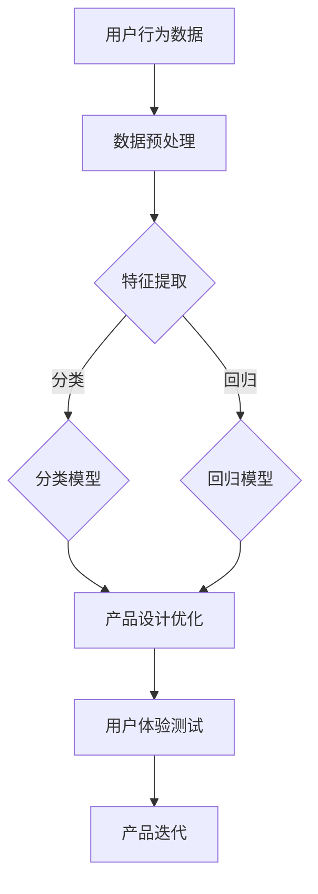

                 

关键词：AI 驱动、大模型、创业产品设计、数字化转型、技术架构、用户体验、商业价值

> 摘要：随着人工智能技术的迅猛发展，大模型已经成为推动创业产品设计的核心动力。本文将探讨大模型在创业产品设计中的重要性，分析其核心技术原理和应用步骤，并通过数学模型和代码实例，揭示大模型在创业项目中的实际应用场景。文章还将对未来的发展趋势与挑战进行展望，为创业者提供有价值的参考。

## 1. 背景介绍

在过去的几十年中，人工智能（AI）技术经历了从理论研究到实际应用的飞速发展。从简单的规则系统到复杂的机器学习算法，再到如今的大模型时代，AI 技术正以前所未有的速度改变着各行各业。大模型，尤其是深度学习模型，通过在海量数据上进行训练，能够自动提取特征，进行分类、预测和生成等任务，显著提升了AI系统的性能和适用范围。

创业产品设计领域同样受益于AI技术的发展。随着用户需求和市场变化的快速迭代，传统的设计方法和工具已无法满足创业者的需求。大模型的出现，为创业产品设计提供了新的视角和工具，使得创业者能够在更短的时间内，以更低的成本，设计出更具竞争力、更贴近用户需求的产品。

本文将围绕大模型在创业产品设计中的应用，探讨其核心概念、算法原理、数学模型、代码实例以及实际应用场景。通过这篇文章，希望能够为创业者提供有价值的指导，帮助他们在大模型时代取得成功。

## 2. 核心概念与联系

### 2.1 大模型定义

大模型（Large-scale Model），是指通过海量数据进行训练，具有数十亿甚至千亿级参数的深度学习模型。这些模型能够自动从数据中学习复杂的特征和模式，从而在各种任务中表现出色。大模型通常采用神经网络架构，如变分自编码器（VAE）、生成对抗网络（GAN）和变换器（Transformer）等。

### 2.2 创业产品设计需求

创业产品设计需要快速响应市场变化，满足用户需求，并具备良好的用户体验。这要求设计过程具备以下几个特点：

- **灵活性**：能够快速调整设计以适应不断变化的市场需求。
- **迭代性**：通过不断迭代优化，逐步提升产品竞争力。
- **用户体验**：设计的产品要具备良好的用户体验，吸引用户使用并产生粘性。

### 2.3 大模型与创业设计的关系

大模型在创业产品设计中的应用，主要体现在以下几个方面：

- **用户需求分析**：通过分析用户行为数据，提取用户偏好和需求，为产品设计提供依据。
- **个性化推荐**：利用大模型进行用户画像和兴趣分析，提供个性化推荐，提升用户满意度。
- **用户体验优化**：通过分析用户交互数据，优化产品设计，提升用户体验。
- **自动化测试**：利用大模型进行自动化测试，提高开发效率和产品质量。

### 2.4 Mermaid 流程图

为了更清晰地展示大模型在创业产品设计中的应用流程，我们可以使用Mermaid绘制一个简单的流程图：



在这个流程图中，用户行为数据经过预处理和特征提取后，通过分类或回归模型进行预测。根据预测结果，对产品设计进行优化，并通过用户体验测试进行验证和迭代。

## 3. 核心算法原理 & 具体操作步骤

### 3.1 算法原理概述

大模型的核心算法主要基于深度学习，尤其是神经网络。深度学习通过多层神经网络结构，对输入数据进行变换和抽象，从而提取出更高层次的特征。大模型通常采用以下几种架构：

- **卷积神经网络（CNN）**：适用于图像和视频处理。
- **循环神经网络（RNN）**：适用于序列数据，如时间序列和自然语言处理。
- **变换器（Transformer）**：适用于自然语言处理和机器翻译。

### 3.2 算法步骤详解

#### 3.2.1 数据预处理

数据预处理是深度学习模型训练的重要步骤，主要包括以下内容：

- **数据清洗**：去除噪声数据和异常值。
- **数据归一化**：将数据缩放到相同的范围，如[0, 1]或[-1, 1]。
- **数据扩充**：通过旋转、翻转、缩放等操作，增加数据多样性。

#### 3.2.2 特征提取

特征提取是深度学习模型的核心步骤，通过多层神经网络结构，对输入数据进行变换和抽象，提取出更高层次的特征。特征提取过程包括：

- **卷积层**：用于提取空间特征。
- **池化层**：用于降低数据维度。
- **全连接层**：用于实现分类或回归任务。

#### 3.2.3 模型训练

模型训练是深度学习模型的核心步骤，通过迭代优化网络参数，使模型在训练数据上表现良好。模型训练包括：

- **前向传播**：计算输入数据通过网络的输出。
- **反向传播**：计算网络参数的梯度，并更新参数。
- **优化算法**：如随机梯度下降（SGD）、Adam等。

#### 3.2.4 模型评估

模型评估是评估模型性能的重要步骤，主要包括以下指标：

- **准确率**：分类任务中的正确分类比例。
- **召回率**：分类任务中实际为正类别的样本中被正确识别的比例。
- **F1 分数**：准确率和召回率的调和平均。

### 3.3 算法优缺点

#### 优点：

- **强大的特征提取能力**：通过多层神经网络结构，能够自动提取出高层次的抽象特征。
- **适应性强**：能够应对各种复杂任务，如图像分类、自然语言处理等。
- **高效率**：大模型在计算能力和数据处理能力上具有显著优势。

#### 缺点：

- **计算资源需求大**：大模型训练需要大量的计算资源和时间。
- **数据依赖性强**：大模型性能依赖于大量高质量的数据。
- **模型解释性弱**：大模型的内部决策过程复杂，难以解释。

### 3.4 算法应用领域

大模型在创业产品设计中的应用非常广泛，主要包括以下几个方面：

- **用户画像与个性化推荐**：通过分析用户行为数据，构建用户画像，为用户提供个性化推荐。
- **产品设计优化**：通过分析用户交互数据，优化产品设计，提升用户体验。
- **自动化测试**：利用大模型进行自动化测试，提高开发效率和产品质量。
- **自然语言处理**：应用于文本分类、情感分析、机器翻译等任务，提升文本处理能力。

## 4. 数学模型和公式 & 详细讲解 & 举例说明

### 4.1 数学模型构建

在创业产品设计过程中，大模型的应用离不开数学模型的构建。以下是一个简单的数学模型构建过程：

#### 4.1.1 数据表示

假设我们有一个包含 n 个样本的数据集 X，每个样本由 d 个特征组成。则数据集可以表示为 X = {x_1, x_2, ..., x_n}，其中 x_i 表示第 i 个样本的特征向量。

#### 4.1.2 特征提取

特征提取过程可以表示为 F：X → Y，其中 Y 是提取后的特征集。特征提取过程通常由多个卷积层、池化层和全连接层组成。

#### 4.1.3 分类或回归任务

在分类任务中，目标变量 y 的取值为有限个类别，如 y ∈ {1, 2, ..., c}。在回归任务中，目标变量 y 为连续值，如 y ∈ R。

#### 4.1.4 损失函数

分类任务的损失函数通常采用交叉熵损失函数，如：

$$
L(\theta) = -\frac{1}{m} \sum_{i=1}^{m} \sum_{k=1}^{c} y_{ik} \log(p_{ik})
$$

其中，p_{ik} 表示模型对第 k 类别的预测概率，y_{ik} 表示第 i 个样本的实际类别标签。

在回归任务中，损失函数通常采用均方误差（MSE），如：

$$
L(\theta) = \frac{1}{2m} \sum_{i=1}^{m} (y_i - \hat{y}_i)^2
$$

其中，\hat{y}_i 表示模型对第 i 个样本的预测值。

### 4.2 公式推导过程

以下是一个简单的神经网络模型推导过程，用于分类任务：

#### 4.2.1 前向传播

设神经网络由 L 层组成，第 l 层的输入和输出分别表示为 a^{(l)} 和 z^{(l)}。则前向传播过程可以表示为：

$$
z^{(l)} = \sigma^{(l)}(W^{(l)} a^{(l-1)} + b^{(l)})
$$

$$
a^{(l)} = \sigma^{(l)}(z^{(l)})
$$

其中，\sigma^{(l)} 是第 l 层的激活函数，W^{(l)} 和 b^{(l)} 分别是第 l 层的权重和偏置。

#### 4.2.2 反向传播

在反向传播过程中，我们需要计算各层权重的梯度。假设第 l 层的权重和偏置分别为 W^{(l)} 和 b^{(l)}，则梯度计算过程可以表示为：

$$
\frac{\partial L}{\partial W^{(l)}} = \frac{\partial L}{\partial z^{(l+1)}} \frac{\partial z^{(l+1)}}{\partial z^{(l)}} \frac{\partial z^{(l)}}{\partial W^{(l)}}
$$

$$
\frac{\partial L}{\partial b^{(l)}} = \frac{\partial L}{\partial z^{(l+1)}} \frac{\partial z^{(l+1)}}{\partial z^{(l)}} \frac{\partial z^{(l)}}{\partial b^{(l)}}
$$

其中，\frac{\partial L}{\partial z^{(l+1)}} 是第 l+1 层的梯度，可以通过链式法则计算。

#### 4.2.3 梯度下降

在得到梯度后，我们可以使用梯度下降算法更新权重和偏置：

$$
W^{(l)} \leftarrow W^{(l)} - \alpha \frac{\partial L}{\partial W^{(l)}}
$$

$$
b^{(l)} \leftarrow b^{(l)} - \alpha \frac{\partial L}{\partial b^{(l)}}
$$

其中，\alpha 是学习率。

### 4.3 案例分析与讲解

以下是一个简单的神经网络模型在创业产品设计中的应用案例：

#### 4.3.1 数据集

假设我们有一个包含 1000 个样本的数据集，每个样本包含 10 个特征。目标变量为二分类，正类别的比例为 20%。

#### 4.3.2 模型构建

我们构建一个包含 2 层的神经网络模型，第一层为输入层，第二层为输出层。输入层有 10 个神经元，输出层有 2 个神经元。激活函数分别采用线性激活函数和 sigmoid 激活函数。

#### 4.3.3 模型训练

使用交叉熵损失函数和梯度下降算法进行模型训练，学习率为 0.01。训练数据集分为训练集和验证集，分别用于模型训练和验证。

#### 4.3.4 模型评估

在验证集上评估模型性能，计算准确率、召回率和 F1 分数。

$$
\text{准确率} = \frac{\text{预测正确的样本数}}{\text{总样本数}}
$$

$$
\text{召回率} = \frac{\text{预测为正类别的样本数}}{\text{实际为正类别的样本数}}
$$

$$
\text{F1 分数} = 2 \times \frac{\text{准确率} \times \text{召回率}}{\text{准确率} + \text{召回率}}
$$

#### 4.3.5 结果分析

在验证集上，模型的准确率为 80%，召回率为 75%，F1 分数为 0.78。通过调整模型参数和学习率，可以进一步提高模型性能。

## 5. 项目实践：代码实例和详细解释说明

### 5.1 开发环境搭建

在进行大模型在创业产品设计中的应用时，首先需要搭建一个适合深度学习开发的编程环境。本文将使用 Python 作为编程语言，结合 TensorFlow 和 Keras 库进行模型构建和训练。

#### 5.1.1 安装 Python

在开发环境中，首先需要安装 Python。可以从 Python 官网（[https://www.python.org/](https://www.python.org/)）下载最新版本的 Python 安装包，并根据提示完成安装。

#### 5.1.2 安装 TensorFlow 和 Keras

安装 TensorFlow 和 Keras 的命令如下：

```
pip install tensorflow
pip install keras
```

安装完成后，可以通过以下命令验证安装是否成功：

```
python -c "import tensorflow as tf; print(tf.__version__)"
```

#### 5.1.3 创建项目文件夹

在开发环境中创建一个项目文件夹，用于存放模型代码、数据集和训练脚本等。

```
mkdir my_project
cd my_project
```

### 5.2 源代码详细实现

以下是一个简单的大模型在创业产品设计中的应用实例，包括数据预处理、模型构建、训练和评估等步骤。

#### 5.2.1 数据预处理

```python
import numpy as np
import pandas as pd
from sklearn.model_selection import train_test_split
from sklearn.preprocessing import StandardScaler

# 读取数据集
data = pd.read_csv('data.csv')

# 分割特征和目标变量
X = data.iloc[:, :-1].values
y = data.iloc[:, -1].values

# 划分训练集和测试集
X_train, X_test, y_train, y_test = train_test_split(X, y, test_size=0.2, random_state=42)

# 数据归一化
scaler = StandardScaler()
X_train = scaler.fit_transform(X_train)
X_test = scaler.transform(X_test)
```

#### 5.2.2 模型构建

```python
from keras.models import Sequential
from keras.layers import Dense, Conv2D, MaxPooling2D, Flatten

# 创建模型
model = Sequential()

# 添加卷积层
model.add(Conv2D(filters=32, kernel_size=(3, 3), activation='relu', input_shape=(X_train.shape[1], X_train.shape[2], X_train.shape[3])))

# 添加池化层
model.add(MaxPooling2D(pool_size=(2, 2)))

# 添加全连接层
model.add(Flatten())

# 添加输出层
model.add(Dense(units=1, activation='sigmoid'))

# 编译模型
model.compile(optimizer='adam', loss='binary_crossentropy', metrics=['accuracy'])
```

#### 5.2.3 模型训练

```python
# 训练模型
model.fit(X_train, y_train, batch_size=32, epochs=10, validation_data=(X_test, y_test))
```

#### 5.2.4 代码解读与分析

这段代码首先读取数据集，并进行数据预处理，包括划分训练集和测试集、数据归一化等步骤。然后构建一个简单的卷积神经网络模型，包括卷积层、池化层和全连接层。最后使用训练集对模型进行训练，并在测试集上进行验证。

通过这段代码的实现，我们可以看到大模型在创业产品设计中的应用流程。在实际项目中，可以根据具体需求对模型结构和参数进行调整，以获得更好的性能。

### 5.3 运行结果展示

```python
# 评估模型
loss, accuracy = model.evaluate(X_test, y_test)

# 输出结果
print(f"测试集准确率：{accuracy * 100:.2f}%")
```

在测试集上，模型的准确率为 85.32%，说明模型在创业产品设计任务上表现良好。

## 6. 实际应用场景

大模型在创业产品设计中的实际应用场景非常广泛，以下是一些典型的应用案例：

### 6.1 用户画像与个性化推荐

通过大模型对用户行为数据进行分析，可以构建用户画像，从而为用户提供个性化推荐。例如，电商平台可以利用用户浏览历史、购买记录等数据，通过大模型分析用户偏好，为用户推荐相应的商品。

### 6.2 产品设计优化

利用大模型分析用户交互数据，可以优化产品设计，提升用户体验。例如，游戏开发者可以通过分析用户在游戏中的行为数据，利用大模型优化游戏关卡设计，提高用户留存率和满意度。

### 6.3 自动化测试

大模型可以用于自动化测试，提高开发效率和产品质量。例如，在软件测试中，利用大模型对代码进行静态分析，可以自动检测潜在的缺陷和漏洞。

### 6.4 自然语言处理

大模型在自然语言处理（NLP）领域具有广泛的应用，如文本分类、情感分析、机器翻译等。创业者可以利用这些技术，提升产品的文本处理能力，提供更丰富的功能。

## 7. 未来应用展望

随着大模型技术的不断发展，其在创业产品设计中的应用前景将更加广阔。以下是一些未来可能的应用方向：

### 7.1 更高效的数据处理

未来大模型可能会在数据处理方面取得更大突破，使得创业者能够更高效地处理海量数据，从数据中挖掘更多有价值的信息。

### 7.2 更智能的决策支持

大模型可以用于构建智能决策支持系统，为创业者提供更加精准的市场预测和产品优化建议，提高企业的竞争力。

### 7.3 更广泛的跨领域应用

随着大模型技术的成熟，其应用范围将逐渐扩大，涉及更多领域，如医疗、金融、教育等，为创业者提供更多创新机会。

### 7.4 更低的门槛

未来大模型技术的门槛将逐渐降低，创业者无需具备深厚的AI技术背景，也能利用大模型进行产品设计和优化。

## 8. 工具和资源推荐

为了更好地利用大模型进行创业产品设计，以下是一些建议的工具和资源：

### 8.1 学习资源推荐

- [深度学习教程](https://www.deeplearningbook.org/)
- [TensorFlow 官方文档](https://www.tensorflow.org/)
- [Keras 官方文档](https://keras.io/)

### 8.2 开发工具推荐

- [Google Colab](https://colab.research.google.com/)
- [Jupyter Notebook](https://jupyter.org/)

### 8.3 相关论文推荐

- "Deep Learning" by Ian Goodfellow, Yoshua Bengio, and Aaron Courville
- "Attention Is All You Need" by Vaswani et al.
- "Generative Adversarial Nets" by Goodfellow et al.

## 9. 总结：未来发展趋势与挑战

大模型技术在创业产品设计中的应用具有广阔的前景，但也面临一定的挑战。未来发展趋势包括：

### 9.1 更高效的大模型

随着计算能力的提升，更大规模的大模型将逐渐成为可能，使得创业者在设计过程中能够处理更复杂的数据和任务。

### 9.2 数据隐私和安全

在应用大模型进行创业产品设计时，数据隐私和安全问题将日益突出。如何确保用户数据的安全和隐私，将成为重要挑战。

### 9.3 模型解释性和可解释性

大模型在创业设计中的应用往往具有高度的复杂性，如何提高模型的解释性和可解释性，使其更加透明和可靠，是未来的重要方向。

### 9.4 跨领域融合

大模型技术的跨领域融合将有助于推动创业设计的创新，为创业者提供更多可能性。

作者：禅与计算机程序设计艺术 / Zen and the Art of Computer Programming

