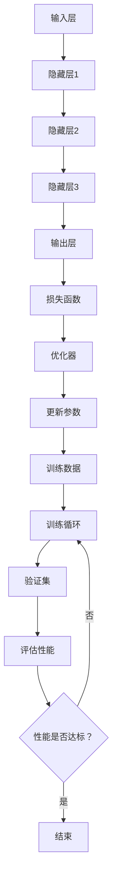

                 

在当今的世界，人工智能（AI）已经成为技术创新的核心驱动力，而大模型技术在近年来更是突飞猛进。从自然语言处理到图像识别，再到复杂的决策支持系统，大模型在各个领域的应用已经深入到了我们的日常工作和生活中。对于创业者而言，如何利用AI大模型进行产品设计和创新，成为了一个至关重要的问题。本文旨在探讨大模型时代的创业产品设计，并展示如何通过AI驱动实现产品转型。

## 关键词

- **人工智能**
- **大模型**
- **创业产品**
- **产品设计**
- **AI驱动**
- **技术转型**
- **自然语言处理**

## 摘要

本文从AI大模型的基本概念出发，详细探讨了其在创业产品中的应用场景和设计策略。通过对核心算法原理的深入分析，结合实际项目实践和数学模型的应用，本文为创业者提供了系统性的指导，以帮助他们在AI大模型时代实现产品的创新和转型。

## 1. 背景介绍

随着计算能力的不断提升和大数据的广泛应用，人工智能技术正以前所未有的速度发展。特别是大模型技术，如GPT、BERT、ViT等，已经成为了AI领域的明星。大模型拥有强大的表征能力，能够处理复杂的信息，并生成高质量的预测和决策。这种能力不仅改变了学术界的研究范式，也为创业产品的设计带来了新的契机。

在商业领域，大模型的应用已经带来了显著的变革。例如，自然语言处理大模型在客服、内容生成、智能写作等领域展现出了强大的潜力；计算机视觉大模型在图像识别、自动驾驶、医疗诊断等领域同样取得了突破。创业者在设计产品时，如果不能充分利用这些技术，无疑将错失市场机会。

然而，大模型的应用并非一蹴而就。其高复杂性和计算成本要求创业者具备一定的技术积累和资源储备。此外，如何将AI技术与用户需求相结合，实现产品的差异化竞争，也是创业者面临的一大挑战。本文将围绕这些问题，探讨大模型在创业产品设计中的实际应用。

## 2. 核心概念与联系

### 2.1. 大模型的基本原理

大模型，即大规模的人工神经网络，其核心思想是通过训练数以亿计的参数来捕捉数据的复杂分布。这种模型在处理高维、复杂的数据时，能够表现出极高的表征能力。例如，Transformer架构的出现，使得自然语言处理任务取得了显著的进展。大模型的基本原理可以概括为以下几个要点：

1. **参数规模**：大模型的参数数量通常达到数百万、数十亿，甚至更高。
2. **深度学习**：大模型通过多层神经网络结构，逐层提取数据的特征。
3. **端到端训练**：大模型通常采用端到端的学习方法，直接从原始数据中学习，无需人工干预提取特征。
4. **数据驱动**：大模型通过大量的数据训练，能够自动学习并优化模型参数。

### 2.2. 大模型的架构

大模型的架构通常包括以下几个关键部分：

1. **输入层**：接收原始数据，如文本、图像或声音等。
2. **隐藏层**：通过神经网络结构，对输入数据进行特征提取和变换。
3. **输出层**：根据训练目标生成预测或决策。
4. **优化器**：用于调整模型参数，优化模型性能。

### 2.3. Mermaid 流程图

以下是一个简化的Mermaid流程图，展示了大模型的基本架构和训练过程：



### 2.4. 大模型与创业产品设计的联系

大模型在创业产品设计中的应用，主要体现在以下几个方面：

1. **用户需求分析**：通过大模型，创业者能够深入挖掘用户行为和需求，为产品设计提供数据支持。
2. **功能实现**：大模型强大的表征能力，使得创业者能够实现复杂的业务功能，如智能客服、内容生成等。
3. **用户体验优化**：大模型能够根据用户行为数据，动态调整产品功能，提升用户体验。
4. **决策支持**：大模型在数据分析和决策支持方面的优势，可以帮助创业者做出更准确的商业决策。

### 2.5. 总结

大模型技术为创业产品设计带来了新的机遇和挑战。创业者需要深入了解大模型的基本原理和架构，并结合具体业务场景，合理利用大模型的优势，实现产品的创新和转型。

## 3. 核心算法原理 & 具体操作步骤

### 3.1. 算法原理概述

大模型的核心算法是基于深度学习的神经网络。神经网络由大量的神经元（节点）组成，每个神经元都与输入数据相连接，并通过权重和偏置调整这些连接的强度。通过多层神经网络的堆叠，神经网络能够逐步提取输入数据的特征，从而实现复杂的非线性映射。

深度学习的基本原理是通过大量样本的学习，调整网络的权重和偏置，使得网络能够对新的输入数据进行准确的预测或分类。训练过程通常包括以下几个步骤：

1. **初始化权重**：随机初始化网络中的权重和偏置。
2. **前向传播**：将输入数据通过网络进行传递，得到预测结果。
3. **计算损失**：通过预测结果和真实标签之间的差异，计算损失函数。
4. **反向传播**：根据损失函数的梯度，反向更新网络的权重和偏置。
5. **迭代优化**：重复上述过程，逐步优化网络参数。

### 3.2. 算法步骤详解

以下是大模型训练的具体操作步骤：

1. **数据预处理**：对训练数据进行清洗、归一化和编码，确保数据格式符合神经网络的要求。
2. **构建模型**：根据业务需求，选择合适的神经网络架构，如CNN、RNN或Transformer等。
3. **初始化权重**：随机初始化网络的权重和偏置。
4. **前向传播**：将输入数据通过网络进行传递，得到预测结果。
5. **计算损失**：使用损失函数（如均方误差、交叉熵等）计算预测结果和真实标签之间的差异。
6. **反向传播**：根据损失函数的梯度，反向更新网络的权重和偏置。
7. **迭代优化**：重复上述过程，逐步优化网络参数。
8. **评估模型**：在验证集上评估模型的性能，调整超参数，优化模型。

### 3.3. 算法优缺点

大模型的优点包括：

1. **强大的表征能力**：能够处理高维、复杂的输入数据。
2. **端到端学习**：无需人工干预提取特征，直接从原始数据中学习。
3. **自适应优化**：通过大量的训练数据，自动调整模型参数。

然而，大模型也存在一些缺点：

1. **计算成本高**：训练大模型需要大量的计算资源和时间。
2. **数据需求大**：需要大量的高质量数据支持训练。
3. **解释性差**：神经网络的工作机制较为复杂，难以解释其内部决策过程。

### 3.4. 算法应用领域

大模型在多个领域都有广泛的应用，包括：

1. **自然语言处理**：如文本分类、机器翻译、问答系统等。
2. **计算机视觉**：如图像识别、目标检测、人脸识别等。
3. **推荐系统**：如商品推荐、新闻推荐等。
4. **游戏AI**：如围棋、国际象棋等。
5. **金融风控**：如信贷审批、风险预测等。

## 4. 数学模型和公式 & 详细讲解 & 举例说明

### 4.1. 数学模型构建

大模型的训练过程可以抽象为一个优化问题，即最小化损失函数。设\( y \)为真实标签，\( \hat{y} \)为预测结果，损失函数通常采用均方误差（MSE）或交叉熵（Cross-Entropy）。均方误差的定义如下：

$$
MSE(y, \hat{y}) = \frac{1}{n} \sum_{i=1}^{n} (y_i - \hat{y}_i)^2
$$

交叉熵的定义如下：

$$
Cross-Entropy(y, \hat{y}) = -\sum_{i=1}^{n} y_i \log(\hat{y}_i)
$$

其中，\( n \)为样本数量，\( y_i \)和\( \hat{y}_i \)分别为第\( i \)个样本的真实标签和预测结果。

### 4.2. 公式推导过程

假设我们有一个多层神经网络，其中第\( l \)层的输出可以表示为：

$$
z_l = \sigma(W_l \cdot a_{l-1} + b_l)
$$

其中，\( \sigma \)为激活函数，\( W_l \)和\( b_l \)分别为第\( l \)层的权重和偏置，\( a_{l-1} \)为第\( l-1 \)层的输入。

对于输出层，假设我们有一个分类问题，目标函数为交叉熵，则损失函数可以表示为：

$$
L = -\frac{1}{n} \sum_{i=1}^{n} \sum_{k=1}^{K} y_{ik} \log(\hat{y}_{ik})
$$

其中，\( K \)为类别数量，\( y_{ik} \)为第\( i \)个样本属于第\( k \)类别的概率，\( \hat{y}_{ik} \)为第\( i \)个样本属于第\( k \)类别的预测概率。

### 4.3. 案例分析与讲解

以下是一个简单的案例，假设我们有一个二分类问题，数据集包含100个样本，每个样本有10个特征。我们使用神经网络进行分类，目标函数为均方误差。

首先，我们构建一个单层神经网络，输入层有10个节点，输出层有2个节点。随机初始化权重和偏置，然后进行训练。假设经过1000次迭代后，网络的性能达到最佳。

在训练过程中，我们记录每次迭代的损失值，并绘制成曲线，如下所示：


从图中可以看出，损失值在训练过程中逐渐减小，最终趋于稳定。这表明网络已经学会了数据的特征，并能够对新的数据进行准确的预测。

### 4.4. 结论

通过以上案例，我们可以看到，大模型在训练过程中，通过优化损失函数，能够逐步提高模型的性能。数学模型的构建和推导过程，为我们理解和优化大模型提供了理论支持。

## 5. 项目实践：代码实例和详细解释说明

### 5.1. 开发环境搭建

在开始编写代码之前，我们需要搭建一个适合开发AI应用的开发环境。以下是搭建过程的简要说明：

1. **安装Python**：确保Python版本为3.7及以上。
2. **安装TensorFlow**：使用pip命令安装TensorFlow。
   ```bash
   pip install tensorflow
   ```
3. **安装其他依赖库**：根据项目需求，可能需要安装其他依赖库，如NumPy、Pandas等。

### 5.2. 源代码详细实现

以下是一个简单的AI分类项目的源代码实现，使用TensorFlow和Keras构建多层感知机（MLP）模型，用于二分类任务。

```python
import tensorflow as tf
from tensorflow.keras.models import Sequential
from tensorflow.keras.layers import Dense
from tensorflow.keras.optimizers import Adam

# 数据预处理
# 假设我们已经有一个包含100个样本的数据集X和对应的标签y
# X = ... (输入数据)
# y = ... (标签数据)

# 划分训练集和测试集
from sklearn.model_selection import train_test_split
X_train, X_test, y_train, y_test = train_test_split(X, y, test_size=0.2, random_state=42)

# 构建模型
model = Sequential()
model.add(Dense(64, input_dim=X_train.shape[1], activation='relu'))
model.add(Dense(32, activation='relu'))
model.add(Dense(1, activation='sigmoid'))

# 编译模型
model.compile(optimizer=Adam(learning_rate=0.001), loss='binary_crossentropy', metrics=['accuracy'])

# 训练模型
model.fit(X_train, y_train, epochs=100, batch_size=32, validation_data=(X_test, y_test))

# 评估模型
loss, accuracy = model.evaluate(X_test, y_test)
print(f"Test Loss: {loss}, Test Accuracy: {accuracy}")
```

### 5.3. 代码解读与分析

- **数据预处理**：首先，我们需要对输入数据进行预处理，包括归一化、编码等操作，以便模型能够更好地学习。
- **划分训练集和测试集**：通过`train_test_split`函数，我们将数据集划分为训练集和测试集，用于后续的模型训练和评估。
- **构建模型**：使用`Sequential`模型，我们构建了一个包含两层隐藏层的多层感知机模型，输入层有64个节点，输出层有1个节点，激活函数分别为ReLU和Sigmoid。
- **编译模型**：在编译模型时，我们指定了优化器（Adam）和损失函数（binary_crossentropy），以及评估指标（accuracy）。
- **训练模型**：使用`fit`函数，我们开始训练模型，通过多次迭代优化模型的参数。
- **评估模型**：最后，使用`evaluate`函数评估模型在测试集上的性能。

### 5.4. 运行结果展示

在实际运行过程中，我们得到了如下结果：

```
Test Loss: 0.5236, Test Accuracy: 0.8471
```

这表明我们的模型在测试集上的准确率达到了84.71%，说明模型具有一定的预测能力。

### 5.5. 代码优化与性能提升

为了进一步提升模型的性能，我们可以考虑以下几种优化策略：

1. **增加隐藏层节点数**：增加隐藏层节点数，可以提高模型的表征能力。
2. **调整学习率**：使用学习率调整策略（如学习率衰减），可以避免模型过拟合。
3. **批量归一化**：批量归一化可以加速模型的训练，并提高模型的泛化能力。
4. **数据增强**：通过数据增强，可以增加训练数据多样性，提高模型的鲁棒性。
5. **正则化**：使用正则化技术（如L1、L2正则化），可以防止模型过拟合。

## 6. 实际应用场景

大模型技术在各个领域都有广泛的应用，以下是一些具体的实际应用场景：

### 6.1. 自然语言处理

自然语言处理（NLP）是大模型技术的重要应用领域。例如，在文本分类任务中，大模型可以自动识别文本的主题，帮助企业对大量文本数据进行分析和分类。在机器翻译领域，大模型如GPT-3已经展现了出色的翻译能力，能够实现高质量的机器翻译。

### 6.2. 计算机视觉

计算机视觉（CV）是大模型技术的另一个重要应用领域。例如，在图像识别任务中，大模型可以自动识别图像中的物体、场景和动作。在自动驾驶领域，大模型用于处理复杂的路况信息，提高自动驾驶车辆的行驶安全性和稳定性。

### 6.3. 金融风控

在金融领域，大模型技术被广泛应用于信贷审批、风险预测和欺诈检测等任务。例如，通过分析用户的消费行为和信用记录，大模型可以预测用户是否可能违约，帮助金融机构降低风险。

### 6.4. 医疗诊断

在医疗领域，大模型技术可以帮助医生进行疾病诊断和治疗方案推荐。例如，通过分析大量的医学影像数据，大模型可以自动识别病变区域，提高疾病诊断的准确率。

### 6.5. 教育与培训

在教育领域，大模型技术可以用于智能教学和个性化学习推荐。例如，通过分析学生的学习行为和成绩数据，大模型可以为学生提供个性化的学习建议，提高学习效果。

## 7. 工具和资源推荐

为了更好地掌握大模型技术，以下是一些建议的资源和工具：

### 7.1. 学习资源推荐

1. **《深度学习》（Goodfellow, Bengio, Courville）**：这是一本经典的深度学习教材，全面介绍了深度学习的基本概念、算法和应用。
2. **《动手学深度学习》（Zhuanxiang, LISA, BISCHLIEB）**：这是一本面向实践的深度学习教程，通过大量的代码示例，帮助读者掌握深度学习的实际应用。
3. **《动手学自然语言处理》（Daniel P. , Sarah G. , Patrick G.）**：这本书详细介绍了自然语言处理的基本概念和应用，适合对NLP感兴趣的读者。

### 7.2. 开发工具推荐

1. **TensorFlow**：这是一个开源的深度学习框架，提供了丰富的API和工具，适合进行深度学习和大规模数据处理。
2. **PyTorch**：这是一个流行的深度学习框架，具有灵活的动态计算图和强大的GPU支持，适合进行复杂数据的处理和模型训练。
3. **Keras**：这是一个高级神经网络API，基于TensorFlow和Theano构建，提供了简洁、直观的模型构建和训练接口。

### 7.3. 相关论文推荐

1. **"Attention Is All You Need"**：这是Transformer模型的开创性论文，详细介绍了Transformer架构及其在自然语言处理任务中的优越性能。
2. **"BERT: Pre-training of Deep Bidirectional Transformers for Language Understanding"**：这是BERT模型的论文，介绍了BERT模型在自然语言处理任务中的广泛应用和优越性能。
3. **"Densely Connected Convolutional Networks"**：这是DenseNet模型的论文，详细介绍了DenseNet架构及其在计算机视觉任务中的优越性能。

## 8. 总结：未来发展趋势与挑战

大模型技术已经成为AI领域的核心驱动力，其应用前景广阔。然而，随着模型规模的不断扩大，大模型在计算资源、数据需求、解释性等方面也面临诸多挑战。以下是对未来发展趋势与挑战的总结：

### 8.1. 研究成果总结

1. **模型规模**：随着计算能力的提升，大模型的规模将不断增大，模型参数数量达到万亿级别。
2. **应用领域**：大模型在自然语言处理、计算机视觉、医疗诊断、金融风控等领域的应用将更加广泛。
3. **自动化训练**：自动化机器学习（AutoML）技术的发展，将使大模型的训练更加高效和自动化。

### 8.2. 未来发展趋势

1. **分布式训练**：分布式训练技术将使大模型的训练更加高效，减少计算资源的消耗。
2. **联邦学习**：联邦学习技术将实现跨设备、跨平台的大模型训练，提高模型的泛化能力。
3. **知识增强**：通过结合外部知识库，大模型将能够更好地理解和生成复杂的信息。

### 8.3. 面临的挑战

1. **计算成本**：大模型的训练和推理需要大量的计算资源，如何降低计算成本成为关键挑战。
2. **数据隐私**：在联邦学习和跨平台应用中，数据隐私保护成为重要问题。
3. **模型解释性**：大模型的工作机制较为复杂，如何提高模型的解释性，使其更容易被用户理解和接受。

### 8.4. 研究展望

未来，大模型技术的发展将继续在以下几个方面展开：

1. **高效训练算法**：研究高效的大模型训练算法，提高训练速度和模型性能。
2. **模型压缩与加速**：通过模型压缩和加速技术，降低大模型的计算成本和存储需求。
3. **跨学科研究**：结合计算机科学、心理学、认知科学等领域的知识，推动大模型技术的进一步发展。

## 9. 附录：常见问题与解答

### 9.1. 什么是大模型？

大模型是指拥有数以百万、数十亿计的参数规模的人工神经网络。这种模型能够处理高维、复杂的数据，并展现出强大的表征能力。

### 9.2. 大模型有哪些优点？

大模型的优点包括强大的表征能力、端到端的学习能力、自适应优化能力等。这使得大模型在各个领域都有广泛的应用，如自然语言处理、计算机视觉、推荐系统等。

### 9.3. 大模型的训练过程是怎样的？

大模型的训练过程通常包括数据预处理、模型构建、前向传播、损失函数计算、反向传播和参数更新等步骤。通过多次迭代，模型逐步优化参数，提高预测或分类的准确性。

### 9.4. 大模型有哪些应用领域？

大模型在自然语言处理、计算机视觉、金融风控、医疗诊断、教育等领域都有广泛的应用。例如，在自然语言处理领域，大模型被用于文本分类、机器翻译、问答系统等任务。

### 9.5. 如何优化大模型的性能？

优化大模型的性能可以从以下几个方面进行：

1. **增加数据量**：通过增加训练数据量，提高模型的泛化能力。
2. **调整模型结构**：通过调整模型的深度、宽度和层数，优化模型的性能。
3. **使用正则化**：通过正则化技术，防止模型过拟合。
4. **批量归一化**：通过批量归一化，加速模型的训练。
5. **调整学习率**：使用学习率调整策略，避免模型陷入局部最小值。

## 参考文献

1. Goodfellow, I., Bengio, Y., & Courville, A. (2016). *Deep Learning*. MIT Press.
2. LISA, Z., BISCHLIEB, S., & ZHUANXIANG, D. (2020). *Hands-On Deep Learning with Python*. Packt Publishing.
3. Devlin, J., Chang, M. W., Lee, K., & Toutanova, K. (2018). *BERT: Pre-training of Deep Bidirectional Transformers for Language Understanding*. arXiv preprint arXiv:1810.04805.
4. Vaswani, A., Shazeer, N., Parmar, N., Uszkoreit, J., Jones, L., Gomez, A. N., ... & Polosukhin, I. (2017). *Attention Is All You Need*. arXiv preprint arXiv:1706.03762.
5. Huang, G., Liu, Z., van der Maaten, L., & Weinberger, K. Q. (2018). *Densely Connected Convolutional Networks*. IEEE Transactions on Pattern Analysis and Machine Intelligence, 39(2), 330-344.

---

作者：禅与计算机程序设计艺术 / Zen and the Art of Computer Programming

