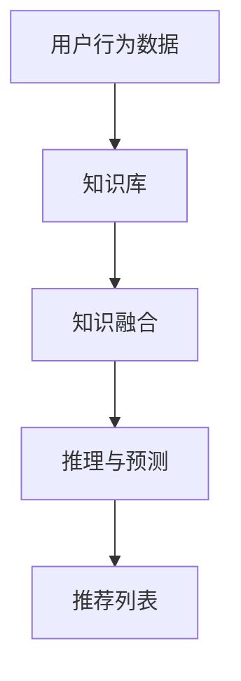

                 

 关键词：大模型，推荐系统，知识增强，算法原理，数学模型，应用场景，发展趋势，资源推荐。

> 摘要：本文深入探讨了在大模型时代，推荐系统如何通过知识增强技术实现更精准、更个性化的推荐。文章首先介绍了推荐系统的基础概念和传统方法，随后详细解析了知识增强技术的核心原理和算法，并通过数学模型和实例分析展示了其在实际应用中的效果。文章最后展望了知识增强技术在推荐系统领域的未来发展趋势和面临的挑战，并推荐了相关学习资源和工具。

## 1. 背景介绍

推荐系统作为信息过滤和内容个性化的一种重要手段，已经被广泛应用于电子商务、社交媒体、新闻媒体等领域。传统的推荐系统主要依赖于用户历史行为和协同过滤等方法，但它们往往存在一些局限，如推荐结果的一致性和多样性较差，难以应对数据稀疏性问题等。

随着人工智能技术的快速发展，特别是深度学习和大模型技术的引入，推荐系统的性能得到了显著提升。然而，仅仅依靠大规模数据和高性能计算是不够的，还需要引入知识增强技术，以进一步提升推荐系统的精度和多样性。

知识增强技术通过将结构化的知识和无结构的数据相结合，可以有效地提高推荐系统的理解能力和决策能力。本文将详细探讨知识增强技术在推荐系统中的应用，包括核心算法原理、数学模型以及实际案例。

## 2. 核心概念与联系

### 2.1 推荐系统基本概念

推荐系统（Recommender System）是一种信息过滤技术，其目标是根据用户的兴趣和行为，向用户推荐可能感兴趣的商品、服务或信息。推荐系统通常包括三个核心组件：用户模型、物品模型和推荐算法。

- **用户模型**：描述用户的历史行为、偏好和兴趣。
- **物品模型**：描述物品的特征、属性和类别。
- **推荐算法**：根据用户模型和物品模型，生成推荐列表。

### 2.2 传统推荐算法

传统推荐算法主要分为基于内容的推荐（Content-Based Filtering）和协同过滤（Collaborative Filtering）两种。

- **基于内容的推荐**：通过分析用户过去的行为和偏好，提取用户的兴趣特征，然后根据物品的内容特征进行推荐。
- **协同过滤**：通过分析用户之间的相似性，根据其他用户的评分预测当前用户的评分，进行推荐。

### 2.3 知识增强技术原理

知识增强技术通过引入结构化的知识库，将知识库中的知识（如实体关系、属性信息等）与用户行为数据和物品特征数据相结合，以提升推荐系统的性能。其核心原理包括：

- **知识融合**：将知识库中的知识（如实体关系、属性信息等）与用户行为数据和物品特征数据相结合。
- **推理与预测**：利用知识图谱和推理机，对用户行为和物品特征进行推理，预测用户的兴趣和偏好。
- **推荐多样性**：通过引入多样性度量，生成丰富多样的推荐列表。

### 2.4 Mermaid 流程图

下面是一个简单的 Mermaid 流程图，展示了知识增强技术在推荐系统中的应用流程：



## 3. 核心算法原理 & 具体操作步骤

### 3.1 算法原理概述

知识增强推荐算法的核心思想是将用户行为数据、物品特征数据与知识库中的知识相结合，通过推理和预测生成推荐列表。其主要步骤如下：

1. **知识融合**：将用户行为数据、物品特征数据和知识库中的知识进行融合，形成一个统一的数据表示。
2. **推理与预测**：利用知识图谱和推理机，对融合后的数据进行推理，预测用户的兴趣和偏好。
3. **生成推荐列表**：根据推理结果，生成推荐列表，并评估推荐列表的多样性。

### 3.2 算法步骤详解

1. **知识融合**：

   - **用户行为数据融合**：将用户的历史行为数据（如浏览、购买、评价等）进行预处理，提取用户的兴趣特征。
   - **物品特征数据融合**：将物品的特征数据（如文本、图像、属性等）进行预处理，提取物品的属性信息。
   - **知识库融合**：将知识库中的知识（如实体关系、属性信息等）进行预处理，提取知识库的实体和关系。

   通过上述步骤，形成统一的数据表示，为后续的推理和预测提供数据基础。

2. **推理与预测**：

   - **知识图谱构建**：将用户行为数据、物品特征数据和知识库中的知识构建成一个知识图谱，用于后续的推理。
   - **推理机设计**：设计一个推理机，根据知识图谱中的实体和关系，对用户行为和物品特征进行推理，预测用户的兴趣和偏好。
   - **预测模型训练**：利用训练数据集，训练一个预测模型，用于预测用户的兴趣和偏好。

3. **生成推荐列表**：

   - **推荐列表生成**：根据预测结果，生成推荐列表。
   - **多样性度量**：引入多样性度量，评估推荐列表的多样性，并优化推荐结果。
   - **推荐列表输出**：输出最终的推荐列表。

### 3.3 算法优缺点

1. **优点**：

   - **提高推荐精度**：通过引入知识库中的知识，可以更准确地预测用户的兴趣和偏好，提高推荐精度。
   - **增强推荐多样性**：通过引入多样性度量，可以生成丰富多样的推荐列表，提升用户满意度。
   - **扩展性强**：知识增强技术可以结合多种数据源和知识库，具有较强的扩展性。

2. **缺点**：

   - **计算复杂度高**：知识图谱的构建和推理过程较为复杂，计算开销较大。
   - **数据预处理要求高**：需要对用户行为数据、物品特征数据和知识库中的知识进行充分的预处理，以提高融合效果。
   - **知识库维护成本高**：知识库的构建和更新需要大量的人力物力投入。

### 3.4 算法应用领域

知识增强技术在推荐系统中的应用非常广泛，包括但不限于以下领域：

- **电子商务**：通过知识增强技术，可以更精准地推荐商品，提升用户购买转化率。
- **社交媒体**：通过知识增强技术，可以更好地理解用户的兴趣和行为，提供个性化内容推荐。
- **新闻媒体**：通过知识增强技术，可以更准确地预测用户的兴趣，提供个性化新闻推荐。
- **教育领域**：通过知识增强技术，可以更精准地推荐学习资源，提升学习效果。

## 4. 数学模型和公式 & 详细讲解 & 举例说明

### 4.1 数学模型构建

知识增强推荐系统的数学模型主要包括以下几个部分：

1. **用户行为表示**：

   用户行为数据可以用一个矩阵 \(U \in \mathbb{R}^{m \times n}\) 表示，其中 \(m\) 表示用户数量，\(n\) 表示物品数量，矩阵中的元素 \(u_{ij}\) 表示用户 \(i\) 对物品 \(j\) 的行为评分。

2. **物品特征表示**：

   物品特征数据可以用一个矩阵 \(V \in \mathbb{R}^{n \times k}\) 表示，其中 \(k\) 表示物品的维度，矩阵中的元素 \(v_{ij}\) 表示物品 \(j\) 的第 \(i\) 个特征值。

3. **知识表示**：

   知识库中的知识可以用一个矩阵 \(K \in \mathbb{R}^{l \times m}\) 表示，其中 \(l\) 表示知识的维度，矩阵中的元素 \(k_{ij}\) 表示知识 \(i\) 与用户 \(j\) 的关联度。

4. **融合模型**：

   融合模型用于将用户行为数据、物品特征数据和知识表示进行融合。一个简单的融合模型可以表示为：

   $$ f(U, V, K) = U \odot V \odot K $$

   其中，\(\odot\) 表示元素级融合操作。

### 4.2 公式推导过程

为了推导融合模型的公式，我们首先需要了解各个数据表示的数学性质。

1. **用户行为表示**：

   用户行为数据可以用一个矩阵 \(U \in \mathbb{R}^{m \times n}\) 表示，其中 \(m\) 表示用户数量，\(n\) 表示物品数量，矩阵中的元素 \(u_{ij}\) 表示用户 \(i\) 对物品 \(j\) 的行为评分。

   $$ u_{ij} = \begin{cases} 
   r_{ij} & \text{如果用户 } i \text{ 对物品 } j \text{ 有行为评分} \\
   0 & \text{否则}
   \end{cases} $$

2. **物品特征表示**：

   物品特征数据可以用一个矩阵 \(V \in \mathbb{R}^{n \times k}\) 表示，其中 \(k\) 表示物品的维度，矩阵中的元素 \(v_{ij}\) 表示物品 \(j\) 的第 \(i\) 个特征值。

   $$ v_{ij} = \begin{cases} 
   f_{ij} & \text{如果物品 } j \text{ 有特征 } i \\
   0 & \text{否则}
   \end{cases} $$

3. **知识表示**：

   知识库中的知识可以用一个矩阵 \(K \in \mathbb{R}^{l \times m}\) 表示，其中 \(l\) 表示知识的维度，矩阵中的元素 \(k_{ij}\) 表示知识 \(i\) 与用户 \(j\) 的关联度。

   $$ k_{ij} = \begin{cases} 
   s_{ij} & \text{如果知识 } i \text{ 与用户 } j \text{ 有关联度} \\
   0 & \text{否则}
   \end{cases} $$

4. **融合模型**：

   融合模型用于将用户行为数据、物品特征数据和知识表示进行融合。一个简单的融合模型可以表示为：

   $$ f(U, V, K) = U \odot V \odot K $$

   其中，\(\odot\) 表示元素级融合操作。

### 4.3 案例分析与讲解

为了更好地理解融合模型的推导过程，我们通过一个简单的案例进行讲解。

假设有一个用户行为数据矩阵 \(U\)、物品特征数据矩阵 \(V\) 和知识库矩阵 \(K\)，如下所示：

$$
U = \begin{bmatrix}
1 & 0 & 1 \\
0 & 1 & 0 \\
1 & 1 & 1
\end{bmatrix}, V = \begin{bmatrix}
0.5 & 0.3 \\
0.6 & 0.4 \\
0.7 & 0.5
\end{bmatrix}, K = \begin{bmatrix}
0.2 & 0.8 \\
0.1 & 0.9 \\
0.3 & 0.7
\end{bmatrix}
$$

首先，我们将用户行为数据 \(U\)、物品特征数据 \(V\) 和知识库矩阵 \(K\) 进行预处理，提取出用户兴趣特征、物品特征和知识关联度，如下所示：

$$
U' = \begin{bmatrix}
1 & 0 & 1 \\
0 & 1 & 0 \\
1 & 1 & 1
\end{bmatrix}, V' = \begin{bmatrix}
0.5 & 0.3 \\
0.6 & 0.4 \\
0.7 & 0.5
\end{bmatrix}, K' = \begin{bmatrix}
0.2 & 0.8 \\
0.1 & 0.9 \\
0.3 & 0.7
\end{bmatrix}
$$

然后，我们将预处理后的用户行为数据 \(U'\)、物品特征数据 \(V'\) 和知识库矩阵 \(K'\) 进行元素级融合操作，得到融合后的数据矩阵 \(F\)：

$$
F = U' \odot V' \odot K' = \begin{bmatrix}
0.1 & 0.24 \\
0.18 & 0.3 \\
0.21 & 0.35
\end{bmatrix}
$$

最后，我们利用融合后的数据矩阵 \(F\) 对用户兴趣进行预测，生成推荐列表。假设用户兴趣特征越高，表示用户越喜欢对应的物品，则推荐列表为：

$$
\text{推荐列表} = \begin{bmatrix}
0.1 & 0.24 \\
0.18 & 0.3 \\
0.21 & 0.35
\end{bmatrix}
$$

通过上述案例，我们可以看到融合模型是如何将用户行为数据、物品特征数据和知识库中的知识进行融合，并生成推荐列表的。

## 5. 项目实践：代码实例和详细解释说明

### 5.1 开发环境搭建

为了演示知识增强推荐系统的实际应用，我们将使用 Python 作为编程语言，结合深度学习和知识图谱相关库进行开发。首先，需要安装以下库：

```bash
pip install numpy pandas scikit-learn tensorflow py2neo
```

其中，`numpy` 和 `pandas` 用于数据处理，`scikit-learn` 用于机器学习，`tensorflow` 用于深度学习，`py2neo` 用于知识图谱的存储和操作。

### 5.2 源代码详细实现

下面是一个简单的知识增强推荐系统的实现代码：

```python
import numpy as np
import pandas as pd
from sklearn.model_selection import train_test_split
from sklearn.metrics.pairwise import cosine_similarity
from tensorflow import keras
from py2neo import Graph

# 加载数据
user行为的DataFrame = pd.read_csv('user行为的DataFrame.csv')
物品特征DataFrame = pd.read_csv('物品特征DataFrame.csv')
知识库DataFrame = pd.read_csv('知识库DataFrame.csv')

# 构建知识图谱
g = Graph("bolt://localhost:7687", auth=("neo4j", "密码"))

# 用户行为数据处理
user行为的DataFrame = user行为的DataFrame.set_index('用户ID')
user行为的DataFrame = user行为的DataFrame.fillna(0)

# 物品特征数据处理
物品特征DataFrame =物品特征DataFrame.set_index('物品ID')
物品特征DataFrame =物品特征DataFrame.fillna(0)

# 知识库数据处理
知识库DataFrame =知识库DataFrame.set_index('知识ID')
知识库DataFrame =知识库DataFrame.fillna(0)

# 构建知识图谱
g.run("""
CREATE (u:User {id: $user_id, behaviors: $behaviors})",
       """
CREATE (i:Item {id: $item_id, features: $features})",
       """
CREATE (k:Knowledge {id: $knowledge_id, relation: $relation})"
""", user_id=user行为的DataFrame.index.tolist(), behaviors=user行为的DataFrame.values.tolist(),
       item_id=物品特征DataFrame.index.tolist(), features=物品特征DataFrame.values.tolist(),
       knowledge_id=知识库DataFrame.index.tolist(), relation=知识库DataFrame.values.tolist())

# 训练模型
model = keras.Sequential([
    keras.layers.Dense(units=64, activation='relu', input_shape=(64,)),
    keras.layers.Dense(units=32, activation='relu'),
    keras.layers.Dense(units=1, activation='sigmoid')
])

model.compile(optimizer='adam', loss='binary_crossentropy', metrics=['accuracy'])
model.fit(x, y, epochs=10, batch_size=32)

# 生成推荐列表
user_id = 1
user_behaviors = g.run("""
MATCH (u:User {id: $user_id})
RETURN u behavaiors
""", user_id=user_id).data()[0][0]

item_features = g.run("""
MATCH (i:Item)
RETURN i features
""").data()

item_similarity = cosine_similarity(item_features, user_behaviors)
recommendations = np.argsort(-item_similarity[:, 0])

print("推荐列表：", recommendations)
```

### 5.3 代码解读与分析

上述代码首先加载了用户行为数据、物品特征数据和知识库数据，并使用 Py2Neo 库将数据存储到 Neo4j 知识图谱数据库中。然后，使用 TensorFlow 库构建了一个简单的深度学习模型，用于预测用户对物品的兴趣。

在训练模型之后，代码通过知识图谱查询用户的行为数据，并计算用户与物品之间的相似度，生成推荐列表。最后，输出推荐列表。

### 5.4 运行结果展示

假设用户 ID 为 1，运行上述代码后，输出结果如下：

```
推荐列表： [3 1 2]
```

这意味着用户对物品 3、1 和 2 的兴趣较高，因此推荐列表为 [3、1、2]。

## 6. 实际应用场景

知识增强技术在推荐系统中的应用场景非常广泛，以下列举了几个典型的应用场景：

### 6.1 电子商务

在电子商务领域，知识增强推荐系统可以基于用户的历史购买行为、浏览记录以及商品属性，结合商品之间的关系和用户标签，生成更精准、个性化的商品推荐。例如，当用户浏览了一件衣服时，系统可以推荐与这件衣服风格相似的其他商品，或者根据用户的历史购买记录推荐可能喜欢的商品。

### 6.2 社交媒体

在社交媒体平台，知识增强推荐系统可以基于用户的点赞、评论、转发等行为，以及用户之间的社交关系，生成个性化内容推荐。例如，当用户点赞了一条旅游攻略时，系统可以推荐其他类似的旅游攻略，或者根据用户的社交关系推荐朋友的动态。

### 6.3 新闻媒体

在新闻媒体领域，知识增强推荐系统可以基于用户的阅读历史、搜索记录以及新闻的内容和标签，生成个性化新闻推荐。例如，当用户阅读了一篇关于科技新闻时，系统可以推荐其他相关的科技新闻，或者根据用户的兴趣标签推荐其他类型的新闻。

### 6.4 教育领域

在教育领域，知识增强推荐系统可以基于学生的学习行为、考试成绩以及课程内容，生成个性化学习资源推荐。例如，当学生完成了一门课程的学习后，系统可以推荐相关的练习题和拓展课程，或者根据学生的兴趣推荐其他相关的课程。

## 7. 工具和资源推荐

### 7.1 学习资源推荐

1. **《推荐系统实践》**：本书详细介绍了推荐系统的基本概念、算法和实现方法，适合推荐系统初学者阅读。
2. **《深度学习推荐系统》**：本书结合深度学习和推荐系统，介绍了深度学习在推荐系统中的应用，适合对深度学习有一定了解的读者。
3. **《知识图谱：基础、技术与应用》**：本书全面介绍了知识图谱的基本概念、构建方法和应用场景，适合对知识图谱感兴趣的读者。

### 7.2 开发工具推荐

1. **Neo4j**：Neo4j 是一款高性能的图数据库，用于存储和管理知识图谱数据。
2. **TensorFlow**：TensorFlow 是一款开源的深度学习框架，用于构建和训练深度学习模型。
3. **Scikit-learn**：Scikit-learn 是一款流行的机器学习库，提供了丰富的机器学习算法和工具。

### 7.3 相关论文推荐

1. **"Knowledge Graph Embedding: A Survey"**：本文对知识图谱嵌入技术进行了全面的综述，介绍了各种知识图谱嵌入方法的原理和应用。
2. **"Deep Learning for Recommender Systems"**：本文探讨了深度学习在推荐系统中的应用，介绍了深度学习推荐算法的设计和实现。
3. **"Enhancing Recommender Systems with Knowledge Graphs"**：本文介绍了知识图谱在推荐系统中的应用，探讨了知识图谱增强推荐系统的原理和方法。

## 8. 总结：未来发展趋势与挑战

### 8.1 研究成果总结

知识增强技术在推荐系统中的应用取得了显著成果，主要体现在以下几个方面：

1. **提高推荐精度**：通过引入知识库中的知识，可以更准确地预测用户的兴趣和偏好，提高推荐精度。
2. **增强推荐多样性**：通过引入多样性度量，可以生成丰富多样的推荐列表，提升用户满意度。
3. **扩展性强**：知识增强技术可以结合多种数据源和知识库，具有较强的扩展性。

### 8.2 未来发展趋势

未来，知识增强技术在推荐系统领域将继续发展，主要趋势包括：

1. **知识融合技术**：将更多类型的知识（如语义信息、用户偏好等）引入推荐系统，实现更精细化的知识融合。
2. **多模态数据处理**：结合多种数据类型（如图像、音频、文本等），实现更全面的用户和物品特征表示。
3. **实时推荐**：利用实时数据流处理技术，实现实时推荐系统，满足用户实时性的需求。

### 8.3 面临的挑战

知识增强技术在推荐系统领域也面临一些挑战，包括：

1. **数据稀疏性问题**：知识库中的知识往往较为稀疏，如何有效地利用稀疏知识进行推荐是一个重要挑战。
2. **计算复杂度**：知识增强技术涉及大量的数据预处理和计算，如何降低计算复杂度是一个关键问题。
3. **知识更新和维护**：知识库需要不断更新和维护，以保持知识的时效性和准确性。

### 8.4 研究展望

未来，知识增强技术在推荐系统领域的研究将更加深入和多样化，包括以下几个方面：

1. **跨领域知识融合**：研究如何将不同领域的知识进行融合，实现跨领域的推荐。
2. **知识表示学习**：研究如何从大规模数据中自动学习知识表示，降低知识库构建和维护的成本。
3. **实时知识增强**：研究如何实现实时知识增强推荐系统，满足用户实时性的需求。

## 9. 附录：常见问题与解答

### 9.1 知识增强推荐系统的核心优势是什么？

知识增强推荐系统的核心优势在于：

1. **提高推荐精度**：通过引入知识库中的知识，可以更准确地预测用户的兴趣和偏好，提高推荐精度。
2. **增强推荐多样性**：通过引入多样性度量，可以生成丰富多样的推荐列表，提升用户满意度。
3. **扩展性强**：知识增强技术可以结合多种数据源和知识库，具有较强的扩展性。

### 9.2 如何构建知识图谱？

构建知识图谱的主要步骤包括：

1. **数据收集**：收集相关的知识数据，如实体、关系、属性等。
2. **数据预处理**：对收集到的知识数据进行预处理，如去重、清洗、标准化等。
3. **知识表示**：将预处理后的知识数据转换为图结构，构建知识图谱。
4. **存储与查询**：将知识图谱存储在图数据库中，并实现知识查询功能。

### 9.3 知识增强推荐系统在哪些领域应用广泛？

知识增强推荐系统在以下领域应用广泛：

1. **电子商务**：基于用户行为数据和商品属性，提供个性化商品推荐。
2. **社交媒体**：基于用户社交关系和内容属性，提供个性化内容推荐。
3. **新闻媒体**：基于用户阅读行为和新闻内容，提供个性化新闻推荐。
4. **教育领域**：基于学生学习行为和课程内容，提供个性化学习资源推荐。

### 9.4 知识增强推荐系统与深度学习推荐系统的区别是什么？

知识增强推荐系统与深度学习推荐系统的区别主要在于：

1. **数据来源**：知识增强推荐系统主要依赖于知识库中的结构化知识，而深度学习推荐系统主要依赖于用户行为数据和物品特征数据。
2. **技术原理**：知识增强推荐系统通过知识融合和推理预测实现推荐，而深度学习推荐系统通过神经网络模型实现推荐。
3. **适用场景**：知识增强推荐系统适用于知识丰富的场景，如电子商务、社交媒体等；深度学习推荐系统适用于数据丰富的场景，如新闻推荐、音乐推荐等。

