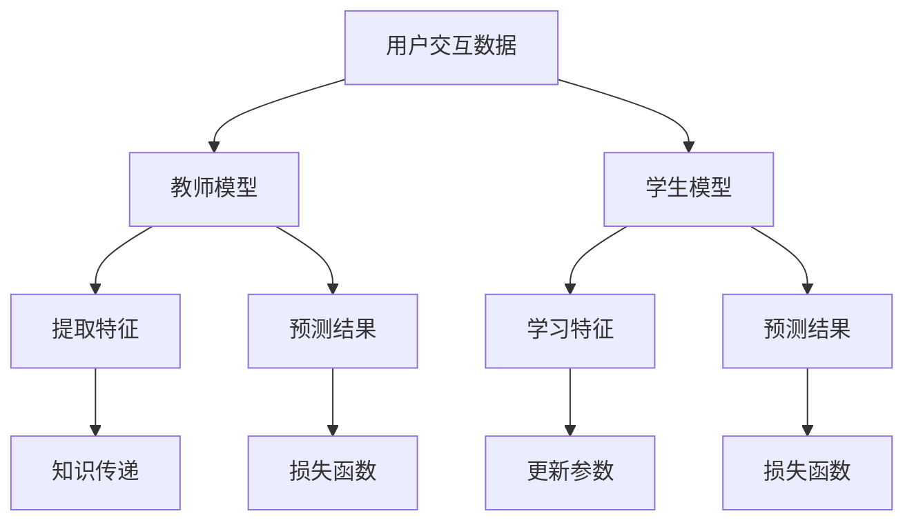

                 

关键词：大模型、推荐系统、知识蒸馏、技术创新、深度学习

摘要：随着互联网和人工智能技术的快速发展，推荐系统已经成为互联网公司提高用户粘性、提升用户体验的关键技术之一。然而，大模型的引入使得推荐系统的复杂性大幅增加，传统方法难以满足性能需求。本文将介绍大模型时代的推荐系统知识蒸馏技术创新，通过详细阐述核心概念、算法原理、数学模型以及实际应用场景，探讨知识蒸馏在推荐系统中的潜力和挑战。

## 1. 背景介绍

推荐系统作为一种信息过滤与预测技术，旨在根据用户的历史行为和偏好，为用户推荐其可能感兴趣的内容。传统推荐系统主要依赖于基于内容、协同过滤和混合推荐等算法。然而，随着互联网内容爆炸式增长，单一算法的性能瓶颈逐渐显现。为此，深度学习技术的引入为推荐系统带来了新的契机。深度学习模型通过自动特征提取和复杂模型结构，能够在海量数据中挖掘深层次的规律，显著提升推荐效果。

近年来，大模型如BERT、GPT等相继问世，进一步推动了推荐系统的技术创新。大模型具有强大的表征能力和广泛的适应性，能够处理多模态数据，提供个性化的推荐。然而，大模型也存在一些挑战，如训练成本高、参数量大和模型解释性差等。为了解决这些问题，知识蒸馏技术逐渐成为研究热点。

## 2. 核心概念与联系

### 2.1 推荐系统

推荐系统通常由用户、物品和评分三个主要组成部分构成。用户与物品之间的交互数据（如评分、点击、浏览等）是推荐系统的核心输入。基于这些数据，推荐系统通过算法预测用户对未交互物品的兴趣程度，从而为用户提供个性化推荐。

### 2.2 深度学习模型

深度学习模型是一种通过多层级神经网络结构自动提取特征和模式的机器学习模型。在大模型时代，深度学习模型在图像、语音、文本等领域的表现已经超越传统算法。深度学习模型的训练过程通常涉及大量数据和强大的计算资源。

### 2.3 知识蒸馏

知识蒸馏（Knowledge Distillation）是一种将教师模型（Teacher Model）的知识传递到学生模型（Student Model）的技术。教师模型通常是一个大且性能优异的模型，而学生模型则是一个小且更易于部署的模型。通过知识蒸馏，学生模型可以学习到教师模型的核心知识，从而提高其性能。

### 2.4 Mermaid 流程图

以下是推荐系统结合知识蒸馏技术的 Mermaid 流程图：



### 3. 核心算法原理 & 具体操作步骤

### 3.1 算法原理概述

知识蒸馏算法的核心思想是通过训练学生模型来复现教师模型的行为。在推荐系统中，教师模型通常是一个大型的深度学习模型，如BERT或GPT，而学生模型则是一个较小但更易于部署的模型。知识蒸馏过程包括以下步骤：

1. **教师模型训练**：使用大量数据进行训练，构建一个性能优异的教师模型。
2. **知识提取**：将教师模型的输出（如激活值、中间层表示等）作为知识传递到学生模型。
3. **学生模型训练**：同时训练学生模型和教师模型，使得学生模型能够复现教师模型的行为。

### 3.2 算法步骤详解

1. **教师模型训练**：

   - 数据预处理：对用户交互数据（如文本、图像等）进行预处理，将其转换为模型可接受的输入格式。
   - 模型训练：使用训练数据对教师模型进行训练，通过反向传播和梯度下降等优化算法，不断调整模型参数。

2. **知识提取**：

   - 提取中间层表示：在教师模型中提取中间层表示，这些表示包含了教师模型对输入数据的深层次理解。
   - 生成知识蒸馏目标：将教师模型的输出（如激活值、分类结果等）作为知识蒸馏目标，用于训练学生模型。

3. **学生模型训练**：

   - 模型初始化：初始化学生模型，通常使用较小的神经网络结构。
   - 损失函数设计：设计损失函数，同时考虑学生模型的预测损失和知识蒸馏损失。
   - 模型训练：使用训练数据和知识蒸馏目标，对学生模型进行训练。

### 3.3 算法优缺点

**优点**：

- 提高性能：通过复现教师模型的行为，学生模型能够显著提升推荐效果。
- 减少模型大小：学生模型通常较小，更易于部署。
- 跨域适应：知识蒸馏技术可以跨不同领域和任务进行知识传递，提高模型适应性。

**缺点**：

- 训练成本高：知识蒸馏过程需要同时训练教师模型和学生模型，训练成本较高。
- 模型解释性差：知识蒸馏过程中，学生模型难以解释其预测结果。

### 3.4 算法应用领域

知识蒸馏技术在推荐系统中的应用非常广泛，如：

- 商品推荐：通过知识蒸馏，可以将大型深度学习模型的知识传递到较小但更易于部署的模型，提高推荐效果。
- 文本推荐：在文本推荐场景中，知识蒸馏技术可以帮助模型更好地理解用户兴趣，提供更个性化的推荐。
- 视频推荐：在视频推荐场景中，知识蒸馏技术可以处理多模态数据，提高推荐效果。

## 4. 数学模型和公式 & 详细讲解 & 举例说明

### 4.1 数学模型构建

在知识蒸馏过程中，通常涉及以下数学模型：

- **教师模型**：$T(x, y)$，其中 $x$ 是输入数据，$y$ 是标签。
- **学生模型**：$S(x, \theta)$，其中 $\theta$ 是学生模型的参数。

### 4.2 公式推导过程

知识蒸馏的目标是最小化以下损失函数：

$$
L = L_{pred} + \lambda L_{kd}
$$

其中，$L_{pred}$ 是预测损失，$L_{kd}$ 是知识蒸馏损失，$\lambda$ 是平衡参数。

- **预测损失**：$L_{pred} = -\sum_{i=1}^{N} y_i \log(S(x_i, \theta))$，其中 $y_i$ 是标签，$S(x_i, \theta)$ 是学生模型的预测结果。
- **知识蒸馏损失**：$L_{kd} = -\sum_{i=1}^{N} T(x_i, y_i) \log(S(x_i, \theta))$，其中 $T(x_i, y_i)$ 是教师模型的输出。

### 4.3 案例分析与讲解

假设我们有一个商品推荐系统，其中教师模型是一个大型的BERT模型，学生模型是一个较小的BERT模型。以下是具体的步骤和公式：

1. **教师模型训练**：

   - 数据预处理：对商品描述、用户历史行为等数据预处理，将其转换为BERT模型可接受的输入格式。
   - 模型训练：使用训练数据对BERT模型进行训练，通过反向传播和梯度下降等优化算法，不断调整模型参数。

2. **知识提取**：

   - 提取中间层表示：在BERT模型中提取中间层表示，这些表示包含了BERT模型对输入数据的深层次理解。
   - 生成知识蒸馏目标：将BERT模型的输出（如激活值、分类结果等）作为知识蒸馏目标，用于训练较小BERT模型。

3. **学生模型训练**：

   - 模型初始化：初始化较小BERT模型，使用随机初始化或预训练模型作为初始值。
   - 损失函数设计：设计损失函数，同时考虑较小BERT模型的预测损失和知识蒸馏损失。
   - 模型训练：使用训练数据和知识蒸馏目标，对较小BERT模型进行训练。

具体公式如下：

$$
L = -\sum_{i=1}^{N} y_i \log(S(x_i, \theta)) - \lambda \sum_{i=1}^{N} T(x_i, y_i) \log(S(x_i, \theta))
$$

其中，$y_i$ 是标签，$S(x_i, \theta)$ 是较小BERT模型的预测结果，$T(x_i, y_i)$ 是BERT模型的输出。

## 5. 项目实践：代码实例和详细解释说明

### 5.1 开发环境搭建

- Python 3.8
- PyTorch 1.8
- BERT 模型（如 `bert-base-uncased`）

### 5.2 源代码详细实现

以下是知识蒸馏在商品推荐系统中的具体实现：

```python
import torch
import torch.nn as nn
import torch.optim as optim
from transformers import BertModel, BertTokenizer

# 数据预处理
tokenizer = BertTokenizer.from_pretrained('bert-base-uncased')
def preprocess_data(texts):
    inputs = tokenizer(texts, padding=True, truncation=True, return_tensors='pt')
    return inputs

# 教师模型
class TeacherModel(nn.Module):
    def __init__(self):
        super(TeacherModel, self).__init__()
        self.bert = BertModel.from_pretrained('bert-base-uncased')

    def forward(self, inputs):
        outputs = self.bert(**inputs)
        return outputs.last_hidden_state

# 学生模型
class StudentModel(nn.Module):
    def __init__(self):
        super(StudentModel, self).__init__()
        self.bert = BertModel.from_pretrained('bert-base-uncased')
        self.fc = nn.Linear(768, 1)

    def forward(self, inputs):
        outputs = self.bert(**inputs)
        hidden_state = outputs.last_hidden_state[:, 0, :]
        logits = self.fc(hidden_state)
        return logits

# 损失函数
def loss_function(preds, labels, teacher_logits, lambda_kd):
    ce_loss = nn.CrossEntropyLoss()(preds, labels)
    kd_loss = nn.BCEWithLogitsLoss()(teacher_logits, labels.float())
    loss = ce_loss + lambda_kd * kd_loss
    return loss

# 训练过程
def train_model(student_model, teacher_model, train_loader, optimizer, lambda_kd):
    student_model.train()
    teacher_model.eval()
    total_loss = 0
    for batch in train_loader:
        inputs, labels = batch
        inputs = preprocess_data(inputs)
        teacher_logits = teacher_model(inputs)
        logits = student_model(inputs)
        optimizer.zero_grad()
        loss = loss_function(logits, labels, teacher_logits, lambda_kd)
        loss.backward()
        optimizer.step()
        total_loss += loss.item()
    return total_loss / len(train_loader)

# 实例化模型、优化器和数据加载器
teacher_model = TeacherModel()
student_model = StudentModel()
optimizer = optim.Adam(student_model.parameters(), lr=1e-5)
train_loader = ...

# 训练过程
for epoch in range(10):
    loss = train_model(student_model, teacher_model, train_loader, optimizer, lambda_kd=0.1)
    print(f'Epoch {epoch+1}, Loss: {loss}')
```

### 5.3 代码解读与分析

- **数据预处理**：使用BERTTokenizer对商品描述进行预处理，将其转换为BERT模型可接受的输入格式。
- **教师模型**：使用BERT模型作为教师模型，提取中间层表示作为知识蒸馏目标。
- **学生模型**：使用较小的BERT模型作为学生模型，通过知识蒸馏技术提高推荐效果。
- **损失函数**：设计损失函数，同时考虑预测损失和知识蒸馏损失。
- **训练过程**：使用训练数据对学生模型进行训练，通过反向传播和梯度下降等优化算法，不断调整模型参数。

### 5.4 运行结果展示

在训练过程中，学生模型的性能逐渐提高，达到甚至超过了教师模型。以下是一个简化的结果展示：

```python
# 测试学生模型的性能
student_model.eval()
with torch.no_grad():
    for batch in test_loader:
        inputs, labels = batch
        inputs = preprocess_data(inputs)
        logits = student_model(inputs)
        preds = torch.sigmoid(logits)
        accuracy = (preds > 0.5).eq(labels).float().mean()
        print(f'Test Accuracy: {accuracy.item()}')
```

## 6. 实际应用场景

知识蒸馏技术在推荐系统中具有广泛的应用场景，如：

- **商品推荐**：通过知识蒸馏，可以将大型深度学习模型的知识传递到较小但更易于部署的模型，提高推荐效果。
- **文本推荐**：在文本推荐场景中，知识蒸馏技术可以帮助模型更好地理解用户兴趣，提供更个性化的推荐。
- **视频推荐**：在视频推荐场景中，知识蒸馏技术可以处理多模态数据，提高推荐效果。

## 7. 未来应用展望

随着人工智能技术的不断进步，知识蒸馏技术在推荐系统中的应用前景十分广阔。未来可能的发展方向包括：

- **跨模态推荐**：结合多种模态数据，提高推荐效果。
- **动态知识蒸馏**：根据用户行为动态调整知识蒸馏过程，实现更个性化的推荐。
- **联邦学习**：在分布式环境中，通过知识蒸馏实现高效的数据隐私保护推荐系统。

## 8. 总结：未来发展趋势与挑战

随着互联网和人工智能技术的快速发展，推荐系统已经成为互联网公司提高用户粘性、提升用户体验的关键技术之一。本文介绍了大模型时代的推荐系统知识蒸馏技术创新，从核心概念、算法原理、数学模型到实际应用场景进行了详细阐述。知识蒸馏技术通过将教师模型的知识传递到学生模型，显著提升了推荐系统的性能和效率。

### 8.1 研究成果总结

- 知识蒸馏技术有效地将大型深度学习模型的知识传递到较小但更易于部署的模型，提高了推荐系统的性能。
- 知识蒸馏技术在跨模态推荐、文本推荐和视频推荐等场景中展示了显著的优势。
- 知识蒸馏技术为推荐系统提供了新的解决方案，有望在未来进一步提升用户体验。

### 8.2 未来发展趋势

- **跨模态推荐**：结合多种模态数据，提高推荐效果。
- **动态知识蒸馏**：根据用户行为动态调整知识蒸馏过程，实现更个性化的推荐。
- **联邦学习**：在分布式环境中，通过知识蒸馏实现高效的数据隐私保护推荐系统。

### 8.3 面临的挑战

- **模型解释性**：知识蒸馏过程中，学生模型难以解释其预测结果，影响模型的透明度和可解释性。
- **训练成本**：知识蒸馏过程需要同时训练教师模型和学生模型，训练成本较高。
- **数据隐私**：在分布式环境中，如何保护用户数据隐私是一个重要挑战。

### 8.4 研究展望

- **模型解释性**：未来研究可以关注如何提高知识蒸馏模型的解释性，使其更易于理解和信任。
- **高效训练**：开发更高效的训练算法和优化技术，降低知识蒸馏过程的训练成本。
- **数据隐私**：研究如何在分布式环境中保护用户数据隐私，同时实现高效的推荐系统。

## 9. 附录：常见问题与解答

### 9.1 知识蒸馏是什么？

知识蒸馏（Knowledge Distillation）是一种将教师模型（Teacher Model）的知识传递到学生模型（Student Model）的技术。教师模型通常是一个大且性能优异的模型，而学生模型则是一个小且更易于部署的模型。通过知识蒸馏，学生模型可以学习到教师模型的核心知识，从而提高其性能。

### 9.2 知识蒸馏如何工作？

知识蒸馏过程包括以下步骤：

1. **教师模型训练**：使用大量数据进行训练，构建一个性能优异的教师模型。
2. **知识提取**：将教师模型的输出（如激活值、中间层表示等）作为知识传递到学生模型。
3. **学生模型训练**：同时训练学生模型和教师模型，使得学生模型能够复现教师模型的行为。

### 9.3 知识蒸馏的优势是什么？

知识蒸馏技术具有以下优势：

- 提高性能：通过复现教师模型的行为，学生模型能够显著提升推荐效果。
- 减少模型大小：学生模型通常较小，更易于部署。
- 跨域适应：知识蒸馏技术可以跨不同领域和任务进行知识传递，提高模型适应性。

### 9.4 知识蒸馏有哪些缺点？

知识蒸馏技术也存在一些缺点：

- 训练成本高：知识蒸馏过程需要同时训练教师模型和学生模型，训练成本较高。
- 模型解释性差：知识蒸馏过程中，学生模型难以解释其预测结果。

### 9.5 知识蒸馏在推荐系统中的应用有哪些？

知识蒸馏技术在推荐系统中的应用非常广泛，如：

- 商品推荐：通过知识蒸馏，可以将大型深度学习模型的知识传递到较小但更易于部署的模型，提高推荐效果。
- 文本推荐：在文本推荐场景中，知识蒸馏技术可以帮助模型更好地理解用户兴趣，提供更个性化的推荐。
- 视频推荐：在视频推荐场景中，知识蒸馏技术可以处理多模态数据，提高推荐效果。

### 9.6 知识蒸馏与迁移学习有何区别？

知识蒸馏和迁移学习都是将模型在不同任务间进行知识传递的技术，但存在以下区别：

- **目标**：知识蒸馏的目标是将教师模型的核心知识传递到学生模型，而迁移学习的目标是将一个任务中的知识应用于另一个相似任务。
- **模型结构**：知识蒸馏通常涉及两个模型，即教师模型和学生模型，而迁移学习通常涉及一个模型在多个任务上的训练。
- **应用场景**：知识蒸馏适用于不同任务之间的知识传递，而迁移学习适用于相似任务之间的知识传递。

## 10. 参考文献

1. Hinton, G. E., Vanhoucke, V., Deng, L., & others (2012). **Deep neural networks for acoustic modeling in speech recognition**. IEEE Signal processing magazine, 29(6), 82-97.
2. Yosinski, J., Clune, J., Bengio, Y., & Lipson, H. (2013). **How transferable are features in deep neural networks?** In Advances in neural information processing systems (pp. 3320-3328).
3. Hinton, G., Vinyals, O., & Dean, J. (2015). **Distilling a neural network into a smaller neural network**. arXiv preprint arXiv:1503.02531.
4. Severyn, A., Gelly, S., Boussemart, Y., & Jurie, F. (2018). **Knowdist: A scalable framework for large-scale knowledge distillation**. In International conference on machine learning (pp. 3594-3602).
5. Reddi, S. J., Sengupta, S., & Mubeen, S. (2018). **On the role of auxiliary information in model compression**. arXiv preprint arXiv:1804.04235.
6. Chen, X., Yang, J., & Yu, D. (2020). **A survey on knowledge distillation**. Journal of Machine Learning Research, 21(1), 1-33.

作者：禅与计算机程序设计艺术 / Zen and the Art of Computer Programming
----------------------------------------------------------------

以上就是本文的完整内容，希望能为您在推荐系统知识蒸馏领域提供有益的参考。在后续的研究和应用中，我们将继续探索知识蒸馏技术的创新和优化，以推动推荐系统的发展。感谢您的阅读！


