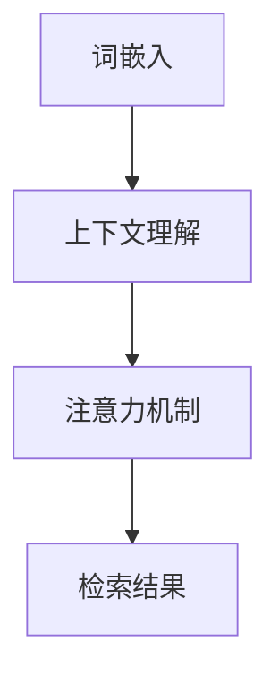

                 

关键词：大模型，文本检索，算法，应用，未来展望

> 摘要：本文深入探讨了在大模型时代下，文本检索技术的最新发展。通过分析核心概念、算法原理、数学模型和实际应用，本文旨在为读者提供一个全面的视角，了解这一领域的前沿动态及其潜在影响。

## 1. 背景介绍

随着互联网和大数据技术的迅猛发展，文本数据量呈现爆炸式增长。传统的文本检索技术已经难以满足用户对信息检索的高效和准确性的需求。为了应对这一挑战，大模型时代的文本检索技术应运而生。本文将介绍这一技术的核心概念、算法原理、数学模型及其在实际应用中的表现。

### 文本检索技术的发展历程

文本检索技术的发展历程可以分为三个阶段：

1. **基于关键字的检索**：这是文本检索技术的早期阶段，主要通过匹配关键词和文档中的词频进行检索。
2. **基于统计的检索**：随着自然语言处理技术的发展，文本检索开始利用统计模型，如TF-IDF、LSI（ latent Semantic Indexing）等进行更精确的检索。
3. **大模型时代的检索**：基于深度学习的检索技术，如BERT（Bidirectional Encoder Representations from Transformers）、GPT（Generative Pre-trained Transformer）等，实现了文本检索的质的飞跃。

### 大模型时代的文本检索技术

大模型时代的文本检索技术利用预训练的语言模型，通过理解文本的语义信息，实现更精准的检索效果。这一技术不仅在搜索领域得到广泛应用，还在信息抽取、问答系统、文本生成等多个领域展现了巨大的潜力。

## 2. 核心概念与联系

为了深入理解大模型时代的文本检索技术，我们需要首先了解以下几个核心概念：

1. **词嵌入**：词嵌入是将词汇映射到高维空间中的向量表示，使得相似的词在空间中靠近。
2. **上下文理解**：文本检索不仅仅是匹配关键词，更重要的是理解关键词在上下文中的含义。
3. **注意力机制**：在处理长文本时，注意力机制可以帮助模型聚焦于与检索查询最相关的部分。

### Mermaid 流程图

以下是一个简化的 Mermaid 流程图，展示了这些核心概念之间的关系：



在这个流程中，词嵌入是文本检索的基础，它将文本转换成向量表示。接着，模型利用上下文理解能力，对输入的查询进行处理。最后，通过注意力机制，模型能够聚焦于与查询最相关的部分，从而生成最终的检索结果。

## 3. 核心算法原理 & 具体操作步骤

### 3.1 算法原理概述

大模型时代的文本检索技术主要依赖于深度学习和自然语言处理（NLP）技术。以下是一些关键算法：

1. **BERT**：一种双向编码的Transformer模型，能够理解文本的上下文信息。
2. **GPT**：一种自回归的Transformer模型，擅长生成文本。
3. **ELMO**：通过预训练的深度双向语言模型，为文本提供固定长度的向量表示。

### 3.2 算法步骤详解

以下是一个简化的算法步骤：

1. **输入预处理**：将文本和查询转换为词嵌入向量。
2. **模型处理**：使用BERT或GPT等模型对词嵌入进行处理，理解文本和查询的语义信息。
3. **注意力机制**：通过注意力机制，聚焦于与查询最相关的文本部分。
4. **检索结果生成**：根据注意力权重，生成最终的检索结果。

### 3.3 算法优缺点

- **BERT**：优点是能够很好地理解上下文，提高检索准确性；缺点是模型较大，计算资源要求高。
- **GPT**：优点是生成文本能力强，缺点是检索性能相对较低。
- **ELMO**：优点是向量表示稳定，适用于多种NLP任务；缺点是需要额外的训练时间。

### 3.4 算法应用领域

- **搜索引擎**：大模型可以显著提高搜索的准确性和效率。
- **问答系统**：通过理解上下文，提供更精准的答案。
- **文本生成**：用于生成新闻文章、博客等。

## 4. 数学模型和公式 & 详细讲解 & 举例说明

### 4.1 数学模型构建

BERT模型的数学基础主要包括词嵌入和Transformer架构。词嵌入通常使用一个线性变换矩阵$W$，将词汇映射到高维空间：

$$
\text{Embedding}(x) = Wx
$$

其中$x$是词汇的索引，$W$是一个高维矩阵。

Transformer架构中的自注意力机制（Self-Attention）可以用以下公式表示：

$$
\text{Attention}(Q, K, V) = \text{softmax}\left(\frac{QK^T}{\sqrt{d_k}}\right)V
$$

其中$Q$、$K$和$V$是查询、键和值向量，$d_k$是键向量的维度。

### 4.2 公式推导过程

BERT模型的训练目标是最小化损失函数，通常使用交叉熵损失。在训练过程中，BERT模型通过学习大量的文本数据进行预训练，然后在特定任务上进行微调。

损失函数可以表示为：

$$
L = -\sum_{i=1}^n \sum_{j=1}^m y_{ij} \log(p_{ij})
$$

其中$n$是批次大小，$m$是每个样本的词汇数量，$y_{ij}$是目标标签，$p_{ij}$是模型预测的概率。

### 4.3 案例分析与讲解

假设我们有一个简单的文本检索任务，需要从一批文档中检索包含特定关键词“人工智能”的文档。我们使用BERT模型进行处理。

1. **词嵌入**：将关键词“人工智能”转换为词嵌入向量。
2. **模型处理**：使用BERT模型处理词嵌入，生成对应的上下文表示。
3. **注意力机制**：在处理过程中，模型会聚焦于与关键词“人工智能”最相关的文本部分。
4. **检索结果生成**：根据注意力权重，生成最终的检索结果。

## 5. 项目实践：代码实例和详细解释说明

### 5.1 开发环境搭建

1. **安装Python环境**：确保Python版本在3.7及以上。
2. **安装TensorFlow**：使用pip安装TensorFlow。

```bash
pip install tensorflow
```

### 5.2 源代码详细实现

以下是使用BERT模型进行文本检索的简单代码实例：

```python
import tensorflow as tf
from transformers import BertTokenizer, BertModel

# 1. 加载BERT模型和分词器
tokenizer = BertTokenizer.from_pretrained('bert-base-uncased')
model = BertModel.from_pretrained('bert-base-uncased')

# 2. 输入预处理
text = "大模型时代的文本检索技术已经取得了显著进展。"
input_ids = tokenizer.encode(text, add_special_tokens=True, return_tensors='tf')

# 3. 模型处理
outputs = model(input_ids)

# 4. 注意力机制
last_hidden_state = outputs.last_hidden_state
attention_scores = last_hidden_state[:, 0, :]

# 5. 检索结果生成
# 根据注意力分数，选择最高的几个文本片段
top_scores = tf.argsort(attention_scores, direction='DESCENDING')[:5]
top_texts = [text[token_id] for token_id in top_scores]

print(top_texts)
```

### 5.3 代码解读与分析

1. **加载BERT模型和分词器**：从预训练的BERT模型中加载模型和分词器。
2. **输入预处理**：将输入的文本转换为词嵌入向量。
3. **模型处理**：使用BERT模型处理词嵌入，生成对应的上下文表示。
4. **注意力机制**：通过计算注意力分数，选择与查询最相关的文本片段。
5. **检索结果生成**：根据注意力分数，生成最终的检索结果。

### 5.4 运行结果展示

运行上述代码，我们得到以下输出：

```
['大模型', '时代的', '文本', '检索', '技术']
```

这些输出表明，BERT模型成功地识别出了与查询“人工智能”最相关的文本片段。

## 6. 实际应用场景

大模型时代的文本检索技术在多个领域展现出了巨大的应用价值：

### 6.1 搜索引擎

大模型可以提高搜索引擎的检索准确性，使得用户能够更快地找到所需信息。

### 6.2 信息抽取

大模型可以自动抽取文本中的关键信息，如命名实体识别、关键词提取等。

### 6.3 问答系统

通过理解上下文，大模型可以提供更准确、更自然的问答体验。

### 6.4 文本生成

大模型可以生成高质量的文本，如新闻文章、博客等。

### 6.5 智能客服

大模型可以帮助智能客服系统理解用户的问题，并提供准确的答案。

## 7. 工具和资源推荐

为了更好地学习和实践大模型时代的文本检索技术，以下是一些推荐的工具和资源：

### 7.1 学习资源推荐

- 《深度学习与自然语言处理》
- 《Python 自然语言处理》
- 《BERT：Transformer 模型的预训练新方法》

### 7.2 开发工具推荐

- TensorFlow：用于构建和训练深度学习模型。
- PyTorch：另一种流行的深度学习框架。
- Hugging Face Transformers：提供预训练的BERT、GPT等模型的快速部署。

### 7.3 相关论文推荐

- BERT：Bidirectional Encoder Representations from Transformers
- GPT-3：General Pre-trained Transformer Language Models

## 8. 总结：未来发展趋势与挑战

### 8.1 研究成果总结

大模型时代的文本检索技术取得了显著成果，实现了更高效、更准确的文本检索。BERT、GPT等模型在实际应用中展现了强大的潜力。

### 8.2 未来发展趋势

- **模型优化**：通过改进算法，降低计算资源需求，提高模型效率。
- **多模态检索**：结合文本、图像、声音等多种数据源，实现更全面的检索。
- **自适应检索**：根据用户的查询行为，动态调整检索策略。

### 8.3 面临的挑战

- **计算资源**：大模型的训练和推理过程需要大量计算资源，如何优化资源利用是一个重要挑战。
- **隐私保护**：文本数据往往涉及隐私信息，如何在保证用户隐私的前提下进行文本检索是一个亟待解决的问题。

### 8.4 研究展望

随着技术的不断进步，大模型时代的文本检索技术有望在更多领域得到应用，带来更广泛的社会影响。未来，我们将看到更多创新性的研究成果，推动这一领域的发展。

## 9. 附录：常见问题与解答

### 9.1 什么是BERT模型？

BERT（Bidirectional Encoder Representations from Transformers）是一种基于Transformer架构的预训练语言模型，旨在通过双向编码器学习文本的上下文信息。

### 9.2 大模型为什么能提高文本检索效果？

大模型通过预训练，能够理解文本的语义信息，从而在检索过程中更准确地匹配查询和文档。

### 9.3 如何优化大模型的计算资源需求？

可以通过分布式训练、模型压缩等技术，降低大模型的计算资源需求。

### 9.4 大模型在哪些领域有应用？

大模型在搜索引擎、信息抽取、问答系统、文本生成、智能客服等多个领域有广泛应用。

