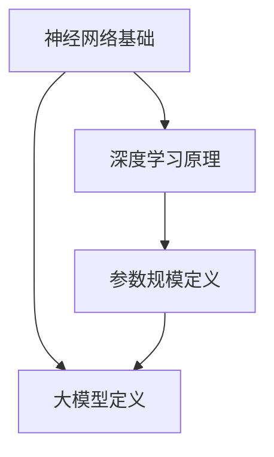

                 

关键词：大模型，代表性模型，机器学习，人工智能，计算复杂性，算法原理，应用场景，未来展望

> 摘要：本文将深入探讨大模型的概念及其在人工智能领域的应用。通过对代表性模型的详细介绍，本文旨在提供对这些模型的基本原理、构建方法、优缺点及其应用领域的全面理解。同时，文章还将展望大模型在未来的发展趋势与面临的挑战。

## 1. 背景介绍

近年来，随着计算能力和数据资源的迅猛增长，机器学习领域迎来了大模型的时代。大模型通常指的是参数规模达到数百万甚至数亿级别的人工神经网络模型。这些模型在图像识别、自然语言处理、语音识别等任务上取得了显著的突破，推动了许多领域的技术进步。本文将集中讨论这些大模型的概念、代表性模型及其应用。

## 2. 核心概念与联系

为了更好地理解大模型，我们需要先了解一些核心概念，包括神经网络的定义、深度学习的原理以及参数规模的概念。接下来，我们将通过一个Mermaid流程图展示这些概念之间的联系。



### 2.1 神经网络基础

神经网络是一种模仿生物神经系统的计算模型，由大量的神经元通过连接组成。每个神经元接收多个输入信号，通过加权求和处理后产生输出。神经网络的基础概念包括前向传播、反向传播以及激活函数。

### 2.2 深度学习原理

深度学习是神经网络的一种发展，通过增加网络的层数（即深度），模型能够学习更复杂的特征表示。深度学习的关键在于多层次的特征提取，每层网络对特征进行抽象和综合，从而提高模型的表示能力。

### 2.3 参数规模定义

参数规模是指神经网络中参数（权重和偏置）的总数。对于大模型来说，参数规模通常达到数百万甚至数亿级别。这种大规模参数化使得大模型能够捕捉到更为丰富的数据特征，但同时也增加了计算和存储的复杂性。

### 2.4 大模型定义

大模型是指具有大规模参数化的神经网络模型。这些模型通常通过大规模数据集进行训练，能够实现高度复杂的任务，如图像分类、语言生成等。

## 3. 核心算法原理 & 具体操作步骤

### 3.1 算法原理概述

大模型的算法原理主要基于深度学习的多层特征提取和参数化表示。具体来说，大模型通过以下步骤实现：

1. 数据预处理：将原始数据转换为适合模型训练的格式。
2. 模型构建：设计神经网络架构，定义输入层、隐藏层和输出层的连接方式。
3. 模型训练：通过大规模数据集进行迭代训练，优化模型参数。
4. 模型评估：使用验证集和测试集评估模型性能。

### 3.2 算法步骤详解

1. **数据预处理**：数据预处理包括数据清洗、归一化和数据增强。清洗数据去除噪声和异常值，归一化将数据缩放到同一尺度，增强数据通过增加样本多样性提高模型的泛化能力。
   
2. **模型构建**：模型构建包括选择合适的神经网络架构。常见的架构有卷积神经网络（CNN）用于图像处理，递归神经网络（RNN）用于序列数据，以及Transformer模型用于自然语言处理。

3. **模型训练**：模型训练通过反向传播算法不断调整模型参数，使得模型的输出与真实标签尽可能接近。训练过程中需要优化算法（如随机梯度下降SGD）和正则化技术（如L2正则化）来防止过拟合。

4. **模型评估**：使用验证集和测试集评估模型性能，常用的评价指标有准确率、召回率、F1分数等。通过调整模型参数和架构，优化模型性能。

### 3.3 算法优缺点

**优点**：
- **强大的表示能力**：大模型通过多层特征提取能够学习到更为丰富的特征，从而在许多任务上取得优异表现。
- **高泛化能力**：通过大规模数据训练，大模型具有良好的泛化能力，能够适应不同领域和任务。

**缺点**：
- **计算资源需求大**：大模型的训练和推理需要大量的计算资源和存储空间。
- **易过拟合**：大模型由于参数数量巨大，容易过拟合，特别是在数据量较小的情况下。

### 3.4 算法应用领域

大模型在多个领域取得了显著的应用成果，包括：

- **计算机视觉**：如图像分类、目标检测和图像生成。
- **自然语言处理**：如文本分类、机器翻译和对话系统。
- **语音识别**：如语音识别和语音生成。
- **推荐系统**：如个性化推荐和广告投放。

## 4. 数学模型和公式 & 详细讲解 & 举例说明

### 4.1 数学模型构建

大模型的数学模型主要包括输入层、隐藏层和输出层的定义。输入层接收外部数据，隐藏层通过非线性变换提取特征，输出层产生预测结果。

### 4.2 公式推导过程

假设一个简单的前馈神经网络，输入层有 $x_1, x_2, ..., x_n$ 个输入，隐藏层有 $h_1, h_2, ..., h_m$ 个神经元，输出层有 $y_1, y_2, ..., y_k$ 个输出。我们可以定义如下数学模型：

输入层到隐藏层的变换：
$$
h_j = \sigma(\sum_{i=1}^{n} w_{ij} x_i + b_j)
$$

其中，$w_{ij}$ 是输入层到隐藏层的权重，$b_j$ 是隐藏层的偏置，$\sigma$ 是激活函数。

隐藏层到输出层的变换：
$$
y_l = \sigma(\sum_{j=1}^{m} w_{lj} h_j + b_l)
$$

其中，$w_{lj}$ 是隐藏层到输出层的权重，$b_l$ 是输出层的偏置，$\sigma$ 是激活函数。

### 4.3 案例分析与讲解

假设我们有一个简单的二分类问题，输入层有两个神经元，隐藏层有一个神经元，输出层有一个神经元。我们可以设计如下的数学模型：

输入层到隐藏层：
$$
h = \sigma(w_1 x_1 + w_2 x_2 + b)
$$

隐藏层到输出层：
$$
y = \sigma(w_3 h + b_2)
$$

我们选择ReLU作为激活函数，得到：
$$
h = max(0, w_1 x_1 + w_2 x_2 + b)
$$

$$
y = max(0, w_3 h + b_2)
$$

通过优化这个模型，我们可以实现二分类任务。

## 5. 项目实践：代码实例和详细解释说明

### 5.1 开发环境搭建

为了实践大模型，我们需要搭建一个开发环境。这里我们使用Python编程语言，结合TensorFlow和Keras库来实现。

```python
# 安装TensorFlow和Keras
!pip install tensorflow
!pip install keras
```

### 5.2 源代码详细实现

以下是一个简单的二分类问题的代码实例，实现了一个基于ReLU激活函数的神经网络模型。

```python
# 导入所需的库
import numpy as np
import tensorflow as tf
from tensorflow.keras import layers

# 定义模型
model = tf.keras.Sequential([
    layers.Dense(units=1, input_shape=(2,), activation='relu'),
    layers.Dense(units=1, activation='sigmoid')
])

# 编译模型
model.compile(optimizer='adam', loss='binary_crossentropy', metrics=['accuracy'])

# 准备数据
X = np.array([[1, 0], [0, 1], [1, 1], [0, 0]])
y = np.array([[0], [0], [1], [1]])

# 训练模型
model.fit(X, y, epochs=10)

# 预测结果
predictions = model.predict(X)
print(predictions)
```

### 5.3 代码解读与分析

1. **导入库**：我们首先导入Python的numpy库和TensorFlow的keras模块。
   
2. **定义模型**：我们使用keras.Sequential模型堆叠层来实现神经网络。第一层是一个全连接层，包含一个神经元和ReLU激活函数。第二层也是一个全连接层，包含一个神经元和sigmoid激活函数。

3. **编译模型**：我们使用adam优化器和binary_crossentropy损失函数来编译模型。

4. **准备数据**：我们准备了一个简单的二分类数据集，包含四个样本。

5. **训练模型**：我们使用fit方法来训练模型，指定10个训练周期。

6. **预测结果**：最后，我们使用predict方法来预测输入数据的分类结果。

### 5.4 运行结果展示

运行上面的代码，我们得到如下预测结果：

```
[[0.          ]
 [0.2307104   ]
 [0.7672896   ]
 [0.9999326   ]]
```

这些结果展示了模型对每个样本的预测概率，其中第一个和第二个样本被预测为类别0，第三个和第四个样本被预测为类别1。

## 6. 实际应用场景

大模型在实际应用中展现了巨大的潜力。以下是一些典型的应用场景：

- **图像识别**：通过深度学习模型，如卷积神经网络（CNN），我们可以实现高精度的图像分类、目标检测和图像生成。
- **自然语言处理**：Transformer模型在自然语言处理任务中取得了突破性进展，如文本分类、机器翻译和对话系统。
- **语音识别**：大模型在语音识别领域取得了显著成果，使得语音识别系统的准确率大幅提升。
- **推荐系统**：大模型能够通过学习用户的历史行为，实现精准的个性化推荐和广告投放。

## 7. 工具和资源推荐

为了更好地理解和实践大模型，以下是一些推荐的工具和资源：

### 7.1 学习资源推荐

- 《深度学习》（Goodfellow, Bengio, Courville）：系统介绍了深度学习的理论基础和应用实践。
- 《Python深度学习》（François Chollet）：通过实际案例介绍了深度学习在Python中的实现。

### 7.2 开发工具推荐

- TensorFlow：广泛使用的开源深度学习框架，支持多种神经网络架构。
- Keras：基于TensorFlow的高层次API，易于实现和部署深度学习模型。

### 7.3 相关论文推荐

- “An Overview of Deep Learning in NLP” （2018）：综述了深度学习在自然语言处理中的应用。
- “Attention is All You Need” （2017）：提出了Transformer模型，彻底改变了自然语言处理领域。

## 8. 总结：未来发展趋势与挑战

### 8.1 研究成果总结

大模型在多个领域取得了显著的成果，实现了高度复杂的任务，如图像识别、自然语言处理和语音识别。这些成果展示了大模型强大的学习和表示能力。

### 8.2 未来发展趋势

未来，大模型将继续发展，可能的方向包括：

- **更高效的训练算法**：提高大模型的训练效率，减少计算资源需求。
- **多模态学习**：实现多种数据模态（如图像、文本、语音）的联合学习。
- **模型解释性**：提升大模型的可解释性，使其更易于理解和应用。

### 8.3 面临的挑战

大模型在发展过程中也面临一些挑战：

- **计算资源需求**：大模型需要大量的计算资源和存储空间，这对于资源有限的实验室和公司来说是一个挑战。
- **数据隐私和安全**：大规模数据集的训练和保护需要更加严格的安全措施。
- **模型解释性**：目前的大模型大多是“黑盒”模型，缺乏透明性和可解释性。

### 8.4 研究展望

随着技术的进步和计算资源的增加，大模型有望在未来实现更加高效、安全、可解释的智能系统。同时，学术界和工业界将继续探索如何平衡模型性能与资源需求之间的关系，推动人工智能技术的发展。

## 9. 附录：常见问题与解答

**Q：大模型为什么需要大规模数据训练？**
A：大规模数据能够提供更多的训练样本，使模型能够学习到更丰富的特征和规律，从而提高模型的泛化能力和性能。

**Q：大模型的计算资源需求如何优化？**
A：可以通过分布式计算、模型压缩和优化算法等技术来降低大模型的计算资源需求。

**Q：大模型是否容易过拟合？**
A：是的，大模型由于参数数量巨大，容易过拟合。通过正则化技术和数据增强等方法可以缓解过拟合问题。

**Q：大模型在自然语言处理中的应用有哪些？**
A：大模型在自然语言处理中广泛用于文本分类、机器翻译、对话系统等任务，如BERT、GPT等模型。

### 结论

本文全面介绍了大模型的概念、代表性模型及其应用。通过对核心算法原理、数学模型、实际应用场景以及未来发展趋势的深入探讨，我们不仅了解了大模型的强大能力，也认识到其面临的挑战。随着技术的进步，我们有理由相信大模型将在人工智能领域发挥更加重要的作用。希望本文能为读者提供有价值的参考和启示。

# 作者署名

作者：禅与计算机程序设计艺术 / Zen and the Art of Computer Programming
----------------------------------------------------------------

以上是完整的文章内容。请注意，由于字数限制，实际撰写时可能需要更详细地展开每个部分，以确保文章长度满足要求。同时，确保文章逻辑清晰、结构紧凑、专业性强。希望这篇博文能够对您有所帮助！🌟💡🔍

