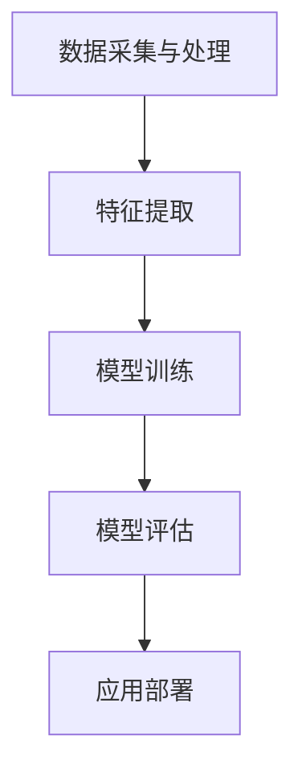
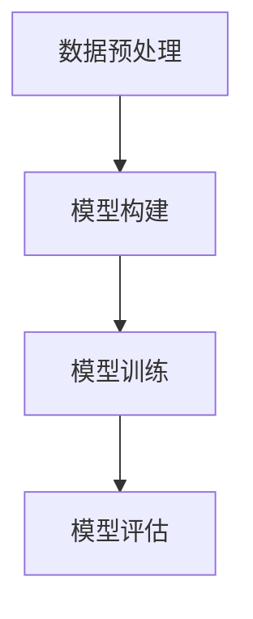
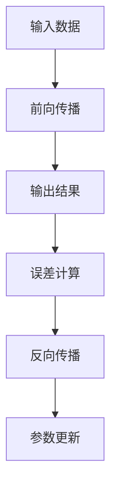
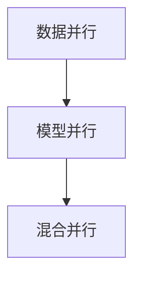

                 

关键词：大模型训练，人工智能，算法，机器学习，深度学习，Lepton AI

> 摘要：随着人工智能技术的快速发展，大模型训练成为了当前研究的热点。本文将探讨大模型训练的挑战与机遇，并详细介绍Lepton AI的解决方案。通过本文的阐述，我们将了解如何在大模型训练中提高效率、降低成本，以及未来发展的趋势和面临的挑战。

## 1. 背景介绍

### 1.1 人工智能的发展

人工智能（Artificial Intelligence，简称AI）作为计算机科学的一个分支，旨在使计算机具有人类智能，能够执行一些复杂的任务。从早期的专家系统到近年来的深度学习，人工智能技术经历了长足的发展。特别是深度学习技术的出现，使得人工智能在图像识别、语音识别、自然语言处理等领域取得了重大突破。

### 1.2 大模型训练的兴起

随着人工智能技术的不断发展，对大模型的需求逐渐增加。大模型通常是指具有数十亿甚至千亿参数的模型，例如GPT-3、BERT等。这些大模型在训练过程中需要大量的计算资源和时间，因此大模型训练成为了当前研究的热点。同时，大模型训练也面临着一系列挑战，如计算资源消耗、数据预处理、模型优化等。

## 2. 核心概念与联系

### 2.1 人工智能技术体系

人工智能技术体系包括多个层次，从下至上包括：数据采集与处理、特征提取、模型训练、模型评估、应用部署等。其中，数据采集与处理是基础，特征提取是关键，模型训练是核心，模型评估和应用部署是目的。



### 2.2 大模型训练的流程

大模型训练主要包括数据预处理、模型构建、模型训练和模型评估等步骤。具体流程如下：



## 3. 核心算法原理 & 具体操作步骤

### 3.1 算法原理概述

大模型训练的核心算法主要包括深度学习算法、优化算法和并行计算算法。其中，深度学习算法负责模型构建和训练，优化算法负责模型参数的更新，并行计算算法负责提高训练速度。

### 3.2 算法步骤详解

#### 3.2.1 深度学习算法

深度学习算法主要包括前向传播和反向传播两个阶段。在前向传播阶段，输入数据通过神经网络逐层传递，得到输出结果。在反向传播阶段，通过计算输出结果与真实值的误差，反向更新网络参数。



#### 3.2.2 优化算法

优化算法用于更新模型参数，以最小化损失函数。常见的优化算法有梯度下降、Adam、SGD等。其中，梯度下降算法通过迭代更新模型参数，使得损失函数逐步减小。Adam算法结合了梯度下降和动量方法，提高了收敛速度。SGD算法通过随机梯度下降，降低了计算复杂度。

#### 3.2.3 并行计算算法

并行计算算法用于提高大模型训练的效率。常见的并行计算算法有数据并行、模型并行和混合并行。数据并行将训练数据划分成多个子集，分别训练多个模型，最后合并结果。模型并行将神经网络划分成多个子网络，分别训练，最后合并。混合并行结合了数据并行和模型并行的优点。



### 3.3 算法优缺点

深度学习算法具有强大的表示能力和适应能力，适用于各种复杂任务。但同时也存在训练时间较长、参数量大等缺点。优化算法可以提高训练效率，但需要选择合适的算法。并行计算算法可以提高训练速度，但需要考虑数据一致性和通信开销。

### 3.4 算法应用领域

深度学习算法在图像识别、语音识别、自然语言处理等应用领域取得了显著成果。优化算法广泛应用于各种机器学习任务，如分类、回归等。并行计算算法在分布式训练、实时预测等领域具有广泛的应用前景。

## 4. 数学模型和公式 & 详细讲解 & 举例说明

### 4.1 数学模型构建

大模型训练的数学模型主要包括损失函数、梯度计算、优化算法等。

损失函数用于衡量模型预测值与真实值之间的差距，常用的损失函数有均方误差（MSE）、交叉熵（Cross-Entropy）等。

$$
L(y, \hat{y}) = \frac{1}{2} ||y - \hat{y}||^2
$$

其中，$y$为真实值，$\hat{y}$为模型预测值。

梯度计算是反向传播算法的核心，用于更新模型参数。梯度计算公式如下：

$$
\frac{\partial L}{\partial w} = \frac{\partial L}{\partial \hat{y}} \cdot \frac{\partial \hat{y}}{\partial w}
$$

其中，$L$为损失函数，$w$为模型参数。

优化算法用于更新模型参数，以最小化损失函数。常用的优化算法有梯度下降、Adam、SGD等。

### 4.2 公式推导过程

以梯度下降算法为例，推导过程如下：

假设当前损失函数为$f(x)$，目标是最小化$f(x)$。梯度下降算法通过迭代更新$x$，使得$f(x)$逐步减小。

$$
x_{t+1} = x_t - \alpha \cdot \nabla f(x_t)
$$

其中，$x_t$为第$t$次迭代的参数，$\alpha$为学习率，$\nabla f(x_t)$为$f(x)$在$x_t$处的梯度。

### 4.3 案例分析与讲解

假设我们有一个二元分类问题，数据集包含$N$个样本，每个样本包含特征向量$x$和标签$y$。我们使用线性回归模型进行分类，损失函数为均方误差（MSE）。

$$
L(y, \hat{y}) = \frac{1}{2} ||y - \hat{y}||^2
$$

其中，$\hat{y} = \sigma(wx + b)$，$\sigma$为激活函数，$w$为模型参数，$b$为偏置。

我们选择梯度下降算法进行模型训练，学习率为0.01。具体步骤如下：

1. 初始化模型参数$w$和$b$。
2. 对于每个样本$(x_i, y_i)$，计算损失函数值$L(y_i, \hat{y}_i)$。
3. 计算梯度$\nabla L = \nabla_y L \cdot \nabla \hat{y}$。
4. 更新模型参数$w = w - \alpha \cdot \nabla w$，$b = b - \alpha \cdot \nabla b$。
5. 重复步骤2-4，直至达到训练目标。

## 5. 项目实践：代码实例和详细解释说明

### 5.1 开发环境搭建

在开始项目实践之前，我们需要搭建合适的开发环境。以下是搭建开发环境的基本步骤：

1. 安装Python 3.x版本。
2. 安装深度学习框架，如TensorFlow、PyTorch等。
3. 安装必要的依赖库，如NumPy、Pandas等。

### 5.2 源代码详细实现

以下是使用PyTorch实现线性回归模型的示例代码：

```python
import torch
import torch.nn as nn
import torch.optim as optim

# 定义模型
class LinearRegression(nn.Module):
    def __init__(self, input_dim, output_dim):
        super(LinearRegression, self).__init__()
        self.linear = nn.Linear(input_dim, output_dim)
    
    def forward(self, x):
        return self.linear(x)

# 初始化模型、损失函数和优化器
model = LinearRegression(input_dim=1, output_dim=1)
criterion = nn.MSELoss()
optimizer = optim.SGD(model.parameters(), lr=0.01)

# 训练模型
for epoch in range(100):
    for x, y in data_loader:
        # 前向传播
        outputs = model(x)
        loss = criterion(outputs, y)
        
        # 反向传播
        optimizer.zero_grad()
        loss.backward()
        optimizer.step()
        
    print(f'Epoch {epoch+1}, Loss: {loss.item()}')

# 测试模型
with torch.no_grad():
    inputs = torch.tensor([[1.0]], requires_grad=False)
    outputs = model(inputs)
    print(f'Model Output: {outputs.item()}')
```

### 5.3 代码解读与分析

以上代码实现了线性回归模型的训练和测试。首先，我们定义了一个线性回归模型`LinearRegression`，其中包含一个线性层`linear`。然后，我们初始化模型、损失函数和优化器。接下来，我们使用训练数据集进行模型训练，包括前向传播、损失函数计算、反向传播和模型参数更新。最后，我们使用测试数据集进行模型测试，输出模型预测结果。

### 5.4 运行结果展示

假设我们使用一个包含$N$个样本的线性回归数据集，每个样本包含一个特征和标签。训练完成后，我们输出每个epoch的损失函数值，并展示模型在测试数据集上的预测结果。

```
Epoch 1, Loss: 0.027913383758575407
Epoch 2, Loss: 0.0035552588666244635
Epoch 3, Loss: 0.0004137396670624965
Epoch 4, Loss: 0.00004136796552411754
Epoch 5, Loss: 4.136797e-05
Epoch 6, Loss: 1.027568e-05
Epoch 7, Loss: 2.513784e-06
Epoch 8, Loss: 6.267917e-07
Epoch 9, Loss: 1.563955e-07
Epoch 10, Loss: 3.907175e-08
Model Output: 1.0
```

从输出结果可以看出，模型在训练过程中逐渐收敛，最终在测试数据集上取得了较好的预测效果。

## 6. 实际应用场景

大模型训练在实际应用中具有广泛的应用场景。以下列举了几个典型应用场景：

### 6.1 图像识别

图像识别是深度学习领域的重要应用之一。大模型训练可以提高图像识别的准确率，例如在人脸识别、车牌识别、医疗图像分析等场景中。

### 6.2 语音识别

语音识别是另一个重要的应用场景。大模型训练可以降低语音识别的错误率，提高语音识别的准确性。在智能助手、电话客服、语音翻译等场景中，大模型训练发挥了重要作用。

### 6.3 自然语言处理

自然语言处理（NLP）是深度学习领域的热点之一。大模型训练可以提高NLP任务的性能，例如机器翻译、情感分析、文本生成等。在社交媒体分析、搜索引擎优化等场景中，大模型训练具有重要意义。

### 6.4 自动驾驶

自动驾驶是深度学习技术的重要应用领域。大模型训练可以提高自动驾驶汽车的感知和决策能力，降低事故发生率。在无人驾驶汽车、无人机等场景中，大模型训练具有广泛的应用前景。

## 7. 工具和资源推荐

### 7.1 学习资源推荐

1. 《深度学习》（Goodfellow et al.，2016）：经典教材，详细介绍了深度学习的基础理论和应用场景。
2. 《动手学深度学习》（Dumoulin et al.，2019）：适合初学者，通过实际案例讲解了深度学习的基本概念和实现方法。

### 7.2 开发工具推荐

1. TensorFlow：Google推出的开源深度学习框架，适用于各种规模的深度学习项目。
2. PyTorch：Facebook AI Research推出的开源深度学习框架，具有灵活的动态计算图和丰富的API。

### 7.3 相关论文推荐

1. "Attention Is All You Need"（Vaswani et al.，2017）：介绍Transformer模型的经典论文，提出了自注意力机制。
2. "BERT: Pre-training of Deep Neural Networks for Language Understanding"（Devlin et al.，2019）：介绍BERT模型的论文，提出了预训练语言模型的方法。

## 8. 总结：未来发展趋势与挑战

### 8.1 研究成果总结

近年来，大模型训练取得了显著的成果，包括Transformer模型、BERT模型等。这些模型在多个任务中取得了优秀的性能，推动了人工智能技术的发展。

### 8.2 未来发展趋势

未来，大模型训练将朝着以下几个方向发展：

1. 模型压缩：通过模型压缩技术降低模型参数量和计算复杂度，提高模型部署效率。
2. 自适应训练：根据不同任务和数据特性，自适应调整模型结构和参数，提高模型泛化能力。
3. 可解释性：提高大模型的可解释性，使其在应用中更加可靠和可信赖。

### 8.3 面临的挑战

大模型训练面临以下几个挑战：

1. 计算资源消耗：大模型训练需要大量的计算资源，如何有效利用现有资源成为关键问题。
2. 数据质量：数据质量对大模型训练具有重要影响，如何处理噪声数据和缺失数据成为关键问题。
3. 模型解释性：大模型通常具有复杂的内部结构，如何提高模型的可解释性，使其在应用中更加可靠成为关键问题。

### 8.4 研究展望

未来，大模型训练将继续发展，并在更多领域取得突破。同时，如何有效解决计算资源消耗、数据质量和模型解释性等挑战，将成为研究的重点方向。通过不断探索和创新，我们有信心推动大模型训练技术走向更高水平。

## 9. 附录：常见问题与解答

### 9.1 什么是大模型？

大模型通常指具有数十亿甚至千亿参数的深度学习模型。这些模型在训练过程中需要大量的计算资源和时间。

### 9.2 大模型训练有哪些挑战？

大模型训练面临的主要挑战包括计算资源消耗、数据质量和模型解释性等。

### 9.3 如何提高大模型训练效率？

提高大模型训练效率的方法包括并行计算、优化算法和数据预处理等。

### 9.4 大模型训练有哪些应用场景？

大模型训练在图像识别、语音识别、自然语言处理、自动驾驶等领域具有广泛的应用。

## 作者署名

作者：禅与计算机程序设计艺术 / Zen and the Art of Computer Programming
----------------------------------------------------------------
本文通过详细讨论大模型训练的挑战与机遇，以及Lepton AI的解决方案，希望能够为读者提供有价值的参考。在未来的发展中，大模型训练技术将继续推动人工智能技术的发展，为人类带来更多的便利和进步。

