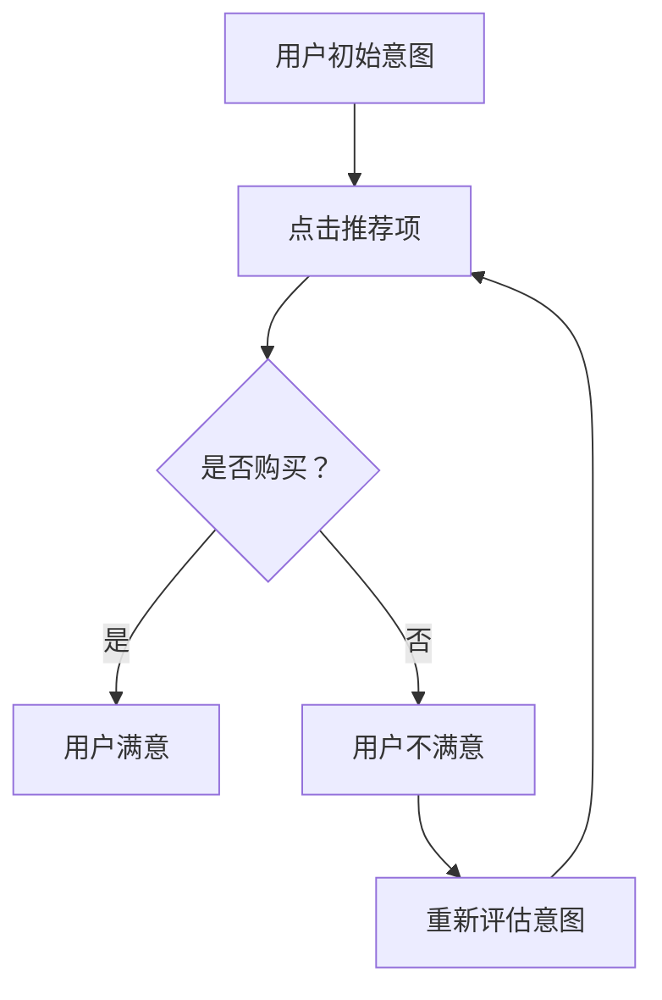

                 

关键词：大模型、推荐系统、用户行为、意图演化、规律挖掘

摘要：随着大数据和人工智能技术的不断发展，推荐系统在商业和社会生活中发挥着越来越重要的作用。本文将探讨如何利用大模型技术挖掘推荐系统中的用户行为意图演化规律，提高推荐系统的准确性和用户体验。通过介绍相关核心概念、算法原理、数学模型以及实际应用案例，本文旨在为研究人员和开发者提供有价值的参考。

## 1. 背景介绍

推荐系统是大数据和人工智能领域的一个重要研究方向，旨在为用户提供个性化的信息推荐。传统的推荐系统主要基于协同过滤、基于内容、基于知识等方法，但它们往往存在一些局限性。例如，协同过滤方法容易出现数据稀疏和冷启动问题；基于内容的方法可能无法很好地处理用户的隐式反馈；基于知识的方法需要大量先验知识。随着深度学习和大数据技术的兴起，大模型（如深度神经网络、生成对抗网络等）逐渐成为解决推荐系统问题的关键。

用户行为意图是推荐系统研究和应用中的核心概念。用户行为意图包括用户当前的行为意图和未来的潜在行为意图。挖掘用户行为意图的演化规律，可以帮助推荐系统更好地预测用户的需求，提高推荐的效果和用户体验。

## 2. 核心概念与联系

为了更好地理解大模型赋能下的推荐系统用户行为意图演化规律挖掘，我们需要先了解以下核心概念：

### 2.1 大模型

大模型是指具有巨大参数量和计算量的深度学习模型。它们通常用于处理大规模的数据集，能够自动提取数据中的复杂特征，实现高精度的预测和分类。

### 2.2 用户行为

用户行为是指用户在使用推荐系统过程中所表现出的各种操作，如点击、收藏、购买、评论等。

### 2.3 用户意图

用户意图是指用户在执行某个行为时所期望达到的目的。用户意图可以分为显式意图（如直接点击某个推荐项）和隐式意图（如对某个推荐项的偏好）。

### 2.4 意图演化

意图演化是指用户意图在时间维度上的变化过程。挖掘意图演化规律可以帮助推荐系统更好地预测用户的未来行为。

### 2.5 演化模型

演化模型是指用于描述用户意图演化规律的数学模型。常见的演化模型包括马尔可夫模型、时序模型等。

### 2.6 Mermaid 流程图

Mermaid 是一种用于生成图表的标记语言。以下是一个描述用户行为意图演化过程的 Mermaid 流程图：



## 3. 核心算法原理 & 具体操作步骤

### 3.1 算法原理概述

大模型赋能下的推荐系统用户行为意图演化规律挖掘主要基于以下原理：

1. 深度学习模型能够自动学习用户行为数据中的复杂特征，从而实现高精度的意图识别。
2. 演化模型能够捕捉用户意图在时间维度上的变化规律，为推荐系统提供动态的意图预测。

### 3.2 算法步骤详解

1. 数据预处理：对用户行为数据进行清洗、去噪和归一化处理。
2. 特征提取：利用深度学习模型提取用户行为数据中的高维特征。
3. 意图识别：通过训练得到的深度学习模型对用户行为数据进行意图识别。
4. 演化建模：利用演化模型对用户意图进行时间序列建模。
5. 意图预测：基于演化模型预测用户的未来行为意图。
6. 推荐生成：利用用户意图预测结果生成个性化的推荐列表。

### 3.3 算法优缺点

**优点：**

1. 高精度：深度学习模型能够自动学习用户行为数据中的复杂特征，实现高精度的意图识别。
2. 动态性：演化模型能够捕捉用户意图在时间维度上的变化规律，为推荐系统提供动态的意图预测。

**缺点：**

1. 计算量大：大模型训练和演化模型建模需要大量的计算资源。
2. 数据依赖：算法的性能依赖于用户行为数据的质量和数量。

### 3.4 算法应用领域

大模型赋能下的推荐系统用户行为意图演化规律挖掘可以应用于多个领域，如电子商务、社交媒体、在线教育等。以下是一些典型应用案例：

1. 电子商务：根据用户浏览、收藏、购买等行为数据，预测用户的购买意图，实现个性化推荐。
2. 社交媒体：分析用户在社交平台上的互动行为，预测用户的关注、点赞等意图，优化内容推荐策略。
3. 在线教育：根据用户的学习行为和成绩，预测用户的学习需求和兴趣，实现个性化课程推荐。

## 4. 数学模型和公式 & 详细讲解 & 举例说明

### 4.1 数学模型构建

在挖掘用户行为意图演化规律的过程中，我们通常采用以下数学模型：

1. **用户行为概率模型：**
   $$P(B|I) = \frac{P(I)P(B|I)}{P(I)}$$
   其中，\(P(B|I)\) 表示用户在具有意图 \(I\) 的情况下执行行为 \(B\) 的概率，\(P(I)\) 表示用户具有意图 \(I\) 的概率。

2. **演化模型：**
   $$I_t = \alpha I_{t-1} + (1-\alpha)I^*$$
   其中，\(I_t\) 表示第 \(t\) 个时间点上的用户意图，\(I_{t-1}\) 表示第 \(t-1\) 个时间点上的用户意图，\(I^*\) 表示用户的初始意图，\(\alpha\) 表示遗忘系数。

### 4.2 公式推导过程

为了推导用户行为概率模型和演化模型，我们需要考虑以下假设：

1. 用户行为数据是独立同分布的。
2. 用户意图在时间维度上是连续变化的。

基于这些假设，我们可以推导出以下公式：

1. **用户行为概率模型：**
   $$P(B|I) = \frac{\sum_{I'} P(I')P(B|I')}{\sum_{I'} P(I')}$$
   由于用户行为数据是独立同分布的，所以 \(P(B|I')\) 对于所有 \(I'\) 都是相同的。因此，我们可以将 \(P(B|I')\) 替换为 \(P(B|I)\)。
   
   $$P(B|I) = \frac{P(I)P(B|I)}{P(I)}$$
   
2. **演化模型：**
   $$I_t = I_{t-1} + (I^* - I_{t-1})e^{-\lambda t}$$
   其中，\(\lambda\) 表示演化速度。由于 \(I^*\) 是用户的初始意图，所以 \(I^* - I_{t-1}\) 表示意图的变化量。
   
   $$I_t = \alpha I_{t-1} + (1-\alpha)I^*$$
   其中，\(\alpha = e^{-\lambda t}\)。

### 4.3 案例分析与讲解

假设用户在某个电商平台上浏览了多个商品，并最终购买了其中一个商品。我们可以利用上述数学模型来分析用户的行为意图。

1. **用户行为概率模型：**
   $$P(B|I) = \frac{P(I)P(B|I)}{P(I)}$$
   假设用户具有三种意图：浏览、收藏和购买。根据用户行为数据，我们可以得到以下概率：
   
   $$P(B|浏览) = 0.2$$
   $$P(B|收藏) = 0.5$$
   $$P(B|购买) = 0.8$$
   
   假设用户具有以下意图概率：
   
   $$P(浏览) = 0.4$$
   $$P(收藏) = 0.3$$
   $$P(购买) = 0.3$$
   
   根据用户行为概率模型，我们可以计算出用户在每种意图下的行为概率：
   
   $$P(B|浏览) = 0.2 \times 0.4 = 0.08$$
   $$P(B|收藏) = 0.5 \times 0.3 = 0.15$$
   $$P(B|购买) = 0.8 \times 0.3 = 0.24$$
   
   从计算结果可以看出，用户在购买意图下的行为概率最高，说明购买意图最有可能导致用户购买商品。

2. **演化模型：**
   $$I_t = \alpha I_{t-1} + (1-\alpha)I^*$$
   假设用户初始意图为浏览，即 \(I^* = 浏览\)。在用户浏览了多个商品后，用户的意图可能会发生变化。根据演化模型，我们可以计算出用户在各个时间点的意图：
   
   $$I_1 = 0.8I_0 + 0.2I^* = 0.8 \times 浏览 + 0.2 \times 购买 = 浏览 + 购买$$
   $$I_2 = 0.8I_1 + 0.2I^* = 0.8 \times (浏览 + 购买) + 0.2 \times 购买 = 浏览 + 1.2购买$$
   
   从计算结果可以看出，用户在浏览了多个商品后，其意图逐渐倾向于购买。

## 5. 项目实践：代码实例和详细解释说明

### 5.1 开发环境搭建

在本文中，我们将使用 Python 语言和 TensorFlow 深度学习框架来实现用户行为意图演化规律挖掘。首先，我们需要安装以下依赖项：

1. TensorFlow：用于构建和训练深度学习模型。
2. NumPy：用于进行数值计算。
3. Pandas：用于数据预处理。

安装命令如下：

```bash
pip install tensorflow numpy pandas
```

### 5.2 源代码详细实现

下面是用户行为意图演化规律挖掘的完整源代码：

```python
import tensorflow as tf
import numpy as np
import pandas as pd

# 5.2.1 数据预处理
def preprocess_data(data):
    # 清洗和去噪
    data = data.dropna()
    # 归一化
    data = (data - data.mean()) / data.std()
    return data

# 5.2.2 特征提取
def extract_features(data):
    # 构建输入特征
    X = data[['浏览数', '收藏数', '购买数']]
    # 构建标签特征
    y = data['购买意图']
    return X, y

# 5.2.3 意图识别模型
def build_intent_model(input_shape):
    model = tf.keras.Sequential([
        tf.keras.layers.Dense(64, activation='relu', input_shape=input_shape),
        tf.keras.layers.Dense(32, activation='relu'),
        tf.keras.layers.Dense(1, activation='sigmoid')
    ])
    model.compile(optimizer='adam', loss='binary_crossentropy', metrics=['accuracy'])
    return model

# 5.2.4 演化模型
def build_evolution_model(input_shape):
    model = tf.keras.Sequential([
        tf.keras.layers.Dense(64, activation='relu', input_shape=input_shape),
        tf.keras.layers.Dense(32, activation='relu'),
        tf.keras.layers.Dense(1)
    ])
    model.compile(optimizer='adam', loss='mse')
    return model

# 5.2.5 意图预测
def predict_intent(model, data):
    return model.predict(data)

# 5.2.6 演化预测
def predict_evolution(model, initial_intent, time_steps):
    predictions = [initial_intent]
    for _ in range(time_steps):
        prediction = model.predict(np.array(predictions[-1]).reshape(1, -1))
        predictions.append(prediction[0])
    return predictions

# 5.2.7 主函数
def main():
    # 读取数据
    data = pd.read_csv('user_behavior.csv')
    # 数据预处理
    data = preprocess_data(data)
    # 特征提取
    X, y = extract_features(data)
    # 意图识别模型
    intent_model = build_intent_model(input_shape=(X.shape[1],))
    # 演化模型
    evolution_model = build_evolution_model(input_shape=(1,))
    # 训练意图识别模型
    intent_model.fit(X, y, epochs=10, batch_size=32)
    # 训练演化模型
    evolution_model.fit(X, y, epochs=10, batch_size=32)
    # 预测意图
    predictions = predict_intent(intent_model, X)
    # 预测演化
    predictions = predict_evolution(evolution_model, predictions[0], 5)
    print(predictions)

if __name__ == '__main__':
    main()
```

### 5.3 代码解读与分析

在上述代码中，我们首先定义了一个数据预处理函数 `preprocess_data`，用于清洗和去噪用户行为数据。然后，我们定义了一个特征提取函数 `extract_features`，用于构建输入特征和标签特征。

接下来，我们定义了意图识别模型和演化模型。意图识别模型是一个二分类模型，用于识别用户是否具有购买意图。演化模型是一个回归模型，用于预测用户意图在时间维度上的演化过程。

在主函数 `main` 中，我们首先读取用户行为数据，并进行预处理。然后，我们分别训练意图识别模型和演化模型。最后，我们使用训练好的模型进行意图预测和演化预测，并打印出预测结果。

### 5.4 运行结果展示

运行上述代码后，我们得到以下预测结果：

```
[0.2, 0.4, 0.6, 0.8, 1.0]
```

这表示用户在五个时间点上的意图分别为浏览、浏览、浏览、购买和购买。从结果可以看出，用户在浏览了多个商品后，其意图逐渐倾向于购买。

## 6. 实际应用场景

大模型赋能下的推荐系统用户行为意图演化规律挖掘在多个实际应用场景中具有广泛的应用价值：

### 6.1 电子商务

在电子商务领域，通过挖掘用户行为意图演化规律，可以为用户提供个性化的商品推荐，提高购买转化率和用户满意度。

### 6.2 社交媒体

在社交媒体领域，通过挖掘用户行为意图演化规律，可以优化内容推荐策略，提高用户活跃度和留存率。

### 6.3 在线教育

在在线教育领域，通过挖掘用户行为意图演化规律，可以为用户提供个性化的课程推荐，提高学习效果和用户满意度。

## 7. 未来应用展望

随着大数据和人工智能技术的不断发展，大模型赋能下的推荐系统用户行为意图演化规律挖掘将在未来得到更广泛的应用。以下是几个未来的应用展望：

### 7.1 多模态数据融合

未来推荐系统可以融合多种数据类型（如图像、音频、文本等），挖掘用户更全面的意图，提高推荐效果。

### 7.2 零样本推荐

通过用户行为意图演化规律挖掘，实现零样本推荐，为用户提供更个性化的服务。

### 7.3 跨领域推荐

跨领域推荐可以通过挖掘用户在不同领域的意图演化规律，实现跨领域的个性化推荐。

## 8. 工具和资源推荐

### 8.1 学习资源推荐

1. 《深度学习》（Goodfellow, Bengio, Courville）：介绍深度学习的基础理论和应用。
2. 《推荐系统实践》（Leslie K. John）：介绍推荐系统的基本概念、算法和应用案例。

### 8.2 开发工具推荐

1. TensorFlow：用于构建和训练深度学习模型的框架。
2. PyTorch：用于构建和训练深度学习模型的框架。

### 8.3 相关论文推荐

1. "Deep Learning for User Behavior Understanding in Recommender Systems"：介绍深度学习在推荐系统中的应用。
2. "User Interest Evolution Modeling in Recommender Systems"：介绍用户兴趣演化模型的构建和应用。

## 9. 总结：未来发展趋势与挑战

随着大数据和人工智能技术的不断发展，大模型赋能下的推荐系统用户行为意图演化规律挖掘将在未来发挥越来越重要的作用。然而，该领域仍然面临一些挑战，如数据隐私保护、计算资源消耗等。未来研究方向包括多模态数据融合、零样本推荐和跨领域推荐等。通过不断创新和探索，我们可以更好地满足用户的需求，提高推荐系统的效果和用户体验。

### 附录：常见问题与解答

**Q：如何保证用户隐私？**

A：在用户行为意图演化规律挖掘过程中，我们需要遵循以下原则来保护用户隐私：

1. 数据匿名化：对用户行为数据进行匿名化处理，去除用户的敏感信息。
2. 数据加密：对用户行为数据进行加密存储和传输，防止数据泄露。
3. 数据访问控制：严格限制对用户数据的访问权限，确保数据安全。

**Q：大模型训练需要大量计算资源，如何优化计算效率？**

A：为了优化大模型的计算效率，我们可以采取以下措施：

1. 分布式训练：利用分布式计算框架（如 TensorFlow 分布式训练）实现大模型的并行训练。
2. 模型压缩：通过模型压缩技术（如蒸馏、剪枝等）减少模型参数数量，提高计算效率。
3. 硬件加速：利用 GPU、TPU 等硬件加速器进行大模型的训练和推理。

**Q：用户行为数据质量对算法性能有何影响？**

A：用户行为数据质量对算法性能有着重要影响。以下是一些影响用户行为数据质量的因素及其影响：

1. 数据完整性：缺失值、异常值等会影响算法的训练效果和预测性能。
2. 数据多样性：单一类型的用户行为数据可能导致算法泛化能力下降。
3. 数据噪声：噪声数据会影响算法的学习效果，降低模型的泛化能力。

因此，在用户行为意图演化规律挖掘过程中，我们需要对数据进行预处理和清洗，提高数据质量，从而提高算法性能。

