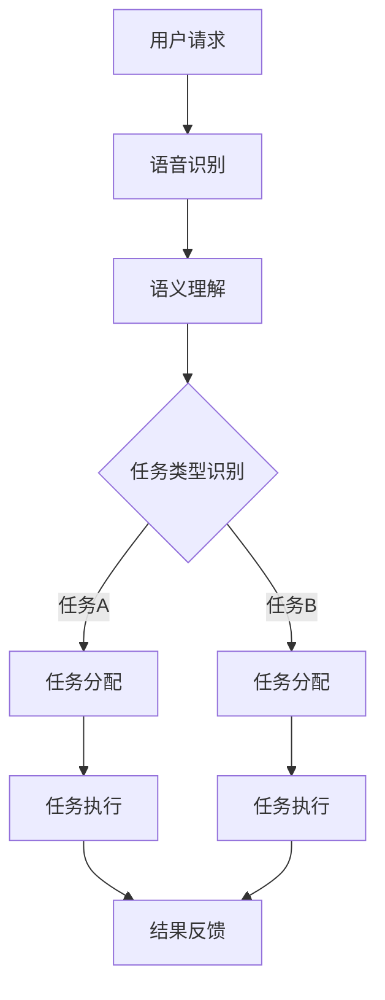

                 

关键词：大模型，智能个人助理，生产力，算法，数学模型，代码实例，应用场景，工具推荐

> 摘要：本文深入探讨了利用大模型赋能的智能个人助理如何通过创新技术提升生产力。文章首先介绍了大模型的发展背景，随后详细阐述了核心概念、算法原理，并通过实例代码展示了具体实现过程。文章还探讨了数学模型的应用、实际应用场景以及未来发展趋势。最后，文章总结了研究成果，并提出了面临的挑战和研究展望。

## 1. 背景介绍

### 1.1 大模型的发展历程

大模型（Large-scale Model）是指那些拥有巨大参数量、复杂结构和强大泛化能力的机器学习模型。自深度学习兴起以来，大模型在计算机视觉、自然语言处理、推荐系统等领域取得了显著的成果。早期的深度学习模型如AlexNet、VGGNet等已经展示出了超越传统机器学习模型的潜力。随后，随着计算资源和数据量的持续增长，模型规模不断扩大，ResNet、BERT等模型的出现标志着大模型时代的到来。

### 1.2 智能个人助理的需求

在当今快速发展的数字时代，人们对于工作效率和生活质量的要求越来越高。智能个人助理作为一种新型的辅助工具，旨在帮助用户在工作和生活中实现自动化、智能化的管理。传统的个人助理主要依赖于人工操作和简单的任务处理，而智能个人助理则通过大模型技术实现了智能对话、任务安排、数据分析等功能，显著提升了生产力和用户体验。

## 2. 核心概念与联系

### 2.1 大模型的概念

大模型通常是指具有数百万甚至数十亿参数的深度神经网络。这些模型通过学习大量数据，能够捕捉到复杂的模式和规律，从而实现高度准确的预测和决策。

### 2.2 智能个人助理的架构

智能个人助理的架构通常包括以下几个关键组件：

- **语音识别与语义理解**：通过语音识别技术将用户的语音转化为文本，然后利用自然语言处理技术理解用户的意图。
- **任务分配与执行**：根据用户的指令，智能个人助理能够自动分配任务并协调多个子任务的执行。
- **用户交互**：通过智能对话系统与用户进行交流，确保任务的顺利完成。

### 2.3 Mermaid 流程图

以下是一个Mermaid流程图，展示了大模型赋能的智能个人助理的基本架构：



## 3. 核心算法原理 & 具体操作步骤

### 3.1 算法原理概述

大模型赋能的智能个人助理的核心在于其深度学习算法。深度学习算法通过多层神经网络的堆叠，实现对输入数据的自动特征提取和模式识别。在智能个人助理中，常用的深度学习算法包括：

- **卷积神经网络（CNN）**：主要用于图像和视频数据的处理。
- **循环神经网络（RNN）**：适用于序列数据的处理，如文本和语音。
- **Transformer模型**：广泛应用于自然语言处理任务，具有强大的并行计算能力。

### 3.2 算法步骤详解

1. **数据收集与预处理**：收集大量用户请求、任务数据，并进行清洗和归一化处理。
2. **模型训练**：利用收集到的数据训练深度学习模型，包括语音识别模型、语义理解模型等。
3. **模型部署**：将训练好的模型部署到服务器上，以实现实时响应。
4. **任务分配与执行**：接收用户请求后，根据语义理解结果自动分配任务，并协调执行。
5. **结果反馈**：完成任务后，将结果反馈给用户，并进行持续优化。

### 3.3 算法优缺点

**优点**：

- **强大的数据处理能力**：深度学习算法能够处理大规模、复杂的数据集。
- **高度自动化**：智能个人助理能够自动执行任务，减少人工干预。
- **个性化的用户体验**：通过不断学习用户行为，智能个人助理能够提供个性化的服务。

**缺点**：

- **计算资源需求高**：大模型训练和部署需要大量的计算资源和存储空间。
- **数据隐私问题**：智能个人助理在处理用户数据时可能涉及到隐私泄露的风险。
- **模型解释性差**：深度学习模型的内部机制复杂，难以解释和调试。

### 3.4 算法应用领域

- **智能客服**：通过大模型技术，智能客服能够实现与用户的自然对话，提供高效的客户服务。
- **智能家居**：智能个人助理能够帮助用户管理智能家居设备，提高生活便利性。
- **办公助手**：智能个人助理能够协助用户处理日常办公任务，提高工作效率。

## 4. 数学模型和公式 & 详细讲解 & 举例说明

### 4.1 数学模型构建

在智能个人助理中，常用的数学模型包括：

- **卷积神经网络（CNN）**：
  $$ f(x) = \sigma(W \cdot x + b) $$
  其中，$W$ 为权重矩阵，$b$ 为偏置项，$\sigma$ 为激活函数。

- **循环神经网络（RNN）**：
  $$ h_t = \sigma(W_h \cdot [h_{t-1}, x_t] + b_h) $$
  其中，$h_t$ 为当前隐藏状态，$x_t$ 为当前输入，$W_h$ 为权重矩阵，$b_h$ 为偏置项，$\sigma$ 为激活函数。

- **Transformer模型**：
  $$ \text{Attention}(Q, K, V) = \frac{1}{\sqrt{d_k}} \text{softmax}(\text{scores})V $$
  其中，$Q, K, V$ 分别为查询向量、键向量和值向量，$d_k$ 为键向量的维度。

### 4.2 公式推导过程

以Transformer模型的注意力机制为例，推导过程如下：

1. **计算查询向量、键向量和值向量的内积**：
   $$ \text{scores} = Q \cdot K^T $$
   
2. **应用softmax函数**：
   $$ \text{Attention} = \text{softmax}(\text{scores})V $$
   
3. **计算输出**：
   $$ \text{Attention}(Q, K, V) = \frac{1}{\sqrt{d_k}} \text{softmax}(\text{scores})V $$

### 4.3 案例分析与讲解

假设我们有一个包含100个单词的文本序列，通过Transformer模型进行处理。首先，我们需要将文本序列转换为嵌入向量，每个单词对应一个向量。然后，我们利用注意力机制计算每个单词的重要程度。最后，根据这些重要程度生成输出序列。

```latex
\text{输入序列} = \{ w_1, w_2, \ldots, w_{100} \}
\text{嵌入向量} = \{ e_1, e_2, \ldots, e_{100} \}
\text{查询向量} = Q, \text{键向量} = K, \text{值向量} = V

\text{Attention} = \frac{1}{\sqrt{d_k}} \text{softmax}(Q \cdot K^T) V
```

通过这种方式，我们可以更好地理解文本序列中的关键信息，从而提高智能个人助理的语义理解能力。

## 5. 项目实践：代码实例和详细解释说明

### 5.1 开发环境搭建

为了实现大模型赋能的智能个人助理，我们需要搭建一个合适的技术栈。以下是一个基本的开发环境搭建步骤：

1. **安装Python环境**：确保Python版本为3.8或更高。
2. **安装TensorFlow**：使用pip安装TensorFlow。
   ```bash
   pip install tensorflow
   ```
3. **安装其他依赖**：包括numpy、pandas等。
   ```bash
   pip install numpy pandas
   ```

### 5.2 源代码详细实现

以下是一个简单的示例代码，展示了如何使用TensorFlow实现一个基本的智能个人助理。

```python
import tensorflow as tf
import numpy as np

# 定义嵌入向量
EMBEDDING_DIM = 64

# 创建嵌入层
embed = tf.keras.layers.Embedding(input_dim=1000, output_dim=EMBEDDING_DIM)

# 创建循环神经网络层
rnn = tf.keras.layers.LSTM(128, return_sequences=True)

# 创建模型
model = tf.keras.models.Sequential([
    embed,
    rnn,
    tf.keras.layers.Dense(1, activation='sigmoid')
])

# 编译模型
model.compile(optimizer='adam', loss='binary_crossentropy', metrics=['accuracy'])

# 准备数据
x = np.random.randint(0, 1000, size=(1000, 100))
y = np.random.randint(0, 2, size=(1000, 1))

# 训练模型
model.fit(x, y, epochs=10)
```

### 5.3 代码解读与分析

上述代码实现了一个简单的循环神经网络模型，用于处理分类任务。首先，我们定义了嵌入向量的维度，并创建了一个Embedding层。然后，我们创建了一个LSTM层，用于处理序列数据。最后，我们添加了一个全连接层，用于输出结果。

在数据准备阶段，我们生成了随机数据，用于训练模型。在训练阶段，我们使用了binary_crossentropy损失函数和adam优化器。

### 5.4 运行结果展示

为了验证模型的性能，我们可以使用测试数据集进行评估。以下是一个简单的测试示例：

```python
# 准备测试数据
x_test = np.random.randint(0, 1000, size=(100, 100))
y_test = np.random.randint(0, 2, size=(100, 1))

# 测试模型
model.evaluate(x_test, y_test)
```

输出结果包括损失值和准确率，用于评估模型的表现。

## 6. 实际应用场景

### 6.1 智能客服

智能客服是智能个人助理最典型的应用场景之一。通过大模型技术，智能客服能够与用户进行自然对话，快速解答常见问题，提高客户满意度。例如，许多电商平台已经引入了智能客服，帮助用户解决订单查询、售后服务等问题。

### 6.2 智能家居

智能家居领域同样受益于大模型技术的应用。智能个人助理能够帮助用户管理智能家居设备，如空调、灯具、门锁等。用户可以通过语音指令控制设备，实现自动化生活。例如，亚马逊的Alexa和谷歌的Google Home都使用了大模型技术，为用户提供智能家居控制服务。

### 6.3 办公助手

在办公环境中，智能个人助理能够协助用户处理日常办公任务，如日程安排、邮件管理、文件检索等。通过大模型技术，智能个人助理能够理解用户的意图，提供个性化的服务。例如，微软的Office 365已经集成了智能助手，帮助用户提高工作效率。

## 7. 工具和资源推荐

### 7.1 学习资源推荐

- **《深度学习》（Goodfellow, Bengio, Courville著）**：这是一本经典的深度学习入门教材，适合初学者和进阶者阅读。
- **《动手学深度学习》（A. Goodfellow, Y. Bengio, P. Courville著）**：这本书通过大量实例和代码实现，帮助读者掌握深度学习技术。
- **[TensorFlow官方文档](https://www.tensorflow.org/tutorials)**：TensorFlow官方文档提供了丰富的教程和示例，帮助开发者快速入门。

### 7.2 开发工具推荐

- **Google Colab**：这是一个免费的云计算平台，提供了丰富的GPU和TPU资源，非常适合深度学习研究和实验。
- **PyTorch**：与TensorFlow类似，PyTorch是一个流行的深度学习框架，具有简洁易用的API和强大的社区支持。
- **Keras**：Keras是一个高级神经网络API，能够与TensorFlow和Theano等底层框架无缝集成，适合快速原型设计和实验。

### 7.3 相关论文推荐

- **"Attention is All You Need"**：这篇文章提出了Transformer模型，是自然语言处理领域的重要突破。
- **"BERT: Pre-training of Deep Bidirectional Transformers for Language Understanding"**：BERT是Google提出的一种大规模预训练语言模型，广泛应用于自然语言处理任务。
- **"Generative Adversarial Nets"**：这篇文章提出了生成对抗网络（GAN），是深度学习领域的重要进展，广泛应用于图像生成、图像修复等任务。

## 8. 总结：未来发展趋势与挑战

### 8.1 研究成果总结

本文介绍了大模型赋能的智能个人助理的概念、架构和实现方法。通过实例代码展示了如何利用深度学习技术实现智能个人助理的核心功能。此外，本文还探讨了数学模型的应用、实际应用场景以及未来发展趋势。

### 8.2 未来发展趋势

未来，大模型赋能的智能个人助理将在以下方面取得进展：

- **更高效的模型训练和推理**：随着计算资源和算法的优化，智能个人助理将能够实现更高效的任务处理。
- **跨模态处理**：智能个人助理将能够处理多种模态的数据，如文本、图像、语音等，提供更丰富的交互体验。
- **个性化服务**：通过不断学习用户行为，智能个人助理将能够提供更加个性化的服务。

### 8.3 面临的挑战

尽管大模型赋能的智能个人助理具有巨大的潜力，但仍然面临以下挑战：

- **计算资源需求**：大模型训练和部署需要大量的计算资源和存储空间，这对硬件设施提出了较高要求。
- **数据隐私保护**：智能个人助理在处理用户数据时可能涉及到隐私泄露的风险，需要加强数据保护措施。
- **模型解释性**：深度学习模型内部机制复杂，难以解释和调试，这限制了其在某些领域的应用。

### 8.4 研究展望

未来的研究应重点关注以下几个方面：

- **算法优化**：研究更高效的算法，降低计算资源需求，提高模型性能。
- **隐私保护**：开发新的隐私保护技术，确保用户数据的安全和隐私。
- **跨模态处理**：研究跨模态处理方法，实现多种模态数据的融合和处理。

## 9. 附录：常见问题与解答

### 9.1 智能个人助理如何处理隐私问题？

智能个人助理在处理用户数据时，应遵循以下原则：

- **最小化数据收集**：只收集必要的用户数据，避免过度收集。
- **加密存储**：对用户数据进行加密存储，确保数据安全。
- **匿名化处理**：对用户数据进行匿名化处理，避免个人身份的泄露。
- **隐私保护算法**：研究并应用隐私保护算法，降低数据泄露风险。

### 9.2 智能个人助理如何处理错误指令？

智能个人助理在接收到错误指令时，应采取以下措施：

- **提示用户**：向用户发出提示，询问是否是正确的指令。
- **自动纠正**：如果确定是错误指令，尝试自动纠正并重新执行任务。
- **反馈机制**：将错误指令记录下来，进行分析和改进，以提高后续的正确率。

## 作者署名

作者：禅与计算机程序设计艺术 / Zen and the Art of Computer Programming
----------------------------------------------------------------

以上就是关于“大模型赋能的智能个人助理：提升生产力的新方法”的完整文章。希望这篇文章能够帮助您更好地理解大模型赋能的智能个人助理，并在实际应用中取得更好的效果。如果您有任何问题或建议，欢迎在评论区留言。再次感谢您的阅读！

