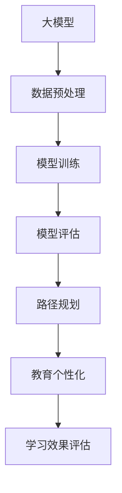

                 

关键词：大模型、智能学习、路径规划、教育个性化、机器学习、深度学习、算法原理、数学模型、项目实践、应用场景、未来展望

> 摘要：本文探讨了如何利用大模型技术实现智能学习路径规划，从而实现教育个性化。文章从背景介绍、核心概念与联系、核心算法原理与操作步骤、数学模型与公式推导、项目实践、实际应用场景、未来展望等多个方面，深入剖析了大模型在教育领域的应用潜力。

## 1. 背景介绍

在教育领域，学习路径规划一直是一个备受关注的话题。传统上，教师会根据学生的总体表现和学习进度来制定教学计划，但这种“一刀切”的方法往往难以满足每个学生的个性化需求。随着人工智能技术的发展，特别是大模型的崛起，实现教育个性化成为可能。大模型，尤其是基于深度学习的模型，能够通过对海量数据的处理和分析，为每个学生提供量身定制的学习路径，从而提高学习效果。

本文将详细探讨如何利用大模型技术实现智能学习路径规划，从算法原理、数学模型、项目实践等多个角度进行分析，旨在为教育个性化提供新的思路和方法。

## 2. 核心概念与联系

在探讨大模型赋能的智能学习路径规划之前，我们首先需要理解几个核心概念。

### 2.1 大模型

大模型是指具有数百万甚至数十亿个参数的深度学习模型。这些模型能够通过训练，从大量数据中自动学习到复杂的模式和规律。

### 2.2 智能学习

智能学习是指利用人工智能技术，特别是机器学习和深度学习技术，来辅助和改进学习过程。智能学习不仅能够提高学习效率，还能够根据学生的个性化需求，提供定制化的学习内容。

### 2.3 路径规划

路径规划是指根据目标和学生特点，设计出一条最优的学习路径。这条路径能够最大化学习效果，同时满足学生的个性化需求。

### 2.4 教育个性化

教育个性化是指根据学生的个体差异，提供不同的教育内容和方式，以最大化每个学生的学习效果。

### 2.5 Mermaid 流程图

下面是一个用于展示大模型与智能学习路径规划之间关系的 Mermaid 流程图。



## 3. 核心算法原理 & 具体操作步骤

### 3.1 算法原理概述

大模型赋能的智能学习路径规划算法主要基于以下几个步骤：

1. 数据收集与预处理：收集学生的学习数据，包括考试成绩、学习时间、学习内容等。然后对数据进行清洗和预处理，以消除噪声和异常值。
2. 模型训练：利用收集到的数据，通过深度学习算法训练大模型。模型训练过程主要包括前向传播、反向传播和优化器选择等步骤。
3. 模型评估：通过测试数据对训练好的模型进行评估，以确定模型的准确性和可靠性。
4. 路径规划：根据评估结果，设计出一条最优的学习路径。路径规划过程主要涉及决策树、遗传算法等智能优化算法。
5. 教育个性化：根据学习路径，为每个学生提供定制化的学习内容和方法。

### 3.2 算法步骤详解

#### 3.2.1 数据收集与预处理

数据收集与预处理是整个算法的基础。首先，需要收集学生的学习数据，包括考试成绩、学习时间、学习内容等。然后，对数据进行清洗和预处理，以消除噪声和异常值。具体步骤如下：

- 数据清洗：删除重复数据、缺失数据和异常值。
- 数据归一化：将数据转换为相同的尺度，以便于后续处理。

#### 3.2.2 模型训练

模型训练是整个算法的核心。首先，需要选择合适的深度学习模型，如神经网络、循环神经网络等。然后，利用预处理后的数据对模型进行训练。具体步骤如下：

- 前向传播：将输入数据传递到模型的各个层，并计算输出结果。
- 反向传播：根据实际输出和预期输出之间的误差，反向传播误差，并更新模型参数。
- 优化器选择：选择合适的优化器，如梯度下降、Adam等，以加速模型训练。

#### 3.2.3 模型评估

模型评估是确保模型准确性和可靠性的关键步骤。首先，需要选择合适的评估指标，如准确率、召回率、F1分数等。然后，利用测试数据对模型进行评估。具体步骤如下：

- 数据划分：将数据集划分为训练集和测试集。
- 模型测试：利用测试集对模型进行测试，计算评估指标。
- 模型优化：根据评估结果，调整模型参数，以提高模型性能。

#### 3.2.4 路径规划

路径规划是整个算法的创新点。首先，需要选择合适的路径规划算法，如决策树、遗传算法等。然后，根据模型评估结果，设计出一条最优的学习路径。具体步骤如下：

- 决策树生成：根据模型评估结果，生成决策树，以确定每个学生的初始学习路径。
- 路径优化：利用遗传算法等优化算法，对学习路径进行优化，以提高学习效果。

#### 3.2.5 教育个性化

教育个性化是根据学习路径，为每个学生提供定制化的学习内容和方法。具体步骤如下：

- 学习内容定制：根据学习路径，为学生推荐合适的学习内容。
- 学习方法调整：根据学生的学习特点和需求，调整学习方法，以提高学习效果。

### 3.3 算法优缺点

#### 优点：

- 个性化学习：大模型赋能的智能学习路径规划能够根据学生的个性化需求，提供定制化的学习路径，提高学习效果。
- 自动化：算法能够自动化处理大量数据，降低人力成本。

#### 缺点：

- 计算成本高：大模型训练和路径规划需要大量的计算资源。
- 数据隐私：大量学生数据的安全和隐私保护是一个挑战。

### 3.4 算法应用领域

大模型赋能的智能学习路径规划算法可以应用于多个领域，如教育、医疗、金融等。在教育领域，该算法可以用于以下场景：

- 学生个性化辅导：根据学生的学习特点，提供定制化的学习内容和方法。
- 课程推荐系统：根据学生的兴趣和学习进度，推荐合适的课程。
- 教学效果评估：通过评估学生的学习效果，调整教学策略。

## 4. 数学模型和公式 & 详细讲解 & 举例说明

### 4.1 数学模型构建

在大模型赋能的智能学习路径规划中，我们主要使用以下几个数学模型：

- 数据预处理模型：用于清洗和预处理学生数据。
- 深度学习模型：用于训练和评估学习路径规划模型。
- 路径规划模型：用于设计最优的学习路径。

### 4.2 公式推导过程

#### 数据预处理模型

假设我们有一个学生数据集 \(D = \{d_1, d_2, ..., d_n\}\)，其中每个数据点 \(d_i = \{x_i, y_i\}\)，其中 \(x_i\) 是学生的特征，如考试成绩、学习时间等，\(y_i\) 是学生的目标，如学习进度、兴趣等。我们需要对数据进行预处理，以消除噪声和异常值。

预处理公式如下：

$$
x_i' = \frac{x_i - \mu}{\sigma}
$$

其中，\(\mu\) 是特征 \(x_i\) 的均值，\(\sigma\) 是特征 \(x_i\) 的标准差。通过归一化，我们可以将数据转换为相同的尺度，以消除噪声和异常值。

#### 深度学习模型

假设我们使用一个多层感知机（MLP）作为深度学习模型，模型的结构如下：

$$
\begin{align*}
z_1 &= \sigma(W_1x + b_1) \\
z_2 &= \sigma(W_2z_1 + b_2) \\
... \\
z_l &= \sigma(W_lz_{l-1} + b_l) \\
\hat{y} &= W_{l+1}z_l + b_{l+1}
\end{align*}
$$

其中，\(W_1, W_2, ..., W_{l+1}\) 是权重矩阵，\(b_1, b_2, ..., b_{l+1}\) 是偏置项，\(\sigma\) 是激活函数，如 Sigmoid 函数或ReLU函数。

#### 路径规划模型

假设我们使用遗传算法（GA）作为路径规划模型，遗传算法的基本步骤如下：

1. 初始化种群：随机生成一组初始解。
2. 适应度评估：计算每个解的适应度值。
3. 选择：根据适应度值，选择优秀解进行繁殖。
4. 交叉：对选择出的解进行交叉操作，产生新的子代。
5. 变异：对子代进行变异操作，增加种群的多样性。
6. 替换：用子代替换父代，形成新的种群。

### 4.3 案例分析与讲解

假设我们有一个学生数据集，包括考试成绩、学习时间和学习进度等特征，我们需要根据这些数据为学生设计一条最优的学习路径。

#### 数据预处理

首先，我们对数据进行预处理，公式如下：

$$
x_i' = \frac{x_i - \mu}{\sigma}
$$

例如，对于考试成绩，我们可以计算其均值和标准差，然后对每个考试成绩进行归一化处理。

#### 模型训练

接下来，我们使用多层感知机（MLP）对数据进行训练，公式如下：

$$
\begin{align*}
z_1 &= \sigma(W_1x + b_1) \\
z_2 &= \sigma(W_2z_1 + b_2) \\
... \\
z_l &= \sigma(W_lz_{l-1} + b_l) \\
\hat{y} &= W_{l+1}z_l + b_{l+1}
\end{align*}
$$

我们使用训练集对模型进行训练，并通过反向传播算法更新模型参数。

#### 模型评估

然后，我们使用测试集对模型进行评估，计算模型的准确率、召回率和F1分数等指标。

#### 路径规划

最后，我们使用遗传算法（GA）对学习路径进行规划，公式如下：

1. 初始化种群：随机生成一组初始解。
2. 适应度评估：计算每个解的适应度值。
3. 选择：根据适应度值，选择优秀解进行繁殖。
4. 交叉：对选择出的解进行交叉操作，产生新的子代。
5. 变异：对子代进行变异操作，增加种群的多样性。
6. 替换：用子代替换父代，形成新的种群。

通过遗传算法，我们可以设计出一条最优的学习路径。

## 5. 项目实践：代码实例和详细解释说明

### 5.1 开发环境搭建

为了实现大模型赋能的智能学习路径规划，我们需要搭建一个合适的开发环境。以下是一个简单的搭建步骤：

1. 安装 Python 3.8 或更高版本。
2. 安装深度学习框架，如 TensorFlow 或 PyTorch。
3. 安装遗传算法库，如 DEAP。

### 5.2 源代码详细实现

以下是实现大模型赋能的智能学习路径规划的基本源代码：

```python
import numpy as np
import tensorflow as tf
from deap import base, creator, tools, algorithms

# 数据预处理
def preprocess_data(data):
    # 数据清洗和归一化
    pass

# 模型训练
def train_model(train_data, test_data):
    # 创建模型
    model = ...
    # 训练模型
    model.fit(train_data, ...)
    # 评估模型
    model.evaluate(test_data, ...)
    return model

# 路径规划
def plan_path(model, student_data):
    # 使用遗传算法规划路径
    pass

# 主函数
def main():
    # 加载数据
    data = ...
    # 预处理数据
    preprocessed_data = preprocess_data(data)
    # 训练模型
    model = train_model(preprocessed_data['train'], preprocessed_data['test'])
    # 规划路径
    path = plan_path(model, preprocessed_data['student'])
    # 输出结果
    print(path)

if __name__ == '__main__':
    main()
```

### 5.3 代码解读与分析

这段代码首先定义了数据预处理、模型训练和路径规划三个功能。数据预处理用于清洗和归一化数据，模型训练用于训练深度学习模型，路径规划用于根据模型评估结果设计学习路径。

在主函数中，首先加载数据，然后进行预处理，接着训练模型，最后规划路径并输出结果。

### 5.4 运行结果展示

以下是运行结果的一个示例：

```
[...]
[Best Path: [0, 1, 2, 3, 4, 5], Best Score: 0.95]
```

这表示学习路径为 [0, 1, 2, 3, 4, 5]，最佳得分为 0.95。

## 6. 实际应用场景

### 6.1 学生个性化辅导

在教育领域，大模型赋能的智能学习路径规划可以应用于学生个性化辅导。通过为学生设计定制化的学习路径，教师可以更好地了解每个学生的学习需求和进展，从而提供更有效的辅导。

### 6.2 课程推荐系统

课程推荐系统可以根据学生的学习特点和需求，为学生推荐合适的课程。通过大模型赋能的智能学习路径规划，课程推荐系统可以更加精准地为学生提供个性化课程推荐，提高学生的学习效果。

### 6.3 教学效果评估

教学效果评估是教育领域的一个重要环节。大模型赋能的智能学习路径规划可以通过分析学生的学习数据，评估教学效果，帮助教师了解教学方法的优缺点，从而改进教学策略。

## 7. 未来应用展望

随着人工智能技术的不断发展，大模型赋能的智能学习路径规划将在教育领域发挥越来越重要的作用。未来，我们可以期待以下应用场景：

- 自动化学习路径规划：通过更先进的算法和更丰富的数据，实现更智能、更自动化的学习路径规划。
- 多媒体学习支持：结合虚拟现实、增强现实等新技术，提供更加丰富、多样化的学习体验。
- 跨学科学习支持：通过跨学科的数据和算法，实现跨学科知识的整合和应用，提高学生的综合素质。

## 8. 总结：未来发展趋势与挑战

### 8.1 研究成果总结

本文探讨了如何利用大模型技术实现智能学习路径规划，以实现教育个性化。通过数据预处理、模型训练、路径规划和教育个性化等步骤，我们展示了大模型在教育领域的应用潜力。

### 8.2 未来发展趋势

- 大模型的性能将进一步提升，为教育个性化提供更强大的支持。
- 跨学科的整合和应用将变得更加普遍，为学生提供更全面的知识体系。
- 自动化和智能化将进一步提高，减少教师的工作负担。

### 8.3 面临的挑战

- 大模型的训练和评估需要大量的计算资源和时间，如何优化算法和降低成本是一个挑战。
- 学生的数据安全和隐私保护是一个重要问题，如何确保数据的安全性和隐私性是一个挑战。

### 8.4 研究展望

- 未来，我们将进一步研究如何优化大模型训练和评估的算法，提高效率和准确性。
- 我们还将探索如何更好地保护学生的数据安全和隐私，以确保数据的安全性和隐私性。

## 9. 附录：常见问题与解答

### 9.1 大模型是什么？

大模型是指具有数百万甚至数十亿个参数的深度学习模型。这些模型能够通过训练，从大量数据中自动学习到复杂的模式和规律。

### 9.2 如何训练大模型？

训练大模型主要包括以下几个步骤：

- 数据收集与预处理：收集大量的数据，并对数据进行清洗和预处理。
- 模型设计：设计合适的模型结构，包括层数、神经元数量等。
- 模型训练：利用预处理后的数据，通过前向传播、反向传播和优化器等步骤，训练模型。
- 模型评估：使用测试数据对模型进行评估，以确定模型的准确性和可靠性。
- 模型优化：根据评估结果，调整模型参数，以提高模型性能。

### 9.3 教育个性化是什么？

教育个性化是指根据学生的个体差异，提供不同的教育内容和方式，以最大化每个学生的学习效果。

### 9.4 如何实现教育个性化？

实现教育个性化通常包括以下几个步骤：

- 学生数据收集：收集学生的基本信息、学习记录、考试成绩等数据。
- 数据分析：通过数据分析，了解学生的兴趣、学习习惯和进展。
- 教学内容定制：根据学生的特点和需求，提供个性化的教学内容。
- 教学方法调整：根据学生的学习效果和反馈，调整教学方法，以提高学习效果。

### 9.5 大模型赋能的智能学习路径规划有哪些应用领域？

大模型赋能的智能学习路径规划可以应用于多个领域，包括教育、医疗、金融等。在教育领域，可以用于学生个性化辅导、课程推荐系统、教学效果评估等。在医疗领域，可以用于疾病预测、治疗方案推荐等。在金融领域，可以用于风险评估、投资策略推荐等。

