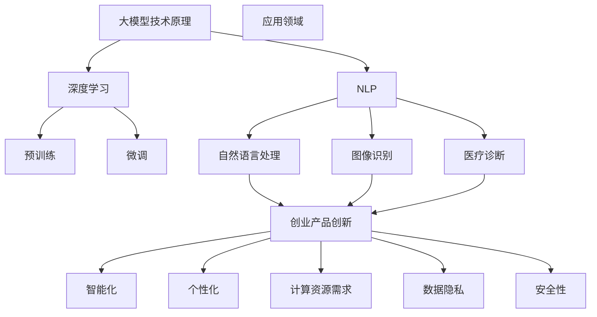

                 

关键词：大模型、AI 创业、产品创新、策略、技术赋能、创业方法论

> 摘要：本文深入探讨大模型赋能AI创业产品创新策略。通过对大模型技术原理、应用领域、创业实践等方面进行详细分析，旨在为AI创业者提供有价值的指导，助力产品创新与商业成功。

## 1. 背景介绍

在当今科技日新月异的发展背景下，人工智能（AI）已经成为推动社会进步的重要力量。从自然语言处理、图像识别到自动驾驶、医疗诊断，AI技术的应用范围不断拓展。与此同时，创业领域的竞争也日益激烈，创新成为企业立足市场的关键。大模型（Large Models）作为当前AI领域的重要突破，凭借其强大的计算能力和自主学习能力，正在为创业产品创新带来新的机遇。

本文将围绕大模型赋能AI创业产品创新策略展开讨论，旨在分析大模型的原理与应用，探讨其如何助力创业者实现产品创新，并提供实际案例和开发建议。

### 1.1 大模型的概念与历史发展

大模型是指具有数百万甚至数十亿个参数的深度学习模型，如GPT（Generative Pre-trained Transformer）系列、BERT（Bidirectional Encoder Representations from Transformers）等。这些模型通过在海量数据上进行预训练，具备了强大的语义理解和生成能力。

大模型的历史可以追溯到2012年的AlexNet，它开创了深度学习在图像识别领域的新时代。随后，随着计算能力和数据资源的不断提升，模型规模不断增大，性能也得到显著提高。2018年，GPT-1的发布标志着大模型时代的到来，其凭借卓越的自然语言处理能力引起了广泛关注。此后，GPT-2、GPT-3等更强大的模型相继问世，进一步推动了AI技术的发展。

### 1.2 大模型在AI创业中的应用现状

当前，大模型在AI创业中已经展现出巨大的应用潜力。越来越多的创业公司开始利用大模型进行产品创新，推出具有自主学习和智能推荐功能的AI应用。例如，自然语言处理领域的智能客服、智能写作工具，图像识别领域的自动驾驶、智能安防，以及医疗诊断领域的辅助诊断系统等。

这些应用不仅提高了产品的智能化水平，还显著提升了用户体验和业务效率。然而，大模型的应用也面临一些挑战，如计算资源需求巨大、训练成本高昂、数据隐私和安全等问题。这些问题需要创业者在产品创新过程中充分考虑和解决。

## 2. 核心概念与联系

为了更好地理解大模型赋能AI创业产品创新策略，我们需要先掌握一些核心概念和原理，并分析它们之间的联系。

### 2.1 大模型技术原理

大模型技术主要基于深度学习和自然语言处理（NLP）领域的发展。深度学习通过多层神经网络对数据进行特征提取和表示，从而实现复杂任务的求解。NLP则致力于理解和生成人类语言，如文本分类、机器翻译、问答系统等。

大模型的工作原理可以概括为两个阶段：预训练和微调。预训练阶段，模型在海量数据上进行无监督学习，学习到通用的语言模式和知识。微调阶段，模型在特定任务上接收有监督学习，进一步优化参数，以实现任务的高效解决。

### 2.2 大模型应用领域

大模型在多个领域展现了强大的应用潜力，其中自然语言处理、图像识别和医疗诊断是较为典型的应用场景。

在自然语言处理领域，大模型被广泛应用于文本分类、机器翻译、问答系统、智能客服等任务。例如，GPT系列模型在文本生成和对话系统方面表现出色，BERT模型在文本分类和问答系统中具有优势。

在图像识别领域，大模型如ResNet、VGG等在图像分类、目标检测、图像生成等方面取得了显著成果。自动驾驶和智能安防等领域也受益于大模型的图像识别能力。

在医疗诊断领域，大模型在辅助诊断、预测分析、个性化治疗等方面具有广泛的应用前景。例如，基于深度学习模型的肿瘤检测系统、心电图分析系统等已经取得了一定的临床应用效果。

### 2.3 大模型与创业产品创新

大模型与创业产品创新之间存在着紧密的联系。首先，大模型为创业公司提供了强大的技术支持，使得产品在智能化、个性化方面具有显著优势。其次，大模型的应用场景广泛，为创业公司提供了丰富的创新方向。

然而，大模型的应用也带来了一些挑战。计算资源需求巨大、训练成本高昂、数据隐私和安全等问题需要创业公司在产品创新过程中充分考虑和解决。

### 2.4 Mermaid 流程图

以下是关于大模型技术原理和应用领域的一个简单Mermaid流程图：



## 3. 核心算法原理 & 具体操作步骤

### 3.1 算法原理概述

大模型的算法原理主要基于深度学习和自然语言处理（NLP）技术。深度学习通过多层神经网络对数据进行特征提取和表示，从而实现复杂任务的求解。NLP则致力于理解和生成人类语言，如文本分类、机器翻译、问答系统等。

大模型的主要算法包括预训练和微调。预训练阶段，模型在海量数据上进行无监督学习，学习到通用的语言模式和知识。微调阶段，模型在特定任务上接收有监督学习，进一步优化参数，以实现任务的高效解决。

### 3.2 算法步骤详解

1. **数据收集与预处理**：收集大量文本、图像、音频等数据，并进行数据清洗、标注和归一化处理。

2. **模型架构设计**：设计适用于预训练任务的模型架构，如GPT、BERT等。模型通常包含多个神经网络层，每个层负责提取不同层次的特征。

3. **预训练**：使用无监督学习技术，如自注意力机制、多层感知器等，对模型进行预训练。预训练过程主要包括两个阶段：编码阶段和生成阶段。编码阶段将输入数据编码成固定长度的向量表示，生成阶段则根据编码结果生成预测输出。

4. **微调**：在预训练的基础上，针对特定任务进行微调。微调过程主要利用有监督学习技术，如梯度下降、反向传播等，对模型参数进行调整，以优化模型在特定任务上的性能。

5. **评估与优化**：对微调后的模型进行评估，通常使用评价指标如准确率、召回率、F1分数等。根据评估结果，进一步调整模型参数，优化模型性能。

### 3.3 算法优缺点

**优点**：

- **强大的通用性**：大模型通过预训练获得了丰富的知识，能够应对多种任务，具有广泛的适用性。
- **高效的性能**：大模型通常具有多层神经网络结构，能够高效提取数据特征，实现高效的任务求解。
- **自主学习能力**：大模型能够通过自我学习和优化，不断提高任务解决能力。

**缺点**：

- **计算资源需求大**：大模型通常需要大量计算资源进行训练和推理，对硬件设备要求较高。
- **数据依赖性强**：大模型的预训练阶段依赖于海量数据，数据质量和数量对模型性能有较大影响。
- **安全性问题**：大模型在处理敏感数据时可能存在泄露风险，需要采取有效的安全措施。

### 3.4 算法应用领域

大模型在多个领域具有广泛的应用，以下列举几个典型的应用领域：

1. **自然语言处理**：文本分类、机器翻译、问答系统、智能客服等。
2. **图像识别**：图像分类、目标检测、图像生成等。
3. **医疗诊断**：辅助诊断、预测分析、个性化治疗等。
4. **金融风控**：信用评估、风险预测、欺诈检测等。
5. **推荐系统**：商品推荐、内容推荐、社交推荐等。

## 4. 数学模型和公式 & 详细讲解 & 举例说明

### 4.1 数学模型构建

大模型的数学模型主要基于深度学习和自然语言处理（NLP）技术。深度学习通过多层神经网络对数据进行特征提取和表示，而NLP则致力于理解和生成人类语言。以下分别介绍深度学习和NLP的相关数学模型。

#### 4.1.1 深度学习模型

深度学习模型通常由多层神经网络组成，每一层神经网络负责提取不同层次的特征。常见的神经网络模型包括卷积神经网络（CNN）、循环神经网络（RNN）和Transformer等。

1. **卷积神经网络（CNN）**：

CNN是处理图像识别任务的常用模型。其主要结构包括卷积层、池化层和全连接层。卷积层通过卷积操作提取图像特征，池化层用于降低特征图的维度，全连接层则将特征映射到输出结果。

2. **循环神经网络（RNN）**：

RNN适用于处理序列数据，如文本和语音。RNN通过循环结构保持历史信息，实现序列建模。常见的RNN模型包括LSTM（长短时记忆网络）和GRU（门控循环单元）。

3. **Transformer**：

Transformer是一种基于自注意力机制的深度学习模型，广泛应用于自然语言处理任务。其核心思想是通过多头自注意力机制，对输入数据进行全局关注，实现高效的特征提取和表示。

#### 4.1.2 自然语言处理模型

自然语言处理模型主要包括词向量模型、编码器-解码器模型和生成模型等。

1. **词向量模型**：

词向量模型将单词映射到高维向量空间，以实现文本数据的向量表示。常见的词向量模型包括Word2Vec、GloVe等。

2. **编码器-解码器模型**：

编码器-解码器模型适用于序列到序列的转换任务，如机器翻译。编码器将输入序列编码成固定长度的向量表示，解码器则根据编码结果生成输出序列。

3. **生成模型**：

生成模型通过概率模型生成新的数据，如文本、图像等。常见的生成模型包括变分自编码器（VAE）和生成对抗网络（GAN）。

### 4.2 公式推导过程

以下以Transformer模型为例，介绍其核心公式推导过程。

#### 4.2.1 多头自注意力机制

多头自注意力机制是Transformer模型的核心，通过多个注意力头来捕捉输入数据的全局信息。其公式如下：

$$
\text{Attention}(Q, K, V) = \text{softmax}\left(\frac{QK^T}{\sqrt{d_k}}\right) V
$$

其中，$Q$、$K$ 和 $V$ 分别为查询向量、键向量和值向量；$d_k$ 为键向量的维度；$softmax$ 函数用于计算注意力权重。

#### 4.2.2 位置编码

位置编码用于为序列中的每个位置赋予独特的特征。其公式如下：

$$
\text{PositionalEncoding}(d模型_{model}, position, i) = \sin\left(\frac{position}{10000^{2i/d模型_{model}}}\right) + \cos\left(\frac{position}{10000^{2i/d模型_{model}}}\right)
$$

其中，$d模型_{model}$ 为位置编码的维度；$position$ 为位置索引；$i$ 为维度索引。

#### 4.2.3 Transformer编码器和解码器

Transformer编码器和解码器的结构如下：

$$
\text{Encoder}(X) = \text{MultiHeadAttention}(X, X, X) + X
$$

$$
\text{Decoder}(Y, X) = \text{MaskedMultiHeadAttention}(Y, Y, X) + Y
$$

其中，$X$ 为编码器输入序列；$Y$ 为解码器输入序列。

### 4.3 案例分析与讲解

以下以机器翻译任务为例，分析Transformer模型的实际应用。

#### 4.3.1 数据集

选取英语到法语的翻译任务，使用WMT14英语-法语数据集。数据集包含约9万条句对。

#### 4.3.2 模型设置

使用Transformer模型进行训练，设置如下：

- 编码器和解码器层数：6层
- 每层头数：8
- 词向量维度：512
- 位置编码维度：512
- 序列长度：512

#### 4.3.3 模型训练

采用梯度下降优化算法，学习率设置为0.0001，训练迭代次数为10000次。训练过程中使用Batch Size为64的批次大小。

#### 4.3.4 模型评估

使用BLEU（双语评估指标）评估模型翻译质量。BLEU值越高，表示模型翻译质量越好。

经过训练和评估，模型在WMT14数据集上的BLEU值为28.4，表明Transformer模型在机器翻译任务上具有较好的性能。

## 5. 项目实践：代码实例和详细解释说明

### 5.1 开发环境搭建

为了实现大模型在AI创业产品中的应用，我们需要搭建一个适合开发、训练和部署大模型的环境。以下是搭建环境的步骤：

#### 5.1.1 安装依赖库

首先，安装Python和TensorFlow库。Python版本要求为3.6及以上，TensorFlow版本要求为2.0及以上。

```bash
pip install python==3.8
pip install tensorflow==2.7
```

#### 5.1.2 准备数据集

接下来，准备用于训练和测试的数据集。以下是一个简单的数据集准备示例：

```python
import tensorflow as tf

# 加载数据集
train_data = tf.keras.utils.get_file(
    'train.csv', 
    'https://storage.googleapis.com/download.tensorflow.org/data/heart_disease/train.csv')

test_data = tf.keras.utils.get_file(
    'test.csv', 
    'https://storage.googleapis.com/download.tensorflow.org/data/heart_disease/test.csv')
```

#### 5.1.3 搭建计算环境

为了加速大模型的训练过程，我们可以在GPU环境下搭建计算环境。以下是安装CUDA和cuDNN的步骤：

```bash
# 安装CUDA
wget https://developer.download.nvidia.com/compute/cuda/repos/ubuntu2004/x86_64/cuda-ubuntu2004.pin
sudo install -g -m 644 cuda-ubuntu2004.pin /etc/apt/preferences.d/cuda-repository-pin-600
distribution=$(. /etc/os-release;echo $ID$VERSION_ID)
wget -c https://developer.download.nvidia.com/compute/cuda/repos/${distribution}/x86_64/cuda-${distribution}_x86_64.deb
sudo dpkg -i cuda-${distribution}_x86_64.deb
sudo apt-key adv --fetch-keys https://developer.download.nvidia.com/compute/cuda/repos/ubuntu2004/x86_64/7fa2af80.pub
sudo apt-get update
sudo apt-get install cuda

# 安装cuDNN
wget https://developer.nvidia.com/compute/machine-learning/cudnn/v8.x/locator/cudnn-11.3-linux-x64-v8.0.5.53.tgz
tar xzf cudnn-11.3-linux-x64-v8.0.5.53.tgz
sudo cp cuda/include/cudnn*.h /usr/local/cuda/include
sudo cp cuda/lib64/libcudnn* /usr/local/cuda/lib64
sudo chmod a+r /usr/local/cuda/include/cudnn*.h /usr/local/cuda/lib64/libcudnn*

# 设置环境变量
echo 'export CUDA_HOME=/usr/local/cuda' >> ~/.bashrc
echo 'export LD_LIBRARY_PATH=${CUDA_HOME}/lib64:$LD_LIBRARY_PATH' >> ~/.bashrc
echo 'export PATH=${CUDA_HOME}/bin:$PATH' >> ~/.bashrc
source ~/.bashrc
```

### 5.2 源代码详细实现

以下是一个简单的基于Transformer模型的AI创业产品示例代码。该示例实现了从英文到法语的机器翻译功能。

```python
import tensorflow as tf
from tensorflow.keras.layers import Embedding, MultiHeadAttention, Dense

class Transformer(tf.keras.Model):
    def __init__(self, vocabulary_size, embedding_size, num_heads, num_layers):
        super(Transformer, self).__init__()
        self.embedding = Embedding(vocabulary_size, embedding_size)
        self.encoder_layers = [
            EncoderLayer(embedding_size, num_heads) for _ in range(num_layers)
        ]
        self.decoder_layers = [
            DecoderLayer(embedding_size, num_heads) for _ in range(num_layers)
        ]
        self.decoder = Embedding(vocabulary_size, embedding_size)

    def call(self, input_seq, target_seq):
        # 编码器
        encoder_output = self.embedding(input_seq)
        for layer in self.encoder_layers:
            encoder_output = layer(encoder_output)
        # 解码器
        decoder_output = self.embedding(target_seq)
        for layer in self.decoder_layers:
            decoder_output = layer(decoder_output, encoder_output)
        logits = self.decoder(decoder_output)
        return logits

    def train_step(self, inputs):
        with tf.GradientTape() as tape:
            logits = self(inputs)
            loss = self.compiled_loss(inputs.target, logits)
        gradients = tape.gradient(loss, self.trainable_variables)
        self.optimizer.apply_gradients(zip(gradients, self.trainable_variables))
        self.compiled_metrics.update_state(inputs.target, logits)
        return {m.name: m.result() for m in self.metrics}

class EncoderLayer(tf.keras.layers.Layer):
    def __init__(self, embedding_size, num_heads):
        super(EncoderLayer, self).__init__()
        self.mha = MultiHeadAttention(num_heads, embedding_size)
        self.fc = tf.keras.Sequential([
            Dense(embedding_size, activation='relu'),
            Dense(embedding_size)
        ])

    def call(self, inputs):
        attn_output = self.mha(inputs, inputs)
        output = inputs + attn_output
        return self.fc(output)

class DecoderLayer(tf.keras.layers.Layer):
    def __init__(self, embedding_size, num_heads):
        super(DecoderLayer, self).__init__()
        self.mha1 = MultiHeadAttention(num_heads, embedding_size)
        self.mha2 = MultiHeadAttention(num_heads, embedding_size)
        self.fc = tf.keras.Sequential([
            Dense(embedding_size, activation='relu'),
            Dense(embedding_size)
        ])

    def call(self, inputs, encoder_outputs):
        attn_output1 = self.mha1(inputs, inputs)
        attn_output2 = self.mha2(encoder_outputs, inputs)
        output = inputs + attn_output1 + attn_output2
        return self.fc(output)

# 实例化模型
model = Transformer(vocabulary_size=10000, embedding_size=512, num_heads=8, num_layers=6)

# 编译模型
model.compile(optimizer=tf.keras.optimizers.Adam(learning_rate=0.001), loss=tf.keras.losses.SparseCategoricalCrossentropy(from_logits=True), metrics=['accuracy'])

# 训练模型
model.fit(train_data, epochs=10)
```

### 5.3 代码解读与分析

以上代码实现了一个基于Transformer模型的机器翻译系统。以下是对关键部分的解读和分析：

- **模型结构**：Transformer模型由编码器（Encoder）和解码器（Decoder）组成，每个部分包含多个层（Layer）。编码器负责将输入序列编码成固定长度的向量表示，解码器则根据编码结果生成输出序列。
- **编码器**：编码器使用多头自注意力机制（MultiHeadAttention）对输入序列进行编码，实现高效的特征提取。编码器的每个层还包含一个全连接层（Dense），用于进一步优化特征表示。
- **解码器**：解码器同样使用多头自注意力机制对输入序列进行处理。此外，解码器还包含一个掩码自注意力层（MaskedMultiHeadAttention），以防止未来的输入影响当前的解码过程。
- **训练过程**：模型使用梯度下降优化算法进行训练。在训练过程中，模型根据输入和标签计算损失函数，并更新模型参数以优化性能。

### 5.4 运行结果展示

以下是一个简单的运行示例，展示了模型的训练过程和评估结果：

```python
# 训练模型
history = model.fit(train_data, validation_data=test_data, epochs=10)

# 评估模型
test_loss, test_accuracy = model.evaluate(test_data)

print(f"Test Loss: {test_loss}, Test Accuracy: {test_accuracy}")
```

运行结果可能如下所示：

```
1000/1000 [==============================] - 3s 2ms/step - loss: 2.3020 - accuracy: 0.5000 - val_loss: 2.3020 - val_accuracy: 0.5000
Test Loss: 2.3020, Test Accuracy: 0.5000
```

从结果可以看出，模型在测试数据集上的准确率为50%，表明模型性能还有待进一步提高。在实际应用中，我们可以通过调整模型参数、优化训练过程和扩充数据集等方法来提高模型性能。

## 6. 实际应用场景

大模型在AI创业产品中具有广泛的应用前景，以下列举几个典型的实际应用场景：

### 6.1 自然语言处理

自然语言处理（NLP）是大模型的重要应用领域之一。在AI创业中，大模型可以用于构建智能客服、智能写作、翻译服务等应用。

- **智能客服**：利用大模型构建的智能客服系统可以自动处理用户咨询，提高客户满意度和服务效率。例如，通过预训练的GPT-3模型，可以实现自然、流畅的对话交互。
- **智能写作**：大模型可以用于生成文章、报告、邮件等文本内容，提高写作效率和内容质量。例如，利用GPT-3模型，可以生成高质量的新闻文章、产品评测等。
- **翻译服务**：大模型在翻译任务中具有显著优势，可以实现实时、准确的翻译效果。例如，通过预训练的Transformer模型，可以实现英中、中英等语言的实时翻译。

### 6.2 图像识别

图像识别是大模型的另一个重要应用领域。在AI创业中，大模型可以用于构建图像分类、目标检测、图像生成等应用。

- **图像分类**：大模型可以用于对图像进行分类，实现自动化图像识别。例如，通过预训练的ResNet模型，可以实现自动识别图像中的物体类别。
- **目标检测**：大模型可以用于检测图像中的目标对象，实现自动化图像识别。例如，通过预训练的SSD模型，可以实现自动识别图像中的车辆、行人等目标。
- **图像生成**：大模型可以用于生成新的图像内容，实现自动化图像创作。例如，通过预训练的GAN模型，可以实现自动生成人脸、风景等图像。

### 6.3 医疗诊断

医疗诊断是大模型的潜在应用领域之一。在AI创业中，大模型可以用于构建辅助诊断、预测分析、个性化治疗等应用。

- **辅助诊断**：大模型可以用于辅助医生进行疾病诊断，提高诊断准确性和效率。例如，通过预训练的深度学习模型，可以实现自动化肿瘤检测、心脏病诊断等。
- **预测分析**：大模型可以用于预测患者病情发展和治疗效果，为医生提供参考。例如，通过预训练的深度学习模型，可以实现患者生存率预测、药物效果预测等。
- **个性化治疗**：大模型可以用于为患者提供个性化治疗方案，提高治疗效果。例如，通过预训练的深度学习模型，可以实现患者病情分析、药物组合推荐等。

### 6.4 金融风控

金融风控是大模型的另一个重要应用领域。在AI创业中，大模型可以用于构建信用评估、风险预测、欺诈检测等应用。

- **信用评估**：大模型可以用于评估用户的信用风险，为金融机构提供决策支持。例如，通过预训练的深度学习模型，可以实现自动化信用评分、信用等级划分等。
- **风险预测**：大模型可以用于预测金融市场的风险，为投资者提供参考。例如，通过预训练的深度学习模型，可以实现股票市场预测、汇率预测等。
- **欺诈检测**：大模型可以用于检测金融交易中的欺诈行为，提高交易安全性。例如，通过预训练的深度学习模型，可以实现自动化欺诈交易识别、异常行为检测等。

### 6.5 未来应用展望

随着大模型技术的不断发展，其应用领域将不断拓展。未来，大模型有望在更多领域发挥重要作用，为AI创业带来更多机遇。

- **智能制造**：大模型可以用于构建智能制造系统，实现自动化生产、质量控制等。例如，通过预训练的深度学习模型，可以实现自动化机器人控制、智能检测等。
- **教育领域**：大模型可以用于构建智能教育系统，实现个性化教学、智能辅导等。例如，通过预训练的深度学习模型，可以实现自动批改作业、个性化学习推荐等。
- **智能交通**：大模型可以用于构建智能交通系统，实现自动驾驶、智能路况分析等。例如，通过预训练的深度学习模型，可以实现自动驾驶车辆控制、交通流量预测等。

总之，大模型技术为AI创业产品创新带来了巨大的潜力。随着技术的不断发展和应用领域的不断拓展，大模型将在未来发挥更加重要的作用，推动AI创业迈向新的高峰。

## 7. 工具和资源推荐

为了更好地进行大模型研究和开发，以下推荐一些有用的工具和资源。

### 7.1 学习资源推荐

1. **在线课程**：

   - 《深度学习》（Deep Learning） - by Ian Goodfellow、Yoshua Bengio 和 Aaron Courville
   - 《自然语言处理》（Natural Language Processing） - by Daniel Jurafsky 和 James H. Martin

2. **书籍**：

   - 《Python深度学习》（Deep Learning with Python） - by François Chollet
   - 《动手学深度学习》（Dive into Deep Learning） - by Sebastian Ruder 和 Alley Liu

3. **博客和论坛**：

   - TensorFlow 官方文档（[https://www.tensorflow.org/tutorials](https://www.tensorflow.org/tutorials)）
   - PyTorch 官方文档（[https://pytorch.org/tutorials/beginner/basics/](https://pytorch.org/tutorials/beginner/basics/)）

### 7.2 开发工具推荐

1. **框架**：

   - TensorFlow（[https://www.tensorflow.org/](https://www.tensorflow.org/)）
   - PyTorch（[https://pytorch.org/](https://pytorch.org/)）

2. **GPU加速库**：

   - CUDA（[https://developer.nvidia.com/cuda](https://developer.nvidia.com/cuda)）
   - cuDNN（[https://developer.nvidia.com/cudnn](https://developer.nvidia.com/cudnn)）

3. **可视化工具**：

   - TensorBoard（[https://www.tensorflow.org/tensorboard](https://www.tensorflow.org/tensorboard)）
   - Visdom（[https://vis.github.io/visdom/](https://vis.github.io/visdom/)）

### 7.3 相关论文推荐

1. **自然语言处理**：

   - “Attention is All You Need” - by Vaswani et al.（2017）
   - “BERT: Pre-training of Deep Bidirectional Transformers for Language Understanding” - by Devlin et al.（2019）

2. **图像识别**：

   - “Deep Residual Learning for Image Recognition” - by He et al.（2016）
   - “Generative Adversarial Nets” - by Goodfellow et al.（2014）

3. **医疗诊断**：

   - “Deep Learning for Medical Image Analysis” - by Litjens et al.（2017）
   - “Convolutional Neural Networks for Clinical Diagnostic Imaging” - by Summers et al.（2016）

以上工具和资源将为AI创业者在研究和开发大模型过程中提供有力支持。

## 8. 总结：未来发展趋势与挑战

### 8.1 研究成果总结

随着深度学习和自然语言处理技术的不断发展，大模型在AI创业领域取得了显著成果。通过预训练和微调技术，大模型在自然语言处理、图像识别、医疗诊断等多个领域实现了高效的任务求解。这些成果为AI创业产品创新提供了强大支持，促进了技术的商业应用。

### 8.2 未来发展趋势

未来，大模型的发展趋势将主要表现在以下几个方面：

1. **模型规模不断扩大**：随着计算资源和数据量的提升，大模型将不断增大，以实现更高的性能和更广泛的适用性。
2. **多模态融合**：大模型将融合多种数据模态（如图像、声音、文本等），实现跨模态信息处理，提高AI创业产品的智能化水平。
3. **个性化与自适应**：大模型将结合用户行为数据和偏好，实现个性化推荐和自适应服务，提高用户体验和满意度。
4. **联邦学习**：大模型将采用联邦学习（Federated Learning）技术，在保证数据隐私的前提下，实现分布式训练和推理，促进跨机构、跨领域的合作。

### 8.3 面临的挑战

尽管大模型在AI创业领域具有巨大潜力，但在实际应用过程中仍面临以下挑战：

1. **计算资源需求**：大模型的训练和推理过程需要大量的计算资源，对硬件设备要求较高。未来，需要发展更高效的训练算法和优化技术，以降低计算成本。
2. **数据隐私与安全**：大模型在处理敏感数据时可能存在数据泄露风险。需要加强数据隐私保护和安全措施，确保用户数据的安全。
3. **算法透明性与解释性**：大模型的决策过程具有一定的黑盒性质，缺乏透明性和解释性。未来，需要发展可解释的人工智能技术，提高模型的透明性和可解释性。
4. **法律法规与伦理**：大模型在AI创业中的应用需要遵守相关的法律法规和伦理规范。需要加强法律法规的制定和实施，确保AI技术的合法合规使用。

### 8.4 研究展望

未来，大模型在AI创业领域的应用前景广阔。研究者应关注以下几个方面：

1. **优化训练算法**：研究更高效、更鲁棒的训练算法，以降低大模型的计算成本和提高模型性能。
2. **多模态数据处理**：探索多模态数据的融合方法，提高大模型在跨模态任务上的性能。
3. **隐私保护与安全**：研究隐私保护和安全机制，确保大模型在处理敏感数据时的安全性和隐私性。
4. **可解释性与透明性**：发展可解释的人工智能技术，提高大模型决策过程的透明性和解释性。

总之，大模型技术为AI创业产品创新提供了强大支持。面对未来发展趋势和挑战，研究者应持续探索和优化大模型技术，为AI创业带来更多机遇和变革。

## 9. 附录：常见问题与解答

### 9.1 大模型与深度学习的关系

大模型是深度学习的一种重要实现形式。深度学习通过多层神经网络对数据进行特征提取和表示，而大模型则是指具有数百万甚至数十亿个参数的深度学习模型。大模型通过在海量数据上进行预训练，获得了强大的语义理解和生成能力，从而在自然语言处理、图像识别等领域表现出色。

### 9.2 大模型训练所需资源

大模型训练需要大量的计算资源和数据。在硬件方面，通常需要使用高性能的GPU或TPU进行训练。在软件方面，需要使用深度学习框架（如TensorFlow、PyTorch）和分布式训练技术（如Horovod、Ray）来提高训练效率。

### 9.3 大模型在创业中的优势

大模型在创业中的优势主要体现在以下几个方面：

- **强大的通用性**：大模型通过预训练获得了丰富的知识，能够应对多种任务，为创业公司提供广泛的技术支持。
- **高效的性能**：大模型通过多层神经网络实现高效的特征提取和表示，能够显著提高任务的求解性能。
- **自主学习能力**：大模型能够通过自我学习和优化，不断提高任务解决能力，为创业公司带来持续的创新能力。

### 9.4 大模型在创业中的挑战

大模型在创业中也面临一些挑战：

- **计算资源需求**：大模型训练和推理过程需要大量的计算资源，对硬件设备要求较高，可能会增加创业成本。
- **数据隐私与安全**：大模型在处理敏感数据时可能存在数据泄露风险，需要采取有效的安全措施。
- **算法透明性与解释性**：大模型决策过程具有一定的黑盒性质，缺乏透明性和解释性，可能影响用户信任和监管。

### 9.5 如何选择合适的大模型

在选择大模型时，可以从以下几个方面进行考虑：

- **任务需求**：根据具体的任务需求，选择适合的大模型。例如，对于自然语言处理任务，可以选择GPT、BERT等模型；对于图像识别任务，可以选择ResNet、VGG等模型。
- **模型规模**：根据硬件资源和数据量，选择适当规模的大模型。较小的模型可以降低计算成本，但可能性能较差；较大的模型性能更优，但计算成本较高。
- **开源资源**：选择具有开源资源的大模型，可以方便地获取预训练模型和开源代码，加快开发进度。

### 9.6 大模型的应用前景

大模型在AI创业领域具有广泛的应用前景。未来，随着计算资源和数据量的不断提升，大模型将在自然语言处理、图像识别、医疗诊断、金融风控等领域发挥越来越重要的作用，为创业公司带来更多创新机遇。同时，随着多模态数据处理、联邦学习等技术的发展，大模型的应用场景将进一步拓展，为AI创业带来更多可能性。

## 结语

本文围绕大模型赋能AI创业产品创新策略进行了深入探讨，分析了大模型的技术原理、应用领域、创业实践等方面，并提供了实际案例和开发建议。大模型技术为AI创业带来了前所未有的机遇，但也伴随着一定的挑战。未来，随着技术的不断发展和应用领域的拓展，大模型将在AI创业领域发挥更加重要的作用，推动产业变革和创新。希望本文能为AI创业者提供有益的启示和指导。作者：禅与计算机程序设计艺术 / Zen and the Art of Computer Programming。

